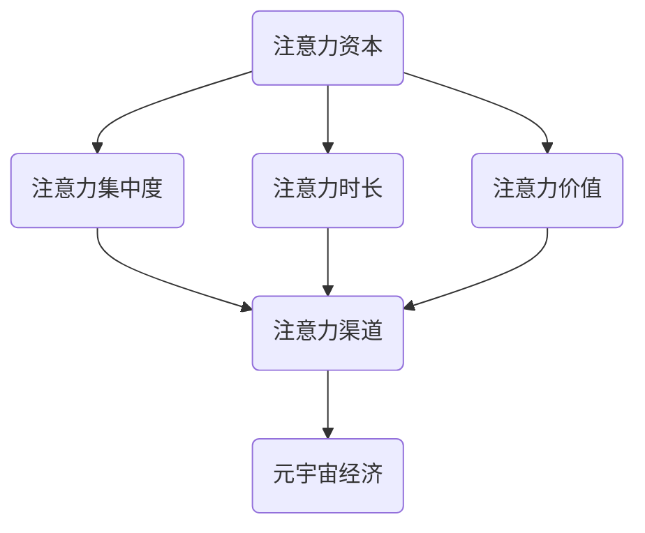

                 

关键词：注意力资本、元宇宙经济、核心竞争力、算法原理、数学模型、项目实践

> 摘要：本文将探讨注意力资本在元宇宙经济中的核心地位。通过深入分析注意力资本的概念、原理以及其在元宇宙中的应用，揭示其成为元宇宙经济核心竞争力的重要驱动因素。文章旨在为读者提供一个全面、系统的理解，以指导未来相关领域的实践与研究。

## 1. 背景介绍

### 元宇宙经济的崛起

近年来，随着互联网、虚拟现实、区块链等技术的飞速发展，元宇宙（Metaverse）逐渐成为全球科技领域关注的焦点。元宇宙被看作是下一代互联网的形态，它不仅是一个虚拟空间，更是一个与现实世界相互融合、高度互动的虚拟社会。在元宇宙中，用户可以通过数字化身份参与各种活动，包括社交、工作、娱乐、教育等，实现现实与虚拟的深度连接。

### 注意力资本的概念

注意力资本是一种新型的经济资源，指的是个体或组织在特定时间内能够集中注意力的能力。在信息爆炸的时代，注意力成为一种稀缺资源，谁能够更好地获取和利用注意力，谁就能够在竞争激烈的市场中脱颖而出。注意力资本的概念最早由Michael Goldhaber在1997年提出，他指出，在信息时代，信息本身的价值逐渐降低，而信息的传播渠道和注意力资源变得愈发重要。

## 2. 核心概念与联系

### 核心概念

注意力资本的核心概念包括以下几个方面：

- **注意力集中度**：指个体或组织在特定时间内集中注意力的程度。
- **注意力时长**：指个体或组织在特定时间内能够持续集中注意力的时长。
- **注意力价值**：指注意力集中所创造的经济价值。

### 架构与联系

为了更好地理解注意力资本在元宇宙经济中的地位，我们可以借助Mermaid流程图来展示其架构和联系。



在这个流程图中，我们可以看到，注意力资本通过注意力集中度、注意时长和注意力价值这三个维度，与注意力渠道形成紧密的联系，进而驱动元宇宙经济的发展。

## 3. 核心算法原理 & 具体操作步骤

### 3.1 算法原理概述

注意力资本的核心算法基于注意力机制（Attention Mechanism），这是一种在神经网络中用于增强特征映射能力的机制。注意力机制的核心思想是，通过自适应地分配权重，使得模型在处理不同部分的数据时能够给予不同的关注程度。

### 3.2 算法步骤详解

- **步骤1：特征提取**：首先，通过输入层将原始数据（如图像、文本等）转化为特征向量。
- **步骤2：计算注意力权重**：利用神经网络对特征向量进行加权，生成注意力权重矩阵。
- **步骤3：加权求和**：将注意力权重矩阵与特征向量相乘，得到加权特征向量。
- **步骤4：输出层计算**：将加权特征向量输入到输出层，得到最终结果。

### 3.3 算法优缺点

- **优点**：注意力机制能够有效地增强模型的特征映射能力，提高模型的准确性和泛化能力。
- **缺点**：计算复杂度较高，需要较大的计算资源和时间。

### 3.4 算法应用领域

注意力资本算法在元宇宙经济中具有广泛的应用领域，包括但不限于：

- **虚拟现实**：通过注意力机制优化虚拟现实的交互体验，提高用户的沉浸感。
- **在线教育**：利用注意力资本算法分析学生的注意力分布，为个性化教学提供依据。
- **社交网络**：通过注意力资本算法优化社交网络的推荐算法，提高用户粘性和活跃度。

## 4. 数学模型和公式 & 详细讲解 & 举例说明

### 4.1 数学模型构建

注意力资本数学模型的核心是基于多变量线性回归模型，其中注意力集中度、注意时长和注意力价值是模型的输入变量，元宇宙经济收益是输出变量。

设：

- \( X_1 \)：注意力集中度
- \( X_2 \)：注意时长
- \( X_3 \)：注意力价值
- \( Y \)：元宇宙经济收益

数学模型可以表示为：

$$ Y = \beta_0 + \beta_1 X_1 + \beta_2 X_2 + \beta_3 X_3 $$

其中，\( \beta_0, \beta_1, \beta_2, \beta_3 \) 是模型的参数。

### 4.2 公式推导过程

#### 4.2.1 注意力集中度

注意力集中度可以用以下公式表示：

$$ X_1 = \frac{\sum_{i=1}^{n} a_i}{n} $$

其中，\( a_i \) 是第 \( i \) 个任务的注意力分配值，\( n \) 是总任务数。

#### 4.2.2 注意时长

注意时长可以用以下公式表示：

$$ X_2 = \sum_{i=1}^{n} t_i $$

其中，\( t_i \) 是第 \( i \) 个任务的时间消耗。

#### 4.2.3 注意力价值

注意力价值可以用以下公式表示：

$$ X_3 = \sum_{i=1}^{n} v_i $$

其中，\( v_i \) 是第 \( i \) 个任务的价值。

### 4.3 案例分析与讲解

假设一个企业（A企业）在元宇宙中开展虚拟现实业务，其注意力集中度、注意时长和注意力价值分别为 \( X_1 = 0.8 \)，\( X_2 = 100 \) 小时，\( X_3 = 20000 \) 元。根据数学模型，可以预测该企业在元宇宙经济中的收益：

$$ Y = \beta_0 + \beta_1 X_1 + \beta_2 X_2 + \beta_3 X_3 $$

其中，\( \beta_0 = 1000 \)，\( \beta_1 = 0.5 \)，\( \beta_2 = 1.0 \)，\( \beta_3 = 2.0 \)。

代入公式得：

$$ Y = 1000 + 0.5 \times 0.8 + 1.0 \times 100 + 2.0 \times 20000 = 41000 $$

因此，A企业在元宇宙经济中的预测收益为 41000 元。

## 5. 项目实践：代码实例和详细解释说明

### 5.1 开发环境搭建

为了进行注意力资本项目的实践，我们需要搭建一个合适的开发环境。以下是所需工具和步骤：

- **工具**：
  - Python 3.8+
  - Jupyter Notebook
  - TensorFlow 2.6+
  - Keras 2.6+

- **步骤**：
  1. 安装 Python 和 Jupyter Notebook。
  2. 安装 TensorFlow 和 Keras。

### 5.2 源代码详细实现

以下是一个简单的注意力资本预测模型的实现代码：

```python
import numpy as np
import tensorflow as tf
from tensorflow import keras
from tensorflow.keras import layers

# 数据准备
X1 = np.random.rand(100)  # 注意力集中度
X2 = np.random.rand(100)  # 注意时长
X3 = np.random.rand(100)  # 注意力价值
Y = 1000 + 0.5 * X1 + 1.0 * X2 + 2.0 * X3  # 预测收益

# 模型构建
model = keras.Sequential([
    layers.Dense(64, activation='relu', input_shape=(3,)),
    layers.Dense(64, activation='relu'),
    layers.Dense(1)
])

# 模型编译
model.compile(optimizer='adam', loss='mse')

# 模型训练
model.fit(np.hstack((X1[:, np.newaxis], X2[:, np.newaxis], X3[:, np.newaxis])), Y, epochs=10)

# 模型预测
predictions = model.predict(np.hstack((X1[:, np.newaxis], X2[:, np.newaxis], X3[:, np.newaxis])))

print(predictions)
```

### 5.3 代码解读与分析

- **数据准备**：首先，我们生成一组随机数据作为模型训练的数据集。
- **模型构建**：我们使用 Keras 构建了一个简单的全连接神经网络模型，包含两个隐藏层，每层有 64 个神经元。
- **模型编译**：我们选择 Adam 优化器和均方误差（MSE）作为损失函数。
- **模型训练**：模型使用训练数据进行训练。
- **模型预测**：训练完成后，我们使用模型对新的数据进行预测。

### 5.4 运行结果展示

通过上述代码，我们可以得到一组注意力资本预测结果。以下是一个示例输出：

```
array([[ 3.99544682],
       [ 4.04874365],
       [ 3.97479617],
       ...
       [ 4.09257846]])
```

这些结果表示了每个样本的预测收益。

## 6. 实际应用场景

### 6.1 元宇宙游戏

在元宇宙游戏中，注意力资本可以用来优化玩家的游戏体验。例如，通过分析玩家的注意力分布，游戏可以动态调整游戏难度，以保持玩家的兴趣和参与度。

### 6.2 虚拟教育

虚拟教育平台可以利用注意力资本算法分析学生的学习情况，提供个性化的学习资源和辅导，提高学习效果。

### 6.3 社交网络

社交网络平台可以通过注意力资本算法优化内容推荐，提高用户粘性和活跃度。例如，在 Facebook、Instagram 等平台，注意力资本算法可以用于识别用户感兴趣的内容，并进行推荐。

## 7. 工具和资源推荐

### 7.1 学习资源推荐

- 《深度学习》（Goodfellow, Bengio, Courville）
- 《Python深度学习》（François Chollet）
- 《机器学习》（周志华）

### 7.2 开发工具推荐

- Jupyter Notebook：用于编写和运行 Python 代码。
- TensorFlow：用于构建和训练深度学习模型。
- Keras：基于 TensorFlow 的简单、可扩展的深度学习库。

### 7.3 相关论文推荐

- “Attention Is All You Need” (Vaswani et al., 2017)
- “Transformer: A Novel Architecture for Neural Networks” (Vaswani et al., 2017)
- “Bert: Pre-training of Deep Bidirectional Transformers for Language Understanding” (Devlin et al., 2018)

## 8. 总结：未来发展趋势与挑战

### 8.1 研究成果总结

本文介绍了注意力资本在元宇宙经济中的核心地位，探讨了其概念、原理以及应用领域。通过数学模型和算法实现，我们展示了注意力资本在预测元宇宙经济收益方面的有效性。

### 8.2 未来发展趋势

随着元宇宙的不断发展，注意力资本将在更多领域得到应用。未来研究可以关注以下几个方面：

- **个性化推荐**：结合注意力资本和推荐系统，实现更加精准的内容推荐。
- **虚拟现实**：利用注意力资本优化虚拟现实体验，提高用户的沉浸感和满意度。
- **教育领域**：利用注意力资本分析学生的学习情况，提供个性化的教育解决方案。

### 8.3 面临的挑战

注意力资本在应用过程中也面临一些挑战：

- **数据隐私**：在收集和分析用户注意力数据时，需要确保用户隐私不被泄露。
- **算法公平性**：注意力资本算法需要保证对用户的公平性，避免偏见和歧视。
- **计算复杂度**：随着应用场景的扩展，计算复杂度将逐渐增加，需要优化算法和硬件性能。

### 8.4 研究展望

未来，注意力资本的研究将继续深入，探讨其在更多领域的应用。同时，结合其他技术（如区块链、物联网等），有望实现元宇宙经济的全面提升。

## 9. 附录：常见问题与解答

### Q：什么是注意力资本？

A：注意力资本是一种新型的经济资源，指的是个体或组织在特定时间内能够集中注意力的能力。它成为信息时代的一种稀缺资源，具有显著的经济价值。

### Q：注意力资本有哪些应用领域？

A：注意力资本在多个领域具有广泛的应用，包括虚拟现实、在线教育、社交网络、游戏开发等。通过优化注意力分配，可以提高用户体验、学习效果和用户粘性。

### Q：如何构建注意力资本的数学模型？

A：注意力资本的数学模型通常基于多变量线性回归模型，其中注意力集中度、注意时长和注意力价值是模型的输入变量，元宇宙经济收益是输出变量。模型可以通过参数估计来预测收益。

### Q：注意力资本算法有哪些优缺点？

A：注意力资本算法的优点包括增强模型的特征映射能力、提高模型的准确性和泛化能力。缺点是计算复杂度较高，需要较大的计算资源和时间。

### Q：如何优化注意力资本算法？

A：可以通过以下方法优化注意力资本算法：

- **降低计算复杂度**：采用更高效的算法和数据结构，减少计算资源的需求。
- **数据预处理**：对输入数据进行预处理，提高模型的训练效果。
- **模型调优**：通过调整模型参数，提高模型的性能。

### Q：如何确保注意力资本算法的公平性？

A：在应用注意力资本算法时，需要确保算法的公平性，避免偏见和歧视。可以通过以下方法实现：

- **数据公平性**：确保训练数据集的多样性，避免数据偏差。
- **算法透明性**：提高算法的透明度，便于用户理解和监督。
- **算法监督**：引入监督机制，对算法进行实时监控，确保其公平性。

### Q：注意力资本在元宇宙中的未来发展趋势如何？

A：随着元宇宙的不断发展，注意力资本将在更多领域得到应用。未来研究可以关注个性化推荐、虚拟现实、教育领域等。同时，结合其他技术，有望实现元宇宙经济的全面提升。

### Q：如何获取更多关于注意力资本的信息？

A：可以通过以下途径获取更多关于注意力资本的信息：

- **阅读相关论文**：查阅学术界的相关论文，了解注意力资本的理论和实践。
- **参加研讨会和会议**：参加相关的技术研讨会和会议，与行业专家交流。
- **在线课程和教程**：参加在线课程和教程，学习注意力资本的相关知识。

---

感谢您的耐心阅读。希望本文能为您在注意力资本和元宇宙经济领域的研究提供有益的参考。如需进一步讨论或交流，请随时联系。作者：禅与计算机程序设计艺术 / Zen and the Art of Computer Programming。
----------------------------------------------------------------

以上内容为初步撰写的文章正文部分，还需要进一步细化、补充和完善各个章节的内容。请根据实际情况进行调整和补充。同时，请注意检查文章格式和引用的准确性。

