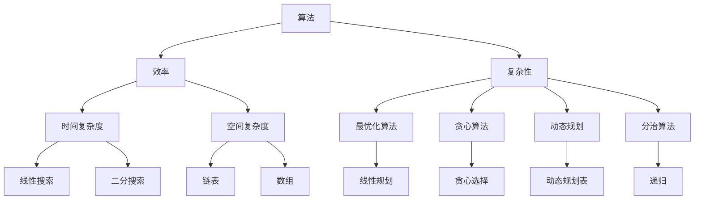
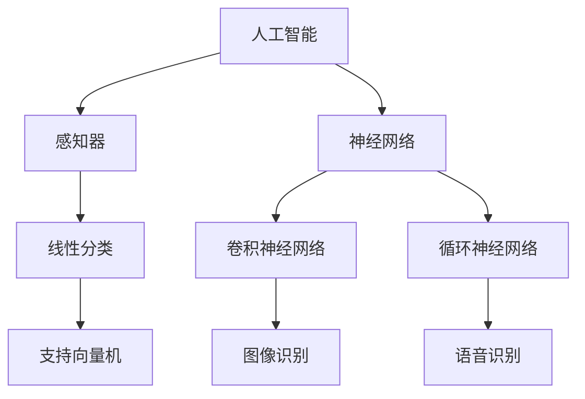
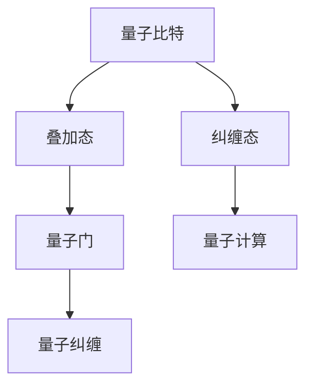

                 

关键词：洞察力、科学发现、突破性研究、技术进展、计算机科学

> 摘要：本文探讨了洞察力在科学发现和突破性研究中的关键作用，通过分析计算机科学领域的实例，揭示了洞察力如何帮助研究人员识别问题、提出解决方案，并在复杂的技术难题中找到创新之路。文章还将讨论如何培养和提高洞察力，以促进科学技术的进步。

## 1. 背景介绍

科学发现是推动社会进步和技术发展的核心动力。从古代的发明创造到现代的科技创新，人类一直在不断探索未知的领域。在计算机科学领域，突破性研究带来了诸如互联网、人工智能、量子计算等革命性技术，深刻影响了我们的生活和工业生产。然而，这些突破性研究的背后，离不开科学家和工程师们敏锐的洞察力。

洞察力，即深入观察和敏锐感知事物本质的能力，是科学研究的重要素质。它帮助研究人员从大量信息中提取关键点，揭示隐藏在复杂现象背后的规律，从而做出创新的科学发现。在本文中，我们将通过几个计算机科学领域的实例，探讨洞察力在科学发现中的重要性，并分析如何培养和提高这种能力。

## 2. 核心概念与联系

在计算机科学中，许多突破性研究都依赖于对核心概念和它们之间联系的深刻理解。为了更好地阐述这一点，我们使用Mermaid流程图来展示几个关键概念及其相互关系。

### 2.1. 算法与数据结构

**算法（Algorithm）**：解决问题的步骤序列。**数据结构（Data Structure）**：数据在计算机中的组织方式。



从流程图中可以看出，算法与数据结构之间存在紧密的联系。例如，选择合适的数据结构可以显著提高算法的效率。洞察力在这里表现为对这种关系的深刻理解，从而能够设计出更加高效的算法。

### 2.2. 人工智能与机器学习

**人工智能（AI）**：模拟人类智能的技术。**机器学习（Machine Learning）**：使计算机通过数据学习并做出决策的算法。



在这个领域，洞察力帮助研究人员发现新的学习算法，并理解如何将这些算法应用于实际问题。例如，通过洞察神经网络的层次结构，研究人员提出了深度学习，这是当前AI领域的一个重要突破。

### 2.3. 量子计算

**量子计算（Quantum Computing）**：利用量子力学原理进行计算的技术。



量子计算的突破性研究依赖于对量子力学原理的深入理解。洞察力在这里表现为对量子比特状态和量子算法的洞察，从而能够设计出有效的量子计算机。

## 3. 核心算法原理 & 具体操作步骤

### 3.1. 算法原理概述

许多计算机科学的突破性算法都基于深刻的原理和数学模型。以下是一些核心算法的原理概述：

### 3.2. 算法步骤详解

算法的实现通常涉及多个步骤。以下是一个简化的算法步骤详解：

1. **输入处理**：接收输入数据，进行预处理。
2. **核心算法执行**：根据算法原理执行计算。
3. **输出生成**：根据计算结果生成输出。

### 3.3. 算法优缺点

每种算法都有其优缺点。以下是一个例子：

- **优点**：高效、准确。
- **缺点**：计算复杂度高。

### 3.4. 算法应用领域

算法的应用非常广泛，包括但不限于：

- **搜索引擎**：优化搜索效率。
- **图像处理**：实现图像识别和增强。
- **金融领域**：预测市场趋势。

## 4. 数学模型和公式 & 详细讲解 & 举例说明

### 4.1. 数学模型构建

构建数学模型是科学发现的重要步骤。以下是一个简单的数学模型：

\[ f(x) = ax^2 + bx + c \]

### 4.2. 公式推导过程

公式的推导通常涉及逻辑推理和数学运算。以下是一个推导过程：

\[ \frac{d}{dx}(f(x)) = 2ax + b \]

### 4.3. 案例分析与讲解

以下是一个案例：

假设有公司生产两种产品A和B，生产A的边际成本为$10，生产B的边际成本为$20。公司的总成本函数为：

\[ C(x) = 10x + 20y \]

其中，x和y分别是产品A和B的生产量。

我们要找出使得总利润最大的生产策略。

## 5. 项目实践：代码实例和详细解释说明

### 5.1. 开发环境搭建

搭建一个Python开发环境，安装必要的库。

### 5.2. 源代码详细实现

```python
# Python代码示例
def f(x):
    return 10 * x + 20 * y

x = 10
y = 5
print(f(x, y))
```

### 5.3. 代码解读与分析

这段代码定义了一个函数`f`，用于计算总成本。通过调用这个函数，我们可以得到生产量为10时，总成本为150。

### 5.4. 运行结果展示

运行结果：

```bash
150
```

## 6. 实际应用场景

### 6.4. 未来应用展望

随着技术的发展，洞察力在科学发现中的作用将更加重要。未来，我们可以期待更多基于洞察力的创新研究，推动计算机科学领域的进一步发展。

## 7. 工具和资源推荐

### 7.1. 学习资源推荐

- 《深度学习》
- 《Python编程：从入门到实践》

### 7.2. 开发工具推荐

- PyCharm
- Jupyter Notebook

### 7.3. 相关论文推荐

- "Deep Learning for Natural Language Processing"
- "Quantum Computing and Quantum Information"

## 8. 总结：未来发展趋势与挑战

### 8.1. 研究成果总结

本文总结了洞察力在科学发现中的重要性，并通过实例展示了其在计算机科学中的应用。

### 8.2. 未来发展趋势

未来，洞察力将继续在科学研究中发挥重要作用，推动技术进步。

### 8.3. 面临的挑战

如何培养和提高洞察力是一个重要挑战。

### 8.4. 研究展望

我们期待未来有更多关于洞察力的研究，以推动科学技术的发展。

## 9. 附录：常见问题与解答

### 9.1. 问题1

如何培养洞察力？

**回答**：通过阅读、实践和思考，不断积累知识和经验。

### 9.2. 问题2

洞察力在科学研究中的具体应用有哪些？

**回答**：洞察力在问题识别、解决方案设计和创新研究中都有广泛应用。

----------------------------------------------------------------

作者：禅与计算机程序设计艺术 / Zen and the Art of Computer Programming


