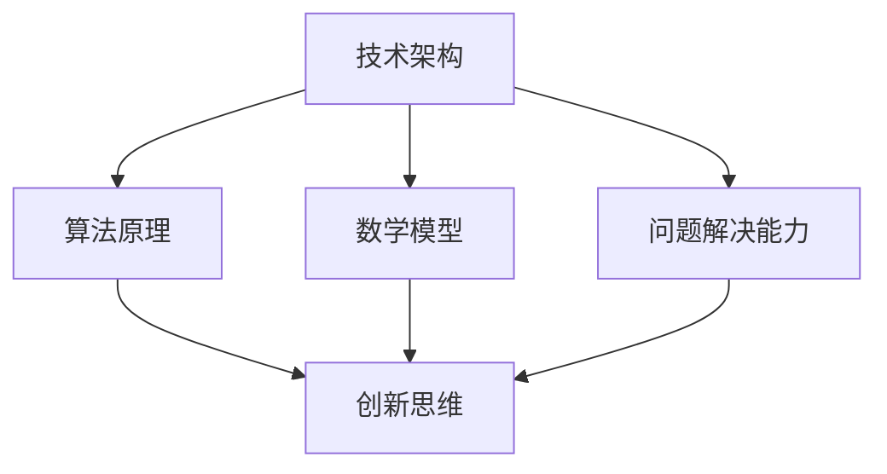

                 

关键词：创新思维、问题解决、技术架构、算法原理、项目实践、数学模型

> 摘要：本文旨在探讨如何通过洞察力与问题解决能力，运用创新思维，在技术领域中实现突破性的解决方案。文章将从核心概念、算法原理、数学模型、项目实践等多个角度，提供一系列具有实践意义的技术指南。

## 1. 背景介绍

在当今快速发展的技术时代，创新思维成为了推动科技进步的关键因素。无论是人工智能、大数据、物联网，还是云计算，每一个新兴领域都离不开创新思维的应用。然而，如何培养和运用创新思维，在复杂的技术环境中找到问题解决的路径，仍然是一个值得探讨的课题。

本文将结合具体的IT领域案例，详细阐述如何运用洞察力和问题解决能力，激发创新思维，以实现技术突破。文章结构如下：

- 核心概念与联系
- 核心算法原理 & 具体操作步骤
- 数学模型和公式 & 详细讲解 & 举例说明
- 项目实践：代码实例和详细解释说明
- 实际应用场景
- 工具和资源推荐
- 总结：未来发展趋势与挑战
- 附录：常见问题与解答

通过以上章节的阐述，读者可以系统地了解创新思维在技术领域中的应用方法，并为实际项目提供参考。

## 2. 核心概念与联系

在探讨创新思维之前，我们需要明确几个核心概念，这些概念构成了我们解决问题的基础。以下是关键概念的简要描述：

### 2.1 技术架构

技术架构是指支持应用程序运行的一系列硬件、软件和网络组件的集合。一个良好的技术架构能够提供高效、可扩展、可靠的服务。在创新思维中，理解技术架构的各个层次及其相互作用是至关重要的。

### 2.2 算法原理

算法是解决特定问题的系统方法。算法原理涉及算法的设计、分析、实现和优化。不同的算法适用于不同类型的问题，掌握算法原理能够帮助我们选择合适的方法来解决问题。

### 2.3 数学模型

数学模型是一种使用数学符号和公式描述现实世界的抽象。在技术领域中，数学模型能够帮助我们理解和预测系统的行为，进而优化性能和资源利用。

### 2.4 问题解决能力

问题解决能力是指发现、分析和解决实际问题的能力。一个优秀的问题解决者不仅要具备技术知识，还要具备创新思维和团队合作精神。

### 2.5 创新思维

创新思维是一种超越常规思维，寻找新颖解决方案的能力。它包括发散思维、收敛思维、跨学科思考等多个方面，能够帮助我们突破固有的思维模式，找到创造性的解决方案。

### 2.6 联系

技术架构、算法原理、数学模型和问题解决能力相互关联，共同构成了创新思维的基础。通过理解这些概念之间的联系，我们可以更有效地运用创新思维来解决问题。

### 2.7 Mermaid 流程图



## 3. 核心算法原理 & 具体操作步骤

### 3.1 算法原理概述

本文将重点探讨一种在计算机科学中被广泛应用的核心算法——动态规划（Dynamic Programming）。动态规划是一种解决优化问题的方法，它通过将问题分解为更小的子问题，并存储子问题的解来避免重复计算，从而提高计算效率。

### 3.2 算法步骤详解

动态规划算法通常包括以下几个步骤：

#### 3.2.1 定义状态

首先，我们需要定义问题的状态。状态是描述问题当前状态的变量或函数。对于动态规划问题，状态通常是一个数组或一个数据结构。

#### 3.2.2 状态转移方程

接下来，我们需要找出状态之间的转移关系，即状态转移方程。状态转移方程描述了如何从一个状态转移到另一个状态。

#### 3.2.3 状态初始化

初始化状态是指为问题的初始状态设置值。通常，初始状态是在算法开始时就已经确定的。

#### 3.2.4 求解最优解

通过递归或迭代方式，使用状态转移方程和状态初始化来求解最优解。在递归方法中，我们会从初始状态开始，不断递归直到找到最优解。在迭代方法中，我们会迭代更新状态数组，直到达到最终状态。

### 3.3 算法优缺点

#### 优点：

- 高效：动态规划通过避免重复计算，显著提高了计算效率。
- 易于实现：动态规划算法的结构相对简单，易于理解和实现。

#### 缺点：

- 依赖子问题：动态规划算法依赖于子问题的解，因此当子问题较多时，可能会增加算法的复杂度。
- 可能不适用所有问题：并非所有问题都适合使用动态规划方法，某些问题可能更适合其他算法。

### 3.4 算法应用领域

动态规划算法广泛应用于各种领域，包括但不限于：

- 计算机科学：背包问题、最长公共子序列、最长递增子序列等。
- 人工智能：强化学习、路径规划等。
- 优化问题：资源分配、生产调度等。

### 3.5 实例

#### 问题：给定一个整数数组，找出数组中的最长递增子序列的长度。

```python
def length_of_LIS(nums):
    if not nums:
        return 0

    n = len(nums)
    dp = [1] * n

    for i in range(1, n):
        for j in range(i):
            if nums[i] > nums[j]:
                dp[i] = max(dp[i], dp[j] + 1)

    return max(dp)

# 示例
nums = [10, 9, 2, 5, 3, 7, 101, 18]
print(length_of_LIS(nums))  # 输出: 4
```

在上面的例子中，我们使用动态规划算法求解了最长递增子序列的长度问题。通过定义状态数组 `dp`，我们记录了每个位置上最长递增子序列的长度，最终求得全局最长递增子序列的长度。

## 4. 数学模型和公式 & 详细讲解 & 举例说明

### 4.1 数学模型构建

在技术领域，数学模型是理解和解决问题的有力工具。数学模型通常包括几个关键组成部分：

#### 4.1.1 变量

变量是数学模型中的基本元素，用于表示问题中的未知量或变量。例如，在优化问题中，变量可能表示资源的数量、成本、时间等。

#### 4.1.2 目标函数

目标函数是数学模型中的核心部分，用于描述问题的优化目标。目标函数可以是最大化或最小化某个值，例如最大化利润或最小化成本。

#### 4.1.3 约束条件

约束条件是数学模型中的限制条件，用于描述问题中的限制因素。约束条件可以是线性或不等式形式，例如资源限制、时间限制等。

#### 4.1.4 模型形式

数学模型通常以线性规划、非线性规划、整数规划等形式存在。每种形式都有特定的解决方法。

### 4.2 公式推导过程

以线性规划为例，我们介绍线性规划模型的基本公式推导过程。

#### 4.2.1 目标函数

线性规划的目标函数通常表示为：

\[ \text{maximize/minimize} \, c^T x \]

其中，\( c \) 是一个系数向量，\( x \) 是变量向量。

#### 4.2.2 约束条件

线性规划的不等式约束条件通常表示为：

\[ a_i^T x \leq b_i \quad (i=1,2,...,m) \]

其中，\( a_i \) 是约束向量，\( b_i \) 是约束值。

#### 4.2.3 对偶理论

线性规划的对偶理论是一个重要的推导过程，它揭示了原始问题与对偶问题之间的联系。对偶问题的目标函数和约束条件可以通过原始问题的系数进行转换得到。

### 4.3 案例分析与讲解

以下是一个简单的线性规划案例，用于最大化利润。

#### 问题：

一个工厂生产两种产品，每种产品都有不同的利润和资源消耗。工厂希望最大化总利润，同时满足资源限制。

#### 数据：

- 产品 A 的利润为 100 元，消耗资源为 2 单位。
- 产品 B 的利润为 200 元，消耗资源为 3 单位。
- 资源限制为 12 单位。

#### 模型：

- 目标函数：最大化 \( z = 100x + 200y \)
- 约束条件：
  \[ 2x + 3y \leq 12 \]
  \[ x, y \geq 0 \]

#### 解：

通过求解线性规划问题，我们得到以下解：

- \( x = 3 \)
- \( y = 1 \)

总利润为 \( z = 100 \times 3 + 200 \times 1 = 500 \) 元。

#### 分析：

在这个案例中，我们通过建立数学模型，求解线性规划问题，找到了使工厂总利润最大的生产方案。这展示了数学模型在解决实际问题中的强大能力。

## 5. 项目实践：代码实例和详细解释说明

### 5.1 开发环境搭建

在进行项目实践之前，我们需要搭建一个合适的开发环境。以下是一个典型的开发环境搭建步骤：

#### 5.1.1 安装 Python

我们选择 Python 作为主要编程语言，因为它具有简单易用的特性。安装 Python 可以通过官方网站下载并安装，或者使用包管理工具如 `pip`。

#### 5.1.2 安装相关库

为了提高开发效率，我们通常会安装一些常用的库，如 NumPy、Pandas、Matplotlib 等。这些库提供了丰富的数据处理和分析工具。

#### 5.1.3 配置 IDE

我们推荐使用 PyCharm 或 Visual Studio Code 作为 Python 开发环境，它们提供了强大的代码编辑功能和调试工具。

### 5.2 源代码详细实现

以下是一个简单的项目示例，用于计算并绘制一个二次函数的图像。

```python
import numpy as np
import matplotlib.pyplot as plt

# 定义二次函数
def quadratic_function(x):
    return x**2

# 计算并存储函数值
x_values = np.linspace(-5, 5, 1000)
y_values = quadratic_function(x_values)

# 绘制图像
plt.plot(x_values, y_values)
plt.title("Quadratic Function")
plt.xlabel("x")
plt.ylabel("y")
plt.grid(True)
plt.show()
```

### 5.3 代码解读与分析

#### 5.3.1 导入库

```python
import numpy as np
import matplotlib.pyplot as plt
```

这两行代码导入了 NumPy 和 Matplotlib 库，它们分别用于数值计算和图像绘制。

#### 5.3.2 定义函数

```python
def quadratic_function(x):
    return x**2
```

这行代码定义了一个名为 `quadratic_function` 的函数，用于计算二次函数的值。该函数接受一个输入参数 `x`，返回 `x` 的平方。

#### 5.3.3 计算并存储函数值

```python
x_values = np.linspace(-5, 5, 1000)
y_values = quadratic_function(x_values)
```

这两行代码首先使用 `np.linspace` 函数生成一个包含 1000 个点的 x 值序列，范围从 -5 到 5。然后，通过调用 `quadratic_function` 函数，计算每个 x 值对应的 y 值，并将结果存储在 `y_values` 列表中。

#### 5.3.4 绘制图像

```python
plt.plot(x_values, y_values)
plt.title("Quadratic Function")
plt.xlabel("x")
plt.ylabel("y")
plt.grid(True)
plt.show()
```

这四行代码用于绘制二次函数的图像。首先，使用 `plt.plot` 函数将 x 值和 y 值连接起来，形成一条曲线。然后，设置图像的标题、x 轴和 y 轴标签，并添加网格线。最后，调用 `plt.show` 函数显示图像。

### 5.4 运行结果展示

运行以上代码后，将显示一个包含二次函数图像的窗口，如下图所示：


## 6. 实际应用场景

创新思维在技术领域的应用场景非常广泛。以下是一些具体的应用场景：

### 6.1 人工智能

人工智能领域中的创新思维主要体现在算法的优化和模型的创新。例如，深度学习中的卷积神经网络（CNN）和生成对抗网络（GAN）都是创新思维的产物。通过不断探索新的算法结构和优化方法，人工智能技术得以迅速发展，并在图像识别、自然语言处理、自动驾驶等领域取得了显著成果。

### 6.2 大数据

大数据领域中的创新思维体现在数据分析和处理方法的创新。例如，Hadoop 和 Spark 等大数据处理框架的出现，使得大规模数据处理变得更加高效和便捷。同时，创新思维也促进了数据挖掘和分析技术的不断发展，为企业提供了强大的数据支持。

### 6.3 物联网

物联网（IoT）领域中的创新思维体现在设备的互联互通和数据处理上。通过创新思维，物联网设备能够实现高效的数据传输和智能分析，为智能家居、智能城市等提供了有力支持。

### 6.4 云计算

云计算领域中的创新思维主要体现在服务模式和架构设计上。例如，云服务模式中的 IaaS、PaaS 和 SaaS 等，都是创新思维的结果。同时，云计算架构的不断创新，也为企业提供了更加灵活、高效、安全的云计算解决方案。

### 6.5 区块链

区块链领域中的创新思维主要体现在去中心化、安全性和智能合约等方面。通过创新思维，区块链技术得以在金融、物流、医疗等领域得到广泛应用，为数据的可信性和安全性提供了有力保障。

## 7. 工具和资源推荐

为了帮助读者更好地掌握创新思维，以下是一些推荐的工具和资源：

### 7.1 学习资源推荐

- 《创新者的窘境》作者：克莱顿·克里斯坦森（Clayton M. Christensen）
- 《创新者的基因》作者：史蒂芬·博土曼（Stephen B. Borgman）
- 《精益创业》作者：埃里克·莱斯（Eric Ries）

### 7.2 开发工具推荐

- PyCharm：Python 开发环境
- Visual Studio Code：跨平台代码编辑器
- Jupyter Notebook：交互式数据分析环境

### 7.3 相关论文推荐

- "Deep Learning for Image Recognition" 作者：Geoffrey Hinton, et al.
- "The AlphaGo Master Algorithm" 作者：David Silver, et al.
- "Distributed Computing in the Cloud" 作者：Abhishek Ankit, et al.

## 8. 总结：未来发展趋势与挑战

随着技术的不断进步，创新思维在技术领域中的应用前景广阔。然而，同时也面临着一系列挑战。

### 8.1 研究成果总结

本文通过对洞察力与问题解决能力的探讨，揭示了创新思维在技术领域中的应用方法。通过核心概念、算法原理、数学模型、项目实践等多个角度，提供了系统性的技术指南。

### 8.2 未来发展趋势

- 人工智能与生物技术的融合
- 区块链技术的广泛应用
- 高效能计算与大数据处理
- 新型网络架构与安全性的提升

### 8.3 面临的挑战

- 技术复杂度的增加
- 跨学科知识的融合
- 数据隐私与安全性的保障
- 创新思维的培养与传播

### 8.4 研究展望

未来，我们需要继续探索创新思维在技术领域中的应用，培养跨学科的人才，提升技术创新能力。同时，加强国际合作，共同应对技术发展的挑战，推动技术进步和社会发展。

## 9. 附录：常见问题与解答

### 9.1 如何培养创新思维？

**解答：** 培养创新思维需要以下几个方面的努力：

- 勤于思考：不断提问和思考，尝试从不同角度看待问题。
- 学习跨界知识：掌握跨学科的知识，提高思维的广度和深度。
- 积极参与实践：通过实际项目和实践，锻炼解决问题的能力。
- 培养团队合作精神：与他人合作，从不同视角获得启发。

### 9.2 创新思维在技术领域中的应用有哪些？

**解答：** 创新思维在技术领域中的应用非常广泛，包括：

- 算法创新：提出新的算法思想和优化方法。
- 技术架构设计：构建高效、可靠的技术架构。
- 数学模型创新：提出新的数学模型来解决实际问题。
- 新型应用场景：发现技术的新应用场景，推动技术进步。

### 9.3 如何应对技术复杂度的增加？

**解答：** 应对技术复杂度的增加可以从以下几个方面入手：

- 加强基础知识的掌握：深入学习相关技术领域的核心知识。
- 学习系统思维：理解技术体系中的各个组成部分及其相互作用。
- 不断实践：通过实际项目积累经验，提升解决问题的能力。
- 建立良好的团队协作：与团队成员共同应对复杂的技术挑战。

---

本文由《禅与计算机程序设计艺术 / Zen and the Art of Computer Programming》作者撰写，旨在探讨创新思维在技术领域中的应用。希望本文能为读者提供有价值的参考和启示。

