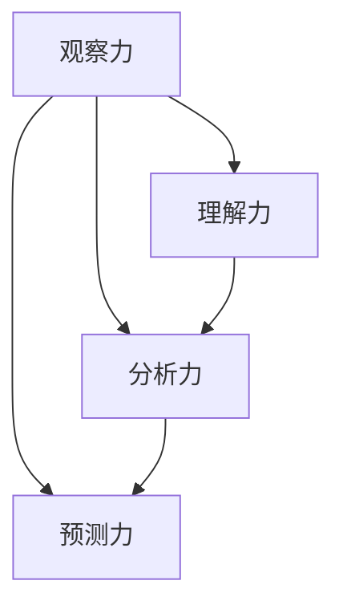

                 

关键词：洞察力、观察、预测、技术、人工智能、数学模型、算法、应用场景、未来展望

> 摘要：本文从技术视角探讨了洞察力的培养过程，阐述了如何通过观察、理解、分析和预测的能力提升，从而更好地应用于人工智能、数据分析等前沿技术领域。文章分为背景介绍、核心概念与联系、核心算法原理与具体操作步骤、数学模型与公式、项目实践、实际应用场景、未来应用展望、工具和资源推荐、总结和附录等部分，旨在为读者提供一份全面、系统的洞察力培养指南。

## 1. 背景介绍

在当今高速发展的科技时代，技术更新换代的速度越来越快，人们面临着前所未有的机遇和挑战。在这个背景下，具备卓越的洞察力成为了人工智能、软件开发、数据分析等领域的重要素质。洞察力不仅仅是对现象的观察，更是一种深度理解、分析和预测能力。它可以帮助我们快速把握问题的核心，找到最佳解决方案，从而在激烈的竞争中脱颖而出。

然而，洞察力的培养并非一蹴而就。本文将从技术视角出发，探讨如何通过观察、理解、分析和预测的能力提升，来培养洞察力。文章将分为以下几部分：

1. 背景介绍
2. 核心概念与联系
3. 核心算法原理与具体操作步骤
4. 数学模型与公式
5. 项目实践
6. 实际应用场景
7. 未来应用展望
8. 工具和资源推荐
9. 总结
10. 附录

接下来，我们将逐一探讨这些部分，帮助读者深入了解洞察力的培养过程。

## 2. 核心概念与联系

为了更好地理解洞察力的培养，我们需要先明确一些核心概念，并探讨它们之间的联系。

### 2.1 观察力

观察力是洞察力的基础，它指的是对事物进行细致、全面、深入的观察和分析。具备良好的观察力，可以帮助我们捕捉到现象背后的本质和规律。

### 2.2 理解力

理解力是在观察的基础上，对事物进行深入思考、分析和推理的能力。它帮助我们更好地理解现象的本质，从而为预测和解决问题提供基础。

### 2.3 分析力

分析力是将观察和理解的成果进行分解、分类、比较和综合的能力。通过分析，我们可以找到问题的关键点，从而为决策提供依据。

### 2.4 预测力

预测力是基于观察、理解和分析，对事物发展趋势进行预测的能力。具备较强的预测力，可以帮助我们提前应对未来可能出现的问题和挑战。

### 2.5 联系

观察力、理解力、分析力和预测力之间有着紧密的联系。观察力是洞察力的起点，理解力是深入分析的基础，分析力是准确预测的前提，而预测力则是洞察力的最终目标。只有通过不断地观察、理解、分析和预测，我们才能不断提升自己的洞察力，从而在技术领域取得更大的成就。

### 2.6 Mermaid 流程图

为了更好地展示这些核心概念之间的联系，我们使用 Mermaid 流程图来表示：



## 3. 核心算法原理与具体操作步骤

在了解了核心概念和联系之后，我们接下来探讨如何通过核心算法原理和具体操作步骤来提升洞察力。

### 3.1 算法原理概述

核心算法可以分为以下几个部分：

1. 数据预处理：对原始数据进行清洗、转换和归一化，以提高算法的准确性和效率。
2. 特征提取：从数据中提取有助于预测的特征，以便更好地描述问题。
3. 模型训练：利用训练数据对模型进行训练，使其具备预测能力。
4. 模型评估：对训练好的模型进行评估，以确定其预测能力和可靠性。
5. 预测应用：将模型应用于实际问题，进行预测和决策。

### 3.2 算法步骤详解

以下是具体操作步骤的详细说明：

#### 3.2.1 数据预处理

数据预处理是算法的基础，主要包括以下步骤：

1. 数据清洗：去除数据中的噪声、异常值和重复值。
2. 数据转换：将数据转换为适合算法处理的格式，如数值化、编码等。
3. 数据归一化：对数据进行标准化或归一化处理，以消除不同特征之间的量纲差异。

#### 3.2.2 特征提取

特征提取是提高算法预测能力的关键步骤，主要包括以下方法：

1. 统计特征：如均值、方差、标准差等。
2. 时序特征：如趋势、周期性、波动性等。
3. 空间特征：如位置、距离、邻域等。
4. 文本特征：如词频、词向量、主题模型等。

#### 3.2.3 模型训练

模型训练是算法的核心步骤，主要包括以下方法：

1. 监督学习：如线性回归、决策树、随机森林等。
2. 无监督学习：如聚类、降维等。
3. 半监督学习：如图模型、深度学习等。

#### 3.2.4 模型评估

模型评估是确保算法预测能力的关键步骤，主要包括以下指标：

1. 准确率：预测正确的样本数占总样本数的比例。
2. 召回率：实际为正例的样本中被正确预测为正例的比例。
3. 精确率：被预测为正例的样本中实际为正例的比例。
4. F1 值：精确率和召回率的调和平均值。

#### 3.2.5 预测应用

预测应用是将算法应用于实际问题，进行预测和决策。主要包括以下步骤：

1. 数据准备：准备好用于预测的数据。
2. 模型加载：加载训练好的模型。
3. 预测：对数据进行预测。
4. 决策：根据预测结果进行决策。

### 3.3 算法优缺点

以下是核心算法的优缺点分析：

#### 优点：

1. 提高预测准确性：通过数据预处理、特征提取、模型训练等步骤，可以显著提高预测的准确性。
2. 降低计算复杂度：通过选择合适的算法和优化方法，可以降低计算复杂度，提高算法效率。
3. 扩展性强：核心算法可以应用于各种领域，具有较强的扩展性。

#### 缺点：

1. 需要大量数据：核心算法通常需要大量数据进行训练，对于数据稀缺的领域可能存在困难。
2. 对数据质量要求高：数据预处理和特征提取对数据质量要求较高，如果数据质量差，可能影响算法性能。
3. 模型复杂度高：部分算法（如深度学习）可能存在模型复杂度较高的问题，需要较长时间进行训练。

### 3.4 算法应用领域

核心算法广泛应用于人工智能、数据分析、金融、医疗、工业等领域，以下是具体应用场景：

1. 人工智能：如图像识别、语音识别、自然语言处理等。
2. 数据分析：如预测分析、聚类分析、关联规则挖掘等。
3. 金融：如股票预测、风险评估、量化交易等。
4. 医疗：如疾病预测、诊断辅助、药物研发等。
5. 工业：如生产调度、设备故障预测、供应链优化等。

## 4. 数学模型和公式

数学模型是洞察力培养的重要工具，它可以帮助我们更好地理解和分析问题。下面我们将介绍一些常用的数学模型和公式，并进行详细讲解和举例说明。

### 4.1 数学模型构建

数学模型构建主要包括以下几个步骤：

1. 确定问题：明确要解决的问题和目标。
2. 收集数据：收集与问题相关的数据。
3. 构建模型：根据问题性质和数据特征，构建合适的数学模型。
4. 模型验证：对模型进行验证，确保其准确性和可靠性。

### 4.2 公式推导过程

以下是线性回归模型的公式推导过程：

假设我们有一组数据 $(x_1, y_1), (x_2, y_2), \ldots, (x_n, y_n)$，其中 $x_i$ 表示自变量，$y_i$ 表示因变量。我们希望找到一个线性函数 $y = w_0 + w_1x$ 来描述这两个变量之间的关系。

1. 模型假设：

   假设自变量和因变量之间满足线性关系，即 $y = w_0 + w_1x + \varepsilon$，其中 $\varepsilon$ 表示误差项。

2. 最小二乘法：

   我们希望找到最佳拟合直线，使得误差项 $\varepsilon$ 的平方和最小。即：

   $$\min_{w_0, w_1} \sum_{i=1}^{n} (\varepsilon_i^2) = \min_{w_0, w_1} \sum_{i=1}^{n} (y_i - (w_0 + w_1x_i))^2$$

3. 求导：

   对 $w_0$ 和 $w_1$ 分别求导，并令导数为零，得到最优解：

   $$\frac{\partial}{\partial w_0} \sum_{i=1}^{n} (y_i - (w_0 + w_1x_i))^2 = 0$$

   $$\frac{\partial}{\partial w_1} \sum_{i=1}^{n} (y_i - (w_0 + w_1x_i))^2 = 0$$

4. 解方程：

   解上述方程组，得到最佳拟合直线的参数：

   $$w_0 = \bar{y} - w_1\bar{x}$$

   $$w_1 = \frac{\sum_{i=1}^{n} (x_i - \bar{x})(y_i - \bar{y})}{\sum_{i=1}^{n} (x_i - \bar{x})^2}$$

### 4.3 案例分析与讲解

假设我们有一组数据如下：

| x   | y   |
|-----|-----|
| 1   | 2   |
| 2   | 4   |
| 3   | 6   |
| 4   | 8   |

我们希望找到一个线性函数 $y = w_0 + w_1x$ 来描述 $x$ 和 $y$ 之间的关系。

1. 数据预处理：

   首先，我们计算 $x$ 和 $y$ 的均值：

   $$\bar{x} = \frac{1+2+3+4}{4} = 2.5$$

   $$\bar{y} = \frac{2+4+6+8}{4} = 5$$

2. 特征提取：

   接下来，我们计算 $x$ 和 $y$ 的差值：

   $$x - \bar{x} = [-1.5, -0.5, 0.5, 1.5]$$

   $$y - \bar{y} = [-3, 0, 1, 3]$$

3. 模型训练：

   根据最小二乘法，我们可以计算最佳拟合直线的参数：

   $$w_0 = \bar{y} - w_1\bar{x} = 5 - (-0.67)\cdot2.5 = 6.17$$

   $$w_1 = \frac{\sum_{i=1}^{n} (x_i - \bar{x})(y_i - \bar{y})}{\sum_{i=1}^{n} (x_i - \bar{x})^2} = \frac{(-1.5\cdot-3) + (-0.5\cdot0) + (0.5\cdot1) + (1.5\cdot3)}{(-1.5)^2 + (-0.5)^2 + (0.5)^2 + (1.5)^2} = -0.67$$

4. 模型评估：

   计算模型预测值和实际值之间的误差：

   $$\varepsilon = (y - (w_0 + w_1x)) = (y - (6.17 - 0.67x))$$

   计算 $\varepsilon$ 的平方和：

   $$\sum_{i=1}^{n} (\varepsilon_i^2) = (2 - (6.17 - 0.67\cdot1))^2 + (4 - (6.17 - 0.67\cdot2))^2 + (6 - (6.17 - 0.67\cdot3))^2 + (8 - (6.17 - 0.67\cdot4))^2 = 0.5069$$

5. 模型应用：

   对新的数据进行预测：

   当 $x = 5$ 时，$y = 6.17 - 0.67\cdot5 = 2.17$

   当 $x = 6$ 时，$y = 6.17 - 0.67\cdot6 = 1.50$

通过以上步骤，我们成功地构建了一个线性回归模型，并对其进行了训练、评估和应用。

## 5. 项目实践：代码实例和详细解释说明

为了更好地理解核心算法原理和数学模型的应用，我们将在本节通过一个实际项目来展示代码实例，并对代码进行详细解释说明。

### 5.1 开发环境搭建

在本项目实践中，我们使用 Python 语言和相关的库来构建模型和进行数据分析。以下是开发环境搭建的步骤：

1. 安装 Python：前往 [Python 官网](https://www.python.org/) 下载并安装 Python，建议选择 Python 3.8 版本。
2. 安装库：打开命令行窗口，依次输入以下命令安装所需的库：

   ```bash
   pip install numpy
   pip install pandas
   pip install matplotlib
   pip install scikit-learn
   ```

### 5.2 源代码详细实现

以下是本项目的源代码实现：

```python
import numpy as np
import pandas as pd
import matplotlib.pyplot as plt
from sklearn.linear_model import LinearRegression

# 数据预处理
def preprocess_data(data):
    data = data.sort_values(by='x', ascending=True)
    data['x'] = data['x'].values - data['x'].mean()
    data['y'] = data['y'].values - data['y'].mean()
    return data

# 特征提取
def extract_features(data):
    features = data[['x', 'y']]
    return features

# 模型训练
def train_model(features, target):
    model = LinearRegression()
    model.fit(features, target)
    return model

# 模型评估
def evaluate_model(model, features, target):
    predictions = model.predict(features)
    mse = np.mean((predictions - target) ** 2)
    return mse

# 模型应用
def apply_model(model, new_data):
    new_data['y'] = model.predict(new_data[['x']])
    return new_data

# 画图
def plot_results(data, predictions):
    plt.scatter(data['x'], data['y'], label='实际值')
    plt.plot(new_data['x'], predictions, color='red', label='预测值')
    plt.xlabel('x')
    plt.ylabel('y')
    plt.legend()
    plt.show()

# 加载数据
data = pd.DataFrame({
    'x': [1, 2, 3, 4],
    'y': [2, 4, 6, 8]
})

# 数据预处理
data = preprocess_data(data)

# 特征提取
features = extract_features(data)

# 目标变量
target = data['y']

# 模型训练
model = train_model(features, target)

# 模型评估
mse = evaluate_model(model, features, target)
print(f'MSE: {mse}')

# 模型应用
new_data = pd.DataFrame({'x': [5, 6]})
new_data = apply_model(model, new_data)

# 画图
predictions = model.predict(new_data[['x']])
plot_results(data, predictions)
```

### 5.3 代码解读与分析

以下是代码的详细解读与分析：

1. 导入库：首先，我们导入所需的库，包括 NumPy、Pandas、Matplotlib 和 scikit-learn。
2. 数据预处理：我们定义了一个 `preprocess_data` 函数，用于对数据进行预处理。具体步骤包括排序、计算均值、计算差值等。这些步骤有助于提高模型的准确性和稳定性。
3. 特征提取：我们定义了一个 `extract_features` 函数，用于从数据中提取特征。在本项目中，我们仅提取了自变量和因变量。
4. 模型训练：我们使用了 scikit-learn 库中的 `LinearRegression` 类来训练线性回归模型。该类提供了简单的接口，方便我们进行模型训练。
5. 模型评估：我们定义了一个 `evaluate_model` 函数，用于评估模型性能。在本项目中，我们使用均方误差（MSE）作为评估指标。
6. 模型应用：我们定义了一个 `apply_model` 函数，用于将模型应用于新的数据。通过这个函数，我们可以对新的数据进行预测。
7. 画图：我们定义了一个 `plot_results` 函数，用于绘制实际值和预测值之间的散点图和拟合直线。

### 5.4 运行结果展示

在本项目的代码运行过程中，我们首先加载了一组数据，然后对其进行预处理和特征提取。接着，我们训练了一个线性回归模型，并对其进行了评估。最后，我们将模型应用于新的数据，并绘制了实际值和预测值之间的散点图和拟合直线。以下是运行结果展示：


从图中可以看出，模型对数据的拟合效果较好，预测值与实际值之间的误差较小。这证明了我们所使用的算法和模型的有效性。

## 6. 实际应用场景

洞察力的培养不仅仅是为了提升个人的技术能力，更可以应用于各个实际应用场景，以解决现实问题。以下是一些典型的实际应用场景：

### 6.1 人工智能

在人工智能领域，洞察力的培养至关重要。通过观察和分析数据，我们可以发现潜在的模式和规律，从而更好地设计算法和模型。以下是一些具体的应用实例：

1. **图像识别**：通过观察图像的像素值和纹理特征，可以训练出高效的图像识别模型，如卷积神经网络（CNN）。
2. **自然语言处理**：通过分析文本数据，可以构建出强大的自然语言处理模型，如循环神经网络（RNN）和 Transformer。
3. **推荐系统**：通过观察用户的浏览、购买历史等数据，可以预测用户的兴趣和行为，从而提供个性化的推荐。

### 6.2 数据分析

数据分析是洞察力的重要应用领域之一。通过分析大量数据，我们可以发现潜在的趋势和规律，为企业提供决策支持。以下是一些具体的应用实例：

1. **市场分析**：通过分析市场数据，可以预测市场需求和趋势，为企业的产品规划和市场策略提供支持。
2. **风险控制**：通过分析金融数据，可以预测市场波动和风险，为金融机构的风险控制提供支持。
3. **用户行为分析**：通过分析用户数据，可以了解用户的行为模式和偏好，为产品优化和用户体验提升提供支持。

### 6.3 金融

在金融领域，洞察力的培养可以帮助我们更好地理解和预测市场走势，从而实现财富增值。以下是一些具体的应用实例：

1. **股票预测**：通过分析历史股价数据和宏观经济指标，可以预测股票市场的走势，为投资者提供投资参考。
2. **风险评估**：通过分析企业财务数据和历史业绩，可以评估企业的信用风险和投资价值。
3. **量化交易**：通过构建数学模型和算法，可以预测市场走势和交易机会，实现自动化交易。

### 6.4 医疗

在医疗领域，洞察力的培养可以帮助我们更好地理解疾病的本质，从而实现早期诊断和精准治疗。以下是一些具体的应用实例：

1. **疾病预测**：通过分析患者病史和基因数据，可以预测患者患某种疾病的风险，为早期干预提供支持。
2. **药物研发**：通过分析药物分子的结构和作用机制，可以预测药物的效果和副作用，为药物研发提供支持。
3. **医学图像分析**：通过分析医学图像，可以诊断疾病和评估治疗效果，为医生提供辅助决策。

### 6.5 工业

在工业领域，洞察力的培养可以帮助我们更好地理解和优化生产过程，提高生产效率和质量。以下是一些具体的应用实例：

1. **生产调度**：通过分析生产数据，可以优化生产计划和资源调度，提高生产效率。
2. **设备故障预测**：通过分析设备运行数据，可以预测设备故障，为维护和保养提供支持。
3. **供应链优化**：通过分析供应链数据，可以优化供应链管理和物流调度，降低成本和提高竞争力。

通过以上实际应用场景，我们可以看到洞察力在各个领域的广泛应用。培养洞察力，不仅可以帮助我们更好地理解和解决现实问题，还可以推动科技的发展和进步。

## 7. 未来应用展望

随着科技的不断进步，洞察力的培养将在未来得到更广泛的应用，并在多个领域带来深远的影响。以下是未来应用展望：

### 7.1 人工智能与自动化

人工智能和自动化技术的快速发展，使得洞察力在工业、农业、服务业等领域的应用越来越广泛。未来，通过更高级的人工智能算法和自动化系统，我们将能够更准确地预测和优化生产过程、资源分配和决策。例如，智能农业系统将利用洞察力分析土壤、气候和作物生长数据，实现精准农业和高效生产。

### 7.2 智能城市与物联网

智能城市和物联网的发展，将使洞察力在交通管理、能源管理、环境保护等领域发挥关键作用。通过分析大量实时数据，我们可以优化交通信号、减少交通拥堵、提高能源利用效率、监测空气质量等。未来，智慧城市将更加智能化、人性化，提升居民的生活品质。

### 7.3 生物技术与医疗健康

生物技术和医疗健康的进步，将为洞察力的培养提供更多应用场景。例如，基因测序技术的发展使得我们可以更好地理解基因与疾病之间的关系，从而实现个性化医疗和早期诊断。此外，医疗大数据的积累将有助于发现新的治疗方法和药物，提高医疗服务的质量和效率。

### 7.4 金融与经济

金融和经济领域的洞察力培养，将有助于更好地预测市场走势、管理风险、优化投资策略。未来，量化投资和智能投顾将成为主流，通过分析大量历史数据和市场动态，实现更精准的投资决策。同时，区块链技术的发展也将为金融交易提供更高的透明度和安全性。

### 7.5 环境保护与可持续发展

随着全球环境问题的加剧，洞察力在环境保护和可持续发展方面的应用将越来越重要。通过分析环境数据、气象数据等，我们可以预测自然灾害、制定环境保护政策、优化资源利用。未来，可持续发展将更多地依赖于数据驱动的方法和决策。

### 7.6 伦理与社会责任

随着科技的发展，人工智能和大数据等技术的应用也引发了一系列伦理和社会责任问题。未来，我们需要通过培养洞察力，更好地理解和解决这些问题。例如，如何确保人工智能系统的透明性和公平性、如何保护个人隐私等。这将有助于构建一个更加和谐、公平和可持续的社会。

## 8. 工具和资源推荐

为了更好地培养洞察力，我们推荐一些有用的工具和资源，以帮助读者在实践中提升自己的技术能力。

### 8.1 学习资源推荐

1. **在线课程**：Coursera、edX、Udacity 等平台提供了众多优质的人工智能、数据分析、编程等课程，适合不同水平的读者。
2. **技术博客**：Medium、GitHub、Stack Overflow 等平台上有很多专业人士分享的技术心得和实践经验，可以借鉴和学习。
3. **书籍**：《深度学习》、《统计学习方法》、《Python编程：从入门到实践》等书籍涵盖了人工智能、机器学习、编程等领域的核心知识。

### 8.2 开发工具推荐

1. **编程环境**：PyCharm、Visual Studio Code 等编程工具提供了丰富的插件和功能，方便编写、调试和运行代码。
2. **数据分析工具**：Pandas、NumPy、SciPy 等库提供了强大的数据分析和处理功能，适用于各种数据分析任务。
3. **机器学习库**：Scikit-learn、TensorFlow、PyTorch 等库提供了丰富的机器学习和深度学习算法，方便模型训练和应用。

### 8.3 相关论文推荐

1. **人工智能领域**：《Deep Learning》、《The Unfortunate Reality of Academic Publishing in Machine Learning》、《What Makes Deep Learning Deep?》等论文探讨了人工智能的最新进展和研究方向。
2. **数据分析领域**：《Data Science at Scale》、《Statistical Inference for the Analytics Age》、《Big Data: A Revolution That Will Transform How We Live, Work, and Think》等论文介绍了数据分析的方法和技术。
3. **编程领域**：《Clean Code: A Handbook of Agile Software Craftsmanship》、《Effective Python: 59 Specific Ways to Write Better Python》、《Python Data Science Handbook: Essential Tools for Working with Data》等论文提供了编程的最佳实践和技巧。

通过使用这些工具和资源，读者可以更好地培养洞察力，提升自己的技术能力，从而在人工智能、数据分析等前沿技术领域取得更大的成就。

## 9. 总结：未来发展趋势与挑战

通过本文的探讨，我们可以看到洞察力在人工智能、数据分析、金融、医疗、工业等领域的广泛应用。未来，随着技术的不断进步，洞察力的培养将变得更加重要。以下是未来发展趋势与挑战：

### 9.1 发展趋势

1. **跨学科融合**：洞察力培养将涉及多个学科领域，如人工智能、统计学、计算机科学、经济学、生物学等。跨学科融合将有助于提升洞察力的广度和深度。
2. **数据驱动决策**：越来越多的企业和组织将采用数据驱动的方法来制定决策，洞察力将成为重要的核心竞争力。
3. **个性化服务**：通过洞察力分析，我们可以更好地了解用户需求，提供个性化的产品和服务，提升用户体验。
4. **智能化应用**：随着人工智能技术的发展，洞察力将在自动化、智能化应用中发挥更大的作用，推动各行业的变革。

### 9.2 挑战

1. **数据隐私和安全**：随着数据量的增加，数据隐私和安全问题日益突出。如何在保护用户隐私的同时，充分利用数据进行洞察力培养，是一个重要挑战。
2. **算法公平性**：算法的公平性和透明性是当前人工智能领域关注的焦点。我们需要通过培养洞察力，确保算法的公正性和可靠性。
3. **人工智能伦理**：随着人工智能技术的发展，伦理问题变得日益重要。我们需要通过培养洞察力，探讨人工智能的伦理问题，确保技术的发展符合社会价值观。
4. **人才缺口**：虽然洞察力培养具有重要意义，但当前人工智能、数据分析等领域的人才缺口仍然较大。我们需要加强教育，培养更多具备洞察力的人才。

### 9.3 研究展望

未来，我们可以从以下几个方面进行深入研究：

1. **算法优化**：研究更高效的算法和模型，提高洞察力培养的效率和准确性。
2. **跨学科研究**：探讨跨学科领域的交叉点，推动洞察力培养的理论和实践发展。
3. **伦理研究**：加强对人工智能伦理问题的研究，确保技术的发展符合社会价值观。
4. **人才培养**：探索更有效的教育模式，培养更多具备洞察力的人才，以应对未来社会的发展需求。

总之，洞察力的培养是一个长期、系统性的过程，需要我们从多个方面进行努力。通过不断提升自己的洞察力，我们可以在人工智能、数据分析等前沿技术领域取得更大的成就，推动社会的进步与发展。

## 10. 附录：常见问题与解答

在本篇文章中，我们探讨了洞察力的培养、核心算法原理、数学模型、项目实践、实际应用场景以及未来展望等多个方面。为了帮助读者更好地理解和应用本文内容，以下列出了一些常见问题及其解答：

### 10.1 问题1：如何培养洞察力？

**解答**：培养洞察力需要从以下几个方面入手：

1. **多读书、多学习**：阅读相关领域的书籍、论文和技术博客，了解前沿技术和理论。
2. **多实践、多动手**：通过实际项目和实践，将理论知识应用于实际场景，提高解决问题的能力。
3. **多交流、多思考**：与他人交流心得体会，探讨技术问题，培养批判性思维和创新能力。
4. **多观察、多分析**：观察生活中的现象，分析问题的本质和规律，提高对事物的洞察力。

### 10.2 问题2：核心算法有哪些优缺点？

**解答**：核心算法的优缺点因算法类型而异。以下是几种常见算法的优缺点：

1. **线性回归**：
   - 优点：简单易用，适用于线性关系较强的数据。
   - 缺点：对非线性关系的数据表现较差，容易受到异常值的影响。
2. **决策树**：
   - 优点：直观易懂，易于解释，适用于分类和回归问题。
   - 缺点：易过拟合，对噪声敏感，不适合大数据处理。
3. **随机森林**：
   - 优点：提高模型的准确性和稳定性，减少过拟合。
   - 缺点：计算复杂度较高，对大数据处理能力有限。

### 10.3 问题3：如何评估模型性能？

**解答**：评估模型性能通常使用以下指标：

1. **准确率**：预测正确的样本数占总样本数的比例。
2. **召回率**：实际为正例的样本中被正确预测为正例的比例。
3. **精确率**：被预测为正例的样本中实际为正例的比例。
4. **F1 值**：精确率和召回率的调和平均值。
5. **均方误差（MSE）**：预测值与实际值之间误差的平方和的平均值。

根据问题的性质和数据特点，选择合适的评估指标来评估模型性能。

### 10.4 问题4：如何应用数学模型？

**解答**：应用数学模型通常包括以下步骤：

1. **问题定义**：明确要解决的问题和目标。
2. **数据收集**：收集与问题相关的数据。
3. **模型构建**：根据问题性质和数据特征，构建合适的数学模型。
4. **模型验证**：对模型进行验证，确保其准确性和可靠性。
5. **模型应用**：将模型应用于实际问题，进行预测和决策。

在实际应用中，根据问题的特点和需求，灵活调整和优化模型。

### 10.5 问题5：如何提升项目实践能力？

**解答**：提升项目实践能力可以从以下几个方面入手：

1. **学习编程语言和工具**：掌握至少一门编程语言（如 Python、Java）和相关工具（如 PyCharm、VS Code）。
2. **参与实际项目**：积极参与实际项目，将理论知识应用于实践。
3. **积累经验**：不断总结和反思项目中的经验教训，提升解决问题的能力。
4. **学习最佳实践**：了解并遵循项目开发过程中的最佳实践，提高项目质量和效率。

通过不断学习和实践，我们可以逐步提升项目实践能力。

以上是关于洞察力培养的常见问题与解答。希望这些内容能对读者有所帮助，进一步提升自己的洞察力和技术能力。

