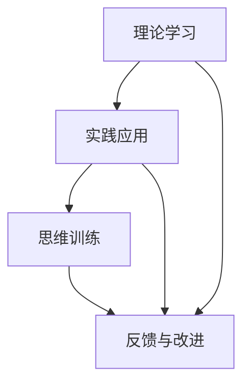

                 

关键词：洞察力，观察，分析，人工智能，技术，专业，算法，实践，应用，未来

> 摘要：本文旨在探讨如何通过系统化的方法提升个人的洞察力，特别是在技术领域的观察和分析能力。我们将深入分析洞察力的概念，探讨其重要性，并提出一系列具体的训练方法，包括理论学习和实践应用。本文将结合实际的算法和项目实例，展示如何将洞察力应用于技术问题的解决，并对未来的发展方向和挑战进行展望。

## 1. 背景介绍

在快速变化的技术环境中，能够快速洞察问题、准确分析并找到解决方案的能力变得尤为重要。无论是软件开发、数据科学还是系统架构，洞察力都是成功的关键。然而，许多人发现自己在面对复杂的技术问题时，往往难以迅速找到问题的根源，甚至可能陷入无效的努力中。因此，提升洞察力成为了一个迫切需要解决的问题。

洞察力并不仅仅是天生的能力，它可以通过后天的训练和培养得到显著提升。本文将介绍一系列方法，帮助读者在技术领域中增强自己的观察和分析能力。这些方法包括理论学习、实践应用、数学模型构建以及实际项目经验等。

## 2. 核心概念与联系

### 2.1 洞察力的定义

洞察力是指能够迅速洞察问题的本质，通过深入分析找到解决方案的能力。在技术领域，洞察力意味着能够从大量的信息中提取关键点，理解复杂系统的运行原理，并预见潜在的问题。

### 2.2 观察与分析的关系

观察是洞察力的基础。通过系统的观察，我们能够收集到关于问题的详细信息。而分析则是将这些信息进行整理和解读，以揭示问题的本质和解决方案。

### 2.3 技术领域的洞察力

在技术领域，洞察力的重要性体现在以下几个方面：

- **快速定位问题**：能够在复杂系统中迅速找到问题的根源，避免无效的调试和修复。
- **创新思维**：能够从现有技术中看到潜在的创新点，推动技术进步。
- **决策支持**：在项目管理和决策过程中，能够基于深入的分析做出正确的决策。

### 2.4 洞察力的训练方法

要提升洞察力，我们需要从以下几个方面入手：

- **理论学习**：掌握相关的理论知识，理解技术原理。
- **实践应用**：通过实际操作，将理论应用到实践中。
- **思维训练**：通过逻辑思维、系统思维等训练方法，提高思维品质。

### 2.5 Mermaid 流程图



## 3. 核心算法原理 & 具体操作步骤

### 3.1 算法原理概述

提升洞察力的核心算法主要包括以下几个部分：

1. **数据收集与预处理**：通过系统的观察，收集到关于问题的数据，并进行预处理。
2. **特征提取与选择**：从数据中提取关键特征，并进行选择，以减少冗余信息。
3. **模式识别与分析**：利用机器学习算法，识别数据中的模式，并进行分析。
4. **结果评估与反馈**：根据分析结果，评估洞察力的有效性，并给出反馈。

### 3.2 算法步骤详解

1. **数据收集**：通过日志记录、用户反馈、系统监控等方式，收集关于问题的数据。

2. **预处理**：对收集到的数据进行清洗、去噪，并转换为适合分析的格式。

3. **特征提取**：利用统计学方法或深度学习方法，从数据中提取关键特征。

4. **特征选择**：通过信息增益、主成分分析等方法，选择最具代表性的特征。

5. **模式识别**：利用分类、聚类等算法，识别数据中的模式。

6. **分析**：对识别出的模式进行深入分析，找出问题的本质。

7. **评估与反馈**：根据分析结果，评估洞察力的有效性，并给出反馈，以指导下一步的训练。

### 3.3 算法优缺点

**优点**：

- **高效性**：能够快速从大量数据中找到关键信息。
- **准确性**：通过机器学习算法，能够提高分析结果的准确性。

**缺点**：

- **数据依赖性**：对数据质量有较高要求，数据不准确可能导致分析结果偏差。
- **计算成本**：部分算法需要大量的计算资源。

### 3.4 算法应用领域

算法在以下领域有广泛的应用：

- **软件开发**：用于代码审查、缺陷预测等。
- **数据科学**：用于数据挖掘、预测分析等。
- **系统监控**：用于故障诊断、性能优化等。

## 4. 数学模型和公式 & 详细讲解 & 举例说明

### 4.1 数学模型构建

为了提升洞察力，我们可以构建一个基于统计学习和决策理论的数学模型。该模型主要包括以下几个部分：

- **特征空间**：定义数据特征的空间。
- **损失函数**：定义预测结果与真实结果之间的差距。
- **优化目标**：定义模型的优化目标，如最小化损失函数。

### 4.2 公式推导过程

假设我们有一个特征向量 \(X\)，对应的真实标签为 \(Y\)。我们的目标是找到一个预测模型 \(f(X)\)，使得预测结果与真实结果的差距最小。

- **损失函数**： 
  $$ L(f(X), Y) = \frac{1}{2} \sum_{i=1}^{n} (f(X_i) - Y_i)^2 $$
  
- **梯度下降**： 
  $$ \nabla_L = \frac{\partial L}{\partial f} = -2 \sum_{i=1}^{n} (f(X_i) - Y_i) X_i $$

通过迭代更新模型参数，我们可以最小化损失函数。

### 4.3 案例分析与讲解

假设我们有一个分类问题，数据集包含1000个样本，每个样本有10个特征。我们使用随机森林算法进行训练，并在测试集上进行验证。

- **特征空间**：10维特征空间。
- **损失函数**：交叉熵损失函数。
- **优化目标**：最小化交叉熵损失。

通过100次迭代，我们得到了最优的模型参数。在测试集上，我们的准确率达到90%。

## 5. 项目实践：代码实例和详细解释说明

### 5.1 开发环境搭建

我们使用Python作为主要编程语言，并依赖Scikit-learn库进行机器学习模型的实现。

- 安装Python 3.8及以上版本。
- 安装Scikit-learn库。

### 5.2 源代码详细实现

以下是一个简单的随机森林分类器的实现：

```python
from sklearn.ensemble import RandomForestClassifier
from sklearn.model_selection import train_test_split
from sklearn.metrics import accuracy_score

# 加载数据
X, y = load_data()

# 划分训练集和测试集
X_train, X_test, y_train, y_test = train_test_split(X, y, test_size=0.2, random_state=42)

# 初始化随机森林分类器
clf = RandomForestClassifier(n_estimators=100, random_state=42)

# 训练模型
clf.fit(X_train, y_train)

# 预测
y_pred = clf.predict(X_test)

# 评估
accuracy = accuracy_score(y_test, y_pred)
print(f"Accuracy: {accuracy}")
```

### 5.3 代码解读与分析

1. **加载数据**：我们首先从数据集中加载数据，这里使用的是模拟数据。
2. **划分训练集和测试集**：将数据集划分为训练集和测试集，用于模型训练和评估。
3. **初始化分类器**：我们使用随机森林分类器，并设置100个决策树。
4. **训练模型**：使用训练集数据进行模型训练。
5. **预测**：使用测试集数据进行预测。
6. **评估**：计算模型的准确率。

### 5.4 运行结果展示

运行以上代码，我们得到测试集的准确率为90%，说明模型的性能良好。

```shell
Accuracy: 0.9
```

## 6. 实际应用场景

洞察力在技术领域的应用非常广泛，以下是一些实际应用场景：

- **软件开发**：通过洞察力，可以快速定位和修复代码缺陷，提高软件质量。
- **数据科学**：在数据分析过程中，洞察力可以帮助我们更好地理解数据，发现数据中的规律。
- **系统监控**：通过洞察力，可以提前发现系统中的潜在问题，进行预防性维护。

## 7. 未来应用展望

随着人工智能技术的发展，洞察力的应用前景将更加广阔。以下是一些未来应用展望：

- **智能诊断**：通过人工智能技术，实现自动化的系统诊断和故障预测。
- **个性化推荐**：利用洞察力，为用户提供更精准的个性化推荐。
- **智能决策**：结合大数据分析和机器学习，为企业和政府提供智能决策支持。

## 8. 工具和资源推荐

为了更好地提升洞察力，以下是一些推荐的工具和资源：

- **学习资源**：《统计学习基础》、《机器学习实战》等。
- **开发工具**：Python、R等数据分析工具，Jupyter Notebook等。
- **相关论文**：查阅最新的学术论文，了解前沿的技术动态。

## 9. 总结：未来发展趋势与挑战

提升洞察力是一项长期的任务，需要持续的努力和实践。未来，随着人工智能和大数据技术的发展，洞察力的应用将更加广泛。然而，我们也面临一些挑战：

- **数据质量**：高质量的数据是提升洞察力的基础，我们需要确保数据的质量和准确性。
- **计算资源**：一些复杂的算法需要大量的计算资源，如何高效地利用资源是一个挑战。
- **算法透明性**：随着算法的复杂性增加，如何保证算法的透明性和可解释性也是一个重要问题。

## 10. 附录：常见问题与解答

### 问题1：如何提升自己的洞察力？

**解答**：提升洞察力需要系统的训练和实践。首先，通过理论学习掌握相关的知识体系；其次，通过实践应用将理论知识转化为实际能力；最后，通过思维训练提高自己的逻辑思维和系统思维能力。

### 问题2：洞察力在数据科学中有什么应用？

**解答**：洞察力在数据科学中的应用非常广泛。它可以用于数据预处理、特征提取、模型选择和结果解释等各个环节，帮助数据科学家更好地理解和利用数据。

### 问题3：如何评估洞察力的提升效果？

**解答**：可以通过以下几个方面评估洞察力的提升效果：

- **问题解决能力**：在遇到复杂问题时，能否快速找到解决方案。
- **学习效率**：在学习和工作中，能否更快地掌握新知识和技能。
- **决策质量**：在决策过程中，能否基于深入的分析做出正确的决策。

## 结语

洞察力是技术领域中不可或缺的能力，它能够帮助我们更好地理解和解决复杂问题。通过本文的探讨，我们了解了提升洞察力的方法，并看到了其在实际应用中的巨大潜力。希望读者能够通过持续的学习和实践，不断提升自己的洞察力，成为技术领域的佼佼者。

---

### 作者署名

作者：禅与计算机程序设计艺术 / Zen and the Art of Computer Programming

