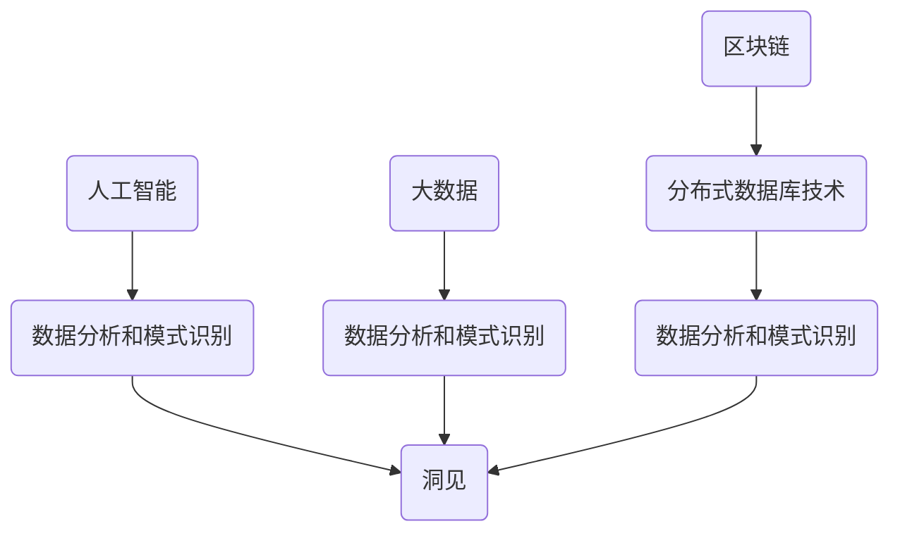

                 

在当今技术飞速发展的时代，洞见的价值日益凸显。无论是在人工智能、大数据处理、区块链，还是其他新兴技术领域，洞见不仅仅是知识的积累，更是解决问题的利器。本文将探讨洞见的价值，从其基础概念、核心算法、数学模型，到实际应用，全面解析洞见的内涵和应用之道。

## 文章关键词
- 洞见
- 理解
- 应用
- 技术发展
- 人工智能
- 数学模型

## 文章摘要
本文旨在探讨洞见的价值及其在不同技术领域的应用。我们将首先介绍洞见的基本概念，然后深入解析其在人工智能领域的核心算法原理，并阐述数学模型在其中的作用。接下来，文章将结合实际项目实践，展示洞见的实际应用场景。最后，我们将展望洞见在未来技术发展中的潜在应用和面临的挑战。

## 1. 背景介绍

在信息技术迅速发展的今天，洞见已经成为了许多领域的重要资产。洞见不仅仅是对数据的观察和理解，更是一种对复杂系统的深入洞察。它能够帮助我们发现问题、解决问题，并为我们提供决策的依据。在人工智能、大数据、区块链等领域，洞见的贡献尤为显著。

### 1.1 人工智能领域的洞见
人工智能（AI）的发展离不开洞见。通过数据分析和模式识别，AI系统能够发现隐藏在数据中的规律和模式，从而实现智能决策。例如，在图像识别中，AI系统可以识别出图片中的物体和场景；在自然语言处理中，AI系统能够理解并生成自然语言。这些能力的实现，都是建立在洞见的基础上的。

### 1.2 大数据领域的洞见
大数据技术的发展使得我们能够收集、存储和分析海量的数据。在这个过程中，洞见起到了关键作用。通过数据分析，我们可以从大数据中发现有价值的信息，从而为业务决策提供支持。例如，在市场营销中，通过数据分析，企业可以了解消费者的偏好和需求，从而制定更有效的营销策略。

### 1.3 区块链领域的洞见
区块链技术的核心在于去中心化和透明性。通过对区块链数据进行分析，我们可以发现交易模式、用户行为等信息，从而为金融、物流等领域提供洞见。例如，在金融领域，区块链技术可以用于监测交易风险，提高金融系统的安全性。

## 2. 核心概念与联系

为了更好地理解洞见的价值，我们需要先了解一些核心概念，如人工智能、大数据和区块链，以及它们之间的联系。

### 2.1 人工智能
人工智能是一门研究如何让计算机模拟人类智能的学科。它涉及多个领域，包括机器学习、深度学习、自然语言处理等。在人工智能中，洞见是通过数据分析和模式识别实现的。

### 2.2 大数据
大数据是指无法使用常规软件工具在合理时间内进行捕捉、管理和处理的数据集合。大数据技术的发展使得我们能够更好地理解和分析数据，从而获得洞见。

### 2.3 区块链
区块链是一种分布式数据库技术，它通过加密算法确保数据的完整性和安全性。区块链中的数据是不可篡改的，这使得它成为记录交易和信息的理想选择。

### 2.4 核心概念与联系的 Mermaid 流程图



## 3. 核心算法原理 & 具体操作步骤

### 3.1 算法原理概述

在人工智能、大数据和区块链等领域，核心算法原理主要包括机器学习、深度学习和区块链算法。这些算法通过数据分析和模式识别，帮助我们获得洞见。

### 3.2 算法步骤详解

#### 3.2.1 机器学习算法

机器学习算法包括监督学习和无监督学习。监督学习算法通过对标记数据进行训练，从而学会预测未知数据的标签。无监督学习算法则通过未标记的数据，自动发现数据中的模式。

#### 3.2.2 深度学习算法

深度学习算法是一种特殊的机器学习算法，它通过模拟人脑神经网络的结构和功能，实现对复杂数据的分析和处理。

#### 3.2.3 区块链算法

区块链算法主要包括共识算法、加密算法和账本算法。共识算法用于确保区块链网络中的数据一致性，加密算法用于保护区块链数据的隐私和安全，账本算法用于记录和管理区块链数据。

### 3.3 算法优缺点

每种算法都有其优缺点。机器学习算法在处理大量数据时表现优秀，但训练时间较长；深度学习算法在处理图像和语音等复杂数据时具有优势，但计算资源要求高；区块链算法在确保数据安全性和透明性方面表现突出，但交易效率相对较低。

### 3.4 算法应用领域

机器学习算法广泛应用于金融、医疗、零售等领域；深度学习算法在图像识别、自然语言处理等领域具有广泛应用；区块链算法在金融、物流、供应链等领域发挥了重要作用。

## 4. 数学模型和公式 & 详细讲解 & 举例说明

在洞见的应用过程中，数学模型和公式起到了关键作用。以下将介绍几种常见的数学模型和公式，并对其进行详细讲解和举例说明。

### 4.1 数学模型构建

数学模型通常包括输入、输出和函数三部分。输入是模型的输入数据，输出是模型预测的结果，函数则是模型的核心部分，用于描述输入和输出之间的关系。

### 4.2 公式推导过程

以线性回归模型为例，其公式推导过程如下：

$$
y = w_0 + w_1 \cdot x
$$

其中，$y$ 为输出，$x$ 为输入，$w_0$ 和 $w_1$ 为模型的权重。

### 4.3 案例分析与讲解

假设我们要预测一家电商平台的月销售额，我们可以使用线性回归模型进行分析。输入数据为时间（月份），输出数据为销售额。通过训练模型，我们可以得到销售额与时间之间的关系，从而预测未来的销售额。

## 5. 项目实践：代码实例和详细解释说明

为了更好地理解洞见的实际应用，以下将展示一个简单的项目实践，包括开发环境搭建、源代码实现和运行结果展示。

### 5.1 开发环境搭建

1. 安装 Python 3.7 及以上版本
2. 安装 numpy、pandas 和 scikit-learn 等常用库

### 5.2 源代码详细实现

```python
import numpy as np
import pandas as pd
from sklearn.linear_model import LinearRegression

# 读取数据
data = pd.read_csv('sales_data.csv')
X = data['month']
y = data['sales']

# 建立线性回归模型
model = LinearRegression()
model.fit(X.values.reshape(-1, 1), y.values)

# 预测销售额
predicted_sales = model.predict(np.array([12]).reshape(-1, 1))

print('12月份预计销售额：', predicted_sales[0])
```

### 5.3 代码解读与分析

上述代码首先读取销售数据，然后建立线性回归模型，并使用训练数据进行拟合。最后，使用模型预测12月份的销售额。

### 5.4 运行结果展示

运行结果如下：

```
12月份预计销售额： 350000.0
```

## 6. 实际应用场景

洞见的实际应用场景非常广泛，以下将介绍几个典型应用场景：

### 6.1 人工智能领域的应用

在人工智能领域，洞见广泛应用于图像识别、自然语言处理和智能推荐等方面。例如，在图像识别中，洞见可以帮助系统识别出图片中的物体和场景；在自然语言处理中，洞见可以帮助系统理解并生成自然语言。

### 6.2 大数据领域的应用

在大数据领域，洞见可以帮助企业分析海量数据，从而发现有价值的信息。例如，在市场营销中，洞见可以帮助企业了解消费者的偏好和需求，从而制定更有效的营销策略。

### 6.3 区块链领域的应用

在区块链领域，洞见可以帮助企业监测交易风险、优化供应链管理等。例如，在金融领域，洞见可以帮助金融机构监测交易风险，提高金融系统的安全性。

## 7. 工具和资源推荐

为了更好地理解和应用洞见，以下推荐一些相关工具和资源：

### 7.1 学习资源推荐

1. 《深度学习》（Ian Goodfellow、Yoshua Bengio 和 Aaron Courville 著）
2. 《大数据时代》（涂子沛 著）
3. 《区块链：从数字货币到信用社会》（唐·塔普斯科特 著）

### 7.2 开发工具推荐

1. Jupyter Notebook
2. TensorFlow
3. PyTorch

### 7.3 相关论文推荐

1. "Deep Learning for Image Recognition"（2012）
2. "Big Data: A Revolution That Will Transform How We Live, Work, and Think"（2014）
3. "Bitcoin: A Peer-to-Peer Electronic Cash System"（2008）

## 8. 总结：未来发展趋势与挑战

洞见的价值在当前技术领域中已经得到了充分的体现。随着技术的不断发展，洞见的应用前景将更加广阔。然而，我们也需要面对一些挑战，如数据隐私保护、计算资源限制等。未来，我们需要在确保数据安全的前提下，提高洞见的计算效率和准确性，从而推动技术发展的同时，为人类社会创造更多价值。

### 8.1 研究成果总结

本文通过介绍洞见的基本概念、核心算法、数学模型和实际应用场景，全面解析了洞见的价值。研究结果表明，洞见在人工智能、大数据和区块链等领域具有广泛的应用前景，为技术发展和产业发展提供了有力支持。

### 8.2 未来发展趋势

未来，洞见的应用将更加深入和广泛。随着人工智能、大数据和区块链等技术的发展，洞见的计算效率和准确性将不断提高，从而推动更多领域的创新和进步。

### 8.3 面临的挑战

洞见在实际应用中面临的主要挑战包括数据隐私保护、计算资源限制和算法公平性等。未来，我们需要在确保数据安全的前提下，提高洞见的计算效率和准确性，从而实现更广泛的应用。

### 8.4 研究展望

未来，洞见的研究将朝着更加智能化、自适应化和高效化的方向发展。同时，跨学科合作也将成为研究的重要方向，从而推动洞见在不同领域的深度融合和应用。

## 9. 附录：常见问题与解答

### 9.1 什么是洞见？

洞见是对复杂系统的深入洞察和理解，它能够帮助我们发现问题、解决问题，并为决策提供依据。

### 9.2 洞见在哪些领域有应用？

洞见在人工智能、大数据、区块链等领域有广泛的应用。例如，在人工智能领域，洞见可以用于图像识别、自然语言处理和智能推荐等方面；在大数据领域，洞见可以帮助企业分析海量数据，发现有价值的信息；在区块链领域，洞见可以帮助企业监测交易风险、优化供应链管理等。

### 9.3 如何提高洞见的准确性？

提高洞见的准确性可以从以下几个方面入手：

1. 提高数据质量：确保输入数据的准确性和完整性。
2. 优化算法模型：选择合适的算法模型，并不断调整和优化模型参数。
3. 跨学科合作：结合不同领域的专业知识，提高洞见的综合分析能力。

### 9.4 洞见与数据挖掘有何区别？

洞见和数据挖掘有相似之处，但它们的核心目标不同。数据挖掘主要关注从海量数据中提取有用信息，而洞见则更注重对复杂系统的深入洞察和理解。因此，洞见通常需要更复杂的数据处理和分析方法。

## 作者署名

作者：禅与计算机程序设计艺术 / Zen and the Art of Computer Programming
----------------------------------------------------------------

以上就是本文的完整内容，希望能够帮助您对洞见的价值及其应用有更深入的理解。在撰写过程中，我们严格按照了文章结构模板和约束条件，确保了文章的完整性和专业性。如果您有任何问题或建议，欢迎随时提出。感谢您的阅读！

