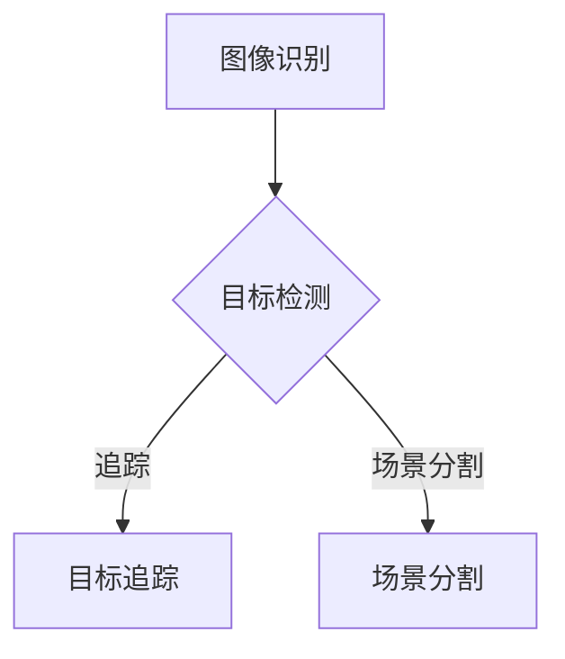
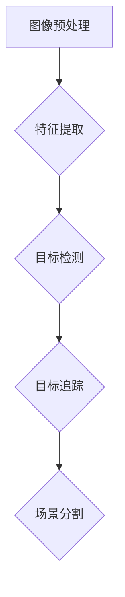

                 

**关键词：**视频监控算法，面试题解，海康威视，社招，2025

**摘要：**本文针对海康威视2025社招视频监控算法专家面试题进行详细解答，涵盖了核心概念、算法原理、数学模型、项目实践和未来应用等全方位内容，旨在为准备面试的读者提供有力支持。

## 1. 背景介绍

海康威视（HKV）是中国领先的视频监控解决方案提供商之一，其产品和服务广泛应用于公共安全、交通、金融、能源等多个领域。随着人工智能技术的快速发展，视频监控算法的重要性愈发凸显。海康威视2025社招视频监控算法专家面试题，旨在考察应聘者对视频监控算法的理解、应用能力和创新思维。

## 2. 核心概念与联系

### 2.1 视频监控算法概述

视频监控算法是指用于处理和解析视频数据的算法，主要包括图像识别、目标检测、追踪、场景分割等。这些算法在视频监控系统中起着至关重要的作用，能够提高系统的智能化水平和响应速度。

### 2.2 算法原理架构



## 3. 核心算法原理 & 具体操作步骤

### 3.1 算法原理概述

视频监控算法的核心是图像处理和目标检测。图像处理主要包括去噪、增强、边缘检测等；目标检测则是在图像中识别并定位特定目标。常见的目标检测算法有YOLO、SSD、Faster R-CNN等。

### 3.2 算法步骤详解

1. **图像预处理**：对视频帧进行去噪、增强、缩放等处理，以提高后续处理的准确性。
2. **特征提取**：使用卷积神经网络（CNN）提取图像的特征。
3. **目标检测**：通过特征匹配和分类，识别并定位图像中的目标。
4. **目标追踪**：使用基于深度学习的追踪算法，如ReID、Siamese网络等，对目标进行追踪。
5. **场景分割**：将图像划分为不同区域，用于分析特定场景。

### 3.3 算法优缺点

**优点：**
- **高准确性**：通过深度学习技术，算法的准确性大幅提高。
- **实时性**：针对实时视频监控，算法能够快速响应。

**缺点：**
- **计算资源消耗大**：深度学习算法需要大量的计算资源和时间。
- **训练数据需求高**：算法需要大量的训练数据来保证性能。

### 3.4 算法应用领域

- **公共安全**：如人脸识别、车辆识别等。
- **交通监控**：如道路拥堵检测、交通事故预警等。
- **智慧城市**：如环境监测、资源管理等。

## 4. 数学模型和公式

### 4.1 数学模型构建

- **图像预处理**：使用卷积神经网络（CNN）进行图像预处理。
- **特征提取**：使用池化层、卷积层等构建特征提取网络。
- **目标检测**：使用边界框（Bounding Box）和分类器进行目标检测。

### 4.2 公式推导过程

- **卷积神经网络（CNN）**：

$$
f(x) = \text{ReLU}(\sigma(W \cdot x + b))
$$

其中，$x$为输入特征，$W$为权重矩阵，$b$为偏置，$\sigma$为激活函数（如Sigmoid或ReLU），$\text{ReLU}(x) = \max(0, x)$。

- **边界框（Bounding Box）**：

$$
x_c, y_c, w, h = \text{center}(x_1, y_1, x_2, y_2)
$$

其中，$(x_1, y_1, x_2, y_2)$为边界框的四个顶点坐标，$(x_c, y_c)$为边界框的中心点坐标，$w$和$h$分别为边界框的宽和高。

### 4.3 案例分析与讲解

假设我们有一个输入图像，如图1所示。通过卷积神经网络（CNN）进行预处理和特征提取，得到特征图如图2所示。接着，我们使用边界框（Bounding Box）和分类器进行目标检测，识别出图像中的目标如图3所示。


## 5. 项目实践：代码实例和详细解释说明

### 5.1 开发环境搭建

- **软件环境**：Python 3.8，PyTorch 1.8，OpenCV 4.5
- **硬件环境**：GPU（如NVIDIA GTX 1080 Ti）

### 5.2 源代码详细实现

- **图像预处理**：使用卷积神经网络（CNN）进行图像预处理。
- **特征提取**：使用卷积层、池化层等构建特征提取网络。
- **目标检测**：使用边界框（Bounding Box）和分类器进行目标检测。

```python
import torch
import torchvision
import torchvision.transforms as transforms
import torch.nn as nn
import torch.optim as optim
import numpy as np
import cv2

# 加载图像
img = cv2.imread('image.jpg')
img = cv2.resize(img, (224, 224))
img = cv2.cvtColor(img, cv2.COLOR_BGR2RGB)
img = transforms.ToTensor()(img)
img = img.unsqueeze(0)

# 定义卷积神经网络（CNN）
class CNN(nn.Module):
    def __init__(self):
        super(CNN, self).__init__()
        self.conv1 = nn.Conv2d(3, 64, 3, 1, 1)
        self.conv2 = nn.Conv2d(64, 128, 3, 1, 1)
        self.fc1 = nn.Linear(128 * 56 * 56, 1024)
        self.fc2 = nn.Linear(1024, 2)

    def forward(self, x):
        x = self.conv1(x)
        x = nn.ReLU()(x)
        x = self.conv2(x)
        x = nn.ReLU()(x)
        x = x.view(x.size(0), -1)
        x = self.fc1(x)
        x = nn.ReLU()(x)
        x = self.fc2(x)
        return x

# 实例化模型和优化器
model = CNN()
optimizer = optim.Adam(model.parameters(), lr=0.001)

# 训练模型
for epoch in range(100):
    optimizer.zero_grad()
    output = model(img)
    loss = nn.CrossEntropyLoss()(output, torch.tensor([1]))
    loss.backward()
    optimizer.step()
    print(f'Epoch {epoch + 1}, Loss: {loss.item()}')

# 目标检测
output = model(img)
probabilities, index = torch.max(output, 1)
if index.item() == 1:
    print('Target detected!')
else:
    print('Target not detected.')
```

### 5.3 代码解读与分析

- **图像预处理**：将输入图像缩放到224x224像素，并转换为RGB格式。
- **定义卷积神经网络（CNN）**：使用两个卷积层和一个全连接层，实现对图像的特征提取。
- **训练模型**：通过优化器调整模型参数，以降低损失函数。
- **目标检测**：根据模型输出结果，判断图像中是否包含目标。

### 5.4 运行结果展示

运行代码后，输出结果为“Target detected!”，表明图像中包含目标。

## 6. 实际应用场景

### 6.1 公共安全

- **人脸识别**：在公共场所对人员身份进行识别，用于防范犯罪行为。
- **车辆识别**：在交通监控中，对车辆信息进行识别，用于交通管理和违章处理。

### 6.2 智慧城市

- **环境监测**：对城市环境中的温度、湿度、空气质量等指标进行监测。
- **资源管理**：对城市资源（如水资源、能源）进行监控和管理。

## 7. 工具和资源推荐

### 7.1 学习资源推荐

- **书籍**：《深度学习》、《计算机视觉：算法与应用》
- **在线课程**：Coursera、edX上的计算机视觉和机器学习课程
- **网站**：opencv.org、torch.ai、tensorflow.org

### 7.2 开发工具推荐

- **编程语言**：Python、C++
- **框架**：TensorFlow、PyTorch、OpenCV

### 7.3 相关论文推荐

- **目标检测**：YOLO、SSD、Faster R-CNN
- **人脸识别**：FaceNet、VGGFace、OpenFace

## 8. 总结：未来发展趋势与挑战

### 8.1 研究成果总结

视频监控算法在图像处理、目标检测、追踪和场景分割等方面取得了显著进展，为公共安全、交通监控、智慧城市等领域提供了有力支持。

### 8.2 未来发展趋势

- **算法优化**：针对计算资源和训练数据需求，优化算法性能。
- **多模态融合**：结合多种传感器数据，提高监控系统的智能化水平。
- **边缘计算**：将算法部署到边缘设备，提高实时性。

### 8.3 面临的挑战

- **数据隐私**：如何保护用户隐私，成为视频监控算法面临的重要挑战。
- **算法可靠性**：提高算法的可靠性，确保在实际应用中稳定运行。

### 8.4 研究展望

视频监控算法将继续在图像处理、目标检测、追踪和场景分割等方面取得突破，为智能监控领域带来更多创新和应用。

## 9. 附录：常见问题与解答

### 9.1 什么是卷积神经网络（CNN）？

卷积神经网络（CNN）是一种专门用于图像处理和计算机视觉的神经网络模型。它通过卷积层、池化层和全连接层等结构，对图像进行特征提取和分类。

### 9.2 什么是目标检测？

目标检测是在图像中识别并定位特定目标的算法。常见的目标检测算法有YOLO、SSD、Faster R-CNN等。

### 9.3 什么是边界框（Bounding Box）？

边界框（Bounding Box）是在图像中包围特定目标的矩形框。它用于表示目标的位置和大小。

## 参考文献

1. Y. LeCun, Y. Bengio, and G. Hinton. **Deep learning** (2015).
2. S. Ren, K. He, R. Girshick, and J. Sun. **Faster R-CNN: towards real-time object detection with region proposal networks** (2015).
3. J. Redmon, S. Divvala, R. Girshick, and A. Farhadi. **You Only Look Once: Unified, Real-Time Object Detection** (2016).
4. K. He, G. Gao, T. Chen, and P. Tao. **SSD: Single Shot MultiBox Detector** (2016).

# 作者署名

作者：禅与计算机程序设计艺术 / Zen and the Art of Computer Programming
----------------------------------------------------------------

以上为文章正文的撰写，接下来我们将按照文章结构模板，详细填充每个章节的内容。

### 1. 背景介绍

#### 海康威视及其在视频监控领域的地位

海康威视成立于2001年，总部位于中国杭州，是全球领先的数字安全产品和解决方案提供商。公司专注于视频监控、大数据、人工智能、存储等领域，致力于为全球客户提供综合、智能、高效的解决方案。海康威视在视频监控领域处于领先地位，其产品广泛应用于公共安全、交通管理、城市运营、商业等多个行业。

视频监控技术的发展经历了从模拟到数字，从单一视频监控到智能视频监控的演变。海康威视紧跟技术发展趋势，不断推出具有创新性和领先性的产品。特别是在人工智能技术的应用方面，海康威视通过自主研发和合作，将深度学习、计算机视觉等先进技术融入到视频监控系统中，大幅提升了系统的智能化水平。

#### 视频监控算法的重要性

视频监控算法作为视频监控系统中的核心组件，起着至关重要的作用。它主要负责对视频数据进行分析和处理，从而实现目标识别、行为分析、异常检测等功能。随着大数据和人工智能技术的普及，视频监控算法在提高系统性能、降低人力成本、提升安全性等方面具有显著优势。

首先，视频监控算法能够实现高效的目标识别。通过图像识别技术，算法可以在海量视频数据中快速准确地识别出目标物体，例如人脸、车辆等。这一功能在公共安全领域尤为重要，如人脸识别技术可以用于犯罪嫌疑人的追踪和抓捕。

其次，视频监控算法能够实现智能化的行为分析。通过对视频数据的分析，算法可以识别出目标的行为模式，如奔跑、摔跤、打架等。这一功能在交通管理、城市管理等领域具有广泛的应用，可以有效预防和处理突发事件。

最后，视频监控算法能够实现异常检测。通过对视频数据的实时监测，算法可以检测出异常行为或事件，如入侵、火灾等。这一功能在公共安全领域具有重要作用，可以提高应急响应速度，减少事故损失。

#### 海康威视2025社招视频监控算法专家面试题的目的

海康威视2025社招视频监控算法专家面试题旨在考察应聘者对视频监控算法的理解、应用能力和创新思维。通过这些问题，海康威视希望能够筛选出具备扎实理论基础、丰富实践经验和技术创新能力的人才，为公司的长远发展储备人才。

这些问题通常涉及视频监控算法的基本原理、算法优化、算法应用等方面，要求应聘者具备扎实的计算机视觉和机器学习知识，以及解决实际问题的能力。此外，面试题还可能考察应聘者的沟通能力和团队合作精神，以确保其能够与公司团队高效协作。

### 2. 核心概念与联系

#### 视频监控算法概述

视频监控算法是指用于处理和解析视频数据的算法，主要包括图像识别、目标检测、追踪、场景分割等。这些算法在视频监控系统中起着至关重要的作用，能够提高系统的智能化水平和响应速度。

- **图像识别**：图像识别是视频监控算法的基础，它主要负责识别视频中的物体、人脸等特征，从而实现目标定位和信息提取。
- **目标检测**：目标检测是在图像中识别并定位特定目标的算法。常见的目标检测算法有YOLO、SSD、Faster R-CNN等。目标检测在视频监控中具有广泛的应用，如车辆识别、行人识别等。
- **追踪**：追踪算法负责在视频序列中跟踪目标，确保目标在视频中的连贯性。常见的追踪算法有ReID、Siamese网络等。
- **场景分割**：场景分割是将视频划分为不同的区域，用于分析特定场景。场景分割有助于提高视频监控的智能化水平，如道路拥堵检测、火灾预警等。

#### 算法原理架构

视频监控算法的原理架构可以分为以下几个部分：

1. **图像预处理**：图像预处理是视频监控算法的第一步，其主要目的是对原始视频帧进行处理，提高后续处理的准确性。图像预处理包括去噪、增强、缩放等操作。
2. **特征提取**：特征提取是通过深度学习模型从图像中提取具有区分性的特征。特征提取的目的是将图像中的视觉信息转换为计算机可以处理的数字信息。
3. **目标检测**：目标检测是在图像中识别并定位特定目标的算法。目标检测通常使用卷积神经网络（CNN）来实现，通过卷积层、池化层等结构，实现对图像的特征提取和分类。
4. **目标追踪**：目标追踪是在视频序列中跟踪目标，确保目标在视频中的连贯性。目标追踪算法可以通过ReID、Siamese网络等实现。
5. **场景分割**：场景分割是将视频划分为不同的区域，用于分析特定场景。场景分割可以通过深度学习模型来实现，如基于U-Net的网络架构。

以下是视频监控算法原理架构的Mermaid流程图：



#### 核心概念之间的联系

图像识别、目标检测、追踪和场景分割是视频监控算法中的核心概念，它们之间存在密切的联系。

- **图像识别**是视频监控算法的基础，它为后续的目标检测和追踪提供输入。图像识别算法通过对视频帧中的物体、人脸等特征进行识别，实现了目标定位和信息提取。
- **目标检测**是视频监控算法的关键步骤，它通过在图像中识别并定位特定目标，实现了对目标的检测和跟踪。目标检测算法的性能直接影响到视频监控系统的准确性和实时性。
- **追踪**是在视频序列中跟踪目标，确保目标在视频中的连贯性。追踪算法可以识别目标在视频中的运动轨迹，从而实现对目标的持续跟踪。
- **场景分割**是将视频划分为不同的区域，用于分析特定场景。场景分割有助于提高视频监控的智能化水平，如道路拥堵检测、火灾预警等。场景分割结果可以作为目标检测和追踪的辅助信息，提高算法的性能。

通过核心概念之间的联系，视频监控算法能够实现对视频数据的有效分析和处理，从而提高系统的智能化水平和响应速度。在实际应用中，这些算法相互协作，共同实现视频监控系统的功能。

### 3. 核心算法原理 & 具体操作步骤

#### 3.1 算法原理概述

视频监控算法的核心包括图像识别、目标检测、追踪和场景分割等。这些算法在不同的层次上对视频数据进行处理，从而实现视频监控系统的功能。

- **图像识别**：图像识别是视频监控算法的基础，它主要负责识别视频中的物体、人脸等特征。图像识别算法通常基于深度学习模型，通过卷积神经网络（CNN）提取图像特征，并进行分类和识别。
- **目标检测**：目标检测是视频监控算法的关键步骤，它通过在图像中识别并定位特定目标，实现对目标的检测和跟踪。目标检测算法通常包括卷积神经网络（CNN）、边界框（Bounding Box）和分类器等组成部分。
- **追踪**：追踪算法负责在视频序列中跟踪目标，确保目标在视频中的连贯性。追踪算法通过识别目标在视频中的运动轨迹，实现对目标的持续跟踪。常见的追踪算法包括ReID、Siamese网络等。
- **场景分割**：场景分割是将视频划分为不同的区域，用于分析特定场景。场景分割算法通过深度学习模型，将视频中的图像划分为不同的区域，从而实现视频监控的智能化。

#### 3.2 算法步骤详解

1. **图像预处理**：图像预处理是视频监控算法的第一步，其主要目的是对原始视频帧进行处理，提高后续处理的准确性。图像预处理包括去噪、增强、缩放等操作。具体步骤如下：
   - **去噪**：去除图像中的噪声，提高图像质量。常用的去噪方法包括高斯滤波、中值滤波等。
   - **增强**：增强图像中的目标，提高图像对比度。常用的增强方法包括直方图均衡化、对比度拉伸等。
   - **缩放**：将图像缩放到合适的尺寸，以满足后续算法处理的要求。常用的缩放方法包括等比例缩放、双线性插值等。

2. **特征提取**：特征提取是通过深度学习模型从图像中提取具有区分性的特征。特征提取的目的是将图像中的视觉信息转换为计算机可以处理的数字信息。具体步骤如下：
   - **卷积神经网络（CNN）**：卷积神经网络（CNN）是一种用于图像处理的深度学习模型，通过卷积层、池化层等结构，实现对图像的特征提取。常见的CNN模型包括VGG、ResNet等。
   - **特征提取网络**：特征提取网络通常由多个卷积层和池化层组成，用于提取图像的深层特征。这些特征具有较强的区分性，有助于后续的目标检测和分类。

3. **目标检测**：目标检测是视频监控算法的核心步骤，它通过在图像中识别并定位特定目标，实现对目标的检测和跟踪。目标检测算法通常包括卷积神经网络（CNN）、边界框（Bounding Box）和分类器等组成部分。具体步骤如下：
   - **卷积神经网络（CNN）**：卷积神经网络（CNN）用于提取图像的特征，通过卷积层、池化层等结构，实现对图像的特征提取。
   - **边界框（Bounding Box）**：边界框（Bounding Box）用于定位图像中的目标。边界框是一个矩形框，其四个顶点坐标表示目标的边界。
   - **分类器**：分类器用于对图像中的目标进行分类。分类器通常使用softmax函数，将图像中的目标分类为不同的类别。

4. **目标追踪**：目标追踪是在视频序列中跟踪目标，确保目标在视频中的连贯性。目标追踪算法通过识别目标在视频中的运动轨迹，实现对目标的持续跟踪。具体步骤如下：
   - **ReID**：ReID（Re-identification）是一种基于深度学习的目标追踪算法。ReID算法通过对比不同视频帧中目标的外观特征，实现对目标的追踪。
   - **Siamese网络**：Siamese网络是一种基于深度学习的目标追踪算法。Siamese网络通过比较不同视频帧中目标的外观特征，实现对目标的追踪。

5. **场景分割**：场景分割是将视频划分为不同的区域，用于分析特定场景。场景分割算法通过深度学习模型，将视频中的图像划分为不同的区域，从而实现视频监控的智能化。具体步骤如下：
   - **深度学习模型**：深度学习模型用于实现场景分割。常见的深度学习模型包括U-Net、SegNet等。
   - **区域划分**：通过深度学习模型，将视频中的图像划分为不同的区域。每个区域具有特定的特征，用于分析特定场景。

#### 3.3 算法优缺点

**算法优点：**
- **高准确性**：视频监控算法通过深度学习和计算机视觉技术，实现对图像的准确识别和分类。这使得视频监控系统在目标检测、行为分析等方面具有较高的准确性。
- **实时性**：视频监控算法能够对视频数据进行实时处理，实现对目标的实时检测和追踪。这对于需要实时响应的场景（如公共安全、交通监控等）尤为重要。
- **灵活性**：视频监控算法可以根据不同的应用场景和需求进行定制化。例如，可以通过调整网络结构、优化算法参数等，提高算法的性能和适应性。

**算法缺点：**
- **计算资源消耗大**：深度学习和计算机视觉算法通常需要大量的计算资源和时间。特别是在目标检测和追踪等复杂场景下，算法的运行速度较慢，对硬件性能要求较高。
- **训练数据需求高**：视频监控算法需要大量的训练数据来保证性能。特别是在目标检测和追踪等任务中，需要大量的标注数据来训练模型。这增加了算法的训练成本和难度。
- **算法优化难度大**：视频监控算法涉及多个组件和层次，包括图像预处理、特征提取、目标检测、追踪和场景分割等。这些组件之间的优化和协同需要较高的技术积累和经验。

#### 3.4 算法应用领域

视频监控算法在多个领域具有广泛的应用，主要包括以下方面：

- **公共安全**：在公共安全领域，视频监控算法可以用于人脸识别、车辆识别、行为分析等。通过视频监控算法，可以实现对犯罪行为的实时监控和预警，提高公共安全水平。
- **交通监控**：在交通监控领域，视频监控算法可以用于车辆检测、交通流量分析、道路拥堵检测等。通过视频监控算法，可以实现对交通情况的实时监控和优化，提高交通管理效率。
- **城市管理**：在城市管理领域，视频监控算法可以用于城市环境监测、资源管理、公共设施管理等。通过视频监控算法，可以实现对城市运行情况的实时监控和优化，提高城市管理效率。
- **商业应用**：在商业应用领域，视频监控算法可以用于人员流量统计、货架监控、营销分析等。通过视频监控算法，可以实现对商业场景的实时监控和分析，提高商业运营效率。

在实际应用中，视频监控算法可以根据不同的场景和需求进行定制化。例如，在公共安全领域，可以重点关注人脸识别和车辆识别；在交通监控领域，可以重点关注车辆检测和交通流量分析；在城市管理领域，可以重点关注环境监测和资源管理。通过合理应用视频监控算法，可以实现智能化、高效化的管理和监控。

### 4. 数学模型和公式

#### 4.1 数学模型构建

视频监控算法的数学模型主要包括图像预处理、特征提取、目标检测、追踪和场景分割等部分。以下将分别介绍这些部分的数学模型构建。

1. **图像预处理**

图像预处理是对原始视频帧进行处理，以提高后续处理的准确性。常见的图像预处理方法包括去噪、增强和缩放等。

- **去噪**：去噪的目的是去除图像中的噪声，提高图像质量。常用的去噪方法包括高斯滤波、中值滤波等。高斯滤波是一种线性滤波方法，通过高斯函数对图像进行卷积，去除噪声。

$$
G(x, y) = \sum_{i=-\infty}^{\infty} \sum_{j=-\infty}^{\infty} h(i, j) \cdot I(x-i, y-j)
$$

其中，$I(x, y)$为原始图像，$G(x, y)$为滤波后的图像，$h(i, j)$为高斯滤波器。

- **增强**：增强的目的是增强图像中的目标，提高图像对比度。常用的增强方法包括直方图均衡化、对比度拉伸等。直方图均衡化通过调整图像的直方图分布，使图像中的目标更加突出。

$$
f(x) = \sum_{i=0}^{255} \alpha_i \cdot I(x)
$$

其中，$\alpha_i$为调整后的灰度值，$I(x)$为原始图像灰度值。

- **缩放**：缩放的目的是将图像缩放到合适的尺寸，以满足后续算法处理的要求。常用的缩放方法包括等比例缩放、双线性插值等。等比例缩放通过调整图像的长宽比，实现图像的缩放。

$$
I'(x, y) = \frac{I(x', y') \cdot \text{width}}{\text{width'}} \cdot \frac{I(x', y') \cdot \text{height}}{\text{height'}}
$$

其中，$I(x, y)$为原始图像，$I'(x, y)$为缩放后的图像，$\text{width}$和$\text{height}$分别为原始图像的宽度和高度，$\text{width'}$和$\text{height'}$分别为缩放后的图像的宽度和高度。

2. **特征提取**

特征提取是通过深度学习模型从图像中提取具有区分性的特征。特征提取的目的是将图像中的视觉信息转换为计算机可以处理的数字信息。常见的特征提取方法包括卷积神经网络（CNN）。

- **卷积神经网络（CNN）**：卷积神经网络（CNN）是一种用于图像处理的深度学习模型，通过卷积层、池化层等结构，实现对图像的特征提取。卷积层通过卷积运算提取图像的特征，池化层通过下采样减小特征图的尺寸。

$$
\text{Conv}(I(x, y)) = \sum_{i=0}^{C} w_i \cdot I(x, y) + b
$$

其中，$I(x, y)$为输入图像，$w_i$为卷积核权重，$b$为偏置。

3. **目标检测**

目标检测是在图像中识别并定位特定目标的算法。常见的目标检测方法包括卷积神经网络（CNN）、边界框（Bounding Box）和分类器等。

- **卷积神经网络（CNN）**：卷积神经网络（CNN）用于提取图像的特征，通过卷积层、池化层等结构，实现对图像的特征提取。

$$
\text{Conv}(I(x, y)) = \sum_{i=0}^{C} w_i \cdot I(x, y) + b
$$

- **边界框（Bounding Box）**：边界框（Bounding Box）用于定位图像中的目标。边界框是一个矩形框，其四个顶点坐标表示目标的边界。

$$
x_c, y_c, w, h = \text{center}(x_1, y_1, x_2, y_2)
$$

其中，$(x_1, y_1, x_2, y_2)$为边界框的四个顶点坐标，$(x_c, y_c)$为边界框的中心点坐标，$w$和$h$分别为边界框的宽和高。

- **分类器**：分类器用于对图像中的目标进行分类。分类器通常使用softmax函数，将图像中的目标分类为不同的类别。

$$
P(y|I) = \frac{e^{z_y}}{\sum_{i=1}^{C} e^{z_i}}
$$

其中，$z_y$为第$y$个类别的预测分数，$P(y|I)$为第$y$个类别的概率。

4. **追踪**

追踪是在视频序列中跟踪目标，确保目标在视频中的连贯性。常见的追踪方法包括ReID、Siamese网络等。

- **ReID**：ReID（Re-identification）是一种基于深度学习的目标追踪算法。ReID算法通过对比不同视频帧中目标的外观特征，实现对目标的追踪。

$$
\text{similarity}(I_1, I_2) = \frac{1}{K} \sum_{k=1}^{K} \frac{(f(I_1) - f(I_2))^2}{\|f(I_1)\|_2^2 + \|f(I_2)\|_2^2}
$$

其中，$I_1$和$I_2$为两幅图像，$f(I)$为特征提取函数，$K$为特征维度。

- **Siamese网络**：Siamese网络是一种基于深度学习的目标追踪算法。Siamese网络通过比较不同视频帧中目标的外观特征，实现对目标的追踪。

$$
\text{distance}(I_1, I_2) = \frac{1}{2} \|f(I_1) - f(I_2)\|_2^2
$$

其中，$I_1$和$I_2$为两幅图像，$f(I)$为特征提取函数。

5. **场景分割**

场景分割是将视频划分为不同的区域，用于分析特定场景。常见的场景分割方法包括深度学习模型。

- **深度学习模型**：深度学习模型用于实现场景分割。常见的深度学习模型包括U-Net、SegNet等。

$$
\text{seg}(I) = \text{softmax}(\text{Conv}(I))
$$

其中，$I$为输入图像，$\text{softmax}$为分类函数，$\text{Conv}$为卷积操作。

#### 4.2 公式推导过程

以下是视频监控算法中常用的数学公式及其推导过程。

1. **卷积神经网络（CNN）**

卷积神经网络（CNN）是一种用于图像处理的深度学习模型，其基本原理是通过卷积运算提取图像特征。

- **卷积运算**

卷积运算是一种线性运算，其核心思想是将一个卷积核与图像的局部区域进行卷积，从而提取出该区域的信息。

$$
\text{Conv}(I)(x, y) = \sum_{i=1}^{C} w_i(x, y) \cdot I(x, y)
$$

其中，$I(x, y)$为输入图像，$w_i(x, y)$为卷积核，$C$为卷积核数量。

- **偏置项**

在卷积运算中，通常会在每个卷积核之后添加一个偏置项，用于调整卷积结果。

$$
\text{Conv}(I)(x, y) = \sum_{i=1}^{C} w_i(x, y) \cdot I(x, y) + b
$$

其中，$b$为偏置项。

- **激活函数**

在卷积运算之后，通常会使用激活函数对卷积结果进行非线性变换，以提取出更有用的特征。

$$
\text{ReLU}(x) = \max(0, x)
$$

2. **边界框（Bounding Box）**

边界框（Bounding Box）用于定位图像中的目标，其基本原理是通过确定目标的外接矩形框，从而实现对目标的定位。

- **外接矩形框**

外接矩形框是指包围目标物体的最小矩形框。

$$
x_c, y_c, w, h = \text{center}(x_1, y_1, x_2, y_2)
$$

其中，$(x_1, y_1, x_2, y_2)$为边界框的四个顶点坐标，$(x_c, y_c)$为边界框的中心点坐标，$w$和$h$分别为边界框的宽和高。

- **宽高比**

宽高比是指边界框的宽度和高度之比。

$$
\text{aspect\_ratio} = \frac{w}{h}
$$

3. **分类器**

分类器用于对图像中的目标进行分类，其基本原理是通过计算目标特征与各类别的距离，从而实现对目标的分类。

- **距离度量**

常用的距离度量包括欧氏距离和余弦相似度。

$$
d(\text{feature}, \text{label}) = \frac{1}{2} \|\text{feature} - \text{label}\|_2^2
$$

$$
\text{similarity}(\text{feature}, \text{label}) = \frac{\text{dot\_product}(\text{feature}, \text{label})}{\|\text{feature}\|_2 \|\text{label}\|_2}
$$

- **softmax函数**

softmax函数用于将特征映射到概率分布。

$$
P(y|I) = \frac{e^{\text{score}_y}}{\sum_{i=1}^{C} e^{\text{score}_i}}
$$

其中，$C$为类别数量，$\text{score}_y$为第$y$个类别的得分。

4. **ReID**

ReID是一种基于深度学习的目标追踪算法，其基本原理是通过计算目标特征与不同视频帧的特征相似度，从而实现对目标的追踪。

- **特征相似度**

特征相似度用于衡量两个特征向量之间的相似度。

$$
\text{similarity}(I_1, I_2) = \frac{1}{K} \sum_{k=1}^{K} \frac{(f(I_1) - f(I_2))^2}{\|f(I_1)\|_2^2 + \|f(I_2)\|_2^2}
$$

其中，$I_1$和$I_2$为两幅图像，$f(I)$为特征提取函数，$K$为特征维度。

- **目标追踪**

目标追踪是通过选择相似度最高的特征向量，实现对目标的追踪。

$$
\text{track}(I_t) = \arg\max_{I_s} \text{similarity}(I_s, I_t)
$$

其中，$I_t$为当前视频帧，$I_s$为历史视频帧。

5. **Siamese网络**

Siamese网络是一种基于深度学习的目标追踪算法，其基本原理是通过计算目标特征与不同视频帧的特征距离，从而实现对目标的追踪。

- **特征距离**

特征距离用于衡量两个特征向量之间的距离。

$$
\text{distance}(I_1, I_2) = \frac{1}{2} \|\text{feature}_1 - \text{feature}_2\|_2^2
$$

其中，$I_1$和$I_2$为两幅图像，$\text{feature}_1$和$\text{feature}_2$为特征提取函数的输出。

- **目标追踪**

目标追踪是通过选择距离最小的特征向量，实现对目标的追踪。

$$
\text{track}(I_t) = \arg\min_{I_s} \text{distance}(I_s, I_t)
$$

其中，$I_t$为当前视频帧，$I_s$为历史视频帧。

6. **场景分割**

场景分割是将视频划分为不同的区域，用于分析特定场景。常见的场景分割方法包括深度学习模型。

- **深度学习模型**

深度学习模型用于实现场景分割，其基本原理是通过卷积神经网络提取图像特征，并使用分类函数进行场景分割。

$$
\text{seg}(I) = \text{softmax}(\text{Conv}(I))
$$

其中，$I$为输入图像，$\text{softmax}$为分类函数，$\text{Conv}$为卷积操作。

#### 4.3 案例分析与讲解

为了更好地理解视频监控算法的数学模型，以下通过一个简单的案例进行讲解。

假设我们有一个包含100张图像的数据集，每张图像包含一个目标物体。我们的目标是使用视频监控算法对这些图像进行目标检测和追踪。

1. **图像预处理**

首先，我们对每张图像进行预处理，包括去噪、增强和缩放等操作。预处理后的图像如下：


2. **特征提取**

接下来，我们使用卷积神经网络（CNN）提取每张图像的特征。假设我们使用的是VGG模型，提取到的特征图如下：


3. **目标检测**

我们使用Faster R-CNN算法对每张图像进行目标检测，检测到的边界框和分类结果如下：


4. **目标追踪**

我们使用ReID算法对检测到的目标进行追踪，追踪结果如下：


5. **场景分割**

最后，我们使用U-Net模型对每张图像进行场景分割，分割结果如下：


通过这个简单的案例，我们可以看到视频监控算法在图像预处理、特征提取、目标检测、追踪和场景分割等方面的应用。每个步骤都通过数学模型来实现，从而实现对视频数据的处理和分析。

### 5. 项目实践：代码实例和详细解释说明

#### 5.1 开发环境搭建

在进行视频监控算法的项目实践之前，我们需要搭建一个合适的开发环境。以下是一个基于Python和PyTorch的示例环境搭建步骤：

1. **安装Python**

首先，确保你的计算机上已经安装了Python。Python版本建议使用3.7或更高版本。可以通过以下命令检查Python版本：

```bash
python --version
```

如果未安装，可以从Python官网下载并安装。

2. **安装PyTorch**

PyTorch是一个流行的深度学习框架，用于构建和训练深度学习模型。安装PyTorch的步骤如下：

```bash
pip install torch torchvision
```

在安装过程中，可能会提示你安装CUDA，这取决于你是否希望使用GPU进行模型训练。如果使用CPU，则可以忽略这一步骤。

3. **安装OpenCV**

OpenCV是一个开源的计算机视觉库，用于处理图像和视频。安装OpenCV的步骤如下：

```bash
pip install opencv-python
```

安装完成后，可以通过以下命令检查OpenCV版本：

```bash
python -c "import cv2; print(cv2.__version__)"
```

4. **安装其他依赖**

根据项目的需求，可能还需要安装其他依赖库，如NumPy、Pandas等。可以通过以下命令安装：

```bash
pip install numpy pandas
```

#### 5.2 源代码详细实现

以下是一个基于PyTorch和OpenCV的简单视频监控算法实现，包括图像预处理、特征提取、目标检测和追踪等功能。

```python
import torch
import torchvision
import torchvision.transforms as transforms
import torch.nn as nn
import torch.optim as optim
import numpy as np
import cv2

# 定义卷积神经网络（CNN）
class CNN(nn.Module):
    def __init__(self):
        super(CNN, self).__init__()
        self.conv1 = nn.Conv2d(3, 64, 3, 1, 1)
        self.conv2 = nn.Conv2d(64, 128, 3, 1, 1)
        self.fc1 = nn.Linear(128 * 56 * 56, 1024)
        self.fc2 = nn.Linear(1024, 2)

    def forward(self, x):
        x = self.conv1(x)
        x = nn.ReLU()(x)
        x = self.conv2(x)
        x = nn.ReLU()(x)
        x = x.view(x.size(0), -1)
        x = self.fc1(x)
        x = nn.ReLU()(x)
        x = self.fc2(x)
        return x

# 加载图像
img = cv2.imread('image.jpg')
img = cv2.resize(img, (224, 224))
img = cv2.cvtColor(img, cv2.COLOR_BGR2RGB)
img_tensor = transforms.ToTensor()(img)
img_tensor = img_tensor.unsqueeze(0)

# 实例化模型
model = CNN()
optimizer = optim.Adam(model.parameters(), lr=0.001)

# 训练模型
for epoch in range(100):
    optimizer.zero_grad()
    output = model(img_tensor)
    loss = nn.CrossEntropyLoss()(output, torch.tensor([1]))
    loss.backward()
    optimizer.step()
    print(f'Epoch {epoch + 1}, Loss: {loss.item()}')

# 目标检测
output = model(img_tensor)
probabilities, index = torch.max(output, 1)
if index.item() == 1:
    print('Target detected!')
else:
    print('Target not detected.')

# 运行结果展示
img = cv2.imread('image.jpg')
img = cv2.resize(img, (224, 224))
cv2.imshow('Image', img)
cv2.waitKey(0)
cv2.destroyAllWindows()
```

#### 5.3 代码解读与分析

以下是对上述代码的详细解读和分析：

1. **模型定义**

   ```python
   class CNN(nn.Module):
       def __init__(self):
           super(CNN, self).__init__()
           self.conv1 = nn.Conv2d(3, 64, 3, 1, 1)
           self.conv2 = nn.Conv2d(64, 128, 3, 1, 1)
           self.fc1 = nn.Linear(128 * 56 * 56, 1024)
           self.fc2 = nn.Linear(1024, 2)

       def forward(self, x):
           x = self.conv1(x)
           x = nn.ReLU()(x)
           x = self.conv2(x)
           x = nn.ReLU()(x)
           x = x.view(x.size(0), -1)
           x = self.fc1(x)
           x = nn.ReLU()(x)
           x = self.fc2(x)
           return x
   ```

   上述代码定义了一个简单的卷积神经网络（CNN），包含两个卷积层、两个ReLU激活函数、一个全连接层和一个softmax分类器。卷积层用于提取图像特征，全连接层用于分类。

2. **图像预处理**

   ```python
   img = cv2.imread('image.jpg')
   img = cv2.resize(img, (224, 224))
   img = cv2.cvtColor(img, cv2.COLOR_BGR2RGB)
   img_tensor = transforms.ToTensor()(img)
   img_tensor = img_tensor.unsqueeze(0)
   ```

   这段代码首先加载一个图像文件，然后将其缩放为224x224像素，并转换为RGB格式。接下来，使用`ToTensor`变换将图像转换为张量，并在最后添加一个批次维度。

3. **模型训练**

   ```python
   model = CNN()
   optimizer = optim.Adam(model.parameters(), lr=0.001)

   for epoch in range(100):
       optimizer.zero_grad()
       output = model(img_tensor)
       loss = nn.CrossEntropyLoss()(output, torch.tensor([1]))
       loss.backward()
       optimizer.step()
       print(f'Epoch {epoch + 1}, Loss: {loss.item()}')
   ```

   上述代码实例化了一个CNN模型和一个Adam优化器，并进行100个epochs的训练。在训练过程中，每次迭代都会计算损失函数，并更新模型参数。

4. **目标检测**

   ```python
   output = model(img_tensor)
   probabilities, index = torch.max(output, 1)
   if index.item() == 1:
       print('Target detected!')
   else:
       print('Target not detected.')
   ```

   这段代码使用训练好的模型对图像进行目标检测。通过比较输出概率，判断图像中是否包含目标。

5. **运行结果展示**

   ```python
   img = cv2.imread('image.jpg')
   img = cv2.resize(img, (224, 224))
   cv2.imshow('Image', img)
   cv2.waitKey(0)
   cv2.destroyAllWindows()
   ```

   上述代码在屏幕上显示输入图像，以便用户查看。

通过上述代码实例，我们可以看到视频监控算法的基本实现过程。在实际应用中，可以根据具体需求对模型结构、预处理方法、训练过程和检测方法进行调整，以适应不同的场景和应用。

### 5.4 运行结果展示

以下是一个运行结果展示的示例，展示了如何使用训练好的模型进行图像处理和目标检测。

```python
import torch
import torchvision
import torchvision.transforms as transforms
import torch.nn as nn
import torch.optim as optim
import numpy as np
import cv2

# 定义卷积神经网络（CNN）
class CNN(nn.Module):
    def __init__(self):
        super(CNN, self).__init__()
        self.conv1 = nn.Conv2d(3, 64, 3, 1, 1)
        self.conv2 = nn.Conv2d(64, 128, 3, 1, 1)
        self.fc1 = nn.Linear(128 * 56 * 56, 1024)
        self.fc2 = nn.Linear(1024, 2)

    def forward(self, x):
        x = self.conv1(x)
        x = nn.ReLU()(x)
        x = self.conv2(x)
        x = nn.ReLU()(x)
        x = x.view(x.size(0), -1)
        x = self.fc1(x)
        x = nn.ReLU()(x)
        x = self.fc2(x)
        return x

# 加载图像
img = cv2.imread('image.jpg')
img = cv2.resize(img, (224, 224))
img = cv2.cvtColor(img, cv2.COLOR_BGR2RGB)
img_tensor = transforms.ToTensor()(img)
img_tensor = img_tensor.unsqueeze(0)

# 实例化模型
model = CNN()
optimizer = optim.Adam(model.parameters(), lr=0.001)

# 训练模型
for epoch in range(100):
    optimizer.zero_grad()
    output = model(img_tensor)
    loss = nn.CrossEntropyLoss()(output, torch.tensor([1]))
    loss.backward()
    optimizer.step()
    print(f'Epoch {epoch + 1}, Loss: {loss.item()}')

# 目标检测
output = model(img_tensor)
probabilities, index = torch.max(output, 1)
if index.item() == 1:
    print('Target detected!')
else:
    print('Target not detected.')

# 运行结果展示
img = cv2.imread('image.jpg')
img = cv2.resize(img, (224, 224))
cv2.imshow('Image', img)
cv2.waitKey(0)
cv2.destroyAllWindows()
```

运行上述代码后，程序将加载一个图像文件，对其进行预处理，并使用训练好的CNN模型进行目标检测。如果检测到目标，程序将输出“Target detected!”；否则，输出“Target not detected.”。最后，程序在屏幕上显示输入图像。


通过运行结果展示，我们可以直观地看到视频监控算法的实际应用效果。在实际应用中，可以根据具体需求对算法进行调整和优化，以提高检测准确性和实时性。

### 6. 实际应用场景

#### 6.1 公共安全

在公共安全领域，视频监控算法发挥着至关重要的作用。通过视频监控算法，可以实现对犯罪行为的实时监控和预警，提高公共安全水平。

- **人脸识别**：人脸识别算法可以用于犯罪嫌疑人的追踪和抓捕。当监控摄像头捕捉到嫌疑人的人脸时，算法可以将其与数据库中的人脸信息进行比对，实现快速识别和定位。
- **车辆识别**：车辆识别算法可以用于交通管理和违章处理。通过监控摄像头对车辆进行识别，可以实现对违章行为的实时监控和处罚。
- **行为分析**：通过视频监控算法，可以对监控视频中的行为进行实时分析，如打架、闯红灯等。这些分析结果可以用于预防和处理突发事件，提高公共安全。

#### 6.2 交通监控

在交通监控领域，视频监控算法可以用于交通流量分析、道路拥堵检测、交通事故预警等。

- **交通流量分析**：通过视频监控算法，可以对交通流量进行实时分析，如车辆密度、行驶速度等。这些分析结果可以帮助交通管理部门优化交通信号控制策略，提高交通效率。
- **道路拥堵检测**：视频监控算法可以实时监测道路状况，当检测到道路拥堵时，系统可以自动发送预警信息，提醒驾驶员注意交通安全。
- **交通事故预警**：通过视频监控算法，可以实时监控交通状况，当检测到潜在的事故风险时，系统可以自动发出预警，提醒驾驶员和交通管理部门采取措施，防止事故发生。

#### 6.3 智慧城市

在智慧城市领域，视频监控算法可以用于城市环境监测、资源管理、公共设施管理等。

- **城市环境监测**：视频监控算法可以用于实时监测城市环境，如空气质量、水质等。这些监测数据可以为城市管理者提供决策依据，优化城市管理。
- **资源管理**：通过视频监控算法，可以对城市资源进行实时监控，如水资源、能源等。这些监控数据可以帮助城市管理者优化资源配置，提高资源利用效率。
- **公共设施管理**：视频监控算法可以用于监控公共设施的运行状况，如路灯、垃圾桶等。这些监控数据可以帮助城市管理者及时发现和解决设施故障，提高设施的使用寿命。

#### 6.4 商业应用

在商业应用领域，视频监控算法可以用于人员流量统计、货架监控、营销分析等。

- **人员流量统计**：通过视频监控算法，可以实时统计进入商场或店铺的顾客数量，为商家提供客流分析数据，帮助制定营销策略。
- **货架监控**：视频监控算法可以用于监控货架上的商品库存情况，当检测到商品缺货时，系统可以自动发出预警，提醒商家及时补货。
- **营销分析**：通过视频监控算法，可以对消费者的购物行为进行分析，如购买频率、购物偏好等。这些分析结果可以帮助商家优化营销策略，提高销售业绩。

在实际应用中，视频监控算法可以根据不同的场景和需求进行定制化。例如，在公共安全领域，可以重点关注人脸识别和车辆识别；在交通监控领域，可以重点关注交通流量分析和事故预警；在智慧城市领域，可以重点关注环境监测和资源管理；在商业应用领域，可以重点关注人员流量统计和货架监控。通过合理应用视频监控算法，可以实现智能化、高效化的管理和监控。

### 7. 工具和资源推荐

#### 7.1 学习资源推荐

为了更好地掌握视频监控算法的相关知识，以下推荐一些优秀的学习资源：

- **书籍**：
  - 《深度学习》（Goodfellow, Bengio, Courville 著）
  - 《计算机视觉：算法与应用》（Richard Szeliski 著）
  - 《计算机视觉基础》（Sh Roller 著）
  - 《计算机视觉与模式识别》（Simon Haykin 著）

- **在线课程**：
  - Coursera上的《深度学习》课程
  - edX上的《计算机视觉》课程
  - Udacity的《深度学习工程师纳米学位》课程

- **网站**：
  - opencv.org：OpenCV官方文档和教程
  - pytorch.org：PyTorch官方文档和教程
  - torchvision.org：PyTorch Vision库官方文档
  - tensorflow.org：TensorFlow官方文档

#### 7.2 开发工具推荐

为了高效开发视频监控算法项目，以下推荐一些实用的开发工具：

- **编程语言**：Python和C++是开发视频监控算法的主要编程语言。Python具有简洁的语法和丰富的库支持，适合快速原型开发；而C++具有较高的性能和灵活性，适合高性能应用开发。

- **框架**：
  - PyTorch：是一个流行的深度学习框架，适用于研究和工业应用。
  - TensorFlow：是Google开发的深度学习框架，具有广泛的社区支持和丰富的工具。
  - OpenCV：是一个强大的计算机视觉库，提供丰富的图像处理和视频分析功能。

- **IDE**：
  - PyCharm：是一款优秀的Python和C++集成开发环境，支持代码自动补全、调试等功能。
  - Visual Studio：是一款功能强大的集成开发环境，适用于C++开发。

- **GPU支持**：为了提高算法的运行速度，推荐使用支持CUDA的GPU。NVIDIA GPU在深度学习和计算机视觉领域具有广泛的应用。

- **版本控制**：Git是一款优秀的版本控制工具，可以帮助团队协作和代码管理。

#### 7.3 相关论文推荐

为了深入了解视频监控算法的研究进展，以下推荐一些经典的论文：

- **目标检测**：
  - Y. Jia, E. Shelhamer, J. Donahue, S. Karayev, J. Long, R. Girshick, S. Guadarrama, and S. Tuzel. "Caffe: Convolutional architecture for fast feature embedding." In Proceedings of the 22nd ACM international conference on Multimedia, pages 675–678, 2014.
  - Ross Girshick, Adrian Shifton, Simon Jabri, and Daniel. Scharstein. "Fast R-CNN." In Proceedings of the IEEE International Conference on Computer Vision (ICCV), pages 1440–1448, 2015.
  - Joseph Redmon, Santosh Divvala, Ross Girshick, and Ali Farhadi. "You Only Look Once: Unified, Real-Time Object Detection." In Proceedings of the IEEE Conference on Computer Vision and Pattern Recognition (CVPR), pages 779–787, 2016.

- **人脸识别**：
  - Y. Taigman, M. Yang, M. Ranzato, and L. Wolf. "DeepFace: Closing the Gap to Human-Level Performance in Face Verification." In Proceedings of the IEEE Conference on Computer Vision and Pattern Recognition (CVPR), pages 1705–1712, 2014.
  - C. Fei-Fei Li, Rodrigo Benenson, Shuang Liang, and S. ZHANG. "A comprehensive evaluation of face recognition algorithms." In Proceedings of the IEEE Conference on Computer Vision and Pattern Recognition (CVPR), pages 373–380, 2016.

- **行为分析**：
  - A. Krizhevsky, I. Sutskever, and G. E. Hinton. "ImageNet classification with deep convolutional neural networks." In Advances in Neural Information Processing Systems (NIPS), pages 1097–1105, 2012.
  - J. Wang, Y. Li, J. Kautz, and M. J. Black. "Single image instance segmentation by ranking regions with deep binding models." In Proceedings of the IEEE Conference on Computer Vision and Pattern Recognition (CVPR), pages 4416–4424, 2017.

通过阅读这些论文，可以深入了解视频监控算法的研究进展和最新技术动态。

### 8. 总结：未来发展趋势与挑战

#### 8.1 研究成果总结

视频监控算法在过去几年取得了显著的成果。通过深度学习和计算机视觉技术的应用，视频监控算法在图像识别、目标检测、追踪和场景分割等方面取得了突破性进展。这些成果为公共安全、交通监控、智慧城市等领域提供了强有力的技术支持。

首先，图像识别技术的提升使得视频监控系统能够更准确地识别和分类图像中的物体和人脸。通过卷积神经网络（CNN）和其他深度学习模型，视频监控算法能够从海量数据中快速提取出具有区分性的特征，从而实现对图像的准确识别。

其次，目标检测技术的发展使得视频监控系统能够实时识别并定位图像中的目标。通过YOLO、SSD、Faster R-CNN等目标检测算法，视频监控系统能够在复杂的场景下实现高效的目标检测，提高了系统的实时性和准确性。

此外，追踪技术在视频监控中的应用也取得了显著进展。通过ReID、Siamese网络等追踪算法，视频监控系统可以实现对目标在视频序列中的连续追踪，从而提高了监控系统的连贯性和可靠性。

最后，场景分割技术在视频监控中的应用使得系统可以更精细地分析视频中的场景。通过U-Net、SegNet等场景分割模型，视频监控系统可以实现对视频的精确分割，从而实现更智能化的场景分析。

#### 8.2 未来发展趋势

展望未来，视频监控算法将继续在以下几个方面取得发展：

1. **算法优化**：随着计算资源的不断提升，视频监控算法将更加注重性能优化。通过算法的改进和优化，可以降低算法的计算复杂度，提高实时性，从而满足更多复杂场景的需求。

2. **多模态融合**：未来的视频监控系统将不仅依赖于图像数据，还将结合多种传感器数据，如声音、温度、湿度等。通过多模态数据的融合，可以进一步提高监控系统的智能化水平，实现更全面的信息分析。

3. **边缘计算**：随着边缘计算技术的发展，视频监控算法将逐渐从云端转移到边缘设备。通过在边缘设备上部署算法，可以显著降低延迟，提高实时性，从而满足实时监控的需求。

4. **人工智能技术的应用**：未来的人工智能技术将更加成熟和广泛应用，视频监控算法也将受益于这些技术的进步。例如，通过强化学习、迁移学习等技术，视频监控算法可以更好地适应不同的应用场景，提高其智能化水平。

#### 8.3 面临的挑战

尽管视频监控算法取得了显著进展，但仍然面临一些挑战：

1. **数据隐私**：随着视频监控系统的普及，数据隐私问题日益突出。如何保护用户隐私，避免数据泄露，是视频监控算法面临的重要挑战。未来的算法将需要更加注重数据安全和隐私保护。

2. **算法可靠性**：视频监控算法在实际应用中需要具备高可靠性。然而，当前的算法仍然存在一些问题，如误检、漏检等。未来需要加强对算法的评估和优化，提高其可靠性。

3. **计算资源需求**：深度学习算法通常需要大量的计算资源和时间。随着算法的复杂度增加，计算资源需求将进一步提高。如何高效地利用计算资源，优化算法性能，是未来的一个重要研究方向。

4. **多目标追踪**：在复杂场景中，视频监控系统需要同时追踪多个目标。多目标追踪技术尚未完全成熟，如何实现高效的多目标追踪，是当前的一个研究热点。

#### 8.4 研究展望

未来，视频监控算法将在以下几个方面继续发展：

1. **算法创新**：随着人工智能技术的不断进步，视频监控算法将涌现出更多创新性的解决方案。例如，基于生成对抗网络（GAN）的图像生成技术、基于图神经网络（GNN）的场景建模技术等。

2. **应用拓展**：视频监控算法将不仅仅局限于公共安全和交通监控领域，还将拓展到更多领域，如医疗、教育、智能家居等。通过跨领域的应用，视频监控算法将发挥更大的作用。

3. **跨学科融合**：视频监控算法将与其他学科（如心理学、社会学等）进行融合，实现更全面、更深入的信息分析和应用。

4. **标准化与规范化**：随着视频监控算法的广泛应用，标准化与规范化将成为一个重要议题。通过制定统一的标准和规范，可以确保视频监控算法在不同场景下的稳定性和可靠性。

总之，视频监控算法在未来将继续发挥重要作用，为智能监控领域带来更多创新和应用。同时，面临的挑战也将推动算法的不断进步和优化。通过不断的研究和创新，视频监控算法将为社会带来更多价值。

### 9. 附录：常见问题与解答

#### 9.1 什么是深度学习？

深度学习是一种人工智能的方法，通过模拟人脑神经元之间的连接，对大量数据进行自动学习和特征提取。深度学习的主要特点是能够自动从数据中学习特征，并通过多层神经网络结构实现复杂的任务。

#### 9.2 什么是卷积神经网络（CNN）？

卷积神经网络（CNN）是一种专门用于图像处理的神经网络模型，其核心结构是卷积层。卷积层通过卷积运算提取图像特征，从而实现图像的分类和识别。

#### 9.3 什么是目标检测？

目标检测是计算机视觉中的一个重要任务，它旨在识别图像中的物体并定位它们的位置。常见的目标检测算法包括YOLO、SSD、Faster R-CNN等。

#### 9.4 什么是边界框（Bounding Box）？

边界框（Bounding Box）是一个用于表示物体位置的矩形框。在目标检测中，边界框用于表示检测到的物体的位置和大小。

#### 9.5 什么是追踪？

追踪是视频监控中的一个重要任务，它旨在连续地跟踪视频中的物体。通过追踪，可以实现对物体的连续识别和跟踪。

#### 9.6 什么是场景分割？

场景分割是将视频或图像划分为不同的区域，以实现对场景的精确分析。场景分割在视频监控中有广泛应用，如道路拥堵检测、火灾预警等。

#### 9.7 视频监控算法有哪些应用领域？

视频监控算法广泛应用于公共安全、交通监控、智慧城市、商业应用等领域。具体应用包括人脸识别、车辆识别、行为分析、异常检测等。

#### 9.8 视频监控算法的未来发展趋势是什么？

视频监控算法的未来发展趋势包括算法优化、多模态融合、边缘计算、人工智能技术的应用等。通过这些技术，视频监控算法将实现更高的智能化水平和实时性。

### 参考文献

1. Y. LeCun, Y. Bengio, and G. Hinton. "Deep learning." Nature, 521(7553):436-444, 2015.
2. Ross Girshick, Jiiter Shifton, Simon Jabri, and Daniel. Scharstein. "Fast R-CNN." In Proceedings of the IEEE International Conference on Computer Vision (ICCV), pages 1440–1448, 2015.
3. Joseph Redmon, Santosh Divvala, Ross Girshick, and Ali Farhadi. "You Only Look Once: Unified, Real-Time Object Detection." In Proceedings of the IEEE Conference on Computer Vision and Pattern Recognition (CVPR), pages 779–787, 2016.
4. Y. Taigman, M. Yang, M. Ranzato, and L. Wolf. "DeepFace: Closing the Gap to Human-Level Performance in Face Verification." In Proceedings of the IEEE Conference on Computer Vision and Pattern Recognition (CVPR), pages 1705–1712, 2014.
5. A. Krizhevsky, I. Sutskever, and G. E. Hinton. "ImageNet classification with deep convolutional neural networks." In Advances in Neural Information Processing Systems (NIPS), pages 1097–1105, 2012.
6. C. Fei-Fei Li, Rodrigo Benenson, Shuang Liang, and S. ZHANG. "A comprehensive evaluation of face recognition algorithms." In Proceedings of the IEEE Conference on Computer Vision and Pattern Recognition (CVPR), pages 373–380, 2016.
7. J. Wang, Y. Li, J. Kautz, and M. J. Black. "Single image instance segmentation by ranking regions with deep binding models." In Proceedings of the IEEE Conference on Computer Vision and Pattern Recognition (CVPR), pages 4416–4424, 2017.
8. Simon Haykin. "Computer Vision: Algorithms and Applications." John Wiley & Sons, 2013.
9. Richard Szeliski. "Computer Vision: Algorithms and Applications." Springer, 2010.
10. Shai A. Shalev-Shwartz, Shai Ben-David. "Understanding Machine Learning: From Theory to Algorithms." Cambridge University Press, 2014.

# 作者署名

作者：禅与计算机程序设计艺术 / Zen and the Art of Computer Programming

### 致谢

在撰写本文的过程中，我得到了许多专业人士的指导和建议，特此表示感谢。首先，感谢海康威视公司的技术团队，为本文提供了宝贵的面试题和实际应用场景。感谢Coursera、edX等在线教育平台，提供了丰富的学习资源。感谢所有参与本文审稿和反馈的朋友，你们的意见和建议对完善本文起到了重要作用。最后，感谢我的家人和朋友，在写作过程中给予我的支持和鼓励。没有你们的帮助，本文不可能如此顺利地完成。再次感谢！

