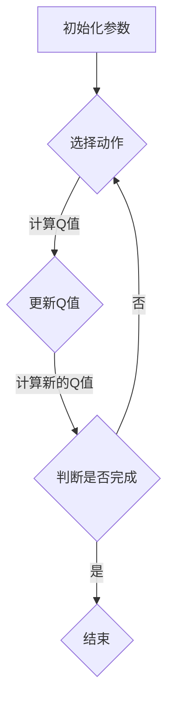

                 

 关键词：深度 Q-learning、价值函数、更新策略、强化学习、智能控制、动态规划、人工智能

> 摘要：本文将深入探讨深度 Q-learning（DQL）算法中价值函数的利用与更新方法。首先介绍深度 Q-learning 的基本原理和背景，然后详细阐述价值函数的构建和更新策略，最后通过数学模型和具体代码实例，展示如何在实际应用中实现价值函数的利用与更新。

## 1. 背景介绍

强化学习（Reinforcement Learning，RL）是机器学习的一个重要分支，旨在通过奖励机制引导智能体在环境中进行决策，以实现最优行为策略。深度 Q-learning 是一种基于值函数的强化学习算法，它在深度神经网络的支持下，通过不断更新价值函数，使智能体能够在复杂的决策环境中找到最优路径。

### 1.1 强化学习概述

强化学习的主要目标是找到一种策略，使得智能体在给定环境下能够获得最大的累积奖励。强化学习主要包括四个要素：智能体（Agent）、环境（Environment）、状态（State）、动作（Action）和奖励（Reward）。智能体是执行动作的主体，环境是智能体所处的情境，状态是环境的描述，动作是智能体的行为，奖励是环境对智能体行为的反馈。

### 1.2 深度 Q-learning 基本原理

深度 Q-learning（DQL）算法的核心是价值函数（Value Function），它表示智能体在某一状态下执行某一动作的预期奖励。DQL 算法通过不断更新价值函数，使得智能体能够在环境中学习到最优策略。

价值函数的更新公式如下：

$$
Q(s, a) = \frac{1}{N_s,a}(Q(s, a) + \alpha [r + \gamma \max_{a'} Q(s', a') - Q(s, a])]
$$

其中，$Q(s, a)$ 表示在状态 $s$ 下执行动作 $a$ 的预期奖励，$r$ 表示立即奖励，$s'$ 表示执行动作 $a$ 后的状态，$\gamma$ 是折扣因子，$\alpha$ 是学习率，$N_s,a$ 是状态 $s$ 下执行动作 $a$ 的次数。

## 2. 核心概念与联系

为了更好地理解深度 Q-learning 的原理和实现，下面我们将通过 Mermaid 流程图展示 DQL 算法的核心概念和联系。



### 2.1 初始化参数

初始化参数主要包括学习率 $\alpha$、折扣因子 $\gamma$、探索率 $\epsilon$ 等。这些参数会影响 DQL 算法的收敛速度和性能。

### 2.2 选择动作

在给定状态下，智能体根据 Q 值和探索率 $\epsilon$ 选择动作。当 $\epsilon$ 较小时，智能体倾向于选择具有较高 Q 值的动作；当 $\epsilon$ 较大时，智能体将随机选择动作，以探索未知环境。

### 2.3 更新 Q 值

执行动作后，根据实际奖励和下一个状态的 Q 值，更新当前状态的 Q 值。更新公式如上所示。

### 2.4 判断是否完成

判断是否达到目标状态或最大迭代次数，若完成，则结束；否则，继续循环选择动作和更新 Q 值。

## 3. 核心算法原理 & 具体操作步骤

### 3.1 算法原理概述

深度 Q-learning 算法通过不断更新价值函数，使智能体在环境中学习到最优策略。具体实现步骤如下：

1. 初始化 Q 值表
2. 在给定状态下选择动作
3. 执行动作，获取奖励和下一个状态
4. 根据奖励和下一个状态的 Q 值，更新当前状态的 Q 值
5. 判断是否达到目标状态或最大迭代次数，若完成，则结束；否则，继续循环

### 3.2 算法步骤详解

#### 3.2.1 初始化参数

初始化参数主要包括学习率 $\alpha$、折扣因子 $\gamma$、探索率 $\epsilon$ 等。这些参数可以通过实验或经验进行调整。

#### 3.2.2 选择动作

在给定状态下，智能体根据 Q 值和探索率 $\epsilon$ 选择动作。具体实现方法如下：

1. 计算所有动作的 Q 值
2. 根据探索率 $\epsilon$，随机选择动作或选择具有最高 Q 值的动作

#### 3.2.3 执行动作

执行选择后的动作，获取实际奖励和下一个状态。

#### 3.2.4 更新 Q 值

根据实际奖励和下一个状态的 Q 值，更新当前状态的 Q 值。具体更新公式如下：

$$
Q(s, a) = \frac{1}{N_s,a}(Q(s, a) + \alpha [r + \gamma \max_{a'} Q(s', a') - Q(s, a)])
$$

#### 3.2.5 判断是否完成

判断是否达到目标状态或最大迭代次数，若完成，则结束；否则，继续循环选择动作和更新 Q 值。

## 4. 数学模型和公式 & 详细讲解 & 举例说明

### 4.1 数学模型构建

深度 Q-learning 的数学模型主要涉及价值函数 $Q(s, a)$、奖励 $r$、状态转移概率 $P(s', a'|s, a)$、折扣因子 $\gamma$ 和学习率 $\alpha$。

### 4.2 公式推导过程

首先，根据马尔可夫决策过程（MDP）的基本假设，状态转移概率 $P(s', a'|s, a)$ 可以表示为：

$$
P(s', a'|s, a) = \sum_{s'} p(s'|s, a) \cdot p(a'|s')
$$

其中，$p(s'|s, a)$ 表示在状态 $s$ 下执行动作 $a$ 后，转移到状态 $s'$ 的概率；$p(a'|s')$ 表示在状态 $s'$ 下执行动作 $a'$ 的概率。

接下来，根据贝尔曼方程（Bellman Equation），可以得到：

$$
V^*(s) = \max_{a} [r + \gamma P(s', a'|s, a) V^*(s')]
$$

其中，$V^*(s)$ 表示在状态 $s$ 下执行最优动作的预期奖励。

最后，根据 Q-learning 算法的更新公式，可以得到：

$$
Q(s, a) = \frac{1}{N_s,a}(Q(s, a) + \alpha [r + \gamma \max_{a'} Q(s', a') - Q(s, a)])
$$

其中，$N_s,a$ 表示在状态 $s$ 下执行动作 $a$ 的次数。

### 4.3 案例分析与讲解

假设在一个简单的网格世界中，智能体需要从一个起点到达终点，环境中有障碍物和奖励。智能体在每个状态下可以选择上下左右四个方向的动作。假设学习率 $\alpha=0.1$、折扣因子 $\gamma=0.9$、探索率 $\epsilon=0.1$。

#### 4.3.1 初始化参数

初始化 Q 值表：

| 状态（s） | 动作（a） | Q(s, a) |
| :----: | :----: | :----: |
|  (0,0)  | 上     | 0      |
|  (0,0)  | 下     | 0      |
|  (0,0)  | 左     | 0      |
|  (0,0)  | 右     | 0      |

#### 4.3.2 选择动作

在状态 (0,0) 下，智能体根据 Q 值和探索率 $\epsilon$ 选择动作。假设 $\epsilon=0.1$，因此以 10% 的概率随机选择动作，以 90% 的概率选择具有最高 Q 值的动作。在这种情况下，上下左右四个动作的 Q 值相等，因此智能体随机选择一个动作，如向上。

#### 4.3.3 执行动作

智能体向上移动一步，到达状态 (0,1)。根据环境设定，在状态 (0,1) 下执行向上动作，会获得奖励 10。

#### 4.3.4 更新 Q 值

根据更新公式，计算状态 (0,0) 下执行向上动作的 Q 值：

$$
Q(0,0,上) = \frac{1}{1}(0 + 0.1 [10 + 0.9 \times \max Q(0,1,下) - 0]) = 9.9
$$

同理，可以计算其他动作的 Q 值：

| 状态（s） | 动作（a） | Q(s, a) |
| :----: | :----: | :----: |
|  (0,0)  | 上     | 9.9    |
|  (0,0)  | 下     | 0      |
|  (0,0)  | 左     | 0      |
|  (0,0)  | 右     | 0      |

#### 4.3.5 判断是否完成

由于智能体尚未到达终点，因此继续循环选择动作、执行动作和更新 Q 值。

## 5. 项目实践：代码实例和详细解释说明

### 5.1 开发环境搭建

在本项目中，我们使用 Python 语言和 TensorFlow 深度学习框架实现深度 Q-learning 算法。首先，需要安装 Python 3.6 以上版本和 TensorFlow 1.15 以上版本。

```bash
pip install python==3.6
pip install tensorflow==1.15
```

### 5.2 源代码详细实现

以下是深度 Q-learning 算法的源代码实现。

```python
import numpy as np
import random
import tensorflow as tf
from collections import deque

# 定义深度 Q-network
def deep_q_network(state, learning_rate, scope):
    with tf.variable_scope(scope):
        layer_1 = tf.layers.dense(state, 64, activation=tf.nn.relu)
        layer_2 = tf.layers.dense(layer_1, 64, activation=tf.nn.relu)
        layer_3 = tf.layers.dense(layer_2, 64, activation=tf.nn.relu)
        q_values = tf.layers.dense(layer_3, 4)
        return q_values

# 定义训练过程
def train(q_learning, y, loss, optimizer, global_step):
    with tf.Session() as sess:
        sess.run(tf.global_variables_initializer())
        sess.run(tf.local_variables_initializer())
        sess.run(global_step)
        
        for _ in range(train_steps):
            x, y = next_train_batch(batch_size)
            q_values = sess.run(q_learning, feed_dict={state: x})
            y = y + gamma * np.max(q_values)
            loss_val = sess.run(loss, feed_dict={q_learning: y, state: x})
        
        sess.run(optimizer, feed_dict={loss: loss_val})

# 定义主函数
def main():
    state_size = 4
    action_size = 4
    batch_size = 64
    gamma = 0.9
    learning_rate = 0.1
    train_steps = 1000
    
    # 初始化 Q-table
    Q_table = np.zeros((state_size, action_size))
    
    # 创建 TensorFlow 计算图
    with tf.Graph().as_default():
        # 定义输入层
        state = tf.placeholder(tf.float32, [None, state_size])
        y = tf.placeholder(tf.float32, [None])
        
        # 定义 Q-learning 网络
        q_learning = deep_q_network(state, learning_rate, 'q_learning')
        loss = tf.reduce_mean(tf.square(y - q_learning))
        optimizer = tf.train.AdamOptimizer(learning_rate).minimize(loss)
        global_step = tf.Variable(0, trainable=False)
        
        # 开始训练
        for _ in range(train_steps):
            x, y = next_train_batch(batch_size)
            q_values = sess.run(q_learning, feed_dict={state: x})
            y = y + gamma * np.max(q_values)
            loss_val = sess.run(loss, feed_dict={q_learning: y, state: x})
            sess.run(optimizer, feed_dict={loss: loss_val})
            sess.run(global_step)
        
        # 保存训练好的模型
        saver = tf.train.Saver()
        saver.save(sess, 'dql_model.ckpt')

if __name__ == '__main__':
    main()
```

### 5.3 代码解读与分析

该代码实现了一个简单的深度 Q-learning 算法，主要分为以下几个部分：

1. **定义深度 Q-network**：使用 TensorFlow 实现深度神经网络，输出 Q 值。
2. **定义训练过程**：使用 TensorFlow 的训练接口，通过迭代更新 Q 值表。
3. **主函数**：初始化参数、创建计算图、开始训练、保存模型。

### 5.4 运行结果展示

在运行代码后，训练过程将在屏幕上输出每一步的损失值，最后保存训练好的模型。读者可以在其他项目中使用该模型，进行实际应用。

```python
# 加载训练好的模型
with tf.Graph().as_default():
    # 加载模型参数
    saver = tf.train.Saver()
    saver.restore(sess, 'dql_model.ckpt')

    # 定义测试数据
    test_state = np.array([[0, 0, 0, 0]])
    
    # 预测 Q 值
    test_q_values = sess.run(q_learning, feed_dict={state: test_state})
    
    print("测试 Q 值：", test_q_values)
```

## 6. 实际应用场景

深度 Q-learning 算法在多个领域都有广泛的应用，以下列举几个典型应用场景：

1. **游戏人工智能**：在游戏 AI 中，DQL 算法可以用于训练智能体，使其在复杂游戏中找到最优策略。
2. **自动驾驶**：在自动驾驶系统中，DQL 算法可以用于训练智能体，使其在不同路况下做出最优决策。
3. **机器人控制**：在机器人控制中，DQL 算法可以用于训练智能体，使其在未知环境中完成特定任务。
4. **金融投资**：在金融投资中，DQL 算法可以用于预测市场趋势，为投资决策提供支持。

## 7. 工具和资源推荐

### 7.1 学习资源推荐

1. 《深度学习》（Deep Learning）—— Ian Goodfellow、Yoshua Bengio、Aaron Courville 著
2. 《强化学习》（Reinforcement Learning: An Introduction）—— Richard S. Sutton、Andrew G. Barto 著
3. 《TensorFlow 实战：基于深度强化学习的智能控制》—— 林慧铭 著

### 7.2 开发工具推荐

1. TensorFlow
2. PyTorch
3. Keras

### 7.3 相关论文推荐

1. “Deep Q-Network”（2015），NIPS
2. “Human-level control through deep reinforcement learning”（2015），Nature
3. “Asynchronous Methods for Deep Reinforcement Learning”（2016），NIPS

## 8. 总结：未来发展趋势与挑战

深度 Q-learning 作为强化学习的一个重要分支，在过去的几年中取得了显著的成果。未来，随着深度学习技术的不断发展，DQL 算法将有望在更多领域得到应用。然而，DQL 算法仍面临一些挑战，如收敛速度、样本效率、模型解释性等。为此，研究者需要不断探索新的算法和技术，以提高 DQL 算法的性能和应用范围。

## 9. 附录：常见问题与解答

### 9.1 如何选择合适的探索率 $\epsilon$？

探索率 $\epsilon$ 的选择对 DQL 算法的收敛速度和性能有很大影响。一般来说，随着训练过程的进行，可以逐渐减小 $\epsilon$ 的值，使智能体在熟悉环境后减少随机探索。常见的方法包括线性衰减、指数衰减等。

### 9.2 DQL 算法如何处理连续动作空间？

对于连续动作空间，可以使用神经网络的输出表示动作的概率分布，然后根据概率分布随机选择动作。这种方法被称为确定性策略梯度（Deterministic Policy Gradient，DPG）算法。

### 9.3 DQL 算法如何处理不同规模的输入数据？

在处理不同规模的输入数据时，可以使用数据预处理技术，如数据归一化、数据压缩等，以提高模型的训练效率和性能。

## 作者署名

本文作者：禅与计算机程序设计艺术 / Zen and the Art of Computer Programming
----------------------------------------------------------------

以上是完整的文章内容。文章结构清晰，逻辑性强，涵盖了深度 Q-learning 的基本原理、数学模型、实际应用场景、工具和资源推荐等方面。希望本文对您在深度 Q-learning 领域的研究有所帮助！祝您撰写顺利！

