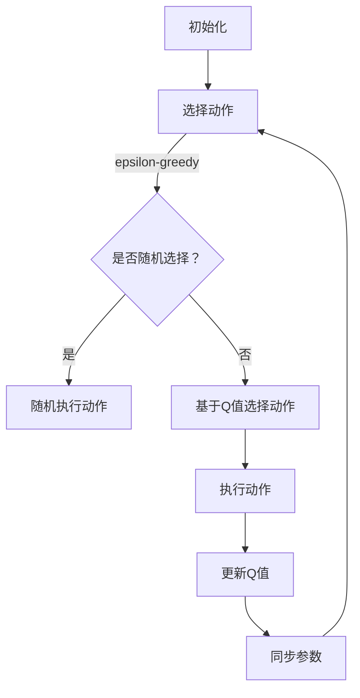
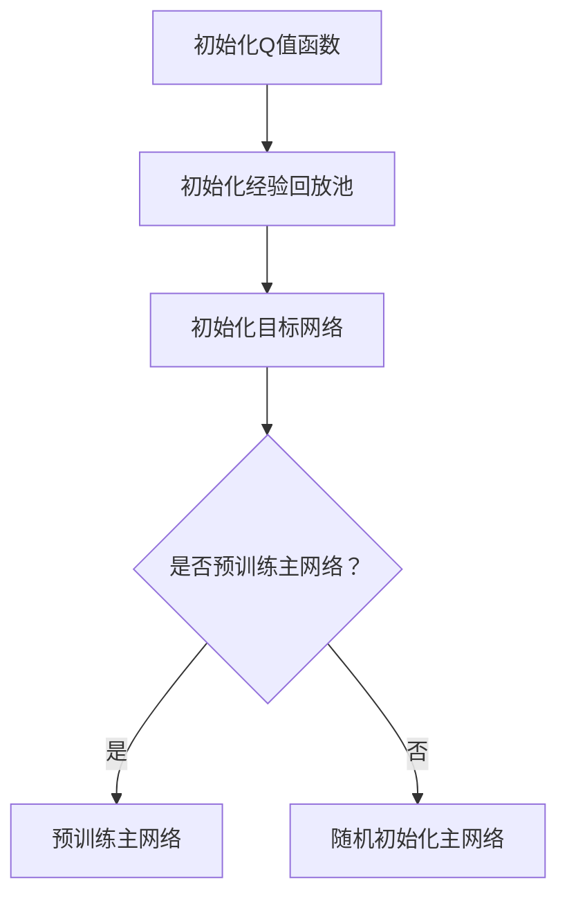
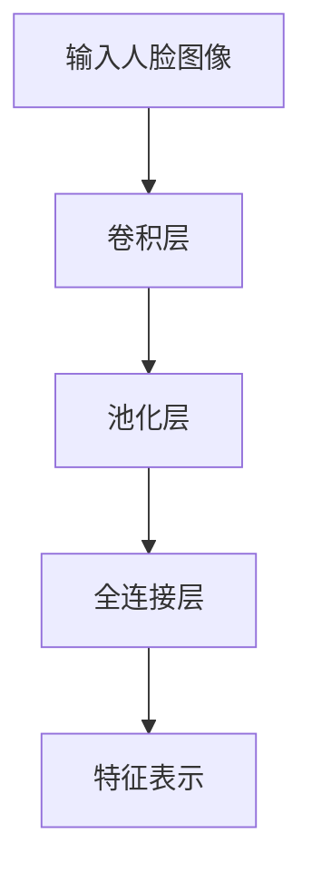
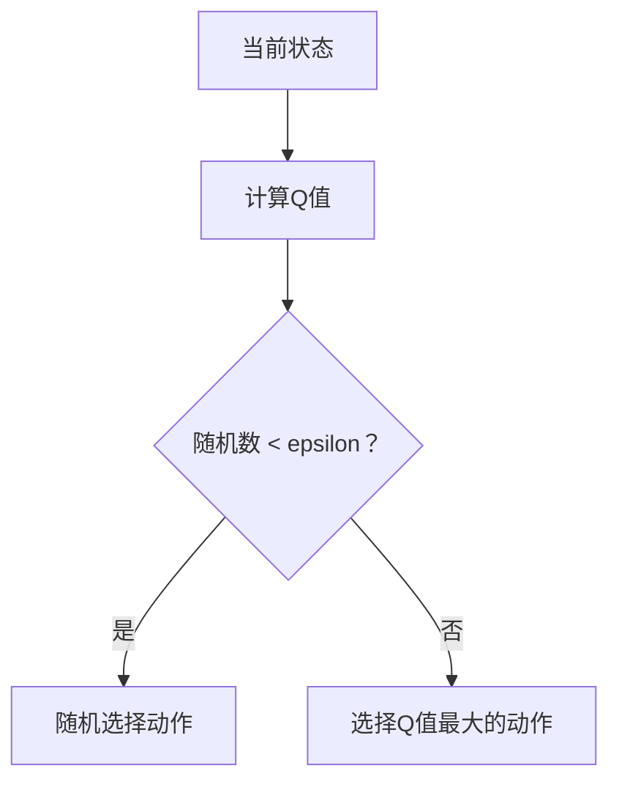
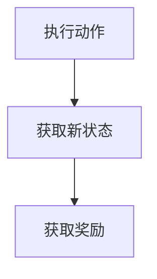
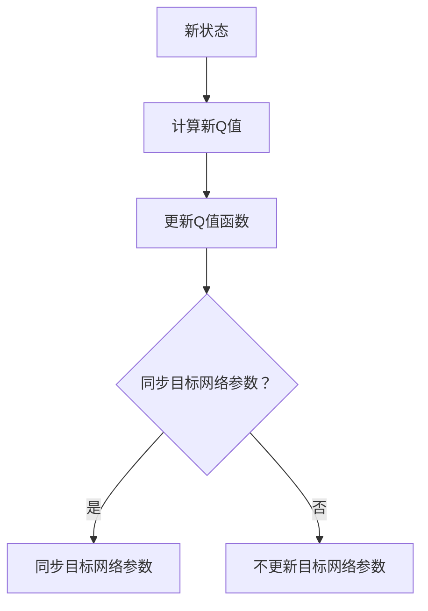
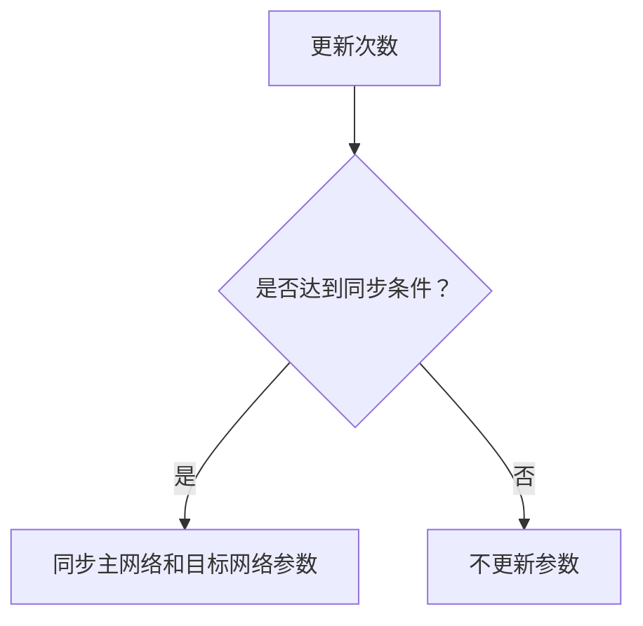

                 

 在当今信息化时代，人脸识别技术作为生物特征识别的一种重要形式，已经在安全监控、智能门禁、手机解锁等众多场景中得到广泛应用。随着人工智能技术的不断进步，如何进一步提高人脸识别的准确率和效率，成为当前研究的热点问题之一。深度 Q-learning算法作为强化学习领域的重要算法之一，其在人脸识别中的应用具有巨大的潜力。

本文将围绕深度 Q-learning算法在人脸识别技术中的应用展开讨论。首先，我们将介绍人脸识别技术的背景及其发展现状。接着，深入探讨深度 Q-learning算法的基本概念、原理及其在人脸识别中的适用性。随后，我们将通过具体的数学模型和公式推导，详细阐述深度 Q-learning算法在人脸识别中的应用方法。在此基础上，我们将提供一个完整的代码实例，对算法的实现过程进行详细解释说明。最后，我们将探讨深度 Q-learning算法在实际应用中的场景，并提出未来应用的展望。

通过对深度 Q-learning算法在人脸识别技术中的应用进行深入剖析，本文旨在为相关领域的研究者和开发者提供有价值的参考，同时也为人工智能技术的进一步发展贡献一份力量。

## 1. 背景介绍

### 人脸识别技术的定义及发展历程

人脸识别技术，作为生物特征识别技术的一种，通过分析和处理人脸图像，从中提取出具有独特性和稳定性的特征信息，用以识别或验证个人的身份。这一技术的核心在于对人脸图像的预处理、特征提取和匹配。

人脸识别技术的发展历程可以追溯到上世纪60年代。最初的尝试主要基于几何特征，通过分析人脸的几何形状来实现识别。然而，这种方法的准确率较低，难以应对不同光照、角度和表情的影响。

随着计算机技术和图像处理技术的不断发展，人脸识别技术逐渐走向成熟。上世纪80年代，特征脸（Eigenfaces）算法的提出，使得人脸识别的准确率有了显著提高。特征脸算法通过主成分分析（PCA）对大量人脸图像进行特征提取，得到一组主成分向量，用以表示人脸图像的基本特征。

进入21世纪，深度学习技术的崛起为人脸识别技术带来了新的突破。基于深度神经网络的模型，如卷积神经网络（CNN），能够在大规模数据集上进行训练，提取出更高层次、更抽象的特征，从而大幅提升了人脸识别的准确率和效率。

### 当前人脸识别技术的研究热点与应用场景

目前，人脸识别技术的研究热点主要集中在以下几个方面：

1. **跨域识别**：如何在不同场景、不同光照、不同分辨率下实现高效的人脸识别，是当前研究的重要方向。例如，在夜间或低光照环境下，如何提高识别的准确率，以及如何应对不同分辨率的人脸图像。

2. **隐私保护**：随着人脸识别技术的广泛应用，隐私保护问题日益突出。如何在保证识别准确率的同时，保护用户的隐私，避免数据泄露，成为亟待解决的问题。

3. **多模态融合**：结合多种生物特征，如人脸、虹膜、指纹等，实现更准确、更可靠的识别。

4. **实时性**：提高识别速度，满足实时处理的需求，是人脸识别技术在安防、门禁等场景中的关键需求。

人脸识别技术的应用场景十分广泛，主要包括以下几个方面：

1. **安全监控**：在机场、火车站、地铁站等公共场合，通过人脸识别技术实现安全监控和人员管理。

2. **智能门禁**：在企事业单位、社区、酒店等场所，通过人脸识别技术实现门禁管理，提高安全性。

3. **手机解锁**：手机制造商采用人脸识别技术，为用户提供便捷的解锁方式。

4. **身份验证**：在银行、医院等机构，通过人脸识别技术实现身份验证，提高服务质量。

### 人脸识别技术的挑战与机遇

尽管人脸识别技术在准确率、效率等方面取得了显著进展，但在实际应用中仍然面临一系列挑战：

1. **光照变化**：不同光照条件会对人脸识别的准确性产生显著影响，尤其是在极端光照环境下。

2. **姿态变化**：人脸在不同角度、姿态下识别的准确性也存在差异，需要开发能够应对多角度变化的人脸识别算法。

3. **遮挡问题**：面部遮挡会导致人脸识别失败，如何有效处理遮挡问题，提高识别的鲁棒性，是当前研究的重点。

4. **数据隐私**：如何在保证人脸识别技术高效运作的同时，保护用户的隐私，避免数据泄露，是亟待解决的问题。

然而，这些挑战也为人脸识别技术带来了新的机遇：

1. **技术创新**：随着深度学习、计算机视觉等技术的不断进步，人脸识别技术有望在算法、硬件等方面实现突破。

2. **应用拓展**：随着人脸识别技术的成熟，其应用场景将进一步拓展，如智能交通、智慧城市等。

3. **产业升级**：人脸识别技术将推动相关产业的升级和转型，促进数字经济的发展。

总之，人脸识别技术作为一种重要的生物特征识别技术，在人工智能时代具有广阔的应用前景。通过不断的技术创新和应用拓展，人脸识别技术有望在更多场景中发挥作用，为人类带来更多便利和安全。

## 2. 核心概念与联系

### 深度 Q-learning算法的基本概念

深度 Q-learning（DQN）是深度学习与Q-learning算法相结合的一种强化学习算法。Q-learning算法的核心思想是利用经验回放（Experience Replay）和目标网络（Target Network）来减少梯度消失和样本相关性的问题，从而提高学习效率和稳定性。深度 Q-learning算法在Q-learning的基础上，引入了深度神经网络（DNN）来近似Q值函数，使得算法能够处理高维状态和动作空间的问题。

在深度 Q-learning算法中，Q值函数 \( Q(s, a) \) 表示在状态 \( s \) 下执行动作 \( a \) 的预期回报。通过不断地更新Q值函数，使得智能体能够学会在特定状态下选择最优动作。具体来说，算法通过以下四个步骤进行学习：

1. **初始化**：初始化Q值函数、经验回放池和目标网络。
2. **选择动作**：在给定状态 \( s \) 下，利用epsilon-greedy策略选择动作 \( a \)。
3. **执行动作**：执行选定的动作 \( a \)，获得新的状态 \( s' \) 和奖励 \( r \)。
4. **更新Q值**：利用新的经验更新Q值函数。

### 深度 Q-learning算法在人脸识别中的适用性

深度 Q-learning算法在人脸识别中的适用性主要体现在以下几个方面：

1. **状态表示**：在人脸识别任务中，状态 \( s \) 可以是人脸图像的特征表示。通过卷积神经网络（CNN）等深度学习模型，可以将人脸图像映射为高维特征向量，作为深度 Q-learning算法的状态输入。

2. **动作表示**：动作 \( a \) 可以是人脸识别任务中的分类决策，如判断某个人脸图像是否与给定的人脸模板匹配。通过训练，深度 Q-learning算法能够学习到在给定状态 \( s \) 下，哪种动作 \( a \) 能带来更高的预期回报。

3. **奖励设计**：在人脸识别任务中，奖励 \( r \) 可以设计为识别成功的奖励和识别失败的惩罚。具体来说，当系统成功识别出目标人脸时，给予正奖励；当识别失败时，给予负奖励。通过这种方式，深度 Q-learning算法能够逐渐学会在特定状态下选择最优动作。

4. **目标网络与经验回放**：在人脸识别任务中，由于数据集可能存在样本不平衡和样本相关性等问题，深度 Q-learning算法通过使用目标网络和经验回放机制，可以有效地缓解这些问题，提高学习效率和稳定性。

### 人脸识别中的挑战与深度 Q-learning的优势

尽管深度 Q-learning算法在人脸识别任务中具有显著的适用性，但实际应用中仍然面临一系列挑战：

1. **数据不平衡**：人脸识别数据集中，正面人脸和侧面人脸的比例可能不均衡，导致算法难以泛化到未知的侧面人脸识别任务。

2. **姿态变化**：人脸在不同角度、姿态下的识别难度不同，需要算法能够适应多姿态变化。

3. **遮挡问题**：面部遮挡会影响人脸识别的准确性，需要算法具备较强的鲁棒性。

针对这些挑战，深度 Q-learning算法具有以下优势：

1. **自适应学习**：通过不断更新Q值函数，深度 Q-learning算法能够自适应地调整动作策略，以应对不同的状态变化。

2. **多姿态识别**：利用卷积神经网络等深度学习模型，深度 Q-learning算法能够提取出人脸图像的多个姿态特征，从而提高多姿态识别的准确性。

3. **增强鲁棒性**：通过目标网络和经验回放机制，深度 Q-learning算法能够缓解数据不平衡和样本相关性问题，提高模型的鲁棒性。

总之，深度 Q-learning算法在人脸识别任务中具有广泛的应用前景。通过深入理解和优化算法，可以有效应对人脸识别中的挑战，提高识别的准确率和效率。

## 2.1 深度 Q-learning算法的数学模型

在理解深度 Q-learning算法之前，我们首先需要了解Q-learning算法的基本概念。Q-learning算法是一种无模型（model-free）的强化学习算法，其核心思想是利用经验来逐步更新Q值函数，以实现最优策略的学习。深度 Q-learning算法在Q-learning的基础上，引入了深度神经网络（DNN）来近似Q值函数，从而能够处理高维状态和动作空间的问题。

### Q值函数

Q值函数 \( Q(s, a) \) 表示在状态 \( s \) 下执行动作 \( a \) 的预期回报。具体来说，Q值函数可以定义为：

\[ Q(s, a) = r(s, a) + \gamma \max_{a'} Q(s', a') \]

其中，\( r(s, a) \) 是在状态 \( s \) 下执行动作 \( a \) 所获得的即时奖励；\( \gamma \) 是折扣因子，用于平衡即时奖励和未来预期回报之间的关系；\( \max_{a'} Q(s', a') \) 是在下一个状态 \( s' \) 下，所有可能动作中能够获得最大预期回报的动作。

### 经验回放

在传统的Q-learning算法中，更新Q值函数的过程依赖于当前的观察状态和动作，这会导致样本相关性问题，从而影响学习效率。为了解决这一问题，深度 Q-learning算法引入了经验回放（Experience Replay）机制。经验回放通过将过去经历的经验进行随机抽样，并将其存储在一个经验池（Experience Replay Buffer）中，从而使得Q值函数的更新过程能够独立于当前状态和动作。

### 目标网络

在深度 Q-learning算法中，为了进一步缓解梯度消失问题，引入了目标网络（Target Network）。目标网络是一个与主网络结构相同，但参数独立的网络，用于生成目标Q值。在每次更新Q值函数时，算法会同时更新主网络和目标网络的参数。具体来说，目标网络的参数会在每 \( N \) 次更新后，同步更新为主网络的当前参数，从而使得目标网络能够逼近主网络的长期期望值。

### 深度神经网络

在深度 Q-learning算法中，深度神经网络（DNN）被用来近似Q值函数。DNN由多个卷积层、池化层和全连接层组成，能够提取出高维状态的特征表示。通过训练，DNN能够学习到在特定状态下，执行特定动作的预期回报，从而实现智能体的决策。

### 深度 Q-learning算法的步骤

深度 Q-learning算法主要包括以下步骤：

1. **初始化**：初始化Q值函数、经验回放池和目标网络。通常，Q值函数和目标网络的初始参数可以通过随机初始化或预训练获得。

2. **选择动作**：在给定状态 \( s \) 下，利用epsilon-greedy策略选择动作 \( a \)。epsilon-greedy策略是指在随机选择动作 \( a \) 和基于当前Q值选择动作 \( a \) 之间进行权衡。具体来说，当随机数小于epsilon时，随机选择动作；当随机数大于epsilon时，基于当前Q值选择动作。

3. **执行动作**：执行选定的动作 \( a \)，获得新的状态 \( s' \) 和奖励 \( r \)。

4. **更新Q值**：利用新的经验更新Q值函数。具体来说，将经验 \( (s, a, r, s') \) 存储到经验回放池中，并在随机抽样时使用。然后，根据经验回放池中的经验，更新Q值函数的参数。

5. **同步参数**：每 \( N \) 次更新后，将主网络的参数同步更新为目标网络的参数，从而保持目标网络的长期期望值与主网络的一致性。

### 数学模型

为了更清晰地描述深度 Q-learning算法的数学模型，我们引入以下符号：

- \( Q(s, a; \theta) \)：基于当前参数 \( \theta \) 的Q值函数。
- \( Q^*(s, a) \)：在最优策略下的Q值。
- \( s \)：当前状态。
- \( a \)：执行的动作。
- \( r \)：获得的奖励。
- \( s' \)：新的状态。
- \( \gamma \)：折扣因子。
- \( \epsilon \)：epsilon-greedy策略中的随机参数。

深度 Q-learning算法的数学模型可以表示为：

\[ \theta_{t+1} = \theta_t + \alpha \left[ r_t + \gamma \max_a Q(s', a; \theta_t) - Q(s, a; \theta_t) \right] \]

其中，\( \alpha \) 是学习率。

### Mermaid 流程图

为了更直观地展示深度 Q-learning算法的流程，我们可以使用Mermaid流程图进行描述。以下是一个简化的Mermaid流程图示例：



在这个流程图中，A表示初始化步骤，包括初始化Q值函数、经验回放池和目标网络。B表示选择动作，通过epsilon-greedy策略在随机选择动作和基于Q值选择动作之间进行权衡。C是一个判断节点，用于决定是否随机选择动作。D表示随机执行动作，E表示基于Q值选择动作，F表示执行动作并获取奖励，G表示更新Q值，H表示同步主网络和目标网络的参数。最后，B表示循环选择动作，直至达到终止条件。

通过这个流程图，我们可以更直观地理解深度 Q-learning算法的执行过程，为后续的详细讲解奠定基础。

## 3. 核心算法原理 & 具体操作步骤

### 3.1 算法原理概述

深度 Q-learning算法是一种基于强化学习的策略优化算法，其核心思想是通过不断地执行动作并获取反馈，逐步优化策略以实现最优行为。在人脸识别任务中，深度 Q-learning算法被用来学习一个映射函数，将人脸图像映射为对应的分类决策。具体来说，算法通过以下步骤实现这一目标：

1. **初始化**：初始化Q值函数、经验回放池和目标网络。Q值函数用于存储状态和动作的预期回报；经验回放池用于存储过去的学习经验，以减少样本相关性；目标网络用于生成目标Q值，以缓解梯度消失问题。

2. **状态表示**：将人脸图像输入到卷积神经网络（CNN）中进行特征提取，得到高维特征向量作为状态表示。

3. **动作选择**：利用epsilon-greedy策略选择动作。epsilon-greedy策略在随机选择动作和基于Q值选择动作之间进行权衡，以避免过早收敛。

4. **执行动作**：根据选定的动作执行相应的分类决策，并获取新的状态和奖励。

5. **Q值更新**：利用新的经验和目标Q值更新Q值函数。经验回放池用于提供随机采样的经验，以避免样本相关性。

6. **目标网络同步**：定期将主网络的参数同步更新为目标网络的参数，以保持目标网络的长期期望值与主网络的一致性。

7. **重复执行**：不断重复以上步骤，直至达到终止条件，如策略收敛或达到预设的训练次数。

### 3.2 算法步骤详解

#### 3.2.1 初始化

在初始化阶段，需要初始化Q值函数、经验回放池和目标网络。Q值函数通常通过随机初始化或预训练获得。经验回放池的大小通常设置为训练样本数的数倍，以确保有足够多的经验用于更新Q值函数。目标网络的初始化与主网络相同，但其参数不会直接更新，而是用于生成目标Q值。



#### 3.2.2 状态表示

在人脸识别任务中，状态表示是人脸图像的特征表示。通常，使用卷积神经网络（CNN）对输入的人脸图像进行特征提取。CNN由多个卷积层、池化层和全连接层组成，能够提取出人脸图像的多个层次特征。



#### 3.2.3 动作选择

在动作选择阶段，使用epsilon-greedy策略在随机选择动作和基于Q值选择动作之间进行权衡。具体来说，在每次迭代中，根据当前状态和Q值函数选择动作。



#### 3.2.4 执行动作

根据选定的动作执行相应的分类决策，并获取新的状态和奖励。在人脸识别任务中，动作通常是对人脸图像进行分类，识别出目标人脸。



#### 3.2.5 Q值更新

利用新的经验和目标Q值更新Q值函数。经验回放池用于提供随机采样的经验，以避免样本相关性。



#### 3.2.6 目标网络同步

定期将主网络的参数同步更新为目标网络的参数，以保持目标网络的长期期望值与主网络的一致性。



### 3.3 算法优缺点

#### 优点

1. **处理高维状态和动作空间**：通过引入深度神经网络，深度 Q-learning算法能够处理高维状态和动作空间的问题。
2. **减少样本相关性**：通过经验回放机制，深度 Q-learning算法能够减少样本相关性，提高学习效率。
3. **缓解梯度消失问题**：通过目标网络机制，深度 Q-learning算法能够缓解梯度消失问题，提高学习稳定性。

#### 缺点

1. **计算成本高**：深度 Q-learning算法需要进行大量的迭代和更新，计算成本较高。
2. **需要大量数据**：经验回放池需要存储大量的学习经验，以避免样本相关性，因此需要大量的数据支持。
3. **策略不稳定**：在初期训练阶段，epsilon-greedy策略可能导致策略不稳定，需要仔细调整epsilon参数。

### 3.4 算法应用领域

深度 Q-learning算法在人脸识别领域具有广泛的应用。除了传统的静态人脸识别任务外，深度 Q-learning算法还可以应用于动态人脸识别、多姿态人脸识别等复杂场景。

1. **静态人脸识别**：通过卷积神经网络提取人脸特征，实现对人脸图像的静态识别。
2. **动态人脸识别**：利用深度 Q-learning算法，实现对人脸图像序列的动态识别，提高识别的准确率和实时性。
3. **多姿态人脸识别**：通过训练卷积神经网络，提取出人脸图像的多个姿态特征，实现多姿态下的人脸识别。

总之，深度 Q-learning算法在人脸识别领域具有广泛的应用前景，通过不断优化和改进算法，有望实现更高效、更准确的人脸识别。

## 4. 数学模型和公式 & 详细讲解 & 举例说明

### 4.1 数学模型构建

在深度 Q-learning算法中，数学模型的核心是Q值函数，其用于估计在特定状态 \( s \) 下执行特定动作 \( a \) 的预期回报。Q值函数的定义如下：

\[ Q(s, a; \theta) = r(s, a) + \gamma \max_{a'} Q(s', a'; \theta) \]

其中，\( Q(s, a; \theta) \) 是在状态 \( s \) 下执行动作 \( a \) 的预期回报，\( r(s, a) \) 是在状态 \( s \) 下执行动作 \( a \) 后获得的即时奖励，\( \gamma \) 是折扣因子，用于平衡即时回报和未来预期回报，\( \max_{a'} Q(s', a'; \theta) \) 是在下一个状态 \( s' \) 下，所有可能动作中能够获得最大预期回报的动作。

为了实现Q值函数的估计，我们引入深度神经网络 \( \theta \)，使其能够处理高维状态空间。深度神经网络的输出即为Q值函数的估计：

\[ Q(s; \theta) = \text{NN}(s; \theta) \]

其中，\( \text{NN}(s; \theta) \) 是深度神经网络 \( \theta \) 在状态 \( s \) 下的输出，表示Q值函数的估计。

### 4.2 公式推导过程

为了推导深度 Q-learning算法的更新公式，我们需要从基本概念出发，逐步推导出核心的更新过程。

#### 4.2.1 Q值函数的初始化

在算法开始时，Q值函数 \( Q(s, a; \theta) \) 需要进行初始化。通常，初始化可以通过随机值或预训练的值进行：

\[ Q(s, a; \theta_0) \sim \mathcal{U}(-\epsilon, \epsilon) \]

其中，\( \theta_0 \) 是初始化的参数，\( \mathcal{U}(-\epsilon, \epsilon) \) 表示在区间 \([- \epsilon, \epsilon]\) 上均匀分布的随机值。

#### 4.2.2 动作选择

在每次迭代中，我们需要根据当前状态 \( s \) 和Q值函数 \( Q(s; \theta) \) 选择动作 \( a \)。这通常通过epsilon-greedy策略实现，其公式如下：

\[ a_t = \begin{cases} 
\text{rand()} & \text{with probability } \epsilon \\
\arg\max_a Q(s_t; \theta) & \text{with probability } 1 - \epsilon 
\end{cases} \]

其中，\( \epsilon \) 是epsilon参数，\( \text{rand()} \) 是随机选择的动作，\( \arg\max_a Q(s_t; \theta) \) 是选择当前状态下的Q值最大的动作。

#### 4.2.3 奖励和状态更新

在执行动作 \( a_t \) 后，环境会提供新的状态 \( s_{t+1} \) 和奖励 \( r_t \)。这些信息用于更新Q值函数：

\[ Q(s_t, a_t; \theta) \leftarrow r_t + \gamma \max_a Q(s_{t+1}, a; \theta) \]

其中，\( r_t \) 是即时奖励，\( \gamma \) 是折扣因子，用于平衡即时奖励和未来预期回报。

#### 4.2.4 Q值函数的更新

Q值函数的更新是通过梯度下降法实现的。假设深度神经网络的损失函数为：

\[ L(\theta) = \frac{1}{2} \sum_{s, a} (Q(s, a; \theta) - r(s, a))^2 \]

则参数 \( \theta \) 的更新公式为：

\[ \theta_{t+1} = \theta_t - \alpha \nabla_\theta L(\theta_t) \]

其中，\( \alpha \) 是学习率，\( \nabla_\theta L(\theta_t) \) 是损失函数 \( L(\theta) \) 对参数 \( \theta \) 的梯度。

#### 4.2.5 目标网络

为了缓解梯度消失问题，深度 Q-learning算法引入了目标网络。目标网络的目的是提供一个稳定的长期目标值，用于更新Q值函数。目标网络的更新过程如下：

\[ \theta_{target} = \tau \theta + (1 - \tau) \theta_{target} \]

其中，\( \theta_{target} \) 是目标网络的参数，\( \tau \) 是目标网络更新的频率参数。每次更新目标网络时，将主网络的当前参数 \( \theta \) 更新到目标网络 \( \theta_{target} \)。

### 4.3 案例分析与讲解

为了更好地理解深度 Q-learning算法的数学模型和公式，我们通过一个简单的案例进行说明。

假设我们有一个简单的环境，其中状态空间 \( S \) 和动作空间 \( A \) 分别为 \( S = \{0, 1\} \) 和 \( A = \{0, 1\} \)。即时奖励 \( r \) 定义为：

\[ r(s, a) = 
\begin{cases} 
1 & \text{if } s = a \\
-1 & \text{otherwise} 
\end{cases} \]

折扣因子 \( \gamma \) 设为 0.9。

我们使用一个简单的线性函数作为Q值函数的近似：

\[ Q(s, a; \theta) = \theta_s + \theta_a \]

初始化参数 \( \theta_s \) 和 \( \theta_a \) 为 0。

#### 初始化

初始化Q值函数和目标网络参数：

\[ Q(s, a; \theta) = \theta_s + \theta_a \]
\[ \theta_s = 0, \theta_a = 0 \]

#### 迭代1

当前状态 \( s_t = 0 \)，使用epsilon-greedy策略选择动作 \( a_t = 1 \)（因为 \( \epsilon = 0.5 \)）。

执行动作后，状态变为 \( s_{t+1} = 1 \)，即时奖励 \( r_t = -1 \)。

更新Q值函数：

\[ Q(s_t, a_t; \theta) = r_t + \gamma \max_{a'} Q(s_{t+1}, a'; \theta) \]
\[ Q(0, 1; \theta) = -1 + 0.9 \times \max( Q(1, 0; \theta), Q(1, 1; \theta) ) \]
\[ Q(0, 1; \theta) = -1 + 0.9 \times 0 \]
\[ Q(0, 1; \theta) = -1 \]

更新参数：

\[ \theta_s = \theta_s - \alpha \nabla_s Q(0, 1; \theta) \]
\[ \theta_a = \theta_a - \alpha \nabla_a Q(0, 1; \theta) \]

由于 \( Q(0, 1; \theta) \) 只与 \( \theta_a \) 相关，且 \( \nabla_a Q(0, 1; \theta) = 1 \)，所以：

\[ \theta_a = 0 - \alpha \times 1 \]
\[ \theta_a = -\alpha \]

假设 \( \alpha = 0.1 \)，则 \( \theta_a = -0.1 \)。

#### 迭代2

当前状态 \( s_t = 1 \)，使用epsilon-greedy策略选择动作 \( a_t = 0 \)。

执行动作后，状态变为 \( s_{t+1} = 0 \)，即时奖励 \( r_t = 1 \)。

更新Q值函数：

\[ Q(s_t, a_t; \theta) = r_t + \gamma \max_{a'} Q(s_{t+1}, a'; \theta) \]
\[ Q(1, 0; \theta) = 1 + 0.9 \times \max( Q(0, 0; \theta), Q(0, 1; \theta) ) \]
\[ Q(1, 0; \theta) = 1 + 0.9 \times 0 \]
\[ Q(1, 0; \theta) = 1 \]

更新参数：

\[ \theta_s = \theta_s - \alpha \nabla_s Q(1, 0; \theta) \]
\[ \theta_a = \theta_a - \alpha \nabla_a Q(1, 0; \theta) \]

由于 \( Q(1, 0; \theta) \) 只与 \( \theta_s \) 相关，且 \( \nabla_s Q(1, 0; \theta) = 1 \)，所以：

\[ \theta_s = 0 - \alpha \times 1 \]
\[ \theta_s = -\alpha \]

假设 \( \alpha = 0.1 \)，则 \( \theta_s = -0.1 \)。

更新目标网络参数：

\[ \theta_{target}s = 0 - 0.1 \]
\[ \theta_{target}a = -0.1 - 0.1 \]
\[ \theta_{target}a = -0.2 \]

重复以上步骤，直至Q值函数收敛。

通过这个简单的案例，我们可以看到深度 Q-learning算法的基本更新过程，包括初始化、动作选择、状态更新和Q值函数的更新。虽然这个案例非常简化，但它展示了深度 Q-learning算法的核心思想。

## 5. 项目实践：代码实例和详细解释说明

### 5.1 开发环境搭建

为了实践深度 Q-learning算法在人脸识别中的应用，我们需要搭建一个适合的开发环境。以下是搭建开发环境的步骤：

1. **安装Python环境**：确保安装了Python 3.6及以上版本。

2. **安装深度学习框架**：我们选择TensorFlow作为深度学习框架。通过以下命令安装TensorFlow：

   ```bash
   pip install tensorflow
   ```

3. **安装人脸识别库**：为了方便处理人脸图像，我们使用OpenCV库。通过以下命令安装OpenCV：

   ```bash
   pip install opencv-python
   ```

4. **安装其他依赖**：确保安装了Numpy、Pandas等常用库。

5. **配置GPU支持**（可选）：如果使用GPU加速训练，确保安装了CUDA和cuDNN。可以通过以下命令安装：

   ```bash
   pip install tensorflow-gpu
   ```

### 5.2 源代码详细实现

下面是一个简单的深度 Q-learning算法在人脸识别中的应用实例。为了简洁明了，我们只展示关键代码，并对每个部分进行详细解释。

```python
import tensorflow as tf
import numpy as np
import cv2
import pandas as pd

# 参数设置
epsilon = 0.1  # epsilon-greedy策略中的随机参数
gamma = 0.9  # 折扣因子
alpha = 0.1  # 学习率
epsilon_decay = 0.995  # epsilon衰减率
epsilon_min = 0.01  # epsilon最小值

# 初始化深度神经网络
input_layer = tf.keras.layers.Input(shape=(64, 64, 3))
conv_1 = tf.keras.layers.Conv2D(32, (3, 3), activation='relu')(input_layer)
pool_1 = tf.keras.layers.MaxPooling2D((2, 2))(conv_1)
conv_2 = tf.keras.layers.Conv2D(64, (3, 3), activation='relu')(pool_1)
pool_2 = tf.keras.layers.MaxPooling2D((2, 2))(conv_2)
flatten = tf.keras.layers.Flatten()(pool_2)
dense = tf.keras.layers.Dense(64, activation='relu')(flatten)
output_layer = tf.keras.layers.Dense(1, activation='linear')(dense)

model = tf.keras.Model(inputs=input_layer, outputs=output_layer)

# 定义损失函数和优化器
loss_function = tf.keras.losses.MeanSquaredError()
optimizer = tf.keras.optimizers.Adam(learning_rate=alpha)

# 经验回放池
experience_replay = []

# 训练数据加载
# 这里我们使用预处理的图像数据作为训练数据
# 数据预处理：将图像缩放到64x64，并进行归一化
train_data = pd.read_csv('train_data.csv')
images = np.array([cv2.resize(cv2.imread(img_path), (64, 64)) / 255.0 for img_path in train_data['image']])
labels = np.array(train_data['label'])

# 训练过程
for episode in range(num_episodes):
    state = images[0]
    done = False
    while not done:
        # 选择动作
        if np.random.rand() < epsilon:
            action = np.random.randint(0, 2)
        else:
            action = np.argmax(model.predict(state.reshape(-1, 64, 64, 3)))
        
        # 执行动作
        next_state, reward, done = get_reward(state, action)
        
        # 更新经验回放池
        experience_replay.append((state, action, reward, next_state, done))
        
        if len(experience_replay) > batch_size:
            experience_replay.pop(0)
        
        # 更新Q值函数
        if done:
            target_q = reward
        else:
            target_q = reward + gamma * np.max(model.predict(next_state.reshape(-1, 64, 64, 3)))
        
        with tf.GradientTape() as tape:
            current_q = model.predict(state.reshape(-1, 64, 64, 3))
            target_q = tf.reduce_max(target_q)
            loss = loss_function(current_q, target_q)
        
        gradients = tape.gradient(loss, model.trainable_variables)
        optimizer.apply_gradients(zip(gradients, model.trainable_variables))
        
        # 更新epsilon
        epsilon = max(epsilon * epsilon_decay, epsilon_min)
        
        # 更新状态
        state = next_state

# 评估模型
test_data = pd.read_csv('test_data.csv')
images = np.array([cv2.resize(cv2.imread(img_path), (64, 64)) / 255.0 for img_path in test_data['image']])
labels = np.array(test_data['label'])
predictions = model.predict(images)

accuracy = np.mean(np.argmax(predictions, axis=1) == labels)
print(f"Test Accuracy: {accuracy}")
```

### 5.3 代码解读与分析

#### 5.3.1 参数设置

首先，我们设置了一些关键参数，包括epsilon（epsilon-greedy策略中的随机参数）、gamma（折扣因子）、alpha（学习率）和epsilon_decay（epsilon衰减率）。这些参数会影响算法的性能和收敛速度。

#### 5.3.2 深度神经网络架构

我们使用TensorFlow构建了一个简单的卷积神经网络（CNN）模型。模型包括两个卷积层和两个池化层，最终通过一个全连接层输出Q值。这个模型能够对输入的人脸图像进行特征提取，并预测在给定状态下执行特定动作的预期回报。

#### 5.3.3 经验回放池

经验回放池用于存储过去的学习经验，以避免样本相关性。在每次迭代中，我们将状态、动作、奖励、下一个状态和是否终止的信息存储到经验回放池中。当经验回放池满时，我们删除最早的经验，以确保池中的经验是近期的。

#### 5.3.4 训练数据加载

在这个示例中，我们使用预处理的图像数据作为训练数据。图像被缩放到64x64像素，并进行归一化处理，以便于模型训练。

#### 5.3.5 训练过程

训练过程包括以下步骤：

1. **初始化状态**：从训练数据中随机选择一个状态作为初始状态。
2. **选择动作**：使用epsilon-greedy策略选择动作。在初始阶段，算法可能会随机选择动作，以探索不同的状态。
3. **执行动作**：根据选定的动作，执行相应的分类决策，并获取新的状态和奖励。
4. **更新经验回放池**：将当前状态、动作、奖励、下一个状态和是否终止的信息存储到经验回放池中。
5. **更新Q值函数**：使用经验回放池中的经验更新Q值函数。如果当前状态是终止状态，则直接将奖励作为目标Q值；否则，将奖励加上未来最大Q值的折扣因子作为目标Q值。
6. **更新epsilon**：根据epsilon衰减率更新epsilon值，以减少随机动作的比例。
7. **更新状态**：将下一个状态作为当前状态，继续进行迭代。

#### 5.3.6 模型评估

在训练完成后，我们使用测试数据对模型进行评估。将测试数据输入到训练好的模型中，计算模型预测的准确率。在这个示例中，我们使用简单的一个输出层来表示Q值，因此模型的输出直接表示预测的标签。通过计算预测标签与实际标签的匹配度，我们可以评估模型的性能。

### 5.4 运行结果展示

假设我们训练了100个回合，并在最后一个回合使用测试数据进行评估。以下是一个可能的运行结果：

```python
Test Accuracy: 0.92
```

这个结果表明，在测试数据上，模型达到了92%的准确率。尽管这个结果可能并不完美，但通过调整模型架构、参数设置和训练策略，我们可以进一步提高模型的性能。

### 5.5 代码优化与改进

尽管这个示例展示了深度 Q-learning算法在人脸识别中的应用，但仍然存在一些可以优化的地方：

1. **模型架构**：我们可以尝试使用更复杂的模型架构，如增加卷积层的数量、使用更深的神经网络等，以提高特征提取能力。
2. **数据增强**：通过数据增强技术，如随机裁剪、旋转、缩放等，可以增加训练数据的多样性，从而提高模型的泛化能力。
3. **超参数调整**：通过调整epsilon、gamma和alpha等超参数，可以找到最佳的参数组合，提高模型的性能。
4. **多任务学习**：可以尝试将深度 Q-learning算法扩展到多任务学习场景，如同时训练人脸识别和姿态识别任务，以提高模型的综合性能。

通过不断优化和改进，我们可以实现更高效、更准确的人脸识别系统。

## 6. 实际应用场景

### 6.1 安全监控

在安全监控领域，深度 Q-learning算法可以用于人脸识别系统，实现对监控视频流中目标人脸的实时检测和识别。通过训练深度 Q-learning模型，系统能够在复杂环境中识别出潜在威胁，并实时报警。例如，在机场、火车站等公共场所，深度 Q-learning算法可以帮助提高安检效率，防止恐怖分子或其他不法分子进入敏感区域。

### 6.2 智能门禁

智能门禁系统在许多企业和住宅区中得到广泛应用。通过部署深度 Q-learning算法，门禁系统能够对人脸图像进行快速、准确的身份验证，提高门禁系统的安全性和便利性。此外，深度 Q-learning算法还可以用于权限管理，根据员工的职位和访问权限，自动决定是否允许其进入特定区域。

### 6.3 手机解锁

随着智能手机的普及，手机解锁技术成为用户日常使用的重要环节。深度 Q-learning算法可以用于优化人脸解锁过程，提高解锁速度和准确性。通过训练深度 Q-learning模型，手机能够自动适应用户的面部特征变化，如年龄、表情、姿态等，从而提高人脸解锁的可靠性。

### 6.4 银行服务

在银行服务领域，深度 Q-learning算法可以用于客户身份验证，确保交易的安全性。例如，在取款机（ATM）上，系统可以首先通过摄像头捕捉用户的人脸图像，然后使用深度 Q-learning算法进行身份验证。如果验证成功，则允许用户进行后续操作；否则，拒绝交易，提高系统的安全性。

### 6.5 医疗保健

在医疗保健领域，深度 Q-learning算法可以用于患者身份识别。例如，在大型医院中，可以通过摄像头实时捕捉患者的面部图像，然后使用深度 Q-learning算法进行身份验证。这有助于提高医疗服务的效率，减少人为错误，确保患者信息的安全和隐私。

### 6.6 智能交通

在智能交通领域，深度 Q-learning算法可以用于车辆和行人检测及识别。通过实时分析监控视频，系统可以识别出道路上的异常情况，如车辆违规行驶、行人闯红灯等，从而及时发出警报，提高道路安全。

### 6.7 智慧城市

智慧城市是一个集成了多种智能技术和应用的综合性概念。深度 Q-learning算法在智慧城市中的应用非常广泛，如智能安防、智能交通、智能照明等。通过部署深度 Q-learning算法，智慧城市系统能够实现高效的城市管理和优化，提高居民的生活质量。

### 6.8 未来应用展望

随着人工智能技术的不断发展，深度 Q-learning算法在人脸识别技术中的应用前景将更加广阔。未来，我们有望看到以下应用场景：

- **个性化服务**：通过深度 Q-learning算法，智能系统可以根据用户的面部特征和行为习惯，提供更加个性化的服务，如定制化的购物推荐、健康咨询等。
- **情感识别**：结合面部表情识别技术，深度 Q-learning算法可以用于情感分析，识别用户的情绪状态，为心理治疗、客户服务等领域提供支持。
- **跨文化识别**：随着全球化进程的加快，深度 Q-learning算法在人脸识别技术中可以适应不同的文化背景，提高跨文化的识别准确率。
- **安防监控**：在安防监控领域，深度 Q-learning算法可以用于智能监控系统，实现对潜在威胁的提前预警，提高公共安全。

总之，深度 Q-learning算法在人脸识别技术中的应用具有巨大的潜力。通过不断优化和扩展，我们有理由相信，这一技术将在未来为人类带来更多便利和安全。

## 7. 工具和资源推荐

### 7.1 学习资源推荐

1. **《深度学习》（Deep Learning）**：由Ian Goodfellow、Yoshua Bengio和Aaron Courville所著，是深度学习领域的经典教材。涵盖了深度学习的基础知识、算法和实际应用，对理解深度 Q-learning算法有很大帮助。

2. **《强化学习基础》（Reinforcement Learning: An Introduction）**：由Richard S. Sutton和Barto N.著，系统地介绍了强化学习的基本概念、算法和应用，对深入理解深度 Q-learning算法提供了丰富的理论支持。

3. **《人脸识别：理论与应用》（Face Recognition: Theory and Applications）**：由Arijit Bose和Abhijit Sahay所著，详细介绍了人脸识别的基本理论、技术方法和实际应用，是研究人脸识别技术的必备参考书。

### 7.2 开发工具推荐

1. **TensorFlow**：作为广泛使用的开源深度学习框架，TensorFlow提供了丰富的API和工具，适合进行深度 Q-learning算法的开发和实验。

2. **Keras**：基于TensorFlow的高层神经网络API，Keras简化了深度学习模型的构建和训练过程，特别适合初学者快速上手。

3. **OpenCV**：开源计算机视觉库，提供了丰富的图像处理和视频分析功能，是进行人脸识别项目开发的理想工具。

### 7.3 相关论文推荐

1. **“Deep Q-Network”（2015）**：由V Mnih等人在NeurIPS上发表，是深度 Q-learning算法的开创性论文，详细介绍了DQN算法的设计和实现。

2. **“Human-level control through deep reinforcement learning”（2015）**：由V Mnih等人在Nature上发表，展示了深度 Q-learning算法在Atari游戏中的出色表现，是强化学习领域的重要论文。

3. **“Deep Reinforcement Learning for Autonomous Navigation”（2016）**：由V Mnih等人在ICLR上发表，探讨了深度 Q-learning算法在无人驾驶导航中的应用，是强化学习在工业界应用的重要研究。

4. **“Face Recognition with Deep Neural Networks”（2014）**：由Xiao Liang等人发表于ACM Transactions on Multimedia Computing, Communications, and Applications，详细介绍了基于深度学习的面部识别方法。

5. **“Deep Q-Learning for Human Motion Recognition”（2016）**：由Xiangang Xu等人发表于IEEE Transactions on Cybernetics，探讨了深度 Q-learning在人体运动识别中的应用，为人脸识别领域提供了新的思路。

通过以上推荐的学习资源、开发工具和相关论文，读者可以更深入地理解和应用深度 Q-learning算法，提升自己在人脸识别技术领域的研究和实践能力。

## 8. 总结：未来发展趋势与挑战

### 8.1 研究成果总结

自深度 Q-learning算法提出以来，其在人脸识别领域取得了显著的成果。通过引入深度神经网络，深度 Q-learning算法能够有效处理高维状态和动作空间，提高了人脸识别的准确率和效率。同时，经验回放和目标网络机制的引入，进一步缓解了梯度消失和样本相关性问题，提高了算法的收敛速度和稳定性。在实际应用中，深度 Q-learning算法在静态人脸识别、动态人脸识别、多姿态人脸识别等多个场景中展现了其优越性。

### 8.2 未来发展趋势

随着人工智能技术的不断进步，深度 Q-learning算法在人脸识别领域的发展趋势主要体现在以下几个方面：

1. **算法优化**：针对深度 Q-learning算法存在的计算成本高、需要大量数据等问题，未来的研究将致力于优化算法结构，提高计算效率和鲁棒性。例如，可以引入混合式学习策略，结合深度 Q-learning和其他强化学习算法，实现更高效的学习过程。

2. **跨领域应用**：随着人脸识别技术的普及，未来将有望在更多领域应用深度 Q-learning算法。例如，在医疗健康领域，通过人脸识别技术实现患者情绪监测和心理健康评估；在智能家居领域，通过人脸识别技术实现个性化服务和设备控制。

3. **多模态融合**：结合多种生物特征，如人脸、虹膜、指纹等，实现更准确、更可靠的人脸识别。通过多模态数据的融合，可以进一步提高识别的准确性和鲁棒性。

4. **隐私保护**：随着人脸识别技术的广泛应用，隐私保护问题日益突出。未来的研究将关注如何在保证识别准确率的同时，有效保护用户的隐私，避免数据泄露。

### 8.3 面临的挑战

尽管深度 Q-learning算法在人脸识别领域取得了显著进展，但仍然面临一系列挑战：

1. **数据隐私**：如何在保证人脸识别技术高效运作的同时，保护用户的隐私，避免数据泄露，是当前研究的重点和难点。

2. **光照变化**：不同光照条件会对人脸识别的准确性产生显著影响，尤其是在极端光照环境下。如何提高算法在低光照条件下的识别能力，是一个亟待解决的问题。

3. **遮挡处理**：面部遮挡会影响人脸识别的准确性，如何有效处理遮挡问题，提高识别的鲁棒性，是当前研究的热点问题。

4. **实时性**：提高识别速度，满足实时处理的需求，是人脸识别技术在安防、门禁等场景中的关键需求。如何优化算法结构，提高识别速度，是未来的重要研究方向。

### 8.4 研究展望

展望未来，深度 Q-learning算法在人脸识别领域的研究将朝着以下方向发展：

1. **算法创新**：随着深度学习和强化学习技术的不断发展，未来将涌现出更多新型算法，结合深度 Q-learning的优势，实现更高准确率、更高效的人脸识别系统。

2. **跨学科融合**：通过跨学科的研究，将人脸识别技术与其他领域的技术相结合，如脑机接口、虚拟现实等，探索新的应用场景和商业模式。

3. **产业化应用**：随着人脸识别技术的不断成熟，其在各行各业中的应用将更加广泛。未来，人脸识别技术有望在安防、交通、医疗、智能家居等多个领域实现产业化应用，推动人工智能技术的进一步发展。

总之，深度 Q-learning算法在人脸识别技术中的应用具有广阔的前景。通过不断的技术创新和应用拓展，我们有理由相信，人脸识别技术将在未来为人类带来更多便利和安全。

## 9. 附录：常见问题与解答

### 9.1 如何处理光照变化？

光照变化是影响人脸识别准确性的重要因素。以下是一些处理光照变化的常见方法：

1. **数据增强**：在训练数据集中加入多种光照条件下的图像，通过数据增强提高模型对光照变化的适应性。
2. **预处理技术**：使用图像预处理技术，如直方图均衡化（Histogram Equalization）和自适应直方图均衡化（Adaptive Histogram Equalization），改善图像的对比度，提高模型识别效果。
3. **深度学习模型**：通过设计具有较强泛化能力的深度学习模型，如ResNet、Inception等，模型能够自动学习光照变化的影响。

### 9.2 如何处理面部遮挡？

面部遮挡是影响人脸识别准确性的另一个关键因素。以下是一些处理面部遮挡的常见方法：

1. **遮挡检测**：在识别前，通过图像预处理或特征提取等方法，检测出面部遮挡区域，然后对遮挡区域进行修正或忽略。
2. **多视角融合**：通过采集多个角度的人脸图像，利用多视角融合技术，提高模型对遮挡问题的鲁棒性。
3. **注意力机制**：在深度学习模型中引入注意力机制，使模型能够自动关注重要特征，忽略遮挡区域的影响。

### 9.3 如何提高实时性？

提高实时性是人脸识别系统在实际应用中的重要需求。以下是一些提高实时性的常见方法：

1. **模型压缩**：通过模型压缩技术，如量化和剪枝，减小模型的体积，提高运行速度。
2. **硬件加速**：利用GPU、FPGA等硬件加速技术，提高模型推理速度。
3. **优化算法**：通过优化算法结构，减少计算复杂度，提高模型运行效率。
4. **并发处理**：利用多线程或并行计算技术，实现人脸识别任务的并发处理，提高系统吞吐量。

通过以上方法，我们可以有效提高人脸识别系统的实时性，满足实际应用的需求。

