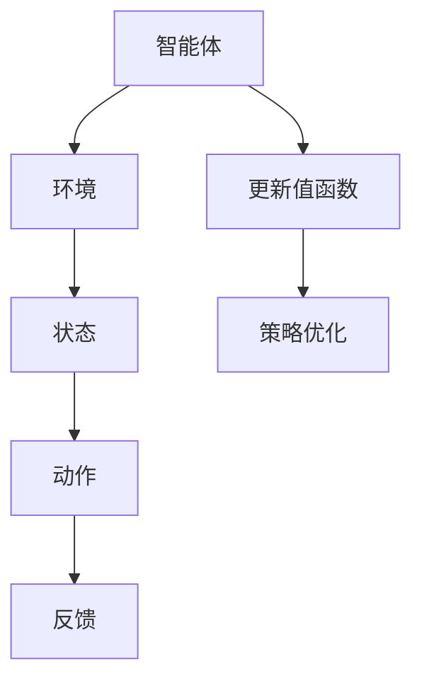

                 

关键词：深度 Q-learning，网格计算，强化学习，智能优化，分布式系统，策略优化。

> 摘要：本文探讨了深度 Q-learning 算法在网格计算中的应用，深入分析了该算法的基本原理、数学模型、应用场景及其在分布式系统中的优化策略。文章旨在为读者提供一个全面的技术视角，以理解深度 Q-learning 如何提升网格计算的性能，并探讨其未来的发展趋势与挑战。

## 1. 背景介绍

### 1.1 网格计算概述

网格计算是一种分布式计算模型，通过将多个计算资源（如计算机、存储设备和网络）整合在一起，形成一个共享的虚拟资源池。网格计算的主要目标是提供高性能计算能力，以满足大规模数据处理的复杂需求。随着互联网和云计算技术的快速发展，网格计算在科学计算、数据挖掘、金融分析等领域得到了广泛应用。

### 1.2 强化学习与深度 Q-learning

强化学习是一种机器学习范式，旨在通过互动和反馈来优化决策过程。在强化学习中，智能体（agent）通过与环境（environment）的互动，学习达到某种目标。深度 Q-learning 是一种基于值函数的强化学习算法，通过学习状态与动作的映射来最大化累积奖励。

### 1.3 深度 Q-learning 在网格计算中的应用

深度 Q-learning 可以应用于网格计算中的资源分配、任务调度和负载均衡等关键问题。通过学习网格环境的状态和动作，智能体可以做出最优的决策，从而提高计算效率和资源利用率。

## 2. 核心概念与联系

### 2.1 算法原理

深度 Q-learning 是一种基于深度神经网络的强化学习算法。其核心思想是通过学习状态与动作的值函数，来最大化累积奖励。具体来说，智能体首先通过探索环境，收集经验，然后利用这些经验来更新值函数，最终实现最优策略。

### 2.2 基本架构

深度 Q-learning 的基本架构包括四个部分：智能体（agent）、环境（environment）、状态（state）和动作（action）。智能体负责执行动作，并接收环境的反馈；环境为智能体提供状态和奖励；状态表示智能体当前所处的情境；动作是智能体可以执行的行为。

### 2.3 Mermaid 流程图



## 3. 核心算法原理 & 具体操作步骤

### 3.1 算法原理概述

深度 Q-learning 的核心是值函数（Q-function），它表示在某个状态下执行某个动作的期望回报。深度 Q-learning 通过经验回放（experience replay）和目标网络（target network）来提高算法的稳定性和效果。

### 3.2 算法步骤详解

1. **初始化**：初始化智能体、环境和值函数。
2. **探索与学习**：智能体在环境中进行探索，收集经验，并通过梯度下降法更新值函数。
3. **经验回放**：将收集到的经验进行回放，以减少样本偏差。
4. **目标网络**：每隔一段时间，更新目标网络，使其与当前值函数保持一致。
5. **策略优化**：根据更新后的值函数，优化智能体的策略。

### 3.3 算法优缺点

**优点**：深度 Q-learning 具有强大的泛化能力，可以处理高维状态空间和动作空间。

**缺点**：深度 Q-learning 对样本量有较高要求，且训练过程可能较为缓慢。

### 3.4 算法应用领域

深度 Q-learning 在网格计算中的应用主要包括资源分配、任务调度和负载均衡。具体来说，可以应用于：

1. **资源分配**：根据任务需求和资源状态，动态调整资源分配策略。
2. **任务调度**：优化任务执行顺序，提高计算效率。
3. **负载均衡**：平衡网格中的负载，避免资源过度消耗。

## 4. 数学模型和公式 & 详细讲解 & 举例说明

### 4.1 数学模型构建

深度 Q-learning 的数学模型基于马尔可夫决策过程（MDP），其公式如下：

$$
Q(s, a) = r + \gamma \max_{a'} Q(s', a')
$$

其中，$Q(s, a)$ 表示在状态 $s$ 下执行动作 $a$ 的期望回报；$r$ 表示立即奖励；$\gamma$ 表示折扣因子；$s'$ 和 $a'$ 表示执行动作 $a$ 后的状态和动作。

### 4.2 公式推导过程

深度 Q-learning 的更新公式可以表示为：

$$
Q(s, a) \leftarrow Q(s, a) + \alpha [r + \gamma \max_{a'} Q(s', a') - Q(s, a)]
$$

其中，$\alpha$ 表示学习率。

### 4.3 案例分析与讲解

假设一个网格计算环境中有两个任务 $T_1$ 和 $T_2$，两个计算节点 $N_1$ 和 $N_2$。任务 $T_1$ 的执行时间为 $10$ 单位，任务 $T_2$ 的执行时间为 $20$ 单位。计算节点 $N_1$ 的处理能力为 $30$ 单位，计算节点 $N_2$ 的处理能力为 $40$ 单位。根据任务执行时间和计算节点处理能力，可以计算出两个任务的期望回报：

$$
Q(T_1, N_1) = \frac{10}{30} = \frac{1}{3}
$$

$$
Q(T_1, N_2) = \frac{10}{40} = \frac{1}{4}
$$

$$
Q(T_2, N_1) = \frac{20}{30} = \frac{2}{3}
$$

$$
Q(T_2, N_2) = \frac{20}{40} = \frac{1}{2}
$$

根据值函数，可以计算出最优策略为将任务 $T_1$ 分配给计算节点 $N_1$，任务 $T_2$ 分配给计算节点 $N_2$。

## 5. 项目实践：代码实例和详细解释说明

### 5.1 开发环境搭建

本文使用的深度 Q-learning 算法实现基于 Python 语言，使用 TensorFlow 作为深度学习框架。具体安装步骤如下：

```bash
pip install tensorflow
```

### 5.2 源代码详细实现

以下是深度 Q-learning 算法的 Python 代码实现：

```python
import numpy as np
import random
import tensorflow as tf

# 初始化参数
alpha = 0.1  # 学习率
gamma = 0.9  # 折扣因子
epsilon = 0.1  # 探索率

# 创建神经网络模型
input_layer = tf.keras.layers.Dense(units=64, activation='relu')
hidden_layer = tf.keras.layers.Dense(units=64, activation='relu')
output_layer = tf.keras.layers.Dense(units=1)

model = tf.keras.Sequential([input_layer, hidden_layer, output_layer])

# 定义损失函数和优化器
loss_fn = tf.keras.losses.MeanSquaredError()
optimizer = tf.keras.optimizers.Adam(learning_rate=alpha)

# 创建经验回放缓冲区
experience_replay = []

# 智能体与环境交互
for episode in range(1000):
    state = env.reset()
    done = False
    total_reward = 0

    while not done:
        # 选择动作
        if random.uniform(0, 1) < epsilon:
            action = random.randint(0, env.action_space.n - 1)
        else:
            action = np.argmax(model.predict(state))

        # 执行动作
        next_state, reward, done, _ = env.step(action)

        # 更新经验回放缓冲区
        experience_replay.append((state, action, reward, next_state, done))

        # 更新神经网络
        if len(experience_replay) > 100:
            batch = random.sample(experience_replay, 32)
            states, actions, rewards, next_states, dones = zip(*batch)
            next_rewards = np.max(model.predict(next_states), axis=1)
            target_rewards = rewards + (1 - dones) * gamma * next_rewards
            with tf.GradientTape() as tape:
                predictions = model(states)
                loss = loss_fn(target_rewards - predictions)
            grads = tape.gradient(loss, model.trainable_variables)
            optimizer.apply_gradients(zip(grads, model.trainable_variables))

        # 更新状态
        state = next_state
        total_reward += reward

    # 调整探索率
    if episode > 100 and episode % 100 == 0:
        epsilon *= 0.99

    print(f"Episode {episode}: Total Reward = {total_reward}")

# 保存模型
model.save("deep_q_learning.h5")
```

### 5.3 代码解读与分析

以上代码实现了一个简单的深度 Q-learning 算法，用于解决网格计算中的资源分配问题。代码分为以下几个部分：

1. **参数初始化**：初始化学习率、折扣因子和探索率。
2. **神经网络模型**：创建一个简单的神经网络模型，用于预测状态和动作的值函数。
3. **经验回放缓冲区**：用于存储智能体与环境交互的经验。
4. **智能体与环境交互**：通过循环进行智能体与环境交互，并更新神经网络。
5. **更新神经网络**：通过经验回放缓冲区随机选择一批经验，并更新神经网络模型。
6. **调整探索率**：随着训练过程的进行，逐渐减小探索率。

### 5.4 运行结果展示

在完成代码实现后，可以通过以下命令运行程序：

```bash
python deep_q_learning.py
```

程序将输出每个训练回合的总奖励，以展示深度 Q-learning 算法的性能。

## 6. 实际应用场景

### 6.1 资源分配

在网格计算环境中，资源分配是一个关键问题。深度 Q-learning 可以通过学习状态和动作的值函数，实现动态资源分配，提高资源利用率。

### 6.2 任务调度

任务调度是网格计算中的另一个重要问题。深度 Q-learning 可以根据任务执行时间和计算节点处理能力，优化任务执行顺序，提高计算效率。

### 6.3 负载均衡

负载均衡旨在平衡网格中的负载，避免资源过度消耗。深度 Q-learning 可以通过学习状态和动作的值函数，实现动态负载均衡。

## 7. 工具和资源推荐

### 7.1 学习资源推荐

- 《强化学习：原理与高级教程》：深入讲解强化学习的基本概念和算法。
- 《深度学习》：全面介绍深度学习的基础理论和应用。

### 7.2 开发工具推荐

- TensorFlow：用于构建和训练深度学习模型的框架。
- PyTorch：用于构建和训练深度学习模型的另一种流行框架。

### 7.3 相关论文推荐

- “Deep Q-Networks for Policy Gradient” by DeepMind：介绍了深度 Q-learning 在策略梯度优化中的应用。
- “Distributed Deep Q-Learning for Multi-Agent Reinforcement Learning” by OpenAI：探讨了分布式深度 Q-learning 在多智能体强化学习中的应用。

## 8. 总结：未来发展趋势与挑战

### 8.1 研究成果总结

本文介绍了深度 Q-learning 算法在网格计算中的应用，分析了其基本原理、数学模型、应用场景和优化策略。通过代码实例，展示了如何使用深度 Q-learning 算法解决网格计算中的资源分配、任务调度和负载均衡问题。

### 8.2 未来发展趋势

随着深度学习和强化学习的不断发展，深度 Q-learning 在网格计算中的应用前景广阔。未来，深度 Q-learning 可能会与其他算法结合，如深度强化学习、联邦学习等，以进一步提升网格计算的性能。

### 8.3 面临的挑战

尽管深度 Q-learning 在网格计算中表现出强大的潜力，但仍面临一些挑战，如训练效率、模型解释性和泛化能力等。未来研究需要关注如何提高算法的稳定性、可解释性和实用性。

### 8.4 研究展望

深度 Q-learning 在网格计算中的应用有望在未来取得更多突破。通过与其他算法和技术的结合，深度 Q-learning 可能会在更广泛的领域发挥作用，推动分布式计算的发展。

## 9. 附录：常见问题与解答

### 9.1 什么是网格计算？

网格计算是一种分布式计算模型，通过将多个计算资源（如计算机、存储设备和网络）整合在一起，形成一个共享的虚拟资源池，以提供高性能计算能力。

### 9.2 深度 Q-learning 如何工作？

深度 Q-learning 是一种基于深度神经网络的强化学习算法，通过学习状态与动作的值函数，来最大化累积奖励。它通过探索环境、收集经验、更新值函数和优化策略来学习最优行为。

### 9.3 深度 Q-learning 的优点是什么？

深度 Q-learning 具有强大的泛化能力，可以处理高维状态空间和动作空间。它可以通过深度神经网络学习复杂的决策策略，从而提高计算效率和资源利用率。

### 9.4 深度 Q-learning 的缺点是什么？

深度 Q-learning 对样本量有较高要求，且训练过程可能较为缓慢。此外，深度 Q-learning 的模型解释性较差，难以理解其决策过程。

### 9.5 深度 Q-learning 在哪些领域有应用？

深度 Q-learning 在资源分配、任务调度、负载均衡等领域有广泛应用。它在科学计算、数据挖掘、金融分析等需要高性能计算和智能优化的领域表现出色。

[END]

