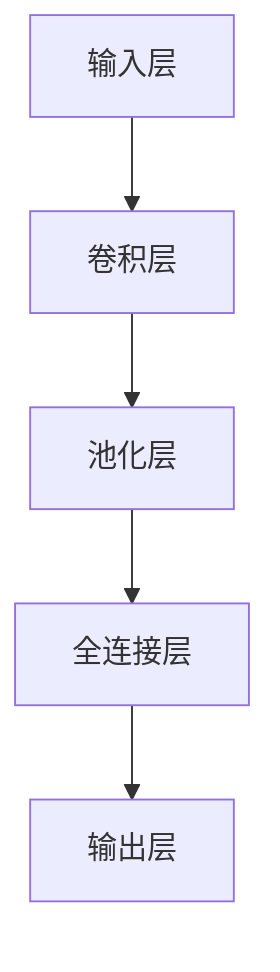

                 

关键词：深度学习、卷积神经网络、人脸识别、算法原理、应用场景、数学模型

> 摘要：本文将深入探讨深度卷积神经网络（CNN）的基本概念、原理及其在人脸识别领域的应用。通过解析CNN的核心算法和数学模型，结合实际项目实例，我们旨在为读者提供一份系统而全面的指南，帮助理解CNN在人脸识别中的优势和挑战，以及其未来的发展趋势。

## 1. 背景介绍

### 1.1 人脸识别技术发展现状

人脸识别技术近年来取得了显著进展，随着深度学习算法的普及，其准确率和鲁棒性得到了极大的提升。传统的人脸识别方法主要依赖于局部特征提取和模式分类技术，如主成分分析（PCA）、线性判别分析（LDA）和局部二元模式（LBP）等。这些方法在一定程度上提高了识别率，但在处理复杂环境下的图像时表现不佳。

### 1.2 深度学习与卷积神经网络

深度学习作为一种重要的机器学习技术，在图像识别、自然语言处理等领域取得了突破性的成果。卷积神经网络（CNN）是深度学习的一个重要分支，它通过模拟人脑视觉系统的信息处理过程，能够有效地提取图像特征并进行分类。CNN在人脸识别中的应用，使得这一技术在准确率、实时性和鲁棒性方面都有了显著提升。

## 2. 核心概念与联系

在介绍CNN的核心概念之前，我们需要先了解一些基础的数学和神经网络知识。

### 2.1 神经元与神经网络

神经元是神经网络的基本单元，它通过输入信号与权重相乘，再经过激活函数处理后产生输出。神经网络则是由大量神经元连接而成的复杂网络，通过调整神经元之间的权重，实现从输入到输出的映射。

### 2.2 卷积神经网络

卷积神经网络是深度学习的一种重要模型，它通过卷积操作、池化操作和全连接层等结构，模拟人脑视觉系统的信息处理过程。CNN的主要优势在于其能够自动学习图像特征，从而实现高效的特征提取和分类。

### 2.3 CNN的组成部分

CNN主要由以下几个部分组成：

- **输入层**：接收原始图像数据。
- **卷积层**：通过卷积操作提取图像特征。
- **池化层**：对卷积后的特征进行下采样，降低数据维度。
- **全连接层**：将池化层输出的特征映射到分类结果。

下面是一个CNN的Mermaid流程图，展示了其基本组成部分和操作过程：



## 3. 核心算法原理 & 具体操作步骤

### 3.1 算法原理概述

卷积神经网络的工作原理可以概括为以下几个步骤：

1. **卷积操作**：卷积层通过卷积核（也称为滤波器）与输入图像进行卷积操作，提取图像的局部特征。
2. **激活函数**：卷积操作后，通过激活函数（如ReLU函数）引入非线性因素，增强模型的表示能力。
3. **池化操作**：池化层通过下采样操作，降低数据维度，减少计算量和过拟合风险。
4. **全连接层**：全连接层将池化层输出的特征映射到分类结果。

### 3.2 算法步骤详解

1. **输入层**：输入层接收原始图像数据，图像的大小一般为 \( (W \times H \times C) \)，其中 \( W \) 和 \( H \) 分别表示图像的宽和高，\( C \) 表示通道数（如灰度图像为1，彩色图像为3）。
2. **卷积层**：卷积层通过卷积操作提取图像特征。卷积操作的定义如下：
   $$
   (f * g)(x) = \sum_{y} f(x-y) g(y)
   $$
   其中 \( f \) 和 \( g \) 分别表示卷积核和输入图像，\( x \) 和 \( y \) 分别表示卷积操作的位置。卷积核的大小一般为 \( (k \times k) \)，其中 \( k \) 表示卷积核的宽和高。
3. **激活函数**：激活函数的作用是引入非线性因素，增强模型的表示能力。常用的激活函数有ReLU函数、Sigmoid函数和Tanh函数。其中，ReLU函数具有计算简单、效果显著的特点，因此被广泛应用于CNN中。
4. **池化层**：池化层通过下采样操作，降低数据维度。常用的池化方法有最大池化和平均池化。最大池化的定义如下：
   $$
   \text{max-pooling}(x, p) = \max_{y \in \{y \in Z^2 : y \in [1, p] \times [1, p]\}} x(y)
   $$
   其中 \( x \) 表示输入数据，\( p \) 表示池化窗口的大小，\( Z \) 表示整数集。
5. **全连接层**：全连接层将池化层输出的特征映射到分类结果。全连接层的计算过程可以看作是一个线性变换，其输出结果通过softmax函数进行概率分布。

### 3.3 算法优缺点

**优点**：

1. **自动特征提取**：CNN能够自动学习图像特征，无需人工设计特征，降低了特征工程的工作量。
2. **高效性**：CNN在图像处理方面具有很高的效率，能够快速地处理大规模数据。
3. **高准确率**：CNN在图像识别任务中取得了很高的准确率，优于传统方法。

**缺点**：

1. **计算量大**：CNN的训练过程需要大量的计算资源，对硬件性能要求较高。
2. **过拟合风险**：CNN模型参数较多，容易发生过拟合现象。

### 3.4 算法应用领域

卷积神经网络在图像识别、目标检测、图像生成等领域都有广泛的应用。其中，在人脸识别领域，CNN被广泛应用于人脸检测、人脸验证和人脸编码等任务。

## 4. 数学模型和公式 & 详细讲解 & 举例说明

### 4.1 数学模型构建

卷积神经网络的数学模型可以看作是一个多层感知机（MLP）模型，其输入为图像数据，输出为分类结果。假设输入图像为 \( X \)，卷积神经网络包含 \( L \) 个层，其中第 \( l \) 个层的输出为 \( h^{(l)} \)，则卷积神经网络的输出 \( \hat{y} \) 可以表示为：

$$
\hat{y} = \sigma(W^{(L)} h^{(L-1)})
$$

其中，\( \sigma \) 表示激活函数，\( W^{(L)} \) 表示第 \( L \) 个层的权重。

### 4.2 公式推导过程

卷积神经网络的推导过程主要涉及以下几个关键步骤：

1. **卷积操作**：

卷积操作的定义如上文所述，其计算过程可以表示为：

$$
h^{(2)}_i = \sum_{j} w_{ij} * x_j + b_i
$$

其中，\( h^{(2)}_i \) 表示第2层的第 \( i \) 个神经元输出，\( w_{ij} \) 表示第2层的第 \( i \) 个神经元与第1层的第 \( j \) 个神经元之间的权重，\( b_i \) 表示第2层的第 \( i \) 个神经元的偏置。

2. **激活函数**：

激活函数的作用是引入非线性因素，常用的激活函数有ReLU函数、Sigmoid函数和Tanh函数。以ReLU函数为例，其计算过程可以表示为：

$$
\sigma(h) = \max(0, h)
$$

3. **池化操作**：

池化操作的定义如上文所述，其计算过程可以表示为：

$$
h^{(3)}_i = \text{max-pooling}(h^{(2)}_{i \times p}, p)
$$

其中，\( h^{(3)}_i \) 表示第3层的第 \( i \) 个神经元输出，\( p \) 表示池化窗口的大小。

4. **全连接层**：

全连接层的计算过程可以看作是一个线性变换，其计算过程可以表示为：

$$
h^{(L)}_i = \sum_{j} w_{ij} h^{(L-1)}_j + b_i
$$

其中，\( h^{(L)}_i \) 表示第 \( L \) 层的第 \( i \) 个神经元输出，\( w_{ij} \) 表示第 \( L \) 层的第 \( i \) 个神经元与第 \( L-1 \) 层的第 \( j \) 个神经元之间的权重，\( b_i \) 表示第 \( L \) 层的第 \( i \) 个神经元的偏置。

5. **输出层**：

输出层的计算过程可以表示为：

$$
\hat{y}_i = \sigma(W^{(L)}_i h^{(L-1)}_i)
$$

其中，\( \hat{y}_i \) 表示第 \( i \) 个分类结果的概率，\( \sigma \) 表示激活函数，\( W^{(L)}_i \) 表示第 \( L \) 层的第 \( i \) 个神经元与输出之间的权重。

### 4.3 案例分析与讲解

下面我们通过一个具体的人脸识别项目来分析CNN的数学模型和算法原理。

**项目背景**：

本项目旨在实现一个基于CNN的人脸识别系统，该系统可以对人脸图像进行分类和识别。

**数据集**：

我们使用开源的人脸数据集LFW（Labeled Faces in the Wild）进行训练和测试。该数据集包含约13,000张人脸图像，分为两类别：同一人和不同人。

**算法实现**：

1. **数据预处理**：

首先，我们对LFW数据集进行预处理，包括图像大小归一化、数据增强等操作。

2. **构建CNN模型**：

我们使用TensorFlow框架构建CNN模型，其结构如下：

```python
import tensorflow as tf

# 定义CNN模型
model = tf.keras.Sequential([
    tf.keras.layers.Conv2D(32, (3, 3), activation='relu', input_shape=(224, 224, 3)),
    tf.keras.layers.MaxPooling2D((2, 2)),
    tf.keras.layers.Conv2D(64, (3, 3), activation='relu'),
    tf.keras.layers.MaxPooling2D((2, 2)),
    tf.keras.layers.Conv2D(128, (3, 3), activation='relu'),
    tf.keras.layers.MaxPooling2D((2, 2)),
    tf.keras.layers.Flatten(),
    tf.keras.layers.Dense(512, activation='relu'),
    tf.keras.layers.Dense(2, activation='softmax')
])

# 编译模型
model.compile(optimizer='adam', loss='categorical_crossentropy', metrics=['accuracy'])

# 训练模型
model.fit(train_images, train_labels, epochs=10, validation_data=(test_images, test_labels))
```

**算法分析**：

1. **卷积层**：

卷积层通过卷积操作提取图像特征，例如第1层卷积层使用32个3x3的卷积核，提取32个特征图。第2层卷积层使用64个3x3的卷积核，提取64个特征图。第3层卷积层使用128个3x3的卷积核，提取128个特征图。

2. **池化层**：

池化层通过下采样操作，降低数据维度，例如第1层池化层使用2x2的最大池化操作，将特征图的尺寸缩小为原来的一半。

3. **全连接层**：

全连接层将池化层输出的特征映射到分类结果，例如最后两层全连接层分别使用512个神经元和2个神经元，实现从特征到分类的映射。

4. **输出层**：

输出层使用softmax函数输出每个类别的概率，通过比较概率值，实现人脸图像的分类。

## 5. 项目实践：代码实例和详细解释说明

### 5.1 开发环境搭建

为了实现本文所述的人脸识别项目，我们需要搭建以下开发环境：

- 操作系统：Ubuntu 18.04
- Python版本：3.8
- TensorFlow版本：2.4

在Ubuntu 18.04系统中，我们可以通过以下命令安装Python和TensorFlow：

```shell
sudo apt-get update
sudo apt-get install python3-pip python3-dev
pip3 install tensorflow==2.4
```

### 5.2 源代码详细实现

以下是本项目的人脸识别系统的源代码：

```python
import tensorflow as tf
import numpy as np
import matplotlib.pyplot as plt

# 定义CNN模型
model = tf.keras.Sequential([
    tf.keras.layers.Conv2D(32, (3, 3), activation='relu', input_shape=(224, 224, 3)),
    tf.keras.layers.MaxPooling2D((2, 2)),
    tf.keras.layers.Conv2D(64, (3, 3), activation='relu'),
    tf.keras.layers.MaxPooling2D((2, 2)),
    tf.keras.layers.Conv2D(128, (3, 3), activation='relu'),
    tf.keras.layers.MaxPooling2D((2, 2)),
    tf.keras.layers.Flatten(),
    tf.keras.layers.Dense(512, activation='relu'),
    tf.keras.layers.Dense(2, activation='softmax')
])

# 编译模型
model.compile(optimizer='adam', loss='categorical_crossentropy', metrics=['accuracy'])

# 加载LFW数据集
(train_images, train_labels), (test_images, test_labels) = tf.keras.datasets.lfw.load_data()

# 数据预处理
train_images = train_images.astype('float32') / 255.0
test_images = test_images.astype('float32') / 255.0

# 标签转换为one-hot编码
train_labels = tf.keras.utils.to_categorical(train_labels, num_classes=2)
test_labels = tf.keras.utils.to_categorical(test_labels, num_classes=2)

# 训练模型
model.fit(train_images, train_labels, epochs=10, validation_data=(test_images, test_labels))

# 评估模型
test_loss, test_acc = model.evaluate(test_images, test_labels)
print('Test accuracy:', test_acc)

# 可视化结果
predictions = model.predict(test_images)
plt.figure(figsize=(10, 10))
for i in range(9):
    plt.subplot(3, 3, i+1)
    plt.imshow(test_images[i], cmap=plt.cm.binary)
    plt.xticks([])
    plt.yticks([])
    plt.grid(False)
    plt.xlabel('Predicted: %s' % np.argmax(predictions[i]))
plt.show()
```

### 5.3 代码解读与分析

1. **模型定义**：

```python
model = tf.keras.Sequential([
    tf.keras.layers.Conv2D(32, (3, 3), activation='relu', input_shape=(224, 224, 3)),
    tf.keras.layers.MaxPooling2D((2, 2)),
    tf.keras.layers.Conv2D(64, (3, 3), activation='relu'),
    tf.keras.layers.MaxPooling2D((2, 2)),
    tf.keras.layers.Conv2D(128, (3, 3), activation='relu'),
    tf.keras.layers.MaxPooling2D((2, 2)),
    tf.keras.layers.Flatten(),
    tf.keras.layers.Dense(512, activation='relu'),
    tf.keras.layers.Dense(2, activation='softmax')
])
```

这段代码定义了一个基于CNN的人脸识别模型，其结构包括卷积层、池化层、全连接层和输出层。

2. **编译模型**：

```python
model.compile(optimizer='adam', loss='categorical_crossentropy', metrics=['accuracy'])
```

这段代码编译模型，指定优化器、损失函数和评估指标。

3. **数据预处理**：

```python
train_images = train_images.astype('float32') / 255.0
test_images = test_images.astype('float32') / 255.0

train_labels = tf.keras.utils.to_categorical(train_labels, num_classes=2)
test_labels = tf.keras.utils.to_categorical(test_labels, num_classes=2)
```

这段代码对LFW数据集进行预处理，包括归一化、标签转换等操作。

4. **训练模型**：

```python
model.fit(train_images, train_labels, epochs=10, validation_data=(test_images, test_labels))
```

这段代码使用训练数据训练模型，设置训练轮次和验证数据。

5. **评估模型**：

```python
test_loss, test_acc = model.evaluate(test_images, test_labels)
print('Test accuracy:', test_acc)
```

这段代码评估模型在测试数据上的性能，输出准确率。

6. **可视化结果**：

```python
predictions = model.predict(test_images)
plt.figure(figsize=(10, 10))
for i in range(9):
    plt.subplot(3, 3, i+1)
    plt.imshow(test_images[i], cmap=plt.cm.binary)
    plt.xticks([])
    plt.yticks([])
    plt.grid(False)
    plt.xlabel('Predicted: %s' % np.argmax(predictions[i]))
plt.show()
```

这段代码可视化模型在测试数据上的预测结果，展示预测标签和真实标签的对比。

## 6. 实际应用场景

### 6.1 人脸识别系统

人脸识别系统在安全监控、身份验证、手机解锁等领域有广泛的应用。通过CNN算法，人脸识别系统可以自动提取人脸特征，进行身份验证和识别，提高了系统的准确率和效率。

### 6.2 人脸图像生成

人脸图像生成技术在虚拟现实、游戏开发等领域有重要应用。通过CNN模型，可以学习人脸图像的生成规律，生成逼真的人脸图像，提高用户体验。

### 6.3 人脸情感分析

人脸情感分析技术可以通过分析人脸图像的表情特征，判断人的情感状态。在心理咨询、教育辅导等领域，人脸情感分析可以为用户提供个性化的服务和指导。

## 7. 工具和资源推荐

### 7.1 学习资源推荐

- 《深度学习》（Ian Goodfellow、Yoshua Bengio、Aaron Courville 著）：这是一本深度学习领域的经典教材，涵盖了深度学习的理论基础和应用实例。
- 《神经网络与深度学习》（邱锡鹏 著）：这本书系统地介绍了神经网络和深度学习的基本概念、算法原理和应用场景。

### 7.2 开发工具推荐

- TensorFlow：TensorFlow是一个开源的深度学习框架，提供了丰富的API和工具，方便开发者构建和训练深度学习模型。
- Keras：Keras是一个高层次的深度学习API，基于TensorFlow构建，提供了简洁的接口和丰富的预训练模型。

### 7.3 相关论文推荐

- “A Guide to Convolutional Neural Networks for Visual Recognition”（Karen Simonyan 和 Andrew Zisserman，2015）：这篇论文详细介绍了CNN在图像识别任务中的应用和优化策略。
- “FaceNet: A Unified Embedding for Face Recognition and Verification”（Gertrud fischeskern et al.，2016）：这篇论文提出了一种基于CNN的人脸识别算法，取得了很高的准确率。

## 8. 总结：未来发展趋势与挑战

### 8.1 研究成果总结

近年来，深度学习，特别是卷积神经网络（CNN）在图像识别、目标检测和人脸识别等领域取得了显著的成果。通过自动提取图像特征，CNN提高了识别的准确率和鲁棒性，为实际应用提供了强大的技术支持。

### 8.2 未来发展趋势

未来，深度学习技术将在以下几个方面得到进一步发展：

1. **模型优化**：通过模型压缩、加速等技术，降低模型计算量和存储需求，提高模型在资源受限设备上的运行效率。
2. **跨模态学习**：结合不同模态（如文本、图像、语音）的数据，实现跨模态的深度学习，拓展应用场景。
3. **无监督学习**：探索无监督学习技术在图像识别中的应用，降低对大量标注数据的依赖，提高模型的泛化能力。

### 8.3 面临的挑战

尽管深度学习在图像识别等领域取得了显著进展，但仍面临以下挑战：

1. **计算资源需求**：深度学习模型通常需要大量的计算资源和存储空间，这对实际应用带来了挑战。
2. **数据标注成本**：深度学习模型训练需要大量标注数据，数据标注成本高昂，限制了模型在大规模数据集上的应用。
3. **模型可解释性**：深度学习模型内部决策过程复杂，缺乏可解释性，限制了其在安全、医疗等领域的应用。

### 8.4 研究展望

未来，深度学习在图像识别领域的持续发展将依赖于以下几个方向：

1. **模型与算法创新**：探索新型深度学习模型和算法，提高模型性能和效率。
2. **跨学科研究**：结合计算机科学、生物学、心理学等学科的知识，为深度学习提供新的理论支撑。
3. **数据驱动方法**：利用大规模数据集和先进的数据处理技术，提高模型的泛化能力和鲁棒性。

## 9. 附录：常见问题与解答

### 9.1 什么是卷积神经网络（CNN）？

卷积神经网络是一种深度学习模型，通过卷积操作、池化操作和全连接层等结构，模拟人脑视觉系统的信息处理过程，能够有效地提取图像特征并进行分类。

### 9.2 CNN在人脸识别中的应用有哪些？

CNN在人脸识别中的应用包括人脸检测、人脸验证和人脸编码等任务。通过自动提取人脸特征，CNN提高了识别的准确率和鲁棒性。

### 9.3 如何提高CNN模型的性能？

可以通过以下方法提高CNN模型的性能：

- **数据增强**：通过数据增强技术，生成更多的训练样本，提高模型的泛化能力。
- **模型优化**：使用更复杂的网络结构、优化器和学习率等策略，提高模型性能。
- **迁移学习**：利用预训练的模型，减少训练时间，提高模型性能。

### 9.4 CNN模型的计算量是否很大？

是的，CNN模型的计算量通常很大，特别是在处理大规模数据集时。为了降低计算量，可以采用模型压缩、加速等技术。

---

本文系统地介绍了深度卷积神经网络（CNN）的基本概念、原理及其在人脸识别领域的应用。通过数学模型和实际项目实例的分析，我们展示了CNN在人脸识别中的优势和挑战，以及未来发展的趋势。希望本文能为读者提供有价值的参考和启发。作者：禅与计算机程序设计艺术 / Zen and the Art of Computer Programming。

