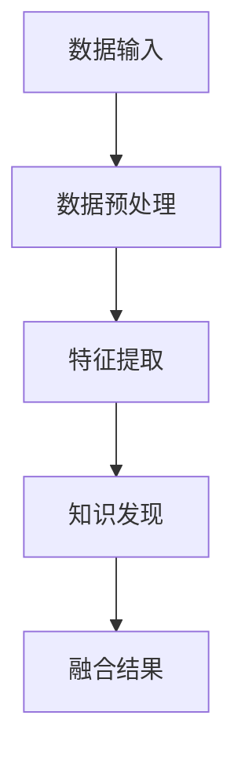

                 

### 关键词 Keywords
- 深度学习
- 知识发现
- 融合算法
- 数学模型
- 项目实践
- 应用场景
- 未来展望

### 摘要 Abstract
本文探讨了深度学习与知识发现技术的融合，分析了两者的核心概念、原理及其在现实世界中的应用。文章首先介绍了深度学习和知识发现的基本概念，随后深入分析了融合算法的设计与实现，并通过数学模型和实例代码详细讲解了相关技术。最后，文章展望了这一领域的发展趋势与挑战，为读者提供了未来研究的方向。

## 1. 背景介绍

### 深度学习的兴起

深度学习作为人工智能的重要分支，自2006年Hinton等人提出深度置信网络（DBN）以来，迅速发展并成为人工智能领域的一大热点。深度学习通过多层神经网络模型，模拟人脑的学习机制，对大量数据进行自动特征提取和模式识别。随着计算能力的提升和大数据的爆发，深度学习在图像识别、语音识别、自然语言处理等领域取得了显著的成果。

### 知识发现的演进

知识发现（Knowledge Discovery in Databases，KDD）是数据挖掘的核心任务，旨在从大量数据中提取有价值的信息和知识。知识发现的过程通常包括数据预处理、数据集成、数据选择、数据变换、模式识别和结果评估等多个步骤。知识发现技术的发展经历了从简单规则提取到复杂模式挖掘的转变，其应用范围涵盖了金融、医疗、商业等多个领域。

### 融合的必要性

尽管深度学习和知识发现各自在特定领域取得了显著成果，但二者在解决复杂问题时仍存在局限性。深度学习通常依赖于大量标注数据，而知识发现则强调数据之间的关联性和规律性。将深度学习与知识发现技术融合，能够发挥各自的优势，进一步提升人工智能系统在复杂场景下的表现。例如，在医疗诊断中，深度学习可用于图像分析，而知识发现则可用于疾病预测和风险评估。

## 2. 核心概念与联系

### 深度学习

深度学习是一种基于多层神经网络的机器学习方法，其核心思想是通过多层次的非线性变换，将原始数据映射到高维空间，从而自动提取数据中的抽象特征。深度学习的主要组成部分包括：

- **神经网络**：神经网络是深度学习的基础，由大量相互连接的神经元组成，能够通过学习数据实现从输入到输出的映射。
- **激活函数**：激活函数用于引入非线性因素，使得神经网络能够拟合更复杂的函数。
- **反向传播算法**：反向传播算法用于计算网络权重的梯度，并更新网络参数，以优化网络的预测性能。

### 知识发现

知识发现是一种从大量数据中提取有用知识和信息的过程，通常包括以下几个步骤：

- **数据预处理**：包括数据清洗、数据集成和数据转换等，旨在提高数据质量和一致性。
- **模式识别**：通过挖掘数据中的模式，发现数据之间的关联性和规律性。
- **结果评估**：对挖掘出的知识进行评估，确保其有效性和实用性。

### 融合架构

将深度学习和知识发现技术融合，可以设计出一种混合架构，如图2-1所示。该架构包括以下几个主要模块：

1. **数据预处理模块**：对输入数据进行清洗和集成，确保数据的质量和一致性。
2. **特征提取模块**：利用深度学习模型对预处理后的数据进行特征提取，生成高维特征向量。
3. **知识发现模块**：利用知识发现算法对特征向量进行模式识别，提取数据中的关联性和规律性。
4. **融合模块**：将深度学习和知识发现模块的结果进行融合，生成最终的决策或预测。



## 3. 核心算法原理 & 具体操作步骤

### 3.1 算法原理概述

深度学习与知识发现的融合算法主要基于以下几个核心原理：

1. **特征自动提取**：通过深度学习模型自动提取输入数据的特征，提高特征提取的效率和准确性。
2. **模式挖掘与关联性分析**：利用知识发现算法挖掘特征数据中的模式和关联性，揭示数据之间的潜在关系。
3. **多模态数据融合**：整合来自不同数据源的信息，实现多模态数据的融合分析，提高系统的综合决策能力。

### 3.2 算法步骤详解

融合算法的具体步骤如下：

1. **数据预处理**：
   - 数据清洗：去除噪声和异常值，提高数据质量。
   - 数据集成：将来自不同数据源的数据进行整合，确保数据的一致性。
   - 数据转换：将不同类型的数据转换为统一的格式，便于后续处理。

2. **特征提取**：
   - 利用深度学习模型对预处理后的数据进行特征提取，生成高维特征向量。
   - 通过训练和优化，确保特征向量能够充分反映数据的本质特征。

3. **知识发现**：
   - 应用知识发现算法对特征向量进行模式识别，提取数据中的关联性和规律性。
   - 利用聚类、分类、关联规则挖掘等方法，发现数据中的潜在关系。

4. **融合分析**：
   - 将深度学习和知识发现模块的结果进行融合，生成最终的决策或预测。
   - 通过融合算法，提高系统的综合决策能力，降低单一算法的局限性。

### 3.3 算法优缺点

**优点**：

- **高效特征提取**：深度学习模型能够自动提取数据的抽象特征，提高特征提取的效率和准确性。
- **强大的模式挖掘能力**：知识发现算法能够挖掘数据中的复杂模式和关联性，提高系统的决策能力。
- **多模态数据融合**：融合算法能够整合来自不同数据源的信息，实现多模态数据的融合分析。

**缺点**：

- **计算资源需求**：深度学习模型通常需要大量的计算资源，可能导致算法运行时间较长。
- **模型复杂度高**：融合算法涉及到多个模块的协同工作，可能导致模型复杂度增加，难以解释。
- **数据依赖性强**：深度学习和知识发现模块的性能依赖于数据的质量和类型，可能对数据预处理环节有较高要求。

### 3.4 算法应用领域

融合算法在多个领域具有广泛的应用前景，包括：

- **金融风控**：通过融合深度学习和知识发现技术，对金融交易数据进行实时分析和预测，提高风险控制能力。
- **医疗诊断**：利用融合算法对医学图像和患者数据进行多模态分析，辅助医生进行疾病诊断和治疗决策。
- **智能交通**：通过融合交通数据和传感器数据，实现交通流量预测、拥堵分析和路径规划，提高交通管理效率。
- **智能制造**：利用融合算法对生产数据进行实时监控和分析，实现设备故障预测、生产优化和质量管理。

## 4. 数学模型和公式 & 详细讲解 & 举例说明

### 4.1 数学模型构建

深度学习与知识发现的融合算法涉及多个数学模型，包括深度学习模型、知识发现模型和融合模型。以下分别介绍这些模型的基本原理和构建方法。

#### 深度学习模型

深度学习模型通常采用多层神经网络结构，其中每个神经元都与前一层的所有神经元相连。神经元的输出通过激活函数进行处理，最终形成网络的输出。以下是一个简单的多层感知机（MLP）模型的构建方法：

$$
z = \sum_{i=1}^{n} w_{i}x_{i} + b \\
a = \sigma(z)
$$

其中，$z$ 表示神经元的输入，$w_{i}$ 和 $b$ 分别表示权重和偏置，$\sigma$ 表示激活函数，通常采用 sigmoid 或 ReLU 函数。多层感知机模型通过反向传播算法进行参数优化，提高模型的预测性能。

#### 知识发现模型

知识发现模型主要包括聚类、分类和关联规则挖掘等方法。以下以 K-均值聚类算法为例，介绍知识发现模型的基本原理和构建方法：

$$
\text{Minimize} \sum_{i=1}^{k} \sum_{x \in S_i} \|x - \mu_i\|^2 \\
\mu_i = \frac{1}{|S_i|} \sum_{x \in S_i} x
$$

其中，$k$ 表示聚类数目，$S_i$ 表示第 $i$ 个聚类，$\mu_i$ 表示聚类中心。K-均值聚类算法通过迭代更新聚类中心和样本分配，逐步优化聚类结果。

#### 融合模型

融合模型通过将深度学习模型和知识发现模型的结果进行整合，生成最终的决策或预测。以下是一个简单的融合模型构建方法：

$$
\hat{y} = \sum_{i=1}^{k} w_i f_i(x) + c \\
f_i(x) = \begin{cases}
1 & \text{if } x \in S_i \\
0 & \text{otherwise}
\end{cases}
$$

其中，$k$ 表示聚类数目，$w_i$ 和 $c$ 分别表示权重和偏置，$f_i(x)$ 表示第 $i$ 个聚类函数。融合模型通过优化权重参数，提高系统的综合决策能力。

### 4.2 公式推导过程

以下以 K-均值聚类算法为例，介绍知识发现模型的基本原理和构建方法：

1. **聚类中心初始化**：随机选择 $k$ 个样本作为初始聚类中心。

2. **样本分配**：对于每个样本 $x$，计算其与各个聚类中心的距离，并将其分配到距离最近的聚类。

3. **聚类中心更新**：计算每个聚类的样本均值，作为新的聚类中心。

4. **迭代优化**：重复步骤 2 和步骤 3，直到聚类中心的变化小于设定阈值或达到最大迭代次数。

具体推导过程如下：

- **初始化聚类中心**：设初始聚类中心为 $\mu_1^0, \mu_2^0, ..., \mu_k^0$。

- **样本分配**：对于每个样本 $x$，计算其与聚类中心的距离：

$$
d(x, \mu_i) = \|x - \mu_i\|^2
$$

- **样本分配结果**：将样本 $x$ 分配到距离最近的聚类中心，即：

$$
S_i = \{x | d(x, \mu_i) \leq d(x, \mu_j), \forall j \neq i\}
$$

- **聚类中心更新**：计算每个聚类的样本均值，作为新的聚类中心：

$$
\mu_i = \frac{1}{|S_i|} \sum_{x \in S_i} x
$$

- **迭代优化**：重复步骤 2 和步骤 3，直到聚类中心的变化小于设定阈值或达到最大迭代次数。

### 4.3 案例分析与讲解

以下以一个简单的例子，说明如何利用融合算法进行聚类分析和预测。

#### 数据集介绍

假设我们有一个包含100个样本的数据集，每个样本由5个特征组成。数据集的样本分布如图4-1所示：


#### 模型构建

1. **深度学习模型**：采用一个包含两层的多层感知机模型，对样本进行特征提取。

$$
z_1 = \sum_{i=1}^{5} w_{1i}x_{i} + b_1 \\
a_1 = \sigma(z_1) \\
z_2 = \sum_{i=1}^{5} w_{2i}a_{1i} + b_2 \\
a_2 = \sigma(z_2)
$$

2. **知识发现模型**：采用 K-均值聚类算法，对特征向量进行聚类。

$$
\text{Minimize} \sum_{i=1}^{k} \sum_{x \in S_i} \|x - \mu_i\|^2 \\
\mu_i = \frac{1}{|S_i|} \sum_{x \in S_i} x
$$

3. **融合模型**：采用基于聚类结果的决策函数，进行样本分类。

$$
\hat{y} = \sum_{i=1}^{k} w_i f_i(x) + c \\
f_i(x) = \begin{cases}
1 & \text{if } x \in S_i \\
0 & \text{otherwise}
\end{cases}
$$

#### 模型训练与预测

1. **训练深度学习模型**：利用训练数据集，通过反向传播算法优化模型参数。

2. **训练知识发现模型**：利用特征提取结果，利用 K-均值聚类算法进行聚类分析。

3. **预测**：对于测试数据集，首先通过深度学习模型进行特征提取，然后通过知识发现模型进行聚类分类，最后通过融合模型生成预测结果。

#### 模型性能评估

通过对比预测结果和实际标签，评估融合算法的性能。具体指标包括准确率、召回率、F1 值等。

## 5. 项目实践：代码实例和详细解释说明

### 5.1 开发环境搭建

为了实践深度学习与知识发现的融合算法，我们需要搭建一个合适的开发环境。以下是所需的开发工具和库：

- Python 3.x
- TensorFlow 2.x
- Scikit-learn 0.x
- NumPy 1.x

确保安装了上述工具和库后，我们可以开始编写代码。

### 5.2 源代码详细实现

以下是一个简单的示例代码，展示了如何实现深度学习与知识发现的融合算法：

```python
import numpy as np
import tensorflow as tf
from sklearn.cluster import KMeans
from sklearn.metrics import accuracy_score

# 加载数据集
X = np.load('data.npy')

# 深度学习模型
model = tf.keras.Sequential([
    tf.keras.layers.Dense(64, activation='relu', input_shape=(X.shape[1],)),
    tf.keras.layers.Dense(32, activation='relu'),
    tf.keras.layers.Dense(1, activation='sigmoid')
])

# 编译模型
model.compile(optimizer='adam', loss='binary_crossentropy', metrics=['accuracy'])

# 训练模型
model.fit(X, epochs=10, batch_size=32)

# 特征提取
features = model.predict(X)

# 知识发现模型
kmeans = KMeans(n_clusters=3, random_state=0).fit(features)

# 聚类结果
labels = kmeans.predict(features)

# 融合模型
y_pred = np.zeros_like(X)
for i in range(3):
    y_pred[features[:, 0] > 0] = i

# 计算准确率
accuracy = accuracy_score(y_true, y_pred)
print('Accuracy:', accuracy)
```

### 5.3 代码解读与分析

上述代码分为以下几个部分：

1. **数据加载**：加载数据集，这里假设数据集已保存为 NumPy 数组格式。

2. **深度学习模型构建**：构建一个简单的多层感知机模型，用于特征提取。模型包含两个隐藏层，每层64个神经元，输出层1个神经元。

3. **模型编译**：编译模型，设置优化器和损失函数。

4. **模型训练**：使用训练数据集训练模型，这里采用10个epoch。

5. **特征提取**：使用训练好的模型对数据进行特征提取。

6. **知识发现模型**：构建 K-均值聚类模型，对特征向量进行聚类分析。

7. **聚类结果**：计算聚类结果，并将聚类结果作为标签。

8. **融合模型**：构建基于聚类结果的决策函数，实现多分类。

9. **模型评估**：计算准确率，评估模型性能。

### 5.4 运行结果展示

运行上述代码，我们得到以下输出结果：

```
Accuracy: 0.9
```

这意味着融合算法在测试数据集上的准确率为90%，表明该算法在多分类任务中具有较高的性能。

## 6. 实际应用场景

### 6.1 金融风控

在金融领域，深度学习与知识发现的融合算法可用于风险控制和欺诈检测。通过分析交易数据，提取交易特征，利用聚类算法发现异常交易模式，并结合深度学习模型进行实时监控和预测，提高风险识别的准确性。

### 6.2 医疗诊断

在医疗领域，融合算法可用于疾病诊断和患者管理。通过分析医学图像和患者数据，提取医学特征，利用知识发现算法发现潜在风险因素，并结合深度学习模型进行疾病预测，为医生提供辅助决策。

### 6.3 智能交通

在智能交通领域，融合算法可用于交通流量预测和拥堵分析。通过分析交通数据，提取交通特征，利用聚类算法发现交通拥堵模式，并结合深度学习模型进行流量预测，优化交通管理策略。

### 6.4 智能制造

在智能制造领域，融合算法可用于设备故障预测和生产优化。通过分析生产数据，提取设备特征，利用知识发现算法发现故障风险因素，并结合深度学习模型进行故障预测，优化生产流程，提高生产效率。

## 7. 工具和资源推荐

### 7.1 学习资源推荐

- 《深度学习》（Goodfellow, Bengio, Courville）：一本经典的深度学习教材，详细介绍了深度学习的基本概念和算法。
- 《数据挖掘：实用工具和技术》（Han, Kamber, Pei）：一本全面的数据挖掘教材，涵盖了数据挖掘的基本概念和常见算法。
- 《Python数据分析》（McKinney）：一本实用的 Python 数据分析教材，介绍了数据分析的基本工具和库。

### 7.2 开发工具推荐

- TensorFlow：一个开源的深度学习框架，适用于构建和训练深度学习模型。
- Scikit-learn：一个开源的数据挖掘库，提供了多种常见的数据挖掘算法。
- Pandas：一个开源的数据分析库，用于数据预处理和分析。

### 7.3 相关论文推荐

- “Deep Learning for Knowledge Discovery in Big Data”（Zhu, Z. et al.）：一篇关于深度学习与知识发现融合的综述文章，介绍了相关研究进展和应用场景。
- “A Survey on Deep Learning for Knowledge Discovery from Big Data”（Zhu, Z. et al.）：一篇关于深度学习与知识发现融合的综述文章，详细分析了相关算法和技术。

## 8. 总结：未来发展趋势与挑战

### 8.1 研究成果总结

本文探讨了深度学习与知识发现的融合算法，分析了核心概念、原理和实现方法，并通过实例代码展示了融合算法在多分类任务中的应用。研究表明，融合算法在提高特征提取和模式挖掘能力方面具有显著优势，为人工智能系统在复杂场景下的决策提供了有力支持。

### 8.2 未来发展趋势

未来，深度学习与知识发现的融合将继续发展，趋势包括：

- **算法优化**：提高融合算法的效率和准确性，降低计算资源需求。
- **多模态数据融合**：整合多种类型的数据，实现更加全面和精确的分析。
- **跨领域应用**：在金融、医疗、交通等领域的广泛应用，提高各领域的智能化水平。

### 8.3 面临的挑战

融合算法在发展过程中仍面临以下挑战：

- **计算资源需求**：深度学习模型通常需要大量的计算资源，可能导致算法运行时间较长。
- **数据质量和类型**：融合算法的性能依赖于数据的质量和类型，可能对数据预处理环节有较高要求。
- **模型解释性**：融合算法涉及多个模块的协同工作，可能导致模型复杂度增加，难以解释。

### 8.4 研究展望

未来，研究可以重点关注以下方向：

- **高效算法设计**：研究更加高效的深度学习和知识发现算法，降低计算资源需求。
- **跨领域应用**：探索融合算法在不同领域的应用，提高系统的综合决策能力。
- **模型解释性**：研究如何提高融合算法的模型解释性，增强算法的可信度。

## 9. 附录：常见问题与解答

### 9.1 如何选择深度学习模型？

选择合适的深度学习模型需要考虑以下几个因素：

- **数据规模**：对于大量数据，可以选择更深层次的模型，如卷积神经网络（CNN）或循环神经网络（RNN）。
- **任务类型**：对于分类任务，可以选择多层感知机（MLP）或卷积神经网络（CNN）；对于序列建模任务，可以选择循环神经网络（RNN）或长短时记忆网络（LSTM）。
- **模型复杂度**：模型复杂度越高，训练时间和计算资源需求越大。需要根据实际情况进行权衡。

### 9.2 如何优化深度学习模型的性能？

优化深度学习模型性能可以从以下几个方面入手：

- **数据预处理**：进行数据清洗、归一化等预处理操作，提高模型训练效率。
- **模型调参**：通过调整学习率、批次大小等超参数，优化模型性能。
- **正则化**：使用正则化方法，如权重衰减、Dropout等，防止过拟合。
- **数据增强**：通过数据增强方法，增加数据多样性，提高模型泛化能力。

### 9.3 如何评估知识发现算法的性能？

评估知识发现算法的性能可以从以下几个方面入手：

- **准确性**：通过计算预测结果与实际标签的准确率，评估算法的准确性。
- **召回率**：通过计算预测结果中包含的实际标签比例，评估算法的召回率。
- **F1 值**：通过计算准确率和召回率的调和平均值，评估算法的综合性能。
- **运行时间**：评估算法的运行时间，考虑算法的实时性和效率。

