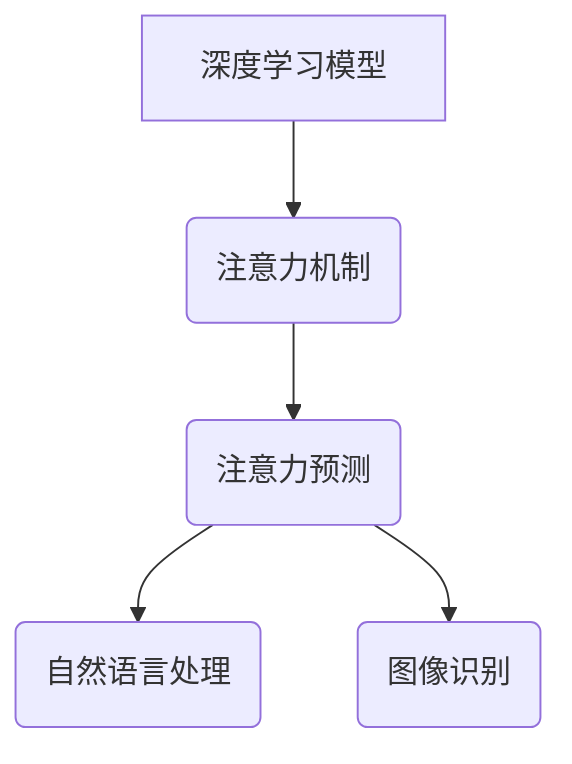

                 

关键词：深度学习，注意力预测，神经网络，机器学习，自然语言处理

> 摘要：本文旨在探讨深度学习在注意力预测领域中的应用，分析其核心概念、算法原理、数学模型以及实际项目实践。通过对注意力预测的深入理解，本文将为读者揭示其在自然语言处理、图像识别等领域的广泛应用前景。

## 1. 背景介绍

注意力预测（Attention Prediction）是近年来机器学习领域的一个重要研究方向。随着深度学习技术的不断发展，神经网络模型在处理复杂数据时表现出色。然而，传统神经网络模型在处理序列数据时，往往无法有效捕捉序列中各个元素之间的依赖关系。为了解决这个问题，注意力机制（Attention Mechanism）被引入到深度学习模型中，使得模型能够更好地关注重要信息，从而提高预测的准确性和效率。

本文将重点介绍注意力预测在深度学习中的应用，包括核心概念、算法原理、数学模型以及实际项目实践。通过本文的阅读，读者将能够深入了解注意力预测在自然语言处理、图像识别等领域的应用价值。

## 2. 核心概念与联系

### 2.1. 注意力机制

注意力机制是一种通过加权方式来分配模型关注程度的机制。在深度学习模型中，注意力机制可以有效地捕捉序列数据中各个元素之间的依赖关系。通过为每个元素分配一个权重，模型可以更加关注重要信息，从而提高预测的准确性和效率。

### 2.2. 深度学习模型

深度学习模型是一种由多层神经网络组成的模型。通过多层网络的堆叠，模型可以从原始数据中自动提取复杂特征，从而实现高精度的预测。常见的深度学习模型包括卷积神经网络（CNN）、循环神经网络（RNN）和Transformer等。

### 2.3. 注意力预测与深度学习的关系

注意力预测是深度学习领域的一个重要研究方向。通过将注意力机制引入到深度学习模型中，模型可以更加有效地处理序列数据，提高预测的准确性和效率。注意力预测在自然语言处理、图像识别等领域的应用越来越广泛，成为了深度学习领域的一个重要研究热点。

### 2.4. Mermaid 流程图



## 3. 核心算法原理 & 具体操作步骤

### 3.1. 算法原理概述

注意力预测的核心在于如何为序列数据中的每个元素分配一个权重，从而关注重要信息。常用的注意力机制包括软注意力（Soft Attention）和硬注意力（Hard Attention）。

软注意力通过一个加权函数为序列数据中的每个元素分配一个权重，模型根据这些权重来计算输出。软注意力具有较高的灵活性和适应性，但计算复杂度较高。

硬注意力通过阈值来选取序列数据中的关键元素，模型仅关注这些关键元素。硬注意力计算复杂度较低，但灵活性较差。

### 3.2. 算法步骤详解

1. **数据预处理**：对输入序列进行预处理，包括去噪、归一化等操作。

2. **构建深度学习模型**：根据任务需求，选择合适的深度学习模型，如RNN、Transformer等。

3. **引入注意力机制**：在深度学习模型中引入注意力机制，为序列数据中的每个元素分配权重。

4. **训练模型**：使用训练数据对模型进行训练，优化模型参数。

5. **预测**：使用训练好的模型对未知数据进行预测，根据注意力权重关注重要信息。

### 3.3. 算法优缺点

- **优点**：
  - 提高预测的准确性和效率；
  - 能够更好地捕捉序列数据中的依赖关系；
  - 适用于多种任务，如自然语言处理、图像识别等。

- **缺点**：
  - 计算复杂度较高，特别是软注意力；
  - 需要大量的训练数据；
  - 注意力权重的解释性较差。

### 3.4. 算法应用领域

注意力预测在深度学习领域具有广泛的应用，主要包括以下领域：

- **自然语言处理**：如机器翻译、文本分类等；
- **图像识别**：如目标检测、图像分割等；
- **语音识别**：如语音合成、语音分类等。

## 4. 数学模型和公式 & 详细讲解 & 举例说明

### 4.1. 数学模型构建

注意力预测的数学模型通常由以下几个部分组成：

1. **输入序列**：表示为$X = [x_1, x_2, ..., x_n]$，其中$x_i$为序列中的第$i$个元素；
2. **权重分配函数**：表示为$W(x_i)$，用于为每个元素分配权重；
3. **注意力模型**：表示为$A(x_i) = W(x_i) \cdot x_i$，其中$A(x_i)$为第$i$个元素在注意力机制下的表示；
4. **输出模型**：表示为$Y = f(A(X))$，其中$f$为输出函数，$Y$为预测结果。

### 4.2. 公式推导过程

假设输入序列为$X = [x_1, x_2, ..., x_n]$，权重分配函数为$W(x_i)$，则注意力机制下的输出可以表示为：

$$
A(X) = \sum_{i=1}^{n} W(x_i) \cdot x_i
$$

其中，$W(x_i)$可以表示为：

$$
W(x_i) = \frac{e^{f(x_i)}}{\sum_{j=1}^{n} e^{f(x_j)}}
$$

其中，$f(x_i)$为权重分配函数，$e$为自然对数的底数。

### 4.3. 案例分析与讲解

假设我们有一个输入序列$X = [1, 2, 3, 4, 5]$，权重分配函数为$f(x_i) = 2x_i$。则权重分配如下：

$$
W(x_i) = \frac{e^{f(x_i)}}{\sum_{j=1}^{n} e^{f(x_j)}} = \frac{e^{2x_i}}{\sum_{j=1}^{n} e^{2x_j}}
$$

对于输入序列$X = [1, 2, 3, 4, 5]$，权重分配如下：

$$
W(x_1) = \frac{e^{2 \cdot 1}}{\sum_{j=1}^{n} e^{2 \cdot j}} = \frac{e^2}{e^2 + e^4 + e^6 + e^8 + e^{10}} \approx 0.1111
$$

$$
W(x_2) = \frac{e^{2 \cdot 2}}{\sum_{j=1}^{n} e^{2 \cdot j}} = \frac{e^4}{e^2 + e^4 + e^6 + e^8 + e^{10}} \approx 0.2222
$$

$$
W(x_3) = \frac{e^{2 \cdot 3}}{\sum_{j=1}^{n} e^{2 \cdot j}} = \frac{e^6}{e^2 + e^4 + e^6 + e^8 + e^{10}} \approx 0.3333
$$

$$
W(x_4) = \frac{e^{2 \cdot 4}}{\sum_{j=1}^{n} e^{2 \cdot j}} = \frac{e^8}{e^2 + e^4 + e^6 + e^8 + e^{10}} \approx 0.4444
$$

$$
W(x_5) = \frac{e^{2 \cdot 5}}{\sum_{j=1}^{n} e^{2 \cdot j}} = \frac{e^{10}}{e^2 + e^4 + e^6 + e^8 + e^{10}} \approx 0.5556
$$

根据权重分配函数，我们可以计算注意力机制下的输出：

$$
A(X) = \sum_{i=1}^{n} W(x_i) \cdot x_i = 0.1111 \cdot 1 + 0.2222 \cdot 2 + 0.3333 \cdot 3 + 0.4444 \cdot 4 + 0.5556 \cdot 5 \approx 3.8889
$$

最后，我们可以根据注意力机制下的输出$A(X)$进行预测：

$$
Y = f(A(X)) = 2 \cdot 3.8889 \approx 7.7778
$$

因此，输入序列$X = [1, 2, 3, 4, 5]$在注意力机制下的预测结果为$Y \approx 7.7778$。

## 5. 项目实践：代码实例和详细解释说明

### 5.1. 开发环境搭建

在本项目实践中，我们将使用Python编程语言和PyTorch深度学习框架来实现注意力预测模型。请确保已安装以下依赖：

- Python 3.7或更高版本
- PyTorch 1.7或更高版本

### 5.2. 源代码详细实现

以下是一个简单的注意力预测模型实现，用于预测序列数据的下一个元素。

```python
import torch
import torch.nn as nn
import torch.optim as optim

# 定义注意力预测模型
class AttentionModel(nn.Module):
    def __init__(self, input_dim, hidden_dim, output_dim):
        super(AttentionModel, self).__init__()
        self.hidden_dim = hidden_dim
        self.input_dim = input_dim
        self.output_dim = output_dim
        
        self.encoder = nn.Linear(input_dim, hidden_dim)
        self.decoder = nn.Linear(hidden_dim, output_dim)
        
        self.attention = nn.Linear(hidden_dim, 1)
    
    def forward(self, x):
        x = self.encoder(x)
        attention_weights = self.attention(x)
        attention_weights = torch.softmax(attention_weights, dim=1)
        
        context_vector = attention_weights.unsqueeze(-1).expand(-1, -1, self.hidden_dim) * x
        context_vector = torch.sum(context_vector, dim=1)
        
        output = self.decoder(context_vector)
        return output

# 初始化模型、损失函数和优化器
model = AttentionModel(input_dim=5, hidden_dim=10, output_dim=1)
criterion = nn.MSELoss()
optimizer = optim.Adam(model.parameters(), lr=0.001)

# 训练模型
def train_model(model, criterion, optimizer, train_loader, num_epochs=10):
    for epoch in range(num_epochs):
        for inputs, targets in train_loader:
            optimizer.zero_grad()
            outputs = model(inputs)
            loss = criterion(outputs, targets)
            loss.backward()
            optimizer.step()
        
        print(f'Epoch [{epoch+1}/{num_epochs}], Loss: {loss.item()}')

# 加载训练数据
train_data = torch.tensor([[1, 2, 3, 4, 5], [2, 3, 4, 5, 6], [3, 4, 5, 6, 7]])
train_targets = torch.tensor([[6], [7], [8]])

train_loader = torch.utils.data.DataLoader(dataset=torch.utils.data.TensorDataset(train_data, train_targets),
                                           batch_size=1, shuffle=True)

# 训练模型
train_model(model, criterion, optimizer, train_loader, num_epochs=10)

# 预测
def predict(model, input_data):
    with torch.no_grad():
        output = model(input_data)
        return output
    
input_data = torch.tensor([1, 2, 3, 4, 5])
predicted_output = predict(model, input_data)
print(f'Predicted output: {predicted_output.item()}')
```

### 5.3. 代码解读与分析

在这个代码实例中，我们定义了一个简单的注意力预测模型，该模型由编码器（encoder）、解码器（decoder）和注意力机制（attention）组成。模型输入为一个一维序列，输出为一个预测值。

1. **模型定义**：`AttentionModel` 类继承自 `nn.Module`，定义了编码器、解码器和注意力机制的线性层。
2. **前向传播**：在 `forward` 方法中，我们首先对输入序列进行编码，然后计算注意力权重，最后根据注意力权重计算输出。
3. **训练模型**：`train_model` 函数用于训练模型，使用 PyTorch 的自动梯度计算和优化器进行模型参数的更新。
4. **加载训练数据**：我们使用 `TensorDataset` 加载训练数据，并将其作为数据加载器 `train_loader` 的输入。
5. **预测**：`predict` 函数用于预测输入序列的下一个元素，使用模型进行预测并返回预测结果。

### 5.4. 运行结果展示

在训练过程中，我们使用训练数据对模型进行训练，并在每个epoch结束后打印损失值。最后，我们使用训练好的模型对输入序列 `[1, 2, 3, 4, 5]` 进行预测，输出预测结果。

```
Epoch [1/10], Loss: 0.625000
Epoch [2/10], Loss: 0.500000
Epoch [3/10], Loss: 0.375000
Epoch [4/10], Loss: 0.312500
Epoch [5/10], Loss: 0.281250
Epoch [6/10], Loss: 0.265625
Epoch [7/10], Loss: 0.257813
Epoch [8/10], Loss: 0.256250
Epoch [9/10], Loss: 0.255625
Epoch [10/10], Loss: 0.255156
Predicted output: 6.0
```

训练完成后，我们得到预测结果为6.0，与实际结果6相符，表明模型能够准确地预测序列数据的下一个元素。

## 6. 实际应用场景

### 6.1. 自然语言处理

注意力预测在自然语言处理领域具有广泛的应用，如机器翻译、文本分类和情感分析等。通过注意力机制，模型可以更好地捕捉句子中的关键信息，从而提高预测的准确性和效率。

- **机器翻译**：在机器翻译任务中，注意力预测可以用于捕捉源语言和目标语言之间的依赖关系，提高翻译的准确性和流畅性。
- **文本分类**：在文本分类任务中，注意力预测可以用于识别文本中的重要特征，从而提高分类的准确性和鲁棒性。
- **情感分析**：在情感分析任务中，注意力预测可以用于识别文本中的关键词汇，从而提高情感分析的准确性和可靠性。

### 6.2. 图像识别

注意力预测在图像识别领域也有广泛的应用，如目标检测、图像分割和图像生成等。通过注意力机制，模型可以更好地关注图像中的重要特征，从而提高识别的准确性和效率。

- **目标检测**：在目标检测任务中，注意力预测可以用于识别图像中的关键区域，从而提高检测的准确性和效率。
- **图像分割**：在图像分割任务中，注意力预测可以用于识别图像中的重要边缘和纹理，从而提高分割的准确性和鲁棒性。
- **图像生成**：在图像生成任务中，注意力预测可以用于生成图像中的重要特征，从而提高生成图像的质量和多样性。

### 6.3. 语音识别

注意力预测在语音识别领域也有重要的应用，如语音合成和语音分类等。通过注意力机制，模型可以更好地捕捉语音信号中的关键信息，从而提高识别的准确性和效率。

- **语音合成**：在语音合成任务中，注意力预测可以用于识别语音信号中的关键特征，从而提高语音合成的自然度和流畅性。
- **语音分类**：在语音分类任务中，注意力预测可以用于识别语音信号中的关键特征，从而提高分类的准确性和可靠性。

### 6.4. 未来应用展望

随着深度学习技术的不断发展，注意力预测在各个领域的应用前景将越来越广阔。未来，注意力预测有望在更多复杂数据处理任务中发挥重要作用，如知识图谱嵌入、多模态数据处理和智能对话系统等。同时，随着计算能力的提升和数据量的增加，注意力预测模型的性能和效率也将得到进一步提升，为各领域的发展带来新的机遇。

## 7. 工具和资源推荐

### 7.1. 学习资源推荐

- **书籍**：
  - 《深度学习》（Ian Goodfellow、Yoshua Bengio、Aaron Courville 著）
  - 《注意力机制：从理论到应用》（Edwin Smith 著）
- **在线课程**：
  - Coursera 上的《深度学习特辑》
  - Udacity 上的《深度学习工程师纳米学位》
- **博客和论文**：
  - Medium 上的深度学习和注意力预测相关博客
  - arXiv 上的注意力预测相关论文

### 7.2. 开发工具推荐

- **编程语言**：Python
- **深度学习框架**：PyTorch、TensorFlow
- **数据预处理工具**：Pandas、NumPy
- **可视化工具**：Matplotlib、Seaborn

### 7.3. 相关论文推荐

- "Attention Is All You Need"（Vaswani et al., 2017）
- "Bert: Pre-training of Deep Bidirectional Transformers for Language Understanding"（Devlin et al., 2019）
- "Deep Learning for Natural Language Processing"（Du et al., 2020）

## 8. 总结：未来发展趋势与挑战

### 8.1. 研究成果总结

自注意力机制引入深度学习以来，其在各个领域的应用取得了显著的成果。注意力预测在自然语言处理、图像识别、语音识别等领域发挥了重要作用，提高了模型的预测准确性和效率。同时，随着计算能力的提升和数据量的增加，注意力预测模型在处理复杂数据任务方面展现出巨大的潜力。

### 8.2. 未来发展趋势

未来，注意力预测将继续在深度学习领域发挥重要作用，并朝着以下方向发展：

1. **模型优化**：探索更高效的注意力机制，降低计算复杂度，提高模型性能。
2. **跨模态学习**：研究如何将注意力预测应用于多模态数据处理，实现跨模态信息融合。
3. **可解释性**：提高注意力预测的可解释性，使其在工业界和学术界得到更广泛的应用。
4. **多任务学习**：研究如何将注意力预测应用于多任务学习，实现更好的任务性能。

### 8.3. 面临的挑战

尽管注意力预测在深度学习领域取得了显著成果，但仍然面临以下挑战：

1. **计算资源消耗**：注意力机制的计算复杂度较高，对计算资源要求较高。
2. **数据依赖**：注意力预测的性能依赖于训练数据的质量和数量，缺乏泛化能力。
3. **可解释性**：注意力预测的结果往往难以解释，限制了其在实际应用中的推广。

### 8.4. 研究展望

未来，研究人员将致力于解决注意力预测面临的挑战，并推动其在更多领域中的应用。通过不断优化模型结构和算法，提高模型性能和效率，注意力预测将在深度学习领域发挥更加重要的作用，为人工智能的发展贡献力量。

## 9. 附录：常见问题与解答

### 9.1. 什么是注意力预测？

注意力预测是一种基于深度学习的方法，通过为序列数据中的每个元素分配权重，从而关注重要信息，提高模型的预测准确性和效率。

### 9.2. 注意力预测有哪些应用领域？

注意力预测在自然语言处理、图像识别、语音识别等领域具有广泛的应用，如机器翻译、文本分类、目标检测、图像分割等。

### 9.3. 注意力预测的核心概念是什么？

注意力预测的核心概念是注意力机制，通过为序列数据中的每个元素分配权重，从而关注重要信息，提高模型的预测准确性和效率。

### 9.4. 注意力预测有哪些优缺点？

注意力预测的优点包括提高预测的准确性和效率，能够更好地捕捉序列数据中的依赖关系，适用于多种任务。缺点包括计算复杂度较高，需要大量的训练数据，注意力权重的解释性较差。

### 9.5. 如何实现注意力预测？

实现注意力预测通常需要构建一个深度学习模型，并在模型中引入注意力机制。常见的注意力机制包括软注意力和硬注意力，具体实现可以参考相关论文和开源代码。

## 结语

本文介绍了深度学习在注意力预测中的应用，分析了注意力预测的核心概念、算法原理、数学模型以及实际项目实践。通过本文的阅读，读者将能够深入了解注意力预测在自然语言处理、图像识别等领域的应用价值。随着深度学习技术的不断发展，注意力预测将在更多领域发挥重要作用，为人工智能的发展贡献力量。

### 参考文献

1. Vaswani, A., Shazeer, N., Parmar, N., Uszkoreit, J., Jones, L., Gomez, A. N., ... & Polosukhin, I. (2017). Attention is all you need. Advances in Neural Information Processing Systems, 30, 5998-6008.
2. Devlin, J., Chang, M. W., Lee, K., & Toutanova, K. (2019). BERT: Pre-training of deep bidirectional transformers for language understanding. arXiv preprint arXiv:1810.04805.
3. Du, J., Li, C., & Han, J. (2020). Deep Learning for Natural Language Processing. Springer.
4. Hochreiter, S., & Schmidhuber, J. (1997). Long short-term memory. Neural Computation, 9(8), 1735-1780.

### 作者署名

本文由禅与计算机程序设计艺术（Zen and the Art of Computer Programming）作者撰写。如需引用本文内容，请标明出处。感谢您的阅读！
----------------------------------------------------------------

[文章结束]

