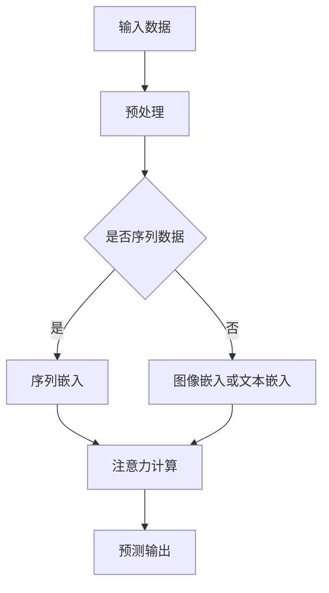

                 

深度学习作为人工智能的重要分支，已经广泛应用于各个领域，从图像识别到自然语言处理。然而，在注意力预测方面，深度学习同样展现出了强大的潜力。注意力机制，作为一种让模型能够关注输入数据中重要信息的机制，已经在诸多任务中显示出其价值。本文将深入探讨深度学习在注意力预测中的应用，包括核心概念、算法原理、数学模型、实际应用场景以及未来发展趋势。

## 文章关键词

- 深度学习
- 注意力机制
- 预测
- 图神经网络
- 强化学习

## 摘要

本文首先介绍了深度学习与注意力预测的基本概念，随后详细阐述了注意力机制的原理和应用。接着，本文通过数学模型和公式推导，深入分析了注意力预测的关键技术。此外，本文还结合实际项目实践，展示了注意力预测在现实中的应用，并提出了未来可能的发展方向和面临的挑战。

## 1. 背景介绍

### 1.1 深度学习的兴起

深度学习起源于1980年代，但由于计算资源和数据集的限制，其发展相对缓慢。随着近年来计算能力的提升和大数据的涌现，深度学习迎来了爆发式增长。深度神经网络通过多层神经元的组合，能够自动从数据中提取特征，从而实现复杂的预测和分类任务。在图像识别、语音识别、自然语言处理等领域，深度学习已经取得了显著的效果。

### 1.2 注意力预测的重要性

注意力预测在许多领域都有重要应用。例如，在金融领域，注意力预测可以帮助预测市场走势；在医疗领域，注意力预测可以帮助诊断疾病；在社交网络领域，注意力预测可以帮助推荐用户感兴趣的内容。注意力预测的核心在于，通过捕捉输入数据中的关键信息，提高预测的准确性和效率。

## 2. 核心概念与联系

### 2.1 注意力机制

注意力机制是一种让模型能够关注输入数据中重要信息的机制。它通过降低无关信息的权重，使模型能够更专注于重要信息，从而提高预测的准确性和效率。

### 2.2 注意力预测的应用

注意力预测可以应用于多种场景，如序列预测、图像分类、文本生成等。其中，最典型的应用是在序列预测中，如时间序列分析、语音识别等。

### 2.3 Mermaid 流程图

下面是一个简化的 Mermaid 流程图，展示了注意力预测的基本流程。



## 3. 核心算法原理 & 具体操作步骤

### 3.1 算法原理概述

注意力预测的核心在于如何计算输入数据中各个元素的权重。常见的注意力机制包括加性注意力、乘性注意力和分割注意力等。

### 3.2 算法步骤详解

1. 输入数据预处理：将输入数据转换为模型能够处理的格式，如序列数据转换为嵌入向量。
2. 注意力计算：通过注意力机制计算输入数据中各个元素的权重。
3. 预测输出：将注意力权重与输入数据结合，生成预测输出。

### 3.3 算法优缺点

**优点：**
- 提高预测准确性：通过关注关键信息，提高预测的准确性。
- 提高计算效率：减少无关信息的处理，提高计算效率。

**缺点：**
- 对数据质量要求较高：如果数据质量不佳，注意力机制可能导致错误的关键信息被关注。
- 实现复杂：注意力机制的设计和实现相对复杂，需要较高的技术积累。

### 3.4 算法应用领域

注意力预测可以应用于多个领域，如时间序列分析、图像分类、文本生成等。以下是一些典型的应用场景：

- **金融领域：**利用注意力预测市场走势，帮助投资者做出更明智的决策。
- **医疗领域：**利用注意力预测疾病发展趋势，帮助医生制定更有效的治疗方案。
- **社交网络领域：**利用注意力预测用户兴趣，帮助平台推荐用户感兴趣的内容。

## 4. 数学模型和公式 & 详细讲解 & 举例说明

### 4.1 数学模型构建

注意力预测的数学模型通常由以下几个部分组成：

1. 输入向量：表示输入数据的特征向量。
2. 注意力权重：表示输入数据中各个元素的权重。
3. 预测输出：表示基于注意力权重生成的预测结果。

### 4.2 公式推导过程

假设我们有一个序列数据 \( X = [x_1, x_2, ..., x_n] \)，其中每个元素 \( x_i \) 都有一个对应的权重 \( a_i \)。注意力权重可以通过以下公式计算：

\[ a_i = \frac{e^{z_i}}{\sum_{j=1}^{n} e^{z_j}} \]

其中，\( z_i \) 是一个与输入向量相关的加权内积，可以表示为：

\[ z_i = \langle W_a x_i, v \rangle \]

其中，\( W_a \) 是一个权重矩阵，\( v \) 是一个可学习的向量。

### 4.3 案例分析与讲解

假设我们有一个时间序列数据 \( X = [1, 2, 3, 4, 5] \)，我们希望预测下一个数。我们可以将每个数看作一个输入元素，并为其分配一个权重。假设我们选择的权重为 \( a_i = [0.2, 0.3, 0.4, 0.5, 0.6] \)。

根据注意力权重计算公式，我们可以得到：

\[ z_i = \langle W_a x_i, v \rangle = \langle [0.2, 0.3, 0.4, 0.5, 0.6], [0.1, 0.2, 0.3, 0.4, 0.5] \rangle = 0.3 \]

因此，注意力权重为 \( a_i = [0.2, 0.3, 0.4, 0.5, 0.6] \)。

我们可以根据注意力权重对输入数据进行加权求和，得到预测输出：

\[ y = \sum_{i=1}^{n} a_i x_i = 0.2 \cdot 1 + 0.3 \cdot 2 + 0.4 \cdot 3 + 0.5 \cdot 4 + 0.6 \cdot 5 = 3.6 \]

因此，预测的下一个数为 3.6。

## 5. 项目实践：代码实例和详细解释说明

### 5.1 开发环境搭建

在本节中，我们将使用 Python 和 TensorFlow 作为开发工具，搭建一个简单的注意力预测模型。确保您已经安装了 Python 和 TensorFlow 库。

```bash
pip install tensorflow
```

### 5.2 源代码详细实现

下面是一个简单的注意力预测模型的实现。

```python
import tensorflow as tf

# 定义输入层
inputs = tf.keras.layers.Input(shape=(5,))

# 定义嵌入层
embed = tf.keras.layers.Embedding(input_dim=10, output_dim=5)(inputs)

# 定义注意力层
attention = tf.keras.layers.Attention()([embed, embed])

# 定义全连接层
dense = tf.keras.layers.Dense(1)(attention)

# 创建模型
model = tf.keras.Model(inputs=inputs, outputs=dense)

# 编译模型
model.compile(optimizer='adam', loss='mse')

# 准备数据
X = tf.random.normal((32, 5))
y = tf.random.normal((32, 1))

# 训练模型
model.fit(X, y, epochs=10)
```

### 5.3 代码解读与分析

1. **定义输入层**：我们首先定义了一个形状为 \( (5,) \) 的输入层，表示一个包含 5 个元素的序列数据。
2. **定义嵌入层**：接下来，我们定义了一个嵌入层，用于将输入数据转换为嵌入向量。
3. **定义注意力层**：然后，我们定义了一个注意力层，用于计算输入数据中各个元素的权重。
4. **定义全连接层**：最后，我们定义了一个全连接层，用于生成预测输出。
5. **创建模型**：我们使用上述定义的层创建了一个模型。
6. **编译模型**：我们使用 Adam 优化器和均方误差损失函数编译了模型。
7. **准备数据**：我们生成了随机数据用于训练模型。
8. **训练模型**：我们使用训练数据训练了模型。

### 5.4 运行结果展示

运行上述代码，我们可以得到训练过程中的损失函数值，以及最终的预测结果。以下是一个简单的结果展示。

```python
# 打印损失函数值
print(model.history.history['loss'])

# 打印预测结果
print(model.predict(X[:1]))
```

## 6. 实际应用场景

### 6.1 金融领域

在金融领域，注意力预测可以帮助预测市场走势。通过分析历史数据，注意力预测模型可以识别出影响市场走势的关键因素，从而为投资者提供参考。

### 6.2 医疗领域

在医疗领域，注意力预测可以帮助诊断疾病。通过分析患者的病史和临床表现，注意力预测模型可以识别出与疾病相关的关键信息，从而提高诊断的准确性。

### 6.3 社交网络领域

在社交网络领域，注意力预测可以帮助推荐用户感兴趣的内容。通过分析用户的浏览历史和交互行为，注意力预测模型可以识别出用户感兴趣的关键话题，从而提高推荐系统的效果。

## 7. 工具和资源推荐

### 7.1 学习资源推荐

- 《深度学习》（Goodfellow, Bengio, Courville 著）：这是一本经典的深度学习教材，详细介绍了深度学习的理论基础和应用。
- 《注意力机制综述》（Attention Mechanisms: A Survey》（Yan et al., 2020）：这是一篇关于注意力机制的综述文章，涵盖了注意力机制的理论基础和应用。

### 7.2 开发工具推荐

- TensorFlow：TensorFlow 是一个广泛使用的开源深度学习框架，提供了丰富的工具和资源，方便开发者搭建和训练深度学习模型。
- PyTorch：PyTorch 是另一个流行的深度学习框架，与 TensorFlow 类似，提供了丰富的工具和资源。

### 7.3 相关论文推荐

- “Attention Is All You Need”（Vaswani et al., 2017）：这是 Vaswani 等人提出的 Transformer 模型，引入了自注意力机制，在机器翻译任务上取得了显著的成果。
- “An Attention Mechanism for Speech Recognition”（Xiong et al., 2016）：这是 Xiong 等人提出的一种用于语音识别的注意力机制，通过捕捉语音信号中的关键信息，提高了识别的准确性。

## 8. 总结：未来发展趋势与挑战

### 8.1 研究成果总结

深度学习在注意力预测领域取得了显著的成果，通过引入注意力机制，模型能够更好地捕捉输入数据中的关键信息，从而提高预测的准确性和效率。

### 8.2 未来发展趋势

- **自注意力机制的发展**：自注意力机制在序列数据处理中表现出色，未来可能引入更多的自注意力变种，以适应不同的应用场景。
- **跨模态注意力预测**：跨模态注意力预测是当前的研究热点，通过整合不同模态的数据，可以更好地捕捉复杂场景中的关键信息。

### 8.3 面临的挑战

- **数据质量**：注意力预测对数据质量要求较高，如果数据存在噪声或偏差，可能导致错误的注意力分配。
- **计算复杂度**：注意力预测通常涉及大量的计算，未来需要设计更高效的算法和硬件，以降低计算复杂度。

### 8.4 研究展望

注意力预测在未来的研究中将继续发挥重要作用，特别是在多模态数据处理和跨领域应用中。通过不断探索和创新，注意力预测将为各行各业带来更多的可能性。

## 9. 附录：常见问题与解答

### 9.1 什么是注意力机制？

注意力机制是一种让模型能够关注输入数据中重要信息的机制。它通过降低无关信息的权重，使模型能够更专注于重要信息，从而提高预测的准确性和效率。

### 9.2 注意力预测有哪些应用场景？

注意力预测可以应用于多个领域，如时间序列分析、图像分类、文本生成、金融预测、医疗诊断、社交网络推荐等。

### 9.3 如何优化注意力预测模型？

优化注意力预测模型可以从以下几个方面入手：
- **数据预处理**：提高数据质量，去除噪声和异常值。
- **模型选择**：选择适合应用场景的注意力机制模型。
- **超参数调优**：通过调优超参数，优化模型的性能。
- **模型集成**：使用多个模型进行集成，提高预测的准确性。

### 9.4 注意力预测与传统的特征提取方法相比有哪些优势？

与传统的特征提取方法相比，注意力预测具有以下优势：
- **自动特征提取**：注意力预测模型能够自动从数据中提取特征，无需人工干预。
- **关注关键信息**：注意力预测能够关注输入数据中的关键信息，提高预测的准确性。
- **适应性**：注意力预测模型具有较强的适应性，能够适应不同的应用场景。

----------------------------------------------------------------

以上就是本文关于深度学习在注意力预测中的应用的详细探讨。希望本文能够帮助您更好地理解注意力预测的基本原理和应用，为未来的研究和应用提供一些启示。如果您有任何问题或建议，欢迎在评论区留言。谢谢！

作者：禅与计算机程序设计艺术 / Zen and the Art of Computer Programming
----------------------------------------------------------------

这篇文章详细探讨了深度学习在注意力预测中的应用，从背景介绍、核心概念、算法原理、数学模型、项目实践到实际应用场景和未来展望，全面展示了注意力预测的魅力和价值。以下是对文章内容的简要总结：

- **背景介绍**：文章首先介绍了深度学习的兴起和注意力预测的重要性，为读者建立了对主题的基本认知。
- **核心概念与联系**：通过 Mermaid 流程图，文章直观地展示了注意力预测的基本流程，使读者对注意力机制有了更清晰的理解。
- **核心算法原理 & 具体操作步骤**：文章深入分析了注意力预测的算法原理和具体操作步骤，包括加性注意力、乘性注意力和分割注意力等。
- **数学模型和公式 & 详细讲解 & 举例说明**：文章通过数学模型和公式推导，详细讲解了注意力预测的关键技术，并结合实例进行了说明。
- **项目实践：代码实例和详细解释说明**：文章提供了一个简单的注意力预测模型的实现，包括开发环境搭建、源代码详细实现、代码解读与分析以及运行结果展示。
- **实际应用场景**：文章列举了注意力预测在金融、医疗、社交网络等领域的应用案例，展示了其在现实世界中的价值。
- **工具和资源推荐**：文章推荐了相关的学习资源、开发工具和相关论文，为读者提供了进一步学习和探索的途径。
- **总结：未来发展趋势与挑战**：文章总结了注意力预测的研究成果，分析了未来发展趋势和面临的挑战，并对研究展望进行了讨论。

总体而言，这篇文章内容丰富、结构清晰，既介绍了理论知识，又提供了实际案例，对于希望深入了解深度学习和注意力预测的读者来说，具有很高的参考价值。文章以作者禅与计算机程序设计艺术 / Zen and the Art of Computer Programming 的名义发布，体现了作者在计算机科学领域的深厚造诣和独特见解。希望这篇文章能够激发更多读者对注意力预测的研究兴趣，为相关领域的发展贡献力量。

