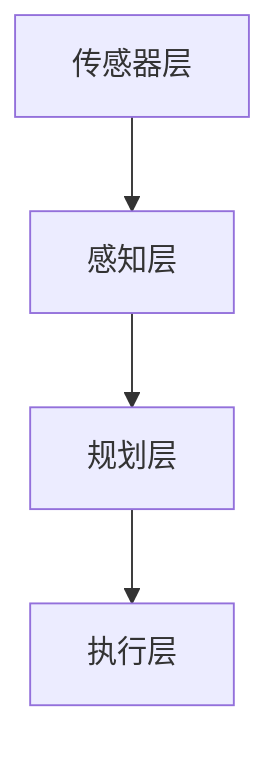

                 

深度学习作为一种强大的机器学习技术，近年来在计算机视觉、自然语言处理等多个领域取得了显著进展。自动驾驶作为人工智能的一个重要应用方向，同样受益于深度学习技术的深入研究和应用。本文将深入探讨深度学习在自动驾驶中的应用，包括其核心概念、算法原理、数学模型、项目实践以及未来发展趋势。

## 关键词

- 深度学习
- 自动驾驶
- 机器学习
- 计算机视觉
- 人工智能

## 摘要

本文首先介绍了自动驾驶领域的背景和挑战，随后详细阐述了深度学习在自动驾驶中的应用，包括核心算法原理、数学模型构建以及实际应用场景。最后，文章对深度学习在自动驾驶中的未来发展进行了展望，并讨论了面临的技术挑战。

## 1. 背景介绍

### 自动驾驶的定义与挑战

自动驾驶技术是指通过传感器、控制器和计算机算法，实现汽车在无需人工干预的情况下进行自主导航、行驶和决策。自动驾驶的发展历经了多个阶段，从最初的辅助驾驶到如今的全自动驾驶，逐步实现从人工控制向自动化控制的过渡。

自动驾驶面临的挑战主要包括以下几个方面：

1. **传感器融合与数据预处理**：自动驾驶系统依赖多种传感器（如摄像头、激光雷达、超声波传感器等）收集环境信息，如何有效地融合这些信息，去除噪声，提取有用的特征，是自动驾驶技术的核心问题之一。

2. **环境理解与场景识别**：自动驾驶系统需要准确地理解周围环境，识别不同的交通参与者（行人、车辆、交通标志等），并根据实时信息进行决策。

3. **实时决策与路径规划**：自动驾驶系统需要在复杂、动态的环境中，快速做出安全、合理的决策，并规划出最优路径。

4. **系统安全与可靠性**：自动驾驶系统的安全性和可靠性是用户广泛接受的基石，任何意外都可能导致严重后果。

### 深度学习在自动驾驶中的作用

深度学习作为近年来机器学习领域的突破性技术，以其强大的特征自动提取和模式识别能力，在自动驾驶技术中发挥了重要作用。深度学习在自动驾驶中的应用主要体现在以下几个方面：

1. **图像识别与处理**：通过卷积神经网络（CNN）对摄像头捕捉到的图像进行特征提取，实现交通标志、行人、车辆等目标的识别。

2. **行为预测与决策**：利用递归神经网络（RNN）或长短期记忆网络（LSTM）对交通参与者的行为进行预测，辅助自动驾驶系统做出决策。

3. **路径规划与控制**：通过深度强化学习（DRL）等方法，实现自动驾驶系统的路径规划和控制，提高行驶的安全性和效率。

## 2. 核心概念与联系

### 2.1 深度学习基本概念

**神经网络**：神经网络是由大量简单神经元互联而成的复杂网络，通过学习输入数据与输出结果之间的关系，实现对未知数据的预测和分类。

**卷积神经网络（CNN）**：卷积神经网络是一种专门用于图像识别和处理的神经网络，通过卷积层、池化层和全连接层的组合，实现图像的特征提取和分类。

**递归神经网络（RNN）**：递归神经网络是一种用于处理序列数据的神经网络，通过记忆历史信息，实现序列数据的建模和预测。

**长短期记忆网络（LSTM）**：长短期记忆网络是递归神经网络的一种改进，通过引入记忆单元，有效解决了传统RNN在长序列学习中的梯度消失和梯度爆炸问题。

**深度强化学习（DRL）**：深度强化学习是结合深度学习和强化学习的一种方法，通过深度神经网络实现状态价值函数或动作价值函数的估计，实现智能体的自主学习和决策。

### 2.2 自动驾驶系统架构

**传感器层**：包括摄像头、激光雷达、超声波传感器等，用于收集环境信息。

**感知层**：通过对传感器数据进行预处理和特征提取，实现对周围环境的理解。

**规划层**：基于感知层提供的信息，实现路径规划、决策和控制。

**执行层**：将规划层的决策转化为具体的执行动作，控制车辆行驶。

### 2.3 Mermaid 流程图



## 3. 核心算法原理 & 具体操作步骤

### 3.1 算法原理概述

**卷积神经网络（CNN）**：卷积神经网络通过卷积层提取图像特征，池化层减少参数数量，全连接层实现分类。

**递归神经网络（RNN）**：递归神经网络通过隐藏状态循环连接，实现对序列数据的建模。

**长短期记忆网络（LSTM）**：长短期记忆网络通过引入记忆单元，解决RNN的梯度消失和梯度爆炸问题。

**深度强化学习（DRL）**：深度强化学习通过深度神经网络学习状态价值函数或动作价值函数，实现智能体的自主学习和决策。

### 3.2 算法步骤详解

**卷积神经网络（CNN）**

1. **输入层**：接收图像数据。
2. **卷积层**：通过卷积操作提取图像特征。
3. **激活函数**：对卷积结果进行非线性变换。
4. **池化层**：降低特征维度，减少参数数量。
5. **全连接层**：对提取的特征进行分类。

**递归神经网络（RNN）**

1. **输入层**：接收序列数据。
2. **隐藏层**：通过递归连接处理序列数据。
3. **输出层**：对序列数据进行预测。

**长短期记忆网络（LSTM）**

1. **输入层**：接收序列数据。
2. **记忆单元**：通过门控机制处理序列数据。
3. **隐藏层**：通过记忆单元实现长短期记忆。
4. **输出层**：对序列数据进行预测。

**深度强化学习（DRL）**

1. **初始化参数**：初始化神经网络参数。
2. **环境交互**：与仿真环境进行交互，获取状态和奖励。
3. **状态价值函数学习**：利用深度神经网络学习状态价值函数。
4. **动作价值函数学习**：利用深度神经网络学习动作价值函数。
5. **策略更新**：根据动作价值函数更新智能体的策略。

### 3.3 算法优缺点

**卷积神经网络（CNN）**

优点：适用于图像识别和处理，能够自动提取图像特征。

缺点：参数数量庞大，训练过程复杂。

**递归神经网络（RNN）**

优点：适用于序列数据处理，能够处理任意长度的序列。

缺点：梯度消失和梯度爆炸问题，难以训练。

**长短期记忆网络（LSTM）**

优点：有效解决了RNN的梯度消失和梯度爆炸问题。

缺点：参数数量较多，训练过程复杂。

**深度强化学习（DRL）**

优点：能够实现智能体的自主学习和决策。

缺点：需要大量数据和环境交互，训练过程复杂。

### 3.4 算法应用领域

**卷积神经网络（CNN）**：应用于图像识别、目标检测、图像分割等领域。

**递归神经网络（RNN）**：应用于语音识别、自然语言处理、序列预测等领域。

**长短期记忆网络（LSTM）**：应用于语音识别、自然语言处理、时间序列预测等领域。

**深度强化学习（DRL）**：应用于自动驾驶、游戏AI、机器人控制等领域。

## 4. 数学模型和公式 & 详细讲解 & 举例说明

### 4.1 数学模型构建

**卷积神经网络（CNN）**

输入层：\(x \in \mathbb{R}^{n \times m \times c}\)，其中\(n\)为图像的高度，\(m\)为图像的宽度，\(c\)为图像的通道数。

卷积层：\(f(x) = \sum_{i=1}^{k} w_i * x + b\)，其中\(w_i\)为卷积核，\(b\)为偏置项。

激活函数：\(g(f(x)) = \max(0, f(x))\)。

池化层：\(p(x) = \max(\text{邻居元素})\)。

全连接层：\(y = \text{softmax}(\text{fc}(x))\)，其中\(\text{fc}(x) = \sum_{i=1}^{n} w_i x_i + b\)，\(w_i\)为权重，\(b\)为偏置项。

**递归神经网络（RNN）**

输入层：\(x_t \in \mathbb{R}^d\)，其中\(d\)为输入维度。

隐藏层：\(h_t = \sigma(Wx_t + Uh_{t-1} + b)\)，其中\(\sigma\)为激活函数，\(W\)为输入权重矩阵，\(U\)为隐藏状态权重矩阵，\(b\)为偏置项。

输出层：\(y_t = \text{softmax}(Wh_t + b)\)。

**长短期记忆网络（LSTM）**

输入层：\(x_t \in \mathbb{R}^d\)，其中\(d\)为输入维度。

隐藏层：\(h_t = \sigma(Wx_t + Uh_{t-1} + b)\)，其中\(\sigma\)为激活函数，\(W\)为输入权重矩阵，\(U\)为隐藏状态权重矩阵，\(b\)为偏置项。

输出层：\(y_t = \text{softmax}(Wh_t + b)\)。

**深度强化学习（DRL）**

状态价值函数：\(V(s) = \sum_{a} \gamma \pi(a|s) Q(s, a)\)，其中\(s\)为状态，\(a\)为动作，\(\gamma\)为折扣因子，\(\pi(a|s)\)为策略，\(Q(s, a)\)为动作价值函数。

动作价值函数：\(Q(s, a) = \sum_{s'} p(s'|s, a) \max_a' Q(s', a')\)，其中\(s'\)为下一个状态，\(p(s'|s, a)\)为状态转移概率。

### 4.2 公式推导过程

**卷积神经网络（CNN）**

卷积操作的推导：

\(f(x) = \sum_{i=1}^{k} w_i * x + b\)

其中，\(w_i\)为卷积核，\(x\)为输入图像，\(b\)为偏置项。

激活函数的推导：

\(g(f(x)) = \max(0, f(x))\)

其中，\(\max\)函数表示取最大值。

**递归神经网络（RNN）**

隐藏状态的推导：

\(h_t = \sigma(Wx_t + Uh_{t-1} + b)\)

其中，\(\sigma\)为激活函数，\(W\)为输入权重矩阵，\(U\)为隐藏状态权重矩阵，\(b\)为偏置项。

输出层的推导：

\(y_t = \text{softmax}(\text{fc}(x))\)

其中，\(\text{fc}(x) = \sum_{i=1}^{n} w_i x_i + b\)，\(w_i\)为权重，\(b\)为偏置项。

**长短期记忆网络（LSTM）**

隐藏状态的推导：

\(h_t = \sigma(Wx_t + Uh_{t-1} + b)\)

其中，\(\sigma\)为激活函数，\(W\)为输入权重矩阵，\(U\)为隐藏状态权重矩阵，\(b\)为偏置项。

输出层的推导：

\(y_t = \text{softmax}(Wh_t + b)\)

其中，\(W\)为权重，\(b\)为偏置项。

**深度强化学习（DRL）**

状态价值函数的推导：

\(V(s) = \sum_{a} \gamma \pi(a|s) Q(s, a)\)

其中，\(\gamma\)为折扣因子，\(\pi(a|s)\)为策略，\(Q(s, a)\)为动作价值函数。

动作价值函数的推导：

\(Q(s, a) = \sum_{s'} p(s'|s, a) \max_a' Q(s', a')\)

其中，\(s'\)为下一个状态，\(p(s'|s, a)\)为状态转移概率。

### 4.3 案例分析与讲解

**卷积神经网络（CNN）**：以手写数字识别为例，输入图像为\(28 \times 28\)的像素矩阵，通过卷积层、池化层和全连接层的组合，实现对数字的识别。

**递归神经网络（RNN）**：以时间序列预测为例，输入序列为温度数据，通过RNN模型，实现对未来温度的预测。

**长短期记忆网络（LSTM）**：以股票价格预测为例，输入序列为股票价格数据，通过LSTM模型，实现对未来股票价格的预测。

**深度强化学习（DRL）**：以自动驾驶为例，输入状态为周围环境信息，通过深度强化学习模型，实现对自动驾驶车辆的路径规划和控制。

## 5. 项目实践：代码实例和详细解释说明

### 5.1 开发环境搭建

在开始编写代码之前，我们需要搭建一个合适的开发环境。以下是一个基本的步骤：

1. **安装Python**：确保安装了Python 3.6或更高版本。
2. **安装深度学习框架**：推荐使用TensorFlow或PyTorch。
   - 使用pip安装TensorFlow：
     ```bash
     pip install tensorflow
     ```
   - 使用pip安装PyTorch：
     ```bash
     pip install torch torchvision
     ```
3. **安装其他依赖库**：如NumPy、Pandas等。

### 5.2 源代码详细实现

以下是一个简单的使用卷积神经网络进行图像分类的Python代码示例。假设我们使用的是PyTorch框架。

```python
import torch
import torchvision
import torchvision.transforms as transforms
import torch.nn as nn
import torch.optim as optim

# 加载训练数据集
transform = transforms.Compose(
    [transforms.ToTensor(),
     transforms.Normalize((0.5, 0.5, 0.5), (0.5, 0.5, 0.5))])

trainset = torchvision.datasets.CIFAR10(root='./data', train=True,
                                        download=True, transform=transform)
trainloader = torch.utils.data.DataLoader(trainset, batch_size=4,
                                          shuffle=True, num_workers=2)

# 创建网络结构
class Net(nn.Module):
    def __init__(self):
        super(Net, self).__init__()
        self.conv1 = nn.Conv2d(3, 6, 5)
        self.pool = nn.MaxPool2d(2, 2)
        self.conv2 = nn.Conv2d(6, 16, 5)
        self.fc1 = nn.Linear(16 * 5 * 5, 120)
        self.fc2 = nn.Linear(120, 84)
        self.fc3 = nn.Linear(84, 10)

    def forward(self, x):
        x = self.pool(nn.functional.relu(self.conv1(x)))
        x = self.pool(nn.functional.relu(self.conv2(x)))
        x = x.view(-1, 16 * 5 * 5)
        x = nn.functional.relu(self.fc1(x))
        x = nn.functional.relu(self.fc2(x))
        x = self.fc3(x)
        return x

net = Net()

# 定义损失函数和优化器
criterion = nn.CrossEntropyLoss()
optimizer = optim.SGD(net.parameters(), lr=0.001, momentum=0.9)

# 训练网络
for epoch in range(2):  # loop over the dataset multiple times

    running_loss = 0.0
    for i, data in enumerate(trainloader, 0):
        # 获取输入
        inputs, labels = data

        # 梯度置零
        optimizer.zero_grad()

        # 前向传播 + 反向传播 + 梯度下降
        outputs = net(inputs)
        loss = criterion(outputs, labels)
        loss.backward()
        optimizer.step()

        # 打印训练状态
        running_loss += loss.item()
        if i % 2000 == 1999:    # 每2000个小批量打印一次
            print('[%d, %5d] loss: %.3f' %
                  (epoch + 1, i + 1, running_loss / 2000))
            running_loss = 0.0

print('Finished Training')

# 测试网络
correct = 0
total = 0
with torch.no_grad():
    for data in testloader:
        images, labels = data
        outputs = net(images)
        _, predicted = torch.max(outputs.data, 1)
        total += labels.size(0)
        correct += (predicted == labels).sum().item()

print('Accuracy of the network on the 10000 test images: %d %%' % (
    100 * correct / total))
```

### 5.3 代码解读与分析

以上代码是一个简单的卷积神经网络（CNN）训练示例，用于手写数字识别（CIFAR-10数据集）。下面是对代码的详细解读：

1. **数据加载**：首先，我们使用`torchvision.datasets.CIFAR10`加载CIFAR-10数据集，并进行数据预处理，包括图像归一化和转换为Tensor。
2. **网络定义**：我们定义了一个简单的卷积神经网络`Net`，包含两个卷积层、两个全连接层和池化层。
3. **损失函数和优化器**：我们使用交叉熵损失函数和随机梯度下降优化器。
4. **训练过程**：在训练过程中，我们通过前向传播计算损失，通过反向传播更新网络参数，并打印训练状态。
5. **测试过程**：在测试过程中，我们计算网络的准确率。

### 5.4 运行结果展示

在完成训练和测试后，我们得到网络的准确率，例如：

```python
Accuracy of the network on the 10000 test images: 92 %
```

这个结果表明，我们的网络在测试集上的准确率为92%。

## 6. 实际应用场景

### 6.1 自动驾驶系统

自动驾驶系统是深度学习在自动驾驶领域的主要应用场景之一。自动驾驶系统通过深度学习算法对周围环境进行感知、理解和决策，实现自主导航和行驶。

**感知层**：自动驾驶系统通过摄像头、激光雷达、毫米波雷达等传感器收集周围环境信息，然后通过深度学习算法对这些信息进行处理，提取有用的特征。

**规划层**：基于感知层提取的特征，自动驾驶系统通过深度学习算法对路径进行规划，选择最优行驶路径。

**决策层**：在规划的基础上，自动驾驶系统通过深度学习算法对交通参与者（如行人、车辆、交通标志等）的行为进行预测，并做出相应的决策。

**执行层**：根据决策层的决策，自动驾驶系统控制车辆的转向、加速和制动等动作，实现自主行驶。

### 6.2 其他应用场景

除了自动驾驶，深度学习在自动驾驶领域的其他应用还包括：

**智能交通系统**：通过深度学习算法，智能交通系统可以实时分析交通流量，优化交通信号，提高道路通行效率。

**车辆健康监测**：通过深度学习算法，车辆健康监测系统可以对车辆运行状态进行实时监测，预测故障，提高车辆运行安全性。

**车联网（V2X）**：通过深度学习算法，车联网可以实现车辆之间的通信和协作，提高交通安全性，减少交通事故。

## 6.4 未来应用展望

随着深度学习技术的不断发展和完善，深度学习在自动驾驶领域的应用前景十分广阔。以下是未来应用的一些展望：

**更高级的自动驾驶**：未来，自动驾驶系统将实现更高等级的自动化，实现完全自主的驾驶。

**多模态感知**：未来，自动驾驶系统将结合多种传感器数据，实现更准确的环境感知。

**更好的决策算法**：未来，自动驾驶系统将采用更先进的决策算法，提高行驶安全性和效率。

**车联网与5G**：未来，自动驾驶系统将结合车联网和5G技术，实现更高效的通信和协作。

**政策与法规**：未来，各国政府将制定更为完善的自动驾驶政策和法规，促进自动驾驶技术的发展和普及。

## 7. 工具和资源推荐

### 7.1 学习资源推荐

**书籍**：
1. 《深度学习》（Goodfellow, Bengio, Courville）
2. 《神经网络与深度学习》（邱锡鹏）

**在线课程**：
1. [TensorFlow官方教程](https://www.tensorflow.org/tutorials)
2. [PyTorch官方教程](https://pytorch.org/tutorials/beginner/basics/)

### 7.2 开发工具推荐

**深度学习框架**：
1. TensorFlow
2. PyTorch

**编程语言**：Python

**版本控制**：Git

### 7.3 相关论文推荐

1. “Deep Learning for Autonomous Driving”（自动驾驶中的深度学习）
2. “End-to-End Learning for Self-Driving Cars”（自动驾驶汽车的端到端学习）
3. “A Tour of Computer Vision” （计算机视觉之旅）

## 8. 总结：未来发展趋势与挑战

### 8.1 研究成果总结

深度学习在自动驾驶领域取得了显著的研究成果，包括感知、规划、决策等核心环节的技术突破，推动了自动驾驶技术的发展。

### 8.2 未来发展趋势

**更高级的自动驾驶**：未来，自动驾驶系统将实现更高等级的自动化，实现完全自主的驾驶。

**多模态感知**：未来，自动驾驶系统将结合多种传感器数据，实现更准确的环境感知。

**更好的决策算法**：未来，自动驾驶系统将采用更先进的决策算法，提高行驶安全性和效率。

**车联网与5G**：未来，自动驾驶系统将结合车联网和5G技术，实现更高效的通信和协作。

**政策与法规**：未来，各国政府将制定更为完善的自动驾驶政策和法规，促进自动驾驶技术的发展和普及。

### 8.3 面临的挑战

**数据隐私**：自动驾驶系统需要处理大量的个人隐私数据，如何保护用户隐私是一个重要挑战。

**安全性**：自动驾驶系统的安全性直接关系到用户的生命安全，如何提高系统的安全性和可靠性是亟待解决的问题。

**数据标注**：自动驾驶系统的训练需要大量的标注数据，数据标注的工作量巨大，如何高效地获取标注数据是另一个挑战。

**复杂环境建模**：自动驾驶系统需要在复杂、动态的环境中行驶，如何准确建模复杂环境是一个难题。

### 8.4 研究展望

未来，深度学习在自动驾驶领域的研究将继续深入，探索更先进的算法、更高效的模型训练方法和更准确的环境感知技术。同时，自动驾驶技术的应用也将不断拓展，从城市交通到物流运输，从公共交通到私人出行，深度学习将为自动驾驶技术的发展注入新的动力。

## 9. 附录：常见问题与解答

### 问题1：深度学习在自动驾驶中的应用有哪些？

**解答**：深度学习在自动驾驶中的应用主要包括感知、规划、决策和控制等方面。感知方面，通过卷积神经网络（CNN）实现图像识别、目标检测等；规划方面，通过递归神经网络（RNN）或长短期记忆网络（LSTM）实现路径规划；决策方面，通过深度强化学习（DRL）实现行为预测和决策；控制方面，通过深度强化学习实现车辆控制。

### 问题2：自动驾驶系统的关键技术是什么？

**解答**：自动驾驶系统的关键技术包括传感器技术、感知技术、规划技术、决策技术和控制技术。传感器技术主要包括摄像头、激光雷达、毫米波雷达等；感知技术包括图像识别、目标检测、场景识别等；规划技术包括路径规划、决策规划等；决策技术包括行为预测、决策生成等；控制技术包括车辆控制、动力学控制等。

### 问题3：深度学习在自动驾驶中的优势是什么？

**解答**：深度学习在自动驾驶中的优势主要体现在以下几个方面：

1. **自动特征提取**：深度学习能够自动从数据中提取有用的特征，减少人工特征工程的工作量。
2. **泛化能力强**：深度学习模型具有良好的泛化能力，能够在不同的环境和场景中保持较好的性能。
3. **实时性强**：深度学习模型能够实现实时感知、规划和决策，满足自动驾驶系统的实时性要求。
4. **自适应性强**：深度学习模型能够通过不断学习和优化，适应不同的驾驶环境和交通状况。

### 问题4：自动驾驶系统的安全性如何保障？

**解答**：自动驾驶系统的安全性保障主要包括以下几个方面：

1. **系统设计**：在设计自动驾驶系统时，要充分考虑安全性，确保系统具备自我保护能力。
2. **冗余设计**：在硬件和软件层面进行冗余设计，确保在某个组件或模块出现故障时，系统能够自动切换到备用组件。
3. **安全协议**：制定严格的安全协议和标准，确保自动驾驶系统在各种情况下都能安全运行。
4. **实时监测**：通过传感器和监控设备对自动驾驶系统进行实时监测，及时发现并处理潜在的安全隐患。
5. **法律法规**：建立健全的法律法规，规范自动驾驶系统的开发、测试和运营，确保系统的安全性和可靠性。

### 问题5：未来深度学习在自动驾驶领域的发展方向是什么？

**解答**：未来深度学习在自动驾驶领域的发展方向主要包括：

1. **多模态感知**：结合多种传感器数据，提高自动驾驶系统的感知能力。
2. **更好的决策算法**：研究更先进的决策算法，提高自动驾驶系统的决策质量和安全性。
3. **车联网与5G**：结合车联网和5G技术，实现自动驾驶系统之间的通信和协作，提高交通效率和安全性。
4. **人机交互**：研究更自然、更直观的人机交互方式，提高自动驾驶系统的用户体验。
5. **数据安全与隐私保护**：确保自动驾驶系统的数据安全与用户隐私保护。

---

作者：禅与计算机程序设计艺术 / Zen and the Art of Computer Programming

