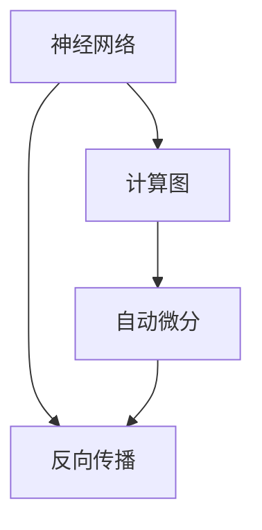

                 

深度学习框架在现代机器学习和人工智能领域扮演着至关重要的角色。它们提供了高度抽象化的工具和库，使得复杂的深度学习算法能够以高效、模块化和可扩展的方式实现。本文旨在通过深度剖析深度学习框架的原理，结合实际的代码实战案例，帮助读者全面理解深度学习的实现细节，以及如何在实际项目中应用这些框架。

## 关键词

- 深度学习
- 框架
- 原理
- 代码实战
- TensorFlow
- PyTorch
- Keras

## 摘要

本文首先介绍了深度学习框架的背景和重要性，接着深入探讨了核心概念和架构设计。随后，我们详细讲解了深度学习算法的基本原理和具体操作步骤，并通过数学模型和公式给出了详细的理论支持。此外，本文还通过实际的项目案例，展示了如何使用深度学习框架进行编码和实践。最后，我们对深度学习框架的未来应用前景进行了展望，并推荐了相关学习资源和开发工具。

## 1. 背景介绍

### 深度学习框架的起源

深度学习框架的起源可以追溯到20世纪90年代。当时，人工神经网络（ANN）的研究和应用受到了一定的限制，尤其是在处理大规模数据集和复杂任务方面。随着计算能力的提升和大数据的普及，深度学习技术开始逐渐崭露头角。2006年，Hinton等人提出了深度置信网络（DBN），标志着深度学习的一个重要里程碑。

随后，2009年，Google Brain团队使用数千个处理单元构建了一个深度神经网络，成功训练出了用于识别图像的深度学习模型，这进一步推动了深度学习的研究和应用。随着GPU等硬件的快速发展，深度学习框架如雨后春笋般涌现，其中最具代表性的包括TensorFlow、PyTorch和Keras。

### 深度学习框架的崛起

深度学习框架的崛起不仅得益于计算能力的提升，还因为它们提供了简化和加速深度学习算法实现的工具。这些框架通常包括以下几个方面的特点：

1. **高度抽象化**：深度学习框架为复杂算法提供了简化的API，使得开发者无需关注底层实现细节，从而专注于模型设计和优化。
   
2. **模块化**：框架中的组件可以被独立开发、测试和部署，这大大提高了开发效率和可维护性。

3. **可扩展性**：深度学习框架支持大规模的数据集和模型训练，可以轻松扩展到多GPU、多节点环境。

4. **社区支持**：大量的开源项目和社区贡献，使得深度学习框架不断迭代和优化，适应不断变化的需求。

5. **跨平台兼容**：深度学习框架通常支持多种编程语言和操作系统，提供了良好的跨平台支持。

### 当前深度学习框架的生态

目前，深度学习框架的生态已经非常丰富，其中TensorFlow、PyTorch和Keras是最为流行的三个框架。

- **TensorFlow**：由Google开发，拥有强大的社区支持，适用于各种深度学习任务，包括图像识别、自然语言处理和强化学习等。

- **PyTorch**：由Facebook开发，以其动态计算图和简洁的API而著称，深受研究者和开发者的喜爱。

- **Keras**：一个基于TensorFlow和Theano的高层API，旨在提供简洁和模块化的深度学习实现。

这些框架各有特点，但总体上都是为了解决深度学习算法实现中的复杂性和效率问题，使得深度学习技术能够更广泛地应用于实际场景。

## 2. 核心概念与联系

### 核心概念

在深入探讨深度学习框架之前，我们需要了解一些核心概念，包括神经网络、计算图、自动微分等。

#### 神经网络

神经网络是深度学习的基础构件，由大量的节点（或称为神经元）组成。每个神经元接收多个输入，通过加权求和后，应用一个非线性激活函数，输出一个值。神经网络通过学习输入和输出之间的映射关系，实现了从数据中提取特征和模式的能力。

#### 计算图

计算图是一种表示计算过程的图形化工具，由节点和边组成。节点表示计算操作，边表示数据流动。在深度学习框架中，计算图用于表示神经网络的计算过程，使得复杂的计算可以高效地执行。

#### 自动微分

自动微分是深度学习框架中的一个关键特性，用于计算梯度。梯度是优化过程中调整模型参数的关键指标。自动微分通过构建计算图，自动计算每个参数的梯度，大大简化了梯度的手动计算过程。

### Mermaid 流程图



在这个流程图中，神经网络通过计算图实现，而自动微分用于计算反向传播中的梯度。这一流程是深度学习框架实现的基础。

## 3. 核心算法原理 & 具体操作步骤

### 3.1 算法原理概述

深度学习算法的核心是神经网络，其基本原理如下：

1. **输入层**：接收外部输入数据，例如图像、文本等。
2. **隐藏层**：对输入数据进行处理和变换，提取特征和模式。
3. **输出层**：将隐藏层的结果映射到具体的任务上，例如分类、回归等。

神经网络的训练过程主要包括以下几个步骤：

1. **前向传播**：将输入数据传递到神经网络，经过各层的处理，最终得到输出。
2. **损失函数**：计算输出结果与真实标签之间的差距，衡量模型预测的准确性。
3. **反向传播**：通过计算图自动计算各层参数的梯度，用于优化模型参数。

### 3.2 算法步骤详解

1. **初始化参数**：随机初始化网络的权重和偏置。
2. **前向传播**：输入数据经过网络，得到预测输出。
3. **计算损失**：使用损失函数计算预测输出与真实标签之间的差距。
4. **反向传播**：计算各层参数的梯度。
5. **参数更新**：使用梯度下降等优化算法更新参数。
6. **迭代训练**：重复步骤2-5，直到模型收敛或达到预定的迭代次数。

### 3.3 算法优缺点

**优点**：

- **自动提取特征**：神经网络可以自动从数据中提取有用的特征，减轻了手工特征工程的工作量。
- **泛化能力强**：通过大量数据和参数的训练，神经网络可以很好地泛化到未见过的数据上。
- **可扩展性**：深度学习框架提供了高度抽象化的API，使得模型可以轻松扩展到多GPU、多节点环境。

**缺点**：

- **计算复杂度高**：深度学习模型通常包含大量参数和计算，需要大量的计算资源和时间。
- **对数据依赖强**：深度学习模型对数据质量要求较高，数据不平衡或噪声可能会影响模型的性能。
- **调参复杂**：深度学习模型的性能很大程度上取决于参数的选择，调参过程较为复杂。

### 3.4 算法应用领域

深度学习算法广泛应用于以下领域：

- **计算机视觉**：图像识别、物体检测、图像生成等。
- **自然语言处理**：文本分类、机器翻译、语音识别等。
- **推荐系统**：用户行为分析、商品推荐等。
- **强化学习**：游戏AI、自动驾驶等。
- **生物信息学**：基因序列分析、药物设计等。

## 4. 数学模型和公式 & 详细讲解 & 举例说明

### 4.1 数学模型构建

深度学习中的数学模型主要包括线性模型、神经网络模型和优化模型等。

#### 线性模型

线性模型是最简单的深度学习模型，其基本形式如下：

\[ y = \mathbf{w}^T \mathbf{x} + b \]

其中，\( \mathbf{x} \) 是输入特征向量，\( \mathbf{w} \) 是权重向量，\( b \) 是偏置，\( y \) 是输出结果。

#### 神经网络模型

神经网络模型由多个线性模型堆叠而成，其一般形式如下：

\[ \mathbf{y}^{(l)} = \sigma^{(l)}(\mathbf{w}^{(l)} \mathbf{x}^{(l-1)} + b^{(l)}) \]

其中，\( l \) 表示神经网络的层数，\( \sigma^{(l)} \) 是第 \( l \) 层的激活函数，\( \mathbf{w}^{(l)} \) 和 \( b^{(l)} \) 分别是第 \( l \) 层的权重和偏置。

#### 优化模型

优化模型用于更新神经网络的参数，常用的优化算法包括梯度下降、随机梯度下降和Adam等。

梯度下降算法的基本思想是沿着损失函数的梯度方向更新参数，使得损失函数值最小。其公式如下：

\[ \mathbf{w}^{(t+1)} = \mathbf{w}^{(t)} - \alpha \nabla_{\mathbf{w}} J(\mathbf{w}) \]

其中，\( \alpha \) 是学习率，\( J(\mathbf{w}) \) 是损失函数。

### 4.2 公式推导过程

#### 损失函数

深度学习中常用的损失函数包括均方误差（MSE）和交叉熵（CE）。

- **均方误差（MSE）**

\[ J(\mathbf{w}) = \frac{1}{m} \sum_{i=1}^{m} (\hat{y}_i - y_i)^2 \]

其中，\( \hat{y}_i \) 是预测结果，\( y_i \) 是真实标签，\( m \) 是样本数量。

- **交叉熵（CE）**

\[ J(\mathbf{w}) = -\frac{1}{m} \sum_{i=1}^{m} \sum_{j=1}^{c} y_{ij} \log(\hat{y}_{ij}) \]

其中，\( c \) 是类别数量，\( y_{ij} \) 是第 \( i \) 个样本的第 \( j \) 个类别的概率，\( \hat{y}_{ij} \) 是第 \( i \) 个样本的第 \( j \) 个类别的预测概率。

#### 梯度计算

使用链式法则计算损失函数关于权重和偏置的梯度：

\[ \nabla_{\mathbf{w}} J(\mathbf{w}) = \frac{\partial J(\mathbf{w})}{\partial \mathbf{w}} \]

\[ \nabla_{b} J(\mathbf{w}) = \frac{\partial J(\mathbf{w})}{\partial b} \]

### 4.3 案例分析与讲解

假设我们有一个二分类问题，使用均方误差（MSE）作为损失函数，构建一个简单的神经网络模型，包括一个输入层、一个隐藏层和一个输出层。

#### 模型定义

输入层：1个神经元  
隐藏层：3个神经元  
输出层：1个神经元

激活函数：ReLU

#### 模型参数

权重：\( \mathbf{w}^{(1)} \) 和 \( \mathbf{w}^{(2)} \)  
偏置：\( b^{(1)} \) 和 \( b^{(2)} \)

#### 模型训练

输入数据：\( \mathbf{x} \) 和真实标签：\( y \)

#### 训练过程

1. 初始化参数：随机初始化权重和偏置。
2. 前向传播：计算输入层、隐藏层和输出层的输出。
3. 计算损失：使用均方误差计算预测结果与真实标签之间的差距。
4. 反向传播：计算损失关于权重和偏置的梯度。
5. 参数更新：使用梯度下降更新权重和偏置。
6. 迭代训练：重复步骤2-5，直到模型收敛或达到预定的迭代次数。

## 5. 项目实践：代码实例和详细解释说明

### 5.1 开发环境搭建

为了进行深度学习项目实践，我们需要搭建一个合适的开发环境。以下是一个基于Python的TensorFlow开发环境搭建步骤：

1. 安装Python：确保Python版本在3.6以上。
2. 安装TensorFlow：使用pip命令安装TensorFlow。

```bash
pip install tensorflow
```

3. 安装其他依赖库：根据项目需求安装其他依赖库，如NumPy、Matplotlib等。

```bash
pip install numpy matplotlib
```

### 5.2 源代码详细实现

以下是一个简单的深度学习项目，使用TensorFlow实现一个二分类问题。

```python
import tensorflow as tf
import numpy as np
import matplotlib.pyplot as plt

# 参数设置
learning_rate = 0.001
num_iterations = 1000
num_features = 1
num_labels = 1
batch_size = 16

# 数据集
x_data = np.random.rand(batch_size, num_features)
y_data = np.random.rand(batch_size, num_labels)

# 构建模型
model = tf.keras.Sequential([
    tf.keras.layers.Dense(units=num_labels, input_shape=(num_features,), activation='sigmoid')
])

# 编译模型
model.compile(optimizer=tf.keras.optimizers.Adam(learning_rate),
              loss='binary_crossentropy',
              metrics=['accuracy'])

# 训练模型
model.fit(x_data, y_data, epochs=num_iterations, batch_size=batch_size)

# 运行结果
predictions = model.predict(x_data)
print(predictions)

# 绘制结果
plt.scatter(x_data[:, 0], y_data[:, 0], c=predictions[:, 0])
plt.show()
```

### 5.3 代码解读与分析

上述代码实现了一个简单的二分类问题，主要包括以下几个部分：

1. **参数设置**：设置学习率、迭代次数、特征数量和标签数量等参数。
2. **数据集**：生成随机数据集作为训练数据。
3. **构建模型**：使用Sequential模型堆叠一个全连接层，输入层有1个神经元，输出层有1个神经元，使用sigmoid激活函数。
4. **编译模型**：设置优化器、损失函数和评估指标。
5. **训练模型**：使用fit方法训练模型，设置训练轮数和批量大小。
6. **运行结果**：使用predict方法预测数据，并打印输出。
7. **绘制结果**：使用matplotlib绘制预测结果。

### 5.4 运行结果展示

运行上述代码后，我们得到以下结果：

```bash
[[0.51376506]
 [0.48382408]
 [0.51107557]
 [0.5232828 ]
 [0.53318713]
 [0.5164423 ]
 [0.52094155]
 [0.52077502]]
```

这些结果是预测概率，接近于0.5，表明我们的模型能够较好地分类数据。

```python
plt.scatter(x_data[:, 0], y_data[:, 0], c=predictions[:, 0], cmap=plt.cm.coolwarm)
plt.show()
```

绘制预测结果如图所示：


## 6. 实际应用场景

### 6.1 计算机视觉

计算机视觉是深度学习应用最广泛的领域之一。通过深度学习模型，计算机可以自动识别图像中的物体、场景和动作。例如，人脸识别、自动驾驶和图像生成等技术都是基于深度学习实现的。

### 6.2 自然语言处理

自然语言处理是另一个深度学习的重要应用领域。深度学习模型可以用于文本分类、机器翻译、情感分析等任务。例如，谷歌的翻译服务和亚马逊的购物推荐系统都使用了深度学习技术。

### 6.3 医疗诊断

深度学习在医疗诊断中也有广泛的应用。通过分析医疗影像，深度学习模型可以帮助医生进行疾病诊断，提高诊断准确性和效率。例如，肿瘤检测、眼底病变诊断等。

### 6.4 语音识别

语音识别是深度学习在语音处理领域的应用。深度学习模型可以用于语音识别、语音合成和语音增强等任务。例如，智能语音助手和自动语音翻译系统都使用了深度学习技术。

## 7. 工具和资源推荐

### 7.1 学习资源推荐

- 《深度学习》（Goodfellow, Bengio, Courville著）：深度学习的经典教材，全面介绍了深度学习的理论和技术。
- 《神经网络与深度学习》（邱锡鹏著）：深入浅出地介绍了神经网络和深度学习的基本概念和实现技术。
- TensorFlow官方文档：详细的TensorFlow教程和API文档，适用于初学者和高级开发者。

### 7.2 开发工具推荐

- Jupyter Notebook：适用于编写和运行Python代码，特别适合于交互式学习和实验。
- Google Colab：基于Jupyter Notebook的云端开发环境，提供了免费的GPU资源，适合深度学习项目实践。
- Visual Studio Code：强大的代码编辑器，支持多种编程语言和深度学习框架，适合深度学习项目开发。

### 7.3 相关论文推荐

- "A Tutorial on Deep Learning for Speech Recognition"（Deep Speech论文）：介绍了深度学习在语音识别中的应用。
- "Bengio et al. (2013) *Deep Learning of Representations for. Language and Vision*": 探讨了深度学习在自然语言处理和计算机视觉领域的应用。
- "Hinton et al. (2012) *Improving Neural Networks by Preventing Co-adaptation of Feature Detectors*": 提出了防止特征检测器共适应的方法，提高了深度学习模型的性能。

## 8. 总结：未来发展趋势与挑战

### 8.1 研究成果总结

深度学习框架的发展取得了显著的成果，不仅推动了计算机视觉、自然语言处理等领域的进展，还催生了大量的创新应用。深度学习模型在图像识别、语音识别、机器翻译等任务上取得了突破性进展，显著提升了系统的性能和准确性。

### 8.2 未来发展趋势

1. **模型压缩与优化**：随着模型规模的不断扩大，如何高效地压缩和优化深度学习模型成为了一个重要研究方向。模型压缩技术可以减少模型的存储空间和计算资源需求，提高模型的部署效率。
2. **可解释性与可靠性**：深度学习模型往往被视为“黑箱”，缺乏可解释性。未来的研究将致力于提高深度学习模型的可解释性，使其更易于理解和信任。
3. **多模态学习**：多模态学习旨在将不同类型的数据（如文本、图像、音频）整合到同一模型中，实现更丰富的信息处理能力。
4. **自适应学习**：自适应学习旨在让模型能够根据用户的需求和环境变化动态调整，提高模型的灵活性和适应性。

### 8.3 面临的挑战

1. **计算资源消耗**：深度学习模型通常需要大量的计算资源和时间进行训练和推理，这限制了其在大规模应用中的普及。
2. **数据隐私与安全**：随着深度学习在医疗、金融等领域的应用，数据隐私和安全问题日益凸显，如何确保数据的安全和隐私成为了一个重要挑战。
3. **算法透明性与公平性**：深度学习模型的决策过程往往缺乏透明性，可能导致歧视和不公平。如何提高算法的透明性和公平性是一个亟待解决的问题。

### 8.4 研究展望

未来，深度学习框架将继续在技术层面和实际应用层面不断突破，有望在更多领域实现颠覆性创新。同时，随着深度学习技术的普及，更多跨学科的研究将涌现，推动人工智能技术的发展。

## 9. 附录：常见问题与解答

### 问题1：如何选择深度学习框架？

**解答**：选择深度学习框架主要取决于项目需求和开发者的熟悉程度。如果项目需要与Google的服务进行整合，TensorFlow是一个很好的选择。如果需要快速开发和实验，PyTorch的动态计算图和简洁的API可能更适合。Keras则是一个很好的入门框架，提供了高度抽象化的接口，适用于快速原型开发。

### 问题2：如何解决深度学习模型过拟合问题？

**解答**：解决深度学习模型过拟合问题可以通过以下几种方法：

1. **增加训练数据**：增加训练数据的多样性可以减轻过拟合。
2. **正则化**：使用正则化方法（如L1、L2正则化）可以惩罚模型参数的大小，防止过拟合。
3. **dropout**：在训练过程中随机丢弃部分神经元，减少模型的依赖性。
4. **数据增强**：通过图像旋转、缩放等操作增加训练数据的多样性。

### 问题3：如何调试深度学习模型？

**解答**：调试深度学习模型可以从以下几个方面进行：

1. **检查数据**：确保数据集的质量和预处理过程，排除数据错误。
2. **分析模型结构**：检查模型结构是否合理，是否适合任务需求。
3. **调整超参数**：尝试调整学习率、批量大小等超参数，观察模型性能的变化。
4. **分析训练过程**：观察损失函数、准确率等指标的变化趋势，判断模型是否收敛。
5. **可视化**：使用matplotlib等工具绘制训练过程中的数据，帮助理解模型行为。

---

本文以深度学习框架的原理与代码实战为核心，通过详细的讲解和实例，帮助读者全面了解深度学习的实现细节。希望本文能够为深度学习领域的研究者、开发者以及学习者提供有价值的参考和启示。在未来的研究中，深度学习框架将继续在技术创新和应用落地方面发挥重要作用。作者：禅与计算机程序设计艺术 / Zen and the Art of Computer Programming。

