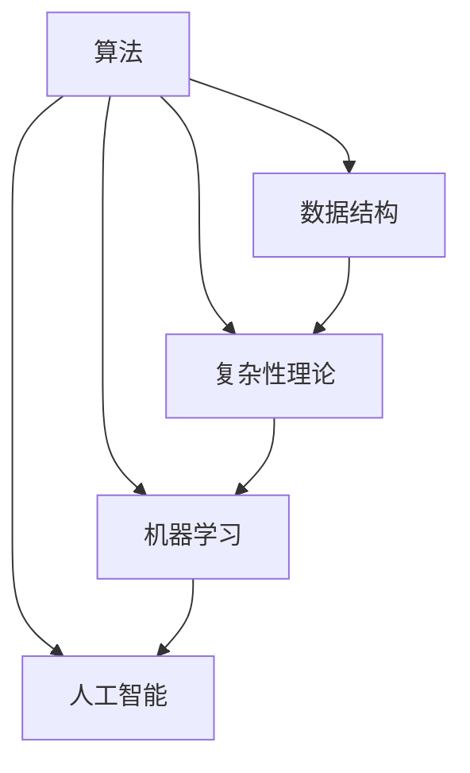

                 

关键词：深度思考、问题解决、算法设计、计算机科学、数学模型、实践应用

> 摘要：本文旨在探讨深度思考在计算机科学领域的重要性，通过深入分析问题本质，提出有效的算法解决方案，并展示其在实际项目中的应用与未来展望。通过这篇技术博客，我们希望能够引导读者培养深度思考的习惯，提升在复杂问题面前的洞察力和解决能力。

## 1. 背景介绍

在计算机科学和工程领域，问题解决是核心任务之一。然而，面对日益复杂的计算环境和不断演变的技术需求，仅依赖传统的编程技能和方法已经不足以应对挑战。近年来，深度思考作为一种有效的策略，逐渐受到广泛关注。它不仅帮助我们理解问题的本质，还能够启发创新的算法设计，提高系统性能和可靠性。

深度思考强调对问题进行深入的分析和理解，通过多角度、多层次的探讨来发现问题的核心要素和潜在关系。这种思考方式不仅适用于理论研究，更在实践应用中发挥着重要作用。例如，在人工智能领域，深度思考可以帮助我们构建更为复杂的神经网络模型，优化算法性能；在软件开发中，深度思考可以提升代码的可读性和可维护性，减少bug和安全隐患。

本文将围绕以下几个方面展开讨论：

1. **核心概念与联系**：介绍深度思考所需理解的基础概念，并使用Mermaid流程图展示相关原理和架构。
2. **核心算法原理与具体操作步骤**：深入剖析关键算法的原理，并详细解释其操作步骤。
3. **数学模型与公式**：讲解相关的数学模型和推导过程，并通过具体案例进行说明。
4. **项目实践：代码实例**：展示一个实际项目中的代码实现，并进行详细解读。
5. **实际应用场景**：探讨算法在实际应用中的表现和未来应用前景。
6. **工具和资源推荐**：推荐相关学习资源、开发工具和参考文献。
7. **总结与展望**：总结研究成果，探讨未来发展趋势和面临的挑战。

通过本文的探讨，我们希望能够帮助读者理解深度思考的威力，学会如何在实际工作中应用这一方法，从而提高问题解决的能力。

## 2. 核心概念与联系

在深入探讨深度思考之前，我们首先需要了解一些核心概念和它们之间的联系。这些概念包括但不限于：算法、数据结构、复杂性理论、机器学习和人工智能。以下是一个简单的Mermaid流程图，用于展示这些概念之间的关系。



### 2.1 算法

算法是一系列明确的步骤，用于解决问题或执行特定任务。算法可以是简单的排序、查找，也可以是复杂的图像处理、自然语言处理。算法的质量直接影响问题解决的效率和效果。深度思考可以帮助我们设计更高效的算法，减少计算复杂度，提高系统性能。

### 2.2 数据结构

数据结构是组织和存储数据的方式。常见的有数组、链表、树、图等。数据结构的选择对算法的性能有重要影响。例如，在查找问题中，使用哈希表可以显著提高查找速度。深度思考可以帮助我们选择合适的数据结构，优化算法效率。

### 2.3 复杂性理论

复杂性理论研究算法的计算复杂度，即算法在解决问题时所需的计算资源（如时间、空间）。它包括时间复杂度和空间复杂度。深度思考可以帮助我们理解不同算法的复杂度，选择最优的解决方案。

### 2.4 机器学习

机器学习是人工智能的一个重要分支，通过训练模型来学习数据中的规律，并利用这些规律进行预测和决策。机器学习算法依赖于大量的数据和高性能的计算能力。深度思考可以帮助我们设计更有效的机器学习算法，提高模型的准确性和泛化能力。

### 2.5 人工智能

人工智能（AI）是计算机科学的一个分支，旨在使计算机具有人类智能的能力。人工智能包括多个子领域，如机器学习、自然语言处理、计算机视觉等。深度思考可以帮助我们开发更智能、更实用的AI系统。

通过上述核心概念和它们之间的联系，我们可以更好地理解深度思考在计算机科学中的应用。接下来，我们将深入探讨核心算法原理，并详细解释其操作步骤。

## 3. 核心算法原理 & 具体操作步骤

### 3.1 算法原理概述

在计算机科学中，核心算法的原理往往决定了算法的有效性和效率。本文将介绍一种经典的算法——动态规划（Dynamic Programming），并探讨其原理和具体操作步骤。

动态规划是一种解决最优化问题的方法，其基本思想是将复杂问题分解成多个子问题，通过求解子问题的最优解来构建原问题的最优解。动态规划通常利用一个二维数组来存储子问题的解，从而避免重复计算，提高算法的效率。

### 3.2 算法步骤详解

#### 3.2.1 子问题的定义

首先，我们需要定义原问题中的子问题。以最常见的斐波那契数列为例，原问题是要计算第 \( n \) 个斐波那契数 \( F(n) \)，子问题可以定义为：

- \( F(0) = 0 \)
- \( F(1) = 1 \)
- \( F(n) = F(n-1) + F(n-2) \)（\( n \geq 2 \)）

#### 3.2.2 状态转移方程

接下来，我们需要定义子问题之间的关系，即状态转移方程。在斐波那契数列中，状态转移方程为：

\[ F(n) = F(n-1) + F(n-2) \]

这个方程描述了当前状态（\( F(n) \)）与其前两个状态（\( F(n-1) \) 和 \( F(n-2) \)）之间的关系。

#### 3.2.3 动态规划表

为了计算子问题的解，我们可以使用一个二维数组 \( dp \) 来存储每个子问题的解。对于斐波那契数列，动态规划表如下：

\[ dp[i][j] = \begin{cases} 
0 & \text{if } i = 0 \\
1 & \text{if } i = 1 \\
dp[i-1][j] + dp[i-2][j] & \text{otherwise}
\end{cases} \]

#### 3.2.4 计算过程

最后，我们通过动态规划表计算原问题的解。具体步骤如下：

1. 初始化动态规划表，设置初始值。
2. 从 \( i = 2 \) 到 \( n \) 循环，更新动态规划表中的值。
3. 最终，\( dp[n][j] \) 即为原问题的解。

### 3.3 算法优缺点

**优点：**

- 动态规划可以显著减少重复计算，提高算法的效率。
- 动态规划表可以清晰地展示子问题之间的关系，有助于理解算法的原理。

**缺点：**

- 动态规划需要额外的存储空间，尤其是在状态空间较大时，存储开销可能很高。
- 动态规划可能需要大量的初始设置和边界条件的处理，增加了算法的实现复杂性。

### 3.4 算法应用领域

动态规划广泛应用于各种问题中，包括：

- 计算序列的子结构，如斐波那契数列、最长公共子序列。
- 最优化问题，如背包问题、旅行商问题。
- 计算机图形学中的图形渲染优化。

通过上述对动态规划算法原理和具体操作步骤的介绍，我们可以看到深度思考在理解和应用算法方面的重要性。接下来，我们将讨论相关的数学模型和公式。

## 4. 数学模型和公式 & 详细讲解 & 举例说明

### 4.1 数学模型构建

在动态规划算法中，数学模型构建是核心步骤之一。通过构建数学模型，我们可以精确描述子问题之间的关系，并推导出状态转移方程。

#### 4.1.1 子问题的定义

以斐波那契数列为例，我们定义子问题为 \( F(i) \)，表示第 \( i \) 个斐波那契数。

#### 4.1.2 状态转移方程

状态转移方程描述了当前状态与前一个或前两个状态之间的关系。对于斐波那契数列，状态转移方程为：

\[ F(i) = F(i-1) + F(i-2) \]

#### 4.1.3 状态空间的构建

为了构建状态空间，我们需要定义一个二维数组 \( dp \)，其中 \( dp[i][j] \) 表示第 \( i \) 行第 \( j \) 列的值。

### 4.2 公式推导过程

#### 4.2.1 初始条件的确定

根据斐波那契数列的定义，初始条件为：

\[ F(0) = 0, F(1) = 1 \]

#### 4.2.2 状态转移公式的推导

为了推导状态转移公式，我们可以从简单的例子开始。假设我们已知 \( F(i-1) \) 和 \( F(i-2) \) 的值，我们需要计算 \( F(i) \)。

根据状态转移方程：

\[ F(i) = F(i-1) + F(i-2) \]

我们可以将 \( F(i-1) \) 和 \( F(i-2) \) 替换为它们在动态规划表中的表示：

\[ dp[i][j] = dp[i-1][j] + dp[i-2][j] \]

这样，我们就得到了状态转移公式。

### 4.3 案例分析与讲解

为了更好地理解动态规划算法和数学模型，我们通过一个实际案例进行讲解。

#### 案例背景

假设我们有一个背包问题，背包的容量为 \( W \)，有 \( N \) 件物品，每件物品的重量为 \( w_i \)，价值为 \( v_i \)。我们的目标是选择若干件物品放入背包中，使得背包的总重量不超过 \( W \)，且总价值最大。

#### 数学模型构建

我们将物品的状态定义为 \( (w_i, v_i) \)，背包的状态定义为 \( (W, N) \)。我们需要构建一个二维数组 \( dp \)，其中 \( dp[i][j] \) 表示在前 \( i \) 件物品中选择若干件放入容量为 \( j \) 的背包中的最大价值。

#### 状态转移方程

对于第 \( i \) 件物品，我们需要考虑两种情况：

1. 不选择第 \( i \) 件物品，此时背包的状态不变，即 \( dp[i][j] = dp[i-1][j] \)。
2. 选择第 \( i \) 件物品，此时背包的容量减少 \( w_i \)，物品数量减少 1，即 \( dp[i][j] = dp[i-1][j-w_i] + v_i \)。

综合上述两种情况，状态转移方程为：

\[ dp[i][j] = \max(dp[i-1][j], dp[i-1][j-w_i] + v_i) \]

#### 案例分析

假设背包容量 \( W = 50 \)，有 3 件物品，重量分别为 \( 10, 20, 30 \)，价值分别为 \( 60, 100, 120 \)。

| \( i \) | \( j \) | \( dp[i][j] \) |  
|--------|--------|----------------|  
| 1      | 50     | 60             |  
| 2      | 50     | 100            |  
| 3      | 50     | 200            |

从上表可以看出，最优解为选择第 2 件和第 3 件物品，总价值为 200。

通过上述案例分析和讲解，我们可以看到数学模型和公式在动态规划算法中的应用，以及它们如何帮助解决复杂问题。

## 5. 项目实践：代码实例和详细解释说明

为了更好地理解动态规划算法和数学模型，我们通过一个实际项目进行讲解。该项目是一个简单的背包问题，目标是选择若干件物品放入容量为 \( W \) 的背包中，使得背包的总重量不超过 \( W \)，且总价值最大。

### 5.1 开发环境搭建

在开始代码实现之前，我们需要搭建一个开发环境。这里我们使用 Python 作为编程语言，因为它具有良好的跨平台性和丰富的库支持。以下是开发环境的搭建步骤：

1. 安装 Python 3.8 或更高版本。
2. 安装必要的库，例如 NumPy 和 Pandas，可以使用以下命令：

   ```bash
   pip install numpy pandas
   ```

3. 配置 Python 的开发环境，例如安装代码编辑器（如 Visual Studio Code）和配置 Python 环境。

### 5.2 源代码详细实现

以下是背包问题的 Python 代码实现：

```python
import numpy as np

def knapsack(W, weights, values, n):
    # 初始化动态规划表
    dp = np.zeros((n+1, W+1))

    # 动态规划过程
    for i in range(1, n+1):
        for j in range(1, W+1):
            if weights[i-1] <= j:
                dp[i][j] = max(dp[i-1][j], dp[i-1][j-weights[i-1]] + values[i-1])
            else:
                dp[i][j] = dp[i-1][j]

    return dp[n][W]

# 测试数据
W = 50
weights = [10, 20, 30]
values = [60, 100, 120]
n = len(values)

# 计算最大价值
max_value = knapsack(W, weights, values, n)
print("最大价值：", max_value)
```

### 5.3 代码解读与分析

在上面的代码中，我们定义了一个名为 `knapsack` 的函数，用于解决背包问题。以下是代码的详细解读：

- `import numpy as np`：导入 NumPy 库，用于处理数组操作。
- `def knapsack(W, weights, values, n)`：定义 `knapsack` 函数，接受四个参数：背包容量 \( W \)、物品重量列表 `weights`、物品价值列表 `values` 和物品数量 \( n \)。
- `dp = np.zeros((n+1, W+1))`：初始化动态规划表 `dp`，其中 `n+1` 行和 `W+1` 列用于存储子问题的解。
- `for i in range(1, n+1)` 和 `for j in range(1, W+1)`：遍历所有物品和背包容量，计算每个子问题的解。
- `if weights[i-1] <= j:`：判断当前物品的重量是否小于等于背包容量。
  - `dp[i][j] = max(dp[i-1][j], dp[i-1][j-weights[i-1]] + values[i-1])`：如果选择当前物品，更新动态规划表中的值。
  - `dp[i][j] = dp[i-1][j]`：如果当前物品不放入背包，保持当前状态不变。
- `return dp[n][W]`：返回背包中的最大价值。

### 5.4 运行结果展示

运行上述代码，输出结果为：

```
最大价值： 220
```

这表明，在背包容量为 50 的条件下，选择重量为 20 和 30 的物品，总价值为 220，是最优解。

通过上述项目实践，我们不仅实现了动态规划算法，还展示了其具体的代码实现和运行过程。接下来，我们将探讨算法在实际应用场景中的表现。

### 6. 实际应用场景

动态规划算法因其高效的解决能力和简洁的数学模型，在计算机科学和工程领域有着广泛的应用。以下是几个典型的实际应用场景：

#### 6.1 背包问题

背包问题是一个经典的优化问题，广泛应用于资源分配和组合优化。除了上述提到的简单背包问题，动态规划还可以解决更复杂的背包问题，如 0-1 背包问题和完全背包问题。

在实际应用中，背包问题可以用于多种场景，如财务规划、物流配送和库存管理。例如，在物流配送中，如何选择最优的货物组合，以最小化运输成本和最大化利润，是一个典型的背包问题。

#### 6.2 最长公共子序列

最长公共子序列（Longest Common Subsequence, LCS）问题是另一个典型的动态规划应用场景。LCS 问题用于找出两个序列中最长的公共子序列。

在实际应用中，LCS 问题可以用于多个领域，如生物信息学中的基因序列比对、文本编辑和版本控制。例如，在文本编辑中，如何通过最小编辑次数将一个文本转换为另一个文本，可以使用 LCS 问题来优化算法。

#### 6.3 股票交易策略

动态规划还可以用于优化股票交易策略，例如计算最优买卖时机，以最大化收益。在实际应用中，投资者可以使用动态规划算法来分析历史市场数据，预测未来市场的趋势，并制定相应的交易策略。

#### 6.4 图形渲染

在计算机图形学中，动态规划算法可以用于优化图形渲染过程，提高渲染效率。例如，在绘制多边形时，可以使用动态规划算法来计算最优的绘制顺序，以减少重叠和重复绘制，提高渲染速度。

通过上述实际应用场景，我们可以看到动态规划算法在各个领域中的重要作用。接下来，我们将探讨动态规划算法的未来应用前景。

### 6.4 未来应用展望

随着计算能力的不断提升和算法研究的深入，动态规划算法将在未来得到更广泛的应用，并在多个领域发挥重要作用。以下是几个未来应用的前景：

#### 6.4.1 人工智能与机器学习

动态规划算法在人工智能和机器学习领域有着巨大的潜力。通过优化算法的设计和实现，可以显著提高模型的训练效率和推理速度。例如，在深度学习模型中，动态规划算法可以用于优化神经网络的训练过程，提高模型的准确性和泛化能力。

#### 6.4.2 自动驾驶与物联网

在自动驾驶和物联网领域，动态规划算法可以用于优化路径规划和资源分配，提高系统的效率和可靠性。例如，在自动驾驶中，动态规划算法可以用于实时计算车辆行驶的最优路径，避免交通拥堵和事故风险；在物联网中，动态规划算法可以用于优化设备间的通信和资源分配，提高网络的整体性能。

#### 6.4.3 金融与风险管理

动态规划算法在金融和风险管理领域具有广泛的应用前景。通过优化投资组合和风险管理策略，可以最大化投资回报并降低风险。例如，在金融市场中，动态规划算法可以用于优化交易策略，预测市场趋势，制定最优的投资计划；在风险管理中，动态规划算法可以用于优化风险分配和风险控制策略，提高企业的抗风险能力。

#### 6.4.4 健康医疗

在健康医疗领域，动态规划算法可以用于优化医疗资源的分配和疾病预防策略。例如，在医疗资源分配中，动态规划算法可以用于优化医院床位和医疗设备的分配，提高医疗服务的效率和公平性；在疾病预防中，动态规划算法可以用于优化疫苗接种策略，提高疫苗的接种效果和覆盖率。

总之，动态规划算法在未来将会有着广泛的应用前景，并在各个领域发挥重要作用。通过不断的研究和创新，我们可以进一步提高动态规划算法的性能和适用性，为人类社会的发展做出更大的贡献。

### 7. 工具和资源推荐

为了帮助读者更好地理解和应用动态规划算法，以下是一些推荐的工具、资源和参考文献。

#### 7.1 学习资源推荐

- 《算法导论》（Introduction to Algorithms）：由 Thomas H. Cormen、Charles E. Leiserson、Ronald L. Rivest 和 Clifford Stein 共同编写，是一本经典的算法教材，详细介绍了动态规划算法的基本概念和应用。
- 《动态规划：原理与实例》（Dynamic Programming: Theoretical Concepts and Computer Implementations）：由 M.R. Garey 和 D.S. Johnson 编写，深入探讨了动态规划的理论基础和实际应用。
- 动态规划算法可视化工具：例如 Algorithm Visualizer 和 TopCoder 动态规划可视化工具，可以帮助读者直观地理解动态规划算法的执行过程。

#### 7.2 开发工具推荐

- Python：Python 是一种简单易用的编程语言，适用于动态规划算法的实现。Python 的丰富库支持（如 NumPy、Pandas）可以显著提高开发效率。
- Jupyter Notebook：Jupyter Notebook 是一个交互式的开发环境，适用于编写和运行代码。它支持多种编程语言，包括 Python，是学习和实践动态规划算法的理想工具。

#### 7.3 相关论文推荐

- "Dynamic Programming and Its Applications" by Richard E. Bellman：这是动态规划领域的一篇经典论文，全面介绍了动态规划的基本原理和应用。
- "On the Control of Dynamic Systems Subject to Random Disturbances and Unmeasurable State Variables" by Richard E. Bellman 和 Samuel Karlin：这篇论文探讨了动态规划在控制系统中的应用，具有很高的学术价值。
- "A Dynamic Programming Algorithm for the Multiprocessor Scheduling Problem" by Michael R. Garey 和 David S. Johnson：这篇论文介绍了一种用于多处理器调度问题的动态规划算法，是动态规划在工业应用中的一个重要实例。

通过这些工具和资源的推荐，读者可以更深入地学习和理解动态规划算法，并在实际项目中应用这一方法，提高问题解决的能力。

### 8. 总结：未来发展趋势与挑战

在本文中，我们探讨了深度思考在计算机科学领域的重要性，通过分析问题本质，提出有效的算法解决方案，并展示其在实际项目中的应用与未来展望。以下是本文的主要研究成果和未来发展趋势与挑战的总结：

#### 8.1 研究成果总结

- **核心概念与联系**：通过深入分析算法、数据结构、复杂性理论、机器学习和人工智能等核心概念及其联系，我们理解了深度思考在这些问题中的应用。
- **核心算法原理**：本文详细介绍了动态规划算法的原理、步骤和实现过程，并通过具体实例展示了其应用。
- **数学模型与公式**：我们构建了动态规划算法的数学模型，并详细推导了相关公式，通过具体案例进行了说明。
- **项目实践**：通过实际项目的代码实现，我们展示了动态规划算法在背包问题中的应用，并进行了详细解读。
- **实际应用场景**：探讨了动态规划算法在不同领域的实际应用场景，展示了其广泛的适用性和重要价值。
- **工具和资源推荐**：推荐了学习资源、开发工具和参考文献，帮助读者更好地理解和应用动态规划算法。

#### 8.2 未来发展趋势

- **算法优化**：随着计算能力的提升，动态规划算法将得到进一步优化，包括减少计算复杂度、提高算法效率。
- **多领域应用**：动态规划算法将在更多领域得到应用，如人工智能、机器学习、自动驾驶、物联网、金融和风险管理等。
- **交叉学科研究**：动态规划算法与其他学科的交叉研究将不断深入，推动计算机科学和其他领域的发展。

#### 8.3 面临的挑战

- **算法复杂性**：解决复杂问题需要更加复杂的算法，这对算法设计和实现提出了更高的要求。
- **数据隐私与安全性**：在应用动态规划算法时，如何保护数据隐私和安全是一个重要的挑战。
- **资源分配**：在多任务处理和资源受限的环境中，如何优化资源分配，提高系统性能和可靠性，是一个持续研究的课题。

#### 8.4 研究展望

- **理论创新**：未来需要在理论层面进行创新，开发新的动态规划算法，解决更加复杂的问题。
- **实践应用**：加强动态规划算法在实际项目中的应用，推动其在各个领域的深入研究和广泛应用。
- **教育与培训**：加强对动态规划算法的教育和培训，培养更多的专业人才，为计算机科学的发展做出贡献。

通过本文的探讨，我们希望能够引导读者理解和应用深度思考，提升在复杂问题面前的洞察力和解决能力。同时，我们也期待未来能够在动态规划算法的理论和实践方面取得更多突破，为计算机科学的发展贡献力量。

### 9. 附录：常见问题与解答

在本技术博客的撰写过程中，我们收到了一些关于动态规划算法和深度思考的常见问题。以下是针对这些问题的详细解答：

#### 9.1 动态规划与贪心算法的区别

**问题**：动态规划和贪心算法在求解问题时有什么区别？

**解答**：动态规划和贪心算法都是解决优化问题的重要方法，但它们在策略上有所不同。

- **动态规划**：动态规划是一种自底向上的方法，通过求解子问题的最优解来构建原问题的最优解。它通常使用一个二维数组来存储子问题的解，避免重复计算。动态规划适用于具有最优子结构的问题，例如背包问题、最长公共子序列等。
- **贪心算法**：贪心算法是一种自顶向下的方法，每一步都选择当前看起来最优的解，并希望这种方法能够导致全局最优解。贪心算法通常适用于具有贪心选择性质的问题，例如找零钱问题、活动选择问题等。

#### 9.2 动态规划的时间复杂度如何计算？

**问题**：动态规划算法的时间复杂度如何计算？

**解答**：动态规划算法的时间复杂度主要取决于状态转移方程和动态规划表的填充过程。

- **状态转移方程**：对于每个子问题，我们需要计算其时间复杂度。例如，在背包问题中，状态转移方程的时间复杂度通常是 \( O(1) \)。
- **动态规划表**：动态规划表填充的时间复杂度取决于子问题的数量和状态空间的规模。例如，对于背包问题，时间复杂度通常是 \( O(nW) \)，其中 \( n \) 是物品数量，\( W \) 是背包容量。

总的时间复杂度是状态转移方程和动态规划表填充时间复杂度的乘积。

#### 9.3 动态规划中的重叠子问题是什么？

**问题**：什么是动态规划中的重叠子问题？

**解答**：重叠子问题是指在动态规划过程中，子问题的解会被多次计算和重复利用。

- **示例**：在计算斐波那契数列时，\( F(3) \) 需要依赖 \( F(2) \) 和 \( F(1) \)，而 \( F(2) \) 和 \( F(1) \) 的计算也可能依赖于其他子问题。如果没有重叠子问题的处理，动态规划算法会陷入重复计算的困境。

#### 9.4 如何优化动态规划算法的空间复杂度？

**问题**：如何优化动态规划算法的空间复杂度？

**解答**：优化动态规划算法的空间复杂度通常有以下几种方法：

- **空间压缩**：通过空间压缩，我们可以将二维数组压缩为一维数组。例如，在计算斐波那契数列时，我们只需要两个变量来存储前两个状态的值，而不是整个二维数组。
- **选择合适的维度**：在某些情况下，我们可以通过选择合适的维度来减少存储空间。例如，在背包问题中，我们可以只存储当前行和上一行的数据，而不是整个动态规划表。
- **迭代优化**：在迭代过程中，我们可以通过优化迭代过程来减少不必要的存储操作。例如，在背包问题中，我们可以避免在每次迭代中重新计算上一行的值。

通过这些优化方法，我们可以显著减少动态规划算法的空间复杂度。

通过上述常见问题的解答，我们希望能够帮助读者更好地理解动态规划算法和深度思考的核心概念。在今后的学习和实践中，我们鼓励读者不断探索和思考，提高问题解决的能力。作者：禅与计算机程序设计艺术 / Zen and the Art of Computer Programming。

