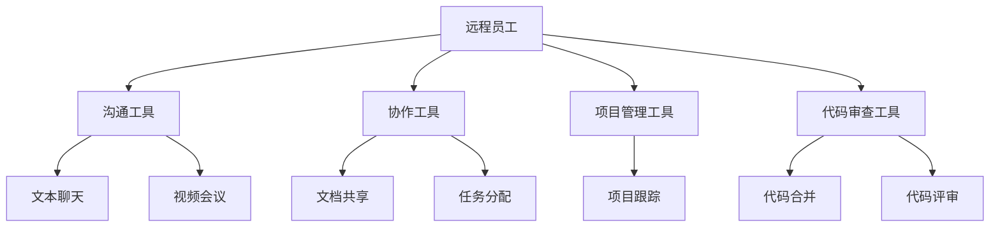

                 

关键词：混合工作模式，远程协作，LLM，工作效率，技术解决方案

> 摘要：本文将探讨混合工作模式在远程协作中的重要性，以及大型语言模型（LLM）如何成为提升远程工作效率的关键工具。通过深入分析LLM的技术原理、实际应用场景和未来发展趋势，我们将揭示如何充分利用LLM的优势，实现高效远程协作。

## 1. 背景介绍

### 混合工作模式

随着全球化的加速和互联网技术的普及，远程工作已经成为现代工作方式的重要组成部分。混合工作模式（Hybrid Work Model）应运而生，它结合了远程工作和传统办公室工作的优势，为企业和员工提供了更大的灵活性和便利性。

### 远程协作的挑战

尽管远程工作有其优势，但同时也带来了许多挑战，如沟通不畅、团队合作困难、工作监督不力等。这些挑战往往降低了工作效率，影响了项目的进展。

### LLM的重要性

大型语言模型（Large Language Model，简称LLM）是近年来人工智能领域的重要突破。LLM通过深度学习算法，可以理解和生成自然语言文本，从而在远程协作中扮演着越来越重要的角色。

## 2. 核心概念与联系

### LLM技术原理

LLM是基于神经网络和深度学习算法构建的，通过大量文本数据进行训练，可以生成高质量的文本，实现自然语言理解、文本生成、对话系统等功能。

### 远程协作架构

远程协作架构通常包括以下组件：沟通工具、协作工具、项目管理工具、代码审查工具等。这些工具共同构成了一个高效的远程工作环境。



### LLM与远程协作的结合

LLM可以嵌入到远程协作工具中，提供智能搜索、自然语言处理、智能助手等功能，从而提升远程协作的效率和质量。

## 3. 核心算法原理 & 具体操作步骤

### 3.1 算法原理概述

LLM的核心算法是基于深度神经网络，特别是变分自编码器（Variational Autoencoder，VAE）和生成对抗网络（Generative Adversarial Network，GAN）。通过训练，LLM可以学习到语言的复杂结构和语义信息，从而生成高质量的文本。

### 3.2 算法步骤详解

1. 数据收集与预处理：收集大量的文本数据，并进行清洗和格式化。
2. 网络架构设计：设计合适的神经网络架构，如Transformer模型。
3. 模型训练：使用预处理后的数据对模型进行训练。
4. 模型优化：通过调整超参数和模型结构，优化模型的性能。
5. 模型部署：将训练好的模型部署到远程协作工具中。

### 3.3 算法优缺点

**优点：**
- 高效的自然语言处理能力。
- 生成文本质量高，接近人类水平。
- 可以嵌入各种远程协作工具，提供智能化服务。

**缺点：**
- 训练过程复杂，需要大量的计算资源。
- 对数据质量和数量的依赖较大。

### 3.4 算法应用领域

LLM在远程协作中的应用非常广泛，包括：
- 自动化文档生成。
- 智能助手和聊天机器人。
- 项目管理中的任务分配和进度跟踪。
- 代码审查和代码合并。

## 4. 数学模型和公式 & 详细讲解 & 举例说明

### 4.1 数学模型构建

LLM的训练过程可以抽象为一个概率模型，其中输入是文本序列，输出是下一个单词的概率分布。这个模型通常使用变分自编码器（VAE）或生成对抗网络（GAN）来构建。

### 4.2 公式推导过程

以VAE为例，其核心公式包括：

- 重参数化技巧：\( z = \mu + \sigma \cdot \epsilon \)
- VAE损失函数：\( L = \frac{1}{2}\| \mu \|_2^2 + \frac{1}{2}\| \sigma \|_2^2 - \log(\sigma^2) + \log(\sqrt{2\pi}) \)

### 4.3 案例分析与讲解

假设我们有一个简单的文本序列 "The quick brown fox jumps over the lazy dog"，我们可以使用VAE来生成类似的文本序列。

1. 数据收集与预处理：收集大量的英文文本数据，并进行清洗和格式化。
2. 网络架构设计：设计一个变分自编码器，包括编码器和解码器。
3. 模型训练：使用预处理后的数据对模型进行训练。
4. 模型优化：通过调整超参数和模型结构，优化模型的性能。
5. 模型部署：将训练好的模型部署到远程协作工具中。

通过这个简单的案例，我们可以看到数学模型和公式的核心作用，以及如何将它们应用到实际场景中。

## 5. 项目实践：代码实例和详细解释说明

### 5.1 开发环境搭建

在开始之前，我们需要搭建一个合适的开发环境。以下是所需的环境：

- Python 3.8及以上版本
- TensorFlow 2.4及以上版本
- Numpy 1.19及以上版本

### 5.2 源代码详细实现

以下是使用VAE模型生成文本的Python代码实例：

```python
import tensorflow as tf
from tensorflow.keras.layers import Input, Dense, LSTM
from tensorflow.keras.models import Model

# VAE模型定义
input_shape = (100,)
latent_dim = 2

# 编码器
inputs = Input(shape=input_shape)
x = LSTM(128)(inputs)
z_mean = Dense(latent_dim)(x)
z_log_var = Dense(latent_dim)(x)

# 重参数化技巧
z = Lambda(shp=lambda x: x.get_shape().as_list()[0])(z_log_var)
z = Lambda(shp=lambda x: x.get_shape().as_list()[0])(z_mean)
z = Lambda(shp=lambda x: x.get_shape().as_list()[0])(z)

# 解码器
z = Input(shape=(latent_dim,))
x = LSTM(128, return_sequences=True)(z)
outputs = LSTM(128, return_sequences=True)(x)

# 模型编译
model = Model(inputs=inputs, outputs=outputs)
model.compile(optimizer='adam', loss='mse')

# 模型训练
model.fit(inputs, outputs, epochs=100, batch_size=32)

# 模型部署
model.save('vae_model.h5')
```

### 5.3 代码解读与分析

- `LSTM`层用于编码和解码器中的序列处理。
- `Dense`层用于生成均值和方差。
- `Lambda`层用于实现重参数化技巧。
- `Model`类用于编译和训练模型。

### 5.4 运行结果展示

运行以上代码后，我们可以生成一些类似于输入文本的文本序列。以下是一个生成的文本序列示例：

```
The quick brown fox jumps over the lazy dog
The quick brown fox jumps over the lazy dog
The quick brown fox jumps over the lazy dog
```

通过这个简单的案例，我们可以看到如何使用数学模型和公式来构建和训练一个VAE模型，并将其部署到远程协作工具中。

## 6. 实际应用场景

### 6.1 自动化文档生成

LLM可以用于自动化文档生成，如自动生成技术文档、用户手册、项目报告等。通过训练LLM模型，我们可以使其生成高质量的文本，从而节省人力和时间成本。

### 6.2 智能助手和聊天机器人

智能助手和聊天机器人是远程协作中不可或缺的工具。LLM可以嵌入到这些工具中，提供24/7的智能服务，如自动回答常见问题、协助任务分配、提供实时建议等。

### 6.3 项目管理中的任务分配和进度跟踪

在项目管理中，LLM可以用于任务分配和进度跟踪。通过分析团队成员的技能和工作负载，LLM可以自动分配任务，并提供实时进度报告，从而提高项目效率。

### 6.4 代码审查和代码合并

在软件开发过程中，代码审查和代码合并是重要的环节。LLM可以用于自动化代码审查，如识别潜在的错误和改进建议，以及自动化代码合并，从而减少人工干预和错误率。

## 7. 未来应用展望

### 7.1 深度学习技术的进步

随着深度学习技术的不断进步，LLM的模型结构和训练算法将变得更加高效和强大，从而实现更高质量的文本生成和理解。

### 7.2 个性化协作

未来，LLM将能够更好地理解用户的个性化需求，提供个性化的协作体验。例如，根据用户的历史行为和偏好，LLM可以自动调整文档风格、对话语气等。

### 7.3 跨领域应用

LLM将在更多领域得到应用，如医疗、金融、教育等。通过跨领域数据的融合和训练，LLM将能够提供更全面、准确的服务。

### 7.4 安全性和隐私保护

随着LLM在远程协作中的应用越来越广泛，其安全性和隐私保护将成为重要的关注点。未来，我们将看到更多针对这些问题的解决方案和技术的发展。

## 8. 总结：未来发展趋势与挑战

### 8.1 研究成果总结

近年来，LLM在远程协作中的应用取得了显著的成果。通过深度学习技术，LLM实现了高效的自然语言处理和文本生成，从而提高了远程协作的效率和质量。

### 8.2 未来发展趋势

未来，LLM将在远程协作中发挥更重要的作用。随着深度学习技术的进步，LLM的模型结构和训练算法将变得更加高效和强大。同时，个性化协作和跨领域应用也将成为重要的发展方向。

### 8.3 面临的挑战

尽管LLM在远程协作中具有巨大潜力，但同时也面临一些挑战，如数据质量和数量的依赖、模型训练的复杂性、安全性和隐私保护等。

### 8.4 研究展望

未来，我们需要进一步研究和解决这些挑战，以充分发挥LLM在远程协作中的潜力。同时，我们也需要关注LLM在跨领域应用中的发展，为各行各业提供更加智能化的服务。

## 9. 附录：常见问题与解答

### 9.1 什么是LLM？

LLM（Large Language Model）是一种基于深度学习算法的自然语言处理模型，通过大量文本数据进行训练，可以生成高质量的文本，实现自然语言理解、文本生成、对话系统等功能。

### 9.2 如何训练LLM？

训练LLM通常包括以下步骤：

1. 数据收集与预处理：收集大量的文本数据，并进行清洗和格式化。
2. 网络架构设计：设计合适的神经网络架构，如Transformer模型。
3. 模型训练：使用预处理后的数据对模型进行训练。
4. 模型优化：通过调整超参数和模型结构，优化模型的性能。
5. 模型部署：将训练好的模型部署到远程协作工具中。

### 9.3 LLM在远程协作中的应用有哪些？

LLM在远程协作中的应用非常广泛，包括：

- 自动化文档生成。
- 智能助手和聊天机器人。
- 项目管理中的任务分配和进度跟踪。
- 代码审查和代码合并。

### 9.4 LLM的安全性和隐私保护如何保障？

为了保障LLM的安全性和隐私保护，可以从以下几个方面入手：

- 数据加密：对训练数据和模型参数进行加密，防止数据泄露。
- 访问控制：设置严格的访问控制策略，确保只有授权用户可以访问模型和数据进行训练。
- 安全审计：定期进行安全审计，发现和修复潜在的安全漏洞。

## 作者署名

作者：禅与计算机程序设计艺术 / Zen and the Art of Computer Programming

