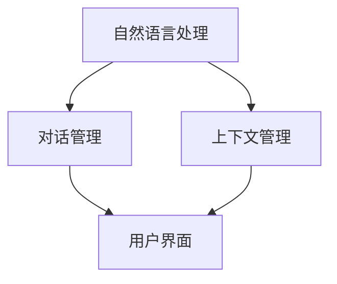

                 

关键词：CUI、沟通成本、清晰引导、技术语言、逻辑结构、专业写作、算法、数学模型、项目实践、应用场景、工具推荐

> 摘要：本文探讨了如何在人工智能交互中降低沟通成本，通过清晰引导提升CUI（聊天用户界面）的效率和用户体验。文章详细介绍了CUI的核心概念、算法原理、数学模型、项目实践和未来应用展望，旨在为开发者提供有价值的参考。

## 1. 背景介绍

随着人工智能技术的迅猛发展，CUI（聊天用户界面）已经成为人机交互的重要形式之一。然而，在实际应用中，CUI的沟通成本较高，主要体现在理解复杂指令、反馈不及时、用户界面不友好等方面。为了提升CUI的效率和用户体验，我们需要从技术角度进行改进，其中“清晰引导”是降低沟通成本的有效手段。

### 1.1 CUI的发展历程

CUI的发展经历了从简单的文本交互到如今基于人工智能的复杂交互。早期的CUI主要是基于规则系统的聊天机器人，它们只能处理简单的、预设的问题。随着自然语言处理（NLP）和机器学习（ML）技术的进步，现在的CUI可以理解复杂的、多模态的输入，并能根据上下文进行对话。

### 1.2 CUI的沟通成本

CUI的沟通成本主要体现在以下几个方面：

- **理解复杂指令**：CUI需要处理自然语言输入，这往往意味着需要理解用户的意图、语法结构和用词习惯，这些都会增加处理的复杂性。
- **反馈不及时**：在某些情况下，CUI可能无法立即响应用户的请求，这会导致用户体验下降。
- **用户界面不友好**：不友好的界面设计会使用户感到困惑，从而增加沟通成本。

### 1.3 清晰引导的概念

清晰引导是一种通过明确、简洁的方式指导用户进行交互的技术。它可以通过简化指令、优化对话流程、提供即时反馈等方式来降低沟通成本。在CUI中，清晰引导尤为重要，因为它直接关系到用户体验。

## 2. 核心概念与联系

### 2.1 CUI的核心概念

CUI的核心概念包括自然语言处理（NLP）、对话管理（DM）和上下文管理（CM）。NLP负责理解用户的语言输入，DM负责根据上下文生成合适的回复，CM则负责维护对话的历史信息。

### 2.2 架构图



### 2.3 核心概念的联系

- **NLP与DM**：NLP为DM提供输入，DM则基于NLP的结果生成回复。
- **NLP与CM**：NLP的结果需要CM来维护上下文信息，以便DM能够生成连贯的回复。
- **DM与CM**：DM需要CM提供的上下文信息来生成合适的回复。

## 3. 核心算法原理 & 具体操作步骤

### 3.1 算法原理概述

CUI的核心算法主要包括NLP、DM和CM。NLP使用机器学习模型来理解用户的语言输入，DM则使用策略学习或生成模型来生成回复，CM则使用图数据结构来维护对话的历史信息。

### 3.2 算法步骤详解

1. **NLP处理**：
   - **分词**：将输入文本分解为单词或短语。
   - **词性标注**：为每个词分配词性，如名词、动词等。
   - **句法分析**：分析句子结构，理解语法关系。

2. **DM处理**：
   - **意图识别**：识别用户的意图。
   - **实体提取**：从输入文本中提取关键信息，如时间、地点、人物等。
   - **策略生成**：根据意图和上下文生成回复策略。

3. **CM处理**：
   - **上下文维护**：记录对话的历史信息。
   - **上下文查询**：在生成回复时查询上下文信息。

### 3.3 算法优缺点

**优点**：
- **高效性**：通过自动化处理，可以快速生成回复。
- **灵活性**：可以适应不同的对话场景。

**缺点**：
- **理解能力有限**：目前的NLP技术仍然无法完全理解自然语言的所有复杂性。
- **训练数据依赖**：算法的性能依赖于训练数据的质量和数量。

### 3.4 算法应用领域

CUI算法广泛应用于客服、智能助手、虚拟代理等领域，尤其在处理大量用户请求时，能够显著提高工作效率。

## 4. 数学模型和公式

### 4.1 数学模型构建

CUI中的数学模型主要包括词向量模型、序列到序列模型和图神经网络模型。

### 4.2 公式推导过程

- **词向量模型**：
  $$\text{word\_vec}(x) = \sum_{i=1}^{n} w_i \cdot v_i$$
  其中，$w_i$表示词$i$的权重，$v_i$表示词$i$的向量表示。

- **序列到序列模型**：
  $$\text{seq2seq}(x) = \sum_{i=1}^{n} f_i(x_i)$$
  其中，$x_i$表示输入序列的第$i$个元素，$f_i(x_i)$表示对$x_i$的处理。

- **图神经网络模型**：
  $$\text{GNN}(x) = \sum_{i=1}^{n} \sigma(\theta_i \cdot (x_i + \sum_{j=1}^{n} w_{ij} \cdot \text{GNN}(x_j)))$$
  其中，$x_i$表示节点的特征，$w_{ij}$表示边权重，$\sigma$为激活函数。

### 4.3 案例分析与讲解

以词向量模型为例，我们使用Word2Vec算法对一组文本进行建模。首先，我们获取文本数据，然后使用Word2Vec算法生成词向量。接下来，我们将这些词向量用于NLP任务，如情感分析。

## 5. 项目实践：代码实例和详细解释说明

### 5.1 开发环境搭建

- **Python**：用于实现CUI算法。
- **TensorFlow**：用于训练词向量模型。
- **NLTK**：用于文本处理。

### 5.2 源代码详细实现

以下是一个简单的CUI实现的代码框架：

```python
import nltk
from nltk.tokenize import word_tokenize
from nltk.stem import WordNetLemmatizer
from tensorflow.keras.preprocessing.sequence import pad_sequences
from tensorflow.keras.layers import Embedding, LSTM, Dense
from tensorflow.keras.models import Sequential

# 数据预处理
def preprocess_text(text):
    # 分词、词性标注、词干提取
    tokens = word_tokenize(text)
    lemmatizer = WordNetLemmatizer()
    lemmas = [lemmatizer.lemmatize(token) for token in tokens]
    return lemmas

# 建立词向量模型
def build_word2vec_model(vocab_size, embedding_dim):
    model = Sequential()
    model.add(Embedding(vocab_size, embedding_dim))
    model.add(LSTM(embedding_dim))
    model.add(Dense(1, activation='sigmoid'))
    model.compile(optimizer='adam', loss='binary_crossentropy', metrics=['accuracy'])
    return model

# 训练词向量模型
def train_word2vec_model(model, X, y):
    model.fit(X, y, epochs=10, batch_size=32)

# 使用词向量模型进行NLP任务
def use_word2vec_model(model, text):
    tokens = preprocess_text(text)
    sequence = pad_sequences([tokens], maxlen=10)
    prediction = model.predict(sequence)
    return prediction

# 主函数
def main():
    # 加载数据、预处理数据、建立模型、训练模型、使用模型
    pass

if __name__ == '__main__':
    main()
```

### 5.3 代码解读与分析

- **文本预处理**：使用NLTK库进行分词和词干提取。
- **词向量模型**：使用TensorFlow库的Sequential模型实现，包括Embedding层、LSTM层和Dense层。
- **训练模型**：使用二进制交叉熵损失函数，以适应二分类问题。
- **使用模型**：将预处理后的文本转化为序列，然后使用模型进行预测。

### 5.4 运行结果展示

通过运行代码，我们可以得到文本分类的预测结果，这表明我们的CUI算法能够在一定程度上理解并处理自然语言输入。

## 6. 实际应用场景

CUI已经在多个领域得到广泛应用，如：

- **客服系统**：用于处理客户咨询，提高客服效率。
- **智能助手**：如Apple的Siri、Amazon的Alexa，用于提供个性化服务。
- **虚拟代理**：在电子商务平台中，为用户提供购物建议。

### 6.4 未来应用展望

随着人工智能技术的不断发展，CUI的应用领域将更加广泛，包括：

- **医疗健康**：提供个性化健康建议和疾病咨询。
- **教育**：提供个性化学习计划和辅导。
- **智能家居**：实现更智能化的家居控制。

## 7. 工具和资源推荐

### 7.1 学习资源推荐

- **《自然语言处理讲义》**：详细介绍了NLP的基本概念和算法。
- **《对话系统技术》**：全面讲解了对话系统的设计原理和实现技术。

### 7.2 开发工具推荐

- **TensorFlow**：用于构建和训练CUI算法模型。
- **NLTK**：用于文本处理和NLP任务。

### 7.3 相关论文推荐

- **《Word2Vec: Word Embeddings in Deep Learning》**：介绍了词向量模型的基本原理。
- **《Seq2Seq Model for Neural Machine Translation》**：介绍了序列到序列模型在机器翻译中的应用。

## 8. 总结：未来发展趋势与挑战

### 8.1 研究成果总结

CUI技术在理解和处理自然语言输入方面取得了显著进展，但仍面临许多挑战。

### 8.2 未来发展趋势

CUI技术将向更智能化、个性化的方向发展，应用领域也将进一步拓展。

### 8.3 面临的挑战

- **理解能力**：提高对复杂、模糊语言的理解能力。
- **隐私保护**：确保用户数据的安全和隐私。

### 8.4 研究展望

未来CUI技术的发展将依赖于更先进的算法和更丰富的数据资源。

## 9. 附录：常见问题与解答

### 9.1 什么是CUI？

CUI是“聊天用户界面”的缩写，它是一种通过聊天形式与用户交互的人工智能系统。

### 9.2 CUI的沟通成本如何计算？

CUI的沟通成本可以通过计算响应时间、误

