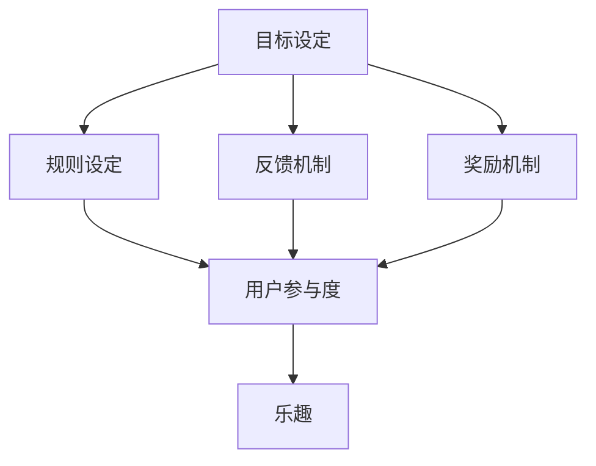

                 

关键词：游戏化设计，用户参与，乐趣，技术，计算

> 摘要：本文将探讨游戏化设计在提高用户参与度和乐趣方面的应用。通过分析其核心概念、算法原理、数学模型及实际案例，揭示游戏化设计的潜力，为未来的发展趋势与挑战提供思考。

## 1. 背景介绍

在当今技术飞速发展的时代，用户参与和体验设计成为各个领域追求的核心目标。从社交媒体到电子商务，从在线教育到医疗服务，如何提高用户的参与度和乐趣，成为了设计师和开发者面临的挑战。游戏化设计（Gamification）作为一种新兴的设计策略，旨在通过引入游戏元素，如奖励、积分、排名等，激励用户参与并提高他们的满意度。

游戏化设计不仅应用于传统游戏领域，还广泛应用于非游戏环境。例如，企业通过游戏化设计来提升员工的工作积极性，学校通过游戏化设计来激发学生的学习兴趣，甚至是健康管理机构利用游戏化设计来鼓励人们坚持健康习惯。本文将深入探讨游戏化设计的核心概念、算法原理、数学模型及实际案例，以期为读者提供全面的理解和应用指导。

### 1.1 游戏化设计的起源和发展

游戏化设计的概念最早可以追溯到1970年代，当时的心理学家和游戏设计师开始探索如何在非游戏环境中应用游戏机制来激励人们。随着互联网和移动设备的普及，游戏化设计在2000年代迎来了快速发展，特别是在2010年代达到了顶峰。

这一时期，许多公司和研究机构开始深入研究游戏化设计在不同领域的应用，如营销、健康、教育等。游戏化设计的核心原理逐渐明确，许多成功案例不断涌现，推动了这一领域的发展。

### 1.2 游戏化设计的核心概念

游戏化设计主要涉及以下几个核心概念：

- **目标设定**：通过明确用户的目标，引导用户朝着既定目标努力。
- **规则设定**：设定明确的规则，帮助用户理解如何实现目标。
- **反馈机制**：及时给予用户反馈，让他们了解自己的进步和成绩。
- **奖励机制**：通过奖励来激励用户，提高他们的参与度和乐趣。

### 1.3 游戏化设计的应用领域

游戏化设计在多个领域得到了广泛应用，以下是其中几个典型的应用领域：

- **市场营销**：企业通过游戏化设计来提高品牌知名度、增加客户参与度和购买意愿。
- **健康与健身**：利用游戏化设计来鼓励人们养成健康习惯，如坚持运动、饮食控制等。
- **教育与培训**：通过游戏化设计来提高学生的学习兴趣和参与度，提高教育效果。
- **人力资源管理**：企业通过游戏化设计来提升员工的工作积极性、团队协作能力等。

## 2. 核心概念与联系

为了更好地理解游戏化设计的原理和应用，我们需要了解其核心概念和联系。以下是游戏化设计的主要概念及其相互关系：

### 2.1 目标设定

目标设定是游戏化设计的核心，它通过设定明确的、可衡量的目标来引导用户行动。目标可以是简单的任务，如完成一个游戏关卡，也可以是复杂的长远目标，如养成一个健康习惯。

### 2.2 规则设定

规则设定是确保目标实现的关键，它明确了用户如何行动、如何达成目标的具体步骤。规则可以是简单的，如点击按钮，也可以是复杂的，如完成多个任务才能解锁新内容。

### 2.3 反馈机制

反馈机制是用户了解自己进度和成绩的重要途径。它可以通过可视化图表、通知、声音等多种形式来呈现。良好的反馈机制能够增强用户的成就感和动力。

### 2.4 奖励机制

奖励机制是游戏化设计的重要组成部分，它通过给予用户奖励来激励他们继续参与。奖励可以是虚拟的，如积分、等级，也可以是实际的，如优惠券、实物礼品。

### 2.5 用户参与度

用户参与度是衡量游戏化设计成功与否的重要指标。它反映了用户对目标、规则、反馈和奖励的接受程度和积极性。高用户参与度意味着游戏化设计达到了预期效果。

### 2.6 乐趣

乐趣是游戏化设计追求的核心目标之一。通过设计有趣的任务、规则和奖励，游戏化设计能够提高用户的参与度和满意度，从而增强他们的乐趣体验。

### 2.7 Mermaid 流程图

以下是游戏化设计核心概念和联系的一个 Mermaid 流程图：



通过这个流程图，我们可以清晰地看到游戏化设计各个核心概念之间的相互关系和作用。

## 3. 核心算法原理 & 具体操作步骤

### 3.1 算法原理概述

游戏化设计的核心算法原理主要涉及以下几个方面：

- **目标设定**：使用目标导向的方法，根据用户的兴趣和需求，设定明确、可衡量的目标。
- **规则设定**：通过设定清晰的规则，引导用户理解如何实现目标，并确保目标的实现过程公平、透明。
- **反馈机制**：使用实时、个性化的反馈，帮助用户了解自己的进步和成绩，增强他们的成就感和动力。
- **奖励机制**：根据用户的参与度和成绩，给予适当的奖励，激励他们继续参与。

### 3.2 算法步骤详解

以下是游戏化设计的具体操作步骤：

1. **需求分析**：了解目标用户的需求、兴趣和痛点，确定游戏化设计的方向。
2. **目标设定**：根据需求分析结果，设定明确、可衡量的目标，确保目标与用户需求一致。
3. **规则设定**：制定详细的规则，明确用户如何实现目标，以及如何评估他们的成绩。
4. **反馈机制**：设计实时、个性化的反馈机制，帮助用户了解自己的进度和成绩。
5. **奖励机制**：根据用户的参与度和成绩，设计适当的奖励机制，激励他们继续参与。
6. **测试与优化**：对游戏化设计进行测试，收集用户反馈，不断优化设计，提高用户参与度和满意度。

### 3.3 算法优缺点

游戏化设计具有以下几个优点：

- **提高用户参与度**：通过目标、规则、反馈和奖励等机制，激发用户的兴趣和积极性，提高参与度。
- **增强乐趣体验**：设计有趣的任务、规则和奖励，为用户带来愉悦的体验。
- **提高任务完成率**：通过奖励机制，激励用户完成任务，提高任务完成率。

然而，游戏化设计也存在一些缺点：

- **用户疲劳**：过度使用游戏化元素可能导致用户疲劳，降低参与度。
- **公平性问题**：不合理的规则设定和奖励机制可能导致不公平现象，影响用户体验。

### 3.4 算法应用领域

游戏化设计在不同领域的应用如下：

- **市场营销**：通过游戏化设计，提高品牌知名度、客户参与度和购买意愿。
- **健康与健身**：通过游戏化设计，鼓励人们养成健康习惯，如坚持运动、饮食控制等。
- **教育与培训**：通过游戏化设计，提高学生的学习兴趣和参与度，提高教育效果。
- **人力资源管理**：通过游戏化设计，提升员工的工作积极性、团队协作能力等。

## 4. 数学模型和公式

在游戏化设计中，数学模型和公式起着关键作用，它们帮助设计者更好地理解用户行为，优化游戏化设计的效果。以下是游戏化设计常用的数学模型和公式。

### 4.1 数学模型构建

在游戏化设计中，常用的数学模型包括目标模型、规则模型、反馈模型和奖励模型。以下是这些模型的构建过程：

- **目标模型**：目标模型用于设定用户的明确、可衡量的目标。公式如下：

  $$ 目标 = f(用户需求, 问题难度) $$

  其中，$f$ 是一个映射函数，将用户需求（如学习知识、锻炼身体）和问题难度（如难度等级、任务复杂度）映射为具体的目标。

- **规则模型**：规则模型用于设定用户实现目标的步骤和规则。公式如下：

  $$ 规则 = g(目标, 用户能力) $$

  其中，$g$ 是一个映射函数，将目标（如完成学习任务、达成锻炼目标）和用户能力（如学习能力、身体素质）映射为具体的规则。

- **反馈模型**：反馈模型用于设定用户进度和成绩的反馈机制。公式如下：

  $$ 反馈 = h(用户行为, 目标进度) $$

  其中，$h$ 是一个映射函数，将用户行为（如完成任务、达成目标）和目标进度（如完成任务的比例、目标完成的进度）映射为具体的反馈。

- **奖励模型**：奖励模型用于设定用户参与和成绩的奖励机制。公式如下：

  $$ 奖励 = i(用户参与度, 用户成绩) $$

  其中，$i$ 是一个映射函数，将用户参与度（如参与任务的比例、完成任务的速度）和用户成绩（如完成任务的质量、达成目标的成绩）映射为具体的奖励。

### 4.2 公式推导过程

以下是对上述数学模型公式的推导过程：

- **目标模型**：

  目标设定的关键在于将用户需求（如学习知识、锻炼身体）和问题难度（如难度等级、任务复杂度）转化为具体的、可衡量的目标。这可以通过以下方式实现：

  1. 收集用户需求：通过问卷调查、访谈等方式，了解用户的需求和期望。
  2. 分析问题难度：根据任务的难度等级和复杂度，设定合理的目标范围。

  基于以上分析，目标模型公式可以表示为：

  $$ 目标 = f(用户需求, 问题难度) $$

- **规则模型**：

  规则设定的关键在于将目标（如完成学习任务、达成锻炼目标）和用户能力（如学习能力、身体素质）转化为具体的、可执行的步骤。这可以通过以下方式实现：

  1. 分析目标：了解目标的细节和实现方式。
  2. 考虑用户能力：根据用户的能力水平和特点，设定适合的规则。

  基于以上分析，规则模型公式可以表示为：

  $$ 规则 = g(目标, 用户能力) $$

- **反馈模型**：

  反馈机制的关键在于实时、个性化地呈现用户进度和成绩，以提高用户的成就感和动力。这可以通过以下方式实现：

  1. 收集用户行为数据：通过系统记录用户的行为，如完成任务、达成目标的比例等。
  2. 分析用户进度：根据用户行为数据，计算用户的进度和成绩。
  3. 设计反馈方式：根据用户进度和成绩，设计合适的反馈方式，如可视化图表、通知等。

  基于以上分析，反馈模型公式可以表示为：

  $$ 反馈 = h(用户行为, 目标进度) $$

- **奖励模型**：

  奖励机制的关键在于根据用户的参与度和成绩，给予适当的奖励，以提高用户的参与积极性和满意度。这可以通过以下方式实现：

  1. 收集用户参与数据：通过系统记录用户的参与行为，如完成任务、参与活动等。
  2. 分析用户成绩：根据用户参与数据，计算用户的成绩和参与度。
  3. 设计奖励方式：根据用户成绩和参与度，设计合适的奖励方式，如积分、等级等。

  基于以上分析，奖励模型公式可以表示为：

  $$ 奖励 = i(用户参与度, 用户成绩) $$

### 4.3 案例分析与讲解

以下是一个具体的案例，用于说明如何应用上述数学模型和公式。

### 案例背景

某在线教育平台希望通过游戏化设计提高学生的学习兴趣和参与度。该平台提供了多种课程，学生可以根据自己的兴趣和学习进度选择课程。

### 案例分析

1. **目标模型**：

   - 用户需求：学生希望提高自己的学习能力、掌握新知识。
   - 问题难度：课程难度因课程类型和难度等级而异。

   基于以上分析，目标模型可以表示为：

   $$ 目标 = f(用户需求, 问题难度) $$

   例如，对于一门英语课程，目标可以是“在30天内掌握2000个英语单词”。

2. **规则模型**：

   - 目标：掌握2000个英语单词。
   - 用户能力：学生的英语水平和学习习惯。

   基于以上分析，规则模型可以表示为：

   $$ 规则 = g(目标, 用户能力) $$

   例如，规则可以是“每天学习50个新单词，复习前一天的单词，持续30天”。

3. **反馈模型**：

   - 用户行为：学生每天学习的单词数量、复习情况。
   - 目标进度：学生完成的单词数量占总目标的比例。

   基于以上分析，反馈模型可以表示为：

   $$ 反馈 = h(用户行为, 目标进度) $$

   例如，系统可以每天向学生发送学习报告，包括已学习的单词数量、复习情况等。

4. **奖励模型**：

   - 用户参与度：学生每天学习的单词数量、复习情况。
   - 用户成绩：学生完成的单词数量占总目标的比例。

   基于以上分析，奖励模型可以表示为：

   $$ 奖励 = i(用户参与度, 用户成绩) $$

   例如，系统可以设置积分机制，学生每学习一个单词可以获得1积分，达到一定积分可以兑换优惠券或实物奖励。

通过以上分析，我们可以看到，游戏化设计在在线教育平台中的应用，可以通过数学模型和公式来构建目标、规则、反馈和奖励机制，从而提高学生的学习兴趣和参与度。

## 5. 项目实践：代码实例和详细解释说明

在了解了游戏化设计的核心概念、算法原理和数学模型后，接下来我们将通过一个实际项目来演示如何应用这些概念和模型。我们将使用Python编程语言来实现一个简单的游戏化设计项目——一个单词学习游戏。

### 5.1 开发环境搭建

在开始项目之前，我们需要搭建一个基本的Python开发环境。以下是搭建过程：

1. **安装Python**：从[Python官网](https://www.python.org/)下载并安装Python 3.x版本。
2. **安装PyCharm**：下载并安装PyCharm社区版或专业版（推荐使用专业版，有更好的代码编辑功能）。
3. **创建Python项目**：在PyCharm中创建一个新的Python项目，选择合适的虚拟环境并设置。

### 5.2 源代码详细实现

以下是单词学习游戏的源代码：

```python
import random

# 字典文件，包含单词及其翻译
word_dict = {
    "apple": "苹果",
    "banana": "香蕉",
    "cat": "猫",
    "dog": "狗",
    "house": "房子",
    "tree": "树"
}

# 游戏主函数
def word_game():
    # 从字典中随机选择一个单词
    word_to_learn = random.choice(list(word_dict.keys()))
    translation = word_dict[word_to_learn]

    # 用户输入翻译
    user_input = input(f"请翻译'{word_to_learn}'：")

    # 判断用户输入是否正确
    if user_input == translation:
        print("恭喜你，回答正确！")
        # 增加积分
        global score
        score += 1
    else:
        print(f"很遗憾，回答错误。正确答案是'{translation}'。")
    
    # 提示用户继续游戏或退出
    continue_game = input("是否继续游戏？（y/n）")
    if continue_game.lower() != 'y':
        print(f"游戏结束，你的得分为{score}。")
        return

    # 继续游戏
    word_game()

# 初始化全局变量
score = 0

# 开始游戏
word_game()
```

### 5.3 代码解读与分析

下面是对源代码的详细解读：

- **word_dict**：这是一个包含单词及其翻译的字典。在实际应用中，这个字典可以包含更多的单词，以及更详细的翻译和解释。

- **word_game()**：这是游戏的主函数，它负责实现游戏的核心逻辑。每次调用这个函数，都会随机选择一个单词，并要求用户翻译这个单词。

- **random.choice()**：这个函数用于从列表中随机选择一个元素。在这个例子中，它用于随机选择一个单词。

- **user_input**：这个变量用于存储用户输入的翻译。

- **if user_input == translation**：这个条件语句用于判断用户输入的翻译是否正确。

- **score**：这是一个全局变量，用于记录用户的得分。每次用户回答正确，得分就会增加1。

- **continue_game**：这个变量用于存储用户是否继续游戏的输入。如果用户输入不是'y'，游戏就会结束，并显示用户的得分。

### 5.4 运行结果展示

当运行这个游戏时，程序会随机选择一个单词，并要求用户翻译这个单词。用户输入翻译后，程序会判断用户输入是否正确，并给出相应的反馈。用户可以选择继续游戏或退出游戏。以下是运行结果的一个示例：

```
请翻译'cat'：
请翻译'dog'：
恭喜你，回答正确！
是否继续游戏？（y/n）
y
请翻译'apple'：
很遗憾，回答错误。正确答案是'苹果'。
是否继续游戏？（y/n）
n
游戏结束，你的得分为2。
```

通过这个简单的例子，我们可以看到游戏化设计的基本原理是如何在实际项目中应用的。这个游戏虽然简单，但已经包含了游戏化设计的核心要素，如目标设定、规则设定、反馈机制和奖励机制。

## 6. 实际应用场景

游戏化设计在多个领域都有广泛的应用，以下是其中几个典型的实际应用场景：

### 6.1 市场营销

在市场营销中，游戏化设计被广泛应用于品牌推广和用户互动。例如，一些品牌会推出互动游戏或挑战，鼓励用户参与并分享，从而提高品牌知名度和用户参与度。同时，通过积分、徽章和排名等游戏化元素，品牌可以激励用户持续参与活动，增加用户忠诚度。

### 6.2 健康与健身

在健康与健身领域，游戏化设计被用来鼓励人们养成健康习惯。例如，一些健康应用程序通过设定目标、提供反馈和奖励机制，激励用户坚持运动、饮食控制等。这种设计不仅能够提高用户的健康水平，还能增加用户对应用程序的依赖和满意度。

### 6.3 教育与培训

在教育与培训领域，游戏化设计被用来提高学生的学习兴趣和参与度。例如，一些在线教育平台通过设定学习目标、提供即时反馈和奖励机制，鼓励学生积极参与学习活动。这种方式不仅能够提高学生的学习效果，还能增加他们对课程的兴趣和动力。

### 6.4 人力资源管理

在人力资源管理中，游戏化设计被用来提升员工的工作积极性和团队协作能力。例如，一些企业会通过设定工作目标、提供反馈和奖励机制，激励员工完成任务并提高工作效率。同时，通过团队竞赛和排名等游戏化元素，企业可以增强员工的团队协作意识和归属感。

### 6.5 社交媒体

在社交媒体领域，游戏化设计被用来提高用户的互动和参与度。例如，一些社交媒体平台通过设定点赞、评论和分享等目标，提供即时反馈和奖励机制，鼓励用户积极参与社区活动。这种设计不仅能够提高用户的活跃度，还能增加用户对平台的依赖和满意度。

### 6.6 未来应用展望

随着技术的不断发展，游戏化设计在未来的应用前景将更加广阔。以下是一些可能的应用方向：

- **个性化游戏化设计**：通过大数据和人工智能技术，为用户提供个性化的游戏化设计方案，提高用户的参与度和满意度。
- **跨平台游戏化设计**：结合多种平台和设备，提供无缝衔接的游戏化体验，增加用户的参与度和互动性。
- **智能反馈和奖励机制**：利用人工智能技术，实时分析用户行为和反馈，提供个性化的反馈和奖励，提高用户的参与度和满意度。
- **游戏化公共服务**：将游戏化设计应用于公共服务领域，如政务服务、社区管理、公共健康等，提高公共服务的效率和用户体验。

## 7. 工具和资源推荐

在游戏化设计领域，有许多优秀的工具和资源可供学习和应用。以下是几个推荐的工具和资源：

### 7.1 学习资源推荐

- **《游戏化设计：理论与实践》**：这是一本经典的书籍，详细介绍了游戏化设计的理论基础和实践案例。
- **游戏化设计论坛**：如Reddit上的/r/gamification，可以在这里找到最新的游戏化设计资讯和讨论。
- **在线课程**：如Coursera、Udemy上的游戏化设计相关课程，提供系统的学习资源和实践指导。

### 7.2 开发工具推荐

- **Unity**：一款强大的游戏开发引擎，适用于游戏化设计的开发和测试。
- **Axure RP**：一款专业的原型设计工具，可以帮助设计师快速构建游戏化设计的原型。
- **InVision**：一款优秀的用户体验设计工具，适用于游戏化设计的高保真原型设计。

### 7.3 相关论文推荐

- **“Gamification in Education: A Systematic Review”**：这篇论文系统地综述了游戏化设计在教育领域的应用和研究。
- **“The Gamification of Life: Designing for Self-Determination”**：这篇论文探讨了游戏化设计如何促进自我决定和自主学习。
- **“Gamification at Work: Motivating Employees in the 21st Century”**：这篇论文分析了游戏化设计在人力资源管理中的应用和效果。

## 8. 总结：未来发展趋势与挑战

### 8.1 研究成果总结

游戏化设计在过去几十年中取得了显著的研究成果，其应用范围不断扩大，从传统游戏领域扩展到市场营销、健康、教育、人力资源管理等多个领域。通过引入目标设定、规则设定、反馈机制和奖励机制，游戏化设计能够显著提高用户的参与度和乐趣。

### 8.2 未来发展趋势

未来，游戏化设计将继续发展，以下是几个可能的发展趋势：

- **个性化游戏化设计**：通过大数据和人工智能技术，为用户提供个性化的游戏化设计方案，提高用户的参与度和满意度。
- **跨平台游戏化设计**：结合多种平台和设备，提供无缝衔接的游戏化体验，增加用户的参与度和互动性。
- **智能反馈和奖励机制**：利用人工智能技术，实时分析用户行为和反馈，提供个性化的反馈和奖励，提高用户的参与度和满意度。
- **游戏化公共服务**：将游戏化设计应用于公共服务领域，如政务服务、社区管理、公共健康等，提高公共服务的效率和用户体验。

### 8.3 面临的挑战

尽管游戏化设计具有巨大的潜力，但在实际应用中也面临着一些挑战：

- **用户疲劳**：过度使用游戏化元素可能导致用户疲劳，降低参与度。
- **公平性问题**：不合理的规则设定和奖励机制可能导致不公平现象，影响用户体验。
- **数据隐私**：游戏化设计需要收集大量的用户数据，如何保护用户隐私是一个重要问题。
- **长期效果**：游戏化设计的效果可能随时间减弱，如何维持用户的参与度和乐趣是一个挑战。

### 8.4 研究展望

未来，游戏化设计的研究应重点关注以下几个方面：

- **个性化设计**：深入研究如何根据用户的兴趣、需求和行为，设计个性化的游戏化方案。
- **公平性和可持续性**：探讨如何确保游戏化设计公平、透明，并维持长期效果。
- **数据隐私保护**：研究如何在保障用户隐私的同时，有效利用用户数据来优化游戏化设计。
- **跨领域应用**：探索游戏化设计在其他领域的应用，如艺术、文化、科学等，推动游戏化设计的全面发展。

## 9. 附录：常见问题与解答

### 9.1 游戏化设计与游戏开发的区别是什么？

游戏化设计是一种将游戏元素应用于非游戏环境的设计策略，旨在提高用户的参与度和乐趣。而游戏开发则是创建游戏的过程，涉及游戏故事、角色、规则、视觉和声音设计等多个方面。游戏化设计关注的是如何将游戏机制和用户体验相结合，而不是创建完整的游戏。

### 9.2 游戏化设计是否适用于所有领域？

游戏化设计在很多领域都有成功应用，但并不是所有领域都适合。它适用于需要提高用户参与度和乐趣的领域，如市场营销、健康、教育和人力资源管理。对于一些专业性和技术性较强的领域，如科学研究和技术开发，游戏化设计可能并不是最佳选择。

### 9.3 如何评估游戏化设计的有效性？

评估游戏化设计的有效性可以从以下几个方面进行：

- **用户参与度**：通过用户活跃度、参与时间和参与频率等指标来衡量。
- **用户满意度**：通过用户调查、满意度评分等方式来评估。
- **任务完成率**：通过用户完成任务的数量和质量来衡量。
- **用户留存率**：通过用户留存时间和留存率等指标来评估。

### 9.4 游戏化设计中的奖励机制有哪些类型？

游戏化设计中的奖励机制包括以下几种类型：

- **虚拟奖励**：如积分、徽章、等级等。
- **实物奖励**：如优惠券、礼品卡、实物奖品等。
- **社会奖励**：如分享、点赞、评论等社交互动。
- **内在奖励**：如成就感、自我实现等。

### 9.5 游戏化设计中的反馈机制有哪些类型？

游戏化设计中的反馈机制包括以下几种类型：

- **即时反馈**：如实时成绩、进度条、通知等。
- **延迟反馈**：如定期报告、总结、奖励等。
- **个性化反馈**：根据用户行为和进度提供个性化的反馈。
- **视觉反馈**：如图标、动画、声音等视觉和听觉效果。

### 9.6 游戏化设计中的目标设定有哪些原则？

游戏化设计中的目标设定应遵循以下原则：

- **明确性**：目标应明确、具体，避免模糊和抽象。
- **可衡量性**：目标应可衡量，便于评估进度和成绩。
- **挑战性**：目标应具有适当的挑战性，既能激励用户，又不会过于困难。
- **灵活性**：目标应根据用户行为和进度进行调整，以保持其吸引力。

### 9.7 游戏化设计中的规则设定有哪些原则？

游戏化设计中的规则设定应遵循以下原则：

- **清晰性**：规则应清晰、明确，用户易于理解。
- **一致性**：规则应保持一致性，避免矛盾和不公平现象。
- **公平性**：规则应公平、透明，确保所有用户都能公平地参与。
- **灵活性**：规则应根据用户行为和需求进行调整，以适应不同情况。

### 9.8 如何平衡游戏化设计中的乐趣与实用性？

在游戏化设计中，平衡乐趣与实用性是关键。以下是一些建议：

- **适度使用游戏化元素**：避免过度使用游戏化元素，以免用户疲劳。
- **设计有趣且实用的任务**：确保任务既能带来乐趣，又能达到实际目标。
- **提供多样化的游戏化元素**：结合多种游戏化元素，提高用户的参与度和满意度。
- **持续优化设计**：根据用户反馈和实际效果，不断调整和优化游戏化设计。

### 9.9 游戏化设计中的数据隐私问题如何解决？

在游戏化设计中，数据隐私问题可以通过以下方式解决：

- **匿名化数据**：收集和存储用户数据时，对用户身份进行匿名化处理。
- **数据加密**：对用户数据进行加密，确保数据传输和存储的安全性。
- **隐私政策**：明确告知用户数据收集和使用的目的，并遵循隐私政策。
- **用户授权**：确保用户在授权的情况下提供数据，并在使用数据时尊重用户的选择。

### 9.10 游戏化设计中的跨平台兼容性问题如何解决？

在游戏化设计中，跨平台兼容性问题可以通过以下方式解决：

- **采用跨平台开发框架**：如React Native、Flutter等，可以支持多平台开发。
- **使用统一的数据存储和接口**：确保不同平台的数据存储和接口一致，便于数据同步和交互。
- **针对不同平台进行优化**：根据不同平台的特性，对游戏化设计进行适当的优化和调整，提高用户体验。

### 9.11 游戏化设计中的长期效果如何维持？

在游戏化设计中，维持长期效果可以通过以下方式实现：

- **提供多样化的任务和挑战**：不断更新和丰富任务和挑战，以保持用户的兴趣和参与度。
- **个性化游戏化设计**：根据用户的行为和兴趣，提供个性化的游戏化方案，提高用户的满意度。
- **持续反馈和奖励**：通过持续反馈和奖励，激励用户持续参与。
- **用户参与和反馈**：鼓励用户参与设计，并根据用户反馈不断优化设计。

### 9.12 游戏化设计中的文化差异问题如何解决？

在游戏化设计中，文化差异问题可以通过以下方式解决：

- **文化适应性**：在设计游戏化方案时，考虑不同文化的特点和需求，进行适应性调整。
- **多语言支持**：提供多语言支持，确保不同语言的用户都能理解和参与。
- **本地化设计**：针对不同地区和文化，提供本地化的游戏化设计，提高用户的接受度和参与度。
- **用户反馈**：鼓励用户反馈，并根据反馈进行调整和优化。

### 9.13 游戏化设计中的社会责任问题如何解决？

在游戏化设计中，社会责任问题可以通过以下方式解决：

- **公平性和透明性**：确保游戏化设计公平、透明，避免对特定群体造成不利影响。
- **可持续性**：在设计游戏化方案时，考虑环境保护和社会责任，避免过度消耗资源。
- **用户教育**：通过教育和宣传，提高用户对社会责任的认识和参与度。
- **监管和法规**：遵循相关法规和监管要求，确保游戏化设计的合规性和社会责任。

### 9.14 游戏化设计中的伦理问题如何解决？

在游戏化设计中，伦理问题可以通过以下方式解决：

- **隐私保护**：确保用户隐私得到保护，避免过度收集和使用用户数据。
- **公平性**：确保游戏化设计公平，避免对特定群体造成歧视和不利影响。
- **用户授权**：确保用户在授权的情况下提供数据，并在使用数据时尊重用户的选择。
- **道德审查**：在设计游戏化方案时，进行道德审查，确保设计符合伦理规范和社会价值观。

### 9.15 游戏化设计中的技术挑战如何解决？

在游戏化设计中，技术挑战可以通过以下方式解决：

- **技术选型**：选择合适的技术和工具，确保游戏化设计的可行性和稳定性。
- **技术优化**：根据用户反馈和实际效果，不断优化技术实现，提高用户体验。
- **技术支持**：提供技术支持和培训，确保设计师和开发者能够有效地应用技术。
- **技术创新**：积极探索新技术，推动游戏化设计的创新和发展。

### 9.16 游戏化设计中的用户体验问题如何解决？

在游戏化设计中，用户体验问题可以通过以下方式解决：

- **用户研究**：通过用户研究和访谈，了解用户的需求和痛点，为设计提供依据。
- **用户体验设计**：注重用户体验设计，确保游戏化设计符合用户期望和习惯。
- **用户反馈**：鼓励用户反馈，并根据反馈进行优化和改进。
- **多平台适配**：确保游戏化设计在不同平台上都能提供良好的用户体验。

### 9.17 游戏化设计中的经济效益问题如何解决？

在游戏化设计中，经济效益问题可以通过以下方式解决：

- **商业模式设计**：设计合适的商业模式，确保游戏化设计能够产生经济效益。
- **成本控制**：通过成本控制，确保游戏化设计的投入和产出平衡。
- **收益优化**：通过优化收益结构，提高游戏化设计的经济效益。
- **市场推广**：通过市场推广，提高游戏化设计的市场认知度和用户参与度。

### 9.18 游戏化设计中的创新问题如何解决？

在游戏化设计中，创新问题可以通过以下方式解决：

- **创新激励**：鼓励设计师和开发者进行创新，提供创新激励和支持。
- **知识共享**：通过知识共享，促进游戏化设计的创新和发展。
- **跨学科合作**：开展跨学科合作，融合不同领域的知识和经验，推动游戏化设计的创新。
- **技术创新**：积极探索新技术，为游戏化设计提供创新的动力和方向。

### 9.19 游戏化设计中的可持续发展问题如何解决？

在游戏化设计中，可持续发展问题可以通过以下方式解决：

- **环境责任**：在设计游戏化方案时，考虑环境责任，采取可持续的设计方案。
- **社会责任**：在设计游戏化方案时，考虑社会责任，确保设计符合社会价值观和伦理规范。
- **经济可持续性**：确保游戏化设计具有经济效益，实现可持续发展。
- **用户参与**：鼓励用户参与游戏化设计，共同推动可持续发展。

### 9.20 游戏化设计中的全球化问题如何解决？

在游戏化设计中，全球化问题可以通过以下方式解决：

- **本地化设计**：根据不同地区的文化和需求，进行本地化设计，确保设计的适应性和接受度。
- **多语言支持**：提供多语言支持，确保不同语言的用户都能理解和参与。
- **文化多样性**：尊重文化多样性，避免文化冲突和误解。
- **全球化合作**：开展全球化合作，分享经验和资源，推动游戏化设计的全球化发展。

