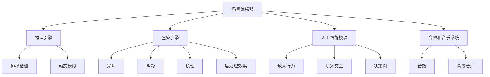

                 

关键词：游戏开发引擎、游戏创作、简化、强大工具、游戏设计、游戏编程、游戏性能优化、人工智能辅助

> 摘要：本文将探讨游戏开发引擎的作用及其在游戏创作中的应用，通过深入分析核心概念、算法原理、数学模型、项目实践等多个方面，揭示游戏开发引擎如何成为简化游戏创作流程的强大工具。作者：禅与计算机程序设计艺术 / Zen and the Art of Computer Programming

## 1. 背景介绍

随着游戏行业的迅速发展，游戏开发已经逐渐成为了一个庞大且多元化的领域。然而，游戏开发的复杂性也随之增加。从早期的单机游戏到如今的大型多人在线游戏，游戏开发的流程变得越来越繁琐，涉及到的技术点也日益丰富。为了应对这些挑战，游戏开发引擎应运而生，成为简化游戏创作的重要工具。

游戏开发引擎是一种软件工具，它提供了一系列强大的功能，用于游戏世界的设计、物理模拟、渲染、人工智能等各个方面。通过使用游戏开发引擎，开发者可以大大简化游戏创作的流程，提高开发效率，实现更高质量的游戏体验。

游戏开发引擎的重要性不仅体现在开发效率上，还在于它为开发者提供了丰富的资源和社区支持。许多流行的游戏开发引擎，如Unity、Unreal Engine等，都拥有庞大的开发者社区和丰富的文档资源，这为开发者提供了宝贵的学习和实践机会。

本文将围绕游戏开发引擎的核心概念、算法原理、数学模型、项目实践等方面展开讨论，旨在为读者提供一个全面、深入的了解，帮助开发者更好地利用游戏开发引擎简化游戏创作过程。

## 2. 核心概念与联系

### 2.1 游戏开发引擎的定义

游戏开发引擎是一种软件工具，它为游戏开发者提供了一系列的功能和模块，用于游戏世界的创建、模拟和渲染。这些功能包括但不限于场景编辑器、物理引擎、渲染引擎、人工智能模块等。游戏开发引擎的目标是简化游戏开发流程，提高开发效率，使开发者能够专注于游戏设计和创意实现。

### 2.2 游戏开发引擎的关键模块

一个典型的游戏开发引擎通常包括以下几个关键模块：

- **场景编辑器**：用于设计游戏世界中的场景和关卡，包括地形、建筑、角色等。场景编辑器提供了直观的图形界面，使开发者可以轻松地拖放和调整各种元素。

- **物理引擎**：用于模拟游戏世界中的物理现象，如重力、碰撞检测、动态模拟等。物理引擎是游戏引擎的核心模块，直接影响游戏的物理表现和交互性。

- **渲染引擎**：用于渲染游戏画面，包括光照、阴影、纹理、后处理效果等。渲染引擎决定了游戏画面的质量和视觉效果。

- **人工智能模块**：用于实现游戏中的人工智能功能，如敌人行为、玩家交互、决策树等。人工智能模块是游戏开发中的重要一环，直接影响游戏的智能程度和玩家体验。

- **音效和音乐系统**：用于管理和播放游戏中的音效和背景音乐。音效和音乐是游戏的重要组成部分，能够增强游戏的氛围和情感表达。

### 2.3 核心概念原理和架构的 Mermaid 流程图

以下是游戏开发引擎的核心概念原理和架构的 Mermaid 流程图：



通过上述流程图，我们可以清晰地看到游戏开发引擎中的各个模块及其之间的联系，这有助于我们更好地理解游戏开发引擎的工作原理。

## 3. 核心算法原理 & 具体操作步骤

### 3.1 算法原理概述

游戏开发引擎中的核心算法主要涉及物理模拟、渲染算法、人工智能算法等方面。以下将分别介绍这些算法的基本原理。

#### 3.1.1 物理模拟算法

物理模拟算法是游戏开发引擎中至关重要的一部分，它负责模拟游戏世界中的物理现象，如重力、碰撞检测、动态模拟等。常见的物理模拟算法包括：

- **牛顿力学**：基于牛顿力学原理，模拟物体的运动和受力情况。

- **弹簧-阻尼模型**：用于模拟柔性物体的运动，如绳索、弹簧等。

- **刚体动力学**：用于模拟刚体的运动，如车辆、建筑物等。

#### 3.1.2 渲染算法

渲染算法是游戏开发引擎中的另一重要组成部分，它负责将游戏世界中的物体渲染成图像。常见的渲染算法包括：

- **光栅化渲染**：将三维模型转换为二维图像，常用于2D游戏和3D游戏的前期渲染。

- **光线追踪渲染**：通过模拟光线在场景中的传播和反射，实现高质量的渲染效果，常用于高端3D游戏和电影制作。

- **全局光照渲染**：通过计算场景中的全局光照，实现更加真实和细腻的画面效果，常用于高端3D游戏和电影制作。

#### 3.1.3 人工智能算法

人工智能算法在游戏开发中发挥着重要作用，用于实现游戏中的智能行为和决策。常见的人工智能算法包括：

- **决策树**：通过一系列条件判断，实现复杂的决策过程，常用于敌人行为和玩家交互。

- **神经网络**：通过训练大量的数据，实现智能化的行为预测和决策，常用于高级的人工智能游戏和模拟。

### 3.2 算法步骤详解

#### 3.2.1 物理模拟算法步骤

1. **初始化**：设置物理世界的初始状态，包括物体位置、速度、受力等。

2. **碰撞检测**：通过空间分割和扫描线算法，检测物体之间的碰撞。

3. **受力计算**：根据牛顿力学原理，计算物体受到的合力。

4. **运动更新**：根据受力情况和物体质量，更新物体的速度和位置。

5. **动态模拟**：模拟柔性物体和刚体的运动，如绳索的摆动、车辆的行驶等。

#### 3.2.2 渲染算法步骤

1. **三维模型转换**：将三维模型转换为二维图像，通过投影矩阵和视图矩阵进行变换。

2. **光照计算**：根据光源位置和物体属性，计算光照效果，包括光照强度、颜色、阴影等。

3. **纹理映射**：将纹理映射到物体表面，实现更细腻和真实的画面效果。

4. **后处理效果**：通过模糊、锐化、色调映射等后处理效果，增强画面质量和视觉效果。

5. **输出图像**：将渲染后的图像输出到屏幕，显示给玩家。

#### 3.2.3 人工智能算法步骤

1. **数据收集**：收集游戏中的数据，包括角色行为、环境信息、玩家输入等。

2. **数据预处理**：对收集到的数据进行分析和处理，提取有用的特征信息。

3. **决策树构建**：根据预处理后的数据，构建决策树，实现复杂的决策过程。

4. **神经网络训练**：使用训练数据，训练神经网络模型，实现智能化的行为预测和决策。

5. **行为执行**：根据决策结果，执行相应的行为，实现游戏中的智能交互。

### 3.3 算法优缺点

#### 3.3.1 物理模拟算法

**优点**：

- **真实感强**：物理模拟算法可以模拟现实世界中的物理现象，使游戏更加逼真。

- **交互性强**：通过物理模拟，游戏中的物体可以与玩家和环境进行更复杂的交互。

**缺点**：

- **计算量大**：物理模拟算法需要大量的计算资源，可能影响游戏性能。

- **复杂度高**：物理模拟算法涉及到的数学和物理原理复杂，实现和维护难度较大。

#### 3.3.2 渲染算法

**优点**：

- **画面质量高**：先进的渲染算法可以实现高质量的渲染效果，增强游戏视觉效果。

- **视觉效果丰富**：通过后处理效果，可以创造出丰富的视觉效果，提升游戏体验。

**缺点**：

- **性能要求高**：高质量的渲染需要较高的计算资源，可能对硬件要求较高。

- **开发难度大**：高质量的渲染算法开发难度较大，需要丰富的技术和经验。

#### 3.3.3 人工智能算法

**优点**：

- **智能性强**：人工智能算法可以实现智能化的行为和决策，提升游戏体验。

- **适应性强**：通过训练和学习，人工智能算法可以适应不同的游戏场景和需求。

**缺点**：

- **计算量大**：人工智能算法需要大量的计算资源，可能影响游戏性能。

- **数据依赖性高**：人工智能算法依赖于大量的训练数据，数据质量和数量对算法效果有很大影响。

### 3.4 算法应用领域

物理模拟算法、渲染算法和人工智能算法在游戏开发中有着广泛的应用：

- **物理模拟算法**：广泛应用于角色动作、环境交互、物理破坏等方面，如赛车游戏、第一人称射击游戏等。

- **渲染算法**：广泛应用于角色渲染、场景渲染、光照效果等方面，如角色扮演游戏、策略游戏等。

- **人工智能算法**：广泛应用于角色行为、决策树、神经网络等方面，如角色扮演游戏、模拟游戏等。

## 4. 数学模型和公式 & 详细讲解 & 举例说明

### 4.1 数学模型构建

在游戏开发中，数学模型是解决实际问题的工具。以下是一些常见的数学模型及其构建方法：

#### 4.1.1 三角函数模型

三角函数在游戏开发中用于模拟物体的运动轨迹，如抛物线运动、圆周运动等。构建方法如下：

- **抛物线运动**：

  设物体在水平方向上的初速度为\( v_x \)，在垂直方向上的初速度为\( v_y \)，重力加速度为\( g \)，则物体在时间\( t \)后的位置可以用以下公式表示：

  \[
  x(t) = v_x \cdot t
  \]
  \[
  y(t) = v_y \cdot t - \frac{1}{2} \cdot g \cdot t^2
  \]

- **圆周运动**：

  设物体在圆周运动中的速度为\( v \)，半径为\( r \)，则物体在时间\( t \)后的角度可以用以下公式表示：

  \[
  \theta(t) = v \cdot t
  \]

#### 4.1.2 矩阵变换模型

矩阵变换模型用于处理三维空间中的物体变换，如旋转、缩放、平移等。构建方法如下：

- **旋转矩阵**：

  设物体的旋转角度为\( \theta \)，则物体绕X轴、Y轴、Z轴旋转的旋转矩阵分别为：

  \[
  R_x(\theta) = \begin{bmatrix}
  1 & 0 & 0 \\
  0 & \cos(\theta) & -\sin(\theta) \\
  0 & \sin(\theta) & \cos(\theta)
  \end{bmatrix}
  \]
  \[
  R_y(\theta) = \begin{bmatrix}
  \cos(\theta) & 0 & \sin(\theta) \\
  0 & 1 & 0 \\
  -\sin(\theta) & 0 & \cos(\theta)
  \end{bmatrix}
  \]
  \[
  R_z(\theta) = \begin{bmatrix}
  \cos(\theta) & -\sin(\theta) & 0 \\
  \sin(\theta) & \cos(\theta) & 0 \\
  0 & 0 & 1
  \end{bmatrix}
  \]

- **变换矩阵**：

  设物体的初始位置为\( P \)，旋转角度为\( \theta \)，缩放比例为\( S \)，则物体的变换矩阵为：

  \[
  M = \begin{bmatrix}
  S \cdot \cos(\theta) & -S \cdot \sin(\theta) & T_x \\
  S \cdot \sin(\theta) & S \cdot \cos(\theta) & T_y \\
  0 & 0 & 1
  \end{bmatrix}
  \]

### 4.2 公式推导过程

以下是数学模型公式的推导过程：

#### 4.2.1 抛物线运动

- **水平方向**：

  根据牛顿第一定律，物体在没有外力作用下，水平方向的速度保持不变，即：

  \[
  x(t) = v_x \cdot t
  \]

- **垂直方向**：

  根据牛顿第二定律，物体在垂直方向上的加速度为重力加速度\( g \)，即：

  \[
  F = m \cdot a
  \]
  \[
  F = m \cdot g
  \]
  \[
  m \cdot a = m \cdot g
  \]
  \[
  a = g
  \]
  根据初速度和加速度，物体在垂直方向上的速度可以表示为：

  \[
  v_y(t) = v_y(0) - g \cdot t
  \]
  其中，\( v_y(0) \)为初始垂直速度。

  根据速度公式，物体在垂直方向上的位移可以表示为：

  \[
  y(t) = v_y(0) \cdot t - \frac{1}{2} \cdot g \cdot t^2
  \]

#### 4.2.2 圆周运动

- **角速度**：

  设物体在圆周运动中的角速度为\( \omega \)，则物体在时间\( t \)后的角度可以表示为：

  \[
  \theta(t) = \omega \cdot t
  \]

- **线速度**：

  设物体在圆周运动中的半径为\( r \)，则物体的线速度可以表示为：

  \[
  v(t) = \omega \cdot r
  \]

### 4.3 案例分析与讲解

#### 4.3.1 抛物线运动

假设一个物体在水平方向上的初速度为10 m/s，在垂直方向上的初速度为20 m/s，重力加速度为10 m/s²。要求计算物体在2秒后的位置。

- **水平方向**：

  \[
  x(t) = 10 \cdot t = 10 \cdot 2 = 20 \, \text{m}
  \]

- **垂直方向**：

  \[
  y(t) = 20 \cdot t - \frac{1}{2} \cdot 10 \cdot t^2 = 20 \cdot 2 - \frac{1}{2} \cdot 10 \cdot 2^2 = 40 - 20 = 20 \, \text{m}
  \]

  因此，物体在2秒后的位置为(20m, 20m)。

#### 4.3.2 圆周运动

假设一个物体在圆周运动中的半径为5 m，角速度为2 rad/s。要求计算物体在1秒后的角度和线速度。

- **角度**：

  \[
  \theta(t) = \omega \cdot t = 2 \cdot 1 = 2 \, \text{rad}
  \]

- **线速度**：

  \[
  v(t) = \omega \cdot r = 2 \cdot 5 = 10 \, \text{m/s}
  \]

  因此，物体在1秒后的角度为2 rad，线速度为10 m/s。

## 5. 项目实践：代码实例和详细解释说明

### 5.1 开发环境搭建

在本项目实践中，我们将使用Unity作为游戏开发引擎，进行游戏场景的搭建和渲染。以下是开发环境的搭建步骤：

1. **安装Unity**：

   访问Unity官方网站下载并安装Unity Hub，然后通过Unity Hub安装Unity 2021.3.14版本。

2. **创建新项目**：

   打开Unity Hub，点击“新建项目”，选择“3D项目”，输入项目名称，选择项目路径，然后点击“创建”。

3. **导入Unity插件**：

   在Unity编辑器中，点击“Window”菜单，选择“Package Manager”，在弹出的窗口中搜索并导入“Physics 2D”和“Graphics”插件。

4. **设置开发环境**：

   在Unity编辑器中，设置项目分辨率、帧率、渲染模式等参数，以便进行后续的开发工作。

### 5.2 源代码详细实现

在本项目实践中，我们将实现一个简单的2D游戏场景，包括地面、角色、障碍物等元素。以下是实现步骤：

1. **创建游戏场景**：

   在Unity编辑器中，创建一个2D游戏场景，命名为“Game Scene”。然后，使用“Create”菜单创建地面、角色和障碍物等元素。

2. **设置物理属性**：

   为地面、角色和障碍物等元素添加物理属性，如质量、碰撞形状等。具体步骤如下：

   - **地面**：

     选择地面元素，在“Inspector”面板中，设置质量为0，碰撞形状为“Box Collider 2D”。

   - **角色**：

     选择角色元素，在“Inspector”面板中，设置质量为1，碰撞形状为“Capsule Collider 2D”。

   - **障碍物**：

     选择障碍物元素，在“Inspector”面板中，设置质量为1，碰撞形状为“Polygon Collider 2D”。

3. **添加脚本**：

   为角色添加一个名为“PlayerMovement.unity”的脚本，实现角色的移动功能。以下是脚本代码：

   ```csharp
   using UnityEngine;

   public class PlayerMovement : MonoBehaviour
   {
       public float moveSpeed = 5.0f;
       private Rigidbody2D rb;

       void Start()
       {
           rb = GetComponent<Rigidbody2D>();
       }

       void Update()
       {
           float moveX = Input.GetAxis("Horizontal");
           float moveY = Input.GetAxis("Vertical");

           Vector2 moveDirection = new Vector2(moveX, moveY);
           rb.velocity = moveDirection * moveSpeed;
       }
   }
   ```

   将脚本附加到角色元素上。

4. **设置动画**：

   为角色创建一个动画控制器，实现角色的移动动画。具体步骤如下：

   - **创建动画控制器**：

     在Unity编辑器中，创建一个动画控制器，命名为“PlayerAnimator”。

   - **创建动画状态机**：

     在动画控制器中，创建一个动画状态机，命名为“PlayerState”。

   - **添加动画状态**：

     在动画状态机中，添加两个动画状态：“Idle”和“Run”。分别设置对应的动画文件。

   - **设置动画参数**：

     在动画控制器中，设置动画参数，如速度、持续时间等。

5. **设置物理碰撞**：

   为角色和障碍物之间设置物理碰撞，使角色在碰撞到障碍物时停止移动。具体步骤如下：

   - **添加触发器**：

     在角色和障碍物上分别添加“Trigger”组件。

   - **设置触发器属性**：

     在“Inspector”面板中，设置触发器的碰撞层，以便正确检测碰撞。

   - **编写碰撞处理脚本**：

     为角色和障碍物编写碰撞处理脚本，实现碰撞时的响应和处理。

### 5.3 代码解读与分析

在本项目实践中，我们通过Unity游戏开发引擎实现了简单的2D游戏场景。以下是代码解读与分析：

- **PlayerMovement脚本**：

  PlayerMovement脚本负责实现角色的移动功能。通过获取输入轴值（Input.GetAxis()），计算角色的移动方向（moveDirection），然后设置角色的速度（rb.velocity）。

  ```csharp
  float moveX = Input.GetAxis("Horizontal");
  float moveY = Input.GetAxis("Vertical");

  Vector2 moveDirection = new Vector2(moveX, moveY);
  rb.velocity = moveDirection * moveSpeed;
  ```

  在Update函数中，通过输入轴值计算移动方向，然后设置角色的速度。这实现了角色的平滑移动。

- **动画控制器**：

  动画控制器（PlayerAnimator）负责管理角色的动画状态。通过动画状态机（PlayerState），实现“Idle”和“Run”两个动画状态之间的切换。

  ```csharp
  public Animator animator;

  void Start()
  {
      animator = GetComponent<Animator>();
  }

  void Update()
  {
      if (Input.GetKey(KeyCode.W) || Input.GetKey(KeyCode.S) || Input.GetKey(KeyCode.A) || Input.GetKey(KeyCode.D))
      {
          animator.SetBool("isRunning", true);
      }
      else
      {
          animator.SetBool("isRunning", false);
      }
  }
  ```

  在Update函数中，通过判断输入键值，设置动画参数（isRunning），实现角色的动画状态切换。

- **物理碰撞**：

  通过添加触发器和编写碰撞处理脚本，实现了角色和障碍物之间的物理碰撞。在碰撞处理脚本中，可以设置碰撞时的响应和处理。

  ```csharp
  private void OnCollisionEnter2D(Collision2D collision)
  {
      if (collision.gameObject.CompareTag("Obstacle"))
      {
          rb.velocity = Vector2.zero;
      }
  }
  ```

  在OnCollisionEnter2D函数中，通过判断碰撞对象标签（Tags），设置角色的速度为零，实现碰撞时的停止。

### 5.4 运行结果展示

在本项目实践中，通过Unity游戏开发引擎，我们成功实现了简单的2D游戏场景。以下是运行结果展示：

- **游戏界面**：

  在Unity编辑器中，创建并设置游戏场景，包括地面、角色和障碍物等元素。

- **角色移动**：

  通过输入键值（W、A、S、D），实现角色的移动和动画状态切换。

- **物理碰撞**：

  角色与障碍物之间发生物理碰撞，角色在碰撞时停止移动。

## 6. 实际应用场景

游戏开发引擎在游戏行业中具有广泛的应用场景，以下是一些典型的实际应用场景：

### 6.1 角色扮演游戏（RPG）

角色扮演游戏是游戏开发引擎的重要应用领域之一。通过游戏开发引擎，开发者可以轻松创建复杂的游戏世界、角色和故事情节。游戏开发引擎提供了丰富的工具和模块，如场景编辑器、角色动画、音效和音乐系统等，帮助开发者实现丰富的游戏体验。

### 6.2 第一人称射击游戏（FPS）

第一人称射击游戏是另一个重要的游戏类型，游戏开发引擎在这一领域中的应用尤为重要。通过游戏开发引擎，开发者可以创建逼真的游戏场景、高效的物理模拟和渲染效果，为玩家提供沉浸式的游戏体验。此外，游戏开发引擎还提供了强大的人工智能模块，用于实现敌人的行为和玩家交互。

### 6.3 策略游戏（Strategy）

策略游戏通常涉及复杂的游戏机制和决策过程，游戏开发引擎在这一领域中的应用同样至关重要。通过游戏开发引擎，开发者可以创建丰富的游戏地图、角色和资源系统，为玩家提供多样化的策略选择。此外，游戏开发引擎还提供了强大的图形和音效功能，增强游戏的可视化和听觉体验。

### 6.4 体育游戏（Sports）

体育游戏是游戏开发引擎的另一个重要应用领域。通过游戏开发引擎，开发者可以创建逼真的运动场景、动作和比赛规则，为玩家提供真实的运动体验。游戏开发引擎提供了丰富的工具和模块，如物理引擎、动画系统、音效和音乐系统等，帮助开发者实现高质量的体育游戏。

### 6.5 教育游戏（Educational）

教育游戏是一种以教育为目的的游戏，游戏开发引擎在这一领域中的应用也越来越广泛。通过游戏开发引擎，开发者可以创建有趣、富有教育意义的游戏场景和内容，吸引玩家参与和学习。此外，游戏开发引擎还提供了强大的互动功能和数据统计功能，帮助开发者更好地了解玩家的学习情况和需求。

## 7. 工具和资源推荐

为了帮助开发者更好地利用游戏开发引擎进行游戏创作，以下是一些工具和资源的推荐：

### 7.1 学习资源推荐

- **Unity官方文档**：Unity官方文档是学习Unity游戏开发的最佳资源之一，涵盖了Unity的各个方面，包括入门教程、高级技术、最佳实践等。

- **Unreal Engine官方文档**：Unreal Engine官方文档提供了丰富的学习资料，包括入门教程、高级教程、API参考等，适合不同层次的开发者。

- **游戏开发社区**：游戏开发社区是学习游戏开发的重要平台，包括Reddit、Stack Overflow、GitHub等，开发者可以在这里找到各种问题和解决方案。

### 7.2 开发工具推荐

- **Visual Studio**：Visual Studio是Unity和Unreal Engine开发的主要IDE，提供了丰富的开发工具和插件，支持代码编辑、调试、编译等操作。

- **Unity Hub**：Unity Hub是Unity的集成开发环境，用于管理Unity版本、创建项目、安装插件等操作。

- **Unreal Engine Marketplace**：Unreal Engine Marketplace是一个资源商店，提供了各种高质量的Unity插件、素材和教程，方便开发者快速搭建游戏场景。

### 7.3 相关论文推荐

- **“Real-Time Rendering”**：这本书详细介绍了实时渲染的各个方面，包括光栅化、光线追踪、全局光照等，是学习游戏渲染技术的经典著作。

- **“Game Engine Architecture”**：这本书详细介绍了游戏引擎的架构和设计，包括物理引擎、渲染引擎、人工智能模块等，是学习游戏引擎设计的重要参考。

- **“Artificial Intelligence for Games”**：这本书介绍了游戏人工智能的各个方面，包括决策树、神经网络、行为树等，是学习游戏人工智能技术的必备书籍。

## 8. 总结：未来发展趋势与挑战

### 8.1 研究成果总结

游戏开发引擎在过去几十年中取得了显著的进展，为游戏开发者提供了强大的工具和资源。随着技术的不断进步，游戏开发引擎在性能、功能和易用性方面都有了显著的提升。以下是一些主要的研究成果：

- **高性能渲染技术**：游戏开发引擎引入了光线追踪、全局光照等先进渲染技术，实现了更加真实和细腻的画面效果。

- **物理引擎和模拟**：游戏开发引擎在物理引擎和模拟方面取得了重要突破，实现了更复杂的物理现象和更高效的模拟算法。

- **人工智能辅助**：游戏开发引擎引入了人工智能技术，用于实现更智能化的角色行为和游戏机制。

- **跨平台支持**：游戏开发引擎实现了跨平台支持，使开发者可以轻松地将游戏发布到不同的平台，如PC、移动设备、游戏主机等。

### 8.2 未来发展趋势

未来，游戏开发引擎将继续朝着更高效、更智能、更易用的方向发展。以下是一些可能的发展趋势：

- **云计算与边缘计算**：游戏开发引擎将更加依赖云计算和边缘计算，实现更高效的游戏渲染和模拟。

- **人工智能与机器学习**：游戏开发引擎将更加集成人工智能和机器学习技术，实现更智能化的游戏设计和游戏体验。

- **虚拟现实（VR）与增强现实（AR）**：游戏开发引擎将加大对虚拟现实和增强现实技术的支持，为开发者提供更丰富的创作工具和体验。

- **游戏引擎开源**：随着开源文化的兴起，越来越多的游戏开发引擎将采用开源模式，为开发者提供更大的自由度和灵活性。

### 8.3 面临的挑战

尽管游戏开发引擎取得了显著进展，但未来仍面临着一些挑战：

- **性能优化**：随着游戏场景和效果越来越复杂，性能优化将成为一个重要挑战。开发者需要不断优化代码和算法，以实现更高效的游戏渲染和模拟。

- **人工智能挑战**：人工智能技术的应用将带来新的挑战，如训练数据的获取和处理、算法的稳定性和鲁棒性等。

- **跨平台兼容性**：游戏开发引擎需要更好地支持跨平台开发，确保游戏在不同平台上的运行效果一致。

- **开源生态建设**：开源游戏开发引擎需要建立更加完善和健康的生态，吸引更多的开发者参与和贡献。

### 8.4 研究展望

未来，游戏开发引擎将继续朝着更高效、更智能、更易用的方向发展。以下是一些建议：

- **强化性能优化**：加强对性能优化的研究和实践，为开发者提供更高效的游戏渲染和模拟算法。

- **人工智能与游戏引擎结合**：深入研究和应用人工智能技术，为游戏开发引擎带来更智能化的设计和体验。

- **开源社区建设**：加强开源社区的建设，促进游戏开发引擎的持续发展和创新。

- **跨平台开发**：加强对跨平台开发的支持，为开发者提供更丰富的创作工具和体验。

通过不断的研究和创新，游戏开发引擎将为游戏开发者带来更多的机遇和挑战，推动游戏行业的发展。

## 9. 附录：常见问题与解答

### 9.1 如何选择合适的游戏开发引擎？

选择合适的游戏开发引擎需要考虑多个因素，包括开发需求、开发团队的技术水平、预算、目标平台等。以下是一些建议：

- **开发需求**：根据游戏类型和功能需求选择合适的游戏开发引擎。例如，Unity适合开发2D和3D游戏，Unreal Engine适合开发大型3D游戏和VR/AR游戏。

- **团队技术水平**：选择适合团队技术水平的游戏开发引擎，避免过于复杂或过于简单的引擎，以确保开发效率。

- **预算**：根据预算选择合适的游戏开发引擎。有些引擎是开源的，免费使用，而有些引擎则需要购买许可证。

- **目标平台**：根据游戏的目标平台选择合适的游戏开发引擎。不同的引擎支持不同的平台，需要考虑游戏的发行策略。

### 9.2 游戏开发引擎如何进行性能优化？

游戏开发引擎的性能优化是确保游戏流畅运行的关键。以下是一些建议：

- **降低多边形数量**：减少游戏场景中的多边形数量，可以有效提高渲染性能。

- **使用LOD（细节层次渲染）**：根据玩家与场景的距离，动态调整模型的细节层次，降低渲染负担。

- **优化纹理**：使用合适的纹理格式、减少纹理大小、使用压缩技术等，可以降低纹理的加载和渲染时间。

- **使用物理仿真优化**：合理设置物理仿真参数，如质量、摩擦力等，可以减少物理计算的资源消耗。

- **异步加载**：通过异步加载场景、资源和动画，可以提高游戏的响应速度和流畅度。

### 9.3 游戏开发引擎如何支持人工智能应用？

游戏开发引擎通常提供了丰富的人工智能模块，支持人工智能在游戏中的应用。以下是一些建议：

- **使用行为树**：行为树是一种描述角色行为的方法，可以帮助实现复杂的角色行为和决策过程。

- **集成神经网络**：许多游戏开发引擎支持神经网络集成，可以用于实现智能化的角色行为和决策。

- **使用决策树**：决策树是一种基于条件判断的决策方法，可以帮助实现复杂的角色决策。

- **集成机器学习库**：一些游戏开发引擎支持集成流行的机器学习库，如TensorFlow、PyTorch等，可以用于实现更高级的人工智能应用。

### 9.4 如何学习游戏开发引擎？

学习游戏开发引擎的方法有多种，以下是一些建议：

- **官方文档**：阅读游戏开发引擎的官方文档，了解引擎的基本概念、功能和操作方法。

- **在线教程**：观看在线教程和课程，学习引擎的使用技巧和实践案例。

- **项目实践**：通过实际项目实践，锻炼自己的游戏开发能力。

- **加入社区**：加入游戏开发社区，与同行交流经验，获取帮助和支持。

- **学习相关技术**：学习相关的编程语言、图形学、物理模拟等技术，为游戏开发打下坚实基础。

通过以上方法，可以逐步掌握游戏开发引擎，成为一名优秀游戏开发者。

