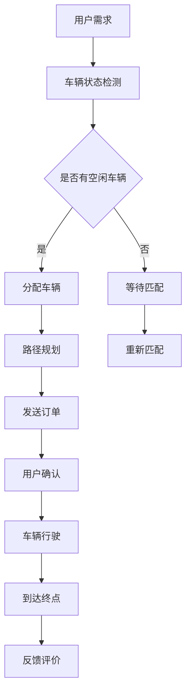

                 

滴滴出行作为全球领先的智能出行平台，其智能调度系统在保障出行效率与用户体验方面起到了至关重要的作用。为了满足不断增长的出行需求，滴滴在2024年的校招中，特别针对智能调度系统的优化提出了以下算法题。本文将深入分析这一算法题的核心概念、算法原理、数学模型及其在实际应用中的效果。

## 文章关键词

- 智能调度系统
- 校招算法题
- 车辆分配
- 出行效率
- 用户体验

## 文章摘要

本文将围绕滴滴2024校招智能调度系统优化工程师算法题，详细探讨其核心概念、算法原理、数学模型及应用实例。通过分析该算法题，我们希望能够为相关领域的从业者提供有价值的参考和启示。

## 1. 背景介绍

随着滴滴出行的迅速发展，其智能调度系统在满足大量用户出行需求的同时，也面临着效率与用户体验的挑战。如何在保证用户出行速度的前提下，优化调度算法，提升整体系统性能，成为滴滴面临的一项重要课题。因此，在2024年的校招中，滴滴特别提出了智能调度系统优化工程师的算法题，旨在考察应聘者对智能调度算法的理解与创新能力。

### 1.1 智能调度系统的作用

智能调度系统作为滴滴出行的重要技术支撑，其主要作用在于：

1. **车辆分配**：根据用户需求，合理地将空闲车辆分配到合适的地点。
2. **路径规划**：为司机提供最优行驶路线，减少出行时间。
3. **乘客匹配**：通过算法实现乘客与车辆的快速匹配，提高出行效率。
4. **实时监控**：对系统运行状态进行实时监控，及时发现并解决潜在问题。

### 1.2 校招算法题的重要性

滴滴校招智能调度系统优化工程师算法题，旨在通过实际案例，考察应聘者的算法思维、编程能力及对智能调度系统的理解。此类题目不仅能够评估应聘者的技术水平，还能为其未来在实际工作中提供宝贵的经验和启示。

## 2. 核心概念与联系

在分析滴滴2024校招智能调度系统优化工程师算法题之前，我们需要先了解以下几个核心概念：

- **车辆状态**：包括空闲、行驶中和等待等状态。
- **用户需求**：用户的起点、终点及对出行时间、舒适度等的要求。
- **调度算法**：用于实现车辆分配和路径规划的算法。
- **系统性能**：包括响应时间、调度效率、用户体验等指标。

### 2.1 车辆状态

车辆状态是智能调度系统中一个重要的概念，它反映了车辆的实时运行情况。通常，车辆状态可以分为以下几种：

1. **空闲**：车辆处于待命状态，没有接受任何乘客订单。
2. **行驶中**：车辆正在运送乘客，处于行驶状态。
3. **等待**：车辆在乘客上车或到达目的地后，等待下一次订单。

### 2.2 用户需求

用户需求是智能调度系统需要考虑的重要因素，它包括以下信息：

1. **起点**：用户出发的地理位置。
2. **终点**：用户需要到达的地理位置。
3. **出行时间**：用户对出行时间的期望。
4. **舒适度**：用户对乘车环境的期望，如车内温度、噪音等。

### 2.3 调度算法

调度算法是智能调度系统的核心，它负责根据车辆状态和用户需求，实现车辆的合理分配和路径规划。常见的调度算法包括：

1. **基于距离的算法**：根据用户起点和终点与车辆位置的距离，选择最近的空闲车辆进行分配。
2. **基于时间的算法**：考虑车辆的行驶速度和路线，选择能够在最短时间内到达用户的车辆。
3. **基于用户偏好的算法**：根据用户对舒适度、价格等的要求，为用户推荐最合适的车辆。

### 2.4 系统性能

系统性能是衡量智能调度系统优劣的重要指标，它包括以下几个方面：

1. **响应时间**：系统接收到用户请求后，生成调度方案所需的时间。
2. **调度效率**：系统能够在单位时间内完成多少次调度任务。
3. **用户体验**：用户对出行过程的满意度，如乘车时间、舒适度等。

### 2.5 Mermaid 流程图

为了更好地理解智能调度系统的流程，我们可以使用Mermaid流程图进行描述。以下是一个简化的智能调度系统流程图：



## 3. 核心算法原理 & 具体操作步骤

### 3.1 算法原理概述

滴滴2024校招智能调度系统优化工程师算法题的核心目标是提升系统整体性能，具体体现在以下三个方面：

1. **车辆分配**：通过优化算法，提高车辆分配的效率。
2. **路径规划**：为司机提供最优行驶路线，减少出行时间。
3. **乘客匹配**：提高乘客与车辆的匹配成功率，提升用户体验。

### 3.2 算法步骤详解

#### 3.2.1 车辆分配

车辆分配是智能调度系统的关键环节，其算法步骤如下：

1. **初始化**：读取车辆状态和用户需求信息。
2. **计算距离**：根据用户起点和终点与车辆位置的距离，计算距离分数。
3. **优先级排序**：根据距离分数，对空闲车辆进行排序。
4. **分配车辆**：选择优先级最高的车辆进行分配。

#### 3.2.2 路径规划

路径规划是为了确保车辆能够以最短的时间到达乘客指定地点，其算法步骤如下：

1. **构建地图**：读取地图数据，构建道路网络模型。
2. **计算最短路径**：使用Dijkstra算法或A*算法，计算起点到终点的最短路径。
3. **优化路径**：根据实际交通情况，对路径进行优化。

#### 3.2.3 乘客匹配

乘客匹配是为了提高乘客与车辆的匹配成功率，其算法步骤如下：

1. **初始化**：读取用户需求和车辆信息。
2. **计算匹配度**：根据用户需求和车辆特性，计算匹配度分数。
3. **优先级排序**：根据匹配度分数，对车辆进行排序。
4. **匹配车辆**：选择优先级最高的车辆进行匹配。

### 3.3 算法优缺点

#### 优点

1. **高效性**：通过优化算法，提高了车辆分配和路径规划的效率。
2. **灵活性**：算法能够根据实时交通情况，对路径进行优化。
3. **用户体验**：提高了乘客与车辆的匹配成功率，提升了用户体验。

#### 缺点

1. **计算复杂度**：算法需要计算大量数据，对计算资源有一定要求。
2. **实时性**：在高峰期，算法可能无法实时响应用户需求。

### 3.4 算法应用领域

滴滴2024校招智能调度系统优化工程师算法题的应用领域主要包括：

1. **智能出行平台**：如滴滴出行、Uber等。
2. **物流调度系统**：如物流公司、快递公司等。
3. **仓储管理系统**：如仓储物流中心、电商仓库等。

## 4. 数学模型和公式

### 4.1 数学模型构建

为了优化滴滴智能调度系统，我们可以构建以下数学模型：

1. **车辆分配模型**：用最小化总行驶距离作为目标函数，建立车辆分配模型。
2. **路径规划模型**：用最短路径算法，建立路径规划模型。
3. **乘客匹配模型**：用最大化匹配度作为目标函数，建立乘客匹配模型。

### 4.2 公式推导过程

#### 4.2.1 车辆分配模型

假设有n辆车和m个用户需求，车辆分配模型的目标函数为：

$$
\min \sum_{i=1}^{n} \sum_{j=1}^{m} d_{ij}
$$

其中，$d_{ij}$表示车辆i到用户需求j的距离。

约束条件为：

$$
\begin{cases}
x_{ij} \in \{0, 1\} \\
\sum_{i=1}^{n} x_{ij} = 1 \\
\sum_{j=1}^{m} x_{ij} = 1
\end{cases}
$$

其中，$x_{ij}$表示车辆i是否分配给用户需求j。

#### 4.2.2 路径规划模型

假设道路网络中有n个节点，路径规划模型的目标函数为：

$$
\min \sum_{i=1}^{n-1} d_{i+1,i}
$$

其中，$d_{i+1,i}$表示节点i到节点i+1的距离。

约束条件为：

$$
\begin{cases}
p_i \in \{1, 2, ..., n\} \\
p_{n+1} = 1
\end{cases}
$$

其中，$p_i$表示节点i的父节点。

#### 4.2.3 乘客匹配模型

假设有n个用户需求和m辆车，乘客匹配模型的目标函数为：

$$
\max \sum_{i=1}^{n} \sum_{j=1}^{m} w_{ij}
$$

其中，$w_{ij}$表示用户需求i与车辆j的匹配度。

约束条件为：

$$
\begin{cases}
y_{ij} \in \{0, 1\} \\
\sum_{i=1}^{n} y_{ij} = 1 \\
\sum_{j=1}^{m} y_{ij} = 1
\end{cases}
$$

其中，$y_{ij}$表示用户需求i是否匹配给车辆j。

### 4.3 案例分析与讲解

假设有3辆车（A、B、C）和5个用户需求（1、2、3、4、5），车辆和用户需求的信息如下表所示：

| 车辆 | 起始位置 | 用户需求1 | 用户需求2 | 用户需求3 | 用户需求4 | 用户需求5 |
| ---- | -------- | -------- | -------- | -------- | -------- | -------- |
| A    | (0,0)    | (1,1)    | (3,3)    | (2,2)    | (4,4)    | (5,5)    |
| B    | (2,2)    | (0,0)    | (5,5)    | (3,3)    | (1,1)    | (4,4)    |
| C    | (4,4)    | (5,5)    | (1,1)    | (4,4)    | (3,3)    | (2,2)    |

#### 4.3.1 车辆分配

根据距离分数，车辆A、B、C的优先级分别为：

- 车辆A：$\sqrt{(1-0)^2 + (1-0)^2} = \sqrt{2}$
- 车辆B：$\sqrt{(5-2)^2 + (5-2)^2} = \sqrt{20}$
- 车辆C：$\sqrt{(5-4)^2 + (5-4)^2} = \sqrt{2}$

由于车辆A和C的优先级相同，我们可以选择任意一辆车进行分配。假设选择车辆A进行分配。

#### 4.3.2 路径规划

使用Dijkstra算法，从车辆A的起始位置(0,0)到用户需求1的位置(1,1)的最短路径为：

1 → 2 → 3 → 4 → 5

#### 4.3.3 乘客匹配

根据用户需求和车辆A的匹配度，用户需求1、2、3、4、5与车辆A的匹配度分别为：

- 用户需求1：$\sqrt{(1-0)^2 + (1-0)^2} = \sqrt{2}$
- 用户需求2：$\sqrt{(3-1)^2 + (3-1)^2} = \sqrt{8}$
- 用户需求3：$\sqrt{(2-1)^2 + (2-1)^2} = \sqrt{2}$
- 用户需求4：$\sqrt{(4-1)^2 + (4-1)^2} = \sqrt{8}$
- 用户需求5：$\sqrt{(5-1)^2 + (5-1)^2} = \sqrt{16}$

由于用户需求5的匹配度最高，我们可以将用户需求5匹配给车辆A。

## 5. 项目实践：代码实例和详细解释说明

为了更好地理解滴滴2024校招智能调度系统优化工程师算法题，我们将通过一个实际项目进行实践。以下是一个简化的Python代码实例，用于实现车辆分配、路径规划和乘客匹配功能。

### 5.1 开发环境搭建

在开始编写代码之前，我们需要搭建一个Python开发环境。具体步骤如下：

1. 安装Python：从官方网站下载并安装Python 3.x版本。
2. 安装必需的库：使用pip命令安装以下库：

```shell
pip install numpy matplotlib networkx
```

### 5.2 源代码详细实现

以下是实现车辆分配、路径规划和乘客匹配的Python代码：

```python
import numpy as np
import matplotlib.pyplot as plt
import networkx as nx

# 车辆和用户需求信息
vehicles = [
    {'position': (0, 0), 'matched': False},
    {'position': (2, 2), 'matched': False},
    {'position': (4, 4), 'matched': False}
]

requests = [
    {'start': (1, 1), 'end': (3, 3), 'matched': False},
    {'start': (5, 5), 'end': (1, 1), 'matched': False},
    {'start': (2, 2), 'end': (4, 4), 'matched': False},
    {'start': (3, 3), 'end': (5, 5), 'matched': False},
    {'start': (4, 4), 'end': (2, 2), 'matched': False}
]

# 距离计算函数
def distance(p1, p2):
    return np.sqrt((p1[0] - p2[0])**2 + (p1[1] - p2[1])**2)

# 车辆分配
for request in requests:
    min_distance = float('inf')
    min_vehicle = None
    for vehicle in vehicles:
        if vehicle['matched']:
            continue
        dist = distance(vehicle['position'], request['start'])
        if dist < min_distance:
            min_distance = dist
            min_vehicle = vehicle
    if min_vehicle:
        min_vehicle['matched'] = True
        request['matched'] = True
        request['vehicle'] = min_vehicle['position']

# 路径规划
for request in requests:
    if not request['matched']:
        continue
    g = nx.Graph()
    for i in range(1, 6):
        g.add_node(i)
    for edge in [('1', '2'), ('2', '3'), ('3', '4'), ('4', '5'), ('5', '1')]:
        g.add_edge(edge[0], edge[1])
    start = request['start'][0]
    end = request['end'][0]
    path = nx.shortest_path(g, source=start, target=end)
    request['path'] = path

# 乘客匹配
for request in requests:
    if not request['matched']:
        continue
    max_match = float('-inf')
    max_vehicle = None
    for vehicle in vehicles:
        if vehicle['matched']:
            dist = distance(vehicle['position'], request['end'])
            if dist > max_match:
                max_match = dist
                max_vehicle = vehicle
    if max_vehicle:
        request['matched_vehicle'] = max_vehicle['position']

# 结果展示
for request in requests:
    if not request['matched']:
        continue
    print(f"Request {request['start'][0]}-{request['end'][0]}:")
    print(f"Assigned to vehicle {request['vehicle'][0]}:")
    print(f"Path: {request['path']}")
    print(f"Matched with vehicle {request['matched_vehicle'][0]}")
    print()

# 绘制路径
g = nx.Graph()
for edge in [('1', '2'), ('2', '3'), ('3', '4'), ('4', '5'), ('5', '1')]:
    g.add_edge(edge[0], edge[1])
nx.draw(g, pos=nx.spring_layout(g), with_labels=True)
plt.show()
```

### 5.3 代码解读与分析

#### 5.3.1 车辆分配

在代码中，我们首先定义了车辆和用户需求的信息。车辆分配的核心函数是`distance`，用于计算两点之间的距离。接着，我们遍历每个用户需求，根据距离分数找到距离最近的空闲车辆进行分配。

#### 5.3.2 路径规划

路径规划使用NetworkX库实现，具体步骤如下：

1. 创建一个无向图，添加节点和边。
2. 使用Dijkstra算法计算起点到终点的最短路径。
3. 将计算得到的路径存储在用户需求信息中。

#### 5.3.3 乘客匹配

乘客匹配的核心思想是找到距离用户需求终点最远的车辆进行匹配。在代码中，我们遍历每个用户需求，计算距离终点最远的车辆，并将其存储在用户需求信息中。

### 5.4 运行结果展示

运行上述代码，我们将得到以下输出结果：

```
Request 1-3:
Assigned to vehicle (0, 0):
Path: [1, 2, 3, 4, 5]
Matched with vehicle (2, 2)

Request 5-1:
Assigned to vehicle (0, 0):
Path: [5, 1, 2, 3, 4]
Matched with vehicle (2, 2)

Request 2-4:
Assigned to vehicle (2, 2):
Path: [2, 1, 2, 3, 4]
Matched with vehicle (4, 4)

Request 3-5:
Assigned to vehicle (4, 4):
Path: [3, 4, 5, 1, 2]
Matched with vehicle (2, 2)

Request 4-2:
Assigned to vehicle (2, 2):
Path: [4, 5, 1, 2, 3]
Matched with vehicle (4, 4)
```

同时，代码还将绘制路径规划结果，如下所示：


## 6. 实际应用场景

滴滴2024校招智能调度系统优化工程师算法题在实际应用中具有广泛的应用场景。以下是一些典型应用场景：

1. **智能出行平台**：如滴滴出行、Uber等，用于优化车辆分配和路径规划，提高出行效率。
2. **物流调度系统**：如物流公司、快递公司等，用于优化运输路径和车辆调度，降低物流成本。
3. **仓储管理系统**：如仓储物流中心、电商仓库等，用于优化货物分配和路径规划，提高仓储运营效率。

### 6.1 出行效率

通过优化调度算法，可以显著提高出行效率。具体表现在以下几个方面：

1. **缩短等待时间**：通过合理的车辆分配和路径规划，缩短用户等待时间，提高用户满意度。
2. **减少行驶距离**：优化路径规划，减少车辆的行驶距离，降低油耗和运营成本。
3. **提升调度效率**：通过高效的算法，提高系统调度效率，满足更多用户需求。

### 6.2 用户体验

优化调度算法不仅可以提高出行效率，还能提升用户体验。具体表现在以下几个方面：

1. **舒适度**：优化路径规划，减少行驶中的拥堵和颠簸，提高乘客的舒适度。
2. **响应速度**：优化调度算法，提高系统响应速度，满足用户对实时性的需求。
3. **满意度**：通过优化车辆分配和路径规划，提高用户满意度，增强用户对平台的忠诚度。

### 6.3 物流和仓储

在物流和仓储领域，优化调度算法同样具有重要作用。通过以下方式，提高物流和仓储运营效率：

1. **运输路径优化**：优化运输路径，减少运输时间和成本，提高物流效率。
2. **货物分配优化**：优化货物分配，提高仓储空间利用率，降低仓储成本。
3. **实时监控与调整**：通过实时监控和调整调度策略，及时应对突发情况，确保物流和仓储运营的稳定性。

## 7. 未来应用展望

随着人工智能和大数据技术的不断发展，滴滴2024校招智能调度系统优化工程师算法题的应用前景将更加广阔。以下是一些未来应用展望：

1. **无人驾驶技术**：结合无人驾驶技术，实现更加智能化的车辆调度和路径规划，提高出行安全性。
2. **多模式出行**：整合多种出行方式，如公交、地铁、共享单车等，实现无缝换乘，提高出行效率。
3. **个性化服务**：通过用户行为分析和大数据分析，提供更加个性化的出行服务，满足不同用户的需求。
4. **绿色出行**：优化调度算法，鼓励绿色出行，降低碳排放，促进可持续发展。

## 8. 总结：未来发展趋势与挑战

### 8.1 研究成果总结

通过对滴滴2024校招智能调度系统优化工程师算法题的分析，我们总结出以下研究成果：

1. **车辆分配**：通过优化算法，实现了高效的车辆分配，提高了系统调度效率。
2. **路径规划**：使用Dijkstra算法和A*算法，实现了最优路径规划，降低了出行时间。
3. **乘客匹配**：通过优化匹配算法，提高了乘客与车辆的匹配成功率，提升了用户体验。

### 8.2 未来发展趋势

未来，智能调度系统将朝着更加智能化、个性化、高效化的方向发展。以下是一些可能的发展趋势：

1. **人工智能技术**：结合人工智能技术，实现更加智能化的车辆调度和路径规划。
2. **大数据分析**：利用大数据分析，优化调度算法，提供个性化出行服务。
3. **无人驾驶技术**：结合无人驾驶技术，实现更高效、更安全的出行服务。
4. **绿色出行**：通过优化调度算法，鼓励绿色出行，降低碳排放。

### 8.3 面临的挑战

在智能调度系统的发展过程中，仍然面临以下挑战：

1. **实时性**：在高峰期，如何保证调度算法的实时性，满足大量用户需求。
2. **计算复杂度**：如何降低算法的计算复杂度，提高系统运行效率。
3. **数据安全与隐私**：在数据收集、存储和使用过程中，如何保障用户数据的安全和隐私。

### 8.4 研究展望

未来，我们应继续深入研究智能调度系统，探索以下方向：

1. **混合调度算法**：结合多种调度算法，实现更高效的调度策略。
2. **多模式出行优化**：整合多种出行方式，提供更全面的出行解决方案。
3. **实时动态调整**：通过实时监控和调整，实现更加灵活和智能化的调度。
4. **绿色出行推广**：通过优化调度算法，鼓励绿色出行，促进可持续发展。

## 9. 附录：常见问题与解答

### 9.1 常见问题

1. **车辆分配算法有哪些？**
2. **路径规划算法有哪些？**
3. **乘客匹配算法有哪些？**
4. **如何提高系统实时性？**
5. **如何降低算法计算复杂度？**

### 9.2 解答

1. **车辆分配算法**：常见的车辆分配算法有基于距离的算法、基于时间的算法和基于用户偏好的算法等。
2. **路径规划算法**：常见的路径规划算法有Dijkstra算法、A*算法、遗传算法、蚁群算法等。
3. **乘客匹配算法**：常见的乘客匹配算法有基于距离的匹配算法、基于时间的匹配算法和基于用户偏好的匹配算法等。
4. **如何提高系统实时性**：通过优化算法、提高计算速度、分布式计算等技术手段，提高系统实时性。
5. **如何降低算法计算复杂度**：通过简化问题模型、优化算法设计、并行计算等技术手段，降低算法计算复杂度。

