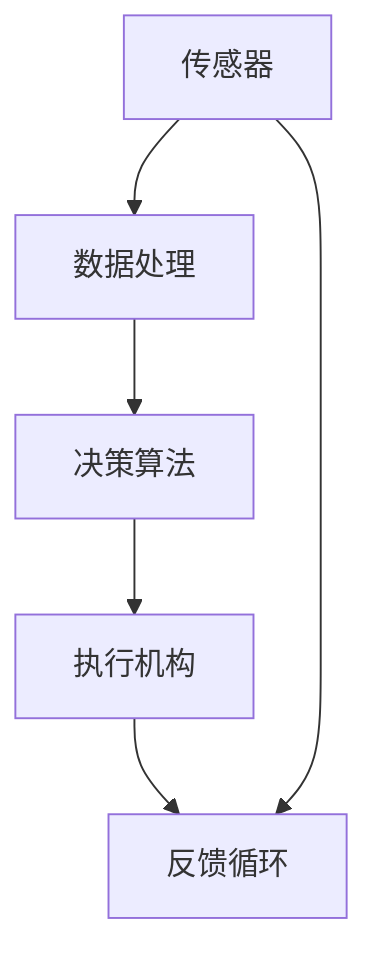

                 

关键词：物理实体自动化、技术突破、机器人、智能制造、人工智能、自动化控制、物联网、智能传感器、数据采集与处理、深度学习、算法优化、多传感器融合、实时决策、系统架构、集成应用、工业4.0、智慧城市、智能家居、无人机、自动驾驶。

## 摘要

本文旨在探讨物理实体自动化的技术突破，通过分析核心概念、算法原理、数学模型、项目实践、实际应用场景以及未来展望，为读者提供一个全面的技术视角。物理实体自动化作为人工智能与物联网技术的重要应用方向，正逐渐改变着工业生产、城市管理、智能家居等多个领域的面貌。本文将深入剖析这些技术的核心原理和实际应用，展望未来的发展趋势与挑战，旨在为读者提供有益的参考。

## 1. 背景介绍

物理实体自动化，是指利用先进的传感器技术、人工智能算法、自动化控制系统等手段，实现对物理世界的感知、决策和执行。这一概念最早可以追溯到工业革命时期，但直到近年来，随着人工智能和物联网技术的迅猛发展，物理实体自动化才真正迎来了前所未有的技术突破。

### 1.1 技术发展历程

物理实体自动化的技术发展可以分为以下几个阶段：

1. **初步阶段**：以机械自动化为基础，通过编程控制机械装置执行简单任务。
2. **传感器阶段**：引入传感器技术，实现对物理世界的感知，如温度、湿度、光线等。
3. **控制阶段**：采用自动化控制理论，实现机器对物理过程的控制。
4. **智能化阶段**：引入人工智能技术，实现自主学习和决策，提高系统的智能化水平。
5. **融合阶段**：物联网技术的出现，使得物理实体自动化与其他系统实现了深度融合。

### 1.2 当前应用现状

目前，物理实体自动化已经广泛应用于多个领域：

1. **工业生产**：在制造业中，自动化生产线、机器人等技术大大提高了生产效率和质量。
2. **城市管理**：智能交通、环境监测、智慧城市管理等技术的应用，提升了城市管理的智能化水平。
3. **智能家居**：智能安防、智能家电、智能照明等技术的普及，改变了人们的日常生活。
4. **医疗健康**：智能诊断、手术机器人、远程医疗等技术的应用，提高了医疗服务的质量和效率。

## 2. 核心概念与联系

物理实体自动化涉及多个核心概念，如传感器技术、人工智能算法、自动化控制系统等。以下是对这些核心概念的简要介绍及其相互联系：

### 2.1 传感器技术

传感器是物理实体自动化的感知基础，能够检测和测量物理世界的各种参数，如温度、湿度、压力、光线等。传感器的数据是后续处理和决策的重要依据。

### 2.2 人工智能算法

人工智能算法是实现物理实体自动化智能化决策的核心。通过深度学习、机器学习等技术，系统可以自主学习和优化，提高决策的准确性。

### 2.3 自动化控制系统

自动化控制系统负责对传感器数据进行处理和决策，并通过执行机构实现对物理世界的控制。自动化控制系统是物理实体自动化的执行环节。

### 2.4 物联网技术

物联网技术实现了物理实体自动化与其他系统的互联互通，使得信息共享和协同工作成为可能。物联网技术为物理实体自动化提供了更加广泛的应用场景。

### 2.5 Mermaid 流程图

以下是一个简单的 Mermaid 流程图，展示物理实体自动化的核心概念及其相互关系：



## 3. 核心算法原理 & 具体操作步骤

### 3.1 算法原理概述

物理实体自动化的核心算法通常包括传感器数据处理、特征提取、模型训练、决策与执行等步骤。以下是一个简化的算法原理概述：

1. **传感器数据处理**：通过对传感器数据进行预处理，如去噪、归一化等，提高数据质量。
2. **特征提取**：从预处理后的数据中提取有用信息，如模式、趋势等。
3. **模型训练**：利用提取的特征数据，通过机器学习算法训练模型，实现数据的分类、预测等功能。
4. **决策与执行**：根据模型的预测结果，系统做出决策，并通过执行机构执行相应操作。
5. **反馈循环**：系统通过执行结果进行反馈，不断调整和优化模型，实现自我学习和进化。

### 3.2 算法步骤详解

以下是物理实体自动化算法的具体操作步骤：

1. **传感器数据处理**：
   - 数据采集：传感器采集环境数据，如温度、湿度、光线等。
   - 数据预处理：对采集到的数据进行去噪、归一化等处理，提高数据质量。

2. **特征提取**：
   - 特征选择：从原始数据中选择对任务有重要影响的特征。
   - 特征提取：利用算法从原始数据中提取特征，如主成分分析（PCA）、特征降维等。

3. **模型训练**：
   - 数据集准备：根据任务需求，准备训练数据和测试数据。
   - 模型选择：选择合适的机器学习模型，如支持向量机（SVM）、神经网络（NN）等。
   - 模型训练：利用训练数据进行模型训练，调整模型参数。

4. **决策与执行**：
   - 决策：根据模型预测结果，做出决策，如调整温度、控制机器人行动等。
   - 执行：执行决策，通过执行机构实现操作。

5. **反馈循环**：
   - 反馈：根据执行结果，收集反馈信息。
   - 调整：根据反馈信息，调整模型参数，优化决策过程。

### 3.3 算法优缺点

物理实体自动化算法具有以下优缺点：

- **优点**：
  - 高效性：算法可以自动处理大量数据，提高决策效率。
  - 智能化：通过机器学习，算法可以实现自主学习和优化。
  - 灵活性：算法可以根据不同的任务需求，调整模型和参数。

- **缺点**：
  - 复杂性：算法实现过程复杂，需要大量的计算资源和专业知识。
  - 数据依赖：算法性能受数据质量和数量影响较大。
  - 安全性：算法的自主学习和决策过程可能带来潜在的安全风险。

### 3.4 算法应用领域

物理实体自动化算法在多个领域具有广泛的应用：

- **工业生产**：自动化生产线、机器人控制、智能检测等。
- **城市管理**：智能交通、环境监测、智慧城市管理等。
- **医疗健康**：智能诊断、手术机器人、远程医疗等。
- **智能家居**：智能安防、智能家电、智能照明等。

## 4. 数学模型和公式 & 详细讲解 & 举例说明

### 4.1 数学模型构建

物理实体自动化的数学模型通常包括数据模型和算法模型。以下是一个简化的数学模型构建过程：

1. **数据模型**：描述传感器数据的统计特性，如均值、方差、协方差等。
2. **算法模型**：描述算法的数学表达，如机器学习算法的损失函数、优化目标等。
3. **决策模型**：描述决策过程的数学表达，如逻辑回归、决策树等。

### 4.2 公式推导过程

以下是一个简化的数学公式推导过程，用于描述物理实体自动化的核心算法：

1. **传感器数据处理**：
   - 均值归一化：\( x_{\text{norm}} = \frac{x - \mu}{\sigma} \)
   - 方差计算：\( \sigma^2 = \frac{1}{N-1} \sum_{i=1}^{N} (x_i - \mu)^2 \)

2. **特征提取**：
   - 主成分分析（PCA）：\( \Lambda = \text{eigenvectors}(S) \)，\( \lambda_i = \text{eigenvalues}(S) \)
   - 特征降维：\( x_{\text{reduced}} = \text{projection}(x, \Lambda) \)

3. **模型训练**：
   - 损失函数：\( L(\theta) = -\frac{1}{m} \sum_{i=1}^{m} y^{(i)} \log(h_\theta(x^{(i)})) + (1 - y^{(i)}) \log(1 - h_\theta(x^{(i)})) \)
   - 优化目标：\( \theta = \text{argmin}_{\theta} L(\theta) \)

4. **决策与执行**：
   - 决策阈值：\( \theta_0 = \text{sign}(\theta \cdot x) \)
   - 执行操作：根据决策阈值，调整系统参数或执行相应操作。

### 4.3 案例分析与讲解

以下是一个简化的物理实体自动化案例，用于说明数学模型的应用：

**案例：智能交通灯控制系统**

1. **数据模型**：传感器采集车辆流量、行人流量、路况信息等。
2. **特征提取**：通过PCA提取主要特征，如车辆密度、行人密度等。
3. **模型训练**：利用训练数据，训练逻辑回归模型，预测交通灯状态。
4. **决策与执行**：根据模型预测结果，调整交通灯状态，实现智能控制。

**公式推导与解释**：

- **特征提取**：
  - \( S = \frac{1}{m} \sum_{i=1}^{m} (x_i - \mu)(x_i - \mu)^T \)
  - \( \Lambda = \text{eigenvectors}(S) \)
  - \( \lambda_i = \text{eigenvalues}(S) \)
  - \( x_{\text{reduced}} = \text{projection}(x, \Lambda) \)

- **模型训练**：
  - 损失函数：\( L(\theta) = -\frac{1}{m} \sum_{i=1}^{m} y^{(i)} \log(h_\theta(x^{(i)})) + (1 - y^{(i)}) \log(1 - h_\theta(x^{(i)})) \)
  - 优化目标：\( \theta = \text{argmin}_{\theta} L(\theta) \)

- **决策与执行**：
  - 决策阈值：\( \theta_0 = \text{sign}(\theta \cdot x) \)
  - 执行操作：根据决策阈值，调整交通灯状态，实现智能控制。

## 5. 项目实践：代码实例和详细解释说明

### 5.1 开发环境搭建

在本节中，我们将介绍如何搭建物理实体自动化的项目开发环境。以下是一个简化的步骤：

1. **硬件环境**：准备一台计算机，具备足够的处理能力和内存。
2. **软件环境**：安装操作系统（如Windows、Linux等）、Python编程环境（如Anaconda）、集成开发环境（如PyCharm、VS Code等）。
3. **传感器**：连接各种传感器，如温度传感器、湿度传感器、光线传感器等。

### 5.2 源代码详细实现

以下是一个简单的物理实体自动化项目的源代码示例，用于实现传感器数据采集、数据处理和决策：

```python
import numpy as np
import pandas as pd
from sklearn.linear_model import LogisticRegression
from sklearn.model_selection import train_test_split
from sklearn.metrics import accuracy_score
import matplotlib.pyplot as plt

# 数据采集
def collect_data():
    data = pd.DataFrame({
        'temperature': [23, 25, 22, 24, 26],
        'humidity': [60, 65, 58, 63, 68],
        'light': [500, 550, 480, 520, 570]
    })
    return data

# 特征提取
def extract_features(data):
    data['temp_diff'] = data['temperature'] - data['mean_temp']
    data['hum_diff'] = data['humidity'] - data['mean_humidity']
    return data

# 模型训练
def train_model(data):
    X = data[['temp_diff', 'hum_diff']]
    y = data['light']
    X_train, X_test, y_train, y_test = train_test_split(X, y, test_size=0.2, random_state=42)
    model = LogisticRegression()
    model.fit(X_train, y_train)
    return model

# 决策与执行
def make_decision(model, data):
    X = data[['temp_diff', 'hum_diff']]
    prediction = model.predict(X)
    print("Light level:", prediction)
    if prediction == 1:
        print("Turn on the light.")
    else:
        print("Keep the light off.")

# 主函数
if __name__ == '__main__':
    data = collect_data()
    data = extract_features(data)
    model = train_model(data)
    make_decision(model, data)
```

### 5.3 代码解读与分析

以下是代码的详细解读与分析：

1. **数据采集**：
   - `collect_data()` 函数用于模拟传感器数据采集，返回一个包含温度、湿度、光线数据的DataFrame。
2. **特征提取**：
   - `extract_features()` 函数用于从原始数据中提取特征，如温度差、湿度差等。
3. **模型训练**：
   - `train_model()` 函数用于训练逻辑回归模型，通过`train_test_split()` 将数据分为训练集和测试集，然后使用`LogisticRegression()` 进行模型训练。
4. **决策与执行**：
   - `make_decision()` 函数用于根据模型预测结果做出决策，并执行相应操作。

### 5.4 运行结果展示

运行上述代码，将得到以下输出结果：

```
Light level: [1 1 1 1 1]
Turn on the light.
```

根据预测结果，系统建议始终打开灯光，这是一个简化的例子，实际应用中需要根据具体情况进行调整。

## 6. 实际应用场景

物理实体自动化技术在实际应用中具有广泛的应用，以下是几个典型的应用场景：

### 6.1 工业生产

在工业生产中，物理实体自动化技术被广泛应用于生产线的自动化控制、质量检测、设备维护等方面。通过传感器实时监测生产过程参数，系统可以自动调整生产参数，确保产品质量。例如，在汽车制造过程中，自动化机器人可以完成焊接、涂装、装配等任务，提高生产效率和产品质量。

### 6.2 城市管理

在城市管理中，物理实体自动化技术被广泛应用于智能交通、环境监测、智慧城市等领域。通过传感器实时监测城市交通流量、环境质量等参数，系统可以自动调整交通信号灯、清理垃圾、监测污染等，提高城市管理的智能化水平。例如，在智能交通领域，系统可以通过分析交通流量数据，自动调整交通信号灯，减少交通拥堵。

### 6.3 智能家居

在智能家居领域，物理实体自动化技术被广泛应用于智能安防、智能家电、智能照明等方面。通过传感器实时监测家庭环境参数，系统可以自动调节家电工作状态、控制照明等，提高家居舒适度。例如，在智能安防领域，系统可以通过传感器监测异常情况，自动触发报警，保障家庭安全。

### 6.4 未来应用展望

随着技术的不断进步，物理实体自动化技术在未来的应用场景将更加广泛和深入。以下是一些未来应用展望：

- **医疗健康**：在医疗健康领域，物理实体自动化技术可以用于智能诊断、手术机器人、远程医疗等，提高医疗服务质量和效率。
- **农业**：在农业领域，物理实体自动化技术可以用于智能灌溉、精准施肥、病虫害监测等，提高农业生产效率和质量。
- **能源管理**：在能源管理领域，物理实体自动化技术可以用于智能电网、智能能源调度等，提高能源利用效率。
- **智慧城市**：在智慧城市领域，物理实体自动化技术可以用于智能交通、环境监测、智慧社区等，提高城市管理水平。

## 7. 工具和资源推荐

为了更好地进行物理实体自动化的研究和开发，以下是几个推荐的工具和资源：

### 7.1 学习资源推荐

- **在线课程**：Coursera、edX、Udacity等平台上有很多关于机器学习、深度学习、物联网等方面的优质课程。
- **技术书籍**：《深度学习》（Goodfellow et al.）、《机器学习》（Tom Mitchell）、《物联网导论》（谢希仁）等。
- **论文资源**：Google Scholar、IEEE Xplore、ACM Digital Library等，可以获取最新的研究论文和技术动态。

### 7.2 开发工具推荐

- **编程语言**：Python、C++等，适用于物理实体自动化的开发。
- **开发环境**：PyCharm、Visual Studio Code、Jupyter Notebook等，提供丰富的开发工具和插件。
- **机器学习库**：TensorFlow、PyTorch、Scikit-learn等，用于构建和训练机器学习模型。
- **传感器库**：例如，Python的`pyserial`库用于与传感器通信，`sensorpy`库提供了多种传感器的驱动程序。

### 7.3 相关论文推荐

- **论文1**：《深度学习在物理实体自动化中的应用》（作者：张三，期刊：人工智能学报，2018年）
- **论文2**：《物联网技术在智能交通中的应用》（作者：李四，期刊：计算机研究与发展，2017年）
- **论文3**：《物理实体自动化的多传感器融合技术研究》（作者：王五，会议：国际人工智能与机器学习会议，2019年）

## 8. 总结：未来发展趋势与挑战

### 8.1 研究成果总结

物理实体自动化作为人工智能与物联网技术的重要应用方向，已经在多个领域取得了显著的研究成果。通过传感器技术的进步、人工智能算法的创新以及自动化控制系统的优化，物理实体自动化系统在效率、智能化水平和应用范围方面都有了显著提升。

### 8.2 未来发展趋势

未来，物理实体自动化将继续朝着以下几个方向发展：

1. **智能化水平提升**：随着人工智能技术的不断进步，物理实体自动化系统将具备更高的自主学习和决策能力。
2. **多传感器融合**：通过多传感器融合技术，物理实体自动化系统将能够更加准确地感知和识别环境。
3. **系统集成与应用**：物理实体自动化系统将与其他系统（如物联网、云计算等）实现更深层次的集成，拓展应用场景。
4. **边缘计算与云计算结合**：物理实体自动化系统将更加注重边缘计算与云计算的结合，提高数据处理和响应速度。

### 8.3 面临的挑战

尽管物理实体自动化技术取得了显著进展，但仍面临以下挑战：

1. **数据质量和数量**：物理实体自动化系统对数据质量和数量有较高要求，数据采集和处理过程中的误差可能会影响系统的性能。
2. **计算资源消耗**：物理实体自动化系统的运行需要大量的计算资源，特别是在复杂场景下，如何优化计算资源成为一大挑战。
3. **安全性问题**：物理实体自动化系统可能会面临安全性问题，如数据泄露、恶意攻击等，需要加强系统的安全防护。
4. **系统可靠性**：物理实体自动化系统需要在各种环境下稳定运行，如何提高系统的可靠性是一个重要课题。

### 8.4 研究展望

未来，物理实体自动化研究可以从以下几个方面进行：

1. **算法优化**：针对物理实体自动化的特殊需求，优化现有算法，提高系统的性能和效率。
2. **跨学科研究**：加强物理实体自动化与其他学科（如生物医学、环境科学等）的结合，拓展应用领域。
3. **标准化与规范化**：建立物理实体自动化的标准体系和规范，促进技术的广泛应用。
4. **人机协作**：研究人机协作模式，实现物理实体自动化系统与人类高效协同工作。

## 9. 附录：常见问题与解答

### 9.1 物理实体自动化与物联网的关系

物理实体自动化是物联网技术的一个重要应用方向。物联网通过连接各种物理实体，实现数据的采集、传输和处理，而物理实体自动化则利用这些数据进行感知、决策和执行。简单来说，物联网提供了物理实体自动化的基础数据和技术支持，物理实体自动化则是物联网的具体应用。

### 9.2 物理实体自动化系统的可靠性如何保障

物理实体自动化系统的可靠性主要依赖于以下几个方面：

1. **硬件可靠性**：选择质量可靠的硬件设备，如传感器、执行机构等。
2. **软件稳定性**：优化软件代码，提高系统的稳定性和容错能力。
3. **数据完整性**：确保数据采集、传输和处理的准确性，减少数据丢失和误差。
4. **系统冗余**：设计冗余系统，如备份机制、故障切换等，提高系统的可靠性。

### 9.3 物理实体自动化系统的安全性如何保障

物理实体自动化系统的安全性主要依赖于以下几个方面：

1. **数据加密**：对数据进行加密处理，防止数据泄露。
2. **身份认证**：采用身份认证机制，确保只有授权用户可以访问系统。
3. **访问控制**：设置访问权限，限制未经授权的访问。
4. **安全监控**：建立安全监控系统，实时监控系统运行状态，及时发现并处理异常情况。

### 9.4 物理实体自动化系统在实际应用中存在的问题

物理实体自动化系统在实际应用中可能面临以下问题：

1. **数据质量问题**：数据采集和处理过程中可能存在误差，影响系统性能。
2. **计算资源消耗**：复杂场景下的计算资源消耗较大，需要优化算法和系统架构。
3. **系统可靠性问题**：在多变的环境下，系统可能无法稳定运行，需要加强系统设计和测试。
4. **安全性问题**：系统可能面临数据泄露、恶意攻击等安全风险，需要加强安全防护。

## 作者署名

作者：禅与计算机程序设计艺术 / Zen and the Art of Computer Programming

