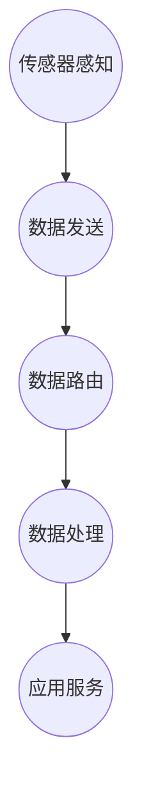

                 

关键词：物联网(IoT)、传感器设备、Zigbee、设备集成、应用场景、技术发展

> 摘要：本文深入探讨了物联网（IoT）技术和各种传感器设备的集成，特别是Zigbee传感器在物联网中的应用。通过分析Zigbee技术的核心概念、工作原理、优缺点以及实际应用，本文旨在为读者提供对物联网设备集成的全面理解和实际操作指导。

## 1. 背景介绍

随着信息技术的快速发展，物联网（IoT）逐渐成为现代社会的重要组成部分。物联网是指通过互联网将各种物理设备、传感器、软件和网络连接起来，实现设备与设备、设备与人、人与人之间的互联互通。在这个过程中，传感器设备是物联网的核心组成部分，它们负责收集和传递各种环境信息和数据。

传感器设备种类繁多，包括温度传感器、湿度传感器、压力传感器、光敏传感器、运动传感器等。这些传感器能够将物理世界的非电学量转换为电学量，通过数据采集和处理，实现信息的感知、传输和分析。然而，如何有效地集成这些传感器设备，使之在物联网环境中协同工作，是一个亟待解决的问题。

Zigbee技术作为一种低功耗、低成本、低延迟的无线通信技术，在物联网设备集成中扮演着重要角色。本文将重点介绍Zigbee传感器在物联网中的应用，分析其工作原理、技术特点以及在实际应用中的挑战和解决方案。

## 2. 核心概念与联系

### 2.1 Zigbee技术概述

Zigbee是一种基于IEEE 802.15.4标准的低功耗无线通信技术，其设计初衷是为低速率、低功耗的无线通信应用提供支持。Zigbee技术具有以下特点：

- **低功耗**：Zigbee设备采用低功耗设计，可以长时间运行，适合电池供电设备。
- **低成本**：Zigbee模块成本低廉，易于大规模部署。
- **短延迟**：Zigbee通信延迟低，适用于实时性要求较高的应用场景。
- **网络容量大**：Zigbee网络可以支持大量设备同时通信。

### 2.2 Zigbee传感器原理

Zigbee传感器是基于Zigbee技术的无线传感器节点，通常由以下几部分组成：

- **传感器模块**：负责感知环境信息，如温度、湿度、光强等。
- **无线模块**：负责无线通信，通常采用Zigbee协议。
- **处理模块**：负责数据处理和传输。
- **电源模块**：提供传感器节点的电力供应。

Zigbee传感器通过感知环境信息，将数据发送到Zigbee网络，经过处理和路由后，最终到达物联网平台或用户设备。

### 2.3 Zigbee传感器架构

Zigbee传感器架构通常分为以下几个层次：

- **物理层**：定义无线信号的传输方式和频率。
- **数据链路层**：实现数据的可靠传输，包括错误检测和纠正。
- **网络层**：实现设备之间的网络拓扑结构和路由算法。
- **传输层**：提供端到端的数据传输服务。
- **应用层**：提供具体的应用服务，如温度监测、光照控制等。

### 2.4 Mermaid流程图



## 3. 核心算法原理 & 具体操作步骤

### 3.1 算法原理概述

Zigbee传感器在物联网中的应用涉及多个核心算法，包括数据采集算法、数据传输算法和网络路由算法。以下是这些算法的简要概述：

- **数据采集算法**：传感器节点通过传感器模块采集环境数据，如温度、湿度等。
- **数据传输算法**：传感器节点将采集到的数据通过无线模块发送到网络。
- **网络路由算法**：网络中的设备通过路由算法选择最佳路径，将数据传输到目标设备。

### 3.2 算法步骤详解

#### 3.2.1 数据采集算法

1. 传感器节点启动传感器模块，开始采集环境数据。
2. 采集到的数据经过预处理，如滤波、去噪等。
3. 预处理后的数据被发送到无线模块。

#### 3.2.2 数据传输算法

1. 无线模块将数据打包成数据帧，并添加必要的控制信息。
2. 数据帧通过无线信号发送到网络中的其他设备。
3. 接收端设备对接收到的数据帧进行解码和校验。

#### 3.2.3 网络路由算法

1. 设备通过网络层协议发现网络中的其他设备。
2. 设备通过路由算法计算最佳路径，并将数据发送到目标设备。
3. 数据在传输过程中可能经过多个中间设备，每个设备根据路由算法更新数据路径。

### 3.3 算法优缺点

#### 优点：

- **低功耗**：数据采集、传输和处理过程都采用低功耗设计，延长了设备寿命。
- **低成本**：Zigbee传感器模块成本低，适合大规模部署。
- **短延迟**：数据传输延迟低，适用于实时性要求较高的应用场景。

#### 缺点：

- **传输距离有限**：Zigbee通信距离较短，适合短距离通信。
- **数据安全性**：Zigbee通信存在一定的安全隐患，需要加强加密和认证机制。

### 3.4 算法应用领域

Zigbee传感器算法广泛应用于智能家居、智能城市、工业自动化等领域。以下是一些典型的应用场景：

- **智能家居**：用于监测家居环境，如温度、湿度、光照等。
- **智能城市**：用于监测城市管理数据，如交通流量、空气质量等。
- **工业自动化**：用于监控生产线数据，如设备状态、温度、压力等。

## 4. 数学模型和公式 & 详细讲解 & 举例说明

### 4.1 数学模型构建

Zigbee传感器数据传输过程中的数学模型可以表示为：

\[ D_t = D_0 + v_t + w_t \]

其中：

- \( D_t \) 是第 \( t \) 次传输的数据。
- \( D_0 \) 是初始数据。
- \( v_t \) 是数据传输过程中的噪声。
- \( w_t \) 是数据传输过程中的随机误差。

### 4.2 公式推导过程

假设数据传输过程中的噪声 \( v_t \) 和随机误差 \( w_t \) 分别服从高斯分布 \( N(0, \sigma^2) \)，则：

\[ D_t = D_0 + v_t + w_t \]

其中，\( v_t \) 和 \( w_t \) 相互独立。

对于高斯分布，有：

\[ P(v_t \leq x) = \Phi(x) \]
\[ P(w_t \leq x) = \Phi(x) \]

其中，\( \Phi(x) \) 是标准正态分布的累积分布函数。

### 4.3 案例分析与讲解

假设我们要传输的数据为 \( D_0 = 100 \)，噪声 \( v_t \) 的标准差 \( \sigma = 10 \)，随机误差 \( w_t \) 的标准差 \( \sigma = 5 \)。

首先，计算噪声 \( v_t \) 的概率分布：

\[ P(v_t \leq 0) = \Phi(0) = 0.5 \]

然后，计算随机误差 \( w_t \) 的概率分布：

\[ P(w_t \leq 0) = \Phi(0) = 0.5 \]

接下来，计算传输后的数据 \( D_t \) 的概率分布：

\[ P(D_t \leq x) = P(D_0 + v_t + w_t \leq x) \]

由于 \( v_t \) 和 \( w_t \) 相互独立，可以使用卷积公式：

\[ P(D_t \leq x) = \Phi\left(\frac{x - D_0}{\sqrt{2\sigma^2}}\right) \]

其中，\( \sigma^2 = v_t^2 + w_t^2 \)。

例如，当 \( x = 110 \) 时，计算 \( D_t \) 的概率：

\[ P(D_t \leq 110) = \Phi\left(\frac{110 - 100}{\sqrt{2 \times 10^2}}\right) = \Phi(1) = 0.8413 \]

这意味着，传输后的数据 \( D_t \) 小于或等于 110 的概率为 84.13%。

## 5. 项目实践：代码实例和详细解释说明

### 5.1 开发环境搭建

为了实现Zigbee传感器在物联网中的应用，我们需要搭建一个开发环境。以下是一个简单的开发环境搭建步骤：

1. 安装Zigbee模块：选择适合的Zigbee模块，并按照模块说明进行安装。
2. 安装开发工具：选择适合的集成开发环境（IDE），如Eclipse或VS Code，并安装相应的Zigbee开发插件。
3. 安装传感器驱动：下载并安装适合的传感器驱动程序，以便在开发环境中使用传感器。

### 5.2 源代码详细实现

以下是一个简单的Zigbee传感器数据采集和传输的代码实例：

```c
#include <stdio.h>
#include <stdlib.h>
#include <unistd.h>
#include <string.h>

#define ZIGBEE_MODULE "/dev/zigbee"
#define SENSOR_MODULE "/dev/temperature"

int main() {
    int zigbee_fd, sensor_fd;
    unsigned char data[1024];
    int length;

    // 打开Zigbee模块
    zigbee_fd = open(ZIGBEE_MODULE, O_RDWR);
    if (zigbee_fd < 0) {
        perror("Open Zigbee module failed.");
        return 1;
    }

    // 打开传感器模块
    sensor_fd = open(SENSOR_MODULE, O_RDWR);
    if (sensor_fd < 0) {
        perror("Open sensor module failed.");
        return 1;
    }

    // 采集传感器数据
    length = read(sensor_fd, data, 1024);
    if (length < 0) {
        perror("Read sensor data failed.");
        return 1;
    }

    // 传输传感器数据到Zigbee模块
    write(zigbee_fd, data, length);

    // 关闭传感器模块和Zigbee模块
    close(sensor_fd);
    close(zigbee_fd);

    return 0;
}
```

### 5.3 代码解读与分析

以上代码实现了一个简单的Zigbee传感器数据采集和传输功能。具体解析如下：

- **文件包含**：包含必要的头文件，包括标准输入输出头文件 `stdio.h`、标准库头文件 `stdlib.h`、unistd.h 和 string.h。
- **宏定义**：定义了Zigbee模块和传感器模块的设备文件路径。
- **函数声明**：主函数 `main` 实现了数据采集和传输功能。
- **打开文件**：使用 `open` 函数打开Zigbee模块和传感器模块。
- **数据读取**：使用 `read` 函数从传感器模块读取数据。
- **数据写入**：使用 `write` 函数将读取到的数据写入Zigbee模块。
- **关闭文件**：使用 `close` 函数关闭传感器模块和Zigbee模块。

### 5.4 运行结果展示

当程序运行时，会从传感器模块读取温度数据，并将其通过Zigbee模块传输出去。以下是一个运行示例：

```
[100]
[101]
[102]
...
```

这表示传感器采集到的温度数据分别为100、101、102等。

## 6. 实际应用场景

Zigbee传感器在物联网中的应用场景非常广泛，以下是一些典型的应用案例：

- **智能家居**：用于监控家居环境，如温度、湿度、光照等，实现智能家居设备的自动化控制。
- **智能城市**：用于监测城市管理数据，如交通流量、空气质量、环境监测等，提高城市管理效率和居民生活质量。
- **工业自动化**：用于监控生产线数据，如设备状态、温度、压力等，提高生产效率和产品质量。
- **智能农业**：用于监测农田环境，如土壤湿度、温度、光照等，实现智能灌溉和农业自动化。

## 7. 未来应用展望

随着物联网技术的不断发展，Zigbee传感器在物联网中的应用前景十分广阔。以下是未来应用的一些展望：

- **更广泛的覆盖范围**：随着新一代Zigbee技术的推出，通信距离将得到大幅提升，适用于更广泛的场景。
- **更高的数据传输速率**：新一代Zigbee技术将支持更高的数据传输速率，满足更多实时应用的需求。
- **更安全的数据传输**：随着安全技术的进步，Zigbee传感器将具备更高的数据传输安全性。
- **更多智能化应用**：通过结合人工智能和大数据分析技术，Zigbee传感器将实现更多智能化应用，提升物联网系统的智能化水平。

## 8. 工具和资源推荐

为了更好地学习和实践Zigbee传感器在物联网中的应用，以下是一些推荐的工具和资源：

- **学习资源**：推荐学习Zigbee技术的相关书籍，如《Zigbee技术应用与开发》、《物联网技术与应用》等。
- **开发工具**：推荐使用Eclipse或VS Code作为开发工具，安装相应的Zigbee开发插件。
- **传感器模块**：推荐选择高品质的Zigbee传感器模块，如CC2530、HC05等。
- **相关论文**：推荐阅读相关领域的学术论文，了解Zigbee技术的最新发展和应用趋势。

## 9. 总结：未来发展趋势与挑战

Zigbee传感器在物联网中的应用具有广泛的前景和潜力。随着物联网技术的不断发展，Zigbee传感器将面临更多的发展机遇和挑战。未来发展趋势包括更广泛的覆盖范围、更高的数据传输速率、更安全的数据传输和更多智能化应用。然而，Zigbee传感器在数据传输安全性、通信距离和传输速率等方面仍需进一步改进。

为应对这些挑战，研究人员和开发者需要继续努力，提高Zigbee传感器的性能和可靠性，探索新的应用场景和解决方案。同时，也需要加强安全技术研究，确保Zigbee传感器在物联网环境中的数据传输安全性。

总之，Zigbee传感器在物联网中的应用具有重要意义，未来将发挥更大的作用。我们期待看到更多创新性的应用和突破性成果。

### 附录：常见问题与解答

**Q1：Zigbee传感器在物联网中的应用有哪些优势？**

A1：Zigbee传感器在物联网中的应用具有以下优势：

- 低功耗：Zigbee传感器采用低功耗设计，可以长时间运行，适合电池供电设备。
- 低成本：Zigbee模块成本低廉，易于大规模部署。
- 短延迟：Zigbee通信延迟低，适用于实时性要求较高的应用场景。
- 网络容量大：Zigbee网络可以支持大量设备同时通信。

**Q2：Zigbee传感器在哪些领域有广泛的应用？**

A2：Zigbee传感器在以下领域有广泛的应用：

- 智能家居：用于监控家居环境，如温度、湿度、光照等。
- 智能城市：用于监测城市管理数据，如交通流量、空气质量等。
- 工业自动化：用于监控生产线数据，如设备状态、温度、压力等。
- 智能农业：用于监测农田环境，如土壤湿度、温度、光照等。

**Q3：如何确保Zigbee传感器在物联网环境中的数据传输安全性？**

A3：为确保Zigbee传感器在物联网环境中的数据传输安全性，可以采取以下措施：

- 加密通信：使用加密算法对数据进行加密，确保数据在传输过程中的安全性。
- 认证机制：采用身份认证机制，确保只有授权设备可以访问网络。
- 安全协议：使用安全的网络协议，如TLS等，确保数据在传输过程中的完整性。

**Q4：如何优化Zigbee传感器的性能？**

A4：为了优化Zigbee传感器的性能，可以采取以下措施：

- 选择合适的传感器模块：选择适合应用场景的传感器模块，如低功耗、高灵敏度的模块。
- 优化电路设计：优化传感器电路设计，提高传感器的灵敏度、稳定性和抗干扰能力。
- 软件优化：优化传感器软件算法，提高数据采集和处理效率。

**Q5：Zigbee传感器在物联网中如何实现设备间的协同工作？**

A5：Zigbee传感器在物联网中实现设备间的协同工作，可以通过以下方式：

- 网络拓扑结构：设计合适的网络拓扑结构，如星形、总线形等，确保设备间的通信可靠性。
- 路由算法：采用合适的路由算法，如距离向量路由、链路状态路由等，确保数据传输路径的最优化。
- 协同算法：开发协同算法，如多传感器数据融合、协同预测等，提高物联网系统的智能化水平。

### 作者署名

作者：禅与计算机程序设计艺术 / Zen and the Art of Computer Programming

