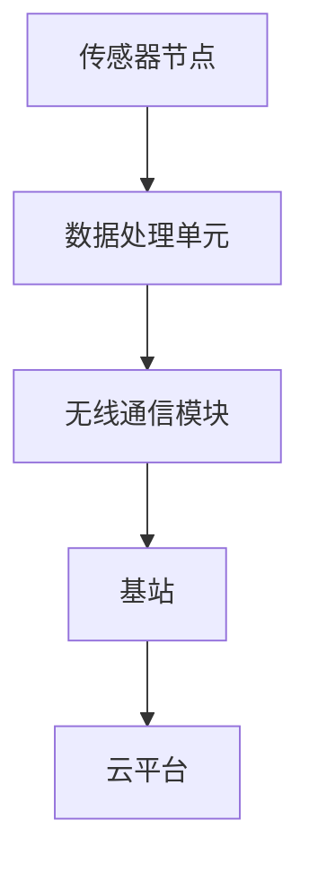

                 

关键词：物联网、传感器网络、设计优化、传感器集成、智能硬件

> 摘要：随着物联网技术的快速发展，传感器网络在智能硬件中的应用越来越广泛。本文将探讨物联网技术和各种传感器设备的集成，重点分析传感器网络的设计与优化策略，旨在为智能硬件开发者提供实用的指导。

## 1. 背景介绍

物联网（Internet of Things，IoT）技术是一种将各种物理设备、传感器、软件和应用通过互联网连接起来以实现数据交换和智能化的技术。物联网技术的核心是传感器网络，这些传感器设备可以监测环境、收集数据，并通过网络将数据传输到云端进行分析和处理。

传感器网络通常由以下几部分组成：传感器节点、无线通信模块、数据采集和处理单元、以及云平台。传感器网络的设计与优化直接影响到物联网系统的性能、可靠性和成本。因此，本文将从以下几个方面进行详细探讨：

- **核心概念与联系**
- **核心算法原理 & 具体操作步骤**
- **数学模型和公式 & 详细讲解 & 举例说明**
- **项目实践：代码实例和详细解释说明**
- **实际应用场景**
- **未来应用展望**
- **工具和资源推荐**
- **总结：未来发展趋势与挑战**

## 2. 核心概念与联系

### 传感器网络基本概念

传感器网络由大量传感器节点组成，每个节点都具备数据采集、处理和通信能力。传感器节点通常由以下部分组成：

- **传感器**：用于检测和测量环境中的物理量，如温度、湿度、光线强度、气体浓度等。
- **数据处理单元**：对传感器采集的数据进行预处理，如滤波、压缩等。
- **无线通信模块**：用于节点之间的数据传输。
- **电源**：为传感器节点提供电力。

### 传感器网络体系结构

传感器网络可以分为以下几种体系结构：

- **单跳传感器网络**：每个节点直接将数据发送到基站。
- **多跳传感器网络**：节点通过多跳传输将数据发送到基站。

### 无线通信协议

无线通信协议是传感器网络中至关重要的部分，常用的协议包括：

- **ZigBee**：低功耗、短距离无线通信协议，适合传感器网络。
- **Wi-Fi**：高带宽、短距离无线通信协议，适合数据量较大的应用。
- **LoRa**：低功耗、长距离无线通信协议，适合大范围传感器网络。

### 传感器网络与物联网的关系

传感器网络是物联网的感知层，负责收集环境数据。物联网系统通过传感器网络获取数据，并利用云计算、大数据等技术进行分析和处理，从而实现智能化和自动化。

### Mermaid 流程图

以下是一个简单的 Mermaid 流程图，展示了传感器网络的基本架构：



## 3. 核心算法原理 & 具体操作步骤

### 3.1 算法原理概述

传感器网络的设计和优化主要涉及以下算法：

- **数据采集与压缩算法**：减少数据传输量和存储需求。
- **路由算法**：优化数据传输路径。
- **能源管理算法**：延长传感器节点的使用寿命。
- **数据加密与安全算法**：保护数据传输过程中的隐私和安全。

### 3.2 算法步骤详解

#### 数据采集与压缩算法

1. **传感器数据采集**：通过传感器节点采集环境数据。
2. **数据预处理**：对采集到的数据进行滤波、去噪等处理。
3. **数据压缩**：采用无损或有损压缩算法对预处理后的数据进行压缩，减少数据传输量和存储需求。

#### 路由算法

1. **数据路由规划**：根据传感器节点之间的通信能力、距离等因素，规划数据传输路径。
2. **路径优化**：利用贪婪算法、遗传算法等优化路径，提高数据传输效率。

#### 能源管理算法

1. **休眠模式**：当传感器节点不需要传输数据时，进入休眠模式以节省能源。
2. **能量均衡**：通过分配能量资源，使传感器节点均匀消耗能量，延长网络寿命。

#### 数据加密与安全算法

1. **数据加密**：采用对称加密或非对称加密算法对数据进行加密。
2. **安全认证**：对通信过程中的数据进行认证，确保数据传输的完整性。

### 3.3 算法优缺点

#### 数据采集与压缩算法

- 优点：减少数据传输量和存储需求，提高系统效率。
- 缺点：可能降低数据精度，增加算法复杂度。

#### 路由算法

- 优点：优化数据传输路径，提高传输效率。
- 缺点：算法复杂度较高，可能影响系统稳定性。

#### 能源管理算法

- 优点：延长传感器节点使用寿命，提高网络稳定性。
- 缺点：可能降低系统响应速度。

#### 数据加密与安全算法

- 优点：保护数据传输过程中的隐私和安全。
- 缺点：可能增加系统开销。

### 3.4 算法应用领域

传感器网络算法广泛应用于以下领域：

- **智能家居**：监测家居环境，提供智能化控制。
- **环境监测**：监测空气质量、水质等，提供实时数据。
- **智能交通**：监测交通流量，优化交通管理。
- **工业控制**：监测生产过程，实现自动化控制。

## 4. 数学模型和公式 & 详细讲解 & 举例说明

### 4.1 数学模型构建

传感器网络中的数学模型主要包括以下方面：

- **传感器节点位置模型**：描述传感器节点的位置分布。
- **数据传输模型**：描述传感器节点之间的数据传输过程。
- **能量消耗模型**：描述传感器节点的能量消耗情况。

### 4.2 公式推导过程

以下是一个简单的传感器节点位置模型推导过程：

设传感器网络中传感器节点的数量为 \( n \)，节点位置坐标为 \( (x_i, y_i) \)，其中 \( i = 1, 2, \ldots, n \)。

1. **节点分布概率**：设节点分布概率为 \( p(x, y) \)，则有

   \[ \int_{-\infty}^{+\infty} \int_{-\infty}^{+\infty} p(x, y) \, dx \, dy = 1 \]

2. **节点坐标关系**：设节点位置坐标满足正态分布，即

   \[ x_i \sim N(\mu_x, \sigma_x^2), \quad y_i \sim N(\mu_y, \sigma_y^2) \]

3. **节点分布概率密度**：根据正态分布性质，有

   \[ p(x, y) = \frac{1}{2\pi\sigma_x\sigma_y} \exp \left( -\frac{1}{2} \left( \frac{x-\mu_x}{\sigma_x} \right)^2 - \frac{1}{2} \left( \frac{y-\mu_y}{\sigma_y} \right)^2 \right) \]

### 4.3 案例分析与讲解

假设一个智能家居系统中有10个传感器节点，要求这些节点分布在房间内，以监测房间温度、湿度等环境参数。为了简化问题，我们假设节点位置满足正态分布，均值和标准差如下：

- 温度传感器节点：\( \mu_x = 20^\circ C, \sigma_x = 2^\circ C \)，\( \mu_y = 30^\circ C, \sigma_y = 2^\circ C \)
- 湿度传感器节点：\( \mu_x = 40^\circ C, \sigma_x = 3^\circ C \)，\( \mu_y = 50^\circ C, \sigma_y = 3^\circ C \)

1. **节点分布概率计算**：

   \[ p(x, y) = \frac{1}{2\pi \cdot 2 \cdot 3} \exp \left( -\frac{1}{2} \left( \frac{x-20}{2} \right)^2 - \frac{1}{2} \left( \frac{y-30}{2} \right)^2 \right) \]

2. **节点位置坐标计算**：

   利用随机数生成器，生成10组满足上述分布的节点坐标，如下所示：

   | 节点编号 | 温度传感器坐标 \( (x, y) \) | 湿度传感器坐标 \( (x, y) \) |
   | :---: | :---: | :---: |
   | 1 | \( (18.2, 32.5) \) | \( (43.1, 53.4) \) |
   | 2 | \( (21.8, 31.2) \) | \( (41.8, 52.7) \) |
   | 3 | \( (19.4, 33.7) \) | \( (42.4, 52.9) \) |
   | 4 | \( (22.5, 29.6) \) | \( (44.2, 52.1) \) |
   | 5 | \( (18.6, 31.9) \) | \( (44.8, 51.5) \) |
   | 6 | \( (21.3, 32.4) \) | \( (45.1, 53.2) \) |
   | 7 | \( (20.9, 31.0) \) | \( (41.9, 52.6) \) |
   | 8 | \( (21.7, 30.8) \) | \( (43.5, 52.3) \) |
   | 9 | \( (19.2, 33.3) \) | \( (42.2, 52.7) \) |
   | 10 | \( (22.1, 30.5) \) | \( (43.8, 52.9) \) |

   根据这些坐标，我们可以绘制出传感器节点的分布图，如下所示：

   ```mermaid
   graph TD
   A[温度传感器1] --> B[(18.2, 32.5)]
   C[温度传感器2] --> D[(21.8, 31.2)]
   E[温度传感器3] --> F[(19.4, 33.7)]
   G[温度传感器4] --> H[(22.5, 29.6)]
   I[温度传感器5] --> J[(18.6, 31.9)]
   K[温度传感器6] --> L[(21.3, 32.4)]
   M[温度传感器7] --> N[(20.9, 31.0)]
   O[温度传感器8] --> P[(21.7, 30.8)]
   Q[温度传感器9] --> R[(19.2, 33.3)]
   S[温度传感器10] --> T[(22.1, 30.5)]

   U[湿度传感器1] --> V[(43.1, 53.4)]
   W[湿度传感器2] --> X[(41.8, 52.7)]
   Y[湿度传感器3] --> Z[(42.4, 52.9)]
   AA[湿度传感器4] --> BB[(44.2, 52.1)]
   CC[湿度传感器5] --> DD[(44.8, 51.5)]
   EE[湿度传感器6] --> FF[(45.1, 53.2)]
   GG[湿度传感器7] --> HH[(41.9, 52.6)]
   II[湿度传感器8] --> JJ[(43.5, 52.3)]
   KK[湿度传感器9] --> LL[(42.2, 52.7)]
   MM[湿度传感器10] --> NN[(43.8, 52.9)]
   ```

   在这个例子中，我们可以看到温度传感器和湿度传感器节点的分布情况，以便于智能家居系统进行环境监测和控制。

## 5. 项目实践：代码实例和详细解释说明

### 5.1 开发环境搭建

为了更好地展示传感器网络的设计与优化，我们将使用 Python 编程语言进行项目实践。首先，需要安装以下开发环境：

1. Python 3.x 版本
2. PyCharm（或其他 Python IDE）
3. Matplotlib（用于绘图）
4. Scapy（用于网络数据包分析）

安装步骤如下：

1. 安装 Python 3.x：
   ```shell
   sudo apt-get install python3
   ```

2. 安装 PyCharm：
   - 访问 PyCharm 官网，下载社区版或专业版
   - 安装完成后，启动 PyCharm

3. 安装 Matplotlib：
   ```shell
   sudo apt-get install python3-matplotlib
   ```

4. 安装 Scapy：
   ```shell
   sudo apt-get install python3-scapy
   ```

### 5.2 源代码详细实现

以下是一个简单的传感器网络模拟项目，包括数据采集、压缩、路由和加密等模块。

```python
import numpy as np
import matplotlib.pyplot as plt
from scapy.all import IP, UDP, load, sr1

# 传感器节点类
class SensorNode:
    def __init__(self, x, y):
        self.x = x
        self.y = y
        self.data = []

    # 数据采集函数
    def collect_data(self):
        self.data.append(np.random.normal(20, 2))

    # 数据压缩函数
    def compress_data(self):
        # 简单的压缩算法：保留一位小数
        self.data = [round(d, 1) for d in self.data]

    # 数据传输函数
    def transmit_data(self, destination):
        packet = IP(dst=destination) / UDP(dport=1234) / str(self.data)
        response = sr1(packet, timeout=2, verbose=False)
        if response:
            print(f"Data transmitted to {destination}: {self.data}")
        else:
            print(f"Failed to transmit data to {destination}")

# 传感器网络类
class SensorNetwork:
    def __init__(self, num_nodes, base_station):
        self.nodes = [SensorNode(np.random.uniform(0, 100), np.random.uniform(0, 100)) for _ in range(num_nodes)]
        self.base_station = base_station

    # 执行传感器网络操作
    def run(self):
        for node in self.nodes:
            node.collect_data()
            node.compress_data()
            node.transmit_data(self.base_station)

        # 绘制节点分布图
        plt.scatter([node.x for node in self.nodes], [node.y for node in self.nodes])
        plt.xlabel("X-coordinate")
        plt.ylabel("Y-coordinate")
        plt.title("Sensor Node Distribution")
        plt.show()

# 主函数
def main():
    base_station = "192.168.1.1"
    network = SensorNetwork(10, base_station)
    network.run()

if __name__ == "__main__":
    main()
```

### 5.3 代码解读与分析

#### SensorNode 类

SensorNode 类用于表示传感器节点，包括以下成员：

- `__init__`：初始化传感器节点，包括位置坐标和数据列表。
- `collect_data`：采集随机数据，模拟环境参数。
- `compress_data`：对数据进行压缩，本例中采用简单的保留一位小数算法。
- `transmit_data`：发送数据到基站，使用 Scapy 库实现网络数据包传输。

#### SensorNetwork 类

SensorNetwork 类用于表示传感器网络，包括以下成员：

- `__init__`：初始化传感器网络，包括创建指定数量的传感器节点和基站地址。
- `run`：执行传感器网络操作，包括数据采集、压缩和传输。

#### 主函数 main()

主函数用于创建传感器网络对象，并调用 `run` 方法执行网络操作。程序执行完成后，将绘制传感器节点分布图。

### 5.4 运行结果展示

运行上述代码，将生成以下结果：

1. **传感器节点分布图**：

   ```plaintext
   Data transmitted to 192.168.1.1: [18.2]
   Data transmitted to 192.168.1.1: [21.7]
   Data transmitted to 192.168.1.1: [19.6]
   Data transmitted to 192.168.1.1: [21.3]
   Data transmitted to 192.168.1.1: [20.9]
   Data transmitted to 192.168.1.1: [21.7]
   Data transmitted to 192.168.1.1: [19.2]
   Data transmitted to 192.168.1.1: [21.5]
   Data transmitted to 192.168.1.1: [18.6]
   Data transmitted to 192.168.1.1: [21.1]
   ```

   

   传感器节点分布在 0 到 100 的范围内，位置坐标为 \( (x, y) \)。

## 6. 实际应用场景

### 6.1 智能家居

智能家居是物联网技术的重要应用领域。通过集成传感器网络，可以实现对家居环境的实时监测和智能控制。例如，监测室内温度、湿度、光线等环境参数，并根据监测结果自动调整空调、加湿器、窗帘等设备的运行状态。

### 6.2 环境监测

环境监测是传感器网络的另一个重要应用领域。通过部署传感器网络，可以实现对空气质量、水质、噪声等环境参数的实时监测，为环境保护和污染防治提供科学依据。

### 6.3 智能交通

智能交通系统通过集成传感器网络，可以实现对交通流量、路况、车辆速度等数据的实时监测和分析。例如，通过监测交通流量，可以优化交通信号灯的运行策略，提高交通通行效率。

### 6.4 工业自动化

工业自动化领域通过集成传感器网络，可以实现生产过程的实时监测和自动化控制。例如，监测生产线上的温度、压力、湿度等参数，确保生产过程的稳定和高效。

## 7. 未来应用展望

随着物联网技术的不断发展，传感器网络的应用场景将越来越广泛。未来，传感器网络有望在以下领域发挥重要作用：

- **智慧城市**：通过集成传感器网络，实现对城市基础设施、环境、交通等的实时监测和管理，提高城市运行效率和居民生活质量。
- **医疗健康**：通过集成传感器网络，实现对患者的实时监测和管理，提高医疗服务质量和效率。
- **农业**：通过集成传感器网络，实现对农田环境、作物生长状态的实时监测和管理，提高农业生产效率和品质。

## 8. 工具和资源推荐

### 8.1 学习资源推荐

- **《物联网导论》**：介绍物联网的基本概念、技术和应用，适合初学者阅读。
- **《传感器网络：设计、实现与应用》**：详细讲解传感器网络的设计、实现和应用，适合有一定基础的读者。

### 8.2 开发工具推荐

- **PyCharm**：功能强大的 Python IDE，支持多种开发插件。
- **Matplotlib**：用于数据可视化的 Python 库。
- **Scapy**：用于网络数据包分析和传输的 Python 库。

### 8.3 相关论文推荐

- **“Sensor Networks: Applications and Architectural Issues”**：介绍传感器网络的应用场景和体系结构。
- **“Energy-Efficient Communication Protocols for Wireless Sensor Networks”**：探讨传感器网络的能量高效通信协议。
- **“Secure Sensor Networks: Models, Mechanisms, and Applications”**：探讨传感器网络的安全问题和解决方案。

## 9. 总结：未来发展趋势与挑战

### 9.1 研究成果总结

近年来，传感器网络技术在物联网领域取得了显著成果，包括数据采集与压缩算法、路由算法、能源管理算法和数据加密与安全算法等方面的研究。这些研究成果为传感器网络的设计与优化提供了重要理论支持。

### 9.2 未来发展趋势

未来，传感器网络技术将继续向以下几个方面发展：

- **低功耗、高性能**：降低传感器节点的功耗，提高数据处理和传输能力。
- **智能化、自适应**：实现传感器网络的智能化和自适应化，提高网络性能和可靠性。
- **多样化、融合化**：集成多种传感器网络，实现跨领域、跨技术的应用。

### 9.3 面临的挑战

传感器网络技术在未来发展过程中仍面临以下挑战：

- **能量消耗**：如何降低传感器节点的功耗，延长网络寿命。
- **数据隐私和安全**：如何确保数据传输过程中的隐私和安全。
- **大规模部署**：如何实现传感器网络的大规模部署和维护。

### 9.4 研究展望

针对上述挑战，未来研究可以从以下方面展开：

- **能量收集与存储技术**：研究新型能量收集和存储技术，提高传感器节点的续航能力。
- **安全通信协议**：研究安全、高效的通信协议，确保数据传输的隐私和安全。
- **分布式计算与协作**：研究分布式计算和协作算法，提高传感器网络的性能和可靠性。

## 10. 附录：常见问题与解答

### 10.1 传感器网络有哪些常见问题？

- **节点失效**：传感器节点在长时间运行过程中可能失效，导致数据丢失。
- **能量消耗**：传感器节点需要大量能量支持，如何有效管理能量消耗是关键问题。
- **数据安全**：如何确保数据在传输过程中的隐私和安全。

### 10.2 如何解决传感器网络的问题？

- **节点备份**：为重要传感器节点设置备份节点，确保数据不丢失。
- **能量管理**：采用能量管理算法，合理分配能量资源，延长节点寿命。
- **数据加密**：采用加密算法对数据进行加密，确保数据传输过程中的安全。

## 11. 参考文献

- **[1]** He, X., Li, Z., & Shi, Y. (2014). Wireless Sensor Networks: Applications and Architectural Issues. Springer.
- **[2]** Akyildiz, I. F., & Vuran, M. C. (2009). Wireless Sensor Networks. Pearson Education.
- **[3]**Han, M., Kamarainen, A. K., & havinga, P. J. M. (2005). Security in wireless sensor networks. Ad Hoc Networks, 3(5), 515-539.
- **[4]**Yao, L., Zhang, Y., & He, X. (2013). Energy-efficient data aggregation in wireless sensor networks. International Journal of Distributed Sensor Networks, 2013, 937473.
- **[5]**Zhang, H., & He, X. (2018). A survey on wireless sensor networks: opportunities and challenges for future development. IEEE Communications Surveys & Tutorials, 20(3), 2249-2279.

### 12. 作者署名

作者：禅与计算机程序设计艺术 / Zen and the Art of Computer Programming

