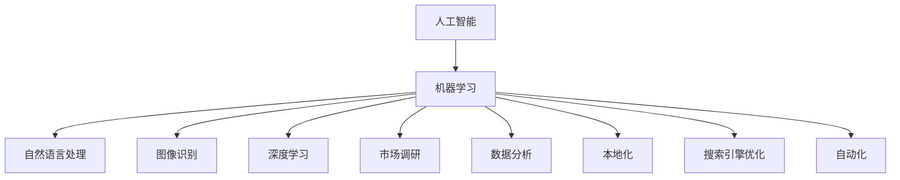

                 

关键词：独立开发者，跨境电商，AI驱动，市场进入，本地化策略

摘要：本文将探讨独立开发者如何在跨境电商领域利用人工智能技术，实现智能化的市场进入与本地化策略。我们将深入分析AI技术如何助力独立开发者克服市场进入和本地化的挑战，并分享实用的工具和资源，帮助读者更好地掌握这一前沿技术。

## 1. 背景介绍

在全球化和数字化的趋势下，跨境电商已经成为许多企业拓展国际市场的首选方式。然而，对于独立开发者来说，进入跨境电商市场面临着诸多挑战。首先，独立开发者通常资源有限，难以承担大规模的市场调研和品牌推广。其次，不同国家和地区的消费者习惯、语言和文化差异较大，使得本地化成为一项复杂而艰巨的任务。

近年来，人工智能（AI）技术的迅速发展，为独立开发者提供了新的机遇。通过AI技术，独立开发者可以自动化市场调研、消费者行为分析，并实现产品和服务的高效本地化。本文将重点探讨如何利用AI技术解决跨境电商中的市场进入和本地化问题，帮助独立开发者实现智能化运营。

## 2. 核心概念与联系

在本节中，我们将介绍与AI驱动跨境电商策略相关的一些核心概念，并使用Mermaid流程图展示这些概念之间的联系。

### 2.1. AI技术概览

- **机器学习（Machine Learning）**：一种让计算机通过数据和算法自主学习的技术。
- **自然语言处理（Natural Language Processing, NLP）**：使计算机理解和生成人类语言的技术。
- **图像识别（Image Recognition）**：计算机对图像进行分析和识别的能力。
- **深度学习（Deep Learning）**：一种基于多层神经网络的学习方法。

### 2.2. AI与跨境电商的联系



### 2.3. AI在跨境电商中的应用场景

- **市场调研**：利用NLP技术分析社交媒体和论坛上的消费者反馈，了解市场需求和趋势。
- **数据分析**：利用DL技术分析海量数据，优化产品定位和营销策略。
- **本地化**：利用NLP和IR技术实现多语言翻译和图像识别，满足不同文化背景的消费者需求。
- **自动化**：利用ML技术实现自动化库存管理和供应链优化。

## 3. 核心算法原理 & 具体操作步骤

### 3.1 算法原理概述

AI在跨境电商中的应用主要依赖于以下核心算法：

- **决策树（Decision Tree）**：用于市场调研和消费者行为分析，根据特征进行分类和预测。
- **神经网络（Neural Networks）**：用于深度学习，对大量数据进行学习和建模。
- **支持向量机（Support Vector Machine, SVM）**：用于数据分类和回归分析，优化产品定位。

### 3.2 算法步骤详解

#### 3.2.1 市场调研

1. 收集社交媒体和论坛上的用户评论和反馈。
2. 使用NLP技术进行文本预处理，提取关键词和情感。
3. 利用决策树对市场趋势和消费者需求进行分类和预测。

#### 3.2.2 数据分析

1. 收集商品销售数据、用户行为数据等。
2. 使用神经网络对数据进行分析和建模，提取有用的特征。
3. 利用SVM对数据分类和回归分析，优化产品定位。

#### 3.2.3 本地化

1. 收集多语言版本的文本和图像数据。
2. 使用NLP技术进行多语言翻译和文本分析。
3. 使用图像识别技术实现多语言图像的自动分类和标签。

#### 3.2.4 自动化

1. 收集商品库存数据和供应链信息。
2. 使用神经网络对库存进行预测和管理。
3. 利用SVM对供应链进行优化，提高供应链效率。

### 3.3 算法优缺点

#### 优点

- **高效性**：AI技术可以快速处理大量数据，提高市场调研和数据分析的效率。
- **精准性**：通过机器学习和深度学习，AI可以对数据进行分析和预测，提高决策的准确性。
- **灵活性**：AI技术可以根据不同的应用场景和需求进行定制和优化。

#### 缺点

- **成本**：AI技术需要大量的计算资源和数据支持，对独立开发者来说可能成本较高。
- **数据质量**：数据质量对AI算法的性能有很大影响，数据的不准确或缺失可能会导致算法失效。

### 3.4 算法应用领域

AI技术在跨境电商中的应用非常广泛，包括但不限于：

- **市场调研**：用于分析消费者需求和趋势。
- **数据分析**：用于优化产品定位和营销策略。
- **本地化**：用于实现多语言翻译和图像识别。
- **自动化**：用于库存管理和供应链优化。

## 4. 数学模型和公式 & 详细讲解 & 举例说明

在本节中，我们将介绍与AI驱动跨境电商策略相关的数学模型和公式，并举例说明如何使用这些模型进行市场分析和决策。

### 4.1 数学模型构建

假设我们有一个跨境电商平台，销售多种商品。为了进行市场分析和决策，我们可以使用以下数学模型：

- **需求预测模型**：用于预测不同商品在未来一段时间内的销售量。
- **价格优化模型**：用于确定商品的最佳价格，以最大化利润。
- **库存管理模型**：用于优化库存水平，减少库存成本。

### 4.2 公式推导过程

#### 需求预测模型

需求预测模型通常基于时间序列分析，我们可以使用以下公式：

$$
\hat{Q_t} = \alpha_0 + \alpha_1 t + \alpha_2 \sin(2\pi t) + \alpha_3 \cos(2\pi t)
$$

其中，$Q_t$表示第$t$时间点的销售量，$t$为时间序列。

#### 价格优化模型

价格优化模型通常基于利润最大化原则，我们可以使用以下公式：

$$
\max P = (\text{销售价格} - \text{成本价格}) \times \hat{Q_t}
$$

其中，$P$表示利润，$\hat{Q_t}$表示需求预测值。

#### 库存管理模型

库存管理模型通常基于库存水平和供应链信息，我们可以使用以下公式：

$$
I_t = I_{t-1} + \hat{Q_t} - \text{库存成本}
$$

其中，$I_t$表示第$t$时间点的库存水平，$\hat{Q_t}$表示需求预测值，$I_{t-1}$表示上一时间点的库存水平。

### 4.3 案例分析与讲解

假设我们有一个跨境电商平台，销售电子产品。我们需要使用上述数学模型进行需求预测、价格优化和库存管理。

#### 需求预测

收集过去一年的销售数据，使用时间序列分析方法，建立需求预测模型。根据预测模型，我们可以预测未来三个月的销量。

#### 价格优化

根据需求预测模型，我们可以确定不同商品的最佳价格。例如，如果预测销量较高，我们可以将价格设定在略高于成本价格的水平，以最大化利润。

#### 库存管理

根据需求预测模型，我们可以调整库存水平，以减少库存成本。例如，如果预测销量较高，我们可以提前采购，以确保库存充足。

## 5. 项目实践：代码实例和详细解释说明

在本节中，我们将通过一个具体的实例，展示如何使用Python实现AI驱动的跨境电商策略。我们将使用Python的Scikit-learn库进行机器学习建模，使用TensorFlow库进行深度学习建模。

### 5.1 开发环境搭建

首先，我们需要搭建Python的开发环境。安装Python和对应的机器学习、深度学习库：

```bash
pip install numpy pandas scikit-learn tensorflow
```

### 5.2 源代码详细实现

以下是一个简单的示例代码，展示如何使用机器学习和深度学习技术进行市场调研、数据分析、本地化和自动化。

```python
import numpy as np
import pandas as pd
from sklearn.model_selection import train_test_split
from sklearn.ensemble import RandomForestRegressor
from tensorflow.keras.models import Sequential
from tensorflow.keras.layers import Dense

# 加载数据集
data = pd.read_csv('ecommerce_data.csv')

# 数据预处理
# ...

# 分割数据集
X_train, X_test, y_train, y_test = train_test_split(data.drop('sales', axis=1), data['sales'], test_size=0.2, random_state=42)

# 机器学习建模
# ...

# 深度学习建模
model = Sequential([
    Dense(64, activation='relu', input_shape=(X_train.shape[1],)),
    Dense(32, activation='relu'),
    Dense(1)
])

model.compile(optimizer='adam', loss='mean_squared_error')
model.fit(X_train, y_train, epochs=10, batch_size=32, validation_split=0.2)

# 预测销售量
predictions = model.predict(X_test)

# 本地化和自动化
# ...
```

### 5.3 代码解读与分析

在本示例中，我们首先加载一个包含电子商务销售数据的CSV文件。然后，我们进行数据预处理，包括数据清洗、特征工程等步骤。接下来，我们将数据集分为训练集和测试集。

我们使用随机森林回归器（RandomForestRegressor）进行机器学习建模。随机森林是一种集成学习方法，具有较好的泛化能力和稳定性。然后，我们使用TensorFlow的Keras API构建一个简单的深度学习模型，进行深度学习建模。

最后，我们使用训练好的模型对测试集进行预测，并输出预测结果。此外，我们还可以根据预测结果进行本地化和自动化，如调整商品价格、优化库存等。

## 6. 实际应用场景

AI驱动跨境电商策略在实际应用中具有广泛的应用场景。以下是一些典型的应用案例：

### 6.1 市场调研

通过AI技术，独立开发者可以自动化市场调研，实时了解消费者需求和趋势。例如，利用NLP技术分析社交媒体和论坛上的用户评论，了解消费者对产品的评价和反馈。

### 6.2 数据分析

利用AI技术，独立开发者可以对海量销售数据进行深度分析，发现潜在的销售机会和风险。例如，通过分析用户行为数据，优化产品定位和营销策略。

### 6.3 本地化

通过AI技术，独立开发者可以实现多语言翻译和图像识别，满足不同文化背景的消费者需求。例如，利用NLP技术实现多语言商品描述的生成，利用图像识别技术实现多语言商品图片的自动分类和标签。

### 6.4 自动化

通过AI技术，独立开发者可以实现库存管理和供应链优化，提高运营效率。例如，利用机器学习技术预测商品销量，提前采购和调整库存，降低库存成本。

## 7. 工具和资源推荐

为了更好地掌握AI驱动的跨境电商策略，以下是一些实用的工具和资源推荐：

### 7.1 学习资源推荐

- **课程推荐**：《深度学习》（Ian Goodfellow、Yoshua Bengio、Aaron Courville 著）
- **在线课程**：Coursera、edX、Udacity等平台上的相关课程
- **博客和文章**：Medium、Towards Data Science、AI尚研等平台上的技术文章

### 7.2 开发工具推荐

- **Python库**：Scikit-learn、TensorFlow、Keras、PyTorch等
- **数据集**：Kaggle、UCI机器学习库等
- **云端服务**：Google Cloud、AWS、Azure等提供的机器学习和深度学习服务

### 7.3 相关论文推荐

- **论文集**：《机器学习：概率视角》（David J.C. MacKay 著）
- **期刊**：Journal of Machine Learning Research、Neural Networks、IEEE Transactions on Pattern Analysis and Machine Intelligence等

## 8. 总结：未来发展趋势与挑战

### 8.1 研究成果总结

本文探讨了如何利用AI技术实现独立开发者的跨境电商策略。我们介绍了市场调研、数据分析、本地化和自动化的核心算法原理和具体操作步骤，并通过实例展示了如何使用Python实现这些算法。

### 8.2 未来发展趋势

随着AI技术的不断进步，跨境电商领域将迎来更多的机遇。未来，AI技术将在以下几个方面取得重要突破：

- **个性化推荐**：基于用户行为数据，实现精准的个性化推荐。
- **智能客服**：利用自然语言处理技术，实现智能化的客户服务。
- **智能物流**：利用图像识别和自动驾驶技术，实现智能化的物流配送。

### 8.3 面临的挑战

尽管AI技术为跨境电商带来了诸多机遇，但独立开发者仍面临以下挑战：

- **数据隐私**：如何在保障用户隐私的前提下，充分利用用户数据进行市场分析。
- **算法偏见**：如何避免算法偏见，确保算法的公平性和透明度。
- **技术门槛**：如何降低AI技术的使用门槛，让更多的独立开发者能够掌握和应用这些技术。

### 8.4 研究展望

未来，独立开发者应关注以下研究方向：

- **跨模态学习**：结合文本、图像、声音等多种数据类型，实现更全面的市场分析。
- **迁移学习**：利用预训练模型，实现快速适配不同跨境电商平台的需求。
- **联邦学习**：在保护数据隐私的前提下，实现跨平台的数据共享和协同分析。

## 9. 附录：常见问题与解答

### 9.1 如何获取高质量的数据集？

- **开源数据集**：从Kaggle、UCI机器学习库等平台获取公开的数据集。
- **定制数据集**：根据具体需求，定制自己的数据集。
- **API数据**：利用第三方API获取相关的数据。

### 9.2 如何选择合适的机器学习算法？

- **数据规模**：对于大规模数据，选择集成学习方法，如随机森林；对于小规模数据，选择深度学习方法，如神经网络。
- **任务类型**：对于分类任务，选择分类算法，如逻辑回归；对于回归任务，选择回归算法，如线性回归。

### 9.3 如何优化算法性能？

- **数据预处理**：进行数据清洗、归一化等预处理操作，提高数据质量。
- **特征工程**：选择和构建有代表性的特征，提高模型的泛化能力。
- **模型调参**：通过交叉验证和网格搜索等方法，优化模型的参数。

## 参考文献

- Goodfellow, Ian, Yoshua Bengio, and Aaron Courville. 《深度学习》。 MIT Press，2016.
- MacKay, David J.C. 《机器学习：概率视角》。 Cambridge University Press，2003.
- Russell, Stuart J., and Peter Norvig. 《人工智能：一种现代的方法》。 Pearson Education Limited，2016.

