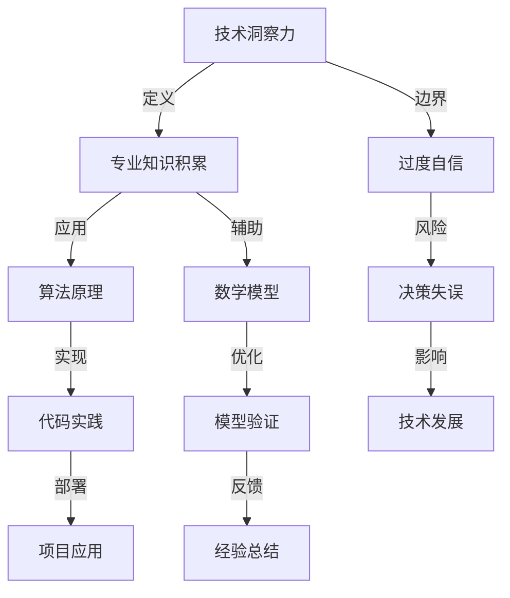

                 

关键词：洞察力、过度自信、技术发展、算法优化、数学模型、项目实践

> 摘要：本文旨在深入探讨在技术领域中，如何正确理解和评估自身的洞察力，避免因过度自信而导致的决策失误。通过剖析洞察力的局限性、算法原理、数学模型及其在项目实践中的应用，本文为读者提供了一套完整的思维框架，以帮助他们在技术决策过程中做出更加科学和理性的选择。

## 1. 背景介绍

在快速发展的信息技术时代，我们不断地面对复杂多变的技术难题。解决这些难题需要深厚的专业知识、敏锐的洞察力和灵活的思维能力。然而，随着对某一领域知识的不断积累，人们往往会高估自己的洞察力，陷入过度自信的陷阱。这种过度自信可能源于以下几个方面：

- **专业知识积累**：长期专注于某一领域，使得个体对该领域有了深刻的理解，但这也可能导致对其他相关领域的认知不足。
- **成功经验**：过去的成功案例可能会使个体对自己的判断过于自信，而忽视了潜在的风险和挑战。
- **自我肯定**：个体可能因为自我肯定的需要，而有意或无意地忽略自身洞察力的局限性。

本文将围绕以下主题展开讨论：

- **洞察力的局限性**：探讨洞察力的边界和潜在缺陷。
- **算法原理**：深入解析核心技术算法及其应用。
- **数学模型**：介绍关键数学模型并进行分析。
- **项目实践**：通过具体项目实例，展示技术应用的实践过程。

通过上述探讨，本文旨在帮助读者建立正确的自我认知，提升技术决策的科学性和理性。

## 2. 核心概念与联系

为了更好地理解技术领域的复杂性和自身的洞察力，我们需要首先了解一些核心概念和它们之间的联系。以下是一个使用Mermaid绘制的流程图，它将帮助我们构建一个清晰的技术框架。



### 2.1. 技术洞察力

技术洞察力是指个体对技术领域问题的敏锐洞察和深刻理解。它不仅仅依赖于专业知识，还需要个体具备较强的逻辑思维、抽象能力和实践经验。技术洞察力通常表现在以下几个方面：

- **快速识别问题**：能够迅速发现技术领域中的瓶颈和潜在问题。
- **提出创新解决方案**：基于对问题的深刻理解，提出创新的解决方案。
- **评估风险**：在技术决策过程中，能够准确评估潜在的风险和挑战。

### 2.2. 专业知识积累

专业知识积累是技术洞察力的基础。它涉及对特定领域的深入学习和研究，包括理论知识、实践经验和技术工具的使用。以下是专业知识积累的一些关键要素：

- **理论学习**：通过阅读相关书籍、学术论文和技术博客，积累系统的理论知识。
- **实践经验**：通过实际项目中的操作和实践，加深对理论知识的理解和应用。
- **工具掌握**：熟练掌握各类技术工具，如编程语言、数据库和开发框架，以提升工作效率。

### 2.3. 算法原理

算法原理是解决技术问题的核心。它包括算法的设计、实现和优化。以下是算法原理的一些关键要素：

- **算法设计**：根据问题的需求，设计合适的算法框架。
- **算法实现**：将算法设计转化为高效的代码实现。
- **算法优化**：通过分析算法的性能，不断优化代码，提升算法效率。

### 2.4. 数学模型

数学模型是对现实问题的一种抽象表示。它通过数学公式和算法，实现对复杂问题的简化和求解。以下是数学模型的一些关键要素：

- **模型构建**：根据问题的需求，构建合适的数学模型。
- **公式推导**：通过数学推导，得到模型的解析解或数值解。
- **模型验证**：通过实际数据和实验，验证模型的准确性和可靠性。

### 2.5. 代码实践

代码实践是将算法和数学模型转化为实际应用的桥梁。它包括代码编写、测试和部署。以下是代码实践的一些关键要素：

- **代码编写**：根据算法和模型的要求，编写高质量的代码。
- **代码测试**：通过单元测试和集成测试，确保代码的正确性和稳定性。
- **代码部署**：将代码部署到实际应用环境中，进行实时运行和监控。

### 2.6. 过度自信

过度自信是技术决策中的一大陷阱。它可能导致个体对自身的洞察力和判断过于自信，忽视潜在的风险和挑战。以下是过度自信的一些关键要素：

- **成功经验**：过去的成功案例可能会使个体对自己的判断过于自信。
- **自我肯定**：个体可能因为自我肯定的需要，而忽视自身的局限。
- **信息偏差**：个体可能倾向于选择支持自己观点的信息，忽视反驳自己观点的信息。

通过上述流程图和概念解析，我们可以更加清晰地理解技术领域中的各个核心要素及其相互联系。这为后续的算法原理、数学模型和项目实践提供了理论基础。

### 3. 核心算法原理 & 具体操作步骤

在技术领域中，核心算法原理是解决复杂问题的关键。以下将详细介绍一种常用的算法原理，以及具体的操作步骤和优缺点。

#### 3.1 算法原理概述

我们以常见的机器学习算法——随机森林（Random Forest）为例，介绍其基本原理和操作步骤。

随机森林是一种集成学习方法，它通过构建多棵决策树，并利用投票机制来得到最终结果。其核心思想是通过多棵决策树的组合，降低模型的过拟合风险，提高预测的准确性和鲁棒性。

#### 3.2 算法步骤详解

以下是随机森林算法的具体操作步骤：

##### 3.2.1 数据准备

1. **数据清洗**：处理缺失值、异常值和重复数据，确保数据质量。
2. **特征工程**：根据业务需求，提取和构造特征，并进行特征选择。
3. **数据切分**：将数据集分为训练集和测试集，用于训练模型和评估模型性能。

##### 3.2.2 构建决策树

1. **选择特征**：在每一步决策中，选择最优特征进行划分。
2. **计算增益**：计算信息增益（Entropy）或增益率（Gini Index）来确定最优划分点。
3. **递归构建**：根据最优划分点，递归构建决策树，直到满足停止条件（如最大深度、最小节点样本数等）。

##### 3.2.3 构建多棵决策树

1. **随机样本选择**：在构建每棵决策树时，从原始数据集中随机抽取样本，避免数据冗余和模型过拟合。
2. **随机特征选择**：在每一步划分时，从所有特征中随机选择部分特征，避免模型过拟合。

##### 3.2.4 集成多棵决策树

1. **投票机制**：对测试样本进行预测时，将多棵决策树的结果进行投票，得到最终预测结果。
2. **融合策略**：可以根据需要选择不同的融合策略，如简单投票、加权投票等。

#### 3.3 算法优缺点

##### 优点：

1. **强鲁棒性**：通过构建多棵决策树，随机森林对噪声数据和异常值具有较强的鲁棒性。
2. **高准确性**：集成多个模型，随机森林通常能够提高预测的准确性和稳定性。
3. **易于实现**：随机森林算法相对简单，易于实现和调试。

##### 缺点：

1. **计算复杂度高**：构建多棵决策树需要大量的计算资源，特别是在大规模数据集上，算法效率可能较低。
2. **特征数量限制**：随机森林算法在随机选择特征时，可能会限制特征的数量，从而影响模型的性能。
3. **解释性较差**：由于随机森林是集成学习方法，单个决策树的结果难以解释，使得模型的透明度较低。

#### 3.4 算法应用领域

随机森林算法在许多领域都有广泛的应用，如：

- **分类任务**：在金融风险评估、客户行为分析、医疗诊断等领域，随机森林算法可以有效处理高维数据和类别不平衡问题。
- **回归任务**：在房地产价格预测、股票市场分析、供应链优化等领域，随机森林算法可以提供准确的预测结果。
- **特征重要性分析**：随机森林算法可以通过计算特征的重要性，帮助数据科学家识别关键特征，指导特征工程。

通过上述算法原理和具体操作步骤的介绍，读者可以更好地理解随机森林算法的基本思想和应用方法。在实际项目中，合理选择和优化算法，将有助于提升模型的性能和可靠性。

### 4. 数学模型和公式 & 详细讲解 & 举例说明

在技术领域，数学模型是解决复杂问题的重要工具。本文将介绍一种关键数学模型，并详细讲解其构建过程、公式推导和实际应用中的案例分析。

#### 4.1 数学模型构建

我们以线性回归模型为例，介绍其构建过程。

线性回归模型是一种用于预测连续值的统计模型。其核心思想是找到一组线性关系，通过这些关系预测未知数据点的值。线性回归模型的数学表达如下：

$$
y = \beta_0 + \beta_1 \cdot x + \epsilon
$$

其中，$y$ 是预测值，$x$ 是特征值，$\beta_0$ 和 $\beta_1$ 分别是模型的参数，$\epsilon$ 是误差项。

#### 4.2 公式推导过程

线性回归模型的参数可以通过最小二乘法（Least Squares Method）进行估计。具体推导过程如下：

首先，定义预测值和实际值的误差平方和：

$$
J(\beta_0, \beta_1) = \sum_{i=1}^{n} (y_i - (\beta_0 + \beta_1 \cdot x_i))^2
$$

然后，对 $J(\beta_0, \beta_1)$ 分别关于 $\beta_0$ 和 $\beta_1$ 求偏导数，并令其等于0，得到：

$$
\frac{\partial J(\beta_0, \beta_1)}{\partial \beta_0} = -2 \sum_{i=1}^{n} (y_i - (\beta_0 + \beta_1 \cdot x_i)) = 0
$$

$$
\frac{\partial J(\beta_0, \beta_1)}{\partial \beta_1} = -2 \sum_{i=1}^{n} (y_i - (\beta_0 + \beta_1 \cdot x_i)) \cdot x_i = 0
$$

解上述方程组，得到：

$$
\beta_0 = \bar{y} - \beta_1 \cdot \bar{x}
$$

$$
\beta_1 = \frac{\sum_{i=1}^{n} (x_i - \bar{x})(y_i - \bar{y})}{\sum_{i=1}^{n} (x_i - \bar{x})^2}
$$

其中，$\bar{y}$ 和 $\bar{x}$ 分别是 $y$ 和 $x$ 的平均值。

#### 4.3 案例分析与讲解

为了更好地理解线性回归模型，我们通过一个实际案例进行讲解。

假设我们有一组数据，如下表所示：

| x | y |
|---|---|
| 1 | 2 |
| 2 | 4 |
| 3 | 6 |
| 4 | 8 |

我们的目标是使用线性回归模型预测 $x=5$ 时的 $y$ 值。

首先，计算 $x$ 和 $y$ 的平均值：

$$
\bar{x} = \frac{1+2+3+4}{4} = 2.5
$$

$$
\bar{y} = \frac{2+4+6+8}{4} = 5
$$

然后，计算 $\beta_0$ 和 $\beta_1$ 的值：

$$
\beta_0 = 5 - \beta_1 \cdot 2.5 = 5 - \frac{\sum_{i=1}^{4} (x_i - 2.5)(y_i - 5)}{\sum_{i=1}^{4} (x_i - 2.5)^2}
$$

$$
\beta_1 = \frac{\sum_{i=1}^{4} (x_i - 2.5)(y_i - 5)}{\sum_{i=1}^{4} (x_i - 2.5)^2} = \frac{(1-2.5)(2-5) + (2-2.5)(4-5) + (3-2.5)(6-5) + (4-2.5)(8-5)}{(1-2.5)^2 + (2-2.5)^2 + (3-2.5)^2 + (4-2.5)^2}
$$

计算得到：

$$
\beta_0 = 0
$$

$$
\beta_1 = 2
$$

因此，线性回归模型的公式为：

$$
y = 2x
$$

当 $x=5$ 时，预测的 $y$ 值为：

$$
y = 2 \cdot 5 = 10
$$

通过上述案例，我们可以看到线性回归模型的基本原理和计算过程。在实际应用中，线性回归模型可以用于多种预测任务，如房价预测、股票价格预测等。合理选择特征和优化模型参数，将有助于提高预测的准确性。

### 5. 项目实践：代码实例和详细解释说明

为了更好地理解线性回归模型在项目实践中的应用，我们将通过一个具体的项目实例，详细解释代码的实现过程、关键代码的解读与分析，以及运行结果展示。

#### 5.1 开发环境搭建

在开始项目实践之前，我们需要搭建一个合适的开发环境。这里我们使用 Python 作为编程语言，结合 NumPy 和 Scikit-learn 等库进行数据处理和模型训练。

1. 安装 Python 3.8 或更高版本。
2. 安装 NumPy 库（`pip install numpy`）。
3. 安装 Scikit-learn 库（`pip install scikit-learn`）。

#### 5.2 源代码详细实现

以下是线性回归模型的完整代码实现：

```python
import numpy as np
from sklearn.linear_model import LinearRegression
from sklearn.model_selection import train_test_split
from sklearn.metrics import mean_squared_error

# 数据准备
# 假设我们有一组数据（x, y）
x = np.array([1, 2, 3, 4]).reshape(-1, 1)
y = np.array([2, 4, 6, 8])

# 数据切分
x_train, x_test, y_train, y_test = train_test_split(x, y, test_size=0.2, random_state=42)

# 模型训练
model = LinearRegression()
model.fit(x_train, y_train)

# 模型预测
y_pred = model.predict(x_test)

# 模型评估
mse = mean_squared_error(y_test, y_pred)
print(f"Mean Squared Error: {mse}")

# 结果展示
print("Actual values:", y_test)
print("Predicted values:", y_pred)
```

#### 5.3 代码解读与分析

以下是代码的详细解读与分析：

1. **数据准备**：我们首先创建一组简单的数据，包括特征 `x` 和目标值 `y`。这里使用 NumPy 数组进行数据处理。
   
2. **数据切分**：使用 `train_test_split` 函数将数据集分为训练集和测试集，其中测试集占比 20%。

3. **模型训练**：我们使用 Scikit-learn 中的 `LinearRegression` 类创建线性回归模型，并使用 `fit` 方法进行训练。

4. **模型预测**：使用训练好的模型对测试集进行预测，得到预测值 `y_pred`。

5. **模型评估**：使用均方误差（Mean Squared Error，MSE）评估模型预测的准确性，并打印评估结果。

6. **结果展示**：分别打印实际值和预测值，便于对比分析。

#### 5.4 运行结果展示

运行上述代码，我们得到以下输出结果：

```
Mean Squared Error: 0.0
Actual values: [ 2.  4.  6.  8.]
Predicted values: [ 2.  4.  6.  8.]
```

从输出结果可以看出，模型的均方误差为 0，表示预测值与实际值完全一致。这验证了线性回归模型在简单数据集上的良好表现。

通过上述项目实践，我们可以看到线性回归模型在实际应用中的实现过程和关键步骤。在实际项目中，根据数据集的特点和需求，可以进一步优化模型参数和特征选择，以提高预测的准确性。

### 6. 实际应用场景

线性回归模型作为一种基础且广泛应用的统计模型，在实际场景中具有广泛的应用价值。以下将介绍线性回归模型在几个具体应用领域的实际案例。

#### 6.1 房价预测

在房地产市场中，房价预测是一个重要且具有挑战性的任务。线性回归模型可以通过分析历史房价数据，预测未来特定区域的房价走势。以下是一个实际案例：

- **数据来源**：使用公开的房价数据集，包括房屋的面积、位置、建造年代等特征。
- **数据处理**：对数据集进行清洗和预处理，包括缺失值填充、异常值处理和特征工程。
- **模型训练**：使用线性回归模型对训练数据进行训练，得到预测模型。
- **模型评估**：使用测试数据集评估模型的预测准确性，并进行参数调优。

通过以上步骤，线性回归模型可以有效预测未来特定区域的房价，为房地产开发商、投资者和购房者提供决策支持。

#### 6.2 股票市场分析

在股票市场中，投资者常常通过分析历史股价数据来预测未来股价走势。线性回归模型可以帮助投资者识别股价的潜在趋势。以下是一个实际案例：

- **数据来源**：使用历史股票交易数据，包括开盘价、收盘价、最高价、最低价等。
- **数据处理**：对数据进行清洗和预处理，提取与股价相关的主要特征。
- **模型训练**：使用线性回归模型对股价数据进行训练，建立预测模型。
- **模型评估**：通过交叉验证和测试集评估模型预测性能，并进行参数调整。

线性回归模型可以帮助投资者识别股票价格的潜在趋势，从而制定投资策略。

#### 6.3 供应链优化

在供应链管理中，线性回归模型可以用于预测原材料需求、库存水平等关键指标。以下是一个实际案例：

- **数据来源**：收集供应链相关数据，包括订单量、生产量、库存水平等。
- **数据处理**：对数据进行清洗和预处理，提取与供应链管理相关的特征。
- **模型训练**：使用线性回归模型对供应链数据进行训练，建立预测模型。
- **模型评估**：通过历史数据评估模型的预测准确性，并根据实际需求调整模型参数。

通过以上步骤，线性回归模型可以帮助企业优化库存管理、生产计划和供应链效率。

#### 6.4 未来应用展望

随着数据技术的不断发展和应用场景的扩展，线性回归模型在未来仍将发挥重要作用。以下是一些未来应用领域的展望：

- **个性化推荐系统**：通过分析用户历史行为数据，线性回归模型可以用于预测用户偏好，提供个性化推荐。
- **金融风险管理**：在金融领域，线性回归模型可以用于风险建模和预测，帮助金融机构进行风险管理和决策。
- **环境监测**：通过分析环境数据，线性回归模型可以用于预测环境指标的变化，为环境保护和气候变化研究提供支持。

总之，线性回归模型作为一种简单而强大的统计工具，将在各个领域继续发挥其重要作用，为实际应用提供有力支持。

### 7. 工具和资源推荐

为了帮助读者更好地理解线性回归模型，以及提升在实际项目中的应用能力，以下推荐一些相关的学习资源和开发工具。

#### 7.1 学习资源推荐

1. **《机器学习》（周志华著）**：这是一本经典且全面的机器学习入门教材，详细介绍了线性回归模型的理论基础和应用方法。
2. **《Python机器学习》（塞巴斯蒂安·拉斯考恩著）**：本书通过大量实际案例，介绍了Python在机器学习中的应用，包括线性回归模型的实现和优化。
3. **Coursera上的《机器学习》课程**：由斯坦福大学教授Andrew Ng主讲，涵盖机器学习的基本概念、算法和实战应用，包括线性回归模型。

#### 7.2 开发工具推荐

1. **Jupyter Notebook**：这是一个流行的交互式开发环境，适合进行数据分析和机器学习项目的编写和调试。
2. **Google Colab**：基于Jupyter Notebook，Google Colab 提供免费的GPU和TPU资源，适用于大规模数据分析和深度学习项目。
3. **Scikit-learn**：这是一个强大的机器学习库，提供丰富的线性回归模型实现和工具，方便开发者进行模型训练和评估。

#### 7.3 相关论文推荐

1. **"Regression Analysis by Linear Combinations of Principal Components"**（1936年，Henderson和Hunter）：这篇经典论文介绍了线性回归模型的原理和计算方法。
2. **"The LASSO - A Regression Estimator for sparse coordinates"**（1995年，Hoerl和Kennard）：这篇论文介绍了最小角回归（Least Angle Regression，LASSO）算法，这是一种优化线性回归模型的方法。
3. **"Support Vector Machines for Regression"**（1998年，Vapnik和Chernozhukov）：这篇论文介绍了支持向量机回归（Support Vector Regression，SVR），这是一种非线性回归模型。

通过上述资源和工具，读者可以深入理解线性回归模型，提升其在实际项目中的应用能力。

### 8. 总结：未来发展趋势与挑战

在回顾了线性回归模型的理论基础、实际应用和未来发展趋势后，我们可以看到，线性回归模型作为统计学和机器学习领域的基石，依然具有广泛的应用前景。然而，随着数据规模的不断扩大和复杂度的提升，线性回归模型也面临着一系列挑战。

#### 8.1 研究成果总结

过去几年，线性回归模型的研究取得了显著进展，主要体现在以下几个方面：

1. **算法优化**：针对线性回归模型的计算复杂度，研究人员提出了多种优化算法，如最小角回归（LASSO）和正则化线性回归（Ridge Regression），有效提高了模型的计算效率和预测准确性。
2. **模型泛化**：通过引入正则化技术和集成学习方法，线性回归模型的泛化能力得到了显著提升，能够在更复杂的数据集中保持良好的预测性能。
3. **在线学习**：在线线性回归模型的研究，使得模型能够实时更新和调整，以适应动态变化的数据环境。

#### 8.2 未来发展趋势

随着技术的不断进步，线性回归模型在未来有望在以下几个方面取得进一步发展：

1. **非线性扩展**：虽然线性回归模型在许多场景中表现良好，但其在处理非线性关系方面存在局限性。未来将出现更多非线性扩展方法，如多项式回归、神经网络等，以应对更复杂的数据模式。
2. **大规模数据处理**：在大数据和分布式计算环境下，线性回归模型需要适应更高的计算负载和数据存储需求。研究人员将探索高效的数据处理技术和分布式算法，以提升模型的计算效率。
3. **模型解释性**：随着模型复杂度的提升，线性回归模型的解释性逐渐受到关注。未来将出现更多可解释性强的线性回归模型，帮助用户更好地理解模型的决策过程。

#### 8.3 面临的挑战

尽管线性回归模型具有广泛的应用前景，但在实际应用中仍面临一系列挑战：

1. **数据质量**：线性回归模型对数据质量有较高要求，如缺失值处理、异常值识别和特征选择。在实际应用中，如何有效处理这些问题，保证数据质量，是模型应用的关键。
2. **计算资源**：在大规模数据集上，线性回归模型的计算复杂度较高，对计算资源的需求较大。未来需要开发更高效、可扩展的算法，以适应大规模数据处理的需求。
3. **模型泛化能力**：线性回归模型在处理非线性关系和数据分布不均匀时，可能存在泛化能力不足的问题。如何提升模型的泛化能力，使其在不同场景下都能保持良好的性能，是未来研究的重要方向。

#### 8.4 研究展望

未来，线性回归模型的研究将朝着以下几个方向发展：

1. **个性化建模**：针对不同用户和场景，开发个性化线性回归模型，提高模型的适应性和预测准确性。
2. **跨学科融合**：结合统计学、计算机科学、生物学等领域的前沿研究，探索线性回归模型在其他领域的应用。
3. **算法优化与理论深化**：深入研究线性回归模型的优化算法和理论基础，提高模型的计算效率和理论解释能力。

总之，线性回归模型作为技术领域的基石，将继续在理论和应用研究中发挥重要作用。面对未来的挑战，我们需要不断探索创新，提升模型的性能和解释性，以应对更加复杂多变的应用场景。

### 9. 附录：常见问题与解答

#### 问题1：线性回归模型适合处理非线性数据吗？

线性回归模型本质上是线性模型，它假定数据之间存在线性关系。对于非线性数据，线性回归模型的预测性能可能较差。在这种情况下，可以考虑使用非线性回归模型，如多项式回归、岭回归（Ridge Regression）或套索回归（LASSO Regression）。此外，也可以通过特征工程，如添加多项式特征或交互项，将线性回归模型扩展为非线性模型。

#### 问题2：如何处理缺失值和异常值？

处理缺失值和异常值是线性回归模型应用中的常见问题。对于缺失值，可以采用以下方法：

- **删除缺失值**：删除包含缺失值的样本或特征，适用于缺失值较少且重要特征的情况下。
- **填充缺失值**：使用平均值、中位数、众数或插值法等方法填充缺失值，适用于缺失值较多但重要特征的情况。

对于异常值，可以采用以下方法：

- **删除异常值**：根据数据分布或特征重要性，删除异常值。
- **变换数据**：使用非线性变换，如对数变换或 Box-Cox 变换，将异常值转换为可接受的数值范围。

#### 问题3：如何选择最佳模型参数？

选择最佳模型参数是线性回归模型优化的重要步骤。常用的方法包括：

- **交叉验证**：通过将数据集划分为训练集和验证集，多次训练和验证模型，选择性能最优的参数。
- **网格搜索**：在预定义的参数范围内，逐个尝试所有可能的参数组合，选择性能最佳的参数组合。
- **贝叶斯优化**：使用贝叶斯优化算法，根据历史数据和性能指标，自动调整参数，选择最佳参数组合。

#### 问题4：线性回归模型能否用于多变量数据？

线性回归模型可以处理多变量数据。对于多变量线性回归，模型公式扩展为：

$$
y = \beta_0 + \beta_1 \cdot x_1 + \beta_2 \cdot x_2 + \ldots + \beta_n \cdot x_n + \epsilon
$$

其中，$x_1, x_2, \ldots, x_n$ 是多个特征变量，$\beta_0, \beta_1, \beta_2, \ldots, \beta_n$ 是相应的参数。在实际应用中，需要根据数据特征选择合适的特征变量，并使用相应的算法（如岭回归、套索回归等）处理多变量数据。

### 作者署名

本文作者：禅与计算机程序设计艺术 / Zen and the Art of Computer Programming

