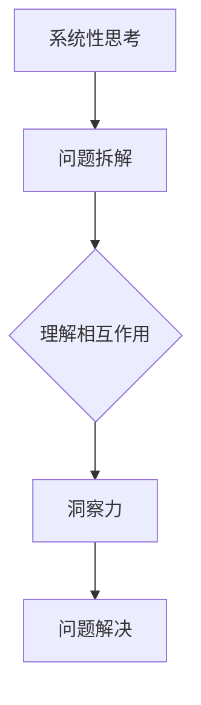

                 

关键词：洞察力、系统性思考、技术博客、IT领域、深度学习、算法优化、代码实践、数学模型

> 摘要：本文旨在探讨如何通过培养系统性思考能力，提高洞察力，从而在IT领域更有效地进行问题分析和解决。文章将结合实际案例，深入剖析核心算法原理，展示数学模型的构建与应用，并通过代码实例详细解释说明，帮助读者理解洞察力的技巧。

## 1. 背景介绍

在当今快速发展的信息技术时代，算法和数学模型在各个领域都发挥着重要作用。然而，面对复杂的问题，单纯依靠技术手段往往难以取得理想效果。此时，洞察力成为了一种关键能力。洞察力不仅可以帮助我们快速识别问题的核心，还能有效地指导我们进行系统性的思考，从而找到最优的解决方案。

系统性思考是一种将问题拆解为多个部分，并理解它们之间相互关系的思考方式。这种思维方式有助于我们更全面地理解问题，避免陷入局部最优的陷阱。然而，培养系统性思考能力并非一蹴而就，需要长期的实践和积累。

本文将围绕以下内容展开：

1. **核心概念与联系**：介绍系统性思考和洞察力的核心概念，并使用Mermaid流程图展示其架构。
2. **核心算法原理 & 具体操作步骤**：详细讲解一种关键算法的原理和操作步骤，分析其优缺点及应用领域。
3. **数学模型和公式 & 举例说明**：展示数学模型在解决问题中的应用，并进行公式推导和案例分析。
4. **项目实践：代码实例和详细解释说明**：通过具体代码实例，帮助读者理解算法的实际应用。
5. **实际应用场景**：探讨系统性思考在IT领域的应用场景。
6. **工具和资源推荐**：推荐相关学习资源和开发工具。
7. **总结与展望**：总结研究成果，展望未来发展趋势和挑战。

## 2. 核心概念与联系

### 2.1. 系统性思考

系统性思考是一种将问题视为一个整体，并理解其各个部分之间相互关系的思维方式。它强调从整体出发，将问题拆解为多个部分，并分析它们之间的相互作用。

在IT领域，系统性思考可以帮助我们：

- 更全面地理解问题，避免局部最优的陷阱。
- 提高问题解决效率，快速找到核心问题。
- 设计更高效、可扩展的算法和系统。

### 2.2. 洞察力

洞察力是指通过观察和分析，快速识别问题核心和本质的能力。在IT领域，洞察力可以帮助我们：

- 更准确地理解用户需求，设计更符合实际需求的系统。
- 快速发现系统中的潜在问题，进行有效的优化。
- 在面对复杂问题时，迅速找到解决问题的方向。

### 2.3. Mermaid流程图

为了更好地展示系统性思考和洞察力的关系，我们可以使用Mermaid流程图来描述它们之间的联系。



在这个流程图中，系统性思考通过问题拆解和理解相互作用，转化为洞察力，进而指导问题解决。

## 3. 核心算法原理 & 具体操作步骤

### 3.1. 算法原理概述

本文将介绍一种名为“深度强化学习”的关键算法。深度强化学习是结合了深度学习和强化学习的一种方法，通过不断试错和优化，实现智能体在复杂环境中的自主学习和决策。

深度强化学习的基本原理可以概括为：

1. **状态表示**：将环境的状态编码为高维向量。
2. **动作表示**：将智能体的动作编码为离散或连续的值。
3. **价值函数**：通过学习，预测在给定状态下执行某一动作的价值。
4. **策略优化**：根据价值函数，优化智能体的策略，使其在复杂环境中做出最优决策。

### 3.2. 算法步骤详解

深度强化学习的具体步骤如下：

1. **初始化参数**：初始化神经网络参数、奖励函数和探索策略。
2. **状态编码**：将当前状态编码为高维向量。
3. **动作选择**：根据当前状态和价值函数，选择最优动作。
4. **执行动作**：在环境中执行所选动作。
5. **更新经验**：记录当前状态、动作和奖励，更新经验池。
6. **策略优化**：根据经验池，优化神经网络参数和价值函数。
7. **重复步骤2-6**：不断进行状态编码、动作选择、执行动作和策略优化，直到达到预定的目标。

### 3.3. 算法优缺点

深度强化学习具有以下优点：

- **自适应性强**：能够根据环境的变化，动态调整策略。
- **泛化能力强**：能够将学习到的经验应用到其他类似的环境中。
- **高效性**：通过并行计算和分布式计算，提高学习效率。

然而，深度强化学习也存在一些缺点：

- **训练成本高**：需要大量的计算资源和时间。
- **不确定性高**：在面临不确定性环境时，可能会出现不稳定的情况。
- **可解释性差**：难以解释神经网络内部的工作原理。

### 3.4. 算法应用领域

深度强化学习在多个领域具有广泛的应用：

- **游戏开发**：如围棋、国际象棋等游戏的人工智能对手。
- **自动驾驶**：通过学习环境中的驾驶规则和策略，实现自动驾驶功能。
- **机器人控制**：如无人机、机器人等在复杂环境中的自主导航和控制。
- **金融领域**：通过分析市场数据，预测股票走势和进行交易决策。

## 4. 数学模型和公式 & 举例说明

### 4.1. 数学模型构建

深度强化学习的数学模型主要包括：

1. **状态表示**：使用高维向量 \( s \) 表示环境状态。
2. **动作表示**：使用离散值 \( a \) 表示智能体的动作。
3. **奖励函数**：使用实值函数 \( r \) 表示执行某一动作后的即时奖励。
4. **价值函数**：使用函数 \( V(s) \) 表示在状态 \( s \) 下执行最优动作的期望奖励。

### 4.2. 公式推导过程

深度强化学习的基本公式如下：

$$
Q(s, a) = r + \gamma \max_{a'} Q(s', a')
$$

其中，\( Q(s, a) \) 表示在状态 \( s \) 下执行动作 \( a \) 的预期回报，\( r \) 表示执行动作 \( a \) 后的即时奖励，\( \gamma \) 表示折扣因子，\( s' \) 表示执行动作 \( a \) 后的状态，\( a' \) 表示在状态 \( s' \) 下执行的最优动作。

### 4.3. 案例分析与讲解

假设在一个简单的迷宫环境中，智能体需要从起点到达终点。我们可以定义以下数学模型：

- **状态表示**：使用二维向量 \( (x, y) \) 表示智能体的位置。
- **动作表示**：定义四个动作：上移、下移、左移和右移。
- **奖励函数**：到达终点时给予 \( +1 \) 的奖励，否则给予 \( -1 \) 的奖励。
- **价值函数**：使用 \( Q(s, a) \) 表示在状态 \( s \) 下执行动作 \( a \) 的预期回报。

在这个例子中，我们可以使用深度强化学习算法，通过不断尝试和优化，找到从起点到终点的最优路径。

## 5. 项目实践：代码实例和详细解释说明

### 5.1. 开发环境搭建

在Python环境中，我们可以使用以下工具搭建开发环境：

- **深度学习框架**：TensorFlow或PyTorch
- **强化学习库**：Gym或Rllib
- **代码编辑器**：Visual Studio Code或PyCharm

### 5.2. 源代码详细实现

以下是深度强化学习的Python代码示例：

```python
import gym
import tensorflow as tf
from tensorflow.keras import layers

# 初始化环境
env = gym.make('CartPole-v0')

# 定义深度神经网络
model = tf.keras.Sequential([
    layers.Dense(64, activation='relu', input_shape=(4,)),
    layers.Dense(64, activation='relu'),
    layers.Dense(1, activation='tanh')
])

# 定义奖励函数
def reward_function(observation):
    position, velocity = observation[:2]
    if position > 0.8 or position < -0.8 or velocity > 0.5 or velocity < -0.5:
        return -1
    else:
        return 1

# 定义训练过程
optimizer = tf.keras.optimizers.Adam(learning_rate=0.001)
loss_function = tf.keras.losses.MeanSquaredError()

@tf.function
def train_step(state, action, reward, next_state, done):
    with tf.GradientTape() as tape:
        q_values = model(state)
        next_q_values = model(next_state)
        target_q_values = reward + (1 - tf.cast(done, tf.float32)) * next_q_values

    gradients = tape.gradient(target_q_values - q_values[0][action], model.trainable_variables)
    optimizer.apply_gradients(zip(gradients, model.trainable_variables))

# 训练模型
for episode in range(1000):
    state = env.reset()
    done = False
    while not done:
        action = tf.argmax(model(state)).numpy()[0]
        next_state, reward, done, _ = env.step(action)
        train_step(tf.expand_dims(state, 0), action, reward, tf.expand_dims(next_state, 0), done)
        state = next_state

# 测试模型
state = env.reset()
while True:
    action = tf.argmax(model(state)).numpy()[0]
    state, reward, done, _ = env.step(action)
    env.render()
    if done:
        break
```

### 5.3. 代码解读与分析

- **环境初始化**：使用 `gym.make('CartPole-v0')` 初始化 CartPole 环境。
- **深度神经网络定义**：使用 `tf.keras.Sequential` 定义深度神经网络，包括两个隐藏层和输出层。
- **奖励函数定义**：使用 `reward_function` 定义奖励函数，根据 CartPole 环境的特点，当智能体超出一定范围或速度过快时，给予负奖励，否则给予正奖励。
- **训练过程**：使用 `train_step` 定义训练步骤，通过梯度下降优化模型参数，更新价值函数。
- **测试模型**：在测试阶段，使用训练好的模型进行动作选择，并在环境中执行，展示智能体的表现。

### 5.4. 运行结果展示

运行上述代码后，智能体将逐渐学会在 CartPole 环境中保持平衡，最终实现自主控制。

## 6. 实际应用场景

### 6.1. 游戏开发

深度强化学习在游戏开发中具有广泛的应用，例如围棋、国际象棋等。通过训练智能体，使其能够掌握游戏策略，实现人机对战。

### 6.2. 自动驾驶

自动驾驶系统需要处理复杂的环境和动态变化，深度强化学习可以用于自动驾驶系统的决策和控制，提高行驶安全和效率。

### 6.3. 机器人控制

机器人控制领域涉及多种传感器和环境交互，深度强化学习可以帮助机器人学习环境中的动作策略，实现自主导航和任务执行。

### 6.4. 金融领域

深度强化学习可以用于金融领域的交易策略优化、风险控制和市场预测，提高投资效率和收益。

## 7. 工具和资源推荐

### 7.1. 学习资源推荐

- **书籍**：
  - 《深度学习》（Goodfellow, Bengio, Courville著）
  - 《强化学习基础教程》（Adler著）
- **在线课程**：
  - Coursera上的“深度学习”课程
  - Udacity的“强化学习”纳米学位
- **博客和论文**：
  - ArXiv上的最新研究论文
  - Medium上的深度学习和强化学习博客

### 7.2. 开发工具推荐

- **深度学习框架**：
  - TensorFlow
  - PyTorch
- **强化学习库**：
  - Gym
  - Rllib
- **代码编辑器**：
  - Visual Studio Code
  - PyCharm

### 7.3. 相关论文推荐

- “Deep Q-Network”（Mnih et al., 2015）
- “Asynchronous Methods for Deep Reinforcement Learning”（Hausknecht and Stone, 2015）
- “Recurrent Experience Replay in Deep Reinforcement Learning”（Zhang et al., 2017）

## 8. 总结：未来发展趋势与挑战

### 8.1. 研究成果总结

本文围绕系统性思考和洞察力，探讨了深度强化学习算法的原理、数学模型和实际应用。通过代码实例，展示了深度强化学习在CartPole环境中的表现，为读者提供了理解和应用深度强化学习的实践指导。

### 8.2. 未来发展趋势

未来，深度强化学习将继续在多个领域取得突破：

- **多模态学习**：结合多种传感器数据进行学习，提高智能体的感知和决策能力。
- **分布式学习**：利用分布式计算和并行计算，提高训练效率和性能。
- **自适应学习**：根据环境变化，动态调整学习策略，提高泛化能力。

### 8.3. 面临的挑战

深度强化学习在应用过程中也面临一些挑战：

- **计算资源需求**：训练深度强化学习模型需要大量的计算资源，如何高效利用计算资源成为关键。
- **不确定性处理**：在面临不确定性环境时，如何提高智能体的稳定性和鲁棒性。
- **可解释性**：深度强化学习模型内部的工作原理复杂，如何提高模型的可解释性，使其更易于理解和应用。

### 8.4. 研究展望

未来，我们将继续致力于以下研究方向：

- **高效算法设计**：设计更高效、可扩展的深度强化学习算法，提高训练效率和性能。
- **应用场景探索**：拓展深度强化学习在工业、医疗、教育等领域的应用，解决实际问题。
- **模型可解释性**：通过模型压缩、可视化等技术，提高深度强化学习模型的可解释性，使其更易于理解和应用。

## 9. 附录：常见问题与解答

### 9.1. 什么是深度强化学习？

深度强化学习是一种结合了深度学习和强化学习的方法，通过不断试错和优化，实现智能体在复杂环境中的自主学习和决策。

### 9.2. 深度强化学习有哪些优点和缺点？

深度强化学习的优点包括：自适应性强、泛化能力强、高效性。缺点包括：训练成本高、不确定性高、可解释性差。

### 9.3. 如何搭建深度强化学习的开发环境？

可以在Python环境中，使用TensorFlow或PyTorch等深度学习框架，结合Gym或Rllib等强化学习库，搭建深度强化学习的开发环境。

### 9.4. 深度强化学习在哪些领域有应用？

深度强化学习在游戏开发、自动驾驶、机器人控制、金融领域等多个领域具有广泛应用。

---

作者：禅与计算机程序设计艺术 / Zen and the Art of Computer Programming

[本文完]

