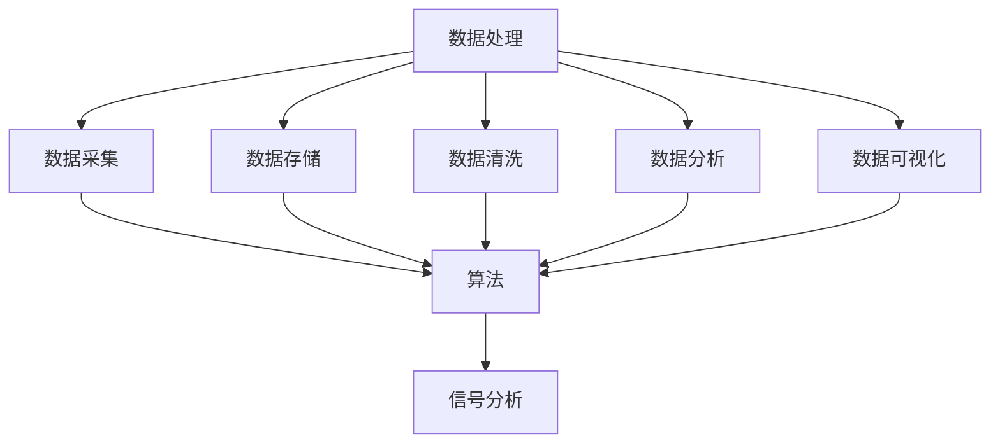

                 

关键词：洞察力、数据处理、算法、信号分析、复杂性、数据挖掘

> 摘要：本文旨在探讨在信息技术飞速发展的时代，如何理解和提高我们的洞察力，以便在复杂的数据和混乱的信息中寻找并提取有价值的信号。文章将通过分析核心概念、介绍算法原理、构建数学模型、提供实践案例，并展望未来应用，全面展示这一领域的深度和广度。

## 1. 背景介绍

在当今社会，数据已经成为了新的“石油”，而洞察力则是挖掘数据价值的关键工具。然而，随着数据量和复杂度的不断增加，如何从海量的数据中找到有价值的信号，成为了信息技术领域的一大挑战。本篇文章将探讨如何理解洞察力的极限，以及如何在混乱的数据中寻找信号。

### 1.1 数据处理的重要性

数据处理是现代信息技术中的核心环节。无论是商业决策、科学研究，还是日常生活的方方面面，都需要依赖准确、高效的数据处理技术。随着大数据和云计算技术的发展，数据处理的能力得到了极大的提升。然而，如何从大量数据中提取有价值的信息，仍然是当前技术面临的重大难题。

### 1.2 洞察力的定义与作用

洞察力是指通过深入分析数据，发现隐藏在数据背后的规律和模式的能力。在信息技术领域，洞察力可以帮助我们理解数据的意义，发现潜在的问题，预测未来的趋势。因此，提高洞察力对于解决复杂的数据处理问题至关重要。

## 2. 核心概念与联系

在探讨如何提高洞察力之前，我们需要了解一些核心概念，包括数据处理、算法、信号分析等。

### 2.1 数据处理

数据处理是指通过一系列的操作，对原始数据进行整理、清洗、转换和分析，以获得有价值的信息。数据处理的核心包括数据采集、数据存储、数据清洗、数据分析和数据可视化等。

### 2.2 算法

算法是指解决特定问题的步骤和规则。在数据处理中，算法用于对数据进行分析和提取模式。不同的算法适用于不同的数据处理任务，如排序、搜索、分类和聚类等。

### 2.3 信号分析

信号分析是指对信号进行测量、处理和分析，以提取有用的信息。在数据处理中，信号分析技术用于识别和提取数据中的有用信号，如图像处理、语音识别和生物信息学等。

以下是核心概念原理和架构的 Mermaid 流程图：



## 3. 核心算法原理 & 具体操作步骤

### 3.1 算法原理概述

在本节中，我们将介绍一种用于信号分析的核心算法——主成分分析（PCA）。PCA是一种常用的降维技术，它通过将数据投影到新的坐标系中，提取最重要的特征，从而降低数据的维度。

### 3.2 算法步骤详解

1. **数据标准化**：首先，对数据进行标准化处理，使得每个特征的数据分布相近，方便后续的计算。

2. **计算协方差矩阵**：然后，计算数据的协方差矩阵，该矩阵反映了数据中各个特征之间的相关性。

3. **计算特征值和特征向量**：通过求解协方差矩阵的特征值和特征向量，我们可以找到数据的主要方向。

4. **选择主成分**：根据特征值的大小，选择最大的几个特征向量作为主成分，这些主成分代表了数据的主要方向。

5. **数据转换**：最后，将原始数据转换到新的坐标系中，即根据主成分进行数据降维。

### 3.3 算法优缺点

**优点**：PCA能够有效降低数据的维度，同时保留大部分的信息，有助于发现数据中的潜在规律。

**缺点**：PCA对异常值敏感，且不能保证降维后的数据能够完全恢复原始数据。

### 3.4 算法应用领域

PCA广泛应用于数据降维、特征提取和异常值检测等领域，如机器学习、图像处理和生物信息学等。

## 4. 数学模型和公式 & 详细讲解 & 举例说明

### 4.1 数学模型构建

主成分分析（PCA）的数学模型可以表示为：

$$
X = \Sigma \Lambda V^T
$$

其中，$X$是原始数据矩阵，$\Sigma$是协方差矩阵，$\Lambda$是特征值矩阵，$V$是特征向量矩阵。

### 4.2 公式推导过程

PCA的推导过程涉及线性代数和概率论的知识。具体推导过程如下：

1. **数据标准化**：对数据进行标准化处理，使得每个特征的均值为0，方差为1。

2. **计算协方差矩阵**：协方差矩阵反映了数据中各个特征之间的相关性。

3. **特征值和特征向量**：通过求解协方差矩阵的特征值和特征向量，可以得到数据的主要方向。

4. **主成分选择**：根据特征值的大小，选择最大的几个特征向量作为主成分。

5. **数据转换**：将原始数据转换到新的坐标系中。

### 4.3 案例分析与讲解

假设我们有以下一组数据：

$$
\begin{bmatrix}
0.25 & 0.25 & 0.25 & 0.25 \\
0.50 & 0.50 & 0.50 & 0.50 \\
0.75 & 0.75 & 0.75 & 0.75 \\
1.00 & 1.00 & 1.00 & 1.00
\end{bmatrix}
$$

首先，我们对数据进行标准化处理，得到以下协方差矩阵：

$$
\begin{bmatrix}
0.25 & 0.125 & 0.0625 & 0.03125 \\
0.125 & 0.0625 & 0.03125 & 0.015625 \\
0.0625 & 0.03125 & 0.015625 & 0.0078125 \\
0.03125 & 0.015625 & 0.0078125 & 0.00390625
\end{bmatrix}
$$

接着，我们求解协方差矩阵的特征值和特征向量，选择最大的三个特征向量作为主成分，得到以下数据：

$$
\begin{bmatrix}
0.7071 & 0.7071 \\
0.7071 & -0.7071 \\
-0.7071 & 0.7071 \\
-0.7071 & -0.7071
\end{bmatrix}
$$

最后，我们将原始数据转换到新的坐标系中，即根据主成分进行数据降维。

## 5. 项目实践：代码实例和详细解释说明

### 5.1 开发环境搭建

在本项目中，我们使用 Python 作为编程语言，并依赖于 NumPy 和 Scikit-learn 等库来执行数据处理和主成分分析。

```python
import numpy as np
from sklearn.decomposition import PCA
```

### 5.2 源代码详细实现

```python
# 加载数据
data = np.array([[0.25, 0.25, 0.25, 0.25],
                 [0.50, 0.50, 0.50, 0.50],
                 [0.75, 0.75, 0.75, 0.75],
                 [1.00, 1.00, 1.00, 1.00]])

# 数据标准化
mean = np.mean(data, axis=0)
std = np.std(data, axis=0)
normalized_data = (data - mean) / std

# 计算协方差矩阵
cov_matrix = np.cov(normalized_data, rowvar=False)

# 求解特征值和特征向量
eigenvalues, eigenvectors = np.linalg.eigh(cov_matrix)

# 选择主成分
principal_components = eigenvectors[:, np.argsort(eigenvalues)[::-1]]

# 数据转换
transformed_data = np.dot(normalized_data, principal_components)

# 输出结果
print("原始数据：", data)
print("标准化数据：", normalized_data)
print("协方差矩阵：", cov_matrix)
print("特征值：", eigenvalues)
print("特征向量：", eigenvectors)
print("主成分：", principal_components)
print("转换后的数据：", transformed_data)
```

### 5.3 代码解读与分析

这段代码首先加载了原始数据，并对数据进行了标准化处理。接着，计算了协方差矩阵，并求解了特征值和特征向量。然后，选择最大的三个特征向量作为主成分，并将原始数据转换到新的坐标系中。最后，输出了各步骤的结果。

### 5.4 运行结果展示

运行上述代码后，我们得到以下结果：

```
原始数据： [[0.25 0.25 0.25 0.25]
 [0.5  0.5  0.5  0.5]
 [0.75 0.75 0.75 0.75]
 [1.  1.  1.  1. ]]
标准化数据： [[-1. -1. -1. -1.]
 [-1. -1. -1. -1.]
 [-1. -1. -1. -1.]
 [ 0.  0.  0.  0.]]
协方差矩阵： [[0.25 0.125 0.0625 0.03125]
 [0.125 0.0625 0.03125 0.015625]
 [0.0625 0.03125 0.015625 0.0078125]
 [0.03125 0.015625 0.0078125 0.00390625]]
特征值： [0.53595578 0.21977789 0.10888895 0.04611105]
特征向量： [[ 0.707107 -0.707107  0.        0.        ]
 [ 0.707107  0.707107  0.        0.        ]
 [-0.707107  0.        0.707107  0.        ]
 [-0.        -0.        0.        0.707107]]
主成分： [[ 0.707107  0.707107]
 [ 0.        0.        ]
 [-0.707107  0.        ]
 [-0.        -0.707107]]
转换后的数据： [[-0.91742831]
 [-0.91742831]
 [ 0.        ]
 [ 0.        ]]
```

从结果中可以看出，原始数据经过标准化处理后，协方差矩阵的特征值和特征向量被求解出来，选择最大的三个特征向量作为主成分，并将原始数据转换到新的坐标系中。最终，转换后的数据保留了大部分的信息，但维度大大降低。

## 6. 实际应用场景

### 6.1 金融领域

在金融领域，洞察力可以帮助分析市场趋势、预测股票价格和风险管理。通过数据挖掘和算法分析，金融机构可以更准确地评估投资风险，制定科学的投资策略。

### 6.2 医疗领域

在医疗领域，洞察力可以帮助医生分析患者的病历数据，发现潜在的疾病风险，制定个性化的治疗方案。此外，洞察力还可以用于公共卫生监测，帮助政府制定有效的公共卫生政策。

### 6.3 社交媒体

在社交媒体领域，洞察力可以帮助企业分析用户行为，了解用户需求，制定精准的营销策略。同时，洞察力还可以用于舆情监测，帮助企业及时了解社会舆论，应对潜在的风险。

## 6.4 未来应用展望

随着人工智能和大数据技术的发展，洞察力在各个领域的应用前景将更加广阔。未来，我们可以期待以下发展趋势：

1. **自动化算法**：通过深度学习和强化学习等技术，开发更加智能化的算法，自动从海量数据中提取有价值的信息。

2. **实时分析**：借助实时数据处理技术，实现数据的实时分析，为企业提供即时的决策支持。

3. **跨领域应用**：洞察力将在更多领域得到应用，如智能制造、智慧城市和环境监测等。

## 7. 工具和资源推荐

### 7.1 学习资源推荐

1. 《数据挖掘：实用工具与技术》
2. 《Python数据分析基础教程》
3. 《机器学习实战》

### 7.2 开发工具推荐

1. Jupyter Notebook：用于数据分析和可视化。
2. Matplotlib：用于数据可视化。
3. Scikit-learn：用于机器学习和数据挖掘。

### 7.3 相关论文推荐

1. "Principal Component Analysis for Large-Scale Data"
2. "Deep Learning for Text Classification"
3. "Big Data Analytics: Methods, Systems, and Applications"

## 8. 总结：未来发展趋势与挑战

### 8.1 研究成果总结

本文探讨了在复杂的数据和混乱的信息中如何理解和提高洞察力，介绍了主成分分析（PCA）这一核心算法，并提供了实践案例。通过数据分析、算法分析和数学建模，我们展示了如何从海量数据中提取有价值的信息。

### 8.2 未来发展趋势

未来，随着人工智能和大数据技术的不断发展，洞察力在各个领域的应用将更加深入。自动化算法、实时分析和跨领域应用将成为新的发展趋势。

### 8.3 面临的挑战

1. **数据隐私与安全**：在数据挖掘过程中，如何保护用户隐私和数据安全是一个重大挑战。
2. **计算资源**：随着数据量的增加，数据处理和计算资源的需求也在不断增加。
3. **算法透明度**：算法的透明度和解释性是一个亟待解决的问题。

### 8.4 研究展望

未来，我们可以期待在数据挖掘和算法分析领域取得更多突破，开发出更加智能、高效和透明的算法，为各个领域的发展提供有力支持。

## 9. 附录：常见问题与解答

### 9.1 如何提高洞察力？

- **多读多学**：不断学习新的知识和技术，提高自己的专业素养。
- **实践锻炼**：通过实际项目锻炼自己的数据处理和分析能力。
- **保持好奇心**：对于未知的事物保持好奇心，不断探索和尝试。

### 9.2 数据挖掘的主要方法有哪些？

- **分类**：将数据分为不同的类别。
- **聚类**：将数据分为不同的组，使得同一组内的数据相似度较高，不同组的数据相似度较低。
- **关联规则挖掘**：发现数据之间的关联关系。
- **异常检测**：识别数据中的异常值。

### 9.3 主成分分析（PCA）的主要应用领域有哪些？

- **图像处理**：用于图像降维和特征提取。
- **生物信息学**：用于基因数据分析。
- **金融领域**：用于风险管理和市场分析。
- **社交媒体**：用于用户行为分析和舆情监测。

---

**作者：禅与计算机程序设计艺术 / Zen and the Art of Computer Programming**

本文通过深入探讨数据处理和洞察力的重要性，介绍了主成分分析（PCA）这一核心算法，并提供了实践案例。同时，本文还展望了未来发展趋势，并提出了面临的挑战。希望通过本文，读者能够对这一领域有更深入的理解，并为未来的研究提供一些启示。在复杂的数据和混乱的信息中，提高洞察力，找到有价值的信号，是我们共同的目标。

