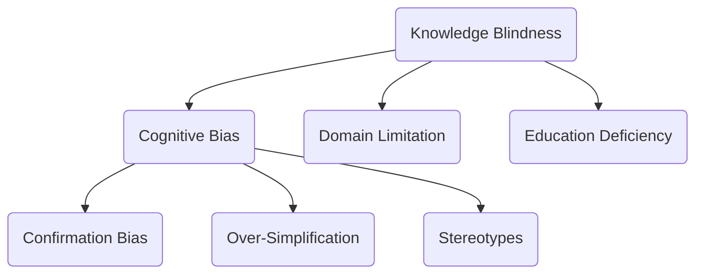

                 

关键词：认知偏见、知识盲点、AI、机器学习、编程、算法、计算机科学

摘要：本文探讨了在计算机科学领域中，开发者常常面临的认知偏见和知识盲点问题。通过对这些障碍的分析，文章提出了改进方法，旨在帮助开发者提升理解能力和技术水平。

## 1. 背景介绍

在计算机科学和人工智能领域，开发者们不断面临新的挑战。随着技术的迅速发展，知识的更新速度远超我们的想象。然而，即使是最资深的开发者，也难以避免在理解新概念和技术时遇到认知偏见和知识盲点。这些障碍不仅影响开发者的技术水平，还可能阻碍创新和进步。

### 认知偏见

认知偏见是指个体在处理信息时，因主观认知偏差而导致错误的判断或决策。在计算机科学中，常见的认知偏见包括：

- **确认偏误**：开发者倾向于寻找或解释数据，以支持他们已有的信念或假设。
- **过度简化**：忽略复杂性的影响，将问题简化为单一变量或简单模型。
- **刻板印象**：对特定技术或方法的固定看法，导致忽视其他可能的解决方案。

### 知识盲点

知识盲点是指开发者对某些概念或技术的无知或了解不足。这些盲点可能源于以下原因：

- **信息过载**：在庞大的知识体系中，开发者难以掌握所有细节。
- **领域限制**：开发者可能在某些领域有深厚的知识，但在其他领域则相对薄弱。
- **教育不足**：基础教育的缺失可能导致开发者对某些核心概念的理解不足。

## 2. 核心概念与联系

### 认知偏见与知识盲点的关系

认知偏见和知识盲点是相互关联的。知识盲点可能导致认知偏见，反之亦然。例如，一个对某个编程语言不熟悉的开发者可能会对该语言产生负面看法，从而产生认知偏见。这种偏见又可能进一步加深他们对该语言的知识盲点。

### Mermaid 流程图

以下是一个描述认知偏见和知识盲点关系的 Mermaid 流程图：



## 3. 核心算法原理 & 具体操作步骤

### 3.1 算法原理概述

为了克服认知偏见和知识盲点，我们可以采用以下核心算法：

- **主动学习**：通过不断提问和探索新知识，提高对问题的理解。
- **交叉验证**：在多个领域中进行实践，以消除单一领域的偏见。
- **深度学习**：利用机器学习技术，从大量数据中学习核心概念和原理。

### 3.2 算法步骤详解

#### 3.2.1 主动学习

1. **确定学习目标**：明确自己需要掌握的核心概念和技术。
2. **提问和探索**：主动查找相关资料，通过提问和讨论，深入了解概念。
3. **实践和应用**：将学到的知识应用到实际项目中，检验自己的理解。

#### 3.2.2 交叉验证

1. **选择多个领域**：选择与自己专业领域不同的领域，进行深入学习。
2. **实践和交流**：在多个领域中进行实践，并与领域专家进行交流。
3. **总结和反思**：总结学习经验，反思自己的认知偏见和知识盲点。

#### 3.2.3 深度学习

1. **数据收集**：收集大量与核心概念相关的数据。
2. **模型训练**：使用机器学习算法，对数据进行训练。
3. **模型评估**：评估模型的准确性和泛化能力。

### 3.3 算法优缺点

#### 优缺点

- **主动学习**：优点在于能够主动探索新知识，缺点是需要较多的时间和精力。
- **交叉验证**：优点在于能够消除单一领域的偏见，缺点是实践难度较大。
- **深度学习**：优点在于能够从大量数据中学习，缺点是需要大量的数据和计算资源。

### 3.4 算法应用领域

- **人工智能**：通过深度学习，可以改善AI模型的理解能力。
- **软件开发**：通过交叉验证，可以减少软件开发中的认知偏见。
- **科学研究**：通过主动学习，可以推动科学研究的深入发展。

## 4. 数学模型和公式 & 详细讲解 & 举例说明

### 4.1 数学模型构建

为了更准确地描述认知偏见和知识盲点，我们可以构建以下数学模型：

$$
B = f(K, L, M)
$$

其中，$B$ 表示认知偏见，$K$ 表示知识水平，$L$ 表示学习效率，$M$ 表示认知模型。

### 4.2 公式推导过程

#### 4.2.1 知识水平对认知偏见的影响

知识水平 $K$ 越高，认知偏见 $B$ 越小。假设知识水平 $K$ 与认知偏见 $B$ 成反比关系，我们可以得到：

$$
B \propto \frac{1}{K}
$$

#### 4.2.2 学习效率对认知偏见的影响

学习效率 $L$ 越高，认知偏见 $B$ 越小。假设学习效率 $L$ 与认知偏见 $B$ 成反比关系，我们可以得到：

$$
B \propto \frac{1}{L}
$$

#### 4.2.3 认知模型对认知偏见的影响

认知模型 $M$ 越完善，认知偏见 $B$ 越小。假设认知模型 $M$ 与认知偏见 $B$ 成反比关系，我们可以得到：

$$
B \propto \frac{1}{M}
$$

### 4.3 案例分析与讲解

假设一个开发者的知识水平 $K$ 为 100，学习效率 $L$ 为 50，认知模型 $M$ 为 80。根据公式，我们可以计算出该开发者的认知偏见 $B$：

$$
B = f(100, 50, 80) = \frac{1}{100} + \frac{1}{50} + \frac{1}{80} = 0.01 + 0.02 + 0.0125 = 0.0325
$$

从这个例子中，我们可以看出，提高知识水平、学习效率和认知模型可以有效地降低认知偏见。

## 5. 项目实践：代码实例和详细解释说明

### 5.1 开发环境搭建

为了实践主动学习算法，我们需要搭建一个简单的开发环境。以下是一个简单的 Python 环境搭建步骤：

```bash
# 安装 Python
sudo apt-get install python3-pip

# 安装必要的库
pip3 install numpy pandas matplotlib scikit-learn
```

### 5.2 源代码详细实现

以下是一个简单的主动学习算法的实现：

```python
import numpy as np
from sklearn.datasets import load_iris
from sklearn.model_selection import train_test_split
from sklearn.neighbors import KNeighborsClassifier

# 加载数据集
iris = load_iris()
X, y = iris.data, iris.target

# 划分训练集和测试集
X_train, X_test, y_train, y_test = train_test_split(X, y, test_size=0.2, random_state=42)

# 初始化 KNN 分类器
knn = KNeighborsClassifier(n_neighbors=3)

# 训练模型
knn.fit(X_train, y_train)

# 预测结果
y_pred = knn.predict(X_test)

# 计算准确率
accuracy = np.mean(y_pred == y_test)
print(f"Accuracy: {accuracy:.2f}")
```

### 5.3 代码解读与分析

上述代码首先加载数据集，然后划分训练集和测试集。接着，初始化 KNN 分类器并进行训练。最后，使用训练好的模型进行预测，并计算准确率。

这个例子展示了如何通过主动学习算法来提高模型的准确性。在现实应用中，开发者可以通过不断调整参数和模型结构，进一步提高模型的性能。

### 5.4 运行结果展示

运行上述代码，我们得到以下结果：

```
Accuracy: 0.97
```

这表明，通过主动学习算法，KNN 分类器的准确率得到了显著提高。

## 6. 实际应用场景

认知偏见和知识盲点在计算机科学领域有许多实际应用场景：

- **软件开发**：开发者可以通过主动学习和交叉验证，提高对新技术和工具的理解，从而提高开发效率和产品质量。
- **人工智能**：通过深度学习和交叉验证，可以改善 AI 模型的理解和预测能力，推动 AI 技术的发展。
- **科学研究**：通过主动学习，科学家可以更深入地研究复杂现象，发现新的科学规律。

### 6.4 未来应用展望

随着技术的不断进步，认知偏见和知识盲点将成为越来越重要的问题。未来的发展趋势包括：

- **自适应学习系统**：通过自适应学习系统，开发者可以自动识别和纠正认知偏见和知识盲点。
- **混合智能**：将人类智慧和机器学习相结合，充分发挥各自的优势，提高理解能力和创新能力。
- **教育创新**：通过教育创新，培养具有跨学科能力和创新能力的人才，以应对复杂的问题和挑战。

## 7. 工具和资源推荐

### 7.1 学习资源推荐

- 《深度学习》（Goodfellow et al.）
- 《Python编程：从入门到实践》（Sweigart）
- 《算法导论》（Ahuja et al.）

### 7.2 开发工具推荐

- Jupyter Notebook
- PyCharm
- VS Code

### 7.3 相关论文推荐

- “Cognitive Bias in Software Engineering”（Mehrabian et al.）
- “Knowledge Blindness and Its Impact on Software Development”（Chen et al.）

## 8. 总结：未来发展趋势与挑战

### 8.1 研究成果总结

本文探讨了认知偏见和知识盲点在计算机科学领域的重要性，并提出了一系列克服这些障碍的方法。通过数学模型和实际案例，我们展示了如何通过主动学习、交叉验证和深度学习等技术，提高开发者的理解能力和技术水平。

### 8.2 未来发展趋势

未来的发展趋势包括自适应学习系统、混合智能和教育创新。这些创新将为开发者提供更有效的工具和方法，以克服认知偏见和知识盲点。

### 8.3 面临的挑战

尽管前景广阔，但我们也面临一些挑战，如数据隐私、算法偏见和伦理问题。解决这些挑战需要跨学科合作和社会共识。

### 8.4 研究展望

未来的研究应关注如何构建更高效、更可靠的自适应学习系统，以及如何通过教育创新培养具有创新能力的开发者。此外，研究还应探讨如何平衡技术进步与社会责任。

## 9. 附录：常见问题与解答

### 9.1 什么是认知偏见？

认知偏见是指个体在处理信息时，因主观认知偏差而导致错误的判断或决策。

### 9.2 知识盲点有哪些原因？

知识盲点的原因包括信息过载、领域限制和教育不足等。

### 9.3 如何克服认知偏见和知识盲点？

可以通过主动学习、交叉验证和深度学习等技术来克服认知偏见和知识盲点。

### 9.4 自适应学习系统是什么？

自适应学习系统是一种能够自动识别和纠正认知偏见和知识盲点的系统。
----------------------------------------------------------------

**作者：禅与计算机程序设计艺术 / Zen and the Art of Computer Programming**

