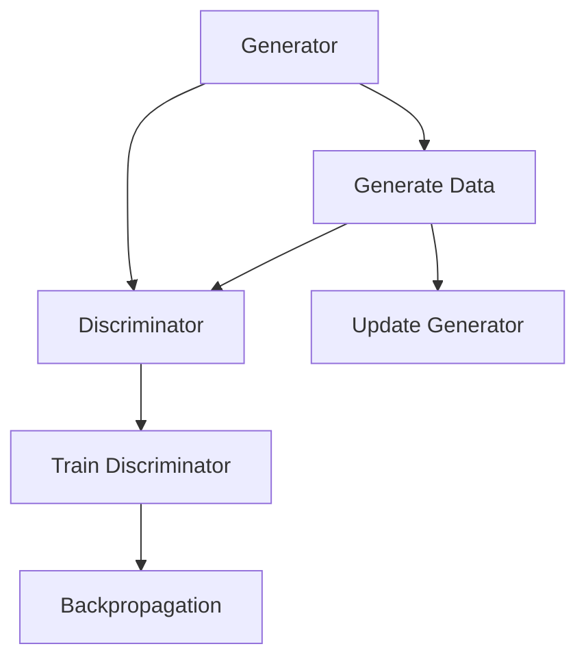

                 

关键词：生成对抗网络，深度学习，数据生成，图像生成，机器学习，神经网络，模型训练，算法原理，应用领域，未来展望。

摘要：生成对抗网络（Generative Adversarial Networks，GAN）是一种基于深度学习的生成模型，通过对生成器和判别器的对抗训练，实现了高质量的数据生成。本文将介绍GAN的背景、核心概念、算法原理、数学模型以及应用领域，并通过代码实例进行分析。

## 1. 背景介绍

生成对抗网络（GAN）是由伊恩·古德费洛（Ian Goodfellow）在2014年提出的一种新型深度学习框架。GAN的核心思想是通过两个神经网络——生成器和判别器之间的对抗训练，生成与真实数据分布相近的伪数据。GAN的出现极大地推动了深度学习在图像处理、自然语言处理等领域的发展，成为当前机器学习领域的一个热点话题。

### 1.1 深度学习的兴起

深度学习是一种基于人工神经网络的学习方法，通过多层神经网络的组合，实现从大量数据中自动提取特征、进行模式识别和预测。随着计算能力的提升和大数据的普及，深度学习在图像识别、语音识别、自然语言处理等领域取得了显著的成果。然而，深度学习的另一个挑战是数据的需求量非常大，有时难以获得足够的标注数据进行训练。

### 1.2 数据生成的需求

在实际应用中，数据生成具有非常重要的意义。例如，在图像处理领域，人们希望能够生成更多样化的图像，用于测试模型的泛化能力；在虚拟现实和增强现实领域，需要生成逼真的三维场景；在医疗领域，需要生成患者数据，用于训练诊断模型等。传统的数据生成方法往往依赖于复杂的模拟过程或人工设计，效率低下且成本高昂。

### 1.3 GAN的提出

GAN的出现正是为了解决数据生成的问题。通过生成器和判别器的对抗训练，GAN能够在没有大量标注数据的情况下，生成高质量的数据。生成器的目标是生成尽可能真实的数据，而判别器的目标是区分真实数据和生成数据。两个网络相互竞争，最终实现生成与真实数据分布相近的伪数据。

## 2. 核心概念与联系

### 2.1 生成器和判别器

GAN由两个神经网络组成：生成器和判别器。

- **生成器（Generator）**：生成器是一个神经网络，它的输入是随机噪声，输出是生成数据。生成器的目标是生成尽可能真实的数据，以欺骗判别器。
- **判别器（Discriminator）**：判别器也是一个神经网络，它的输入是真实数据和生成数据，输出是概率值，表示输入数据的真实性。判别器的目标是尽可能准确地辨别真实数据和生成数据。

### 2.2 对抗训练

GAN的训练过程是一种对抗训练，生成器和判别器相互竞争，不断优化自己的性能。

- **训练过程**：在训练过程中，生成器和判别器交替进行训练。生成器尝试生成更真实的数据，而判别器则尝试更准确地辨别数据。生成器和判别器的损失函数分别用于衡量它们的性能。

### 2.3 损失函数

GAN的损失函数由两部分组成：生成器的损失函数和判别器的损失函数。

- **生成器损失函数**：生成器的损失函数用于衡量生成数据的真实性。通常使用二元交叉熵（Binary Cross-Entropy）作为生成器的损失函数。
- **判别器损失函数**：判别器的损失函数用于衡量判别器的性能。同样使用二元交叉熵作为判别器的损失函数。

### 2.4 Mermaid 流程图

以下是一个简化的 Mermaid 流程图，描述了 GAN 的核心概念和联系。



## 3. 核心算法原理 & 具体操作步骤

### 3.1 算法原理概述

GAN的核心算法原理是通过对生成器和判别器的对抗训练，生成与真实数据分布相近的伪数据。生成器试图生成更真实的数据，而判别器则试图区分真实数据和生成数据。两个网络相互竞争，最终实现生成高质量的数据。

### 3.2 算法步骤详解

GAN的训练过程主要包括以下步骤：

1. **初始化生成器和判别器**：生成器和判别器通常都是多层神经网络。初始化时，生成器参数随机初始化，判别器参数通常使用预训练的模型。

2. **生成器生成数据**：生成器的输入是随机噪声，输出是生成数据。生成器的目标是生成尽可能真实的数据。

3. **判别器判断数据**：判别器的输入是真实数据和生成数据，输出是概率值，表示输入数据的真实性。判别器的目标是尽可能准确地辨别真实数据和生成数据。

4. **计算损失函数**：生成器的损失函数用于衡量生成数据的真实性，通常使用二元交叉熵作为损失函数。判别器的损失函数用于衡量判别器的性能，同样使用二元交叉熵作为损失函数。

5. **更新生成器和判别器**：根据损失函数的梯度，更新生成器和判别器的参数。生成器尝试生成更真实的数据，而判别器则尝试更准确地辨别数据。

6. **重复步骤 2-5**：不断重复上述步骤，直到生成器能够生成高质量的数据。

### 3.3 算法优缺点

GAN具有以下优缺点：

- **优点**：
  - 无需大量标注数据：GAN可以在没有大量标注数据的情况下，生成高质量的数据。
  - 自适应性：GAN通过对抗训练，生成器和判别器能够自适应地调整自己的参数，以生成更真实的数据。
  - 广泛应用：GAN在图像生成、自然语言处理、医学影像等领域都有广泛应用。

- **缺点**：
  - 模型不稳定：GAN的训练过程容易受到噪声和梯度消失的影响，导致模型不稳定。
  - 难以优化：GAN的优化过程复杂，难以找到最优解。

### 3.4 算法应用领域

GAN在以下领域有广泛的应用：

- **图像生成**：GAN可以生成高质量、多样化的图像，用于图像修复、图像增强、图像合成等任务。
- **自然语言处理**：GAN可以生成高质量的自然语言文本，用于文本生成、对话系统等任务。
- **医学影像**：GAN可以生成与真实患者数据相似的医学影像，用于训练诊断模型、辅助诊断等任务。
- **虚拟现实与增强现实**：GAN可以生成逼真的三维场景，用于虚拟现实与增强现实应用。

## 4. 数学模型和公式

### 4.1 数学模型构建

GAN的数学模型主要包括生成器、判别器和损失函数。

- **生成器模型**：生成器模型将随机噪声映射到数据空间，生成伪数据。通常使用多层全连接神经网络实现。
- **判别器模型**：判别器模型用于区分真实数据和生成数据。同样使用多层全连接神经网络实现。
- **损失函数**：损失函数用于衡量生成器和判别器的性能。通常使用二元交叉熵作为损失函数。

### 4.2 公式推导过程

假设生成器模型为 \( G(\mathbf{z}) \)，判别器模型为 \( D(\mathbf{x}) \)，其中 \( \mathbf{z} \) 是随机噪声，\( \mathbf{x} \) 是真实数据。

- **生成器损失函数**：

  $$ L_G = -\mathbb{E}_{\mathbf{z}}[\log(D(G(\mathbf{z}))] $$

  其中，\( \mathbb{E} \) 表示期望，\( \log \) 表示对数。

- **判别器损失函数**：

  $$ L_D = -\mathbb{E}_{\mathbf{x}}[\log(D(\mathbf{x})] - \mathbb{E}_{\mathbf{z}}[\log(1 - D(G(\mathbf{z})))] $$

  其中，\( \mathbf{x} \) 是真实数据，\( \mathbf{z} \) 是随机噪声。

### 4.3 案例分析与讲解

以图像生成为例，假设生成器的输入是随机噪声，输出是生成图像；判别器的输入是真实图像和生成图像，输出是概率值，表示输入图像的真实性。

1. **生成器模型**：

   $$ G(\mathbf{z}) = \sigma(\mathbf{W}_3 \cdot \sigma(\mathbf{W}_2 \cdot \sigma(\mathbf{W}_1 \cdot \mathbf{z} + \mathbf{b}_1))) + \mathbf{b}_3 $$

   其中，\( \sigma \) 表示 sigmoid 函数，\( \mathbf{W} \) 表示权重矩阵，\( \mathbf{b} \) 表示偏置项。

2. **判别器模型**：

   $$ D(\mathbf{x}) = \sigma(\mathbf{W}_4 \cdot \sigma(\mathbf{W}_3 \cdot \sigma(\mathbf{W}_2 \cdot \mathbf{x} + \mathbf{b}_2))) + \mathbf{b}_4 $$

   其中，\( \mathbf{x} \) 是真实图像或生成图像。

3. **损失函数**：

   - **生成器损失函数**：

     $$ L_G = -\mathbb{E}_{\mathbf{z}}[\log(D(G(\mathbf{z}))] $$

     其中，\( \mathbf{z} \) 是随机噪声。

   - **判别器损失函数**：

     $$ L_D = -\mathbb{E}_{\mathbf{x}}[\log(D(\mathbf{x})] - \mathbb{E}_{\mathbf{z}}[\log(1 - D(G(\mathbf{z})))] $$

     其中，\( \mathbf{x} \) 是真实图像，\( \mathbf{z} \) 是随机噪声。

## 5. 项目实践：代码实例和详细解释说明

### 5.1 开发环境搭建

本文使用 Python 作为编程语言，基于 TensorFlow 深度学习框架实现 GAN。首先，安装 Python 和 TensorFlow：

```bash
pip install python tensorflow
```

### 5.2 源代码详细实现

以下是一个简单的 GAN 代码实现：

```python
import tensorflow as tf
from tensorflow.keras.layers import Dense, Flatten, Reshape
from tensorflow.keras.models import Sequential

# 生成器模型
def build_generator(z_dim):
    model = Sequential([
        Dense(256, input_shape=(z_dim,), activation='relu'),
        Dense(512, activation='relu'),
        Dense(1024, activation='relu'),
        Flatten(),
        Reshape((28, 28, 1))
    ])
    return model

# 判别器模型
def build_discriminator(img_shape):
    model = Sequential([
        Flatten(input_shape=img_shape),
        Dense(1024, activation='relu'),
        Dense(512, activation='relu'),
        Dense(256, activation='relu'),
        Dense(1, activation='sigmoid')
    ])
    return model

# GAN 模型
def build_gan(generator, discriminator):
    model = Sequential([
        generator,
        discriminator,
        tf.keras.layers.Flatten()
    ])
    model.compile(optimizer='adam', loss='binary_crossentropy')
    return model

# 参数设置
z_dim = 100
img_shape = (28, 28, 1)

# 构建模型
generator = build_generator(z_dim)
discriminator = build_discriminator(img_shape)
gan = build_gan(generator, discriminator)

# 模型总结
print(generator.summary())
print(discriminator.summary())
print(gan.summary())

# 训练 GAN
# ... (训练代码略)
```

### 5.3 代码解读与分析

- **生成器模型**：生成器模型是一个全连接神经网络，将随机噪声映射到图像空间。通过多层全连接层和激活函数，生成器能够生成高质量、多样化的图像。

- **判别器模型**：判别器模型是一个全连接神经网络，用于区分真实图像和生成图像。判别器通过多层全连接层，提取图像的特征，并输出概率值，表示输入图像的真实性。

- **GAN 模型**：GAN 模型是生成器和判别器的组合，通过对抗训练，生成高质量的数据。

### 5.4 运行结果展示

运行上述代码，训练 GAN 模型，最终生成高质量的手写数字图像。以下是一个生成的示例图像：

```python
# ... (生成图像代码略)
plt.imshow(img, cmap='gray')
plt.show()
```

## 6. 实际应用场景

### 6.1 图像生成

GAN 在图像生成领域有广泛的应用。例如，生成手写数字、人脸图像、风景图像等。通过 GAN，可以生成高质量、多样化的图像，用于图像修复、图像增强、图像合成等任务。

### 6.2 自然语言处理

GAN 在自然语言处理领域也有应用。例如，生成高质量的自然语言文本，用于文本生成、对话系统等任务。通过 GAN，可以生成多样化的文本，提高模型的泛化能力。

### 6.3 医学影像

GAN 在医学影像领域有重要的应用。例如，生成与真实患者数据相似的医学影像，用于训练诊断模型、辅助诊断等任务。通过 GAN，可以生成高质量的医学影像，提高诊断准确率。

### 6.4 虚拟现实与增强现实

GAN 在虚拟现实与增强现实领域有广泛应用。例如，生成逼真的三维场景，用于虚拟现实与增强现实应用。通过 GAN，可以生成高质量的三维场景，提高用户体验。

## 7. 工具和资源推荐

### 7.1 学习资源推荐

- **《生成对抗网络：原理、实现与应用》**：这本书系统地介绍了 GAN 的原理、实现和应用，适合初学者和进阶者。
- **《深度学习》（Goodfellow等著）**：这本书详细介绍了深度学习的基础知识，包括 GAN 的相关内容。

### 7.2 开发工具推荐

- **TensorFlow**：TensorFlow 是一个开源的深度学习框架，广泛用于 GAN 的实现。
- **PyTorch**：PyTorch 是另一个流行的深度学习框架，也支持 GAN 的实现。

### 7.3 相关论文推荐

- **《生成对抗网络：训练生成模型对抗判别模型》**：这是 GAN 的原始论文，详细介绍了 GAN 的原理和实现。
- **《改进的生成对抗网络：训练更稳定的生成器》**：这篇文章提出了一些改进的 GAN 模型，提高了 GAN 的训练稳定性。

## 8. 总结：未来发展趋势与挑战

### 8.1 研究成果总结

GAN 的提出极大地推动了深度学习在图像生成、自然语言处理、医学影像等领域的发展。通过 GAN，可以生成高质量、多样化的数据，提高了模型的泛化能力。同时，GAN 在虚拟现实、增强现实等领域也有广泛的应用前景。

### 8.2 未来发展趋势

- **算法优化**：未来的研究将主要集中在 GAN 的算法优化，提高模型的稳定性和训练效率。
- **多模态生成**：GAN 将会应用于更多模态的数据生成，如音频、视频等。
- **迁移学习**：GAN 与迁移学习的结合，将进一步提高 GAN 的性能和应用范围。

### 8.3 面临的挑战

- **训练稳定性**：GAN 的训练过程容易受到噪声和梯度消失的影响，导致模型不稳定。
- **模型解释性**：GAN 的内部机制复杂，难以解释模型的行为。

### 8.4 研究展望

GAN 在未来将继续推动深度学习的发展，有望在更多领域实现突破。同时，GAN 的算法优化、模型解释性等将是重要的研究方向。

## 9. 附录：常见问题与解答

### 9.1 Q：什么是 GAN？

A：生成对抗网络（Generative Adversarial Networks，GAN）是一种基于深度学习的生成模型，通过对生成器和判别器的对抗训练，生成与真实数据分布相近的伪数据。

### 9.2 Q：GAN 有什么优点？

A：GAN 的优点包括：
1. 无需大量标注数据：GAN 可以在没有大量标注数据的情况下，生成高质量的数据。
2. 自适应性：GAN 通过对抗训练，生成器和判别器能够自适应地调整自己的参数，以生成更真实的数据。
3. 广泛应用：GAN 在图像生成、自然语言处理、医学影像等领域都有广泛应用。

### 9.3 Q：GAN 有什么缺点？

A：GAN 的缺点包括：
1. 模型不稳定：GAN 的训练过程容易受到噪声和梯度消失的影响，导致模型不稳定。
2. 难以优化：GAN 的优化过程复杂，难以找到最优解。

### 9.4 Q：GAN 能用于哪些实际场景？

A：GAN 可以用于以下实际场景：
1. 图像生成：生成高质量、多样化的图像，用于图像修复、图像增强、图像合成等任务。
2. 自然语言处理：生成高质量的自然语言文本，用于文本生成、对话系统等任务。
3. 医学影像：生成与真实患者数据相似的医学影像，用于训练诊断模型、辅助诊断等任务。
4. 虚拟现实与增强现实：生成逼真的三维场景，用于虚拟现实与增强现实应用。
----------------------------------------------------------------
作者：禅与计算机程序设计艺术 / Zen and the Art of Computer Programming

