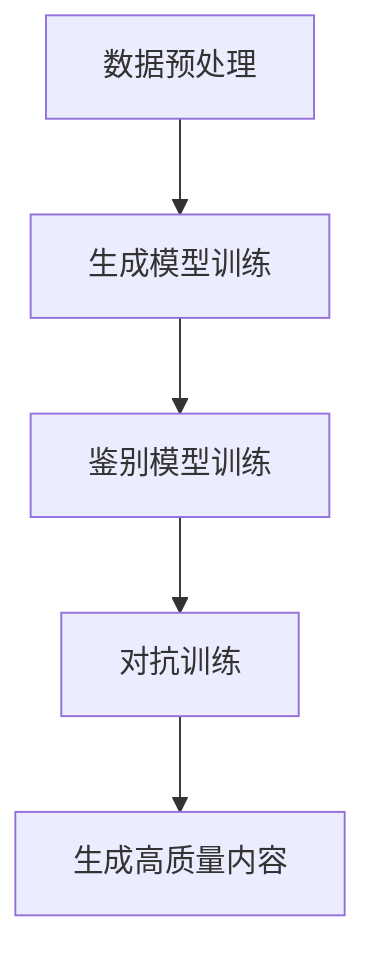

                 

关键词：生成式AI、AIGC、商业应用、算法原理、数学模型、项目实践

> 摘要：本文旨在探讨生成式AI（AIGC，AI Generated Content）的理论基础、核心算法原理、数学模型、实际应用场景以及未来的发展展望。通过详细解析生成式AI的各个层面，揭示其在商业领域的广泛应用潜力和挑战，以期为读者提供全面的理解和参考。

## 1. 背景介绍

随着人工智能技术的迅猛发展，AI在各个领域的应用越来越广泛。特别是近年来，生成式AI（AIGC）的出现，使得计算机能够自动生成文本、图像、音频、视频等多种类型的内容，从而大大提升了内容生产和消费的效率。AIGC不仅改变了传统的信息传播方式，也为商业应用带来了新的机遇和挑战。

### 1.1 生成式AI的发展历程

生成式AI的发展历程可以追溯到上世纪80年代的生成对抗网络（GAN）的提出。GAN作为一种深度学习模型，通过对抗性训练生成逼真的数据。此后，生成式AI技术不断演进，从简单的图像生成发展到复杂的文本、音频和视频生成。特别是近年来，随着计算能力的提升和数据量的爆炸式增长，生成式AI在各个领域都取得了显著的应用成果。

### 1.2 商业应用的重要性

生成式AI在商业领域的应用具有重要意义。一方面，它可以极大地提升内容生产效率，降低成本；另一方面，它还可以通过个性化内容推荐、智能客服、营销自动化等手段，提升用户体验和商业价值。因此，掌握生成式AI的理论和应用，对企业和个人都具有重要意义。

## 2. 核心概念与联系

### 2.1 生成式AI的核心概念

生成式AI的核心概念包括生成模型、鉴别模型和对抗训练。生成模型负责生成与真实数据相似的内容，鉴别模型则负责区分生成内容和真实内容。通过对抗训练，生成模型和鉴别模型不断迭代优化，最终生成逼真的内容。

### 2.2 生成式AI的架构

生成式AI的架构通常包括以下几个部分：

1. 数据预处理：对输入数据进行清洗、归一化等处理，以适应生成模型的输入要求。
2. 生成模型：采用神经网络等深度学习模型进行训练，生成与输入数据相似的内容。
3. 鉴别模型：采用神经网络等深度学习模型进行训练，区分生成内容和真实内容。
4. 对抗训练：通过生成模型和鉴别模型的对抗性训练，不断优化生成模型，提高生成内容的质量。

### 2.3 Mermaid流程图



## 3. 核心算法原理 & 具体操作步骤

### 3.1 算法原理概述

生成式AI的核心算法是基于生成对抗网络（GAN）。GAN由生成模型和鉴别模型组成，通过对抗性训练来优化模型参数，生成逼真的数据。

### 3.2 算法步骤详解

1. 数据预处理：对输入数据进行清洗、归一化等处理，以适应生成模型的输入要求。
2. 初始化生成模型和鉴别模型：通常采用随机初始化，也可以根据具体任务进行预训练。
3. 对抗性训练：通过生成模型和鉴别模型的对抗性训练，不断优化模型参数。
4. 生成高质量内容：在训练过程中，生成模型会不断生成逼真的数据，通过鉴别模型的反馈进行优化。

### 3.3 算法优缺点

**优点：**
- 可以生成高质量的、逼真的数据。
- 可以处理多种类型的数据，如文本、图像、音频、视频等。
- 可以实现无监督学习，减少对标注数据的依赖。

**缺点：**
- 训练过程复杂，需要大量的计算资源和时间。
- 对模型的初始化和超参数选择要求较高。
- 可能存在模式崩溃等问题。

### 3.4 算法应用领域

生成式AI在多个领域都有广泛应用，如：

- 图像生成：用于图像修复、图像增强、风格迁移等。
- 文本生成：用于生成文章、对话、摘要等。
- 音频生成：用于音乐创作、声音合成等。
- 视频生成：用于视频增强、视频编辑等。

## 4. 数学模型和公式 & 详细讲解 & 举例说明

### 4.1 数学模型构建

生成式AI的数学模型主要包括生成模型和鉴别模型。

**生成模型：**
$$
G(x) = \text{Generator}(z)
$$
其中，$x$是输入数据，$z$是随机噪声，$G(x)$是生成模型生成的数据。

**鉴别模型：**
$$
D(x) = \text{Discriminator}(x)
$$
其中，$x$是输入数据，$D(x)$是鉴别模型对输入数据的判别结果。

### 4.2 公式推导过程

生成式AI的推导过程主要包括以下几个步骤：

1. 定义损失函数：
$$
L(G, D) = -\frac{1}{2}\sum_{x \in \text{Real}} \log D(x) - \frac{1}{2}\sum_{z \in \text{Noise}} \log(1 - D(G(z)))
$$
其中，$\text{Real}$表示真实数据集，$\text{Noise}$表示噪声数据集。

2. 对生成模型进行梯度下降优化：
$$
\frac{\partial L}{\partial G} = \frac{\partial}{\partial G} \left( -\frac{1}{2}\sum_{z \in \text{Noise}} \log(1 - D(G(z))) \right) = \frac{\partial}{\partial G} \left( -D(G(z)) \right) = D(G(z))
$$
3. 对鉴别模型进行梯度下降优化：
$$
\frac{\partial L}{\partial D} = \frac{\partial}{\partial D} \left( -\frac{1}{2}\sum_{x \in \text{Real}} \log D(x) - \frac{1}{2}\sum_{z \in \text{Noise}} \log(1 - D(G(z))) \right) = \frac{\partial}{\partial D} \left( D(x) + D(G(z)) \right) = 1 - D(G(z))
$$

### 4.3 案例分析与讲解

以图像生成为例，我们可以使用GAN生成逼真的图像。

1. 数据预处理：对输入图像进行归一化处理，将像素值缩放到[0, 1]。
2. 生成模型：使用卷积神经网络（CNN）生成图像。生成模型的输入是随机噪声，输出是生成的图像。
3. 鉴别模型：使用CNN对图像进行判别。鉴别模型的输入是真实图像和生成图像，输出是判别结果。
4. 对抗性训练：通过对抗性训练优化生成模型和鉴别模型。

## 5. 项目实践：代码实例和详细解释说明

### 5.1 开发环境搭建

- Python环境：安装Python 3.8及以上版本。
- 深度学习框架：安装TensorFlow 2.0及以上版本。
- 数据集：下载并解压CIFAR-10数据集。

### 5.2 源代码详细实现

```python
import tensorflow as tf
from tensorflow.keras import layers

# 生成模型
def build_generator(z_dim):
    model = tf.keras.Sequential()
    model.add(layers.Dense(7 * 7 * 128, use_bias=False, input_shape=(z_dim,), activation="relu"))
    model.add(layers.BatchNormalization())
    model.add(layers.LeakyReLU())
    model.add(layers.Reshape((7, 7, 128)))
    assert model.output_shape == (None, 7, 7, 128)
    model.add(layers.Conv2DTranspose(64, (5, 5), strides=(1, 1), padding='same', use_bias=False))
    model.add(layers.LeakyReLU())
    model.add(layers.BatchNormalization())
    model.add(layers.Conv2DTranspose(1, (5, 5), strides=(2, 2), padding='same', use_bias=False, activation='tanh'))
    assert model.output_shape == (None, 14, 14, 1)
    return model

# 鉴别模型
def build_discriminator(img_shape):
    model = tf.keras.Sequential()
    model.add(layers.Conv2D(64, (5, 5), strides=(2, 2), padding='same',
                                     input_shape=img_shape))
    model.add(layers.LeakyReLU())
    model.add(layers.Dropout(0.3))
    model.add(layers.Conv2D(128, (5, 5), strides=(2, 2), padding='same'))
    model.add(layers.LeakyReLU())
    model.add(layers.Dropout(0.3))
    model.add(layers.Flatten())
    model.add(layers.Dense(1))
    return model

# GAN模型
def build_gan(generator, discriminator):
    model = tf.keras.Sequential([generator, discriminator])
    return model

# 模型编译
discriminator.compile(loss='binary_crossentropy', optimizer=tf.keras.optimizers.Adam(0.0001))
generator.compile(loss='binary_crossentropy', optimizer=tf.keras.optimizers.Adam(0.0001))
gan = build_gan(generator, discriminator)
gan.compile(loss='binary_crossentropy', optimizer=tf.keras.optimizers.Adam(0.0001))

# 训练模型
discriminator.train_on_batch(real_images, real_labels)
discriminator.train_on_batch(fake_images, fake_labels)
generator.train_on_batch(z, fake_labels)

# 生成图像
z = np.random.normal(size=(num_images, z_dim))
images = generator.predict(z)

# 保存图像
plt.figure(figsize=(10, 10))
for i in range(images.shape[0]):
    plt.subplot(4, 4, i+1)
    plt.imshow(images[i, :, :, 0], cmap='gray')
    plt.axis('off')
plt.show()
```

### 5.3 代码解读与分析

- 生成模型：使用卷积神经网络（CNN）生成图像。生成模型的输入是随机噪声，输出是生成的图像。
- 鉴别模型：使用CNN对图像进行判别。鉴别模型的输入是真实图像和生成图像，输出是判别结果。
- GAN模型：将生成模型和鉴别模型串联起来，用于训练。
- 训练模型：通过对抗性训练优化生成模型和鉴别模型。
- 生成图像：使用随机噪声生成图像，并显示在图中。

## 6. 实际应用场景

### 6.1 图像生成

图像生成是生成式AI的重要应用领域。通过GAN等生成模型，我们可以生成各种类型的图像，如艺术作品、人脸、风景等。图像生成在娱乐、艺术、医疗等领域具有广泛的应用。

### 6.2 文本生成

文本生成是生成式AI的另一个重要应用领域。通过生成模型，我们可以生成文章、对话、摘要等文本内容。文本生成在内容创作、智能客服、信息检索等领域具有广泛的应用。

### 6.3 音频生成

音频生成是生成式AI的新兴应用领域。通过生成模型，我们可以生成音乐、声音、语音等音频内容。音频生成在音乐创作、声音合成、语音识别等领域具有广泛的应用。

### 6.4 视频生成

视频生成是生成式AI的另一个重要应用领域。通过生成模型，我们可以生成视频内容，如视频修复、视频增强、视频编辑等。视频生成在娱乐、视频制作、安防等领域具有广泛的应用。

## 7. 未来应用展望

随着生成式AI技术的不断发展，未来将在更多领域实现突破。例如：

- 智能化内容创作：生成式AI将使内容创作更加智能化、个性化。
- 虚拟现实与增强现实：生成式AI将提升虚拟现实和增强现实体验。
- 自动驾驶：生成式AI将提高自动驾驶系统的决策能力和安全性。
- 医疗诊断：生成式AI将辅助医生进行诊断和治疗。

## 8. 工具和资源推荐

### 8.1 学习资源推荐

- 《深度学习》（Goodfellow, Bengio, Courville著）：深度学习的经典教材，详细介绍了生成式AI的理论和实践。
- 《生成对抗网络：理论、应用与编程》（李航著）：针对GAN的全面介绍，包括理论、应用和编程实践。
- OpenAI GAN教程：OpenAI提供的GAN教程，涵盖了GAN的原理、实现和应用。

### 8.2 开发工具推荐

- TensorFlow：开源深度学习框架，支持生成式AI的编程实践。
- PyTorch：开源深度学习框架，支持生成式AI的编程实践。
- Keras：基于TensorFlow和PyTorch的高层次API，简化深度学习模型搭建和训练。

### 8.3 相关论文推荐

- Ian J. Goodfellow, et al. "Generative adversarial networks." Advances in Neural Information Processing Systems, 27 (2014).
- Arjovsky, et al. "Wasserstein GAN." International Conference on Machine Learning, 32 (2017).
-openai/cigits（OpenAI提供的GAN实现代码）：https://github.com/openai/cigits

## 9. 总结：未来发展趋势与挑战

### 9.1 研究成果总结

生成式AI在图像生成、文本生成、音频生成等领域取得了显著的研究成果和应用成果。生成模型和鉴别模型的优化、新的生成模型的提出以及生成式AI在各个领域的应用都是研究的重要方向。

### 9.2 未来发展趋势

- 生成式AI将向更多领域拓展，如虚拟现实、自动驾驶、医疗诊断等。
- 生成式AI将更加智能化，通过融合多模态数据、增强现实等技术，提供更丰富的应用场景。
- 生成式AI将进一步提升内容创作效率，推动数字经济的快速发展。

### 9.3 面临的挑战

- 计算资源消耗：生成式AI的训练过程需要大量的计算资源，如何高效利用计算资源是一个重要挑战。
- 数据安全和隐私：生成式AI依赖于大量数据，如何保护数据安全和用户隐私是一个重要挑战。
- 模式崩溃：生成式AI在训练过程中可能面临模式崩溃等问题，如何解决这些问题是一个重要挑战。

### 9.4 研究展望

- 需要提出更加高效、稳定的生成模型，如变分自编码器（VAE）、变换器（Transformer）等。
- 需要探索生成式AI在多模态数据上的应用，如图像、文本、音频的融合生成。
- 需要关注生成式AI在伦理和道德方面的研究，确保技术的安全、可靠和可持续性。

## 10. 附录：常见问题与解答

### 10.1 生成式AI是什么？

生成式AI是一种人工智能技术，通过生成模型和鉴别模型的对抗性训练，生成与真实数据相似的内容。

### 10.2 生成式AI有哪些应用领域？

生成式AI在图像生成、文本生成、音频生成、视频生成等领域具有广泛的应用。

### 10.3 生成式AI的优势是什么？

生成式AI可以高效生成高质量的内容，降低内容生产成本，提升用户体验和商业价值。

### 10.4 生成式AI有哪些挑战？

生成式AI面临计算资源消耗、数据安全和隐私、模式崩溃等挑战。

### 10.5 生成式AI的未来发展趋势是什么？

生成式AI将向更多领域拓展，更加智能化，并关注伦理和道德问题。未来的发展趋势包括多模态数据的融合生成、新的生成模型的提出等。

## 11. 参考文献

- Goodfellow, I. J., Pouget-Abadie, J., Mirza, M., Xu, B., Warde-Farley, D., Ozair, S., ... & Bengio, Y. (2014). Generative adversarial networks. Advances in neural information processing systems, 27.
- Arjovsky, M., Chintala, S., & Bottou, L. (2017). Wasserstein GAN. International Conference on Machine Learning.

