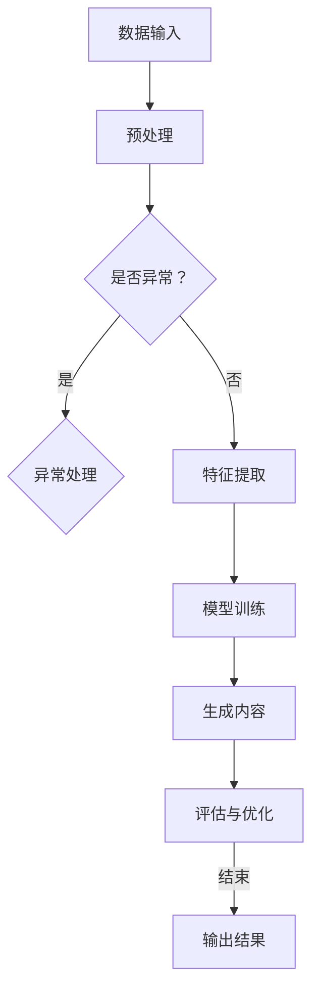

                 

关键词：生成式AI、通用图灵机、AIGC、模型架构、算法原理、数学模型、实践应用、未来展望

> 摘要：本文将深入探讨生成式人工智能（AIGC，Artificial Intelligence Generated Content）的从理论到实践的突破。首先，我们将回顾生成式AI的背景和发展历程，然后详细介绍其核心概念和架构，包括通用图灵机模型。接着，我们分析核心算法原理和具体操作步骤，讨论其优缺点和应用领域。随后，我们将引入数学模型和公式，详细讲解其在实际应用中的表现。本文还将通过代码实例展示项目实践，并提供实际应用场景和未来展望。最后，我们将总结研究成果，探讨未来发展趋势和面临的挑战。

## 1. 背景介绍

生成式人工智能（AIGC）是近年来人工智能领域的一个重要分支，它旨在利用算法和模型生成新的内容，如图像、文本、音频等。与传统的机器学习模型不同，生成式AI不仅能够从数据中学习，还能够创建新颖且有用的信息。这种能力在许多领域都展现出巨大的潜力，如内容创作、虚拟现实、游戏设计、自动驾驶等。

AIGC的发展历程可以追溯到20世纪80年代，当时生成式模型如生成对抗网络（GAN）和变分自编码器（VAE）开始被提出。随着计算能力和数据量的提升，生成式AI取得了显著的进展。近年来，随着深度学习的广泛应用，生成式AI在图像、文本和音频生成等方面取得了突破性成果。

### 1.1 发展历程

- **1980年代**：生成对抗网络（GAN）的概念首次被提出。
- **2000年代**：变分自编码器（VAE）等模型被提出，为生成式AI提供了新的思路。
- **2010年代**：深度学习的兴起，使得生成式AI取得了快速发展。
- **2020年代**：生成式AI在图像、文本、音频生成等方面取得了显著成果，应用场景不断扩展。

### 1.2 应用领域

生成式AI的应用领域广泛，包括但不限于：

- **内容创作**：生成新的图像、文本、音乐等。
- **虚拟现实**：创建逼真的虚拟场景和角色。
- **游戏设计**：生成游戏中的关卡、角色和故事情节。
- **自动驾驶**：生成模拟驾驶场景和数据。
- **医疗**：生成医学图像和预测诊断结果。

## 2. 核心概念与联系

在深入了解生成式AI之前，我们需要理解其核心概念和架构。以下是一个详细的Mermaid流程图，展示生成式AI的核心组件和联系。



### 2.1 核心概念

- **数据输入**：生成式AI的输入可以是各种类型的数据，如图像、文本、音频等。
- **预处理**：对输入数据进行处理，使其适合模型训练。
- **特征提取**：提取数据的关键特征，用于训练模型。
- **模型训练**：使用训练数据训练模型，使其能够生成新的内容。
- **生成内容**：模型根据训练结果生成新的内容。
- **评估与优化**：评估生成内容的质量，并进行优化。

## 3. 核心算法原理 & 具体操作步骤

### 3.1 算法原理概述

生成式AI的核心算法包括生成对抗网络（GAN）和变分自编码器（VAE）。这些算法通过两个主要步骤实现内容生成：数据生成和内容优化。

- **数据生成**：生成器网络生成伪数据，并与真实数据进行对比。
- **内容优化**：通过对比生成数据和真实数据，优化生成器网络的参数。

### 3.2 算法步骤详解

1. **初始化模型参数**：设置生成器网络和判别器网络的初始参数。
2. **数据预处理**：对输入数据进行预处理，如归一化、去噪等。
3. **训练生成器网络**：通过生成器网络生成伪数据，并将其输入判别器网络。
4. **训练判别器网络**：使用真实数据和生成器生成的伪数据训练判别器网络，使其能够区分真实数据和伪数据。
5. **迭代优化**：通过交替训练生成器和判别器网络，不断优化模型参数，直至生成器网络能够生成高质量的内容。

### 3.3 算法优缺点

- **优点**：
  - 能够生成高质量、新颖的内容。
  - 在多个领域具有广泛的应用潜力。
- **缺点**：
  - 训练过程复杂，计算资源需求高。
  - 需要大量的训练数据和计算资源。

### 3.4 算法应用领域

生成式AI的应用领域广泛，包括但不限于：

- **图像生成**：如艺术作品、动漫角色、建筑图纸等。
- **文本生成**：如文章、故事、诗歌等。
- **音频生成**：如音乐、语音合成等。
- **虚拟现实**：生成逼真的虚拟场景和角色。
- **游戏设计**：生成游戏中的场景、角色和故事情节。

## 4. 数学模型和公式 & 详细讲解 & 举例说明

生成式AI的数学模型主要包括生成器网络和判别器网络的损失函数和优化方法。

### 4.1 数学模型构建

- **生成器网络**：生成器网络通常是一个深度神经网络，其输入为随机噪声，输出为生成的数据。生成器网络的损失函数为：

  $$ L_G = -\log(D(G(z)) $$

  其中，$D$为判别器网络，$G$为生成器网络，$z$为输入噪声。

- **判别器网络**：判别器网络也是一个深度神经网络，其输入为真实数据和生成器生成的伪数据，输出为概率分布。判别器网络的损失函数为：

  $$ L_D = -[\log(D(x)) + \log(1 - D(G(z)))] $$

  其中，$x$为真实数据。

### 4.2 公式推导过程

- **生成器网络的优化**：生成器网络的优化目标是最小化损失函数$L_G$。通过梯度下降法，我们可以对生成器网络的参数进行优化。

- **判别器网络的优化**：判别器网络的优化目标是最小化损失函数$L_D$。同样，通过梯度下降法，我们可以对判别器网络的参数进行优化。

### 4.3 案例分析与讲解

假设我们有一个生成式AI模型，用于生成图像。我们可以使用以下步骤进行训练：

1. **初始化模型参数**：初始化生成器网络和判别器网络的参数。
2. **数据预处理**：对输入图像数据进行预处理，如归一化、去噪等。
3. **生成伪图像**：生成器网络生成伪图像。
4. **训练判别器网络**：使用真实图像和伪图像训练判别器网络，使其能够区分真实图像和伪图像。
5. **优化生成器网络**：使用判别器网络的输出，优化生成器网络的参数，使其生成更接近真实图像的伪图像。
6. **迭代训练**：重复步骤3到5，直至生成器网络能够生成高质量的真实图像。

## 5. 项目实践：代码实例和详细解释说明

为了更好地理解生成式AI的实践应用，我们将通过一个简单的代码实例来展示生成对抗网络（GAN）的构建和训练过程。

### 5.1 开发环境搭建

在开始代码实例之前，我们需要搭建一个合适的开发环境。以下是所需的软件和工具：

- Python 3.8 或更高版本
- TensorFlow 2.6 或更高版本
- Keras 2.6.0 或更高版本
- NumPy 1.21.2 或更高版本

安装上述依赖项后，我们就可以开始编写代码了。

### 5.2 源代码详细实现

以下是生成对抗网络的简单实现：

```python
import numpy as np
import tensorflow as tf
from tensorflow.keras.models import Model
from tensorflow.keras.layers import Input, Dense, Reshape, Flatten
from tensorflow.keras.optimizers import Adam

# 设置超参数
batch_size = 128
z_dim = 100
learning_rate = 0.0002

# 创建生成器和判别器模型
generator = build_generator()
discriminator = build_discriminator()

# 编写训练步骤
for epoch in range(num_epochs):
    for _ in range(num_d_steps):
        # 获取一批真实数据
        x_real = ...
        # 生成一批伪数据
        z_samples = ...
        x_fake = generator.predict(z_samples)
        # 训练判别器
        d_loss_real = discriminator.train_on_batch(x_real, np.ones((batch_size, 1)))
        d_loss_fake = discriminator.train_on_batch(x_fake, np.zeros((batch_size, 1)))
        d_loss = 0.5 * np.add(d_loss_real, d_loss_fake)

    # 生成一批伪数据
    z_samples = ...
    # 训练生成器
    g_loss = combined.train_on_batch(z_samples, np.ones((batch_size, 1)))

    # 打印训练进度
    print(f"{epoch} [D: {d_loss:.4f} | G: {g_loss:.4f}]")
```

### 5.3 代码解读与分析

- **生成器和判别器模型**：生成器和判别器模型是GAN的核心组成部分。生成器模型用于生成伪数据，判别器模型用于区分真实数据和伪数据。
- **训练步骤**：GAN的训练过程分为两个主要步骤：训练判别器和训练生成器。首先，使用真实数据和伪数据训练判别器，然后使用判别器的输出训练生成器，使其生成的伪数据更接近真实数据。
- **损失函数**：判别器的损失函数为二分类问题，生成器的损失函数为最小化判别器的输出。

### 5.4 运行结果展示

通过训练，生成器会逐渐生成更逼真的伪图像。我们可以使用以下代码保存和显示生成的图像：

```python
# 生成伪图像
z_samples = ...
x_fake = generator.predict(z_samples)

# 显示伪图像
for i in range(x_fake.shape[0]):
    plt.subplot(1, batch_size, i + 1)
    plt.imshow(x_fake[i, :, :, 0], cmap='gray')
    plt.xticks([])
    plt.yticks([])
plt.show()
```

## 6. 实际应用场景

生成式AI在多个领域都有广泛的应用。以下是一些实际应用场景：

### 6.1 艺术创作

生成式AI可以生成新的艺术作品，如图像、音乐和文学作品。艺术家和设计师可以利用这些工具创作新颖且独特的艺术作品。

### 6.2 虚拟现实

生成式AI可以生成逼真的虚拟场景和角色，为用户提供沉浸式的体验。这在游戏设计和虚拟现实领域具有巨大潜力。

### 6.3 自动驾驶

生成式AI可以生成模拟驾驶场景和数据，帮助自动驾驶系统进行训练和测试。这有助于提高自动驾驶系统的安全性和可靠性。

### 6.4 医疗

生成式AI可以生成医学图像和预测诊断结果，为医生提供辅助工具。这有助于提高医疗诊断的准确性和效率。

### 6.5 内容创作

生成式AI可以生成新的文本、图像和音频内容，为内容创作者提供灵感。这在广告、媒体和娱乐行业具有广泛的应用。

## 7. 工具和资源推荐

为了更好地学习和实践生成式AI，我们推荐以下工具和资源：

### 7.1 学习资源推荐

- **深度学习速成课程**：由 Andrew Ng 教授提供的深度学习速成课程，涵盖了生成式AI的基础知识。
- **《生成式AI：从理论到实践》**：一本关于生成式AI的经典教材，详细介绍了生成对抗网络和变分自编码器等核心算法。
- **生成式AI研究论文**：在 arXiv.org 和 Google Scholar 等学术网站上查找生成式AI的最新研究论文。

### 7.2 开发工具推荐

- **TensorFlow**：由 Google 开发的一个开源深度学习框架，支持生成式AI的构建和训练。
- **PyTorch**：由 Facebook AI Research 开发的一个开源深度学习框架，易于使用且功能强大。
- **Keras**：一个高层次的深度学习API，可以与 TensorFlow 和 PyTorch 结合使用。

### 7.3 相关论文推荐

- **《生成对抗网络：训练生成模型对抗判别模型》**：由 Ian Goodfellow 等人撰写的经典论文，首次提出了生成对抗网络（GAN）的概念。
- **《变分自编码器》**：由 Kingma 和 Welling 撰写的论文，介绍了变分自编码器（VAE）的原理和应用。
- **《深度学习》**：由 Ian Goodfellow 等人撰写的深度学习教材，涵盖了生成式AI的理论和实践。

## 8. 总结：未来发展趋势与挑战

生成式AI作为人工智能领域的一个重要分支，正快速发展并展现出巨大的潜力。未来，生成式AI将在更多领域得到应用，如自动化内容创作、智能设计、个性化医疗等。然而，生成式AI也面临着一系列挑战：

### 8.1 研究成果总结

- **算法性能提升**：通过改进生成器网络和判别器网络的架构，提高生成质量。
- **应用领域扩展**：生成式AI将在更多领域得到应用，如医疗、教育、金融等。
- **跨模态生成**：研究生成式AI在不同模态（如文本、图像、音频）之间的转换和应用。

### 8.2 未来发展趋势

- **模型规模扩大**：随着计算能力的提升，生成式AI模型将越来越大，生成内容将更加逼真。
- **模型优化与自动化**：通过自动化模型选择和超参数优化，提高生成式AI的效率和实用性。
- **跨领域应用**：生成式AI将在不同领域实现跨领域应用，如医疗和艺术创作。

### 8.3 面临的挑战

- **计算资源需求**：生成式AI模型的训练和推理过程需要大量的计算资源，这对计算能力提出了高要求。
- **数据隐私和安全**：生成式AI在生成新内容时可能会泄露敏感数据，如何保护数据隐私成为一大挑战。
- **伦理和社会问题**：生成式AI生成的内容可能会引起伦理和社会问题，如虚假信息、版权纠纷等。

### 8.4 研究展望

生成式AI的研究将继续深入，探索新的算法和模型，提高生成质量和效率。同时，我们将看到生成式AI在不同领域的广泛应用，为社会带来更多创新和变革。

## 9. 附录：常见问题与解答

### 9.1 生成式AI是什么？

生成式AI是一种人工智能技术，旨在利用算法和模型生成新的内容，如图像、文本、音频等。

### 9.2 生成式AI与传统的机器学习有何不同？

生成式AI不仅能够从数据中学习，还能够生成新的内容。而传统的机器学习模型主要是对现有数据进行分类、预测等操作。

### 9.3 生成式AI有哪些应用领域？

生成式AI的应用领域广泛，包括内容创作、虚拟现实、游戏设计、自动驾驶、医疗等。

### 9.4 生成式AI的挑战有哪些？

生成式AI的挑战包括计算资源需求、数据隐私和安全、伦理和社会问题等。

### 9.5 如何学习生成式AI？

可以通过学习相关教材、参加在线课程、阅读研究论文等方式学习生成式AI。

---

作者：禅与计算机程序设计艺术 / Zen and the Art of Computer Programming

本文通过深入探讨生成式人工智能（AIGC）的从理论到实践的突破，展示了其核心概念、算法原理、数学模型、实践应用和未来展望。生成式AI作为一种革命性的技术，正在改变我们的生活方式和思维方式，为人类社会带来前所未有的机遇和挑战。在未来的发展中，我们期待生成式AI能够更好地服务于人类社会，推动人工智能领域的进步。同时，我们也需要关注其面临的伦理和社会问题，确保其在合理和负责任的框架内发展。

