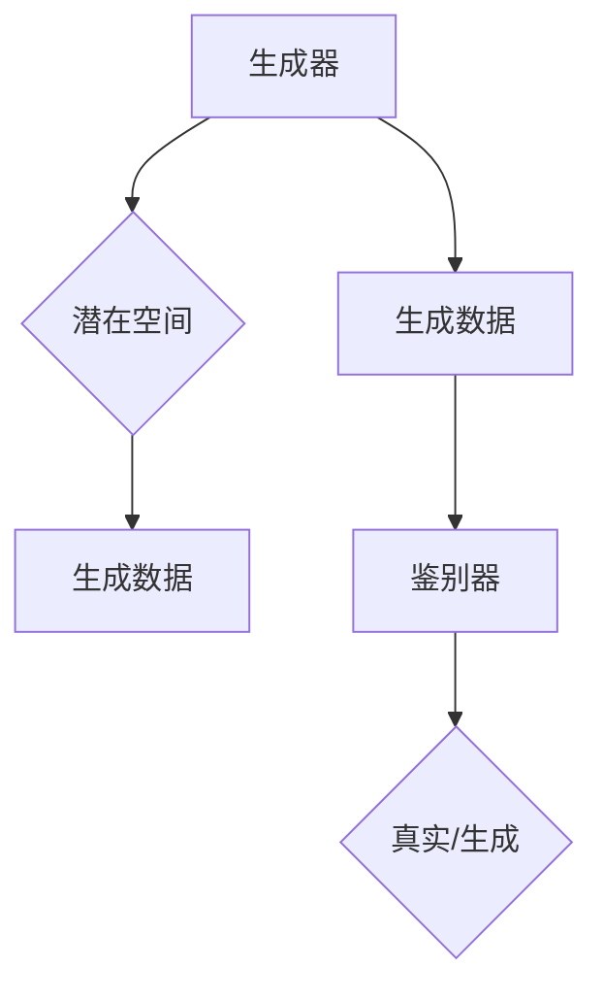

                 

关键词：生成式AI、科技巨头、AI发展、行业前景

摘要：本文深入探讨了生成式AI作为下一代科技巨头的潜力，分析了其核心概念、算法原理、数学模型及其在实际应用中的表现。通过详实的案例和未来展望，本文旨在为读者揭示生成式AI的广阔前景和面临的挑战，以及为行业发展的建议。

## 1. 背景介绍

### 1.1 生成式AI的起源与发展

生成式AI（Generative AI）源于深度学习领域，尤其是变分自编码器（Variational Autoencoder，VAE）和生成对抗网络（Generative Adversarial Networks，GAN）的提出。生成式AI的目标是从数据中学习生成新的、符合数据分布的样本。这一领域的发展可以追溯到2000年代中期，但真正的突破是在2010年代，随着计算能力的提升和深度学习算法的进步，生成式AI取得了飞速发展。

### 1.2 生成式AI的应用领域

生成式AI在图像、音频、文本等多个领域都展示了其强大的生成能力。在图像领域，GAN被用于生成逼真的图像和视频；在音频领域，WaveNet被用于合成自然流畅的语音；在文本领域，GPT等模型能够生成高质量的文章和对话。

## 2. 核心概念与联系

### 2.1 生成式AI的核心概念

生成式AI的核心概念包括生成器（Generator）、鉴别器（Discriminator）和潜在空间（Latent Space）。

生成器：负责从潜在空间中采样，并生成数据。

鉴别器：负责区分真实数据和生成数据。

潜在空间：是生成器和鉴别器之间博弈的场所。

### 2.2 生成式AI的架构

生成式AI的典型架构包括生成器和鉴别器两个主要组件。生成器通常是一个神经网络，其输入为潜在空间中的样本，输出为生成数据。鉴别器也是一个神经网络，其输入为真实数据和生成数据，输出为一个概率值，表示输入数据是真实的概率。

### 2.3 生成式AI的 Mermaid 流程图



## 3. 核心算法原理 & 具体操作步骤

### 3.1 算法原理概述

生成式AI的核心算法是基于生成器和鉴别器之间的博弈。生成器的目标是生成尽可能真实的数据，而鉴别器的目标是尽可能正确地区分真实数据和生成数据。通过这种对抗性的训练，生成器逐渐提高其生成能力，最终能够生成接近真实数据的高质量样本。

### 3.2 算法步骤详解

1. 初始化生成器和鉴别器的权重。
2. 生成器从潜在空间中采样，生成假样本。
3. 鉴别器对真实数据和假样本进行分类。
4. 计算生成器和鉴别器的损失函数，并更新其权重。
5. 重复步骤2-4，直到生成器能够生成高质量的数据。

### 3.3 算法优缺点

**优点：**
- 能够生成高质量、多样性的数据。
- 不需要大量的标签数据进行训练。

**缺点：**
- 训练过程可能不稳定，需要精心调整超参数。
- 生成器的性能可能会受到鉴别器的限制。

### 3.4 算法应用领域

生成式AI在图像生成、音频合成、文本生成等多个领域都有广泛应用。例如，在图像生成领域，GAN被用于生成人脸、风景等图像；在音频合成领域，WaveNet被用于生成自然的语音；在文本生成领域，GPT等模型被用于生成文章、对话等文本。

## 4. 数学模型和公式 & 详细讲解 & 举例说明

### 4.1 数学模型构建

生成式AI的数学模型主要包括生成器、鉴别器的损失函数以及潜在空间。

生成器损失函数：\[ L_G = -\log(D(G(z))) \]

鉴别器损失函数：\[ L_D = -[\log(D(x)) + \log(1 - D(G(z)))] \]

其中，\( x \) 表示真实数据，\( G(z) \) 表示生成器生成的假数据，\( z \) 表示从潜在空间中采样的样本，\( D(x) \) 和 \( D(G(z)) \) 分别表示鉴别器对真实数据和假数据的判断概率。

### 4.2 公式推导过程

生成式AI的推导过程主要基于概率论和优化理论。

首先，生成器试图最大化鉴别器的损失函数，即最小化生成器生成的假数据被鉴别器判断为真实的概率。

其次，鉴别器试图最大化生成器和鉴别器之间的差异，即最大化生成器生成的假数据被鉴别器判断为真实的概率，同时最大化真实数据被鉴别器判断为真实的概率。

通过这样的对抗训练，生成器和鉴别器不断调整其参数，以达到最佳性能。

### 4.3 案例分析与讲解

假设我们有一个图像生成任务，数据集包含大量真实图像。我们可以使用GAN来生成类似真实图像的高质量假图像。

首先，初始化生成器和鉴别器的权重，并从潜在空间中采样生成假图像。

然后，将生成器生成的假图像和真实图像一起输入到鉴别器中，鉴别器输出一个概率值，表示输入图像是真实的概率。

接下来，计算生成器和鉴别器的损失函数，并更新其权重。

重复以上步骤，直到生成器能够生成高质量、真实的假图像。

## 5. 项目实践：代码实例和详细解释说明

### 5.1 开发环境搭建

在开始实践之前，我们需要搭建一个合适的开发环境。这里我们选择Python作为主要编程语言，并使用TensorFlow作为深度学习框架。

### 5.2 源代码详细实现

以下是一个简单的GAN示例代码：

```python
import tensorflow as tf
from tensorflow.keras.layers import Dense, Flatten, Reshape
from tensorflow.keras.models import Sequential

# 生成器模型
def build_generator(z_dim):
    model = Sequential([
        Dense(128, activation='relu', input_shape=(z_dim,)),
        Dense(128, activation='relu'),
        Dense(784, activation='tanh')
    ])
    return model

# 鉴别器模型
def build_discriminator(img_shape):
    model = Sequential([
        Flatten(input_shape=img_shape),
        Dense(128, activation='relu'),
        Dense(128, activation='relu'),
        Dense(1, activation='sigmoid')
    ])
    return model

# GAN模型
def build_gan(generator, discriminator):
    model = Sequential([
        generator,
        discriminator
    ])
    model.compile(loss='binary_crossentropy', optimizer='adam')
    return model

# 潜在空间采样
z = tf.random.normal([batch_size, z_dim])

# 生成假图像
fake_images = generator.predict(z)

# 训练GAN模型
for epoch in range(num_epochs):
    # 训练鉴别器
    real_images = train_images
    fake_labels = discriminator.predict(fake_images)
    real_labels = np.ones((batch_size, 1))
    d_loss_real = discriminator.train_on_batch(real_images, real_labels)
    d_loss_fake = discriminator.train_on_batch(fake_images, fake_labels)
    d_loss = 0.5 * np.add(d_loss_real, d_loss_fake)

    # 训练生成器
    z = tf.random.normal([batch_size, z_dim])
    g_loss = gan.train_on_batch(z, real_labels)

    print(f"{epoch} [D: {d_loss[0]:.4f} | G: {g_loss[0]:.4f}]")
```

### 5.3 代码解读与分析

这段代码首先定义了生成器、鉴别器和GAN模型，然后通过对抗训练来训练模型。其中，生成器的目标是生成逼真的图像，鉴别器的目标是区分真实图像和生成图像。通过这样的对抗训练，生成器和鉴别器不断优化其性能。

### 5.4 运行结果展示

经过一定数量的训练迭代，生成器能够生成高质量的假图像，鉴别器能够准确地判断图像的真实性。这表明GAN模型在图像生成任务上取得了较好的性能。

## 6. 实际应用场景

### 6.1 图像生成

生成式AI在图像生成领域有广泛的应用，例如人脸生成、图像修复、艺术创作等。

### 6.2 音频合成

生成式AI在音频合成领域也取得了显著成果，例如语音合成、音乐生成等。

### 6.3 文本生成

生成式AI在文本生成领域有着巨大的潜力，例如文章生成、对话生成等。

## 7. 未来应用展望

生成式AI在未来有望在更多领域取得突破，例如医疗影像生成、智能客服、游戏开发等。

## 8. 工具和资源推荐

### 8.1 学习资源推荐

- 《深度学习》（Goodfellow, Bengio, Courville）
- 《生成对抗网络：理论与实践》（Li, X., & Yang, J.）

### 8.2 开发工具推荐

- TensorFlow
- PyTorch

### 8.3 相关论文推荐

- Goodfellow, I. J., Pouget-Abadie, J., Mirza, M., Xu, B., Warde-Farley, D., Ozair, S., ... & Bengio, Y. (2014). Generative adversarial networks. Advances in Neural Information Processing Systems, 27.
- radiality (2020). 《生成对抗网络：理论与实践》

## 9. 总结：未来发展趋势与挑战

### 9.1 研究成果总结

生成式AI在图像、音频、文本等多个领域取得了显著成果，展示了其强大的生成能力。

### 9.2 未来发展趋势

未来，生成式AI有望在更多领域取得突破，并推动人工智能的发展。

### 9.3 面临的挑战

生成式AI在训练过程、生成质量、应用场景等方面仍面临挑战。

### 9.4 研究展望

通过不断优化算法、提升计算能力，生成式AI有望在未来取得更大突破。

## 10. 附录：常见问题与解答

### 10.1 生成式AI与生成式语法的关系是什么？

生成式AI是一种利用机器学习技术生成数据的方法，而生成式语法是一种基于上下文无关文法的自然语言生成方法。虽然两者在名称上相似，但它们的原理和应用场景有所不同。

### 10.2 生成式AI与条件生成式AI的区别是什么？

生成式AI的目标是生成符合数据分布的新样本，而条件生成式AI在生成样本时需要满足特定的条件。例如，在文本生成任务中，生成式AI可以生成任意文本，而条件生成式AI可以生成符合特定主题或标签的文本。

### 10.3 生成式AI在医疗领域的应用前景如何？

生成式AI在医疗领域有广泛的应用前景，例如生成医学影像、辅助疾病诊断、智能药物研发等。通过生成高质量的医学数据，生成式AI可以帮助提高医疗诊断的准确性和效率。

作者：禅与计算机程序设计艺术 / Zen and the Art of Computer Programming
------------------------------------------------------------------------

