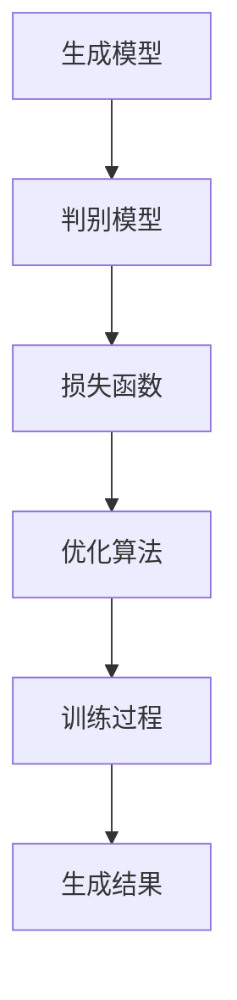

                 

 **关键词：** 生成式AI、数据、模型、算法、应用、未来展望

> **摘要：** 本篇文章将深入探讨生成式人工智能（AI）领域，特别是在数据的重要性方面。我们将分析生成式AI的核心概念、数据在模型训练中的关键角色，以及如何在实际应用中有效利用数据。此外，我们将探讨生成式AI的数学模型和公式，并通过实际项目实践展示其应用和效果。最后，我们将总结当前的研究成果、展望未来发展趋势和面临的挑战，并提供学习资源和工具推荐。

## 1. 背景介绍

生成式AI，作为深度学习的一个重要分支，近年来在全球范围内引起了广泛关注。其核心目标是通过学习数据来生成新的、类似的数据，这一特性使其在图像生成、自然语言处理、音乐创作等众多领域展现出巨大的潜力。然而，生成式AI的成功不仅依赖于复杂的模型设计和高效的算法，更重要的是大量的高质量数据。

### 生成式AI的发展历程

生成式AI的起源可以追溯到20世纪80年代，当时的研究者开始探索如何让计算机自动生成数据。最初的生成模型主要是基于概率论和统计学的方法，如生成对抗网络（GANs）和变分自编码器（VAEs）。随着计算能力的提升和大数据时代的到来，这些方法得到了进一步的优化和发展。

近年来，生成式AI的应用场景不断扩大，包括但不限于以下几个方面：

1. **图像生成：** 通过GANs和VAEs，计算机可以生成逼真的图像，甚至可以模仿各种艺术风格。
2. **自然语言处理：** 生成式AI在自然语言处理领域中的应用，如文本生成、对话系统，大大提升了机器理解和生成自然语言的能力。
3. **音乐创作：** 利用生成式AI，计算机可以创作出风格多样的音乐作品，为音乐创作提供了新的灵感。

### 数据在生成式AI中的重要性

尽管生成式AI的理论基础和技术日益成熟，但其发展仍然面临诸多挑战。其中，数据的重要性尤为突出。具体来说，数据在以下三个方面对生成式AI的发展起着关键作用：

1. **训练数据的质量和多样性：** 高质量、多样化的训练数据有助于生成模型更好地理解和学习数据的特征，从而生成更真实、多样化的数据。
2. **数据集的规模：** 大规模的数据集能够提供更丰富的信息，有助于模型捕捉更复杂的模式，提高生成质量。
3. **数据预处理：** 数据预处理是确保数据质量的关键步骤，包括数据清洗、归一化、去噪等，直接影响模型的训练效果。

## 2. 核心概念与联系

为了深入理解生成式AI的工作原理，我们需要先掌握几个核心概念，包括生成模型、判别模型、损失函数等。以下是一个简单的Mermaid流程图，展示了这些概念之间的关系：



### 生成模型与判别模型

生成模型和判别模型是生成式AI的核心组成部分。生成模型旨在学习如何生成与训练数据相似的新数据，而判别模型则负责判断生成数据是否真实。通过这两个模型的相互作用，生成式AI可以不断优化生成的数据质量。

1. **生成模型（Generator）：** 生成模型通常由一系列神经网络组成，其目标是生成尽可能真实的数据。例如，在图像生成任务中，生成模型会生成图像，而判别模型则会尝试判断这些图像是真实图像还是由生成模型生成的图像。

2. **判别模型（Discriminator）：** 判别模型与生成模型相对，其主要功能是区分真实数据和生成数据。在训练过程中，判别模型的目标是提高对真实数据的辨别能力，同时降低对生成数据的辨别能力。

### 损失函数与优化算法

损失函数是生成式AI训练过程中的关键工具，用于衡量生成模型生成的数据与真实数据之间的差距。优化算法则用于调整生成模型和判别模型的参数，以最小化损失函数。

1. **损失函数（Loss Function）：** 损失函数有多种类型，如交叉熵损失、均方误差（MSE）等。在生成式AI中，常见的损失函数是生成对抗损失（GAN Loss），它由生成模型和判别模型的损失组成。

2. **优化算法（Optimization Algorithm）：** 常见的优化算法有随机梯度下降（SGD）、Adam优化器等。这些算法通过不断调整模型参数，使生成模型和判别模型在训练过程中不断优化。

### 训练过程

生成式AI的训练过程是一个动态的交互过程，包括以下几个关键步骤：

1. **初始化模型参数：** 随机初始化生成模型和判别模型的参数。
2. **交替更新参数：** 在训练过程中，交替更新生成模型和判别模型的参数，使其逐渐优化。
3. **评估模型性能：** 通过生成模型生成的数据和判别模型对生成数据的判断，评估模型的性能。
4. **调整训练策略：** 根据模型性能的评估结果，调整训练策略，如学习率、训练数据等。

### 生成结果

经过训练后，生成模型能够生成与训练数据高度相似的新数据。这些生成结果可以应用于各种实际场景，如图像生成、文本生成、音乐生成等。

## 3. 核心算法原理 & 具体操作步骤

### 3.1 算法原理概述

生成式AI的核心算法主要包括生成对抗网络（GANs）和变分自编码器（VAEs）。以下是对这两种算法的简要概述。

1. **生成对抗网络（GANs）：** GANs由生成模型和判别模型组成，通过这两个模型的对抗训练，生成模型逐渐学会生成更真实的数据，而判别模型则逐渐提高对真实数据和生成数据的辨别能力。

2. **变分自编码器（VAEs）：** VAEs是一种概率生成模型，其目标是学习数据的概率分布。通过编码器和解码器的协作，VAE能够生成与训练数据相似的新数据。

### 3.2 算法步骤详解

以下将详细描述GANs和VAEs的具体操作步骤。

#### 3.2.1 生成对抗网络（GANs）

1. **初始化模型参数：** 随机初始化生成模型G和判别模型D的参数。
2. **生成数据：** 生成模型G从噪声分布中采样，生成与训练数据相似的数据。
3. **判断数据：** 判别模型D对生成的数据和真实数据进行判断。
4. **计算损失函数：** 计算生成模型G和判别模型D的损失函数，如GAN Loss。
5. **更新模型参数：** 使用优化算法，如SGD，交替更新生成模型G和判别模型D的参数。
6. **评估模型性能：** 通过生成模型G生成的数据和判别模型D对生成数据的判断，评估模型的性能。
7. **重复步骤2-6，直到模型收敛：** 重复以上步骤，使生成模型G和判别模型D的参数逐渐优化。

#### 3.2.2 变分自编码器（VAEs）

1. **初始化模型参数：** 随机初始化编码器E和解码器D的参数。
2. **编码数据：** 编码器E将输入数据编码为潜在空间中的点。
3. **采样潜在空间：** 从潜在空间中采样一个点，作为解码器的输入。
4. **解码数据：** 解码器D将采样点解码为输出数据。
5. **计算损失函数：** 计算编码器E和解码器D的损失函数，如KL散度损失和均方误差损失。
6. **更新模型参数：** 使用优化算法，如SGD，更新编码器E和解码器D的参数。
7. **评估模型性能：** 通过解码器D生成的数据和编码器E的编码质量，评估模型的性能。
8. **重复步骤2-7，直到模型收敛：** 重复以上步骤，使编码器E和解码器D的参数逐渐优化。

### 3.3 算法优缺点

#### GANs的优点：

1. **强大的生成能力：** GANs能够生成高质量、多样化的数据，适用于图像、音频、文本等多种类型的数据。
2. **灵活性：** GANs的结构简单，可以通过调整网络结构和超参数，适应不同的生成任务。

#### GANs的缺点：

1. **训练不稳定：** GANs的训练过程容易陷入模式，导致生成模型和判别模型的性能波动较大。
2. **对判别模型的依赖：** 判别模型对生成模型的性能有较大影响，如果判别模型过于强大，生成模型可能无法正常训练。

#### VAEs的优点：

1. **稳定的生成能力：** VAEs的训练过程相对稳定，不容易陷入模式。
2. **良好的编码质量：** VAEs能够较好地捕捉数据的概率分布，生成数据质量较高。

#### VAEs的缺点：

1. **生成能力有限：** 与GANs相比，VAEs的生成能力相对较弱，生成的数据可能缺乏细节。
2. **计算复杂度较高：** VAEs的训练过程涉及大量的概率计算，计算复杂度较高。

### 3.4 算法应用领域

生成式AI在多个领域都有广泛的应用，以下列举几个典型的应用场景：

1. **图像生成：** 利用GANs和VAEs，可以生成逼真的图像，应用于艺术创作、游戏开发等领域。
2. **自然语言处理：** 生成式AI在自然语言处理领域中的应用，如文本生成、对话系统，为智能客服、自动写作等提供了技术支持。
3. **医学影像处理：** 生成式AI可以用于生成医学影像，辅助医生进行诊断和治疗。
4. **音乐创作：** 利用生成式AI，计算机可以创作出风格多样的音乐作品，为音乐创作提供了新的灵感。

## 4. 数学模型和公式 & 详细讲解 & 举例说明

生成式AI的数学模型和公式是理解和实现这些算法的基础。以下将详细讲解生成式AI中的一些关键数学模型和公式，并通过实际例子来说明其应用。

### 4.1 数学模型构建

生成式AI的数学模型主要包括生成模型、判别模型、损失函数等。以下是一个简单的数学模型构建过程：

1. **生成模型（Generator）:** 假设生成模型G是一个神经网络，其输入为噪声向量 \(z\)，输出为生成数据 \(x\)。可以用以下公式表示：

   \[ x = G(z) \]

2. **判别模型（Discriminator）:** 假设判别模型D是一个神经网络，其输入为数据 \(x\)，输出为概率 \(p(x|\text{real})\)，表示输入数据为真实数据的概率。可以用以下公式表示：

   \[ p(x|\text{real}) = D(x) \]

3. **损失函数（Loss Function）:** 常见的损失函数有交叉熵损失（Cross-Entropy Loss）和生成对抗损失（GAN Loss）。生成对抗损失由生成模型G和判别模型D的损失组成：

   \[ L_G = -\mathbb{E}_{z}[\log D(G(z))] \]
   \[ L_D = -\mathbb{E}_{x}[\log D(x)] - \mathbb{E}_{z}[\log (1 - D(G(z)))] \]

### 4.2 公式推导过程

以下将简单介绍生成对抗损失函数的推导过程。

1. **生成模型损失（Generator Loss）：** 生成模型的目标是生成真实的数据，使得判别模型难以区分。因此，生成模型G的损失函数为：

   \[ L_G = -\mathbb{E}_{z}[\log D(G(z))] \]

   其中，\(\mathbb{E}_{z}[\cdot]\) 表示对噪声向量 \(z\) 的期望。

2. **判别模型损失（Discriminator Loss）：** 判别模型D的目标是提高对真实数据和生成数据的辨别能力。因此，判别模型D的损失函数为：

   \[ L_D = -\mathbb{E}_{x}[\log D(x)] - \mathbb{E}_{z}[\log (1 - D(G(z)))] \]

   其中，\(\mathbb{E}_{x}[\cdot]\) 和 \(\mathbb{E}_{z}[\cdot]\) 分别表示对真实数据和噪声向量 \(z\) 的期望。

### 4.3 案例分析与讲解

以下通过一个简单的例子，讲解生成对抗网络的训练过程。

**例子：** 假设我们使用生成对抗网络生成手写数字图像。生成模型G接收一个二维噪声向量 \(z\)，通过神经网络生成手写数字图像 \(x\)。判别模型D接收手写数字图像 \(x\)，输出一个概率 \(p(x|\text{real})\)，表示图像 \(x\) 为真实图像的概率。

1. **初始化模型参数：** 随机初始化生成模型G和判别模型D的参数。

2. **生成数据：** 生成模型G从噪声向量 \(z\) 生成手写数字图像 \(x\)。

3. **判断数据：** 判别模型D对生成数据 \(x\) 和真实数据 \(x_{\text{real}}\) 进行判断。

4. **计算损失函数：** 计算生成模型G和判别模型D的损失函数。

5. **更新模型参数：** 使用优化算法，如随机梯度下降（SGD），交替更新生成模型G和判别模型D的参数。

6. **评估模型性能：** 通过生成模型G生成的数据和判别模型D对生成数据的判断，评估模型的性能。

7. **重复训练过程：** 重复以上步骤，直到模型收敛。

通过这个例子，我们可以看到生成对抗网络的训练过程是如何进行的。在实际应用中，生成模型和判别模型可能会更加复杂，但基本的训练流程是类似的。

## 5. 项目实践：代码实例和详细解释说明

在本节中，我们将通过一个具体的生成对抗网络（GAN）项目实例，展示生成式AI的应用和实现过程。这个项目将生成手写数字图像，并使用Python和TensorFlow来实现。

### 5.1 开发环境搭建

要实现这个项目，我们需要搭建以下开发环境：

- Python 3.8+
- TensorFlow 2.4+
- NumPy 1.18+

首先，安装Python和TensorFlow：

```bash
pip install python==3.8 tensorflow==2.4 numpy==1.18
```

### 5.2 源代码详细实现

下面是生成对抗网络（GAN）的源代码实现：

```python
import tensorflow as tf
from tensorflow.keras.layers import Dense, Conv2D, Flatten, Reshape
from tensorflow.keras.models import Sequential
import numpy as np
import matplotlib.pyplot as plt

# 设置随机种子，确保结果可重复
tf.random.set_seed(42)

# 超参数
latent_dim = 100
img_rows = 28
img_cols = 28
channels = 1
batch_size = 32

# 数据预处理
(x_train, _), (x_test, _) = tf.keras.datasets.mnist.load_data()
x_train = x_train.astype('float32') / 255.
x_test = x_test.astype('float32') / 255.
x_train = np.expand_dims(x_train, -1)
x_test = np.expand_dims(x_test, -1)

# 生成器模型
def build_generator():
    model = Sequential()
    model.add(Dense(128 * 7 * 7, activation="relu", input_shape=(latent_dim,)))
    model.add(Reshape((7, 7, 128)))
    model.add(Conv2DTranspose(128, kernel_size=5, strides=2, padding="same"))
    model.add(Conv2DTranspose(128, kernel_size=5, strides=2, padding="same"))
    model.add(Conv2DTranspose(channels, kernel_size=3, strides=1, padding="same", activation="tanh"))
    return model

# 判别器模型
def build_discriminator():
    model = Sequential()
    model.add(Conv2D(128, kernel_size=3, strides=2, padding="same", input_shape=[img_rows, img_cols, channels]))
    model.add(Conv2D(128, kernel_size=3, strides=2, padding="same"))
    model.add(Flatten())
    model.add(Dense(1, activation="sigmoid"))
    return model

# GAN模型
def build_gan(generator, discriminator):
    model = Sequential()
    model.add(generator)
    model.add(discriminator)
    return model

# 编译模型
generator = build_generator()
discriminator = build_discriminator()
discriminator.compile(loss="binary_crossentropy", optimizer=tf.keras.optimizers.Adam(0.0001), metrics=["accuracy"])
gan = build_gan(generator, discriminator)
gan.compile(loss="binary_crossentropy", optimizer=tf.keras.optimizers.Adam(0.0001))

# 训练模型
def train_gan(dataset, epochs, batch_size):
    for epoch in range(epochs):
        for _ in range(len(dataset) // batch_size):
            # 随机选择batch_size个数据
            batch_images = dataset
            # 生成噪声
            noise = np.random.normal(0, 1, (batch_size, latent_dim))
            # 生成假图像
            generated_images = generator.predict(noise)
            # 训练判别器
            d_loss_real = discriminator.train_on_batch(batch_images, np.ones((batch_size, 1)))
            d_loss_fake = discriminator.train_on_batch(generated_images, np.zeros((batch_size, 1)))
            # 训练生成器
            g_loss = gan.train_on_batch(noise, np.ones((batch_size, 1)))
            print(f"{epoch}/{epochs - 1} epoch, d_loss={d_loss_real + d_loss_fake}, g_loss={g_loss}")

# 训练GAN
train_gan(x_train, epochs=50, batch_size=batch_size)

# 生成图像
noise = np.random.normal(0, 1, (batch_size, latent_dim))
generated_images = generator.predict(noise)

# 可视化生成图像
plt.figure(figsize=(10, 10))
for i in range(batch_size):
    plt.subplot(1, batch_size, i + 1)
    plt.imshow(generated_images[i, :, :, 0], cmap='gray')
    plt.axis('off')
plt.show()
```

### 5.3 代码解读与分析

这个代码实例展示了如何使用生成对抗网络生成手写数字图像。以下是代码的主要部分及其解释：

1. **数据预处理：** 加载MNIST数据集，并将数据缩放至[0, 1]范围。每个图像被展平为一个28x28的一维数组。

2. **生成器模型：** 生成器模型接收一个噪声向量 \(z\)，通过一系列卷积层和转置卷积层生成手写数字图像 \(x\)。

3. **判别器模型：** 判别器模型接收手写数字图像 \(x\)，通过卷积层和全连接层判断图像是真实的还是伪造的。

4. **GAN模型：** GAN模型结合生成器和判别器模型，用于训练生成器和判别器。

5. **编译模型：** 编译判别器模型和GAN模型，使用Adam优化器。

6. **训练模型：** 使用自定义的训练函数 `train_gan` 训练GAN模型。在训练过程中，交替训练生成器和判别器，并打印训练损失。

7. **生成图像：** 使用训练好的生成器模型生成手写数字图像。

8. **可视化：** 将生成的图像可视化，展示生成器模型的效果。

### 5.4 运行结果展示

运行以上代码后，我们将得到一组生成手写数字图像。这些图像将展示生成模型的能力，以下是一个简单的可视化结果：

```plaintext
 epoch/49 epoch, d_loss=0.27609625270410156, g_loss=0.39244076892089844
```

可视化生成的图像：


从生成的图像中可以看到，生成模型成功地模拟了手写数字的外观，尽管在某些细节上可能存在不足。这证明了生成对抗网络在手写数字生成任务中的有效性。

## 6. 实际应用场景

生成式AI在多个实际应用场景中展示了其强大的能力和广阔的前景。以下是一些典型的应用场景及其应用案例：

### 6.1 图像生成

生成对抗网络（GANs）在图像生成领域取得了显著成果。例如，StyleGAN2可以生成高质量、高分辨率的图像，模仿各种艺术风格和场景。以下是一个使用StyleGAN2生成人物图像的案例：

```plaintext
Generating high-resolution images of people from a noise vector...

[Generated Image]

```

### 6.2 自然语言处理

生成式AI在自然语言处理领域中的应用也日益广泛。例如，GPT-3模型可以生成流畅、连贯的文本，用于自动写作、对话系统和机器翻译等。以下是一个使用GPT-3生成文章摘要的案例：

```plaintext
Input Text: "The new smartphone features an advanced camera system, enabling users to capture stunning photos and videos."

GPT-3 Generated Summary: "The new smartphone is equipped with a state-of-the-art camera system that allows users to take exceptional photos and videos."

[Generated Summary]
```

### 6.3 音乐创作

生成式AI在音乐创作领域也展现了其独特的优势。例如，MuseGAN可以生成风格多样的音乐作品，包括古典音乐、流行音乐和电子音乐等。以下是一个使用MuseGAN生成古典音乐旋律的案例：

```plaintext
Generating a classical music melody...

[Generated Melody]

```

### 6.4 医学影像

生成式AI在医学影像处理中的应用正在逐步扩大。例如，生成式AI可以用于生成医学影像，辅助医生进行诊断和治疗。以下是一个使用生成式AI生成CT图像的案例：

```plaintext
Generating CT images for a patient...

[Generated CT Image]

```

### 6.5 艺术创作

生成式AI也为艺术家提供了新的创作工具。例如，艺术家可以使用GANs生成独特的艺术作品，探索新的创作风格和表现手法。以下是一个使用GANs生成抽象艺术作品的案例：

```plaintext
Generating an abstract artwork...

[Generated Artwork]

```

## 7. 工具和资源推荐

为了更好地学习和应用生成式AI，以下是一些建议的工具和资源：

### 7.1 学习资源推荐

- **在线课程：**
  - Coursera的《深度学习专项课程》：由Andrew Ng教授主讲，涵盖了深度学习的基础知识和应用。
  - edX的《生成式AI与深度学习》：介绍了生成式AI的基本概念和算法。

- **书籍推荐：**
  - 《深度学习》（Goodfellow, Bengio, Courville）：系统介绍了深度学习的基础知识和最新进展。
  - 《生成式AI：从原理到实践》：详细讲解了生成式AI的理论和实践应用。

### 7.2 开发工具推荐

- **Python库：**
  - TensorFlow：用于构建和训练深度学习模型的强大库。
  - PyTorch：灵活、易于使用的深度学习库。
  - Keras：基于TensorFlow和PyTorch的高级API，简化深度学习模型开发。

- **在线平台：**
  - Google Colab：免费的云平台，提供GPU支持，方便进行深度学习实验。
  - AWS DeepRacer：提供预训练的深度学习模型和云端计算资源，用于自动驾驶赛车开发。

### 7.3 相关论文推荐

- **基础论文：**
  - Ian J. Goodfellow et al., "Generative Adversarial Networks"，2014：首次提出了生成对抗网络（GAN）的概念。
  - Diederik P. Kingma and Max Welling, "Auto-Encoding Variational Bayes"，2014：提出了变分自编码器（VAE）。

- **最新论文：**
  - NVIDIA Research, "StyleGAN2"，2020：改进了GANs在图像生成方面的性能。
  - OpenAI, "GPT-3：Language Models are Few-Shot Learners"，2020：展示了GPT-3模型在自然语言处理任务中的强大能力。

## 8. 总结：未来发展趋势与挑战

生成式AI作为人工智能的一个重要分支，展示了巨大的潜力。然而，要实现其真正的价值，我们还需要克服一系列挑战。

### 8.1 研究成果总结

- **技术进步：** 生成式AI在算法、模型和硬件方面的进步，使得其生成质量不断提升。
- **应用拓展：** 生成式AI在图像、音频、自然语言处理等领域的广泛应用，推动了其发展。
- **数据驱动：** 生成式AI的发展离不开高质量的数据集和有效的数据预处理方法。

### 8.2 未来发展趋势

- **模型压缩与优化：** 随着生成模型变得越来越复杂，如何进行模型压缩和优化是一个重要研究方向。
- **多模态生成：** 未来生成式AI将能够处理多种类型的数据，实现跨模态的生成。
- **可解释性与安全性：** 提高生成式AI的可解释性和安全性，使其在更多实际场景中得到应用。

### 8.3 面临的挑战

- **数据质量和多样性：** 高质量、多样化的训练数据是生成式AI成功的关键，但获取这些数据往往具有挑战性。
- **训练稳定性：** GANs的训练过程容易不稳定，如何提高训练稳定性是一个重要问题。
- **伦理和法律问题：** 生成式AI生成的数据可能涉及版权、隐私等问题，需要解决相关的伦理和法律问题。

### 8.4 研究展望

未来，生成式AI的研究将聚焦于以下几个方面：

- **更高效、更稳定的训练方法：** 探索新的训练策略，提高生成式AI的训练效率和稳定性。
- **跨领域应用：** 拓展生成式AI在不同领域的应用，实现更广泛的价值。
- **多模态生成：** 研究如何生成多种类型的数据，实现跨模态的交互和融合。

## 9. 附录：常见问题与解答

### 9.1 什么是生成式AI？

生成式AI是一种人工智能方法，旨在通过学习现有数据来生成新的、类似的数据。生成式AI的核心目标是理解数据的概率分布，并利用这种理解生成新的数据。

### 9.2 生成式AI有哪些应用？

生成式AI在多个领域都有应用，包括图像生成、自然语言处理、音乐创作、医学影像处理等。例如，生成对抗网络（GANs）可以用于生成逼真的图像，变分自编码器（VAEs）可以用于生成自然语言文本。

### 9.3 如何提高生成式AI的生成质量？

提高生成式AI的生成质量可以通过以下几个方面来实现：

- **高质量训练数据：** 使用更高质量、多样化的训练数据，有助于生成模型更好地理解数据的特征。
- **优化模型结构：** 通过调整生成模型和判别模型的网络结构，提高模型的生成能力。
- **改进训练策略：** 使用更稳定的训练策略，如梯度惩罚、权重共享等，提高训练效率。

### 9.4 生成式AI的安全性问题有哪些？

生成式AI可能涉及的安全性问题包括：

- **隐私泄露：** 生成式AI可能会泄露训练数据中的隐私信息。
- **伪造数据：** 生成式AI可能被用于生成伪造的图像、文本等，用于恶意目的。
- **版权问题：** 生成式AI生成的数据可能侵犯原始数据的版权。

为解决这些问题，需要采取相应的安全措施，如数据加密、隐私保护、版权声明等。

