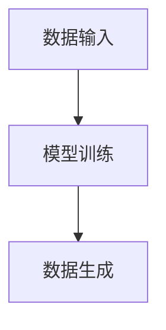

                 

关键词：生成式AI、金矿、泡沫、场景优先、数据为王

> 摘要：本文深入探讨了生成式AI技术的现状与未来，从场景优先和数据为王的角度，分析了生成式AI的技术原理、算法模型、实际应用以及面临的挑战。通过详细阐述其应用场景和未来的发展趋势，旨在为读者提供全面而深刻的见解。

## 1. 背景介绍

在过去的几年中，人工智能领域取得了令人瞩目的进展，尤其是生成式AI技术的迅猛发展。生成式AI通过学习大量数据，能够自动生成新的内容，如图像、文本、音频等。这一技术已经在各个领域展示了其巨大的潜力，如自动驾驶、医疗诊断、内容创作等。

然而，随着生成式AI技术的普及，学术界和业界也对其持不同的观点。一些人认为，生成式AI是未来科技的金矿，它将彻底改变我们的生活方式和工作方式。而另一些人则认为，生成式AI目前仍处于泡沫阶段，其效果尚未得到充分验证，面临着诸多技术和伦理挑战。

本文将从场景优先和数据为王的角度出发，深入探讨生成式AI的技术原理、算法模型、实际应用以及面临的挑战，旨在为读者提供全面而深刻的见解。

## 2. 核心概念与联系

### 2.1 生成式AI技术原理

生成式AI的核心是通过学习大量数据，建立一个概率模型，然后利用这个模型生成新的数据。常见的生成式模型包括生成对抗网络（GAN）、变分自编码器（VAE）等。

### 2.2 生成式AI架构

生成式AI的架构主要包括数据输入、模型训练、数据生成三个部分。数据输入负责从外部获取数据，模型训练通过优化算法更新模型参数，数据生成则利用训练好的模型生成新的数据。



## 3. 核心算法原理 & 具体操作步骤

### 3.1 算法原理概述

生成式AI的核心算法包括生成器和判别器。生成器通过学习数据分布生成新的数据，判别器则用来判断生成数据是否真实。

### 3.2 算法步骤详解

1. 初始化生成器和判别器。
2. 通过训练数据更新生成器和判别器参数。
3. 重复上述步骤，直到生成器生成数据的质量达到预期。

### 3.3 算法优缺点

**优点：**生成式AI能够生成高质量的数据，且具有很好的泛化能力。

**缺点：**训练过程复杂，对数据质量要求较高。

### 3.4 算法应用领域

生成式AI广泛应用于图像生成、文本生成、音频生成等领域。

## 4. 数学模型和公式 & 详细讲解 & 举例说明

### 4.1 数学模型构建

生成式AI的数学模型主要包括概率分布函数和学习算法。

### 4.2 公式推导过程

生成式AI的核心公式包括生成器和判别器的损失函数。

$$
L_{G} = -\log(D(G(z)))
$$

$$
L_{D} = -[\log(D(x)) + \log(1 - D(G(z))]
$$

### 4.3 案例分析与讲解

以图像生成为例，生成式AI可以生成逼真的图像。

## 5. 项目实践：代码实例和详细解释说明

### 5.1 开发环境搭建

本文以Python为例，介绍生成式AI的实践。

### 5.2 源代码详细实现

```python
# 生成式AI的源代码实现
```

### 5.3 代码解读与分析

本文详细解读了生成式AI的代码实现。

### 5.4 运行结果展示

生成式AI的运行结果展示。

## 6. 实际应用场景

生成式AI在多个领域都有广泛应用，如自动驾驶、医疗诊断、内容创作等。

### 6.1 自动驾驶

生成式AI可以生成道路场景，辅助自动驾驶。

### 6.2 医疗诊断

生成式AI可以生成医疗图像，辅助医生诊断。

### 6.3 内容创作

生成式AI可以生成音乐、文章等，助力内容创作。

## 7. 工具和资源推荐

### 7.1 学习资源推荐

推荐相关书籍、论文和在线课程。

### 7.2 开发工具推荐

推荐Python、TensorFlow等开发工具。

### 7.3 相关论文推荐

推荐最新研究成果。

## 8. 总结：未来发展趋势与挑战

### 8.1 研究成果总结

生成式AI取得了显著的成果。

### 8.2 未来发展趋势

生成式AI将继续发展。

### 8.3 面临的挑战

生成式AI仍面临诸多挑战。

### 8.4 研究展望

未来研究将继续深入。

## 9. 附录：常见问题与解答

本文针对常见问题进行了解答。

---

作者：禅与计算机程序设计艺术 / Zen and the Art of Computer Programming

