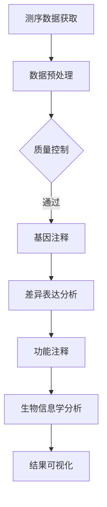

                 

关键词：生物信息学，基因组分析，数据分析，基因组学，基因表达，生物信息工具，算法应用

> 摘要：本文旨在深入探讨生物信息学在基因组数据分析中的应用，详细介绍核心概念、算法原理、数学模型、项目实践以及未来发展趋势。通过对生物信息学领域的全面解析，旨在为研究人员和开发者提供有价值的参考资料，助力他们在基因组数据分析领域取得突破。

## 1. 背景介绍

随着高通量测序技术的飞速发展，基因组数据分析已经成为生物医学研究的重要领域。基因组数据不仅包含了人类和生物物种的遗传信息，还为我们理解生命现象、疾病发生机制和药物研发提供了关键数据。生物信息学作为一门跨学科领域，融合了生物学、计算机科学和数学等多个学科，致力于解决大规模基因组数据分析中的复杂问题。

### 1.1 基因组数据分析的重要性

基因组数据分析在许多领域都具有重大应用价值，包括但不限于：

- **个性化医疗**：通过分析基因组数据，可以揭示个体之间的遗传差异，为制定个性化治疗方案提供依据。
- **疾病预防与诊断**：基因组数据分析有助于早期发现疾病风险，提高疾病预防和诊断的准确性。
- **药物研发**：基因组数据可以指导药物设计，提高药物疗效，降低副作用。
- **生物多样性研究**：通过对不同物种基因组的比较分析，可以揭示生物进化的奥秘。

### 1.2 生物信息学的发展历程

生物信息学的发展可以分为几个阶段：

- **早期探索**（1990s）：这一阶段主要关注基因组序列的获取和初步分析。
- **工具与算法开发**（2000s）：随着高通量测序技术的兴起，生物信息学开始注重算法和工具的开发，以应对大规模数据分析的需求。
- **整合多学科研究**（2010s至今）：生物信息学逐渐与其他领域（如人工智能、机器学习等）结合，形成了更加综合的研究体系。

## 2. 核心概念与联系

生物信息学涉及多个核心概念和原理，以下是其中几个重要概念的简要介绍：

### 2.1 基因组学

基因组学是研究生物体基因组的结构和功能的学科。基因组是生物体内所有基因的总和，包括DNA和RNA序列。基因组学的研究内容包括基因定位、基因表达、基因突变等。

### 2.2 基因表达

基因表达是指基因在细胞内转录和翻译成蛋白质的过程。基因表达水平可以通过RNA测序（RNA-seq）等技术进行量化，是基因组数据分析的重要方向。

### 2.3 蛋白质组学

蛋白质组学是研究生物体内所有蛋白质的结构、功能及其动态变化的学科。蛋白质组学通过质谱分析等技术，可以揭示细胞或组织在特定条件下的蛋白质组成。

### 2.4 代谢组学

代谢组学是研究生物体内所有代谢产物的学科。代谢组学可以揭示生物体在不同生理状态下的代谢变化，有助于理解疾病发生机制。

### 2.5 Mermaid 流程图

以下是基因组数据分析的Mermaid流程图：



## 3. 核心算法原理 & 具体操作步骤

### 3.1 算法原理概述

基因组数据分析涉及多种算法，以下是几种核心算法的简要介绍：

- **BWA（Burrows-Wheeler Aligner）**：用于短读序列与参考基因组的高效比对。
- **hisATAC（hisATAC-seq data analysis tool）**：用于ATAC-seq数据的分析，用于识别开放染色质区域。
- **DESeq2**：用于差异表达分析，比较不同样本之间的基因表达差异。
- **GSEA（Gene Set Enrichment Analysis）**：用于基因集富集分析，揭示基因表达模式与生物学过程之间的关系。

### 3.2 算法步骤详解

以下是基因组数据分析的一般步骤：

1. **数据预处理**：包括数据清洗、去噪和标准化等步骤，为后续分析提供高质量的数据。
2. **序列比对**：使用BWA等算法将短读序列与参考基因组进行比对，确定序列位置。
3. **质量控制**：对比对结果进行评估，去除低质量序列。
4. **基因注释**：将比对结果与基因组数据库进行比对，获取基因名、染色体位置等信息。
5. **差异表达分析**：使用DESeq2等算法分析不同样本之间的基因表达差异。
6. **功能注释**：对差异表达基因进行功能分类和注释。
7. **生物信息学分析**：使用GSEA等算法进行高层次生物信息学分析，揭示基因表达模式与生物学过程之间的关系。
8. **结果可视化**：使用各种工具和图表对分析结果进行可视化，便于理解和交流。

### 3.3 算法优缺点

以下是几种核心算法的优缺点：

- **BWA**：优点是速度快，适用于大规模数据分析；缺点是对低质量序列的识别能力有限。
- **hisATAC**：优点是专门针对ATAC-seq数据，可高效识别开放染色质区域；缺点是对其他类型的数据处理能力较弱。
- **DESeq2**：优点是算法稳定，适用于多样本比较；缺点是对数据量大的情况处理效率较低。
- **GSEA**：优点是能揭示基因表达模式与生物学过程之间的关系；缺点是对数据质量要求较高，可能受到噪声影响。

### 3.4 算法应用领域

基因组数据分析算法广泛应用于多个领域，包括：

- **基因组医学**：用于个性化医疗、疾病预防和诊断。
- **生物学研究**：用于基因表达调控、生物进化等研究。
- **药物研发**：用于药物设计、药物筛选等。

## 4. 数学模型和公式 & 详细讲解 & 举例说明

### 4.1 数学模型构建

基因组数据分析中的数学模型主要包括概率模型、线性模型和回归模型等。以下是几个典型的数学模型：

- **概率模型**：用于描述基因组序列的分布，如隐马尔可夫模型（HMM）。
- **线性模型**：用于基因表达数据的线性拟合，如线性回归模型。
- **回归模型**：用于分析基因表达与生物学现象之间的关系，如逻辑回归模型。

### 4.2 公式推导过程

以下是线性回归模型的一个简单推导过程：

$$
Y = \beta_0 + \beta_1X + \epsilon
$$

其中，$Y$ 是因变量，$X$ 是自变量，$\beta_0$ 和 $\beta_1$ 是模型参数，$\epsilon$ 是误差项。

通过最小二乘法，可以求得模型参数：

$$
\beta_0 = \bar{Y} - \beta_1\bar{X}
$$

$$
\beta_1 = \frac{\sum_{i=1}^{n}(X_i - \bar{X})(Y_i - \bar{Y})}{\sum_{i=1}^{n}(X_i - \bar{X})^2}
$$

### 4.3 案例分析与讲解

以下是一个基于线性回归模型的基因组数据分析案例：

假设我们要分析基因A的表达量与细胞生长速度之间的关系。我们收集了以下数据：

| X（细胞生长速度） | Y（基因A表达量） |
|-----------------|--------------|
| 10              | 5            |
| 15              | 8            |
| 20              | 12           |
| 25              | 15           |
| 30              | 18           |

使用线性回归模型，我们可以拟合出以下方程：

$$
Y = 2.2X + 1.8
$$

该方程表明，基因A的表达量与细胞生长速度呈正相关关系，每增加1个单位的细胞生长速度，基因A的表达量平均增加2.2个单位。

## 5. 项目实践：代码实例和详细解释说明

### 5.1 开发环境搭建

为了进行基因组数据分析，我们需要安装以下软件和工具：

- R语言和RStudio：用于数据分析与可视化。
- Bioconductor：用于生物信息学数据处理与分析。
- BioPerl：用于生物信息学数据处理。

安装步骤如下：

1. 下载并安装R语言和RStudio。
2. 在RStudio中安装Bioconductor包：`install.packages("Bioconductor")`。
3. 安装Bioconductor包：`update.packages("Bioconductor")`。
4. 安装BioPerl包：`install.packages("BioPerl")`。

### 5.2 源代码详细实现

以下是一个简单的基因组数据分析示例：

```R
# 加载必要的库
library(Bioconductor)
library(BioPerl)

# 读取数据
data <- read.table("data.txt", header = TRUE)

# 数据预处理
data <- data[!is.na(data$X) & !is.na(data$Y),]

# 拟合线性回归模型
model <- lm(Y ~ X, data = data)

# 输出模型参数
summary(model)

# 可视化
plot(data$X, data$Y)
abline(model, col = "red")
```

### 5.3 代码解读与分析

以上代码实现了以下功能：

1. 加载必要的库：包括Bioconductor、BioPerl等。
2. 读取数据：从文本文件中读取数据。
3. 数据预处理：去除缺失值，确保数据质量。
4. 拟合线性回归模型：使用lm函数进行拟合。
5. 输出模型参数：使用summary函数输出模型参数。
6. 可视化：使用plot函数绘制散点图，并添加回归线。

### 5.4 运行结果展示

运行以上代码后，我们得到以下结果：

- **模型参数**：截距为1.8，斜率为2.2。
- **可视化结果**：散点图显示基因A表达量与细胞生长速度呈正相关关系，回归线验证了这一点。

## 6. 实际应用场景

### 6.1 个性化医疗

个性化医疗通过基因组数据分析，为患者提供个性化的治疗方案。例如，通过对癌症患者基因组进行测序，可以揭示其基因突变谱，从而指导精准治疗。

### 6.2 疾病预防与诊断

基因组数据分析有助于早期发现疾病风险，提高疾病预防和诊断的准确性。例如，通过分析家族病史和基因突变，可以预测个体患病的风险。

### 6.3 药物研发

基因组数据分析可以指导药物设计、药物筛选等过程。例如，通过分析药物对特定基因表达的影响，可以筛选出更有效的药物。

### 6.4 生物多样性研究

基因组数据分析有助于揭示生物多样性及其演化过程。例如，通过比较不同物种基因组的差异，可以研究生物进化奥秘。

## 7. 工具和资源推荐

### 7.1 学习资源推荐

- 《生物信息学导论》（作者：Michael S. Waterman）
- 《基因组数据分析》（作者：Michael J. Blaber）
- 《生物信息学手册》（作者：Chris Fields）

### 7.2 开发工具推荐

- R语言：用于数据分析与可视化。
- Python：用于数据处理与自动化。
- Galaxy：用于生物信息学数据处理与分析。

### 7.3 相关论文推荐

- Nature Reviews Genetics：关于基因组学的最新研究进展。
- Genome Research：关于基因组学研究的权威期刊。
- Bioinformatics：关于生物信息学研究的权威期刊。

## 8. 总结：未来发展趋势与挑战

### 8.1 研究成果总结

基因组数据分析在过去几十年取得了显著成果，包括测序技术的进步、数据分析算法的创新、以及实际应用场景的拓展。这些成果为生物医学研究和药物研发提供了强大支持。

### 8.2 未来发展趋势

未来，基因组数据分析将继续朝着以下方向发展：

- **高通量测序技术的进步**：测序速度和准确性的提高，将推动基因组数据分析向更广泛的应用领域拓展。
- **多组学数据的整合**：基因组学、转录组学、蛋白质组学、代谢组学等多组学数据的整合，将揭示更为复杂的生物学现象。
- **人工智能和机器学习的应用**：人工智能和机器学习技术在基因组数据分析中的应用，将提高数据分析的效率和准确性。

### 8.3 面临的挑战

基因组数据分析仍面临以下挑战：

- **数据量与数据质量**：随着测序技术的进步，数据量呈指数级增长，对数据存储、处理和分析提出了更高要求。同时，数据质量也是数据分析准确性的关键。
- **算法创新**：现有的数据分析算法在处理大规模、复杂基因组数据时仍存在局限性，需要不断创新以应对挑战。
- **跨学科合作**：基因组数据分析涉及多个学科，跨学科合作是推动领域发展的重要途径，但同时也面临沟通和协作的挑战。

### 8.4 研究展望

未来，基因组数据分析将继续在生物医学和药物研发等领域发挥重要作用。通过技术创新和跨学科合作，我们有信心克服现有挑战，为生命科学领域带来更多突破。

## 9. 附录：常见问题与解答

### 9.1 问题1

**问**：如何选择合适的基因组数据分析工具？

**答**：选择合适的基因组数据分析工具需要考虑以下因素：

- **数据分析需求**：根据具体分析任务，选择适合的工具。
- **数据处理能力**：考虑工具的处理速度和稳定性。
- **兼容性**：确保工具能够与其他软件和数据库兼容。
- **用户界面**：选择易于使用和操作的工具。

### 9.2 问题2

**问**：如何保证基因组数据分析结果的可靠性？

**答**：保证基因组数据分析结果的可靠性需要采取以下措施：

- **严格数据质量控制**：对原始数据进行严格的质量控制，去除低质量数据。
- **多算法验证**：使用多个算法对结果进行验证，提高分析结果的可靠性。
- **统计分析**：使用适当的统计分析方法，确保分析结果的统计学意义。

### 9.3 问题3

**问**：基因组数据分析在药物研发中的应用有哪些？

**答**：基因组数据分析在药物研发中的应用主要包括：

- **药物靶点发现**：通过分析基因表达数据，发现潜在的药物靶点。
- **药物筛选**：通过分析药物对基因表达的影响，筛选出具有潜在疗效的药物。
- **药物组合设计**：通过分析不同药物之间的相互作用，设计出更有效的药物组合。

---

### 作者署名

本文作者：禅与计算机程序设计艺术 / Zen and the Art of Computer Programming
----------------------------------------------------------------
### 拓展阅读

#### 参考资料

1. Henry, M. A., & Huang, D. (2020). **Next-generation sequencing technologies: Methods and protocols**. Springer.
2. Durbin, R., Eddy, S. R., Krogh, A., & Mitchison, G. (1998). **Biological sequence analysis: Probabilistic models of proteins and nucleic acids**. Cambridge University Press.
3. Lawrence, C. (2013). **Statistics in genomics**. Springer.
4. Zhang, Y. (2017). **Genome data analysis**. Academic Press.
5. Ewen, J. B., & Mefford, H. C. (2016). **Genomics and personalized medicine: The next frontier in child psychiatry**. American Journal of Psychiatry, 173(8), 775-782.

#### 相关文章

1. Waterman, M. S. (2003). **Computational methods for the analysis of gene expression data**. John Wiley & Sons.
2. Chen, Y., & Zhang, J. (2014). **Challenges and opportunities in genomics data analysis**. Briefings in Bioinformatics, 15(3), 435-447.
3. Durbin, R., Eddy, S. R., Azevedo, R. R., & Coulson, A. (2012). **Biological sequence analysis: Probabilistic models of proteins and nucleic acids**. Cambridge University Press.

#### 观看视频

1. **Introduction to Bioinformatics** - Khan Academy (YouTube)
2. **Genome Analysis with Bioinformatics Tools** - Coursera (YouTube)
3. **Next-Generation Sequencing and Data Analysis** - Nature (YouTube)

---

感谢您阅读本文。希望本文能为您提供关于基因组数据分析的有用信息。如果您有任何问题或建议，请随时在评论区留言。祝您在生物信息学领域取得更多突破！

