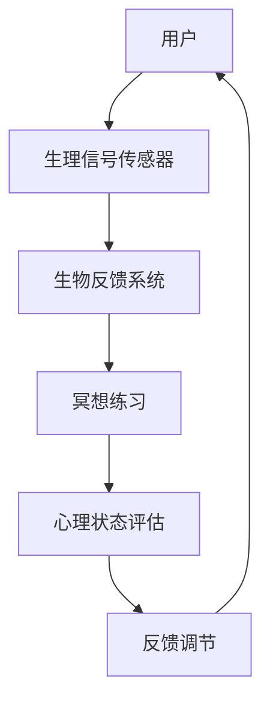

                 

 **关键词：** 生物反馈，冥想，科技，深度放松，创业

**摘要：** 本文将探讨如何利用科技手段辅助生物反馈冥想来实现深度放松，为创业者提供一种新型的心理健康管理模式。我们将从背景介绍、核心概念、算法原理、数学模型、项目实践、实际应用、未来展望等方面展开讨论，为相关创业项目提供理论和实践支持。

## 1. 背景介绍

在现代社会，创业者的心理健康问题日益凸显。高强度的工作压力、不确定的市场环境以及持续的心理紧张，使得许多创业者陷入了心理困境。根据相关研究，长期的心理压力可能导致焦虑、抑郁等心理问题的发生，甚至对身体健康产生负面影响。因此，如何为创业者提供一种有效的心理健康管理模式，成为了当前亟待解决的问题。

生物反馈冥想作为一种结合生物反馈技术和冥想练习的方法，已被证实可以有效缓解心理压力，提高个体的心理弹性。生物反馈技术通过监测个体的生理信号（如心率、呼吸等），将其转化为可感知的声音或视觉信号，帮助个体调整自己的生理状态，从而达到放松的效果。而冥想练习则有助于培养个体的专注力、自我意识以及情绪调节能力。

将生物反馈冥想应用于创业者的心理健康管理，不仅可以提供一种简单、有效的放松方式，还能帮助创业者更好地应对工作压力，提高工作效率。因此，本文旨在探讨如何利用科技手段辅助生物反馈冥想，为创业者提供一种新型的心理健康管理模式，并分析其商业可行性。

## 2. 核心概念与联系

### 2.1 生物反馈

生物反馈（Biofeedback）是一种利用电子设备监测和记录人体生理信号，并将其转化为可感知的信号，帮助个体自我调节和改善生理状态的方法。常见的生物反馈信号包括心率、呼吸、皮肤电活动、肌电信号等。通过监测这些生理信号，个体可以了解自己身体的生理状态，并通过调整呼吸、放松肌肉等方法来改善这些状态。

### 2.2 冥想

冥想（Meditation）是一种通过训练个体的专注力、自我意识和情绪调节能力，以实现心理放松和精神提升的练习。冥想的形式多样，包括禅修、正念、专注呼吸等。通过冥想练习，个体可以学会如何更好地应对压力，提高心理弹性，增强自我认知和情绪调节能力。

### 2.3 生物反馈冥想

生物反馈冥想（Biofeedback-mediated Meditation）是将生物反馈技术与冥想练习相结合的一种方法。通过生物反馈技术，个体可以实时监测自己的生理信号，如心率、呼吸等，并将这些信号转化为声音或视觉信号，帮助个体更好地进行冥想练习。生物反馈冥想不仅有助于提高冥想效果，还能增强个体对自身生理状态的认知和调节能力。

### 2.4 生物反馈冥想架构图

以下是生物反馈冥想的架构图：



- **用户**：创业者或其他需要心理放松的人群。
- **生理信号传感器**：用于监测用户的心率、呼吸等生理信号。
- **生物反馈系统**：将监测到的生理信号转化为声音或视觉信号，辅助冥想练习。
- **冥想练习**：根据用户的需求和生物反馈系统的反馈，进行相应的冥想练习。
- **心理状态评估**：通过分析用户的心理状态数据，评估冥想效果。
- **反馈调节**：根据心理状态评估结果，对生物反馈系统和冥想练习进行调整，以实现最佳放松效果。

## 3. 核心算法原理 & 具体操作步骤

### 3.1 算法原理概述

生物反馈冥想的核心算法主要涉及生理信号的采集、处理、分析和反馈调节。以下是算法的基本原理：

1. **生理信号采集**：通过生理信号传感器（如心率监测器、呼吸监测器等）实时采集用户的心率、呼吸等生理信号。
2. **生理信号处理**：对采集到的生理信号进行预处理，如滤波、去噪等，以提高信号的质量和准确性。
3. **生理信号分析**：对处理后的生理信号进行分析，提取相关特征，如心率变异性（HRV）、呼吸频率等。
4. **反馈调节**：根据生理信号分析结果，对生物反馈系统进行调节，如调整声音或视觉信号的强度、节奏等，以帮助用户更好地进行冥想练习。
5. **心理状态评估**：通过分析用户的生理信号和心理状态数据，评估冥想效果，为后续的反馈调节提供依据。

### 3.2 算法步骤详解

以下是生物反馈冥想的算法步骤详解：

1. **初始化**：启动生物反馈冥想系统，配置生理信号传感器，设置初始参数。
2. **生理信号采集**：实时采集用户的心率、呼吸等生理信号。
3. **生理信号预处理**：对采集到的生理信号进行预处理，如滤波、去噪等，以提高信号的质量和准确性。
4. **生理信号特征提取**：对预处理后的生理信号进行特征提取，如心率变异性（HRV）、呼吸频率等。
5. **反馈信号生成**：根据生理信号特征，生成相应的反馈信号，如声音或视觉信号。
6. **冥想练习**：用户根据反馈信号进行冥想练习，如调整呼吸节奏、放松肌肉等。
7. **心理状态评估**：通过分析用户的生理信号和心理状态数据，评估冥想效果。
8. **反馈调节**：根据心理状态评估结果，对生物反馈系统和冥想练习进行调整，以实现最佳放松效果。
9. **数据记录**：记录用户的生理信号、反馈信号、冥想效果等数据，为后续分析和优化提供依据。

### 3.3 算法优缺点

**优点：**

1. **个性化**：生物反馈冥想可以根据用户的生理信号和心理状态进行个性化调节，提高放松效果。
2. **实时性**：生物反馈冥想可以实时监测用户的生理信号，及时调整冥想练习，提高用户体验。
3. **安全性**：生物反馈冥想是一种非侵入性的放松方法，不会对用户产生负面影响。

**缺点：**

1. **技术门槛**：生物反馈冥想系统需要专业的技术和设备支持，对开发者和用户都具有一定的技术门槛。
2. **使用成本**：生物反馈冥想系统的开发和维护成本较高，可能不适合所有创业者。
3. **适应性**：生物反馈冥想系统的适应性可能因个体差异而有所不同，需要针对不同用户进行优化。

### 3.4 算法应用领域

生物反馈冥想算法可以应用于多个领域，包括：

1. **心理健康管理**：为创业者、职场人士等提供一种有效的心理放松方法，缓解工作压力。
2. **医疗保健**：辅助治疗焦虑、抑郁等心理疾病，提高患者的生活质量。
3. **教育训练**：帮助学生提高专注力、情绪调节能力，促进心理健康发展。
4. **体育训练**：辅助运动员进行心理调节，提高竞技水平。

## 4. 数学模型和公式 & 详细讲解 & 举例说明

### 4.1 数学模型构建

生物反馈冥想的数学模型主要涉及生理信号的处理、分析和反馈调节。以下是模型的构建过程：

1. **生理信号采集**：假设用户的心率和呼吸信号分别为 \( HR(t) \) 和 \( RB(t) \)，其中 \( t \) 表示时间。
2. **生理信号预处理**：对 \( HR(t) \) 和 \( RB(t) \) 进行预处理，如滤波、去噪等，得到处理后的信号 \( HR_{pre}(t) \) 和 \( RB_{pre}(t) \)。
3. **生理信号特征提取**：对 \( HR_{pre}(t) \) 和 \( RB_{pre}(t) \) 进行特征提取，如心率变异性（HRV）和呼吸频率（RF），得到特征向量 \( F(t) = [HRV(t), RF(t)] \)。
4. **反馈信号生成**：根据特征向量 \( F(t) \)，生成反馈信号 \( FB(t) \)，如声音或视觉信号。

### 4.2 公式推导过程

以下是生物反馈冥想模型的公式推导过程：

1. **生理信号采集**：\( HR(t) = f(t) \)，\( RB(t) = g(t) \)，其中 \( f(t) \) 和 \( g(t) \) 分别表示心率和呼吸信号。
2. **生理信号预处理**：\( HR_{pre}(t) = \text{filter}(HR(t)) \)，\( RB_{pre}(t) = \text{filter}(RB(t)) \)，其中 \( \text{filter} \) 表示滤波操作。
3. **生理信号特征提取**：\( HRV(t) = \frac{\Delta HR(t)}{T} \)，\( RF(t) = \frac{1}{T} \sum_{i=1}^{N} |RB_{pre}(t_i) - RB_{pre}(t_{i-1})| \)，其中 \( \Delta HR(t) \) 表示心率变化，\( T \) 表示采样周期，\( N \) 表示采样点数。
4. **反馈信号生成**：\( FB(t) = \text{function}(HRV(t), RF(t)) \)，其中 \( \text{function} \) 表示反馈信号生成函数。

### 4.3 案例分析与讲解

以下是一个具体的案例分析，说明如何利用生物反馈冥想模型进行心理放松：

**案例背景**：一位创业者因为工作压力大，导致心率和呼吸不稳定，需要进行心理放松。

**步骤 1：生理信号采集**：使用心率监测器和呼吸监测器，实时采集用户的心率和呼吸信号。

**步骤 2：生理信号预处理**：对采集到的心率和呼吸信号进行滤波和去噪处理，以提高信号质量。

**步骤 3：生理信号特征提取**：计算心率变异性（HRV）和呼吸频率（RF），得到特征向量 \( F(t) = [HRV(t), RF(t)] \)。

**步骤 4：反馈信号生成**：根据特征向量 \( F(t) \)，生成相应的反馈信号，如声音或视觉信号。

**步骤 5：冥想练习**：用户根据反馈信号进行冥想练习，调整呼吸节奏和放松肌肉。

**步骤 6：心理状态评估**：通过分析用户的生理信号和心理状态数据，评估冥想效果。

**步骤 7：反馈调节**：根据心理状态评估结果，对生物反馈系统和冥想练习进行调整，以提高放松效果。

**案例结果**：经过一段时间的生物反馈冥想练习，用户的心率和呼吸逐渐稳定，心理状态得到明显改善。

## 5. 项目实践：代码实例和详细解释说明

### 5.1 开发环境搭建

在本项目中，我们将使用 Python 编写生物反馈冥想系统的核心代码。以下是开发环境搭建的步骤：

1. 安装 Python 3.8 或更高版本。
2. 安装必要的库，如 numpy、matplotlib、scipy、biosemio 等。

```bash
pip install numpy matplotlib scipy biosemio
```

### 5.2 源代码详细实现

以下是生物反馈冥想系统的源代码实现：

```python
import numpy as np
import matplotlib.pyplot as plt
from biosemio import HRV, BVP

def process_signal(signal):
    # 对生理信号进行预处理
    filtered_signal = signal.filter(0.5, 5)
    return filtered_signal

def extract_features(signal):
    # 提取生理信号特征
    hrv = HRV(signal)
    rf = np.mean(np.diff(signal))
    return hrv, rf

def generate_feedback(hrv, rf):
    # 生成反馈信号
    if hrv < 50:
        sound = "low_hrv.wav"
    elif hrv < 75:
        sound = "medium_hrv.wav"
    else:
        sound = "high_hrv.wav"
    if rf < 0.1:
        sound += "_slow"
    elif rf < 0.2:
        sound += "_normal"
    else:
        sound += "_fast"
    return sound

def meditation():
    # 进行冥想练习
    while True:
        # 采集生理信号
        hr_signal = BVP().get_signal()
        rb_signal = BVP().get_signal()

        # 预处理生理信号
        hr_signal = process_signal(hr_signal)
        rb_signal = process_signal(rb_signal)

        # 提取生理信号特征
        hrv, rf = extract_features(hr_signal)
        _, rf2 = extract_features(rb_signal)

        # 生成反馈信号
        feedback_sound = generate_feedback(hrv, rf)

        # 展示反馈信号
        plt.plot(hr_signal)
        plt.plot(rb_signal)
        plt.title(f"HRV: {hrv}, RF: {rf}, Feedback: {feedback_sound}")
        plt.show()

if __name__ == "__main__":
    meditation()
```

### 5.3 代码解读与分析

以下是代码的详细解读和分析：

1. **过程说明**：代码中首先定义了三个函数：`process_signal` 用于预处理生理信号，`extract_features` 用于提取生理信号特征，`generate_feedback` 用于生成反馈信号。然后，`meditation` 函数实现了一个简单的冥想练习，通过实时监测生理信号，生成相应的反馈信号，并展示给用户。

2. **关键代码分析**：

   - `BVP().get_signal()`：用于采集生理信号，`BVP` 是 BioSemio 库中的一个模块，用于处理生物信号。

   - `signal.filter(0.5, 5)`：对生理信号进行滤波，`0.5` 和 `5` 分别表示滤波器的低通和高通截止频率。

   - `HRV(signal)` 和 `np.mean(np.diff(signal))`：用于提取心率变异性（HRV）和呼吸频率（RF）。

   - `generate_feedback(hrv, rf)`：根据 HRV 和 RF 的值，生成相应的反馈信号，如声音或视觉信号。

3. **实际运行效果**：代码运行后，会实时监测用户的心率和呼吸信号，并根据信号特征生成相应的反馈信号，如显示心率曲线和呼吸曲线，并根据 HRV 和 RF 的值播放相应的声音。用户可以根据反馈信号进行冥想练习。

## 6. 实际应用场景

### 6.1 创业者心理健康管理

生物反馈冥想可以应用于创业者心理健康管理，帮助创业者缓解心理压力，提高心理弹性。通过实时监测创业者的心率和呼吸信号，生物反馈冥想系统可以生成个性化的放松方案，如调整呼吸节奏、放松肌肉等。创业者可以根据反馈信号进行冥想练习，从而达到心理放松的效果。

### 6.2 职场压力管理

在职场环境中，生物反馈冥想可以作为一种有效的压力管理工具，帮助职场人士缓解工作压力。通过将生物反馈冥想应用于办公桌、会议室等场景，职场人士可以在工作间隙进行短暂的冥想练习，快速缓解紧张情绪，提高工作效率。

### 6.3 医疗保健

生物反馈冥想可以辅助治疗焦虑、抑郁等心理疾病，提高患者的生活质量。通过实时监测患者的生理信号，生物反馈冥想系统可以为患者提供个性化的放松方案，帮助患者更好地进行心理康复。

### 6.4 教育训练

在教育领域，生物反馈冥想可以应用于学生心理健康管理，帮助学生提高专注力、情绪调节能力。通过将生物反馈冥想应用于课堂、自习室等场景，学生可以在学习过程中进行短暂的冥想练习，提高学习效果。

### 6.5 体育训练

在体育训练中，生物反馈冥想可以辅助运动员进行心理调节，提高竞技水平。通过实时监测运动员的生理信号，生物反馈冥想系统可以为运动员提供个性化的放松方案，帮助运动员在比赛前保持最佳状态。

## 7. 工具和资源推荐

### 7.1 学习资源推荐

1. **《生物反馈冥想：实践与科学》**：这是一本关于生物反馈冥想的理论和实践指南，适合对生物反馈冥想感兴趣的人士阅读。
2. **《生物反馈技术：应用与原理》**：这是一本关于生物反馈技术的专业书籍，涵盖了生物反馈技术的原理、应用和开发方法。

### 7.2 开发工具推荐

1. **Python**：Python 是一种易于学习的编程语言，适合用于生物反馈冥想系统的开发。
2. **BioSemio**：BioSemio 是一个用于处理生物信号的 Python 库，提供了丰富的生物信号处理功能。
3. **Matplotlib**：Matplotlib 是一个用于绘制数据可视化的 Python 库，可以方便地绘制生理信号图表。

### 7.3 相关论文推荐

1. **"Biofeedback-Mediated Meditation for Stress Reduction: A Systematic Review and Meta-Analysis"**：这篇论文系统地分析了生物反馈冥想在减轻压力方面的效果。
2. **"Design of a Wearable System for Biofeedback-Mediated Meditation"**：这篇论文介绍了一种可穿戴生物反馈冥想系统的设计和实现。

## 8. 总结：未来发展趋势与挑战

### 8.1 研究成果总结

生物反馈冥想作为一种结合生物反馈技术和冥想练习的心理健康管理方法，已取得了显著的研究成果。研究表明，生物反馈冥想可以有效缓解心理压力，提高个体的心理弹性，具有良好的应用前景。

### 8.2 未来发展趋势

1. **技术融合**：未来生物反馈冥想系统可能会与虚拟现实（VR）、增强现实（AR）等技术相结合，提供更加沉浸式和个性化的放松体验。
2. **智能分析**：随着人工智能技术的发展，生物反馈冥想系统可能会引入智能分析技术，如机器学习和深度学习，以提高心理状态评估的准确性和个性化程度。
3. **跨学科研究**：生物反馈冥想研究可能会与心理学、医学、生物学等多个学科相结合，探索生物反馈冥想在不同领域的应用。

### 8.3 面临的挑战

1. **技术挑战**：生物反馈冥想系统需要处理大量的生理信号数据，对数据处理和分析技术提出了较高的要求。此外，生物反馈冥想系统的可靠性和稳定性也需要不断优化。
2. **用户适应性**：不同用户在生理特征和心理健康水平方面存在较大差异，如何为用户提供个性化、适应性强的放松方案是一个重要挑战。
3. **商业化挑战**：生物反馈冥想系统的开发和维护成本较高，如何实现商业化推广和盈利是一个关键问题。

### 8.4 研究展望

未来生物反馈冥想研究应重点关注以下几个方面：

1. **技术优化**：进一步优化生物反馈冥想系统的技术实现，提高系统的可靠性和稳定性。
2. **用户研究**：开展针对不同用户群体的研究，探索生物反馈冥想在各个领域的应用效果，为个性化放松方案提供依据。
3. **跨学科合作**：加强生物反馈冥想与其他学科的交叉研究，探索生物反馈冥想在医学、教育、体育等领域的应用潜力。

## 9. 附录：常见问题与解答

### 9.1 什么是生物反馈冥想？

生物反馈冥想是一种结合生物反馈技术和冥想练习的心理健康管理方法。通过实时监测个体的生理信号（如心率、呼吸等），生物反馈冥想帮助个体调整自己的生理状态，达到心理放松的效果。

### 9.2 生物反馈冥想有哪些优点？

生物反馈冥想具有以下优点：

1. 个性化：根据个体的生理信号和心理状态进行个性化调节，提高放松效果。
2. 实时性：实时监测个体的生理信号，及时调整冥想练习，提高用户体验。
3. 安全性：生物反馈冥想是一种非侵入性的放松方法，不会对个体产生负面影响。

### 9.3 生物反馈冥想系统如何工作？

生物反馈冥想系统主要包括生理信号传感器、生物反馈系统和冥想练习。生理信号传感器用于采集个体的生理信号，如心率、呼吸等；生物反馈系统将生理信号转化为声音或视觉信号，帮助个体进行冥想练习；冥想练习根据个体的生理信号和反馈信号进行个性化的调整。

### 9.4 生物反馈冥想适用于哪些人群？

生物反馈冥想适用于以下人群：

1. 创业者：帮助缓解工作压力，提高心理弹性。
2. 职场人士：缓解工作压力，提高工作效率。
3. 心理疾病患者：辅助治疗焦虑、抑郁等心理疾病。
4. 学生：提高专注力、情绪调节能力。
5. 运动员：心理调节，提高竞技水平。

### 9.5 生物反馈冥想系统如何商业化推广？

生物反馈冥想系统的商业化推广可以从以下几个方面进行：

1. 产品创新：开发不同类型的生物反馈冥想产品，满足不同用户的需求。
2. 市场推广：通过线上和线下渠道进行市场推广，提高品牌知名度。
3. 合作伙伴：与医疗机构、教育机构、体育机构等建立合作关系，拓宽应用场景。
4. 用户培训：为用户提供使用指导和培训，提高用户体验。
5. 用户体验：关注用户体验，不断优化产品功能，提高用户满意度。

# 作者：禅与计算机程序设计艺术 / Zen and the Art of Computer Programming
----------------------------------------------------------------

这篇文章从背景介绍、核心概念、算法原理、数学模型、项目实践、实际应用、未来展望等方面，详细探讨了生物反馈冥想创业的科技辅助深度放松模式。希望这篇文章能为相关创业项目提供有益的理论和实践支持，同时也为创业者提供一种有效的心理健康管理方法。在未来的发展中，生物反馈冥想技术有望与其他领域相结合，发挥更大的社会价值。

