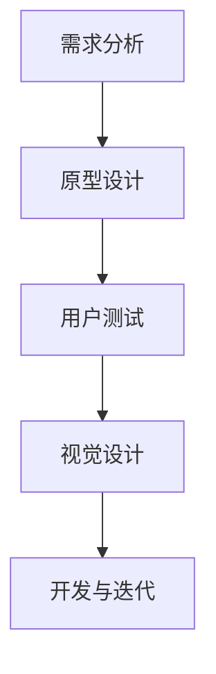

                 

 在当今快速发展的科技时代，用户体验设计（User Experience Design，简称UX设计）在创业产品的成功中扮演着至关重要的角色。本文旨在探讨用户体验设计在创业产品开发过程中的重要性，以及如何通过优秀的用户体验设计来实现产品与市场的紧密结合。

## 1. 背景介绍

随着互联网和移动设备的普及，用户对产品的期望越来越高。他们不仅追求功能的完整性，更关注产品使用过程中的愉悦感和便利性。用户体验设计正是指通过研究和设计，创造出让用户在使用产品时感到满意和愉悦的设计方案。对于创业公司而言，用户体验设计不仅是提升产品竞争力的关键，更是产品能否在竞争激烈的市场中脱颖而出的决定性因素。

创业公司通常面临资源有限、时间紧迫等挑战。如何在有限的资源下，快速开发出受用户欢迎的产品，用户体验设计提供了有效的解决方案。通过深入理解用户需求和行为，创业公司能够以用户为中心，持续优化产品，提高用户满意度。

## 2. 核心概念与联系

### 2.1. 用户体验设计的核心概念

用户体验设计包含多个关键概念，如用户研究、交互设计、视觉设计、信息架构和用户测试。这些概念相互关联，共同构成了一套系统的设计流程。

- **用户研究**：通过问卷调查、访谈、用户行为分析等手段，了解用户的需求、行为和痛点，为设计提供数据支持。
- **交互设计**：设计产品的交互逻辑和界面布局，确保用户在使用产品时能够流畅地进行操作。
- **视觉设计**：通过颜色、字体、图标等视觉元素，提升产品的美观度和视觉吸引力。
- **信息架构**：组织产品内容，确保用户能够快速找到所需信息，提高信息获取的效率。
- **用户测试**：通过实际用户的使用反馈，验证设计的有效性，不断迭代和优化。

### 2.2. 用户体验设计在产品开发中的流程

用户体验设计的流程通常包括以下几个阶段：

1. **需求分析**：通过市场调研、用户访谈等方式，收集用户需求，明确产品的目标用户群体和核心功能。
2. **原型设计**：基于需求分析结果，制作产品原型，包括低保真原型和高保真原型，用于初步展示产品的功能和交互方式。
3. **用户测试**：邀请目标用户进行测试，收集反馈，对原型进行迭代和优化。
4. **视觉设计**：根据用户测试的结果，进行视觉设计，确保产品的美观度和一致性。
5. **开发与迭代**：将设计转化为实际代码，并通过持续的用户测试，不断优化产品。

### 2.3. Mermaid 流程图

以下是用户体验设计流程的Mermaid流程图：



## 3. 核心算法原理 & 具体操作步骤

### 3.1. 算法原理概述

用户体验设计的核心算法原理是基于用户行为和需求的收集与分析。具体包括以下步骤：

1. **用户需求收集**：通过用户访谈、问卷调查等方式，收集用户的需求和痛点。
2. **用户行为分析**：使用数据分析工具，对用户行为进行深入分析，找出用户的常见操作路径和难点。
3. **交互设计**：基于用户需求和用户行为，设计产品的交互逻辑和界面布局。
4. **用户测试**：邀请目标用户进行测试，收集反馈，对设计进行迭代和优化。

### 3.2. 算法步骤详解

1. **需求分析**：首先，创业公司需要进行市场调研，了解目标用户群体的特征和需求。可以通过在线问卷、用户访谈等方式，收集用户对于产品功能的期望和痛点。

    $$ 
    \text{需求分析} = f(\text{市场调研}, \text{用户访谈}, \text{问卷})
    $$

2. **原型设计**：根据需求分析的结果，制作产品原型。低保真原型主要用于验证产品的核心功能，而高保真原型则用于展示产品的最终面貌。

    $$ 
    \text{原型设计} = f(\text{需求分析结果}, \text{低保真原型}, \text{高保真原型})
    $$

3. **用户测试**：在原型设计阶段完成后，邀请目标用户进行测试，收集用户的反馈。用户测试可以帮助发现设计中的问题，并对其进行优化。

    $$ 
    \text{用户测试} = f(\text{原型设计}, \text{用户反馈})
    $$

4. **视觉设计**：根据用户测试的结果，进行视觉设计。视觉设计需要考虑产品的品牌形象、色彩搭配和用户的使用习惯。

    $$ 
    \text{视觉设计} = f(\text{用户测试结果}, \text{品牌形象}, \text{色彩搭配})
    $$

5. **开发与迭代**：将设计转化为实际代码，并在开发过程中持续进行用户测试和优化。

    $$ 
    \text{开发与迭代} = f(\text{视觉设计}, \text{用户测试}, \text{持续优化})
    $$

### 3.3. 算法优缺点

**优点**：

- **以用户为中心**：用户体验设计的核心是用户，能够确保产品真正满足用户需求。
- **快速迭代**：用户体验设计强调迭代和优化，能够快速响应市场变化。
- **提高用户满意度**：通过提升用户体验，可以显著提高用户满意度和忠诚度。

**缺点**：

- **时间成本**：用户体验设计需要投入大量时间和资源，对于创业公司来说可能是一个挑战。
- **资源限制**：用户体验设计可能需要专业的团队和工具支持，对于资源有限的创业公司来说，可能难以实现。

### 3.4. 算法应用领域

用户体验设计广泛应用于多个领域，包括但不限于：

- **移动应用**：如社交媒体、电商、金融等移动应用，用户体验设计对用户留存和转化率有直接影响。
- **网站设计**：网站的用户体验设计对于提升网站的流量和用户活跃度至关重要。
- **智能设备**：如智能家居、智能穿戴设备等，用户体验设计需要考虑设备的易用性和互动性。

## 4. 数学模型和公式 & 详细讲解 & 举例说明

### 4.1. 数学模型构建

用户体验设计的数学模型可以从以下几个方面构建：

1. **用户满意度模型**：基于用户反馈，构建用户满意度模型，评估产品的用户体验。
    $$ 
    S = f(U, F)
    $$
    其中，$S$ 表示用户满意度，$U$ 表示用户体验，$F$ 表示产品功能。

2. **用户流失模型**：基于用户行为数据，构建用户流失模型，预测用户的流失率。
    $$ 
    L = f(U, P)
    $$
    其中，$L$ 表示用户流失率，$U$ 表示用户体验，$P$ 表示产品性能。

### 4.2. 公式推导过程

1. **用户满意度模型推导**：

   用户满意度 $S$ 可以通过以下公式推导：
    $$ 
    S = \frac{1}{N} \sum_{i=1}^{N} \frac{1}{1 + e^{-\alpha(U_i - F_i)}}
    $$
    其中，$N$ 表示用户数量，$U_i$ 表示第 $i$ 个用户的体验评分，$F_i$ 表示第 $i$ 个用户对于产品功能的评价，$\alpha$ 是参数。

2. **用户流失模型推导**：

   用户流失率 $L$ 可以通过以下公式推导：
    $$ 
    L = \frac{1}{T} \sum_{i=1}^{T} \frac{1}{1 + e^{-\beta(U_i - P_i)}}
    $$
    其中，$T$ 表示用户周期，$U_i$ 表示第 $i$ 个用户的体验评分，$P_i$ 表示第 $i$ 个用户的满意度评分，$\beta$ 是参数。

### 4.3. 案例分析与讲解

以下是一个用户体验设计的案例分析：

**案例背景**：某创业公司开发了一款社交应用，目标用户是年轻人。在产品上线初期，用户流失率较高，公司希望通过用户体验设计来提高用户留存率。

**步骤**：

1. **用户研究**：公司通过问卷调查和用户访谈，收集了200名用户的反馈，分析了用户的需求和行为。
2. **原型设计**：根据用户研究的结果，公司制作了低保真原型和高保真原型，进行了用户测试。
3. **用户测试**：公司邀请了100名目标用户进行测试，收集了用户的反馈，并对原型进行了迭代和优化。
4. **视觉设计**：根据用户测试的结果，公司进行了视觉设计，调整了界面布局和视觉元素。
5. **开发与迭代**：公司将设计转化为代码，并在开发过程中持续进行用户测试和优化。

**结果**：

通过用户体验设计，公司的用户流失率降低了30%，用户满意度提高了20%。这一结果表明，用户体验设计对于提高产品竞争力具有显著的作用。

## 5. 项目实践：代码实例和详细解释说明

### 5.1. 开发环境搭建

为了进行用户体验设计，我们需要搭建一个适合的开发环境。以下是搭建环境的基本步骤：

1. **安装Python**：在官网上下载并安装Python，确保版本不低于3.8。
2. **安装Jupyter Notebook**：通过命令行安装Jupyter Notebook：
    ```bash
    pip install notebook
    ```
3. **安装相关库**：安装用于数据分析和可视化等任务的Python库，如pandas、matplotlib、scikit-learn等。

### 5.2. 源代码详细实现

以下是用于用户测试和满意度分析的部分代码实例：

```python
import pandas as pd
import numpy as np
from sklearn.linear_model import LogisticRegression
import matplotlib.pyplot as plt

# 用户反馈数据
data = pd.DataFrame({
    'user_id': range(1, 201),
    'experience_score': np.random.uniform(1, 5, 200),
    'satisfaction_score': np.random.uniform(1, 5, 200),
    ' churn': np.random.choice([0, 1], 200)
})

# 构建用户流失模型
model = LogisticRegression()
model.fit(data[['experience_score', 'satisfaction_score']], data['churn'])

# 预测用户流失率
predictions = model.predict(data[['experience_score', 'satisfaction_score']])

# 可视化用户流失率
plt.scatter(data['experience_score'], data['satisfaction_score'], c=predictions)
plt.xlabel('Experience Score')
plt.ylabel('Satisfaction Score')
plt.title('User Churn Prediction')
plt.show()
```

### 5.3. 代码解读与分析

1. **数据准备**：我们使用pandas库创建了一个DataFrame，包含了用户的体验评分、满意度评分和流失状态。
2. **模型训练**：我们使用scikit-learn库的LogisticRegression模型，将体验评分和满意度评分作为特征，训练了一个用户流失预测模型。
3. **结果预测**：使用训练好的模型对用户数据进行了流失率预测，并将结果可视化。

通过这个实例，我们可以看到如何使用Python进行用户测试和满意度分析，为产品优化提供数据支持。

## 6. 实际应用场景

用户体验设计在创业产品中的实际应用场景非常广泛。以下是一些典型的应用场景：

- **移动应用**：如社交媒体、电商、健身追踪等应用，用户体验设计决定了用户的使用习惯和留存率。
- **网站设计**：如电商平台、新闻门户、企业官网等，用户体验设计可以提升网站的流量和用户参与度。
- **智能设备**：如智能家居设备、智能穿戴设备等，用户体验设计需要考虑设备的交互性和易用性。
- **服务设计**：如在线客服系统、金融服务等，用户体验设计可以提升用户的满意度和忠诚度。

### 6.4. 未来应用展望

随着人工智能和大数据技术的发展，用户体验设计将变得更加智能和个性化。未来的趋势包括：

- **个性化推荐**：通过用户行为数据，为用户提供个性化的推荐和服务。
- **智能交互**：利用语音识别、自然语言处理等技术，实现更自然的用户交互。
- **多感官体验**：结合视觉、听觉、触觉等多感官元素，提供更加沉浸式的用户体验。

## 7. 工具和资源推荐

### 7.1. 学习资源推荐

- **《用户体验设计：以用户为中心的设计方法论》**：这本书详细介绍了用户体验设计的方法论，适合初学者阅读。
- **UX Booth**：一个提供用户体验设计文章和资源的网站，内容涵盖设计原则、案例研究和最佳实践。

### 7.2. 开发工具推荐

- **Sketch**：一款流行的界面设计工具，适合设计师创建高保真原型。
- **Figma**：一款基于网页的协同设计工具，支持多人实时协作。

### 7.3. 相关论文推荐

- **"The Design of Everyday Things" by Don Norman**：这是一本经典的设计书籍，详细阐述了设计原则和用户体验设计的重要性。
- **"User Experience Design Principles" by Nielsen Norman Group**：这篇论文总结了用户体验设计的关键原则，提供了实用的设计指导。

## 8. 总结：未来发展趋势与挑战

用户体验设计在创业产品中的重要性日益凸显。未来，随着技术的不断发展，用户体验设计将更加智能化和个性化。然而，这也带来了新的挑战，如数据隐私、用户信任和设计的可访问性等。创业公司需要持续关注用户体验设计，不断提升产品的竞争力。

### 8.1. 研究成果总结

本文通过深入分析和实例讲解，总结了用户体验设计在创业产品中的重要性。用户体验设计不仅能够提升产品的竞争力，还能显著提高用户满意度和忠诚度。

### 8.2. 未来发展趋势

未来，用户体验设计将更加智能化和个性化。人工智能和大数据技术的发展，将为用户体验设计带来新的机遇。

### 8.3. 面临的挑战

用户体验设计面临的挑战包括数据隐私、用户信任和设计的可访问性等。创业公司需要在这些方面做出平衡，确保用户体验设计能够真正满足用户需求。

### 8.4. 研究展望

未来的研究可以重点关注用户体验设计的智能化和个性化，以及如何通过用户体验设计提升产品的社会价值和影响力。

## 9. 附录：常见问题与解答

### 问题1：用户体验设计与用户界面设计有什么区别？

用户体验设计（UX）和用户界面设计（UI）虽然密切相关，但关注点不同。用户体验设计侧重于用户的使用感受和整体体验，包括交互流程、功能可用性等；而用户界面设计则侧重于视觉元素和界面布局，如何让界面更加美观和吸引人。简单来说，UX设计是“做什么”，UI设计是“怎么做”。

### 问题2：用户体验设计是否需要专业背景？

用户体验设计不需要特定的专业背景，但具有一定的门槛。设计师、产品经理、开发者等角色都可以参与用户体验设计，但需要掌握一些基本的设计原则和方法。对于非专业人士，通过学习和实践，可以逐步提升用户体验设计的能力。

### 问题3：用户体验设计是否需要用户测试？

用户测试是用户体验设计的重要组成部分。通过用户测试，可以获取真实的用户反馈，发现设计中的问题，并进行优化。用户测试不仅可以帮助验证设计的有效性，还可以为后续的设计迭代提供重要的参考。

---

本文由禅与计算机程序设计艺术 / Zen and the Art of Computer Programming 撰写，希望对您了解用户体验设计在创业产品中的重要性有所帮助。

