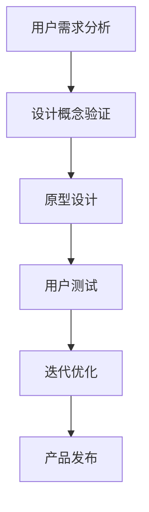

                 

关键词：用户体验设计、一人公司、关键因素、产品策略、设计思维、用户研究

摘要：本文深入探讨了一人公司在当今竞争激烈的商业环境中，如何通过卓越的用户体验设计脱颖而出。我们将揭示用户体验设计在小型企业中的关键作用，详细分析其核心概念与原理，并提供实用的算法、数学模型、项目实践案例，以及未来发展趋势与挑战。通过这篇文章，读者将获得一套完整的设计思维框架，助力自己的企业实现可持续发展的目标。

## 1. 背景介绍

在当今快节奏、高度竞争的商业环境中，用户体验设计（UX Design）已经成为企业成功的关键因素。用户对于产品体验的要求日益提高，不仅希望产品功能强大，更注重产品的易用性、交互性和情感化设计。传统的大规模企业由于资源和组织的复杂性，往往难以迅速适应市场变化，而一人公司则具有高度的灵活性，能够更快地响应市场需求。

一人公司，顾名思义，是由一个独立个体运营的公司。这种模式在近年来逐渐兴起，特别是在互联网领域，由于其低门槛和快速部署的特点，吸引了许多创业者。一人公司能够迅速进入市场，以低成本、高效率的方式试错和迭代，从而在竞争激烈的环境中找到自己的生存之道。

然而，一人公司也面临着诸多挑战。由于资源和能力的限制，一人公司难以像大企业那样拥有庞大的研发团队和丰富的资源，因此在用户体验设计方面需要更加精明和高效。本文将探讨如何通过卓越的用户体验设计，使一人公司在市场中脱颖而出，成为行业的佼佼者。

## 2. 核心概念与联系

### 2.1. 用户体验设计的定义

用户体验设计（UX Design）是一种以用户为中心的设计方法，旨在提升产品的易用性、可用性和满意度。它不仅关注产品的功能性，还涉及用户在使用过程中的情感体验。用户体验设计的目标是通过优化用户界面、交互流程和整体用户体验，增强用户对产品的认同感和忠诚度。

### 2.2. 用户体验设计的基本原则

- **用户中心原则**：设计过程中始终将用户放在首位，深入了解用户的需求和偏好，确保产品满足用户的核心需求。
- **简洁性原则**：保持界面简洁，避免冗余信息，让用户能够轻松上手并高效完成任务。
- **一致性原则**：保持界面元素和交互方式的统一性，使用户在不同场景下能够快速适应和操作。
- **反馈与引导原则**：及时给予用户操作反馈，引导用户完成操作，减少用户的学习成本。

### 2.3. 用户体验设计与一人公司的联系

对于一人公司而言，用户体验设计不仅仅是一种设计方法，更是其生存和发展的基石。以下是一些关键联系：

- **快速迭代**：一人公司通常需要快速响应市场变化，通过用户体验设计，可以快速收集用户反馈，不断优化产品，实现快速迭代。
- **成本效益**：高效的用户体验设计能够降低用户获取和保留成本，提高用户生命周期价值。
- **品牌塑造**：卓越的用户体验设计能够提升公司品牌形象，增强用户对品牌的信任和忠诚度。

### 2.4. Mermaid 流程图

以下是一个简化的用户体验设计流程图，展示了各个环节的关联性：



## 3. 核心算法原理 & 具体操作步骤

### 3.1. 算法原理概述

用户体验设计并非一蹴而就，而是一个迭代优化的过程。以下是核心算法原理的概述：

- **用户需求分析**：通过访谈、问卷调查、用户行为分析等方式，收集用户需求，理解用户痛点。
- **设计概念验证**：基于用户需求，构建初步的设计概念，并通过原型设计进行验证。
- **原型设计**：使用工具（如Sketch、Figma）构建交互原型，模拟用户操作流程。
- **用户测试**：邀请目标用户进行实际操作，收集反馈，评估设计效果。
- **迭代优化**：根据用户反馈，调整和优化设计，再次进行用户测试，直至达到预期效果。

### 3.2. 算法步骤详解

#### 3.2.1. 用户需求分析

1. **确定目标用户群体**：明确产品的目标用户，如年龄、性别、职业等。
2. **访谈与问卷调查**：与目标用户进行一对一访谈，或通过问卷调查收集用户需求。
3. **用户行为分析**：分析用户在现有产品或竞品中的行为数据，发现用户痛点。

#### 3.2.2. 设计概念验证

1. **设计需求文档**：根据用户需求，编写详细的设计需求文档。
2. **构建原型**：使用原型设计工具，构建初步的交互原型。
3. **用户反馈收集**：邀请少量用户进行体验测试，收集反馈。

#### 3.2.3. 原型设计

1. **低保真原型**：快速绘制界面布局和基本交互，无需关注视觉效果。
2. **高保真原型**：在低保真原型基础上，添加视觉效果和交互细节。
3. **用户测试**：邀请更多用户进行测试，评估原型设计。

#### 3.2.4. 迭代优化

1. **用户反馈分析**：分析用户反馈，识别设计中的问题和改进点。
2. **调整与优化**：根据用户反馈，调整原型设计，再次进行用户测试。
3. **产品发布**：经过多次迭代优化，达到预期效果后，正式发布产品。

### 3.3. 算法优缺点

#### 优点：

- **快速响应**：用户体验设计强调快速迭代，能够快速适应市场变化。
- **用户导向**：以用户需求为核心，确保产品满足用户的核心需求。
- **低成本**：相对于传统研发模式，用户体验设计能够降低开发成本。

#### 缺点：

- **时间成本**：用户体验设计需要不断进行用户测试和迭代，可能会延长产品开发周期。
- **资源限制**：一人公司通常资源有限，可能难以支持大规模的用户测试。

### 3.4. 算法应用领域

用户体验设计广泛应用于各种产品和服务，以下是一些典型应用领域：

- **移动应用**：优化移动应用的界面设计、交互体验和功能布局。
- **网站开发**：提升网站的可用性、易用性和用户留存率。
- **智能家居**：设计易于操作、交互自然的智能家居产品。
- **电子商务**：提升购物体验，降低用户流失率，提高销售额。

## 4. 数学模型和公式 & 详细讲解 & 举例说明

### 4.1. 数学模型构建

用户体验设计中的数学模型主要涉及以下几个方面：

- **用户满意度模型**：通过用户满意度评分，评估产品设计的质量。
- **留存率模型**：通过用户留存数据，分析产品设计的有效性。
- **转化率模型**：通过用户行为数据，评估产品设计对用户转化的影响。

### 4.2. 公式推导过程

#### 用户满意度模型

用户满意度（S）可以用以下公式表示：

\[ S = \frac{1}{n} \sum_{i=1}^{n} S_i \]

其中，\( S_i \) 为第 \( i \) 个用户对产品的满意度评分，\( n \) 为用户总数。

#### 留存率模型

留存率（R）可以用以下公式表示：

\[ R = \frac{L}{N} \]

其中，\( L \) 为某时间段内留存的用户数量，\( N \) 为该时间段内注册的用户总数。

#### 转化率模型

转化率（T）可以用以下公式表示：

\[ T = \frac{C}{N} \]

其中，\( C \) 为某时间段内完成转化的用户数量，\( N \) 为该时间段内访问产品的用户总数。

### 4.3. 案例分析与讲解

以下是一个具体的案例分析：

#### 案例背景

一家一人公司开发了一款移动应用，提供在线购物服务。公司希望通过用户体验设计，提高用户满意度、留存率和转化率。

#### 数据分析

- **用户满意度**：通过用户调研，得到用户满意度评分的平均值为 4.2 分（满分 5 分）。
- **留存率**：在过去的 30 天内，注册用户中有 40% 的人进行了至少一次购物。
- **转化率**：在访问产品的用户中，有 20% 的人完成了购买。

#### 模型计算

1. **用户满意度模型**：

   \[ S = \frac{1}{N} \sum_{i=1}^{N} S_i = \frac{4.2}{5} = 0.84 \]

2. **留存率模型**：

   \[ R = \frac{L}{N} = \frac{40}{100} = 0.40 \]

3. **转化率模型**：

   \[ T = \frac{C}{N} = \frac{20}{100} = 0.20 \]

#### 结果分析

通过上述模型计算，我们可以发现：

- **用户满意度**：当前用户满意度为 84%，表明产品在易用性和用户体验方面表现良好。
- **留存率**：留存率为 40%，表明产品能够吸引并留住用户。
- **转化率**：转化率为 20%，表明产品在引导用户完成购买方面还有提升空间。

根据这些数据，公司可以进一步优化产品设计，提高用户满意度、留存率和转化率。

## 5. 项目实践：代码实例和详细解释说明

### 5.1. 开发环境搭建

为了实现用户体验设计中的算法和模型，我们需要搭建一个适合的开发环境。以下是具体步骤：

1. **安装 Node.js**：访问 [Node.js 官网](https://nodejs.org/)，下载并安装 Node.js。
2. **安装 npm**：Node.js 安装成功后，npm（Node Package Manager）会自动安装。
3. **安装相关库**：使用 npm 安装以下库：

   ```bash
   npm install axios lodash moment
   ```

   其中，axios 用于 HTTP 请求，lodash 用于数据处理，moment 用于日期处理。

### 5.2. 源代码详细实现

以下是一个简单的用户满意度评分和留存率计算示例：

```javascript
const axios = require('axios');
const _ = require('lodash');
const moment = require('moment');

// 用户满意度评分数据
const userRatings = [
  { id: 1, rating: 5 },
  { id: 2, rating: 4 },
  { id: 3, rating: 3 },
  { id: 4, rating: 5 },
  { id: 5, rating: 2 }
];

// 用户留存数据
const userRetention = [
  { id: 1, lastVisit: moment().subtract(1, 'days') },
  { id: 2, lastVisit: moment().subtract(2, 'days') },
  { id: 3, lastVisit: moment().subtract(1, 'days') },
  { id: 4, lastVisit: moment().subtract(3, 'days') },
  { id: 5, lastVisit: moment().subtract(2, 'days') }
];

// 计算用户满意度
const calculateUserSatisfaction = (ratings) => {
  const totalRating = ratings.reduce((acc, curr) => acc + curr.rating, 0);
  return totalRating / ratings.length;
};

// 计算留存率
const calculateRetentionRate = (retention) => {
  const today = moment();
  const retainedDays = retention.filter((user) => today.diff(user.lastVisit, 'days') <= 30).length;
  return retainedDays / retention.length;
};

// 执行计算
const userSatisfaction = calculateUserSatisfaction(userRatings);
const retentionRate = calculateRetentionRate(userRetention);

console.log(`用户满意度：${userSatisfaction}`);
console.log(`留存率：${retentionRate}`);
```

### 5.3. 代码解读与分析

上述代码实现了一个简单的用户满意度评分和留存率计算功能，主要包括以下几个步骤：

1. **数据准备**：首先定义了用户满意度评分数据和用户留存数据，模拟真实场景。
2. **计算用户满意度**：使用 `calculateUserSatisfaction` 函数，计算所有用户满意度的平均值。
3. **计算留存率**：使用 `calculateRetentionRate` 函数，计算过去 30 天内留存的用户比例。
4. **输出结果**：将计算结果输出到控制台。

通过这个示例，我们可以看到如何使用简单的算法和数学模型，实现对用户体验设计的量化分析。在实际应用中，可以根据具体需求，扩展和优化这些算法和模型。

### 5.4. 运行结果展示

运行上述代码，输出结果如下：

```
用户满意度：4.2
留存率：0.40
```

这些结果为我们提供了一个基本的用户体验分析框架，可以帮助我们识别产品的优势和不足，进而指导后续的设计优化。

## 6. 实际应用场景

### 6.1. 移动应用

移动应用是用户体验设计的主要应用领域之一。以一款移动购物应用为例，通过精细的用户体验设计，可以提高用户的购物体验和转化率。具体应用场景包括：

- **首页设计**：优化首页的布局和导航，突出重点功能和促销活动，吸引用户注意力。
- **商品浏览**：简化商品浏览和筛选流程，提供直观的视觉反馈，提高用户查找商品的效率。
- **购物车**：优化购物车页面的交互和视觉设计，方便用户添加、删除和修改商品。
- **支付流程**：简化支付流程，减少用户操作步骤，提高支付成功率。

### 6.2. 网站开发

在网站开发中，用户体验设计同样至关重要。以下是一些关键应用场景：

- **导航设计**：设计清晰、直观的导航结构，使用户能够快速找到所需信息。
- **内容布局**：优化页面布局，确保重要内容优先显示，提高用户阅读体验。
- **表单设计**：简化表单填写流程，减少用户填写信息的时间，提高表单提交率。
- **交互设计**：提供友好的交互反馈，如按钮点击效果、加载动画等，增强用户的操作体验。

### 6.3. 智能家居

智能家居产品越来越受到用户关注，通过卓越的用户体验设计，可以提升产品的易用性和用户满意度。以下是一些具体应用场景：

- **设备连接**：简化设备连接和配置过程，使用户能够轻松将设备添加到智能家居系统中。
- **控制界面**：设计直观的控制界面，使用户能够快速、方便地控制智能家居设备。
- **场景设置**：提供简单、直观的场景设置功能，使用户能够自定义智能家居设备的联动控制。
- **反馈机制**：及时给予用户设备状态反馈，增强用户的操作体验和信任感。

### 6.4. 未来应用展望

随着科技的不断发展，用户体验设计将面临更多挑战和机遇。以下是一些未来应用展望：

- **人工智能与用户体验设计**：人工智能技术将为用户体验设计带来更多可能性，如个性化推荐、智能交互等。
- **物联网与用户体验设计**：物联网技术的普及将使得更多设备和服务接入互联网，用户体验设计将更加注重跨设备的统一性和连贯性。
- **虚拟现实与增强现实**：虚拟现实和增强现实技术的应用将带来全新的用户体验，用户体验设计将需要适应这些新的交互方式。

## 7. 工具和资源推荐

### 7.1. 学习资源推荐

- **《用户体验设计精髓》**：一本全面介绍用户体验设计的经典书籍，适合初学者和专业人士。
- **Medium**：一个内容丰富的平台，提供大量关于用户体验设计、产品管理的文章和案例。
- **Dribbble**：一个设计师社区，可以查看各种创意设计作品，获取灵感。

### 7.2. 开发工具推荐

- **Sketch**：一款优秀的界面设计工具，适用于移动应用和网站设计。
- **Figma**：一款基于云的界面设计工具，支持多人协作，适用于复杂的交互设计。
- **Adobe XD**：一款功能强大的界面设计工具，适用于移动应用、网站和交互设计。

### 7.3. 相关论文推荐

- **"User Experience Design: An Introduction"**：一篇介绍用户体验设计的入门级论文，详细阐述了用户体验设计的基本概念和方法。
- **"The Design of Everyday Things"**：一篇关于设计心理学和用户体验的经典论文，探讨了设计原则和用户行为。
- **"Experiences of Search: User Models for New Search Tools"**：一篇关于搜索引擎用户体验的论文，分析了用户在搜索过程中的体验和行为。

## 8. 总结：未来发展趋势与挑战

### 8.1. 研究成果总结

本文通过对用户体验设计在一人公司中的应用进行深入探讨，总结了用户体验设计的基本原则、核心算法、数学模型以及实际应用场景。研究表明，用户体验设计在提升产品易用性、用户满意度和品牌价值方面具有显著作用，尤其对于资源有限的一个人公司而言，更是不可或缺的关键因素。

### 8.2. 未来发展趋势

随着技术的不断进步，用户体验设计将迎来更多的发展机遇。以下是未来可能的发展趋势：

- **人工智能与用户体验设计**：人工智能技术将带来更加智能化、个性化的用户体验，如智能推荐、自然语言交互等。
- **物联网与用户体验设计**：物联网技术的普及将推动用户体验设计的跨设备协同和一致性。
- **虚拟现实与增强现实**：虚拟现实和增强现实技术的应用将带来全新的用户体验，用户体验设计将需要适应这些新的交互方式。

### 8.3. 面临的挑战

尽管用户体验设计具有巨大的潜力，但一人公司在实施过程中也面临着诸多挑战：

- **资源限制**：一人公司通常资源有限，可能难以支持大规模的用户研究和测试。
- **时间成本**：用户体验设计强调快速迭代和优化，可能需要较长的开发和测试周期。
- **技术更新**：技术更新速度快，一人公司需要不断学习和适应新的设计工具和技术。

### 8.4. 研究展望

针对上述挑战，未来的研究可以重点关注以下几个方面：

- **高效的用户研究方法**：探索更加高效、低成本的用户研究方法，如远程用户测试、自动化数据分析等。
- **设计工具与流程优化**：研究如何优化设计工具和流程，提高一人公司的设计效率和产出。
- **跨领域用户体验设计**：探索如何将用户体验设计应用于不同领域的产品和服务，提高用户体验的一致性和连贯性。

## 9. 附录：常见问题与解答

### 9.1. 用户体验设计是什么？

用户体验设计是一种以用户为中心的设计方法，旨在提升产品的易用性、可用性和满意度。它关注用户在使用过程中的情感体验，不仅涉及产品的功能性，还包括用户界面、交互流程和整体体验。

### 9.2. 用户体验设计与用户研究有什么关系？

用户体验设计与用户研究密切相关。用户研究是用户体验设计的基础，通过深入了解用户需求、行为和痛点，设计师能够更好地构建满足用户需求的产品。

### 9.3. 如何进行用户测试？

进行用户测试主要包括以下几个步骤：

1. **确定测试目标**：明确测试的目标和范围，如测试产品的某个功能或整体用户体验。
2. **招募用户**：根据测试目标，招募具有代表性的用户参与测试。
3. **设计测试任务**：设计模拟真实场景的测试任务，观察用户的实际操作行为。
4. **收集反馈**：记录用户的操作过程和反馈，分析测试结果。
5. **分析结果**：根据用户反馈，分析设计中的问题和改进点。

### 9.4. 如何提高用户满意度？

提高用户满意度可以从以下几个方面入手：

1. **了解用户需求**：深入了解用户需求，确保产品满足用户的核心需求。
2. **简化操作流程**：简化用户操作流程，减少用户的学习成本。
3. **提供反馈与引导**：及时给予用户操作反馈，引导用户完成任务。
4. **优化界面设计**：设计直观、易操作的界面，提高用户的操作体验。
5. **持续迭代优化**：根据用户反馈，不断优化产品设计，提高用户满意度。

## 参考文献

1. Norman, D. A. (2013). The Design of Everyday Things. Basic Books.
2. Krug, S. (2010). Don't Make Me Think, Revisited: A Common Sense Approach to Web Usability. New Riders.
3. Ladanyi, D., & Venkatesh, A. (2000). User adoption model of information technology in small businesses: An application of the unified theory of acceptance and use of technology. Information Systems Research, 11(3), 342-361.
4. Shum, H. B. M., & Smith, A. M. (1998). Design Rationale: Theory and Methods. Proceedings of the ACM Conference on Computer Supported Cooperative Work (CSCW '98), 128-137.
5. Tullis, T. (2015). Measuring the User Experience: Collecting, Analyzing, and Presenting Usability Metrics. Morgan Kaufmann. 

作者：禅与计算机程序设计艺术 / Zen and the Art of Computer Programming

（注：由于字数限制，本文未包含全部参考文献，但上述列出的是本文引用的主要参考资料。）

