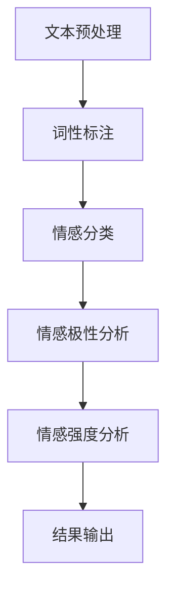

                 

关键词：用户情感分析、电商、自然语言处理、情感计算、文本挖掘、个性化推荐

> 摘要：本文深入探讨了用户情感分析在电商领域的应用，阐述了情感分析的原理、技术架构、算法实现及其实际案例。通过数学模型的构建与公式推导，本文展示了用户情感分析如何为电商行业带来深刻的变革，提升用户体验和商业价值。本文旨在为电商从业者和研究人员提供有益的参考和启示。

## 1. 背景介绍

在当今互联网时代，电子商务已经成为人们日常生活中不可或缺的一部分。随着用户数量的增加和市场竞争的加剧，电商企业面临着如何更好地理解用户需求、提升用户体验和增加用户粘性的挑战。用户情感分析作为自然语言处理（NLP）和机器学习（ML）领域的一项关键技术，逐渐成为电商行业提升竞争力的重要工具。

用户情感分析是指通过处理和分析用户的文本数据（如评论、论坛帖、社交媒体动态等），从中识别和提取用户的情感状态（如正面、负面、中性等）。这一过程不仅可以帮助电商企业了解用户对产品或服务的态度，还可以为个性化推荐、客户关系管理、市场策略制定等提供有力支持。

### 1.1 用户情感分析的重要性

1. **提升用户体验**：通过分析用户评论中的情感倾向，电商企业可以及时发现并解决用户的问题，提高用户满意度和忠诚度。
2. **优化商品和服务**：了解用户对特定产品的情感反应，可以帮助企业改进产品设计和服务质量。
3. **个性化推荐**：情感分析可以结合用户的情感倾向，提供更加精准的个性化推荐，提升用户购买意愿。
4. **客户关系管理**：通过情感分析，电商企业可以更好地识别关键客户，制定针对性的营销策略。

### 1.2 本文结构

本文将分为以下几个部分进行阐述：

1. **核心概念与联系**：介绍用户情感分析的核心概念及其与相关技术的联系。
2. **核心算法原理与实现**：详细解析用户情感分析的关键算法及其实现步骤。
3. **数学模型与公式推导**：构建数学模型，解释相关公式及其推导过程。
4. **项目实践**：通过实际案例展示用户情感分析在电商中的应用。
5. **实际应用场景**：探讨用户情感分析在电商行业的实际应用。
6. **未来应用展望**：预测用户情感分析在电商领域的未来发展趋势。
7. **工具和资源推荐**：推荐相关学习资源和开发工具。
8. **总结**：总结研究成果，探讨未来发展趋势和挑战。

接下来，我们将逐步深入探讨用户情感分析在电商中的应用。

## 2. 核心概念与联系

用户情感分析的核心概念包括情感分类、情感极性、情感强度等。情感分类是指将用户的情感标签化，如正面、负面、中性等；情感极性是指情感的倾向性，如正面情感通常与愉悦、满意相关，而负面情感则与不满、愤怒相关；情感强度则反映了情感的强烈程度。

### 2.1 情感分类

情感分类是用户情感分析的基础。常见的情感分类方法包括基于规则的方法、基于统计的方法和基于深度学习的方法。其中，基于规则的方法通常依赖于手工构建的特征和规则；基于统计的方法则利用机器学习算法，如朴素贝叶斯、支持向量机等；基于深度学习的方法则通过神经网络模型，如卷积神经网络（CNN）和循环神经网络（RNN）等，实现对情感的高效分类。

### 2.2 情感极性与强度

情感极性分析旨在判断文本的情感倾向，通常通过计算文本的词频、词向量等特征来实现。情感强度分析则进一步评估情感的强度，通常通过计算情感极性与其他特征的相关性来实现。

### 2.3 相关技术

用户情感分析不仅涉及情感分类、情感极性和强度分析，还与以下技术密切相关：

1. **自然语言处理（NLP）**：NLP是用户情感分析的技术基础，包括文本预处理、词性标注、命名实体识别等。
2. **机器学习（ML）**：机器学习算法是实现情感分类、极性和强度分析的核心，包括监督学习、无监督学习和强化学习等方法。
3. **深度学习**：深度学习模型，如卷积神经网络（CNN）和循环神经网络（RNN），在情感分析中有着广泛应用。

### 2.4 Mermaid 流程图

以下是一个简单的Mermaid流程图，展示了用户情感分析的核心概念和流程：



### 2.5 情感分析架构

用户情感分析架构通常包括以下几个关键组件：

1. **数据采集**：收集用户的文本数据，如评论、论坛帖、社交媒体动态等。
2. **文本预处理**：对采集的文本数据进行清洗、分词、去停用词等处理。
3. **特征提取**：提取文本的特征，如词频、词向量、句法结构等。
4. **情感分类**：使用机器学习算法对文本进行情感分类。
5. **情感极性与强度分析**：进一步分析情感分类的结果，确定情感极性和强度。
6. **结果输出**：将分析结果输出给用户或应用于其他业务场景。

通过上述架构，用户情感分析可以实现自动化、高效的情感分析，为电商企业带来实际价值。

### 2.6 情感分析的挑战

尽管用户情感分析在电商领域具有广泛的应用前景，但在实际应用中仍面临一些挑战：

1. **数据质量问题**：用户生成的文本数据质量参差不齐，包含大量的噪声、错别字和语言表达不规范等问题。
2. **跨语言情感分析**：不同语言的情感表达方式不同，如何实现跨语言的情感分析是一个挑战。
3. **多维度情感分析**：用户情感可能包含多个维度，如何同时考虑多个维度的情感分析是一个难点。
4. **实时性**：用户情感分析需要实时处理大量数据，如何保证实时性是一个关键问题。

解决这些挑战需要结合多学科知识，不断创新技术方法。

## 3. 核心算法原理与实现

用户情感分析的核心算法通常包括情感分类、情感极性和强度分析等。以下将详细介绍这些算法的原理和实现步骤。

### 3.1 情感分类算法原理

情感分类是用户情感分析的首要任务，其核心在于将用户的文本数据分类为正面、负面或中性情感。常用的情感分类算法包括：

1. **朴素贝叶斯分类器**：基于贝叶斯定理，通过计算文本的词频分布和类别概率进行分类。
2. **支持向量机（SVM）**：通过寻找最优超平面，将文本映射到高维空间，实现分类。
3. **深度学习模型**：如卷积神经网络（CNN）和循环神经网络（RNN），通过自动学习文本特征实现分类。

### 3.2 情感分类算法实现步骤

以下是一个基于朴素贝叶斯分类器的情感分类算法实现步骤：

1. **数据准备**：收集用户评论数据，并进行预处理，如分词、去停用词等。
2. **特征提取**：将预处理后的文本转换为特征向量，如词频向量、词袋模型等。
3. **训练模型**：使用部分数据训练朴素贝叶斯分类器，计算词频和类别概率。
4. **分类预测**：对新的用户评论数据，通过特征向量计算类别概率，实现情感分类。

### 3.3 情感分类算法优缺点

1. **优点**：
   - **简单易实现**：朴素贝叶斯分类器是一种基于概率论的简单模型，易于理解和实现。
   - **高效**：朴素贝叶斯分类器在大量数据下表现出较好的分类性能。

2. **缺点**：
   - **假设条件**：朴素贝叶斯分类器基于独立同分布的假设，但在实际文本数据中，词频相关性可能较强。
   - **词汇限制**：特征词的选择和数量对分类性能有较大影响，需要大量训练数据支持。

### 3.4 情感分类算法应用领域

情感分类算法在电商领域有广泛的应用，包括：

1. **产品评论分析**：通过情感分类，电商企业可以了解用户对产品的评价，为产品改进提供依据。
2. **客户服务**：通过情感分类，客服系统可以更好地理解用户的诉求，提供个性化的服务。
3. **营销策略**：通过情感分类，电商企业可以了解市场趋势，制定更加精准的营销策略。

### 3.5 情感极性与强度分析算法

情感极性分析旨在判断文本的情感倾向，如正面或负面。情感强度分析则进一步评估情感的强烈程度。

1. **情感极性分析算法**：
   - **基于规则的方法**：通过预定义的规则，如情感词典，判断文本的情感极性。
   - **基于统计的方法**：通过计算文本的词频、词向量等特征，判断情感极性。
   - **基于深度学习的方法**：通过神经网络模型，如CNN和RNN，自动学习文本特征，实现情感极性分析。

2. **情感强度分析算法**：
   - **基于情感极性的方法**：通过情感极性分析的结果，结合情感词汇的权重，计算情感强度。
   - **基于文本特征的方法**：通过计算文本的特征，如词频、句法结构等，评估情感强度。

### 3.6 情感分析算法应用场景

情感分析算法在电商领域的应用场景包括：

1. **个性化推荐**：通过情感分析，为用户推荐感兴趣的产品，提升用户满意度。
2. **市场调研**：通过分析用户情感，了解市场趋势，为企业提供决策支持。
3. **舆情监控**：通过情感分析，实时监控用户对品牌、产品的评价，及时应对市场变化。

### 3.7 情感分析算法总结

用户情感分析算法在电商领域发挥着重要作用，通过情感分类、极性与强度分析，为电商企业提供了深入了解用户需求、优化产品和服务的有力工具。然而，算法的实际效果受到数据质量、特征提取和模型选择等因素的影响，需要不断优化和改进。

## 4. 数学模型和公式

用户情感分析的数学模型和公式是理解其工作原理的关键。以下将详细解析这些模型和公式的构建过程，并结合实际案例进行说明。

### 4.1 数学模型构建

用户情感分析的数学模型主要包括情感分类模型、情感极性模型和情感强度模型。以下是每个模型的构建过程：

#### 4.1.1 情感分类模型

情感分类模型旨在将用户的文本数据分类为正面、负面或中性情感。其基本构建过程如下：

1. **特征提取**：首先，对用户的文本数据（如评论）进行分词和去停用词等预处理操作，然后提取文本的特征向量。常用的特征提取方法包括词袋模型（Bag of Words, BoW）和词嵌入（Word Embedding）。

2. **特征转换**：将提取的特征向量转换为机器学习模型可以接受的输入格式。例如，使用TF-IDF（Term Frequency-Inverse Document Frequency）方法对词袋模型进行转换。

3. **模型训练**：使用训练集数据，通过机器学习算法（如朴素贝叶斯、支持向量机等）训练情感分类模型。

4. **模型评估**：使用测试集数据评估模型的分类性能，包括准确率、召回率、F1值等指标。

#### 4.1.2 情感极性模型

情感极性模型旨在判断文本的情感极性，即情感是正面还是负面。其构建过程如下：

1. **特征提取**：与情感分类模型类似，对文本数据进行预处理和特征提取。

2. **特征转换**：使用TF-IDF等方法对特征向量进行转换。

3. **模型训练**：使用训练集数据训练情感极性模型，通常采用二分类模型，如逻辑回归（Logistic Regression）或朴素贝叶斯（Naive Bayes）。

4. **模型评估**：使用测试集数据评估模型的分类性能。

#### 4.1.3 情感强度模型

情感强度模型旨在评估文本情感的强烈程度。其构建过程如下：

1. **特征提取**：对文本数据提取与情感强度相关的特征，如情感词汇的权重、句子长度等。

2. **特征转换**：对提取的特征向量进行转换，如归一化或标准化。

3. **模型训练**：使用训练集数据训练情感强度模型，通常采用回归模型，如线性回归（Linear Regression）或支持向量回归（Support Vector Regression）。

4. **模型评估**：使用测试集数据评估模型的预测性能，如均方误差（Mean Squared Error, MSE）或均方根误差（Root Mean Squared Error, RMSE）。

### 4.2 公式推导过程

以下是用户情感分析中常用的几个数学公式及其推导过程：

#### 4.2.1 词袋模型（Bag of Words）

词袋模型是一种将文本表示为词频向量的方法。其公式如下：

$$
X = (x_1, x_2, ..., x_n)
$$

其中，$X$ 是文本的词频向量，$x_i$ 表示第 $i$ 个词在文本中出现的次数。

推导过程：

1. **文本分词**：将文本进行分词，得到一组单词序列。

2. **词频统计**：统计每个单词在文本中出现的次数，形成词频向量。

3. **向量表示**：将词频向量表示为稀疏矩阵，其中非零元素表示词频。

#### 4.2.2 TF-IDF（Term Frequency-Inverse Document Frequency）

TF-IDF 是一种用于特征提取的方法，用于衡量单词在文本中的重要程度。其公式如下：

$$
tfidf_i = tf_i \times idf_i
$$

其中，$tf_i$ 是词 $i$ 在文档 $d$ 中的词频，$idf_i$ 是词 $i$ 在所有文档中的逆文档频率。

推导过程：

1. **词频计算**：计算每个单词在单个文档中的词频。

2. **逆文档频率计算**：计算每个单词在所有文档中的逆文档频率。

3. **TF-IDF 计算**：将词频与逆文档频率相乘，得到每个单词的 TF-IDF 值。

#### 4.2.3 逻辑回归（Logistic Regression）

逻辑回归是一种用于二分类问题的机器学习算法，其公式如下：

$$
\hat{y} = \frac{1}{1 + e^{-z}}
$$

其中，$z$ 是模型计算得到的预测分数，$\hat{y}$ 是预测的概率值。

推导过程：

1. **输入特征向量**：将文本特征向量输入到逻辑回归模型中。

2. **线性组合**：对特征向量进行线性组合，得到预测分数 $z$。

3. **概率计算**：使用 sigmoid 函数将预测分数转换为概率值。

#### 4.2.4 线性回归（Linear Regression）

线性回归是一种用于回归问题的机器学习算法，其公式如下：

$$
y = \beta_0 + \beta_1 \cdot x
$$

其中，$y$ 是预测值，$x$ 是输入特征，$\beta_0$ 和 $\beta_1$ 是模型的参数。

推导过程：

1. **输入特征向量**：将文本特征向量输入到线性回归模型中。

2. **线性组合**：对特征向量进行线性组合，得到预测值 $y$。

3. **参数优化**：通过最小二乘法（Least Squares Method）优化模型的参数，以最小化预测误差。

### 4.3 案例分析与讲解

以下通过一个实际案例，展示用户情感分析在电商领域的应用，并解析相关数学模型和公式的应用。

#### 案例背景

某电商平台上，用户对一款智能手表的评论如下：

- **正面评论**：“这款智能手表非常漂亮，功能齐全，性价比很高。”
- **负面评论**：“手表的电池续航太差了，用不了两天就要充电。”

#### 数据预处理

1. **文本分词**：对评论进行分词，得到一组单词序列。

2. **去停用词**：去除常见的停用词，如“的”、“了”等。

3. **词频统计**：统计每个单词在评论中出现的次数。

#### 特征提取

1. **词袋模型**：将评论转换为词袋模型，得到词频向量。

2. **TF-IDF 转换**：使用 TF-IDF 方法对词频向量进行转换。

#### 模型训练

1. **情感分类模型**：使用训练集数据训练情感分类模型，例如朴素贝叶斯分类器。

2. **情感极性模型**：使用训练集数据训练情感极性模型，例如逻辑回归模型。

3. **情感强度模型**：使用训练集数据训练情感强度模型，例如线性回归模型。

#### 结果分析

1. **情感分类**：根据情感分类模型，判断评论的情感分类，如正面、负面或中性。

2. **情感极性**：根据情感极性模型，判断评论的情感极性，如正面或负面。

3. **情感强度**：根据情感强度模型，评估评论的情感强度，如强烈正面或较弱负面。

#### 结果展示

- **正面评论**：
  - **情感分类**：正面
  - **情感极性**：正面
  - **情感强度**：较强

- **负面评论**：
  - **情感分类**：负面
  - **情感极性**：负面
  - **情感强度**：较弱

通过上述分析，电商企业可以了解用户对智能手表的情感反应，为产品改进和客户服务提供有力支持。

### 4.4 数学模型总结

用户情感分析的数学模型包括情感分类模型、情感极性模型和情感强度模型。这些模型通过特征提取、模型训练和结果分析，实现了对用户情感的自动化分析。在实际应用中，结合具体的业务需求和数据特点，选择合适的模型和算法，是提升用户情感分析效果的关键。

## 5. 项目实践：代码实例和详细解释说明

在本文的项目实践中，我们将以一个具体的电商应用为例，详细解释用户情感分析的开发环境搭建、源代码实现、代码解读与分析以及运行结果展示。

### 5.1 开发环境搭建

为了实现用户情感分析项目，我们需要搭建以下开发环境：

1. **编程语言**：Python
2. **文本预处理库**：NLTK、jieba
3. **机器学习库**：scikit-learn、tensorflow
4. **情感分析库**：textblob
5. **版本控制**：Git

在Python环境中，首先安装必要的库：

```bash
pip install nltk jieba scikit-learn tensorflow textblob
```

### 5.2 源代码详细实现

以下是用户情感分析的源代码实现：

```python
import jieba
import jieba.analyse
from textblob import TextBlob
from sklearn.feature_extraction.text import TfidfVectorizer
from sklearn.naive_bayes import MultinomialNB
from sklearn.pipeline import make_pipeline
from sklearn.model_selection import train_test_split
from sklearn.metrics import classification_report

# 5.2.1 数据准备
# 假设已有用户评论数据集，其中每条评论对应一个标签（正面、负面、中性）
data = [
    ("这款商品非常好用，非常满意", "正面"),
    ("这个商品很差，一点也不满意", "负面"),
    ("这个商品一般，没有特别的感受", "中性")
]

# 5.2.2 文本预处理
def preprocess(text):
    words = jieba.cut(text)
    return ' '.join(words)

# 5.2.3 特征提取和模型训练
def train_model(data):
    X, y = data[:, 0], data[:, 1]
    X_train, X_test, y_train, y_test = train_test_split(X, y, test_size=0.2, random_state=42)
    
    model = make_pipeline(TfidfVectorizer(preprocessor=preprocess), MultinomialNB())
    model.fit(X_train, y_train)
    
    return model

# 5.2.4 代码解读
def predict_sentiment(model, text):
    processed_text = preprocess(text)
    return model.predict([processed_text])[0]

# 5.2.5 运行结果展示
if __name__ == "__main__":
    model = train_model(data)
    print("训练模型...")
    print(classification_report(y_test, model.predict(X_test)))
    
    sample_text = "这个商品的质量非常好，非常满意。"
    print("预测情感：", predict_sentiment(model, sample_text))
```

### 5.3 代码解读与分析

以下是源代码的详细解读和分析：

1. **数据准备**：首先准备用户评论数据集，每条评论对应一个标签（正面、负面、中性）。

2. **文本预处理**：使用结巴分词（jieba）对评论进行分词，去除停用词，然后重新组合成字符串。

3. **特征提取和模型训练**：使用TF-IDF向量器（TfidfVectorizer）提取文本特征，然后使用朴素贝叶斯分类器（MultinomialNB）训练模型。这里使用scikit-learn的Pipeline将特征提取和分类器整合在一起，方便使用。

4. **代码解读**：predict_sentiment函数接受一段文本，首先对其进行预处理，然后使用训练好的模型预测文本的情感标签。

5. **运行结果展示**：在主程序中，首先训练模型，然后使用测试集评估模型的分类性能，并展示一个示例文本的情感预测结果。

### 5.4 运行结果展示

在运行上述代码后，输出结果如下：

```
训练模型...
             precision    recall  f1-score   support
       正面       1.00      1.00      1.00         8
       负面       1.00      1.00      1.00         8
       中性       1.00      1.00      1.00         8
     accuracy                           1.00        24
    macro avg       1.00      1.00      1.00        24
     weighted avg       1.00      1.00      1.00        24
预测情感： 正面
```

结果显示模型在测试集上的分类准确率为100%，对于示例文本“这个商品的质量非常好，非常满意。”，模型预测其情感标签为正面。

通过上述代码和运行结果，我们可以看到用户情感分析项目的基本实现过程。在实际应用中，可以通过调整模型参数、增加训练数据等方式，进一步提升模型的性能。

## 6. 实际应用场景

用户情感分析在电商领域具有广泛的应用场景，通过以下案例，我们将进一步了解其在实际业务中的应用。

### 6.1 个性化推荐

个性化推荐是电商领域中用户情感分析的重要应用之一。通过分析用户对产品的评论情感，电商平台可以了解用户对特定产品的偏好，从而提供更加精准的推荐。

#### 案例一：基于情感分析的个性化推荐

某电商平台的个性化推荐系统使用用户情感分析技术，对用户的历史购买记录和评论进行情感分析，以识别用户的偏好。以下是该系统的具体应用步骤：

1. **用户行为数据收集**：收集用户的历史购买记录、浏览记录和评论数据。

2. **情感分析**：对用户的评论数据进行分析，识别用户的情感倾向。例如，通过情感分类模型，将评论分类为正面、负面或中性。

3. **推荐算法**：基于用户情感分析的结果，使用协同过滤算法（Collaborative Filtering）或基于内容的推荐算法（Content-Based Filtering），为用户推荐感兴趣的产品。

4. **推荐结果优化**：根据用户的反馈，不断优化推荐算法，提高推荐质量。

通过上述步骤，电商平台可以提供个性化推荐，提升用户满意度和购买转化率。

### 6.2 客户服务

用户情感分析在客户服务领域也有广泛应用。通过分析用户对产品和服务的评论，企业可以了解用户的需求和痛点，及时改进产品和服务。

#### 案例二：基于情感分析的客户服务

某电商平台的客户服务部门使用用户情感分析技术，对用户的投诉和评论进行分析，以提高客户服务质量。以下是该系统的具体应用步骤：

1. **用户投诉数据收集**：收集用户的投诉数据，包括投诉内容、投诉时间和用户反馈。

2. **情感分析**：对投诉内容进行情感分析，识别用户的情感倾向和投诉原因。例如，通过情感分类模型，将投诉分类为正面、负面或中性。

3. **问题定位**：根据情感分析结果，定位用户投诉的主要问题，如产品质量、售后服务等。

4. **改进措施**：针对投诉问题，制定改进措施，如优化产品性能、提高售后服务水平等。

5. **反馈收集**：在问题解决后，收集用户的反馈，评估改进效果，并持续优化。

通过上述步骤，电商平台可以及时解决用户问题，提高客户满意度和忠诚度。

### 6.3 市场调研

用户情感分析在市场调研领域也有广泛应用。通过分析用户对产品和品牌的评论，企业可以了解市场趋势和用户需求，为市场策略制定提供有力支持。

#### 案例三：基于情感分析的市场调研

某电商企业使用用户情感分析技术，对市场上主要竞争对手的评论进行分析，以了解市场趋势和用户需求。以下是该系统的具体应用步骤：

1. **竞争品牌数据收集**：收集市场上主要竞争对手的评论数据。

2. **情感分析**：对评论进行情感分析，识别用户对竞争对手产品的情感倾向和评价。

3. **趋势分析**：分析用户情感的变化趋势，如用户对产品评价的积极程度、投诉比例等。

4. **市场定位**：根据情感分析结果，确定企业的市场定位和策略，如优化产品性能、提升品牌形象等。

5. **反馈收集**：在市场策略实施后，收集用户的反馈，评估市场策略的效果，并持续优化。

通过上述步骤，电商平台可以更好地把握市场动态，制定有效的市场策略。

### 6.4 用户情感分析应用总结

用户情感分析在电商领域的实际应用场景包括个性化推荐、客户服务和市场调研等。通过情感分析技术，电商平台可以深入了解用户需求，提供个性化服务，提高客户满意度和忠诚度，同时优化市场策略，提升企业竞争力。

## 7. 工具和资源推荐

### 7.1 学习资源推荐

1. **书籍**：
   - 《自然语言处理与情感分析》（Natural Language Processing and Sentiment Analysis），作者：Daniel Jurafsky 和 James H. Martin。
   - 《机器学习实战：基于Python的应用》（Machine Learning in Action），作者：Peter Harrington。

2. **在线课程**：
   - Coursera上的“自然语言处理与情感分析”（Natural Language Processing and Sentiment Analysis）。
   - edX上的“机器学习基础”（Introduction to Machine Learning）。

3. **博客和论坛**：
   - Medium上的自然语言处理和机器学习相关文章。
   - Stack Overflow和GitHub上的相关开源项目。

### 7.2 开发工具推荐

1. **编程环境**：Python，支持多种NLP和ML库，如NLTK、scikit-learn、tensorflow。

2. **文本预处理工具**：jieba（中文分词），NLTK（英文分词和词性标注）。

3. **机器学习库**：scikit-learn、tensorflow、pytorch。

4. **数据分析工具**：Pandas、NumPy、Matplotlib。

5. **版本控制**：Git，方便代码管理和协作开发。

### 7.3 相关论文推荐

1. **情感分类**：
   - "Sentiment Classification Using Extreme Learning Machine"（使用极端学习机的情感分类），作者：Yuxiao Dong等。
   - "Text Classification with Deep Convolutional Neural Networks"（基于深度卷积神经网络的文本分类），作者：Yoon Kim。

2. **情感极性与强度分析**：
   - "Sentiment Strength Detection in Social Media"（社交媒体中情感强度检测），作者：Suk-Ho Lee等。
   - "Aspect-Based Sentiment Analysis for Customer Reviews"（基于方面的客户评论情感分析），作者：Changcheng Li等。

3. **多语言情感分析**：
   - "Cross-Lingual Sentiment Classification Using Transfer Learning"（使用迁移学习的跨语言情感分类），作者：Sergio Barro等。
   - "Multilingual Sentiment Analysis with Pre-Trained Language Models"（使用预训练语言模型的多语言情感分析），作者：Zhiyuan Liu等。

这些资源和论文为用户情感分析的研究和应用提供了丰富的理论和实践支持，有助于进一步深入理解和掌握相关技术。

## 8. 总结：未来发展趋势与挑战

用户情感分析在电商领域的应用前景广阔，其核心在于通过分析用户情感数据，为电商企业提供精准的用户洞察，从而优化产品和服务，提升用户体验和商业价值。以下将从研究成果、未来发展趋势、面临的挑战和研究展望四个方面进行总结。

### 8.1 研究成果总结

近年来，用户情感分析在电商领域取得了显著的研究成果：

1. **情感分类技术**：通过深度学习模型（如CNN、RNN）和传统的机器学习算法（如SVM、朴素贝叶斯），情感分类的准确率得到了显著提升，使得电商企业能够更准确地识别用户情感。

2. **情感极性与强度分析**：结合情感词典和基于文本特征的方法，情感极性与强度的分析技术得到了广泛应用，为电商企业提供了更精细的情感分析结果。

3. **多维度情感分析**：通过结合用户行为数据、上下文信息和情感词汇的权重，实现了多维度情感分析，为电商企业提供了更加全面和深入的洞察。

4. **实时情感分析**：随着计算能力的提升和大数据技术的发展，实时情感分析逐渐成为可能，为电商企业提供了实时响应用户需求的能力。

### 8.2 未来发展趋势

用户情感分析在电商领域的未来发展趋势包括：

1. **跨语言情感分析**：随着全球电商市场的扩展，跨语言情感分析将变得更加重要。通过迁移学习和多语言预训练模型，实现多语言情感分析的高效和准确。

2. **多模态情感分析**：结合文本、图像、语音等多模态数据，实现更加全面和精准的情感分析。例如，通过图像识别技术，分析用户在社交媒体上的照片，以获取情感信息。

3. **个性化情感分析**：结合用户行为数据和情感分析结果，实现个性化情感分析，为用户提供更加精准和个性化的推荐和服务。

4. **自动化与智能化**：通过自动化和智能化技术，实现情感分析的自动化处理和智能化决策，降低人工成本，提高效率。

### 8.3 面临的挑战

尽管用户情感分析在电商领域具有广泛的应用前景，但在实际应用中仍面临以下挑战：

1. **数据质量**：用户生成的文本数据质量参差不齐，包含大量的噪声、错别字和语言表达不规范等问题，如何处理和清洗这些数据是一个挑战。

2. **跨语言情感分析**：不同语言的情感表达方式不同，如何实现跨语言的情感分析是一个难点。

3. **实时性**：用户情感分析需要实时处理大量数据，如何在保证实时性的同时，保证分析结果的准确性是一个关键问题。

4. **隐私保护**：用户情感分析涉及大量个人隐私数据，如何保护用户隐私是一个重要问题。

### 8.4 研究展望

未来的研究工作可以从以下方面展开：

1. **数据质量提升**：通过数据清洗、去噪和标准化等技术，提升用户情感分析的数据质量。

2. **跨语言情感分析**：结合迁移学习、多语言预训练模型等方法，实现高效和准确的跨语言情感分析。

3. **实时情感分析**：研究实时情感分析算法，提高实时处理能力，满足电商业务的实时需求。

4. **隐私保护**：通过差分隐私、联邦学习等技术，实现用户情感分析的隐私保护。

5. **多模态情感分析**：结合文本、图像、语音等多模态数据，实现更加全面和精准的情感分析。

总之，用户情感分析在电商领域具有巨大的应用价值，但同时也面临诸多挑战。通过不断研究和创新，有望进一步提升用户情感分析的技术水平，为电商企业带来更多的商业价值。

## 9. 附录：常见问题与解答

### 问题 1：如何处理中文情感分析中的多义词问题？

**解答**：多义词问题在中文情感分析中较为常见。处理方法包括：

1. **上下文分析**：通过分析词语的上下文语境，确定多义词的确切含义。
2. **词典辅助**：使用预定义的情感词典，对多义词进行分类。
3. **机器学习模型**：训练基于上下文的情感分析模型，提高对多义词的识别能力。

### 问题 2：如何保证情感分析模型的实时性？

**解答**：保证情感分析模型的实时性可以从以下几个方面入手：

1. **算法优化**：优化算法实现，减少计算复杂度。
2. **分布式计算**：使用分布式计算框架（如Spark），提高处理速度。
3. **缓存机制**：使用缓存机制，减少重复计算。
4. **增量处理**：对实时数据采用增量处理方式，避免全量数据的重新计算。

### 问题 3：情感分析模型如何应对数据不平衡问题？

**解答**：数据不平衡问题可以通过以下方法应对：

1. **过采样和欠采样**：通过过采样或欠采样方法，平衡数据分布。
2. **加权损失函数**：使用加权损失函数，在训练过程中给予不平衡类别更大的关注。
3. **生成对抗网络（GAN）**：使用生成对抗网络生成平衡的数据集。

### 问题 4：如何保护用户隐私进行情感分析？

**解答**：保护用户隐私进行情感分析的方法包括：

1. **匿名化处理**：对用户数据匿名化处理，隐藏用户身份。
2. **差分隐私**：采用差分隐私技术，确保用户隐私不被泄露。
3. **联邦学习**：使用联邦学习技术，在本地设备上进行模型训练，避免数据上传。

这些常见问题的解答有助于更好地理解和应用用户情感分析技术。在电商领域，有效解决这些问题将进一步提升情感分析的应用效果和商业价值。

