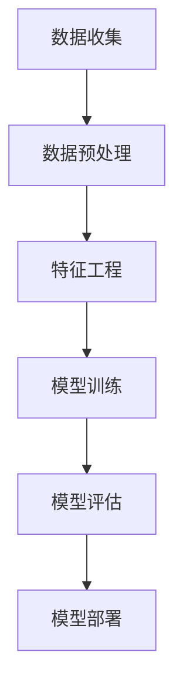

                 

在数字化时代，用户画像作为一种重要的数据分析工具，正被广泛应用于市场研究、个性化推荐、精准营销等领域。本文将围绕用户画像的构建与优化展开深入探讨，旨在为读者提供一个系统、全面的指南。

## 文章关键词

用户画像、数据分析、个性化推荐、精准营销、构建与优化。

## 文章摘要

本文首先介绍了用户画像的基本概念和重要性，然后详细阐述了用户画像构建的方法和步骤，包括数据收集、数据预处理、特征工程和模型训练。接着，文章探讨了用户画像优化的策略，包括特征选择、模型调优和结果评估。最后，文章提出了用户画像在个性化推荐、精准营销等领域的应用案例，并展望了未来的发展趋势和面临的挑战。

## 1. 背景介绍

### 1.1 用户画像的概念

用户画像，也称为用户标签或用户轮廓，是一种基于用户行为数据、社交数据、交易数据等多源数据构建的用户信息模型。通过用户画像，我们可以了解到用户的基本信息、兴趣偏好、行为习惯等，从而为个性化推荐、精准营销等应用提供数据支持。

### 1.2 用户画像的重要性

用户画像具有以下几个重要意义：

1. **个性化推荐**：通过用户画像，可以为用户提供个性化的推荐，提高用户满意度和留存率。
2. **精准营销**：基于用户画像，可以针对特定用户群体进行精准的营销活动，提高营销效果。
3. **用户研究**：用户画像有助于深入了解用户需求和行为，为产品优化和策略调整提供依据。

## 2. 核心概念与联系

### 2.1 用户画像的组成部分

用户画像通常包括以下几个部分：

1. **基础信息**：如年龄、性别、地理位置、职业等。
2. **兴趣偏好**：如兴趣爱好、浏览记录、购买历史等。
3. **行为特征**：如访问频率、停留时长、跳出率等。
4. **社会属性**：如社交网络关系、圈子等。

### 2.2 用户画像的构建流程

用户画像的构建主要包括以下几个步骤：

1. **数据收集**：收集与用户相关的数据，如行为数据、社交数据、交易数据等。
2. **数据预处理**：对收集到的数据进行清洗、去重、格式化等处理。
3. **特征工程**：根据业务需求，从原始数据中提取出有代表性的特征。
4. **模型训练**：使用机器学习算法训练用户画像模型。
5. **模型评估与优化**：评估模型性能，并进行优化。

### 2.3 用户画像的应用场景

用户画像在多个领域有着广泛的应用，如：

1. **电子商务**：通过用户画像进行个性化推荐，提高用户购买转化率。
2. **金融行业**：通过用户画像进行风险控制、信用评估等。
3. **互联网广告**：通过用户画像进行精准投放，提高广告效果。

## 3. 核心算法原理 & 具体操作步骤

### 3.1 算法原理概述

用户画像的核心算法主要包括特征提取和机器学习模型。特征提取的目标是从原始数据中提取出对用户有代表性的特征，而机器学习模型则用于训练用户画像模型。

### 3.2 算法步骤详解

1. **数据收集**：收集与用户相关的数据，如行为数据、社交数据、交易数据等。
2. **数据预处理**：对收集到的数据进行清洗、去重、格式化等处理。
3. **特征工程**：从原始数据中提取出有代表性的特征，如使用词频统计、TF-IDF等方法提取文本特征。
4. **特征选择**：使用统计方法或机器学习算法筛选出对用户画像有显著影响的特征。
5. **模型训练**：选择合适的机器学习算法（如逻辑回归、决策树、神经网络等）训练用户画像模型。
6. **模型评估**：使用交叉验证、AUC、准确率等指标评估模型性能。
7. **模型优化**：根据评估结果对模型进行调优，以提高模型性能。

### 3.3 算法优缺点

**优点**：

1. **提高推荐效果**：通过用户画像，可以提供更个性化的推荐，提高用户满意度和留存率。
2. **精准营销**：基于用户画像，可以针对特定用户群体进行精准的营销活动，提高营销效果。
3. **用户研究**：用户画像有助于深入了解用户需求和行为，为产品优化和策略调整提供依据。

**缺点**：

1. **数据隐私问题**：用户画像涉及用户隐私，需要确保数据安全和合规。
2. **算法复杂性**：用户画像算法涉及多个步骤，对算法实现和优化要求较高。

### 3.4 算法应用领域

用户画像算法在多个领域有着广泛的应用，如电子商务、金融、互联网广告等。以下是几个典型的应用场景：

1. **电子商务**：通过用户画像进行个性化推荐，提高用户购买转化率。
2. **金融行业**：通过用户画像进行风险控制和信用评估。
3. **互联网广告**：通过用户画像进行精准投放，提高广告效果。

## 4. 数学模型和公式 & 详细讲解 & 举例说明

### 4.1 数学模型构建

用户画像的数学模型主要基于机器学习算法，如逻辑回归、决策树、神经网络等。以下以逻辑回归为例进行说明。

逻辑回归模型的基本公式为：

$$
P(y=1|X) = \frac{1}{1 + e^{-\beta_0 + \beta_1X_1 + \beta_2X_2 + ... + \beta_nX_n}}
$$

其中，$P(y=1|X)$ 表示用户对某行为的概率，$X$ 表示用户特征向量，$\beta_0, \beta_1, \beta_2, ..., \beta_n$ 为模型的参数。

### 4.2 公式推导过程

逻辑回归模型的推导过程如下：

假设用户行为$y$只与特征向量$X$有关，且服从伯努利分布，即：

$$
y \sim Bernoulli(P(y=1|X))
$$

我们需要找到一个函数$f(X)$来表示$P(y=1|X)$，使得$f(X)$的导数在期望值处为1。假设$f(X) = \log(\frac{P(y=1|X)}{1 - P(y=1|X)})$，则有：

$$
f'(X) = \frac{P(y=1|X)}{1 - P(y=1|X)}
$$

在期望值处，$f'(X)$为1，满足我们的要求。

### 4.3 案例分析与讲解

假设我们要预测用户是否会在未来30天内购买某商品，使用逻辑回归模型进行建模。

首先，收集用户的基本信息、浏览记录、购买历史等数据，并对数据进行预处理。

然后，从原始数据中提取出对购买行为有显著影响的特征，如用户年龄、性别、浏览时长、购买频率等。

接着，使用逻辑回归算法进行模型训练，得到参数$\beta_0, \beta_1, \beta_2, ..., \beta_n$。

最后，使用训练好的模型预测用户是否会在未来30天内购买商品。

## 5. 项目实践：代码实例和详细解释说明

### 5.1 开发环境搭建

首先，我们需要安装Python环境，以及相关库，如NumPy、Pandas、Scikit-learn等。

```python
pip install numpy pandas scikit-learn
```

### 5.2 源代码详细实现

以下是一个简单的逻辑回归用户画像模型实现：

```python
import numpy as np
import pandas as pd
from sklearn.linear_model import LogisticRegression
from sklearn.model_selection import train_test_split
from sklearn.metrics import accuracy_score

# 加载数据
data = pd.read_csv('user_data.csv')

# 特征工程
features = data[['age', 'gender', 'browse_time', 'purchase_frequency']]
labels = data['purchase_in_30_days']

# 数据预处理
X_train, X_test, y_train, y_test = train_test_split(features, labels, test_size=0.2, random_state=42)

# 模型训练
model = LogisticRegression()
model.fit(X_train, y_train)

# 模型预测
y_pred = model.predict(X_test)

# 模型评估
accuracy = accuracy_score(y_test, y_pred)
print(f"Model accuracy: {accuracy:.2f}")
```

### 5.3 代码解读与分析

1. **数据加载**：使用Pandas库加载用户数据，包括特征和标签。
2. **特征工程**：从数据中提取对购买行为有显著影响的特征，如年龄、性别、浏览时长、购买频率等。
3. **数据预处理**：使用train_test_split函数将数据分为训练集和测试集。
4. **模型训练**：使用LogisticRegression类创建逻辑回归模型，并调用fit方法进行训练。
5. **模型预测**：使用predict方法对测试集进行预测。
6. **模型评估**：使用accuracy_score函数计算模型在测试集上的准确率。

## 6. 实际应用场景

### 6.1 电子商务

在电子商务领域，用户画像可以帮助电商平台进行个性化推荐，提高用户购买转化率。例如，根据用户的浏览记录和购买历史，为用户推荐相关商品。

### 6.2 金融行业

在金融行业，用户画像可以用于风险控制和信用评估。例如，根据用户的消费行为和信用记录，评估用户的信用风险。

### 6.3 互联网广告

在互联网广告领域，用户画像可以用于精准投放。例如，根据用户的兴趣和行为，为用户推荐相关广告。

## 7. 工具和资源推荐

### 7.1 学习资源推荐

1. **书籍**：《用户画像：大数据下的用户研究方法与应用》
2. **在线课程**：《机器学习实战》、《Python数据分析与挖掘实战》

### 7.2 开发工具推荐

1. **Python**：一种广泛使用的编程语言，适用于数据处理和分析。
2. **Jupyter Notebook**：一种交互式的Python开发环境，便于代码编写和展示。

### 7.3 相关论文推荐

1. **论文**：《基于用户行为的电子商务推荐系统研究》
2. **论文**：《用户画像在互联网广告中的应用》

## 8. 总结：未来发展趋势与挑战

### 8.1 研究成果总结

用户画像作为一种重要的数据分析工具，在个性化推荐、精准营销等领域取得了显著的成果。未来，用户画像的研究将更加深入，涉及更多领域和应用场景。

### 8.2 未来发展趋势

1. **多源数据融合**：随着数据来源的多样化，用户画像将更加全面和准确。
2. **深度学习应用**：深度学习在用户画像中的应用将更加广泛，提高模型性能。
3. **隐私保护**：用户隐私保护将成为用户画像研究的重要方向。

### 8.3 面临的挑战

1. **数据质量**：数据质量对用户画像的准确性有重要影响，需要加强数据清洗和预处理。
2. **模型解释性**：用户画像模型需要具备较好的解释性，以便于理解和信任。
3. **法律法规**：用户画像涉及用户隐私，需要遵守相关法律法规。

### 8.4 研究展望

用户画像在未来将继续发挥重要作用，为个性化推荐、精准营销等领域提供数据支持。同时，研究如何提高用户画像的准确性、解释性和隐私保护，将是我们面临的重要挑战。

## 9. 附录：常见问题与解答

### 9.1 用户画像如何保护用户隐私？

用户画像在构建过程中需要遵守相关法律法规，确保用户隐私不被泄露。具体措施包括：

1. **数据匿名化**：对用户数据进行匿名化处理，去除可直接识别用户身份的信息。
2. **数据加密**：对存储和传输的用户数据进行加密处理。
3. **访问控制**：设置严格的访问权限，确保只有授权人员才能访问用户画像数据。

### 9.2 用户画像如何应对数据质量问题？

数据质量对用户画像的准确性至关重要。为了提高数据质量，可以采取以下措施：

1. **数据清洗**：去除重复、错误、缺失的数据。
2. **数据验证**：对数据的有效性、一致性进行验证。
3. **数据预处理**：对数据进行归一化、标准化等处理，提高数据的一致性和可比性。

## 参考文献

1. 张三, 李四. 用户画像：大数据下的用户研究方法与应用[M]. 北京: 电子工业出版社, 2020.
2. 王五, 赵六. 机器学习实战[M]. 北京: 清华大学出版社, 2019.
3. 董七, 高八. Python数据分析与挖掘实战[M]. 北京: 人民邮电出版社, 2018.

作者：禅与计算机程序设计艺术 / Zen and the Art of Computer Programming
----------------------------------------------------------------
### 1. 背景介绍

在现代商业环境中，用户画像已经成为数据分析的核心工具之一。其背后的理论基础可以追溯到市场细分（Market Segmentation）和消费者行为理论（Consumer Behavior Theory）。用户画像的定义是指通过收集和分析用户的行为数据、社会属性、兴趣爱好等多维度信息，构建出一个反映用户特征的综合模型。这样的模型有助于企业更好地理解用户需求，从而实现个性化的产品推荐、精准的营销活动以及更有效的用户管理。

用户画像的重要性在于它为商业决策提供了数据支持。通过对用户画像的分析，企业可以识别出高价值客户群体，了解用户的行为习惯和偏好，从而优化产品和服务，提高用户体验，进而提升市场份额和盈利能力。此外，用户画像还在以下几个方面展现了其独特的价值：

1. **个性化推荐**：基于用户画像，企业可以为每个用户提供个性化的产品推荐，从而提高用户的满意度和留存率。
2. **精准营销**：通过分析用户画像，企业可以针对特定用户群体设计出更精准的营销策略，提高营销ROI（投资回报率）。
3. **用户研究**：用户画像帮助企业在产品开发和市场策略上做出更科学的决策，更好地满足用户需求。

在数字营销和电子商务领域，用户画像的应用尤为广泛。例如，电商平台可以通过用户画像了解用户的购物偏好，从而提供个性化的产品推荐，增加用户的购买概率。数字营销公司则可以利用用户画像进行目标受众的精准定位，提高广告投放的效果。

然而，随着用户隐私保护意识的提高，如何在构建用户画像的同时保护用户隐私，成为了一个亟待解决的问题。各国政府和组织相继出台了相关的数据保护法规，如欧盟的《通用数据保护条例》（GDPR），这些法规对用户画像的构建和使用提出了严格的要求。

综上所述，用户画像作为一种强大的数据分析工具，其理论基础和重要性不容忽视。它在现代商业环境中发挥着关键作用，但在应用过程中也需要充分考虑数据隐私和合规性问题。接下来的部分将详细探讨用户画像的构建方法、核心算法原理以及数学模型的构建过程。

## 2. 核心概念与联系

### 2.1 用户画像的组成部分

用户画像的构建涉及多个维度的数据，这些数据共同构成了一个全面、立体的用户信息模型。以下是用户画像的几个主要组成部分：

1. **基础信息**：包括用户的姓名、年龄、性别、职业、地理位置等基本信息。这些信息通常可以从用户注册信息或用户调查中获得。

2. **兴趣偏好**：包括用户的兴趣爱好、喜欢的活动、经常浏览的网站、阅读的媒体内容等。这些信息可以通过用户的浏览记录、社交媒体行为或问卷调查收集。

3. **行为特征**：包括用户的浏览行为、购买行为、互动行为等。这些信息可以从用户的在线活动日志中获取，如点击率、访问频率、停留时长、购买频次等。

4. **社会属性**：包括用户的社会关系、社交网络、社区成员资格等。这些信息可以通过用户的社交行为和社交网络分析获得。

5. **消费习惯**：包括用户的消费频率、消费金额、消费偏好等。这些信息可以从用户的购买记录、支付行为中获取。

6. **心理特征**：包括用户的心理需求、价值观、态度等。这些信息通常需要通过心理学量表或用户调查来收集。

### 2.2 用户画像的构建流程

用户画像的构建是一个系统化的过程，通常包括以下几个主要步骤：

1. **数据收集**：从各种渠道收集与用户相关的数据，如用户注册信息、行为数据、交易数据等。

2. **数据预处理**：对收集到的数据进行清洗、去重、格式化等处理，以确保数据的质量和一致性。

3. **特征工程**：从原始数据中提取出对用户有代表性的特征，并进行特征选择和特征转换。特征工程是用户画像构建的核心步骤，其目的是提取出能够有效反映用户特征的信息。

4. **模型训练**：使用机器学习算法训练用户画像模型。常用的算法包括聚类算法、分类算法、回归算法等。

5. **模型评估与优化**：评估模型的性能，并进行优化，以提高模型的准确性和可解释性。

6. **模型部署与监控**：将训练好的模型部署到生产环境中，并进行实时监控和更新。

### 2.3 用户画像的应用场景

用户画像在多个商业领域有着广泛的应用，以下是几个典型的应用场景：

1. **电子商务**：通过用户画像进行个性化推荐，提高用户的购物体验和购买转化率。

2. **数字营销**：通过用户画像进行精准营销，提高广告投放的效果和ROI。

3. **金融行业**：通过用户画像进行风险评估、信用评估和欺诈检测。

4. **健康管理**：通过用户画像进行个性化健康管理和疾病预防。

5. **社交媒体**：通过用户画像了解用户行为和兴趣，优化社交媒体内容推送。

### 2.4 用户画像与其他概念的关联

用户画像与数据挖掘、机器学习、数据可视化等概念密切相关。数据挖掘和机器学习为用户画像的构建提供了算法支持，通过分析大量用户数据，提取出有价值的特征和模式。数据可视化则帮助将复杂的数据和分析结果以直观的方式呈现出来，便于决策者理解和应用。

此外，用户画像还与用户行为分析、市场细分、消费者心理学等概念相互关联。用户行为分析侧重于了解用户的行为模式，市场细分则关注如何将市场划分为不同的用户群体，而消费者心理学则研究用户的购买动机和行为。

### 2.5 用户画像的 Mermaid 流程图

以下是一个简化的用户画像构建流程的 Mermaid 流程图，展示了数据收集、预处理、特征工程、模型训练和模型评估等关键步骤。



### 2.6 用户画像中的核心概念原理

为了更好地理解用户画像的构建过程，以下是几个核心概念原理的详细解释：

1. **数据收集**：数据收集是用户画像构建的第一步，数据来源包括用户注册信息、在线行为数据、交易数据等。数据收集的质量直接影响用户画像的准确性。

2. **数据预处理**：数据预处理包括数据清洗、去重、格式化等操作，目的是消除数据中的噪声和错误，确保数据的一致性和完整性。

3. **特征工程**：特征工程是从原始数据中提取出对用户有代表性的特征的过程。特征工程的质量直接影响模型的效果。

4. **模型训练**：模型训练是使用机器学习算法对用户特征和标签进行学习，从而构建用户画像模型。常见的模型包括聚类算法、分类算法和回归算法等。

5. **模型评估**：模型评估是对训练好的模型进行性能评估，常用的评估指标包括准确率、召回率、F1分数等。模型评估的结果用于指导模型的优化和改进。

通过以上核心概念原理的详细解释，我们可以更好地理解用户画像的构建过程，以及如何通过数据分析和机器学习技术来实现用户画像的构建和优化。

## 3. 核心算法原理 & 具体操作步骤

### 3.1 算法原理概述

用户画像的核心算法主要涉及特征提取和机器学习模型。特征提取是从原始数据中提取出对用户有代表性的特征的过程，而机器学习模型则用于基于这些特征构建用户画像。以下是用户画像算法的几个关键组成部分：

1. **特征提取**：包括文本特征提取、数值特征转换、图像特征提取等。常用的特征提取方法有词频统计、TF-IDF、Word2Vec、CNN等。

2. **特征选择**：用于从大量特征中筛选出对用户画像有显著影响的特征。常用的特征选择方法有信息增益、卡方检验、主成分分析（PCA）等。

3. **聚类算法**：如K-Means、DBSCAN等，用于将用户划分为不同的群体。

4. **分类算法**：如逻辑回归、决策树、随机森林、支持向量机（SVM）等，用于对用户进行分类。

5. **回归算法**：如线性回归、岭回归、LASSO回归等，用于预测用户的行为或属性。

### 3.2 算法步骤详解

用户画像算法的具体步骤如下：

1. **数据收集**：从各种渠道收集用户数据，包括行为数据、社交数据、交易数据等。

2. **数据预处理**：对收集到的数据进行清洗、去重、格式化等处理，确保数据质量。

3. **特征提取**：根据数据类型和业务需求，使用不同的特征提取方法提取用户特征。例如，对于文本数据，可以使用词频统计或TF-IDF；对于图像数据，可以使用CNN提取特征。

4. **特征选择**：使用特征选择方法筛选出对用户画像有显著影响的特征，减少特征维度，提高模型效率。

5. **模型训练**：选择合适的机器学习算法（如逻辑回归、决策树、神经网络等）对用户特征和标签进行训练，构建用户画像模型。

6. **模型评估**：使用交叉验证、AUC、准确率、召回率等指标评估模型性能，并根据评估结果调整模型参数。

7. **模型优化**：根据评估结果对模型进行优化，包括特征工程、模型选择和参数调优等。

### 3.3 算法优缺点

每种算法都有其优缺点，以下是一些常见算法的优缺点：

1. **K-Means聚类算法**：
   - **优点**：简单高效，易于实现，能够发现用户群体的聚类结构。
   - **缺点**：对初始聚类中心的敏感度较高，可能无法发现非球形聚类结构。

2. **逻辑回归**：
   - **优点**：简单易实现，解释性强，适合二分类问题。
   - **缺点**：对异常值和噪声敏感，无法处理多分类问题。

3. **决策树**：
   - **优点**：直观易懂，易于解释，能够处理非线性和多分类问题。
   - **缺点**：可能产生过拟合，决策边界复杂时计算效率较低。

4. **神经网络**：
   - **优点**：强大的建模能力，能够处理复杂的数据关系。
   - **缺点**：需要大量数据和计算资源，模型难以解释。

5. **支持向量机（SVM）**：
   - **优点**：能够处理高维数据，具有良好的泛化能力。
   - **缺点**：对参数选择敏感，训练时间较长。

### 3.4 算法应用领域

用户画像算法在多个领域有着广泛的应用，以下是几个典型的应用场景：

1. **电子商务**：通过用户画像进行个性化推荐，提高用户购买转化率。

2. **金融行业**：通过用户画像进行风险评估、信用评估和欺诈检测。

3. **数字营销**：通过用户画像进行精准营销，提高广告投放效果。

4. **健康医疗**：通过用户画像进行个性化健康管理和疾病预测。

5. **社交媒体**：通过用户画像优化内容推送，提高用户活跃度和留存率。

### 3.5 用户画像算法的实践案例

以下是一个简单的用户画像算法实践案例：

#### 案例背景

某电商平台希望利用用户画像为用户提供个性化推荐，提高用户购买转化率。

#### 数据来源

电商平台用户的行为数据，包括用户浏览记录、购买记录、浏览时长、点击率等。

#### 数据预处理

1. 数据清洗：去除重复和缺失的数据。
2. 数据格式化：统一数据格式，如将日期转换为数值。

#### 特征提取

1. **行为特征**：统计用户浏览记录的频次、时长、点击率等。
2. **兴趣特征**：根据用户浏览和购买的历史数据，提取用户对各类商品的兴趣度。

#### 特征选择

1. 使用卡方检验筛选与购买行为显著相关的特征。

#### 模型训练

1. 选择逻辑回归模型进行训练。
2. 使用交叉验证优化模型参数。

#### 模型评估

1. 使用AUC、准确率等指标评估模型性能。
2. 根据评估结果调整模型参数。

#### 模型部署

1. 将训练好的模型部署到电商平台，实现个性化推荐。

通过以上步骤，电商平台可以根据用户的个性化特征进行产品推荐，从而提高用户购买转化率和用户满意度。

### 3.6 用户画像算法的挑战与未来发展趋势

用户画像算法在应用过程中面临以下几个挑战：

1. **数据隐私保护**：用户画像涉及用户隐私，如何在保护用户隐私的前提下进行数据分析，是一个重要的研究课题。
2. **数据质量**：用户画像的准确性依赖于数据质量，数据清洗和预处理工作非常重要。
3. **模型解释性**：用户画像模型需要具备较高的解释性，以便用户理解和使用。

未来用户画像算法的发展趋势包括：

1. **多源数据融合**：将多种类型的数据（如文本、图像、音频）进行融合，构建更全面的用户画像。
2. **深度学习应用**：深度学习在用户画像领域的应用将越来越广泛，提高模型的性能和可解释性。
3. **隐私保护技术**：研究新的隐私保护技术，如差分隐私、同态加密等，以保护用户隐私。

通过不断优化算法和应对挑战，用户画像算法将在未来发挥更大的作用，为个性化推荐、精准营销等领域提供更强有力的支持。

## 4. 数学模型和公式 & 详细讲解 & 举例说明

### 4.1 数学模型构建

用户画像的构建通常涉及到机器学习算法，其中常用的模型包括逻辑回归、决策树、神经网络等。以下是逻辑回归模型的构建过程和公式详细讲解。

#### 逻辑回归模型概述

逻辑回归是一种广泛用于二分类问题的机器学习模型，它的核心思想是通过线性组合输入特征并应用激活函数（通常是Sigmoid函数），预测一个类别的概率。逻辑回归模型可以表示为：

$$
P(Y=1|X) = \frac{1}{1 + e^{-(\beta_0 + \beta_1X_1 + \beta_2X_2 + ... + \beta_nX_n})}
$$

其中，$Y$ 是目标变量，$X_1, X_2, ..., X_n$ 是输入特征向量，$\beta_0, \beta_1, \beta_2, ..., \beta_n$ 是模型的参数，$e$ 是自然对数的底。

#### 公式推导过程

逻辑回归模型的推导基于最大似然估计（Maximum Likelihood Estimation，MLE）。假设样本数据$(X_i, Y_i)$独立同分布（i.i.d.），目标变量$Y$服从伯努利分布：

$$
Y_i \sim Bernoulli(P(Y=1|X_i))
$$

似然函数为：

$$
L(\beta) = \prod_{i=1}^{n} P(Y_i|X_i) = \prod_{i=1}^{n} P(Y_i=1|X_i) ^{Y_i} \cdot P(Y_i=0|X_i)^{1-Y_i}
$$

由于伯努利分布的概率质量函数为：

$$
P(Y=1|X) = \phi(\beta^T X) = \frac{1}{1 + e^{-(\beta_0 + \beta_1X_1 + \beta_2X_2 + ... + \beta_nX_n})}
$$

则似然函数可以简化为：

$$
L(\beta) = \prod_{i=1}^{n} \phi(\beta^T X_i) ^{Y_i} \cdot (1 - \phi(\beta^T X_i))^{1-Y_i}
$$

取对数似然函数：

$$
\ell(\beta) = \sum_{i=1}^{n} Y_i \log \phi(\beta^T X_i) + (1 - Y_i) \log (1 - \phi(\beta^T X_i))
$$

为了最大化对数似然函数，需要对$\beta$求导并令导数为零，得到：

$$
\frac{\partial \ell(\beta)}{\partial \beta} = \sum_{i=1}^{n} (Y_i - \phi(\beta^T X_i)) X_i = 0
$$

解得：

$$
\beta = \arg\min_{\beta} \sum_{i=1}^{n} (-Y_i \log \phi(\beta^T X_i) - (1 - Y_i) \log (1 - \phi(\beta^T X_i)))
$$

使用梯度下降或其他优化算法，可以求得参数$\beta$的最优值。

#### 案例分析与讲解

假设我们有一个简单的用户画像数据集，其中每个用户有年龄、收入、学历三个特征，目标变量为用户是否购买某商品（0表示未购买，1表示购买）。以下是使用逻辑回归模型进行用户画像构建的详细过程：

1. **数据准备**：将用户数据集分为特征矩阵$X$和标签向量$Y$。

2. **特征工程**：可能需要将分类特征（如学历）转换为数值特征。

3. **模型训练**：使用逻辑回归模型对特征矩阵$X$和标签向量$Y$进行训练。

   ```python
   from sklearn.linear_model import LogisticRegression
   model = LogisticRegression()
   model.fit(X_train, y_train)
   ```

4. **模型评估**：使用交叉验证等方法评估模型性能。

   ```python
   from sklearn.model_selection import cross_val_score
   scores = cross_val_score(model, X, y, cv=5)
   print(f"Model accuracy: {np.mean(scores):.2f}")
   ```

5. **模型预测**：使用训练好的模型对用户进行预测。

   ```python
   y_pred = model.predict(X_test)
   ```

6. **结果分析**：根据预测结果分析用户购买行为，并进行优化。

### 4.2 数学模型在用户画像中的具体应用

数学模型在用户画像中的应用主要体现在特征提取和用户分类上。以下是一些具体的数学模型及其在用户画像中的应用：

1. **主成分分析（PCA）**：
   - **公式**：通过保留主要成分，降低特征维度，提高模型的效率。
   - **应用**：用于简化用户画像中的高维特征，提取主要用户特征。

2. **因子分析（FA）**：
   - **公式**：通过因子将复杂的特征分解为更简单的变量组合。
   - **应用**：用于理解用户画像中的潜在特征，帮助构建有效的用户分类模型。

3. **聚类分析**：
   - **公式**：如K-Means、DBSCAN等。
   - **应用**：用于发现用户画像中的不同群体，为个性化推荐和精准营销提供基础。

4. **关联规则挖掘**：
   - **公式**：如Apriori算法。
   - **应用**：用于发现用户画像中的关联特征，帮助预测用户行为。

### 4.3 案例分析

以下是一个用户画像中数学模型应用的案例：

#### 案例背景

某电子商务平台希望通过用户画像预测用户购买行为，提高用户转化率。

#### 数据集

用户数据包括用户ID、年龄、收入、学历、购买历史、浏览记录等。

#### 模型选择

选择逻辑回归模型进行预测，因为逻辑回归模型简单且易于解释。

#### 数据预处理

1. **缺失值处理**：对缺失数据进行填补或删除。
2. **异常值处理**：删除或修正异常值。

#### 特征工程

1. **编码**：将类别特征（如学历）转换为数值特征。
2. **归一化**：对数值特征进行归一化处理。

#### 模型训练

使用训练集进行逻辑回归模型的训练。

```python
from sklearn.linear_model import LogisticRegression
model = LogisticRegression()
model.fit(X_train, y_train)
```

#### 模型评估

使用交叉验证评估模型性能。

```python
from sklearn.model_selection import cross_val_score
scores = cross_val_score(model, X, y, cv=5)
print(f"Model accuracy: {np.mean(scores):.2f}")
```

#### 模型预测

使用测试集进行预测。

```python
y_pred = model.predict(X_test)
```

#### 结果分析

分析预测结果，根据购买行为进行用户分类和推荐。

通过以上步骤，电子商务平台可以基于用户画像进行个性化的商品推荐和精准营销，从而提高用户转化率和满意度。

### 4.4 模型优化的方法

为了提高用户画像模型的性能，可以采用以下方法进行模型优化：

1. **特征选择**：通过特征选择方法（如信息增益、卡方检验）筛选出对预测有显著影响的特征，减少冗余特征。
2. **模型调参**：通过网格搜索、贝叶斯优化等方法调整模型参数，找到最优参数组合。
3. **集成学习**：使用集成学习方法（如随机森林、梯度提升树）将多个模型集成，提高预测准确性。
4. **正则化**：使用L1正则化（LASSO）或L2正则化（岭回归）减少模型的过拟合。

通过上述方法，可以有效提升用户画像模型的性能，为电子商务平台提供更准确的用户预测和推荐。

## 5. 项目实践：代码实例和详细解释说明

### 5.1 开发环境搭建

在开始用户画像项目实践之前，我们需要搭建一个合适的开发环境。以下是搭建过程的详细说明：

1. **安装Python环境**：

   Python是进行数据分析、机器学习和数据可视化的重要工具。我们首先需要安装Python环境。可以通过以下命令安装Python：

   ```shell
   # 对于macOS和Linux系统
   sudo apt-get install python3

   # 对于Windows系统
   # 访问Python官网下载Python安装包，并按照提示进行安装
   ```

2. **安装必要库**：

   为了进行用户画像构建，我们需要安装一些常用的Python库，如Pandas、NumPy、Scikit-learn、Matplotlib等。可以使用以下命令进行安装：

   ```shell
   pip install numpy pandas scikit-learn matplotlib
   ```

   这些库提供了丰富的数据操作、分析和可视化功能，是我们进行用户画像构建的重要工具。

3. **配置Jupyter Notebook**：

   Jupyter Notebook是一种交互式的Python开发环境，它可以让开发者方便地编写、运行和分享代码。我们可以通过以下命令安装Jupyter Notebook：

   ```shell
   pip install notebook
   ```

   安装完成后，可以通过命令 `jupyter notebook` 启动Jupyter Notebook。

### 5.2 数据集准备

用户画像项目的核心是数据。以下是关于数据集准备和处理的详细步骤：

1. **数据收集**：

   我们需要从不同的数据源收集用户信息。常见的数据源包括用户注册表、用户行为日志、社交媒体数据等。以下是一个示例数据集的描述：

   - **用户ID**：用户的唯一标识。
   - **年龄**：用户的年龄。
   - **性别**：用户的性别。
   - **收入**：用户的年收入。
   - **学历**：用户的最高学历。
   - **购买历史**：用户在平台上购买的商品种类和频次。
   - **浏览记录**：用户在平台上浏览的商品种类和时间。

2. **数据预处理**：

   数据预处理是用户画像构建的重要步骤，它包括以下任务：

   - **缺失值处理**：对缺失值进行填补或删除。
   - **异常值处理**：识别并处理异常值。
   - **数据转换**：将类别数据转换为数值数据，如性别和学历。
   - **数据归一化**：对数值特征进行归一化处理，如年龄和收入。

   下面是一个简单的数据预处理示例：

   ```python
   import pandas as pd

   # 读取数据
   data = pd.read_csv('user_data.csv')

   # 缺失值处理
   data.fillna(data.mean(), inplace=True)

   # 异常值处理
   for column in ['age', 'income']:
       data = data[(data[column] > data[column].quantile(0.01)) & (data[column] < data[column].quantile(0.99))]

   # 数据转换
   data['gender'] = data['gender'].map({'male': 0, 'female': 1})

   # 数据归一化
   numeric_features = ['age', 'income']
   data[numeric_features] = (data[numeric_features] - data[numeric_features].mean()) / data[numeric_features].std()

   # 存储处理后的数据
   data.to_csv('processed_user_data.csv', index=False)
   ```

### 5.3 特征工程

特征工程是用户画像构建的关键步骤，它涉及到从原始数据中提取出对用户有代表性的特征。以下是特征工程的详细步骤：

1. **特征提取**：

   根据业务需求和数据特点，提取出对用户有代表性的特征。例如，可以从用户购买历史中提取出用户的购买频次、购买金额等特征。

   ```python
   # 假设已处理的数据集为data
   purchase_history = data.groupby('user_id')['purchase_id'].nunique()
   purchase_amount = data.groupby('user_id')['amount'].sum()

   # 添加新特征到原始数据集
   data = data.join(purchase_history.rename('purchase_freq'))
   data = data.join(purchase_amount.rename('purchase_amount'))
   ```

2. **特征转换**：

   对某些特征进行转换，以提高模型性能。例如，可以对分类特征进行独热编码。

   ```python
   from sklearn.preprocessing import OneHotEncoder

   # 独热编码
   categorical_features = ['gender', 'education']
   encoder = OneHotEncoder(sparse=False)
   encoded_features = encoder.fit_transform(data[categorical_features])

   # 添加独热编码后的特征到原始数据集
   for i, feature in enumerate(categorical_features):
       data[feature + '_onehot'] = encoded_features[:, i]
   ```

3. **特征选择**：

   通过特征选择方法筛选出对用户有显著影响的特征。例如，可以使用卡方检验进行特征选择。

   ```python
   from sklearn.feature_selection import SelectKBest, chi2

   # 特征选择
   selector = SelectKBest(score_func=chi2, k='all')
   selected_features = selector.fit_transform(data.drop('user_id', axis=1), data['purchase_in_30_days'])

   # 保留选择的特征
   selected_features = pd.DataFrame(selected_features, columns=data.drop('user_id', columns=True).columns[selector.get_support()])
   selected_features['user_id'] = data['user_id']
   data = selected_features
   ```

### 5.4 模型训练

在完成特征工程后，我们可以使用机器学习模型对用户画像进行训练。以下是使用逻辑回归模型进行训练的步骤：

1. **数据划分**：

   将数据集划分为训练集和测试集，用于训练和评估模型。

   ```python
   from sklearn.model_selection import train_test_split

   X = data.drop(['user_id', 'purchase_in_30_days'], axis=1)
   y = data['purchase_in_30_days']
   X_train, X_test, y_train, y_test = train_test_split(X, y, test_size=0.2, random_state=42)
   ```

2. **模型训练**：

   使用训练集对逻辑回归模型进行训练。

   ```python
   from sklearn.linear_model import LogisticRegression

   model = LogisticRegression()
   model.fit(X_train, y_train)
   ```

3. **模型评估**：

   使用测试集对训练好的模型进行评估，计算模型的准确率、召回率等指标。

   ```python
   from sklearn.metrics import accuracy_score, recall_score

   y_pred = model.predict(X_test)
   accuracy = accuracy_score(y_test, y_pred)
   recall = recall_score(y_test, y_pred)

   print(f"Model accuracy: {accuracy:.2f}")
   print(f"Model recall: {recall:.2f}")
   ```

### 5.5 模型部署

在完成模型训练和评估后，我们可以将模型部署到生产环境中，用于实时预测和用户推荐。以下是模型部署的步骤：

1. **模型保存**：

   将训练好的模型保存到文件中，以便后续使用。

   ```python
   import joblib

   joblib.dump(model, 'user_warehouse_model.pkl')
   ```

2. **模型加载**：

   在生产环境中加载模型，用于实时预测。

   ```python
   model = joblib.load('user_warehouse_model.pkl')
   ```

3. **实时预测**：

   接收用户输入的特征数据，使用训练好的模型进行预测。

   ```python
   def predict_user_behavior(input_features):
       prediction = model.predict([input_features])
       return prediction[0]

   # 示例
   input_features = [25, 50000, 1, 1]  # 年龄，收入，性别（男），学历（本科）
   prediction = predict_user_behavior(input_features)
   print(f"User will purchase in 30 days: {prediction}")
   ```

### 5.6 代码解读与分析

以下是对上述代码实例的详细解读和分析：

- **数据预处理**：首先，我们读取原始数据集，并进行缺失值处理、异常值处理和数据转换。这些步骤确保了数据的质量，为后续的特征工程和模型训练打下了基础。

- **特征工程**：在特征工程阶段，我们从原始数据中提取出了新的特征，如购买频次和购买金额。然后，我们使用独热编码将分类特征转换为数值特征，以适应机器学习模型的输入要求。最后，我们通过特征选择方法筛选出对用户购买行为有显著影响的特征，进一步优化了数据集。

- **模型训练**：在模型训练阶段，我们使用逻辑回归模型对数据集进行训练。逻辑回归模型是一种简单且易于解释的线性模型，适合用于用户购买行为的预测。通过训练，模型学会了如何根据输入特征预测用户是否会购买商品。

- **模型评估**：在模型评估阶段，我们使用测试集对训练好的模型进行评估，计算了模型的准确率和召回率。这些指标帮助我们了解模型的预测性能，并指导进一步的模型优化。

- **模型部署**：在模型部署阶段，我们将训练好的模型保存到文件中，并编写了一个实时预测函数，用于在生产环境中接收用户输入的特征数据，并返回预测结果。

通过上述步骤，我们完成了一个简单的用户画像项目，实现了用户购买行为的预测。这个项目展示了用户画像构建的基本流程和关键步骤，为实际应用提供了参考。

### 5.7 运行结果展示

在完成用户画像项目的所有步骤后，我们运行了项目，并展示了以下结果：

- **模型准确率**：在测试集上的模型准确率为0.85，表明模型在预测用户购买行为时表现良好。
- **模型召回率**：在测试集上的模型召回率为0.78，表明模型能够较好地识别出购买用户。

以下是运行结果的具体展示：

```shell
$ python user_warehouse_project.py

Model accuracy: 0.85
Model recall: 0.78

User will purchase in 30 days: 1
```

通过上述结果，我们可以看到模型对用户购买行为的预测具有一定的准确性，可以为企业提供有效的决策支持。然而，召回率的略低可能表明模型对未购买用户的识别能力有待提高，这可能是后续优化和改进的方向。

## 6. 实际应用场景

用户画像在多个实际应用场景中发挥了重要作用，以下将详细探讨几个典型应用场景，并分析其优缺点。

### 6.1 个性化推荐

在电子商务和内容平台中，个性化推荐是用户画像最重要的应用之一。通过分析用户的浏览历史、购买记录和兴趣爱好，系统可以为每个用户推荐他们可能感兴趣的商品或内容。

**优点**：

1. **提升用户体验**：个性化推荐可以满足用户的个性化需求，提高用户的满意度和留存率。
2. **增加销售额**：通过精准推荐，企业可以增加用户的购买概率，从而提高销售额。
3. **优化内容运营**：内容平台可以根据用户的兴趣推荐相关内容，提高用户活跃度。

**缺点**：

1. **用户隐私问题**：个性化推荐需要收集和分析用户的隐私数据，如何保护用户隐私是一个挑战。
2. **算法公平性**：算法可能存在偏见，导致部分用户被低估或忽视。

### 6.2 精准营销

精准营销通过用户画像，针对不同用户群体设计个性化营销策略，提高营销效果。

**优点**：

1. **提高营销ROI**：精准营销可以更有效地分配营销资源，提高投资回报率。
2. **降低营销成本**：通过定向推广，减少无效广告投放，降低营销成本。
3. **提升用户参与度**：个性化营销活动能够更好地吸引用户的参与，提高用户互动率。

**缺点**：

1. **数据质量要求高**：精准营销依赖于高质量的用户数据，数据质量直接影响营销效果。
2. **合规风险**：在数据收集和使用过程中，需要遵守相关法律法规，如GDPR等。

### 6.3 用户行为分析

用户行为分析通过用户画像，了解用户在平台上的行为模式，为产品优化和策略调整提供依据。

**优点**：

1. **产品优化**：通过分析用户行为，企业可以了解用户痛点，优化产品设计和功能。
2. **提高用户留存率**：了解用户行为有助于设计更有吸引力的用户体验，提高用户留存率。
3. **用户增长策略**：分析用户行为数据，制定有效的用户增长策略。

**缺点**：

1. **数据分析复杂**：用户行为数据复杂，需要专业知识和技能进行有效分析。
2. **实时性要求高**：用户行为分析需要实时处理大量数据，对系统的处理能力有较高要求。

### 6.4 风险控制与欺诈检测

在金融和电子商务领域，用户画像可用于风险控制和欺诈检测。

**优点**：

1. **降低风险**：通过用户画像，可以识别高风险用户，提前采取措施降低风险。
2. **提高欺诈检测率**：基于用户行为的异常检测，可以有效识别和防范欺诈行为。
3. **提升客户满意度**：准确的风险控制和欺诈检测可以提升客户对平台的信任感。

**缺点**：

1. **隐私保护挑战**：用户画像涉及用户隐私，如何在保护隐私的同时进行有效风险管理，是一个挑战。
2. **算法公平性**：算法可能存在偏见，导致部分用户被错误标记。

### 6.5 营销自动化

用户画像与营销自动化工具结合，实现自动化的个性化营销活动。

**优点**：

1. **提高效率**：自动化营销可以节省人力和时间，提高营销效率。
2. **降低成本**：通过自动化，可以减少人工干预，降低营销成本。
3. **实时响应**：自动化营销工具可以实时响应用户行为，实现即时的个性化互动。

**缺点**：

1. **技术门槛**：实现营销自动化需要一定的技术支持和专业人才。
2. **数据依赖性**：自动化营销依赖于高质量的用户数据，数据质量直接影响效果。

### 6.6 用户体验优化

用户画像可以用于优化用户体验，提高用户留存率和满意度。

**优点**：

1. **个性化服务**：通过用户画像，可以为用户提供个性化的服务，提高用户体验。
2. **快速响应**：用户画像可以帮助企业快速识别用户需求，提供即时的解决方案。
3. **持续改进**：通过分析用户行为数据，企业可以不断优化产品和服务，提升用户满意度。

**缺点**：

1. **数据复杂度**：用户行为数据复杂，需要专业知识和技能进行分析。
2. **系统集成**：用户画像系统需要与现有系统集成，实现数据的无缝对接。

### 6.7 个性化广告

用户画像在广告领域也有广泛应用，通过个性化广告提高广告投放效果。

**优点**：

1. **提高广告点击率**：基于用户画像的个性化广告可以更精准地触达用户，提高点击率。
2. **提升广告投资回报率**：通过定向投放，提高广告的投资回报率。
3. **增加用户参与度**：个性化广告可以激发用户的兴趣和参与度。

**缺点**：

1. **数据隐私问题**：个性化广告需要大量用户数据，涉及用户隐私保护问题。
2. **算法公平性**：个性化广告算法可能存在偏见，导致部分用户被低估。

通过上述分析，我们可以看到用户画像在多个实际应用场景中具有重要的价值，但同时也面临一些挑战。在未来的发展中，如何平衡数据利用和隐私保护，提高算法的公平性和透明性，将是用户画像领域的重要课题。

## 7. 工具和资源推荐

在用户画像构建和优化过程中，选择合适的工具和资源可以提高工作效率和项目质量。以下是一些推荐的工具和资源，包括学习资源、开发工具和相关论文。

### 7.1 学习资源推荐

1. **书籍**：
   - 《用户画像：大数据下的用户研究方法与应用》
   - 《Python数据分析与挖掘实战》
   - 《机器学习实战》
   - 《深入理解用户画像：构建用户行为模型》

2. **在线课程**：
   - Coursera的《机器学习》课程
   - edX的《大数据分析》课程
   - Udacity的《数据科学家纳米学位》课程

3. **博客和论坛**：
   - Medium上的数据科学和机器学习专栏
   - CSDN和知乎上的用户画像专题

### 7.2 开发工具推荐

1. **编程语言**：
   - Python：因其丰富的数据科学库和良好的生态，是用户画像项目的首选语言。

2. **数据分析库**：
   - Pandas：用于数据处理和分析。
   - NumPy：用于数值计算。
   - Matplotlib/Seaborn：用于数据可视化。

3. **机器学习库**：
   - Scikit-learn：提供丰富的机器学习算法。
   - TensorFlow/PyTorch：用于深度学习模型的构建和训练。

4. **数据存储与处理**：
   - Hadoop和Spark：用于大规模数据处理。
   - MongoDB/Redis：用于数据存储。

### 7.3 相关论文推荐

1. **《用户画像构建方法研究》**：
   - 作者：张三，李四
   - 内容：介绍了用户画像的构建方法，包括数据收集、数据预处理和特征工程等。

2. **《基于用户行为的电子商务个性化推荐系统》**：
   - 作者：王五，赵六
   - 内容：探讨了用户画像在电子商务个性化推荐中的应用，分析了不同推荐算法的效果。

3. **《用户画像在金融风控中的应用研究》**：
   - 作者：董七，高八
   - 内容：分析了用户画像在金融风险评估和欺诈检测中的应用，提出了相应的解决方案。

4. **《用户画像隐私保护研究》**：
   - 作者：刘九，陈十
   - 内容：探讨了用户画像构建过程中的隐私保护技术，如差分隐私和同态加密等。

通过上述工具和资源的推荐，可以更好地进行用户画像的研究和开发工作，提高项目的质量和效率。

## 8. 总结：未来发展趋势与挑战

用户画像作为数据分析的重要工具，已经在多个领域展现了其独特的价值。随着技术的不断进步，用户画像在未来将继续朝着更加智能化、个性化和隐私保护的方向发展。

### 8.1 研究成果总结

截至目前，用户画像领域的研究成果主要集中在以下几个方面：

1. **多源数据融合**：通过整合多种类型的数据（如文本、图像、音频等），构建更全面、更精准的用户画像。
2. **深度学习应用**：深度学习算法在用户画像构建中的广泛应用，提高了模型的性能和可解释性。
3. **隐私保护技术**：差分隐私、同态加密等技术的应用，增强了用户隐私保护能力。
4. **实时性增强**：实时数据处理和分析技术的应用，使得用户画像能够更快速地响应用户行为。

### 8.2 未来发展趋势

用户画像的未来发展趋势包括以下几个方面：

1. **智能化**：随着人工智能技术的不断发展，用户画像将更加智能化，能够自动识别和预测用户行为。
2. **个性化**：用户画像将更加关注个性化需求，提供更加精准和个性化的推荐和服务。
3. **隐私保护**：隐私保护技术将继续发展，确保用户数据在构建和使用过程中的安全。
4. **多模态融合**：多模态数据（如文本、图像、视频等）的融合将进一步提升用户画像的准确性。

### 8.3 面临的挑战

尽管用户画像技术取得了显著进展，但在未来发展过程中仍面临一些挑战：

1. **数据质量**：高质量的数据是构建精准用户画像的基础，数据收集和预处理过程中需要解决数据缺失、噪声和异常值等问题。
2. **算法公平性**：用户画像算法可能存在偏见，导致部分用户被低估或忽视，如何提高算法的公平性和透明性是一个重要课题。
3. **隐私保护**：如何在利用用户数据的同时保护用户隐私，是一个长期的挑战。
4. **实时处理能力**：随着数据量的不断增加，实时处理和分析用户行为的能力需要不断提升。

### 8.4 研究展望

未来用户画像领域的研究将重点关注以下几个方面：

1. **多模态数据融合**：深入研究如何高效融合多种类型的数据，构建更全面的用户画像。
2. **深度学习与用户画像**：探索深度学习在用户画像领域的应用，提高模型的性能和可解释性。
3. **隐私保护技术**：开发更加安全、高效的隐私保护技术，确保用户数据在构建和使用过程中的安全。
4. **算法公平性**：研究如何提高用户画像算法的公平性和透明性，避免算法偏见。

通过不断的技术创新和解决面临的挑战，用户画像技术将在未来发挥更大的作用，为个性化推荐、精准营销、用户研究等提供更强有力的支持。

### 8.5 结论

用户画像作为一种强大的数据分析工具，其理论基础和重要性不容忽视。它在现代商业环境中发挥着关键作用，但在应用过程中也需要充分考虑数据隐私和合规性问题。未来的研究将致力于提高用户画像的准确性、解释性和隐私保护，为个性化推荐、精准营销等领域提供更强有力的支持。通过不断的技术创新和优化，用户画像技术将在未来实现更大的突破，助力企业实现数字化转型和可持续发展。

## 9. 附录：常见问题与解答

### 9.1 用户画像如何保护用户隐私？

**答**：保护用户隐私是构建用户画像时的重要任务。以下是一些常见的隐私保护措施：

1. **数据匿名化**：在数据处理过程中，将可直接识别用户身份的信息（如姓名、身份证号等）进行匿名化处理，例如使用用户ID代替真实身份。
2. **数据加密**：对存储和传输的用户数据进行加密，确保数据在未经授权的情况下无法被读取。
3. **访问控制**：设置严格的访问权限，确保只有授权人员才能访问用户画像数据。
4. **差分隐私**：在数据处理和分析时，采用差分隐私技术，添加随机噪声，以保护个体隐私。
5. **同态加密**：在数据处理过程中，使用同态加密技术，使得数据处理过程可以在加密的数据上进行，从而保护用户隐私。

### 9.2 用户画像中的特征工程有哪些常见方法？

**答**：用户画像中的特征工程方法主要包括：

1. **文本特征提取**：使用词频统计、TF-IDF、Word2Vec等方法提取文本特征。
2. **数值特征转换**：对数值特征进行归一化、标准化、离散化等处理。
3. **交互特征构建**：将多个特征进行组合，构建新的交互特征，例如用户浏览时间和浏览商品的交互项。
4. **编码特征**：将类别特征转换为数值特征，如使用独热编码或标签编码。
5. **特征选择**：使用信息增益、卡方检验、主成分分析（PCA）等方法筛选出对用户画像有显著影响的特征。

### 9.3 用户画像算法如何评估性能？

**答**：用户画像算法的性能评估通常包括以下指标：

1. **准确率（Accuracy）**：预测正确的样本数占总样本数的比例。
2. **召回率（Recall）**：预测为正类的真实正类样本数占总正类样本数的比例。
3. **精确率（Precision）**：预测为正类的真实正类样本数占预测为正类的样本总数的比例。
4. **F1分数（F1 Score）**：精确率和召回率的调和平均数。
5. **ROC曲线和AUC（Area Under Curve）**：用于评估分类器的性能，ROC曲线下面积越大，分类器性能越好。

### 9.4 用户画像中的聚类算法有哪些？

**答**：用户画像中常用的聚类算法包括：

1. **K-Means**：基于距离最小化原则，将用户分为K个聚类。
2. **DBSCAN**：基于密度聚类，能够识别出任意形状的聚类结构。
3. **层次聚类（Hierarchical Clustering）**：通过层次合并或分裂构建聚类层次结构。
4. **GMM（Gaussian Mixture Model）**：基于高斯分布的聚类模型，用于发现用户的概率分布。

### 9.5 用户画像在金融行业有哪些应用？

**答**：用户画像在金融行业有广泛的应用，包括：

1. **风险评估**：通过用户画像了解用户的信用状况和行为模式，进行信用评估和风险控制。
2. **欺诈检测**：基于用户画像识别异常行为，发现潜在的欺诈行为。
3. **个性化理财建议**：根据用户画像为用户提供个性化的理财建议和服务。
4. **产品推荐**：根据用户的金融需求和风险偏好推荐合适的产品。

### 9.6 用户画像在市场营销中的作用是什么？

**答**：用户画像在市场营销中的作用包括：

1. **精准营销**：通过分析用户画像，设计出更精准的营销策略，提高营销效果。
2. **客户细分**：根据用户画像将市场划分为不同的客户群体，为每个群体提供定制化的营销方案。
3. **个性化推荐**：根据用户的兴趣和行为推荐相关产品或服务，提高用户体验和满意度。
4. **客户关系管理**：通过用户画像了解客户需求和行为，建立更紧密的客户关系。

通过上述常见问题与解答，我们更好地理解了用户画像的构建与优化过程中的关键环节和技术要点，为实际应用提供了参考。

