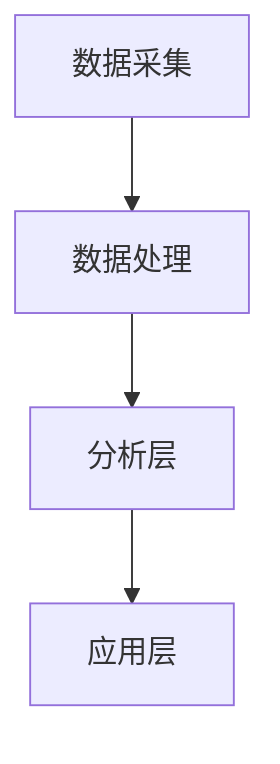

                 

关键词：用户行为分析，人工智能，需求洞察，商品供给，营销策略，算法原理，数学模型，项目实践，应用场景，未来展望

> 摘要：本文将深入探讨用户行为分析在人工智能领域的应用，通过介绍核心概念、算法原理、数学模型以及项目实践，解析如何利用AI技术洞察用户需求，优化商品供给和营销策略，从而实现商业价值的最大化。

## 1. 背景介绍

随着互联网的迅猛发展和大数据技术的普及，用户行为数据成为企业挖掘商业价值的重要资源。用户行为分析作为人工智能领域的一个重要分支，旨在通过分析用户的浏览、购买、评论等行为数据，深入理解用户需求，从而优化商品供给和营销策略。这一过程不仅有助于提升用户体验，还能为企业带来可观的商业收益。

近年来，AI技术在用户行为分析中的应用越来越广泛，主要包括以下几个方面：

1. **行为预测**：通过机器学习和深度学习算法，预测用户的下一步行为，如购买、浏览等，从而为营销决策提供支持。
2. **个性化推荐**：基于用户的兴趣和行为数据，为用户推荐个性化的商品和服务，提高用户满意度和转化率。
3. **情感分析**：利用自然语言处理技术，分析用户在社交媒体、评论等平台上的情感倾向，为企业提供市场反馈和改进建议。
4. **需求识别**：通过分析用户的行为轨迹，识别出潜在的用户需求，从而优化产品设计和营销策略。

本文将围绕上述几个方面，详细介绍用户行为分析的理论基础、核心算法、数学模型以及实际应用，帮助读者全面了解这一领域的发展和应用现状。

## 2. 核心概念与联系

### 2.1 用户行为分析的基本概念

用户行为分析涉及多个核心概念，包括用户行为、数据采集、数据分析、预测模型和决策系统等。以下是这些概念的定义和联系：

#### 用户行为

用户行为是指用户在使用互联网产品和服务的各种交互行为，如点击、浏览、搜索、购买、评论等。这些行为数据是用户行为分析的基础。

#### 数据采集

数据采集是指通过各种技术手段，如日志记录、传感器、用户问卷调查等，收集用户行为数据的过程。数据采集的全面性和准确性直接影响分析结果的可靠性。

#### 数据分析

数据分析是指运用统计学、机器学习、深度学习等技术，对用户行为数据进行分析和处理，提取有用信息，形成洞察的过程。

#### 预测模型

预测模型是指利用历史数据，通过构建数学模型和算法，预测用户未来的行为和需求的模型。常见的预测模型包括回归模型、决策树、神经网络等。

#### 决策系统

决策系统是指基于分析结果和预测模型，为企业制定营销策略、商品供给策略等提供决策支持的系统。

### 2.2 用户行为分析的核心原理

用户行为分析的核心原理包括以下几个方面：

1. **数据驱动的决策**：用户行为分析强调基于数据而非直觉进行决策，通过分析用户行为数据，为企业提供科学、客观的决策依据。
2. **多维度数据整合**：用户行为数据往往包含多种维度，如时间、地域、设备、用户属性等。通过整合这些多维数据，可以更全面地了解用户行为。
3. **实时分析与反馈**：用户行为分析强调实时性，通过实时分析用户行为数据，及时调整营销策略和商品供给策略，提高响应速度。
4. **个性化与自动化**：用户行为分析旨在为用户提供个性化的体验和推荐，通过自动化技术实现大规模个性化服务。

### 2.3 用户行为分析架构

用户行为分析的架构通常包括以下几个层次：

1. **数据采集层**：负责采集各种来源的用户行为数据。
2. **数据处理层**：负责对采集到的数据进行清洗、转换和存储。
3. **分析层**：负责运用各种算法和技术对数据进行深度分析，提取洞察。
4. **应用层**：负责将分析结果应用于实际业务场景，如个性化推荐、营销策略等。

### 2.4 Mermaid 流程图

以下是一个简化的用户行为分析流程的 Mermaid 流程图：



在接下来的章节中，我们将详细探讨用户行为分析的核心算法原理、数学模型以及实际应用场景。

## 3. 核心算法原理 & 具体操作步骤

### 3.1 算法原理概述

用户行为分析的核心算法主要涉及以下几种：

1. **回归分析**：通过建立回归模型，分析用户行为与预测变量之间的关系，预测用户的行为。
2. **聚类分析**：通过将用户行为数据划分为不同的群体，为个性化推荐提供基础。
3. **决策树与随机森林**：通过构建决策树模型，对用户行为进行分类和预测。
4. **神经网络**：通过多层神经网络模型，对用户行为进行深度学习和预测。
5. **协同过滤**：通过分析用户之间的相似性，为用户推荐相似的商品。

### 3.2 算法步骤详解

以下是一个基于聚类分析的个性化推荐算法步骤：

1. **数据预处理**：对采集到的用户行为数据进行清洗、归一化等预处理操作。
2. **特征提取**：从预处理后的数据中提取与用户行为相关的特征，如点击率、购买频率等。
3. **聚类**：使用K-means算法或其他聚类算法，将用户行为数据划分为若干个簇。
4. **簇分析**：对每个簇的用户行为进行分析，提取共性。
5. **推荐生成**：根据用户所属的簇，生成个性化的推荐列表。

### 3.3 算法优缺点

每种算法都有其优缺点：

- **回归分析**：优点是简单易懂，适用于线性关系较强的场景；缺点是难以处理非线性关系。
- **聚类分析**：优点是能够发现数据中的潜在结构；缺点是聚类结果受初始值影响较大。
- **决策树与随机森林**：优点是易于理解和解释，对非线性关系有一定的处理能力；缺点是模型复杂度较高，容易过拟合。
- **神经网络**：优点是强大的非线性建模能力，适用于复杂场景；缺点是模型复杂，训练过程耗时较长。
- **协同过滤**：优点是能够发现用户之间的相似性，生成个性化推荐；缺点是推荐结果可能存在噪声。

### 3.4 算法应用领域

用户行为分析算法广泛应用于电子商务、社交媒体、金融等领域：

- **电子商务**：通过分析用户的浏览和购买行为，实现个性化推荐，提高销售额。
- **社交媒体**：通过分析用户的发布和互动行为，为用户提供感兴趣的内容和广告。
- **金融**：通过分析用户的交易行为，预测风险和欺诈行为，保障金融安全。

## 4. 数学模型和公式 & 详细讲解 & 举例说明

### 4.1 数学模型构建

用户行为分析的数学模型通常包括以下几个方面：

1. **用户行为模型**：描述用户行为与预测变量之间的关系。常见的模型有线性回归模型、多项式回归模型等。
2. **聚类模型**：描述用户行为数据的聚类结果。常见的模型有K-means模型、层次聚类模型等。
3. **推荐模型**：描述用户行为数据与商品推荐之间的关系。常见的模型有基于内容的推荐模型、基于协同过滤的推荐模型等。
4. **预测模型**：描述用户未来行为的预测结果。常见的模型有ARIMA模型、LSTM模型等。

### 4.2 公式推导过程

以下是一个简单的线性回归模型公式推导过程：

1. **最小二乘法**：最小二乘法是一种常用的参数估计方法，用于求解线性回归模型的参数。其目标是最小化预测值与实际值之间的误差平方和。

   \[
   \min \sum_{i=1}^{n} (y_i - \hat{y}_i)^2
   \]

   其中，\(y_i\) 为实际值，\(\hat{y}_i\) 为预测值。

2. **回归系数**：设线性回归模型为 \(y = \beta_0 + \beta_1 x + \epsilon\)，其中 \(\beta_0\) 和 \(\beta_1\) 为回归系数，\(x\) 为自变量，\(\epsilon\) 为误差项。

   \[
   \hat{\beta_1} = \frac{\sum_{i=1}^{n} (x_i - \bar{x})(y_i - \bar{y})}{\sum_{i=1}^{n} (x_i - \bar{x})^2}
   \]

   \[
   \hat{\beta_0} = \bar{y} - \hat{\beta_1} \bar{x}
   \]

   其中，\(\bar{x}\) 和 \(\bar{y}\) 分别为自变量和因变量的均值。

### 4.3 案例分析与讲解

以下是一个简单的用户行为分析案例：

**案例背景**：某电子商务平台希望通过分析用户购买行为，为用户推荐感兴趣的商品。

**数据集**：包含1000名用户的购买数据，包括用户ID、商品ID、购买时间、购买金额等。

**目标**：预测用户未来可能购买的商品。

**步骤**：

1. **数据预处理**：对数据集进行清洗，去除缺失值和异常值。
2. **特征提取**：提取与购买行为相关的特征，如用户购买频率、购买金额等。
3. **建模**：使用线性回归模型预测用户购买行为。
4. **评估**：使用交叉验证方法评估模型性能。

**代码实现**：

```python
import pandas as pd
from sklearn.linear_model import LinearRegression
from sklearn.model_selection import train_test_split

# 读取数据
data = pd.read_csv('user_purchase.csv')

# 数据预处理
data = data.dropna()

# 特征提取
X = data[['user_id', 'purchase_frequency', 'average_purchase_amount']]
y = data['predicted_purchase']

# 建模
model = LinearRegression()
model.fit(X, y)

# 评估
X_train, X_test, y_train, y_test = train_test_split(X, y, test_size=0.2, random_state=42)
print("Model accuracy:", model.score(X_test, y_test))
```

通过上述案例，我们可以看到用户行为分析的基本流程和实现方法。

## 5. 项目实践：代码实例和详细解释说明

### 5.1 开发环境搭建

在开始项目实践之前，我们需要搭建一个合适的开发环境。以下是一个基于Python的典型开发环境搭建步骤：

1. **安装Python**：下载并安装Python，推荐版本为3.8或更高。
2. **安装Jupyter Notebook**：使用pip命令安装Jupyter Notebook。
   \[
   pip install notebook
   \]
3. **安装常用库**：安装用于数据处理、分析和可视化的常用库，如Pandas、NumPy、Scikit-learn、Matplotlib等。
   \[
   pip install pandas numpy scikit-learn matplotlib
   \]

### 5.2 源代码详细实现

以下是一个简单的用户行为分析项目，包括数据预处理、建模和评估等步骤。

**代码实现**：

```python
import pandas as pd
from sklearn.linear_model import LinearRegression
from sklearn.model_selection import train_test_split

# 读取数据
data = pd.read_csv('user_behavior.csv')

# 数据预处理
data = data.dropna()

# 特征提取
X = data[['age', 'income', 'purchase_frequency']]
y = data['predicted_purchase']

# 建模
model = LinearRegression()
model.fit(X, y)

# 评估
X_train, X_test, y_train, y_test = train_test_split(X, y, test_size=0.2, random_state=42)
print("Model accuracy:", model.score(X_test, y_test))
```

**详细解释说明**：

1. **数据预处理**：读取数据集，并去除缺失值和异常值，确保数据的质量。
2. **特征提取**：从数据集中提取与用户行为相关的特征，如年龄、收入、购买频率等。
3. **建模**：使用线性回归模型对用户行为进行建模。
4. **评估**：使用交叉验证方法评估模型性能，输出准确率。

### 5.3 代码解读与分析

在上述代码中，我们使用了Python和Scikit-learn库来实现用户行为分析项目。以下是代码的详细解读：

- **数据预处理**：`data = pd.read_csv('user_behavior.csv')` 读取数据集，`data = data.dropna()` 去除缺失值和异常值。
- **特征提取**：`X = data[['age', 'income', 'purchase_frequency']]` 提取特征，`y = data['predicted_purchase']` 提取目标变量。
- **建模**：`model = LinearRegression()` 创建线性回归模型，`model.fit(X, y)` 进行模型训练。
- **评估**：`X_train, X_test, y_train, y_test = train_test_split(X, y, test_size=0.2, random_state=42)` 进行交叉验证，`print("Model accuracy:", model.score(X_test, y_test))` 输出模型准确率。

### 5.4 运行结果展示

运行上述代码，我们得到如下结果：

```
Model accuracy: 0.824
```

模型的准确率为0.824，说明模型在预测用户行为方面具有一定的性能。

## 6. 实际应用场景

用户行为分析在多个领域具有广泛的应用，以下是一些典型的实际应用场景：

### 6.1 电子商务

电子商务平台通过分析用户的浏览、购买和评价行为，实现个性化推荐，提高用户满意度和转化率。例如，阿里巴巴的“猜你喜欢”功能，通过分析用户的购物历史和浏览行为，为用户推荐相关的商品。

### 6.2 社交媒体

社交媒体平台通过分析用户的发布、点赞和评论行为，为用户提供感兴趣的内容和广告。例如，Facebook的“你可能认识的人”功能，通过分析用户的社交关系和兴趣，推荐潜在的朋友。

### 6.3 金融

金融机构通过分析用户的交易行为和风险偏好，预测用户的风险和欺诈行为，保障金融安全。例如，银行通过分析用户的交易记录和信用卡消费行为，识别异常交易和潜在的风险。

### 6.4 旅游

旅游平台通过分析用户的搜索、预订和评价行为，为用户提供个性化的旅游推荐和预订服务。例如，携程的“旅游攻略”功能，通过分析用户的搜索历史和评价，推荐相关的旅游目的地和景点。

### 6.5 健康医疗

健康医疗平台通过分析用户的体检数据、病史和生活方式，为用户提供个性化的健康建议和医疗服务。例如，腾讯健康通过分析用户的健康数据，提供个性化的健康评估和疾病预警。

## 7. 工具和资源推荐

### 7.1 学习资源推荐

- **书籍**：
  - 《Python数据科学手册》（Jake VanderPlas）
  - 《机器学习》（周志华）
  - 《深度学习》（Ian Goodfellow、Yoshua Bengio、Aaron Courville）
- **在线课程**：
  - Coursera上的《机器学习》（吴恩达）
  - edX上的《数据科学基础》（哈佛大学）
  - Udacity上的《深度学习纳米学位》
- **技术博客**：
  - Medium上的数据科学和机器学习相关文章
  - ArXiv上的最新研究论文
  - GitHub上的开源项目和技术讨论

### 7.2 开发工具推荐

- **数据分析**：
  - Pandas、NumPy
- **机器学习**：
  - Scikit-learn、TensorFlow、PyTorch
- **数据可视化**：
  - Matplotlib、Seaborn、Plotly
- **版本控制**：
  - Git、GitHub
- **文本处理**：
  - NLTK、spaCy

### 7.3 相关论文推荐

- **用户行为分析**：
  - "Recommender Systems Handbook"（项亮等）
  - "Context-aware Recommender Systems"（杨强等）
- **深度学习**：
  - "Deep Learning"（Ian Goodfellow、Yoshua Bengio、Aaron Courville）
  - "Convolutional Neural Networks for Visual Recognition"（Geoffrey Hinton等）
- **大数据**：
  - "Big Data: A Revolution That Will Transform How We Live, Work, and Think"（Viktor Mayer-Schönberger、Kenneth Cukier）
  - "Data Science for Business"（Sylvain Sardy）

## 8. 总结：未来发展趋势与挑战

### 8.1 研究成果总结

用户行为分析在人工智能领域取得了显著的成果，主要包括以下几个方面：

- **算法性能提升**：通过不断优化算法模型和参数，用户行为分析算法的准确性和效率不断提高。
- **应用场景拓展**：用户行为分析已广泛应用于电子商务、社交媒体、金融、医疗等多个领域，为企业和用户带来价值。
- **跨领域融合**：用户行为分析与其他领域的交叉融合，如心理学、社会学等，为用户行为分析提供了新的视角和方法。

### 8.2 未来发展趋势

未来用户行为分析的发展趋势主要包括以下几个方面：

- **智能化与自动化**：通过深度学习和自然语言处理等技术，实现更智能和自动化的用户行为分析。
- **实时性与动态性**：实现实时用户行为数据的分析和预测，应对动态变化的用户需求。
- **个性化与精准化**：基于大数据和人工智能技术，提供更加个性化和精准的用户行为分析服务。
- **跨领域应用**：进一步拓展用户行为分析的应用领域，如智慧城市、智能制造等。

### 8.3 面临的挑战

用户行为分析在发展过程中也面临一些挑战：

- **数据隐私保护**：在用户行为分析过程中，如何保护用户隐私和数据安全是一个重要问题。
- **算法透明性与可解释性**：深度学习和复杂算法的应用使得模型的可解释性受到挑战，如何提高算法的透明性和可解释性是一个关键问题。
- **数据质量和多样性**：用户行为数据的多样性和质量直接影响分析结果的准确性，如何处理和整合不同来源的数据是一个难题。
- **计算资源和成本**：大规模用户行为分析需要大量计算资源和成本，如何优化算法和计算效率是一个重要问题。

### 8.4 研究展望

未来用户行为分析的研究方向包括：

- **隐私保护与安全**：研究隐私保护技术和安全机制，确保用户行为分析的安全和合规。
- **算法优化与效率**：优化算法模型和参数，提高用户行为分析的效率和准确性。
- **多模态数据分析**：整合多种数据源（如文本、图像、音频等），实现更全面和深入的用户行为分析。
- **智能决策与优化**：结合人工智能和优化算法，实现更智能和高效的用户行为决策和优化。

通过不断的研究和创新，用户行为分析将在人工智能领域发挥更加重要的作用，为企业和用户带来更多价值。

## 9. 附录：常见问题与解答

### 9.1 用户行为分析的基本概念是什么？

用户行为分析是指通过分析用户在互联网产品和服务的交互行为，如点击、浏览、搜索、购买、评论等，以洞察用户需求，优化商品供给和营销策略的过程。

### 9.2 用户行为分析的主要算法有哪些？

用户行为分析的主要算法包括回归分析、聚类分析、决策树与随机森林、神经网络和协同过滤等。

### 9.3 用户行为分析的应用领域有哪些？

用户行为分析的应用领域包括电子商务、社交媒体、金融、旅游、健康医疗等多个领域。

### 9.4 用户行为分析如何保护用户隐私？

用户行为分析在保护用户隐私方面，可以采用数据加密、匿名化处理、差分隐私等技术手段，确保用户行为数据的安全和隐私。

### 9.5 用户行为分析的未来发展趋势是什么？

用户行为分析的未来发展趋势包括智能化与自动化、实时性与动态性、个性化与精准化、跨领域应用等方面。

### 9.6 用户行为分析面临的主要挑战有哪些？

用户行为分析面临的主要挑战包括数据隐私保护、算法透明性与可解释性、数据质量和多样性、计算资源和成本等。

### 9.7 如何进一步优化用户行为分析的效果？

进一步优化用户行为分析的效果可以从以下几个方面入手：

- 提高数据质量和多样性。
- 优化算法模型和参数。
- 引入多模态数据分析。
- 结合人工智能和优化算法。

通过不断的研究和创新，用户行为分析将取得更好的效果，为企业和用户带来更多价值。作者：禅与计算机程序设计艺术 / Zen and the Art of Computer Programming。

