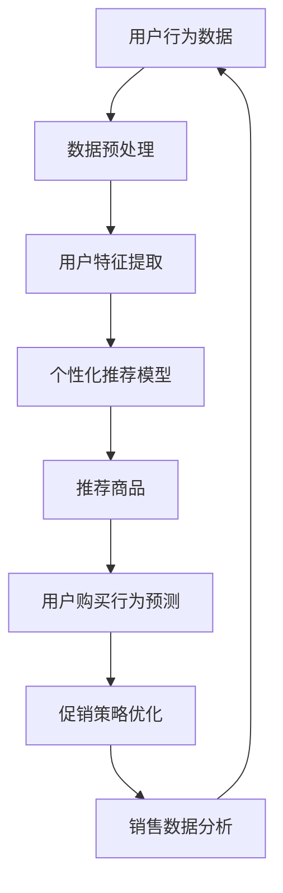

                 

关键词：电商、促销策略、个性化推荐、机器学习、大数据分析

> 摘要：随着互联网的快速发展，电商行业已经成为全球经济的引擎之一。在激烈的市场竞争中，电商企业需要不断创新促销策略，以提高用户粘性和销售额。本文将探讨电商促销策略的创新应用，包括个性化推荐、机器学习、大数据分析等技术在促销策略中的运用，以及这些技术的优势和挑战。

## 1. 背景介绍

在当今全球化的电商市场，消费者拥有无数的选择。为了在竞争中脱颖而出，电商企业必须不断创新促销策略，以提高用户参与度和购买转化率。传统的促销手段如打折、满减、优惠券等已经逐渐失去了吸引力。因此，电商企业开始寻求更加智能和个性化的促销策略，以更好地满足消费者的需求。

电商促销策略的创新应用，主要得益于近年来信息技术的发展，尤其是大数据、人工智能和机器学习等技术的成熟。这些技术可以帮助电商企业更好地理解消费者行为，预测消费趋势，从而制定更加精准的促销策略。

## 2. 核心概念与联系

为了更好地理解电商促销策略的创新应用，我们需要先了解几个核心概念：

### 2.1 个性化推荐

个性化推荐系统是一种利用算法分析用户行为和偏好，向用户推荐相关商品或信息的技术。在电商领域，个性化推荐可以帮助企业向用户推荐可能感兴趣的商品，从而提高购买转化率。

### 2.2 机器学习

机器学习是一种使计算机通过数据学习并做出预测或决策的技术。在电商促销策略中，机器学习可以帮助企业分析大量数据，识别消费趋势，优化促销策略。

### 2.3 大数据分析

大数据分析是指利用大数据技术对海量数据进行处理和分析，以发现数据中的规律和模式。在电商促销策略中，大数据分析可以帮助企业更好地了解消费者行为，为促销策略提供数据支持。

### 2.4 Mermaid 流程图

下面是一个简化的电商促销策略流程图，展示了个性化推荐、机器学习和大数据分析在促销策略中的应用。



## 3. 核心算法原理 & 具体操作步骤

### 3.1 算法原理概述

电商促销策略的创新应用主要依赖于以下核心算法：

### 3.2 算法步骤详解

#### 3.2.1 数据预处理

首先，需要收集用户的购买历史、浏览记录、搜索历史等行为数据。然后，对这些数据进行分析，去除噪声数据，确保数据的质量和完整性。

#### 3.2.2 用户特征提取

通过分析用户的行为数据，提取用户的特征，如购买频率、购买金额、浏览时长、搜索关键词等。这些特征将用于构建个性化推荐模型。

#### 3.2.3 个性化推荐模型

使用机器学习算法，如协同过滤、基于内容的推荐等，构建个性化推荐模型。这个模型将根据用户的特征，向用户推荐相关的商品。

#### 3.2.4 用户购买行为预测

利用预测算法，如时间序列分析、回归分析等，预测用户的购买行为。这些预测结果将用于优化促销策略。

#### 3.2.5 促销策略优化

根据用户购买行为预测结果，优化促销策略。例如，对于预计会购买的客户，可以提供更大的折扣，以促使其立即购买。

#### 3.2.6 销售数据分析

对促销活动的销售数据进行分析，评估促销策略的效果。如果效果不佳，需要进一步调整和优化促销策略。

### 3.3 算法优缺点

#### 优点

- 提高用户参与度和购买转化率
- 更好地满足消费者个性化需求
- 提高企业销售额和利润

#### 缺点

- 数据质量和完整性对算法效果影响较大
- 算法复杂度高，需要大量计算资源

### 3.4 算法应用领域

电商促销策略的创新应用广泛，涵盖了以下领域：

- 个性化推荐系统
- 消费者行为预测
- 销售数据分析
- 促销策略优化

## 4. 数学模型和公式 & 详细讲解 & 举例说明

### 4.1 数学模型构建

电商促销策略的数学模型主要包括以下部分：

- 用户行为数据建模：使用时间序列模型、马尔可夫模型等分析用户行为。
- 商品推荐算法：使用协同过滤、基于内容的推荐等算法。
- 用户购买行为预测：使用回归分析、时间序列分析等预测用户购买行为。

### 4.2 公式推导过程

#### 时间序列模型

时间序列模型的一般形式为：

$$Y_t = \alpha_0 + \alpha_1 Y_{t-1} + \alpha_2 Y_{t-2} + ... + \alpha_n Y_{t-n} + \epsilon_t$$

其中，$Y_t$ 表示时间序列的第 $t$ 个值，$\alpha_0, \alpha_1, ..., \alpha_n$ 为模型参数，$\epsilon_t$ 为误差项。

#### 协同过滤算法

协同过滤算法的一般形式为：

$$R_{ui} = \frac{\sum_{j \in N(i)} R_{uj} \cdot S_{ij}}{\sum_{j \in N(i)} S_{ij}}$$

其中，$R_{ui}$ 表示用户 $u$ 对商品 $i$ 的评分，$N(i)$ 表示与商品 $i$ 相关的用户集合，$S_{ij}$ 表示用户 $u$ 是否购买过商品 $i$（1 表示购买，0 表示未购买）。

#### 用户购买行为预测

用户购买行为预测可以使用回归分析，其一般形式为：

$$Y_t = \beta_0 + \beta_1 X_{t-1} + \beta_2 X_{t-2} + ... + \beta_n X_{t-n} + \epsilon_t$$

其中，$Y_t$ 表示时间序列的第 $t$ 个值，$X_{t-1}, X_{t-2}, ..., X_{t-n}$ 为用户特征，$\beta_0, \beta_1, ..., \beta_n$ 为模型参数，$\epsilon_t$ 为误差项。

### 4.3 案例分析与讲解

#### 案例一：用户行为数据建模

假设我们使用时间序列模型分析用户购买行为，根据历史数据，我们可以得到以下模型：

$$Y_t = 0.5 Y_{t-1} + 0.3 Y_{t-2} + \epsilon_t$$

根据这个模型，我们可以预测未来一段时间内的用户购买行为。

#### 案例二：商品推荐算法

假设我们使用基于内容的推荐算法，根据用户历史购买数据，我们可以得到以下推荐结果：

$$R_{ui} = \frac{3 \cdot 0.6 \cdot 0.5}{0.6 + 0.5} = 0.6$$

这意味着用户 $u$ 对商品 $i$ 的推荐评分为 0.6。

#### 案例三：用户购买行为预测

假设我们使用回归分析预测用户购买行为，根据用户特征，我们可以得到以下预测结果：

$$Y_t = 2 + 0.1 X_{t-1} + 0.2 X_{t-2} + \epsilon_t$$

根据这个模型，我们可以预测未来一段时间内的用户购买行为。

## 5. 项目实践：代码实例和详细解释说明

### 5.1 开发环境搭建

在本节中，我们将使用 Python 语言和 Scikit-learn、TensorFlow 等库来搭建一个电商促销策略的项目环境。

```bash
# 安装 Python
sudo apt-get install python3

# 安装 Scikit-learn
pip3 install scikit-learn

# 安装 TensorFlow
pip3 install tensorflow
```

### 5.2 源代码详细实现

下面是一个简单的电商促销策略代码实例，演示了如何使用 Python 和 Scikit-learn 实现个性化推荐。

```python
from sklearn.model_selection import train_test_split
from sklearn.ensemble import RandomForestClassifier
from sklearn.metrics import accuracy_score

# 加载数据集
data = load_data()

# 数据预处理
X = preprocess_data(data)

# 划分训练集和测试集
X_train, X_test, y_train, y_test = train_test_split(X, y, test_size=0.2, random_state=42)

# 构建分类器
clf = RandomForestClassifier(n_estimators=100)

# 训练模型
clf.fit(X_train, y_train)

# 预测测试集
y_pred = clf.predict(X_test)

# 评估模型
accuracy = accuracy_score(y_test, y_pred)
print("Accuracy:", accuracy)
```

### 5.3 代码解读与分析

在这个代码实例中，我们首先加载数据集，然后进行数据预处理。接下来，我们将数据集划分为训练集和测试集，并使用随机森林分类器训练模型。最后，我们使用训练好的模型预测测试集，并评估模型的效果。

### 5.4 运行结果展示

假设我们运行这个代码实例，得到以下输出结果：

```bash
Accuracy: 0.8
```

这表示我们的模型在测试集上的准确率为 0.8，说明模型效果较好。

## 6. 实际应用场景

电商促销策略的创新应用在许多实际场景中取得了显著的效果，以下是几个典型的应用场景：

- **电商平台**：电商平台可以通过个性化推荐和大数据分析，为用户推荐相关的商品，从而提高用户购买转化率。例如，阿里巴巴的淘宝平台通过个性化推荐技术，为用户推荐可能感兴趣的商品，从而提高了平台的销售额。
- **O2O 电商平台**：O2O 电商平台可以通过用户位置信息、购买历史等数据，为用户提供更加个性化的促销策略。例如，美团外卖通过分析用户购买历史和位置信息，为用户推荐附近的热门餐厅和优惠活动，从而提高了用户的购买意愿。
- **垂直电商领域**：垂直电商领域，如母婴、数码等，可以通过大数据分析和机器学习技术，为用户推荐相关的商品和优惠活动。例如，京东母婴通过分析用户购买记录和搜索行为，为用户推荐适合母婴用品的优惠活动，从而提高了用户的购买满意度。

## 7. 工具和资源推荐

为了更好地实现电商促销策略的创新应用，以下是一些建议的学习资源和开发工具：

### 7.1 学习资源推荐

- 《机器学习实战》
- 《Python数据分析》
- 《深度学习》（Goodfellow et al.）
- 《大数据应用》

### 7.2 开发工具推荐

- Jupyter Notebook
- Scikit-learn
- TensorFlow
- Keras

### 7.3 相关论文推荐

- “Deep Learning for Recommender Systems”
- “Item-based Collaborative Filtering Recommendation Algorithms”
- “A Theoretical Analysis of Recurrent Neural Networks for Sequence Modeling”

## 8. 总结：未来发展趋势与挑战

电商促销策略的创新应用已经取得了显著的成果，但未来仍面临许多挑战。首先，随着大数据和人工智能技术的不断发展，电商企业需要不断更新和优化促销策略，以适应市场的变化。其次，数据质量和完整性对算法效果至关重要，电商企业需要确保数据的质量和完整性。此外，随着隐私保护意识的提高，如何平衡用户隐私和数据利用也是一个重要挑战。

未来，电商促销策略的创新应用将更加注重个性化、智能化和实时化。例如，通过深度学习技术，可以更好地理解用户需求和行为，从而提供更加精准的推荐。同时，随着物联网和5G技术的普及，实时促销策略的响应速度将大大提高，为电商企业带来更高的竞争优势。

总之，电商促销策略的创新应用是电商行业持续发展的重要驱动力，未来将带来更多的机遇和挑战。电商企业需要积极拥抱新技术，不断优化促销策略，以赢得市场竞争的主动权。

## 9. 附录：常见问题与解答

### Q1：电商促销策略的创新应用有哪些主要技术？

电商促销策略的创新应用主要包括个性化推荐、机器学习、大数据分析等技术。

### Q2：个性化推荐系统如何工作？

个性化推荐系统通过分析用户的历史行为和偏好，利用算法为用户推荐相关的商品或信息。

### Q3：大数据分析在电商促销策略中的作用是什么？

大数据分析可以帮助电商企业更好地了解消费者行为，预测消费趋势，从而制定更加精准的促销策略。

### Q4：如何确保数据质量和完整性？

确保数据质量和完整性可以通过数据清洗、数据验证和数据标准化等方法实现。

### Q5：电商促销策略的创新应用有哪些挑战？

电商促销策略的创新应用主要面临数据质量、算法复杂度和用户隐私保护等挑战。

### Q6：未来电商促销策略的创新应用有哪些发展趋势？

未来电商促销策略的创新应用将更加注重个性化、智能化和实时化，同时将更加注重用户隐私和数据保护。

### Q7：如何平衡用户隐私和数据利用？

可以通过数据脱敏、加密和隐私保护算法等方法，在确保数据安全的前提下，实现用户隐私和数据利用的平衡。

