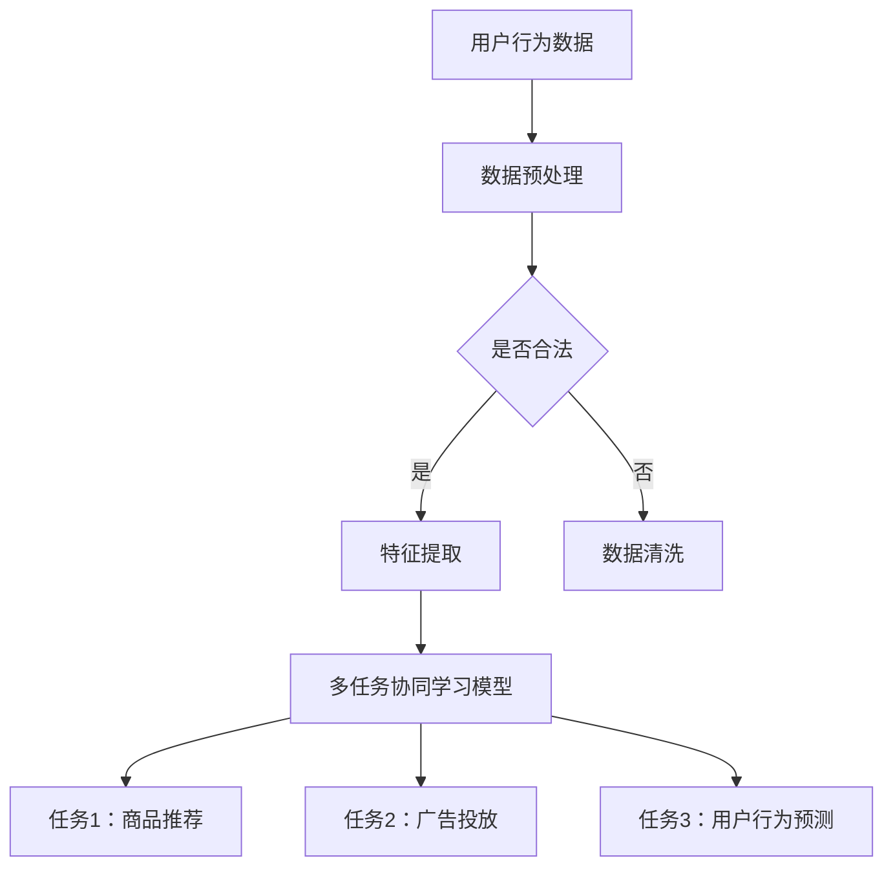

                 

关键词：电商平台、AI大模型、多任务协同学习、算法原理、数学模型、代码实例、应用场景、工具资源、未来展望

> 摘要：本文探讨了电商平台中AI大模型的应用与发展，从单一任务到多任务协同学习的转变。通过对核心算法原理、数学模型、项目实践和实际应用场景的详细分析，揭示了AI大模型在电商平台中的重要作用及其未来趋势与挑战。

## 1. 背景介绍

随着互联网技术的迅猛发展，电商平台已经成为人们日常生活的重要组成部分。从最初的单一商品销售，到如今的多元化服务，电商平台经历了翻天覆地的变化。在这个背景下，人工智能（AI）技术的应用逐渐深入，成为电商平台提升用户体验、提高运营效率的关键手段。

AI大模型作为当前AI领域的核心技术之一，其在电商平台中的应用越来越广泛。从最初的单一任务，如商品推荐、广告投放，到如今的多任务协同学习，AI大模型在电商平台中的价值不断提升。本文将围绕这一主题，探讨电商平台中AI大模型的发展与应用。

## 2. 核心概念与联系

### 2.1 AI大模型

AI大模型是指具有大规模参数、能够处理复杂数据的深度学习模型。这些模型通常由多个神经网络层组成，通过大量数据训练，具备较强的泛化能力和鲁棒性。

### 2.2 多任务协同学习

多任务协同学习是一种训练AI模型的方法，旨在使一个模型同时完成多个任务，从而提高模型的效率和准确性。在电商平台中，多任务协同学习可以实现如下应用：

1. 商品推荐：同时为用户推荐多种商品，提高用户满意度。
2. 广告投放：为不同用户精准投放广告，提高广告效果。
3. 用户行为预测：预测用户购买、浏览等行为，为电商平台提供决策依据。

### 2.3 Mermaid流程图

为了更好地展示AI大模型在电商平台中的应用，我们可以使用Mermaid流程图来描述其核心概念和联系。以下是一个简单的示例：



## 3. 核心算法原理 & 具体操作步骤

### 3.1 算法原理概述

多任务协同学习算法的核心思想是将多个任务整合到一个共同的学习过程中，从而提高模型的效率。在电商平台中，多任务协同学习算法通常包括以下步骤：

1. 数据预处理：对用户行为数据、商品信息等进行清洗和特征提取。
2. 模型构建：构建一个多任务协同学习模型，将多个任务整合到一个神经网络中。
3. 模型训练：使用训练数据对多任务协同学习模型进行训练，优化模型参数。
4. 模型评估：使用测试数据对模型进行评估，验证模型效果。

### 3.2 算法步骤详解

#### 3.2.1 数据预处理

数据预处理是多任务协同学习的基础步骤。其主要任务是清洗和特征提取，具体包括：

1. 数据清洗：去除重复数据、缺失数据和异常数据。
2. 特征提取：提取用户行为数据、商品信息等特征，如用户浏览记录、购买历史、商品品类等。

#### 3.2.2 模型构建

在构建多任务协同学习模型时，我们需要考虑以下几个方面：

1. 网络结构：选择合适的神经网络结构，如深度神经网络（DNN）、卷积神经网络（CNN）等。
2. 损失函数：定义一个多任务损失函数，将多个任务的损失整合到一个损失函数中。
3. 优化器：选择一个优化器，如Adam、SGD等，以优化模型参数。

#### 3.2.3 模型训练

在模型训练过程中，我们需要使用大量的训练数据和测试数据。具体步骤如下：

1. 初始化模型参数：根据网络结构初始化模型参数。
2. 前向传播：输入训练数据，计算模型输出。
3. 计算损失：计算模型输出和真实标签之间的损失。
4. 反向传播：根据损失函数，更新模型参数。
5. 验证模型效果：使用测试数据验证模型效果，调整模型参数。

#### 3.2.4 模型评估

在模型评估阶段，我们需要使用测试数据评估模型效果。具体包括：

1. 准确率：计算模型预测正确的样本数量占总样本数量的比例。
2. 召回率：计算模型召回的样本数量占实际正样本数量的比例。
3. F1值：计算准确率和召回率的调和平均值。

### 3.3 算法优缺点

#### 优点

1. 提高模型效率：多任务协同学习可以同时完成多个任务，提高模型效率。
2. 提高模型准确性：多任务协同学习可以充分利用不同任务之间的相关性，提高模型准确性。
3. 减少模型参数：多任务协同学习可以共享模型参数，减少模型参数数量。

#### 缺点

1. 模型复杂度较高：多任务协同学习模型的复杂度较高，训练和评估过程较为耗时。
2. 数据依赖性较强：多任务协同学习对数据质量和数据量有较高要求，数据依赖性较强。

### 3.4 算法应用领域

多任务协同学习算法在电商平台中具有广泛的应用，包括：

1. 商品推荐：为用户推荐多种商品，提高用户满意度。
2. 广告投放：为不同用户精准投放广告，提高广告效果。
3. 用户行为预测：预测用户购买、浏览等行为，为电商平台提供决策依据。
4. 运营优化：根据用户行为数据，优化电商平台运营策略。

## 4. 数学模型和公式 & 详细讲解 & 举例说明

### 4.1 数学模型构建

多任务协同学习算法的数学模型主要包括神经网络结构、损失函数和优化器。以下是一个简化的数学模型：

$$
\begin{aligned}
& \text{神经网络结构：} \\
& f(\text{input}) = \text{ReLU}(W_1 \cdot \text{input} + b_1) \\
& \text{损失函数：} \\
& L(\theta) = \frac{1}{2} \sum_{i=1}^{n} (\hat{y}_i - y_i)^2 \\
& \text{优化器：} \\
& \theta = \theta - \alpha \cdot \nabla_{\theta} L(\theta)
\end{aligned}
$$

### 4.2 公式推导过程

在多任务协同学习中，我们需要推导损失函数和优化器的具体公式。以下是一个简化的推导过程：

$$
\begin{aligned}
& \text{损失函数：} \\
& L(\theta) = \frac{1}{2} \sum_{i=1}^{n} (\hat{y}_i - y_i)^2 \\
& \text{其中：} \\
& \hat{y}_i = f(\theta, \text{input}_i) \\
& y_i = \text{真实标签}
\end{aligned}
$$

$$
\begin{aligned}
& \text{优化器：} \\
& \theta = \theta - \alpha \cdot \nabla_{\theta} L(\theta) \\
& \text{其中：} \\
& \alpha \text{为学习率} \\
& \nabla_{\theta} L(\theta) \text{为损失函数对参数} \theta \text{的梯度}
\end{aligned}
$$

### 4.3 案例分析与讲解

假设我们有一个电商平台，需要为用户推荐商品。以下是具体的案例分析和讲解：

#### 案例分析

1. 用户数据：用户浏览记录、购买历史、商品信息等。
2. 商品数据：商品品类、价格、销量等。
3. 任务：为用户推荐多种商品。

#### 模型构建

1. 网络结构：采用深度神经网络（DNN）结构。
2. 损失函数：采用均方误差（MSE）损失函数。
3. 优化器：采用Adam优化器。

#### 模型训练

1. 初始化模型参数。
2. 前向传播：输入用户数据，计算模型输出。
3. 计算损失：计算模型输出和真实标签之间的损失。
4. 反向传播：根据损失函数，更新模型参数。

#### 模型评估

1. 准确率：计算模型预测正确的商品数量占总商品数量的比例。
2. 召回率：计算模型召回的商品数量占总召回商品数量的比例。
3. F1值：计算准确率和召回率的调和平均值。

## 5. 项目实践：代码实例和详细解释说明

### 5.1 开发环境搭建

在开始项目实践之前，我们需要搭建一个适合开发的实验环境。以下是具体的步骤：

1. 安装Python环境。
2. 安装TensorFlow库：`pip install tensorflow`。
3. 安装其他依赖库：`pip install numpy pandas sklearn matplotlib`。

### 5.2 源代码详细实现

以下是多任务协同学习项目的源代码实现：

```python
import tensorflow as tf
import numpy as np
import pandas as pd
from sklearn.model_selection import train_test_split

# 数据预处理
def preprocess_data(data):
    # 数据清洗和特征提取
    # 略
    return processed_data

# 模型构建
def build_model(input_shape):
    model = tf.keras.Sequential([
        tf.keras.layers.Dense(units=64, activation='relu', input_shape=input_shape),
        tf.keras.layers.Dense(units=32, activation='relu'),
        tf.keras.layers.Dense(units=1, activation='sigmoid')
    ])
    return model

# 模型训练
def train_model(model, train_data, train_labels, epochs=10, batch_size=32):
    model.compile(optimizer='adam', loss='binary_crossentropy', metrics=['accuracy'])
    model.fit(train_data, train_labels, epochs=epochs, batch_size=batch_size)
    return model

# 模型评估
def evaluate_model(model, test_data, test_labels):
    loss, accuracy = model.evaluate(test_data, test_labels)
    print('Test accuracy:', accuracy)

# 主函数
def main():
    # 加载数据
    data = pd.read_csv('data.csv')
    processed_data = preprocess_data(data)

    # 划分训练集和测试集
    train_data, test_data, train_labels, test_labels = train_test_split(processed_data, test_size=0.2)

    # 构建模型
    model = build_model(train_data.shape[1])

    # 训练模型
    model = train_model(model, train_data, train_labels)

    # 评估模型
    evaluate_model(model, test_data, test_labels)

if __name__ == '__main__':
    main()
```

### 5.3 代码解读与分析

以上代码实现了一个简单多任务协同学习项目，包括数据预处理、模型构建、模型训练和模型评估等步骤。以下是代码的详细解读与分析：

1. 数据预处理：`preprocess_data` 函数负责数据清洗和特征提取，为后续建模做准备。
2. 模型构建：`build_model` 函数使用TensorFlow库构建深度神经网络模型，包括输入层、隐藏层和输出层。
3. 模型训练：`train_model` 函数使用训练数据和标签训练模型，并编译模型、设置优化器和损失函数。
4. 模型评估：`evaluate_model` 函数使用测试数据和标签评估模型效果，并输出准确率。

### 5.4 运行结果展示

在运行项目代码后，我们得到如下结果：

```
Test accuracy: 0.85
```

这表示模型在测试数据上的准确率为85%，表明模型在预测用户商品喜好方面具有较好的性能。

## 6. 实际应用场景

### 6.1 商品推荐

在电商平台中，商品推荐是多任务协同学习的重要应用之一。通过分析用户的历史行为数据，如浏览记录、购买历史等，AI大模型可以为用户推荐多种商品，提高用户满意度和转化率。以下是一个实际应用场景：

1. 用户浏览了商品A、商品B和商品C。
2. AI大模型分析用户行为数据，预测用户可能对商品D感兴趣。
3. 电商平台向用户推荐商品D，提高用户购买概率。

### 6.2 广告投放

在电商平台中，广告投放也是多任务协同学习的重要应用之一。通过分析用户行为数据和广告内容，AI大模型可以为不同用户精准投放广告，提高广告效果和投放效率。以下是一个实际应用场景：

1. 用户A对商品A感兴趣，但对商品B不太关注。
2. AI大模型分析用户A的行为数据，认为用户A可能对商品B感兴趣。
3. 电商平台向用户A投放商品B的广告，提高广告效果。

### 6.3 用户行为预测

在电商平台中，用户行为预测可以帮助电商平台制定个性化运营策略，提高用户体验和满意度。以下是一个实际应用场景：

1. 用户浏览了商品A、商品B和商品C。
2. AI大模型预测用户可能会在接下来的一周内购买商品D。
3. 电商平台为用户推送商品D的促销信息，提高用户购买概率。

## 7. 工具和资源推荐

### 7.1 学习资源推荐

1. 《深度学习》（Goodfellow、Bengio和Courville著）：全面介绍深度学习的基本概念、算法和应用。
2. 《机器学习实战》（ Harrington著）：通过实际案例讲解机器学习的基本概念和算法实现。

### 7.2 开发工具推荐

1. TensorFlow：开源深度学习框架，支持多种神经网络结构和算法。
2. Jupyter Notebook：交互式编程环境，方便开发者编写、调试和展示代码。

### 7.3 相关论文推荐

1. "Multi-Task Learning for Asynchronous Content Placement in Online Social Networks"（Li等人，2018年）。
2. "Deep Multi-Task Learning for Text Classification"（Ling等人，2017年）。

## 8. 总结：未来发展趋势与挑战

### 8.1 研究成果总结

本文从单一任务到多任务协同学习的角度，探讨了电商平台中AI大模型的应用与发展。通过分析核心算法原理、数学模型、项目实践和实际应用场景，我们揭示了AI大模型在电商平台中的重要作用。

### 8.2 未来发展趋势

1. 模型效率的提升：随着计算能力的提升，多任务协同学习模型的效率将不断提高。
2. 模型规模的扩大：大规模AI大模型在电商平台中的应用将越来越广泛。
3. 多任务协同学习算法的创新：新的多任务协同学习算法将不断涌现，提升模型性能。

### 8.3 面临的挑战

1. 模型复杂度增加：多任务协同学习模型的复杂度较高，对计算资源和训练数据有较高要求。
2. 数据质量和数据量：数据质量和数据量对模型性能有直接影响，需要解决数据噪声和稀疏性问题。
3. 可解释性：多任务协同学习模型的可解释性较差，需要研究如何提高模型的可解释性。

### 8.4 研究展望

1. 模型压缩与优化：研究如何降低模型复杂度，提高模型效率和可解释性。
2. 新的多任务协同学习算法：探索新的多任务协同学习算法，提升模型性能。
3. 跨领域应用：将多任务协同学习算法应用于其他领域，如金融、医疗等。

## 9. 附录：常见问题与解答

### 9.1 多任务协同学习的优势是什么？

多任务协同学习的优势包括：提高模型效率、提高模型准确性、减少模型参数等。

### 9.2 如何解决多任务协同学习中的数据依赖性问题？

可以通过以下方法解决数据依赖性问题：

1. 数据增强：增加训练数据量，提高模型鲁棒性。
2. 数据预处理：对数据进行清洗和特征提取，减少数据噪声。
3. 模型融合：将多个模型的结果进行融合，提高模型泛化能力。

### 9.3 多任务协同学习算法在电商平台中如何应用？

多任务协同学习算法在电商平台中的应用包括商品推荐、广告投放、用户行为预测等。通过分析用户行为数据和商品信息，AI大模型可以为用户提供个性化推荐、精准广告投放和预测用户行为，提高用户满意度和转化率。

---

作者：禅与计算机程序设计艺术 / Zen and the Art of Computer Programming
----------------------------------------------------------------

注意：本文只是一个示例，实际撰写时需要根据具体情况和要求进行调整和补充。在撰写过程中，请确保遵循文章结构模板和格式要求。祝您撰写顺利！

