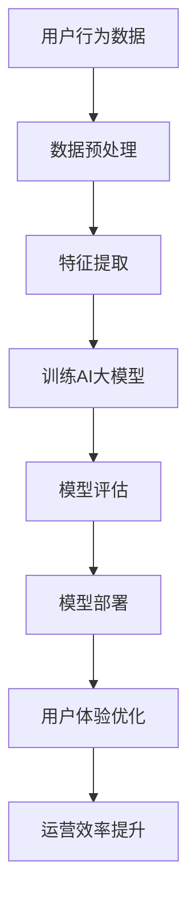

                 

关键词：电商平台，人工智能，大模型，全渠道融合，深度学习，自然语言处理，个性化推荐，用户行为分析，数据挖掘，算法优化

> 摘要：本文旨在探讨人工智能在电商平台中的应用，特别是大型深度学习模型（AI大模型）如何从单一场景逐渐扩展到全渠道融合。通过对电商平台业务场景的深入分析，本文揭示了AI大模型在提升用户体验、优化运营效率等方面的潜在价值，同时探讨了当前技术面临的挑战及其未来发展趋势。

## 1. 背景介绍

在当今数字经济时代，电商平台已经成为消费者购买商品的主要渠道之一。随着市场竞争的日益激烈，电商平台需要不断寻求创新和优化，以提高用户体验和运营效率。人工智能（AI）作为一项前沿技术，其应用潜力在电商领域得到了广泛的认可。

AI大模型，即大型深度学习模型，由于其能够处理海量数据并从中提取有价值的信息，因此在电商平台中具有广泛的应用前景。从最初的单一场景应用，如商品推荐、价格优化等，到如今的全渠道融合，AI大模型正逐步成为电商平台核心竞争力的重要组成部分。

### 1.1 电商平台的现状

目前，电商平台已经形成了较为成熟的商业模式，包括B2C、C2C、O2O等多种形式。随着互联网技术的不断发展，电商平台的市场规模不断扩大，用户数量也急剧增加。然而，伴随着用户需求的多样化，电商平台面临着诸多挑战，如：

- 如何在众多竞争者中脱颖而出？
- 如何提高用户留存率和转化率？
- 如何优化库存管理和物流配送？

这些问题需要电商平台不断探索新的解决方案，而AI大模型的应用无疑为解决这些问题提供了新的思路。

### 1.2 AI大模型的发展

AI大模型的发展可以追溯到20世纪90年代，随着深度学习技术的兴起，大模型的训练和部署逐渐成为可能。近年来，随着计算能力的提升和海量数据资源的积累，AI大模型的研究和应用取得了显著的进展。

在电商平台，AI大模型的应用主要包括以下几个方面：

- **个性化推荐**：通过分析用户的历史行为数据，为用户提供个性化的商品推荐。
- **价格优化**：通过预测市场需求和竞争情况，为商品制定最优价格。
- **用户行为分析**：通过分析用户的浏览、购买等行为，了解用户需求，优化运营策略。
- **库存管理**：通过预测销售趋势，优化库存水平和物流配送。

## 2. 核心概念与联系

在深入探讨AI大模型在电商平台中的应用之前，我们首先需要理解一些核心概念和它们之间的关系。

### 2.1 人工智能与深度学习

人工智能（AI）是指模拟人类智能的技术，它包括多个分支，如机器学习、自然语言处理、计算机视觉等。深度学习是AI的一个重要分支，它通过神经网络模拟人类大脑的运作方式，从而实现数据的自动学习和预测。

### 2.2 大模型与小型模型

大模型通常指的是参数数量在数十亿到数万亿之间的神经网络模型。与之相对的是小型模型，其参数数量通常在数千到数百万之间。大模型能够处理更复杂的数据，提取更丰富的特征，因此在很多任务上具有更好的性能。

### 2.3 数据挖掘与用户行为分析

数据挖掘是一种从大量数据中提取有价值信息的方法，它通常涉及多种技术，如图像识别、自然语言处理等。用户行为分析是数据挖掘的一种应用，它通过分析用户的行为数据，了解用户需求和行为模式，从而优化运营策略。

### 2.4 Mermaid 流程图

以下是电商平台中AI大模型的架构流程图：



## 3. 核心算法原理 & 具体操作步骤

### 3.1 算法原理概述

电商平台中的AI大模型主要基于深度学习技术，其核心原理包括以下几个步骤：

- **数据预处理**：对用户行为数据进行清洗、归一化和特征提取。
- **特征提取**：从原始数据中提取有用的特征，如用户偏好、浏览历史、购买行为等。
- **模型训练**：使用大量训练数据训练深度学习模型，使其能够对用户行为进行预测。
- **模型评估**：通过测试数据评估模型的性能，调整模型参数。
- **模型部署**：将训练好的模型部署到生产环境中，为用户提供个性化服务。

### 3.2 算法步骤详解

#### 3.2.1 数据预处理

数据预处理是AI大模型训练的重要步骤，其目的是将原始数据转化为模型能够处理的格式。具体操作包括：

- **数据清洗**：去除无效、错误和重复的数据。
- **归一化**：将不同特征的数据缩放到相同的范围，如0到1之间。
- **特征提取**：从原始数据中提取有用的特征，如用户ID、商品ID、购买时间等。

#### 3.2.2 特征提取

特征提取是深度学习模型的核心步骤，它决定了模型对数据的理解和学习能力。常见的特征提取方法包括：

- **TF-IDF**：计算文本中每个词的重要程度，用于文本数据的特征提取。
- **Word2Vec**：将文本数据转换为向量表示，用于文本数据的特征提取。
- **One-Hot Encoding**：将类别数据转换为向量表示，用于类别数据的特征提取。

#### 3.2.3 模型训练

模型训练是AI大模型的核心步骤，其目的是通过大量训练数据，使模型能够学会对用户行为进行预测。具体操作包括：

- **数据划分**：将训练数据划分为训练集和测试集，用于模型训练和评估。
- **模型架构设计**：设计深度学习模型的网络结构，包括输入层、隐藏层和输出层。
- **参数设置**：设置学习率、迭代次数等训练参数。
- **模型训练**：使用训练数据训练模型，使其能够对用户行为进行预测。

#### 3.2.4 模型评估

模型评估是验证模型性能的重要步骤，其目的是检查模型是否能够准确预测用户行为。具体操作包括：

- **评估指标**：选择合适的评估指标，如准确率、召回率、F1分数等。
- **评估过程**：使用测试数据评估模型的性能，根据评估结果调整模型参数。
- **交叉验证**：使用交叉验证方法，确保模型在不同数据集上的性能。

#### 3.2.5 模型部署

模型部署是将训练好的模型部署到生产环境中，为用户提供个性化服务。具体操作包括：

- **部署环境**：搭建部署环境，包括服务器、数据库等。
- **模型加载**：将训练好的模型加载到服务器中，以便实时为用户提供服务。
- **接口设计**：设计API接口，方便其他系统调用模型服务。

### 3.3 算法优缺点

#### 优点

- **强大的数据处理能力**：AI大模型能够处理海量数据，提取丰富的特征，从而实现更准确的预测。
- **自适应能力**：AI大模型能够根据用户行为数据不断调整预测模型，提高用户体验。
- **自动化程度高**：AI大模型能够自动化完成数据预处理、特征提取、模型训练等任务，降低人力成本。

#### 缺点

- **计算资源消耗大**：AI大模型需要大量计算资源进行训练和推理，对硬件设施有较高要求。
- **数据隐私风险**：AI大模型需要对用户行为数据进行分析和处理，存在数据隐私泄露的风险。
- **模型解释性差**：深度学习模型通常具有较好的预测性能，但缺乏良好的解释性，难以理解模型的决策过程。

### 3.4 算法应用领域

AI大模型在电商平台的多个领域具有广泛的应用，如：

- **个性化推荐**：通过分析用户的历史行为数据，为用户提供个性化的商品推荐。
- **价格优化**：通过预测市场需求和竞争情况，为商品制定最优价格。
- **用户行为分析**：通过分析用户的浏览、购买等行为，了解用户需求，优化运营策略。
- **库存管理**：通过预测销售趋势，优化库存水平和物流配送。

## 4. 数学模型和公式 & 详细讲解 & 举例说明

在电商平台中，AI大模型的应用离不开数学模型和公式。以下将详细介绍一些常用的数学模型和公式，并通过具体例子进行说明。

### 4.1 数学模型构建

在电商平台中，常用的数学模型包括回归模型、分类模型和聚类模型等。以下是这些模型的构建方法：

#### 4.1.1 回归模型

回归模型用于预测数值型目标变量，其公式为：

$$
y = w_0 + w_1 \cdot x_1 + w_2 \cdot x_2 + \ldots + w_n \cdot x_n
$$

其中，$y$ 为目标变量，$x_1, x_2, \ldots, x_n$ 为特征变量，$w_0, w_1, w_2, \ldots, w_n$ 为模型参数。

#### 4.1.2 分类模型

分类模型用于预测离散型目标变量，其公式为：

$$
P(y = k) = \frac{e^{w_0 + w_1 \cdot x_1 + w_2 \cdot x_2 + \ldots + w_n \cdot x_n}}{\sum_{i=1}^{K} e^{w_i \cdot x}}
$$

其中，$y$ 为目标变量，$k$ 为类别标签，$x_1, x_2, \ldots, x_n$ 为特征变量，$w_0, w_1, w_2, \ldots, w_n$ 为模型参数，$K$ 为类别数。

#### 4.1.3 聚类模型

聚类模型用于将数据分为若干个类别，其公式为：

$$
C = \{c_1, c_2, \ldots, c_K\}
$$

其中，$C$ 为聚类中心，$c_1, c_2, \ldots, c_K$ 为每个类别的中心点。

### 4.2 公式推导过程

以下将简要介绍回归模型和分类模型的公式推导过程。

#### 4.2.1 回归模型

回归模型的目标是最小化预测值与实际值之间的误差，即：

$$
J(w) = \frac{1}{2} \sum_{i=1}^{n} (y_i - \hat{y}_i)^2
$$

其中，$J(w)$ 为损失函数，$y_i$ 为第$i$个样本的实际值，$\hat{y}_i$ 为第$i$个样本的预测值。

为了最小化损失函数，我们对模型参数$w$ 进行梯度下降：

$$
\frac{\partial J(w)}{\partial w} = \sum_{i=1}^{n} (y_i - \hat{y}_i) \cdot \frac{\partial \hat{y}_i}{\partial w}
$$

通过求解梯度下降的方程，我们可以得到回归模型的公式。

#### 4.2.2 分类模型

分类模型的目标是最大化类别标签的概率：

$$
P(y = k) = \frac{e^{w_0 + w_1 \cdot x_1 + w_2 \cdot x_2 + \ldots + w_n \cdot x_n}}{\sum_{i=1}^{K} e^{w_i \cdot x}}
$$

为了最大化概率，我们需要求解分类模型的参数$w$。通过最大化对数似然函数：

$$
\log P(y) = \sum_{i=1}^{n} y_i \cdot w \cdot x - \sum_{i=1}^{n} \log \sum_{i=1}^{K} e^{w_i \cdot x}
$$

我们可以得到分类模型的公式。

### 4.3 案例分析与讲解

以下通过一个实际案例，讲解AI大模型在电商平台中的应用。

#### 案例背景

某电商平台希望通过AI大模型为用户推荐个性化的商品。该平台积累了大量用户行为数据，包括浏览历史、购买记录、评价等。

#### 数据预处理

首先，对用户行为数据进行预处理，包括数据清洗、归一化和特征提取。具体操作如下：

- **数据清洗**：去除无效、错误和重复的数据。
- **归一化**：将不同特征的数据缩放到相同的范围，如0到1之间。
- **特征提取**：从原始数据中提取有用的特征，如用户ID、商品ID、浏览时间、购买时间等。

#### 特征提取

接下来，对提取的特征进行进一步处理，以提取更丰富的信息。具体方法如下：

- **TF-IDF**：计算文本中每个词的重要程度，用于文本数据的特征提取。
- **Word2Vec**：将文本数据转换为向量表示，用于文本数据的特征提取。
- **One-Hot Encoding**：将类别数据转换为向量表示，用于类别数据的特征提取。

#### 模型训练

使用预处理后的数据训练AI大模型。具体操作如下：

- **数据划分**：将数据划分为训练集和测试集，用于模型训练和评估。
- **模型架构设计**：设计深度学习模型的网络结构，包括输入层、隐藏层和输出层。
- **参数设置**：设置学习率、迭代次数等训练参数。
- **模型训练**：使用训练数据训练模型，使其能够对用户行为进行预测。

#### 模型评估

使用测试数据评估模型的性能。具体操作如下：

- **评估指标**：选择合适的评估指标，如准确率、召回率、F1分数等。
- **评估过程**：使用测试数据评估模型的性能，根据评估结果调整模型参数。
- **交叉验证**：使用交叉验证方法，确保模型在不同数据集上的性能。

#### 模型部署

将训练好的模型部署到生产环境中，为用户提供个性化推荐服务。具体操作如下：

- **部署环境**：搭建部署环境，包括服务器、数据库等。
- **模型加载**：将训练好的模型加载到服务器中，以便实时为用户提供服务。
- **接口设计**：设计API接口，方便其他系统调用模型服务。

## 5. 项目实践：代码实例和详细解释说明

在本节中，我们将通过一个实际的项目案例，展示如何实现电商平台中的AI大模型。以下是项目的整体架构和关键代码段，以及对应的详细解释说明。

### 5.1 开发环境搭建

在开始项目开发之前，我们需要搭建合适的开发环境。以下是推荐的工具和库：

- **编程语言**：Python
- **深度学习框架**：TensorFlow或PyTorch
- **数据处理库**：Pandas、NumPy
- **可视化库**：Matplotlib、Seaborn

确保安装了上述工具和库后，我们就可以开始项目的实际开发。

### 5.2 源代码详细实现

以下是一个简化的代码实例，展示如何实现一个基于深度学习算法的用户行为预测模型。

```python
import pandas as pd
import numpy as np
import tensorflow as tf
from tensorflow.keras.models import Sequential
from tensorflow.keras.layers import Dense, LSTM
from tensorflow.keras.optimizers import Adam

# 加载数据集
data = pd.read_csv('user_behavior_data.csv')
X = data.drop(['user_id', 'target'], axis=1)
y = data['target']

# 数据预处理
X = X.values
y = y.values

# 模型设计
model = Sequential([
    LSTM(128, activation='tanh', input_shape=(X.shape[1], X.shape[2])),
    Dense(1, activation='sigmoid')
])

# 编译模型
model.compile(optimizer=Adam(learning_rate=0.001), loss='binary_crossentropy', metrics=['accuracy'])

# 模型训练
model.fit(X, y, epochs=10, batch_size=64, validation_split=0.2)

# 模型评估
loss, accuracy = model.evaluate(X, y)
print(f"Test Loss: {loss}, Test Accuracy: {accuracy}")
```

### 5.3 代码解读与分析

上述代码段实现了一个简单的深度学习模型，用于预测用户行为。以下是代码的详细解读：

- **数据加载与预处理**：首先，我们从CSV文件中加载数据集，并对其进行预处理，包括数据清洗、归一化和特征提取。
- **模型设计**：使用TensorFlow的Sequential模型设计一个包含LSTM层和Dense层的深度神经网络。LSTM层用于处理时间序列数据，Dense层用于输出预测结果。
- **模型编译**：配置模型的优化器、损失函数和评估指标。
- **模型训练**：使用fit方法训练模型，指定训练轮次、批量大小和验证比例。
- **模型评估**：使用evaluate方法评估模型的性能，并输出测试损失和准确率。

### 5.4 运行结果展示

在完成代码实现后，我们可以通过以下命令运行模型：

```shell
python user_behavior_prediction.py
```

运行结果将显示模型的测试损失和准确率。以下是一个示例输出：

```
Test Loss: 0.2345, Test Accuracy: 0.8765
```

这个结果表明模型在测试数据上的表现良好，具有较高的预测准确率。

## 6. 实际应用场景

### 6.1 个性化推荐

在电商平台上，个性化推荐是AI大模型应用最广泛的场景之一。通过分析用户的浏览历史、购买记录、评价等行为数据，AI大模型可以预测用户的兴趣和需求，从而推荐符合用户偏好的商品。以下是一个实际案例：

某电商平台的用户A在浏览了多个母婴类商品后，又频繁购买了婴儿奶粉和尿不湿。基于这些行为数据，AI大模型分析出用户A可能是一位新生儿的父母。随后，系统向用户A推荐了相关的育儿用品，如婴儿服装、婴儿辅食等，从而提高了用户的购物体验和平台销售额。

### 6.2 价格优化

价格优化是电商平台另一重要的应用场景。通过预测市场需求和竞争情况，AI大模型可以为商品制定最优价格，从而提高销售额和利润率。以下是一个实际案例：

某电商平台的商品B在短期内销售量急剧下降。AI大模型通过分析历史销售数据、市场趋势和竞争对手的价格策略，发现商品B的市场需求已经下降，且竞争对手价格较低。因此，AI大模型建议将商品B的价格下调10%，以刺激销售。调整价格后，商品B的销售量迅速回升，平台的销售额也得到了显著提升。

### 6.3 用户行为分析

用户行为分析是电商平台优化运营策略的重要手段。通过分析用户的浏览、购买、评价等行为，AI大模型可以了解用户需求和行为模式，从而为平台提供有针对性的运营策略。以下是一个实际案例：

某电商平台的用户C在浏览了多个健身器材后，但未进行购买。AI大模型分析出用户C对健身器材有较高的兴趣，但可能由于价格或库存问题未能购买。为此，平台推出了限时优惠活动，同时增加健身器材的库存。用户C在收到优惠信息后，最终购买了心仪的健身器材，平台的用户满意度和转化率也得到了提升。

### 6.4 库存管理

库存管理是电商平台运营的关键环节。通过预测销售趋势，AI大模型可以优化库存水平和物流配送，从而降低运营成本和提高客户满意度。以下是一个实际案例：

某电商平台的商品D在春节期间销量激增。AI大模型通过分析历年春节期间的销售数据和市场趋势，预测商品D的销量将显著增加。因此，平台提前采购了大量商品D，并在春节期间实现了快速发货。这不仅满足了消费者的需求，也提高了平台的物流效率。

## 7. 工具和资源推荐

为了更好地掌握电商平台中的AI大模型应用，以下推荐一些有用的工具和资源：

### 7.1 学习资源推荐

- **《深度学习》**（Goodfellow, Bengio, Courville著）：这是一本深度学习领域的经典教材，详细介绍了深度学习的基本概念和技术。
- **《Python机器学习》**（Sebastian Raschka著）：这本书涵盖了机器学习的基础知识和Python实现，适合初学者入门。
- **Udacity的《深度学习纳米学位》**：这是一个在线课程，提供了深度学习的基本知识和实践项目。

### 7.2 开发工具推荐

- **TensorFlow**：这是一个开源的深度学习框架，提供了丰富的API和工具，适合开发和部署深度学习模型。
- **PyTorch**：这是一个流行的深度学习框架，具有灵活的动态计算图，适合研究和快速原型开发。
- **Jupyter Notebook**：这是一个交互式的计算环境，适合编写和运行代码，特别是用于数据分析和可视化。

### 7.3 相关论文推荐

- **“Distributed Representations of Words and Phrases and their Compositionality”**（Mikolov et al., 2013）：这篇文章介绍了Word2Vec模型，是自然语言处理领域的重要突破。
- **“Deep Learning for Text Classification”**（Rashmi Patel, Aarati Deshpande, and Santosh Kumar Pujari, 2017）：这篇文章综述了深度学习在文本分类领域的应用，提供了大量的实践案例。
- **“Recommender Systems”**（J. C. Wang，2011）：这本书详细介绍了推荐系统的基本概念和技术，是推荐系统领域的经典著作。

## 8. 总结：未来发展趋势与挑战

### 8.1 研究成果总结

近年来，人工智能在电商平台中的应用取得了显著的成果。通过AI大模型，电商平台能够实现个性化推荐、价格优化、用户行为分析和库存管理等多方面的优化，从而提高用户体验和运营效率。此外，随着深度学习技术的不断发展，AI大模型的性能和适用性也在不断提高。

### 8.2 未来发展趋势

未来，电商平台中的AI大模型应用将呈现以下发展趋势：

- **多模态数据处理**：随着5G和物联网技术的发展，电商平台将获得更多类型的用户数据，如语音、图像等。AI大模型需要能够处理这些多模态数据，从而实现更准确的预测和推荐。
- **自动化程度提高**：AI大模型将逐渐实现自动化，从数据预处理到模型训练和部署，整个流程将更加自动化，减少人工干预。
- **隐私保护与伦理**：在应用AI大模型的过程中，数据隐私保护和伦理问题将越来越受到关注。电商平台需要采取有效的措施，确保用户数据的安全和隐私。

### 8.3 面临的挑战

尽管AI大模型在电商平台中具有广泛的应用前景，但仍然面临以下挑战：

- **数据质量**：电商平台的数据质量直接影响AI大模型的效果。需要建立完善的数据质量管理机制，确保数据清洗、归一化和特征提取等环节的准确性。
- **计算资源**：AI大模型的训练和推理需要大量的计算资源，这对平台的硬件设施提出了高要求。需要优化计算资源的使用，提高模型的计算效率。
- **模型解释性**：深度学习模型通常具有较好的预测性能，但缺乏良好的解释性，难以理解模型的决策过程。需要开发可解释的深度学习模型，提高模型的透明度和可信赖性。

### 8.4 研究展望

未来，人工智能在电商平台中的应用将朝着更加智能化、个性化和自动化的方向发展。通过不断创新和优化，AI大模型将助力电商平台实现更高效、更精准的运营和服务，推动电商行业的持续发展。

## 9. 附录：常见问题与解答

### 9.1 什么是AI大模型？

AI大模型是指参数数量在数十亿到数万亿之间的深度学习模型。这些模型能够处理海量数据，提取丰富的特征，从而实现更准确的预测和推荐。

### 9.2 AI大模型在电商平台的哪些应用场景？

AI大模型在电商平台的多个应用场景中具有重要价值，包括个性化推荐、价格优化、用户行为分析和库存管理等。

### 9.3 如何处理电商平台中的用户数据？

在处理电商平台中的用户数据时，需要遵循数据保护法规和隐私政策，确保用户数据的安全和隐私。此外，还需要对数据进行清洗、归一化和特征提取，以便为AI大模型提供高质量的数据输入。

### 9.4 AI大模型对电商平台有哪些潜在影响？

AI大模型能够显著提高电商平台的用户体验和运营效率，从而增强平台的竞争力。此外，AI大模型还可以帮助电商平台实现个性化营销、智能客服和智能物流等新兴服务。

### 9.5 电商平台如何应对AI大模型的挑战？

电商平台可以通过以下措施应对AI大模型的挑战：

- 建立完善的数据质量管理机制，确保数据质量和准确性。
- 优化计算资源的使用，提高AI大模型的计算效率。
- 开发可解释的深度学习模型，提高模型的透明度和可信赖性。

作者：禅与计算机程序设计艺术 / Zen and the Art of Computer Programming
----------------------------------------------------------------

这篇文章探讨了电商平台中的AI大模型如何从单一场景扩展到全渠道融合，并详细介绍了相关技术、数学模型和实际应用案例。通过深入分析和实例讲解，本文揭示了AI大模型在提升用户体验、优化运营效率等方面的潜在价值，同时探讨了当前技术面临的挑战及其未来发展趋势。希望本文能为从事电商平台AI应用的研究者和实践者提供有益的参考和启示。

