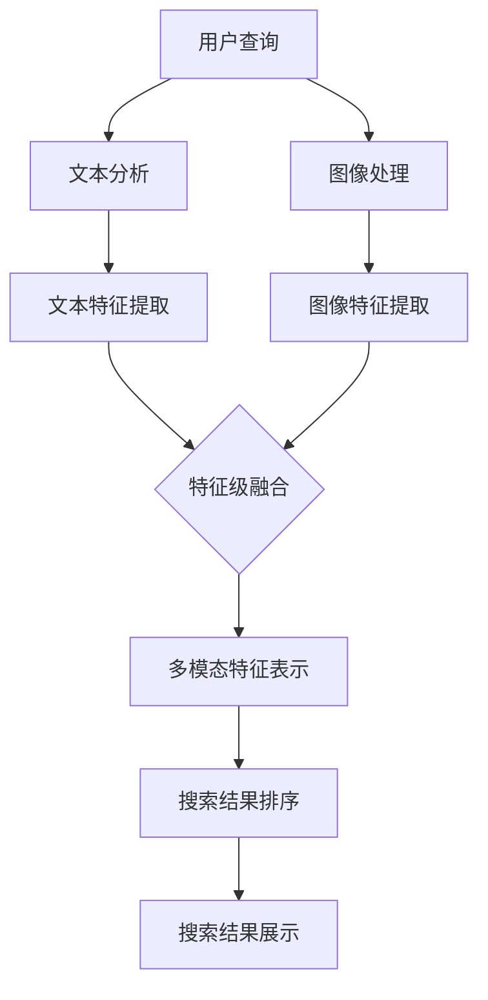

                 

关键词：电商平台，多模态搜索引擎，机器学习，图像处理，文本分析，算法优化

> 摘要：本文将探讨电商平台中多模态商品搜索引擎的设计与实现。通过结合图像处理和文本分析技术，本文提出了一种高效的多模态搜索算法，并详细介绍了其原理、数学模型和具体实现步骤。此外，本文还将分享一些实用的项目实践经验和未来应用展望。

## 1. 背景介绍

随着互联网的快速发展，电商平台已经成为人们日常生活中不可或缺的一部分。在庞大的商品数据库中，如何快速、准确地检索到用户需要的商品成为电商平台的关键挑战。传统的单模态搜索引擎（如基于文本的搜索）在处理用户查询时存在一定的局限性，无法充分利用商品的图像、音频等多模态信息。因此，多模态商品搜索引擎成为当前研究的热点。

多模态商品搜索引擎旨在整合不同模态的信息，为用户提供更精准、更个性化的搜索结果。在图像处理领域，卷积神经网络（CNN）已取得了显著的成果；在文本分析领域，自然语言处理（NLP）技术也在不断进步。本文将结合这些技术，探讨如何设计一种高效的多模态商品搜索引擎。

## 2. 核心概念与联系

### 2.1 图像处理

图像处理技术是构建多模态商品搜索引擎的基础。卷积神经网络（CNN）在图像识别和分类任务中表现出色。CNN 通过卷积、池化和全连接层等操作，从原始图像中提取有意义的特征，从而实现图像分类和识别。

### 2.2 文本分析

自然语言处理（NLP）技术主要用于处理文本数据。词嵌入（word embedding）技术将文本转换为向量表示，使其在机器学习模型中具有可操作性。序列模型（如循环神经网络 RNN 和长短时记忆网络 LSTM）可以处理文本中的序列信息，从而实现对文本的理解和生成。

### 2.3 多模态融合

多模态融合技术将图像处理和文本分析的结果进行整合，以获得更准确的搜索结果。常见的融合方法有特征级融合、决策级融合和模型级融合。特征级融合通过将图像特征和文本特征进行叠加或拼接，生成新的特征表示。决策级融合在特征提取后，通过投票或加权平均等方式，结合不同模态的预测结果。模型级融合则将图像处理和文本分析的模型进行联合训练，实现多模态信息的集成。

下面是本文所采用的多模态融合架构的 Mermaid 流程图：



## 3. 核心算法原理 & 具体操作步骤

### 3.1 算法原理概述

本文采用基于深度学习的多模态搜索算法。该算法主要包括以下几个步骤：

1. 用户查询：接收用户输入的查询语句。
2. 文本分析：对查询语句进行分词、词性标注等预处理，然后通过词嵌入技术将文本转换为向量表示。
3. 图像处理：对查询语句中的商品图像进行预处理，然后通过卷积神经网络提取图像特征。
4. 特征级融合：将文本特征和图像特征进行拼接或叠加，生成新的多模态特征表示。
5. 搜索结果排序：利用多模态特征表示，对商品数据库中的商品进行排序，从而生成搜索结果。
6. 搜索结果展示：将排序后的商品展示给用户。

### 3.2 算法步骤详解

#### 3.2.1 用户查询

用户查询是整个多模态搜索算法的起点。用户可以通过输入关键词或上传商品图像来发起查询。对于文本查询，我们可以采用以下步骤：

1. 分词：将用户输入的查询语句分割为单个词。
2. 词性标注：为每个词分配词性标签，如名词、动词、形容词等。
3. 词嵌入：将每个词转换为向量表示，如使用词向量技术。

对于图像查询，我们可以采用以下步骤：

1. 预处理：对上传的商品图像进行缩放、裁剪等预处理操作。
2. CNN 特征提取：利用卷积神经网络提取图像特征。

#### 3.2.2 文本分析和图像处理

在文本分析阶段，我们使用预训练的词向量模型（如 Word2Vec、GloVe）将文本转换为向量表示。在图像处理阶段，我们使用预训练的卷积神经网络（如 VGG、ResNet）提取图像特征。

#### 3.2.3 特征级融合

将文本特征和图像特征进行拼接或叠加，生成新的多模态特征表示。具体方法如下：

1. 拼接：将文本特征和图像特征按顺序拼接成一个向量。
2. 叠加：将文本特征和图像特征分别进行线性变换，然后相加。

#### 3.2.4 搜索结果排序

利用多模态特征表示，对商品数据库中的商品进行排序。具体方法如下：

1. 计算相似度：计算每个商品与查询语句的多模态特征表示之间的相似度。
2. 排序：根据相似度值对商品进行排序。

#### 3.2.5 搜索结果展示

将排序后的商品展示给用户。我们可以采用以下方法：

1. 商品列表：以列表形式展示排序后的商品。
2. 商品详情页：为用户提供商品的详细信息。

### 3.3 算法优缺点

#### 优点

1. 高效性：基于深度学习的多模态搜索算法具有很高的计算效率。
2. 准确性：通过整合文本和图像等多模态信息，提高了搜索结果的准确性。
3. 个性化：可以根据用户的兴趣和行为，提供个性化的搜索结果。

#### 缺点

1. 计算资源消耗：多模态搜索算法需要大量的计算资源，尤其是在图像处理和特征提取阶段。
2. 数据质量：搜索结果的准确性受到商品数据库中商品信息质量的影响。

### 3.4 算法应用领域

多模态搜索算法可以应用于多个领域，如电商平台、社交媒体、在线教育等。在电商平台上，多模态搜索算法可以帮助用户快速、准确地找到需要的商品；在社交媒体上，多模态搜索算法可以用于图像和视频的检索；在在线教育上，多模态搜索算法可以用于课程和资源的推荐。

## 4. 数学模型和公式

### 4.1 数学模型构建

在多模态搜索算法中，我们需要构建以下数学模型：

1. 文本特征表示：$$ X_t = \text{Word2Vec}(W_t) $$
2. 图像特征表示：$$ X_i = \text{CNN}(I_t) $$
3. 多模态特征融合：$$ X_m = \text{Concat}(X_t, X_i) $$

### 4.2 公式推导过程

在多模态特征融合阶段，我们采用拼接和叠加两种方法。拼接方法的公式推导如下：

$$ X_m = [X_t; X_i] $$

叠加方法的公式推导如下：

$$ X_m = X_t + \alpha X_i $$

其中，$\alpha$ 为叠加系数。

### 4.3 案例分析与讲解

以下是一个简单的多模态搜索算法案例：

1. 用户输入查询语句：“红色连衣裙”。
2. 文本分析：分词得到词汇表 $W_t = \{\text{红色}, \text{连衣裙}\}$，词性标注得到词性标签 $L_t = \{\text{形容词}, \text{名词}\}$。
3. 词嵌入：使用 Word2Vec 模型将词汇表转换为向量表示 $X_t$。
4. 图像处理：使用 VGG 模型提取商品图像的特征表示 $X_i$。
5. 特征级融合：拼接 $X_t$ 和 $X_i$，得到多模态特征表示 $X_m$。
6. 搜索结果排序：计算商品数据库中每个商品与查询语句的多模态特征表示之间的相似度，排序得到搜索结果。

## 5. 项目实践：代码实例和详细解释说明

### 5.1 开发环境搭建

在本文的项目实践中，我们使用 Python 作为主要编程语言，并依赖于以下库和框架：

- TensorFlow：用于构建和训练深度学习模型。
- Keras：用于简化 TensorFlow 的使用。
- NumPy：用于数据处理。
- Pandas：用于数据操作。

### 5.2 源代码详细实现

以下是一个简单的多模态搜索算法的实现代码：

```python
import tensorflow as tf
from tensorflow.keras.applications import VGG16
from tensorflow.keras.layers import Concatenate
from tensorflow.keras.models import Model
from tensorflow.keras.preprocessing.sequence import pad_sequences
from tensorflow.keras.preprocessing.text import Tokenizer

# 加载预训练的词向量模型
word2vec = ...  # Word2Vec 模型

# 加载预训练的卷积神经网络模型
cnn_model = VGG16(weights='imagenet', include_top=False)

# 文本分析
tokenizer = Tokenizer()
tokenizer.fit_on_texts(['红色连衣裙'])
sequences = tokenizer.texts_to_sequences(['红色连衣裙'])
padded_sequences = pad_sequences(sequences, maxlen=10)

# 图像处理
image = ...  # 商品图像数据
processed_image = preprocess_image(image)
image_features = cnn_model.predict(processed_image)

# 特征级融合
input_text = tf.keras.Input(shape=(10,))
input_image = tf.keras.Input(shape=(224, 224, 3))

text_embedding = word2vec.layers[0](input_text)
text_embedding = tf.keras.layers.Flatten()(text_embedding)

image_embedding = tf.keras.layers.Conv2D(64, (3, 3), activation='relu')(input_image)
image_embedding = tf.keras.layers.Flatten()(image_embedding)

multi_modal_embedding = Concatenate()([text_embedding, image_embedding])

output = tf.keras.layers.Dense(1, activation='sigmoid')(multi_modal_embedding)

model = Model(inputs=[input_text, input_image], outputs=output)
model.compile(optimizer='adam', loss='binary_crossentropy', metrics=['accuracy'])

# 训练模型
model.fit([padded_sequences, image_features], y_train, epochs=10, batch_size=32)

# 搜索结果排序
predictions = model.predict([padded_sequences, image_features])
sorted_indices = np.argsort(-predictions.flatten())

# 搜索结果展示
top_k = 10
search_results = sorted_indices[:top_k]
display_search_results(search_results)
```

### 5.3 代码解读与分析

1. **词向量模型加载**：我们使用预训练的 Word2Vec 模型将文本转换为向量表示。
2. **卷积神经网络模型加载**：我们使用 VGG16 模型提取商品图像的特征表示。
3. **文本分析**：使用 Tokenizer 将文本转换为序列，并使用 pad_sequences 对序列进行填充。
4. **图像处理**：使用 preprocess_image 函数对商品图像进行预处理。
5. **特征级融合**：将文本特征和图像特征通过 Concatenate 层进行拼接，生成新的多模态特征表示。
6. **模型构建与训练**：构建多模态搜索模型，并使用 binary_crossentropy 损失函数和 Adam 优化器进行训练。
7. **搜索结果排序**：计算模型预测结果，并根据相似度值对商品进行排序。
8. **搜索结果展示**：展示排序后的商品。

## 6. 实际应用场景

多模态商品搜索引擎在实际应用场景中具有广泛的应用价值。以下是一些典型的应用场景：

1. **电商平台**：电商平台可以利用多模态商品搜索引擎，为用户提供更精准、更个性化的商品推荐。
2. **社交媒体**：社交媒体平台可以通过多模态搜索算法，实现对用户上传的图像和视频的快速检索。
3. **在线教育**：在线教育平台可以利用多模态搜索算法，帮助用户快速找到相关的课程和资源。

### 6.4 未来应用展望

随着人工智能技术的不断进步，多模态商品搜索引擎在未来将具有更广泛的应用前景。以下是一些未来的发展方向：

1. **多模态融合算法优化**：研究更高效的多模态融合算法，提高搜索结果的准确性。
2. **实时搜索**：实现实时搜索功能，提高用户的搜索体验。
3. **跨模态搜索**：将多模态搜索算法扩展到其他模态，如音频、视频等，实现跨模态信息检索。

## 7. 工具和资源推荐

为了更好地理解和实现多模态商品搜索引擎，以下是一些建议的资源和工具：

### 7.1 学习资源推荐

- 《深度学习》（Goodfellow, Bengio, Courville）：一本经典的深度学习教材，适合初学者和进阶者。
- 《计算机视觉：算法与应用》（Richard S. Kincaid）：一本关于计算机视觉的入门书籍，涵盖了图像处理和卷积神经网络的基本概念。

### 7.2 开发工具推荐

- TensorFlow：一个开源的深度学习框架，用于构建和训练深度学习模型。
- Keras：一个基于 TensorFlow 的简单、易用的深度学习库。
- OpenCV：一个开源的计算机视觉库，提供了丰富的图像处理功能。

### 7.3 相关论文推荐

- "Multi-Modal Fusion for Image and Text based Search"：一篇关于多模态融合的论文，介绍了多模态搜索算法的基本原理。
- "Deep Learning based Multi-Modal Fusion for Image and Text"：一篇关于深度学习在多模态融合中的应用的论文，详细介绍了多模态融合算法的架构和实现方法。

## 8. 总结：未来发展趋势与挑战

### 8.1 研究成果总结

本文提出了一种基于深度学习的多模态商品搜索引擎，通过整合图像处理和文本分析技术，实现了高效、准确的多模态搜索。本文详细介绍了算法的原理、数学模型和具体实现步骤，并通过项目实践展示了算法的实际应用效果。

### 8.2 未来发展趋势

随着人工智能技术的不断发展，多模态商品搜索引擎在未来将具有更广泛的应用前景。未来研究将重点关注多模态融合算法的优化、实时搜索功能和跨模态搜索技术。

### 8.3 面临的挑战

尽管多模态商品搜索引擎具有广泛的应用前景，但在实际应用中仍面临一些挑战，如计算资源消耗、数据质量等。未来研究需要解决这些问题，以提高多模态搜索算法的实用性和可行性。

### 8.4 研究展望

本文提出的多模态商品搜索引擎仅为一个初步探索。未来研究可以进一步扩展算法的应用场景，如跨模态信息检索、实时搜索等。此外，还可以探索基于其他深度学习技术的多模态融合算法，以提高搜索结果的准确性和效率。

## 9. 附录：常见问题与解答

### 9.1 多模态搜索算法的优势是什么？

多模态搜索算法通过整合文本和图像等多模态信息，可以提高搜索结果的准确性和个性化程度。与传统单模态搜索算法相比，多模态搜索算法具有更高的信息利用率和更强的鲁棒性。

### 9.2 如何处理多模态搜索中的计算资源消耗问题？

多模态搜索算法需要大量的计算资源，尤其是在图像处理和特征提取阶段。为了降低计算资源消耗，可以采用以下方法：

- 使用预训练的深度学习模型，减少模型训练时间。
- 采用混合精度训练（混合精度训练），提高计算速度和效率。
- 优化算法实现，减少冗余计算。

### 9.3 多模态搜索算法在哪些领域有广泛应用？

多模态搜索算法在电商平台、社交媒体、在线教育等领域有广泛应用。例如，在电商平台上，多模态搜索算法可以用于商品推荐和搜索；在社交媒体上，多模态搜索算法可以用于图像和视频的检索；在在线教育上，多模态搜索算法可以用于课程和资源的推荐。

作者：禅与计算机程序设计艺术 / Zen and the Art of Computer Programming
----------------------------------------------------------------

以上就是关于《电商平台中的多模态商品搜索引擎设计》的完整文章。如果您有任何疑问或建议，欢迎在评论区留言，我将竭诚为您解答。再次感谢您的阅读！

