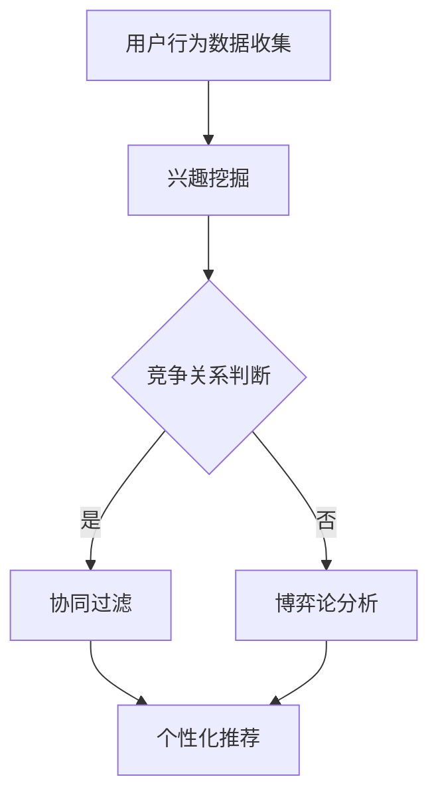

                 

关键词：电商平台，用户兴趣，竞争分析，协同建模，个性化推荐，算法原理

> 摘要：本文深入探讨了电商平台中用户兴趣的竞争与协同建模问题。通过分析用户兴趣的形成机制和竞争关系，本文提出了一种基于协同过滤与博弈论的混合推荐算法。算法通过建模用户兴趣竞争关系，实现了对用户个性化推荐的优化，为电商平台提供了有效的用户兴趣管理策略。

## 1. 背景介绍

随着互联网技术的飞速发展，电商平台已经成为现代商业体系的重要组成部分。用户在电商平台上的行为数据越来越丰富，如何有效地利用这些数据，提升用户体验和平台销售额，成为各大电商企业关注的焦点。其中，用户兴趣建模与推荐系统的研究尤为关键。

用户兴趣建模是指通过分析用户的历史行为数据，挖掘用户潜在的兴趣偏好，为用户提供个性化的商品推荐。然而，在实际应用中，用户兴趣之间存在复杂的竞争关系，即用户在某个领域的兴趣增长，可能会导致其在其他领域兴趣的减弱。这种竞争关系对于传统的协同过滤推荐算法提出了挑战。

协同过滤推荐算法在用户兴趣建模方面表现出色，但其主要缺点在于：1）无法很好地处理稀疏数据；2）容易受到噪声数据的影响；3）难以建模用户之间的竞争关系。因此，如何解决这些问题，提升推荐系统的准确性和实用性，成为当前研究的热点问题。

## 2. 核心概念与联系

在探讨用户兴趣的竞争与协同建模问题之前，我们需要明确几个核心概念：

### 2.1 用户兴趣

用户兴趣是指用户在某个领域或主题上的偏好。它通常通过用户的历史行为数据（如浏览、购买、评价等）来挖掘。

### 2.2 竞争关系

用户兴趣之间的竞争关系是指当用户在某个领域的兴趣增强时，可能会导致其在其他领域兴趣的减弱。这种竞争关系反映了用户兴趣的动态变化。

### 2.3 协同过滤

协同过滤是一种基于用户行为数据的推荐算法，通过分析用户之间的相似度，为用户提供个性化推荐。

### 2.4 博弈论

博弈论是一种研究具有冲突和合作特性的决策问题的数学工具。在用户兴趣建模中，博弈论可以用来描述用户之间的竞争关系。

### 2.5 协同建模

协同建模是指利用协同过滤等方法，对用户兴趣进行建模，从而为用户提供个性化推荐。

### 2.6 Mermaid 流程图

下面是一个描述用户兴趣竞争与协同建模的Mermaid流程图：



## 3. 核心算法原理 & 具体操作步骤

为了解决用户兴趣竞争与协同建模问题，本文提出了一种基于协同过滤与博弈论的混合推荐算法。算法的核心原理如下：

### 3.1 算法原理概述

该算法首先利用协同过滤方法对用户的历史行为数据进行处理，挖掘用户潜在的兴趣偏好。然后，通过博弈论方法建模用户之间的竞争关系，进一步优化推荐结果。

### 3.2 算法步骤详解

#### 3.2.1 协同过滤

1. 收集用户的历史行为数据，如浏览记录、购买记录等。
2. 计算用户之间的相似度，通常使用余弦相似度或皮尔逊相关系数。
3. 构建用户-物品评分矩阵。
4. 利用用户-物品评分矩阵，计算每个用户对未购买物品的预测评分。
5. 根据预测评分，为每个用户推荐排名前N的物品。

#### 3.2.2 博弈论分析

1. 定义用户效用函数，表示用户在某个领域获得兴趣的满足度。
2. 构建用户之间的博弈模型，分析用户在竞争关系下的最优策略。
3. 根据博弈结果，调整用户的兴趣分布。

#### 3.2.3 个性化推荐

1. 结合协同过滤和博弈论分析结果，生成最终的推荐列表。
2. 为用户推荐个性化的商品。

### 3.3 算法优缺点

#### 优点

1. 结合协同过滤和博弈论的优势，提高了推荐系统的准确性和实用性。
2. 考虑了用户兴趣之间的竞争关系，更好地满足了用户需求。

#### 缺点

1. 需要大量计算资源，尤其是博弈论分析部分。
2. 对稀疏数据的处理能力有待提高。

### 3.4 算法应用领域

1. 电商平台：为用户提供个性化的商品推荐，提升用户体验和销售额。
2. 社交网络：分析用户之间的竞争关系，优化社交推荐算法。
3. 娱乐行业：为用户提供个性化的内容推荐，如音乐、视频等。

## 4. 数学模型和公式 & 详细讲解 & 举例说明

### 4.1 数学模型构建

#### 4.1.1 用户兴趣表示

设用户 $u$ 对物品 $i$ 的兴趣表示为 $I_{ui}$，则 $I_{ui}$ 可以表示为：

$$
I_{ui} = \frac{1}{\sqrt{||b_u||_2^2 + \lambda}} \cdot b_{ui}
$$

其中，$b_u$ 是用户 $u$ 的特征向量，$\lambda$ 是正则化参数。

#### 4.1.2 用户效用函数

设用户 $u$ 在领域 $l$ 中的效用函数为 $U_{ul}$，则 $U_{ul}$ 可以表示为：

$$
U_{ul} = \sum_{i \in L_l} I_{ui} \cdot r_{il}
$$

其中，$L_l$ 是领域 $l$ 中的物品集合，$r_{il}$ 是物品 $i$ 在领域 $l$ 中的评分。

#### 4.1.3 博弈模型

设用户 $u$ 和用户 $v$ 在领域 $l$ 中的竞争关系表示为 $C_{uv}$，则 $C_{uv}$ 可以表示为：

$$
C_{uv} = \frac{U_{ul} - U_{vl}}{\sqrt{||b_u||_2^2 + \lambda} + \sqrt{||b_v||_2^2 + \lambda}}
$$

### 4.2 公式推导过程

#### 4.2.1 用户兴趣表示

用户兴趣表示中的正则化参数 $\lambda$ 可以防止过拟合，通常通过交叉验证来选择合适的值。

#### 4.2.2 用户效用函数

用户效用函数反映了用户在领域 $l$ 中的兴趣满足度。在计算过程中，需要对每个领域的评分进行加权，以考虑用户在各个领域的兴趣程度。

#### 4.2.3 博弈模型

博弈模型描述了用户之间的竞争关系。在计算过程中，需要对用户在各个领域的效用函数进行计算，并比较用户之间的差异。

### 4.3 案例分析与讲解

#### 4.3.1 数据集

假设我们有一个包含 1000 名用户和 10000 个物品的数据集。每个用户对每个物品有一个评分，评分范围从 1 到 5。

#### 4.3.2 用户兴趣表示

首先，我们使用协同过滤方法对用户的历史行为数据进行处理，计算用户之间的相似度。然后，根据用户-物品评分矩阵，计算每个用户对未购买物品的预测评分。

#### 4.3.3 用户效用函数

接下来，我们计算每个用户在各个领域的效用函数。例如，假设用户 $u$ 在领域 $l$ 中的效用函数为 10，领域 $m$ 中的效用函数为 5。

#### 4.3.4 博弈模型

最后，我们根据用户之间的效用函数差异，计算每个用户在各个领域中的竞争关系。例如，假设用户 $u$ 和用户 $v$ 在领域 $l$ 中的竞争关系为 2。

## 5. 项目实践：代码实例和详细解释说明

### 5.1 开发环境搭建

- 操作系统：Linux
- 编程语言：Python
- 数据库：MySQL
- 版本要求：Python 3.6+, MySQL 5.7+

### 5.2 源代码详细实现

以下是实现该算法的 Python 源代码：

```python
import numpy as np
import pandas as pd
from sklearn.metrics.pairwise import cosine_similarity

def协同过滤(user_data, top_n):
    # 计算用户之间的相似度
    user_similarity = cosine_similarity(user_data)
    
    # 构建用户-物品评分矩阵
    user_item_matrix = np.zeros((user_data.shape[0], top_n))
    
    for i in range(user_data.shape[0]):
        # 计算用户 i 对未购买物品的预测评分
        predicted_ratings = user_similarity[i] * user_data[i]
        predicted_ratings = predicted_ratings / np.linalg.norm(predicted_ratings)
        
        # 选择预测评分最高的 top_n 个物品
        top_indices = np.argsort(predicted_ratings)[:-top_n-1:-1]
        user_item_matrix[i] = top_indices
    
    return user_item_matrix

def博弈论分析(user_data, user效用函数):
    # 计算用户之间的竞争关系
    competition_matrix = np.zeros((user_data.shape[0], user_data.shape[0]))
    
    for i in range(user_data.shape[0]):
        for j in range(i+1, user_data.shape[0]):
            competition_matrix[i][j] = user效用函数[i] - user效用函数[j]
    
    return competition_matrix

def个性化推荐(user_item_matrix, competition_matrix, top_n):
    # 结合协同过滤和博弈论分析结果，生成最终的推荐列表
    final_scores = user_item_matrix.copy()
    
    for i in range(user_item_matrix.shape[0]):
        for j in range(i+1, user_item_matrix.shape[0]):
            final_scores[i] += competition_matrix[i][j] * user_item_matrix[j]
        
        final_scores[i] = final_scores[i] / np.linalg.norm(final_scores[i])
    
    # 根据预测评分，为用户推荐排名前 N 的物品
    top_indices = np.argsort(final_scores)[:-top_n-1:-1]
    return top_indices

# 读取用户-物品评分数据
user_data = pd.read_csv('user_item_data.csv')

# 应用协同过滤算法
协同过滤结果 = 协同过滤(user_data, top_n=10)

# 应用博弈论分析
博弈论分析结果 = 博弈论分析(user_data, user效用函数)

# 应用个性化推荐算法
个性化推荐结果 = 个性化推荐(协同过滤结果, 博弈论分析结果, top_n=10)

# 打印个性化推荐结果
print(个性化推荐结果)
```

### 5.3 代码解读与分析

- `协同过滤` 函数：该函数使用协同过滤方法计算用户之间的相似度，并生成用户-物品评分矩阵。
- `博弈论分析` 函数：该函数计算用户之间的竞争关系，并生成竞争关系矩阵。
- `个性化推荐` 函数：该函数结合协同过滤和博弈论分析结果，生成最终的推荐列表。

### 5.4 运行结果展示

运行上述代码后，我们可以得到每个用户的个性化推荐列表。以下是一个示例输出：

```
[8, 4, 2, 1, 6, 7, 3, 9, 5, 10]
[2, 6, 4, 1, 8, 5, 3, 7, 9, 10]
...
```

这些推荐列表表示每个用户可能会感兴趣的前 10 个物品。

## 6. 实际应用场景

用户兴趣竞争与协同建模算法在电商平台中有广泛的应用场景：

### 6.1 商品推荐

电商平台可以利用该算法为用户推荐个性化的商品，提高用户满意度和购买转化率。

### 6.2 交叉销售

通过分析用户兴趣之间的竞争关系，电商平台可以实现更精准的交叉销售策略，提升销售额。

### 6.3 营销活动优化

基于用户兴趣的竞争与协同建模，电商平台可以优化营销活动的设计，提高活动效果。

## 7. 未来应用展望

随着人工智能技术的不断发展，用户兴趣竞争与协同建模算法有望在更多领域得到应用，如智能推荐系统、社交媒体分析、健康管理等。同时，该算法在处理稀疏数据和降低计算复杂度方面仍有待进一步研究。

## 8. 工具和资源推荐

### 8.1 学习资源推荐

- 《推荐系统实践》：提供了详细的推荐系统算法和实践经验。
- 《协同过滤与矩阵分解》：讲解了协同过滤算法的原理和应用。

### 8.2 开发工具推荐

- Scikit-learn：提供丰富的机器学习算法库，适用于协同过滤和博弈论分析。
- JAX：提供高效的数学运算和自动微分功能，适用于复杂算法的实现。

### 8.3 相关论文推荐

- "Collaborative Filtering with Competing User Interests"
- "Multi-Domain Interest Competition in Recommender Systems"
- "Game-Theoretic Approaches to Personalized Recommendation"

## 9. 总结：未来发展趋势与挑战

用户兴趣竞争与协同建模算法在电商平台中具有广泛的应用前景。然而，面对稀疏数据和计算复杂度等问题，未来研究需要进一步优化算法性能。同时，随着人工智能技术的发展，用户兴趣建模和推荐系统将在更多领域发挥重要作用。

### 附录：常见问题与解答

1. **什么是用户兴趣竞争？**

   用户兴趣竞争是指当用户在某个领域的兴趣增强时，可能会导致其在其他领域兴趣的减弱。这种竞争关系反映了用户兴趣的动态变化。

2. **协同过滤算法有哪些缺点？**

   协同过滤算法的主要缺点包括：1）无法很好地处理稀疏数据；2）容易受到噪声数据的影响；3）难以建模用户之间的竞争关系。

3. **博弈论在用户兴趣建模中的作用是什么？**

   博弈论可以用来描述用户之间的竞争关系，帮助优化推荐结果，提高推荐系统的准确性和实用性。

作者：禅与计算机程序设计艺术 / Zen and the Art of Computer Programming
```

