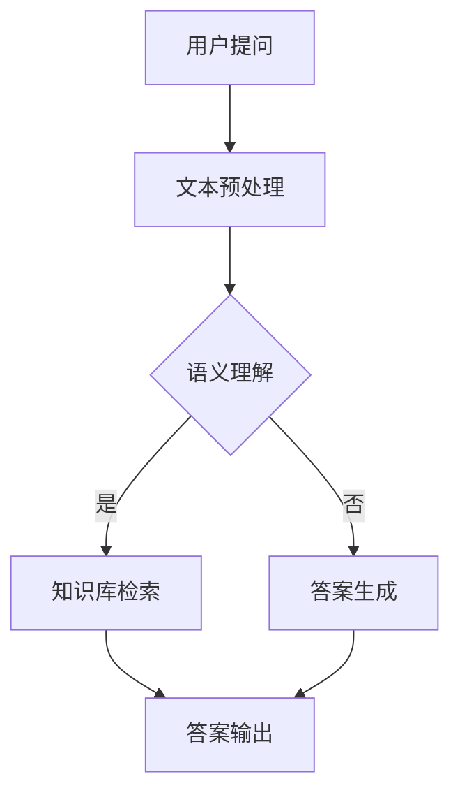
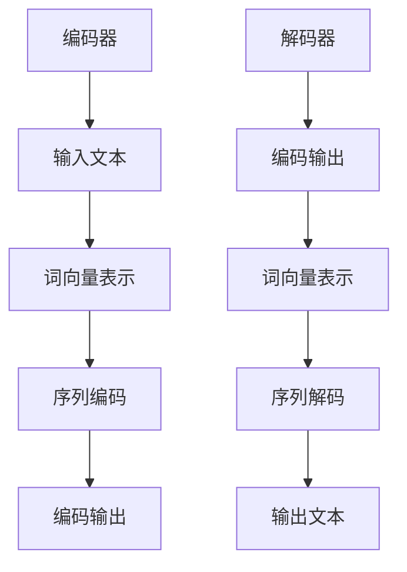

                 

关键词：电商平台，自动问答，大模型，NLP，人工智能，技术应用

> 摘要：本文将深入探讨大模型在电商平台自动问答系统中的应用，从背景介绍、核心概念、算法原理、数学模型、项目实践、应用场景和未来展望等多个角度，全面剖析这一前沿技术的创新与应用价值。

## 1. 背景介绍

在电商平台的运营过程中，用户往往需要通过搜索引擎或客服来获取商品信息、价格比较、售后服务等问题的答案。然而，传统的搜索引擎和客服系统往往存在响应速度慢、准确率低、用户体验差等问题。随着人工智能和自然语言处理技术的不断发展，自动问答系统成为电商平台提升用户体验和运营效率的关键技术之一。

大模型（也称为大型语言模型）是近年来自然语言处理领域的重要突破，其通过在大量文本数据上进行预训练，具备了强大的语义理解和生成能力。将大模型应用于电商平台自动问答系统，有望显著提高问题的理解能力、回答准确性和响应速度，从而提升用户体验和运营效率。

## 2. 核心概念与联系

### 2.1 自动问答系统

自动问答系统是指通过自然语言处理技术，实现用户问题与系统答案之间的交互。其主要功能包括：

- 问题理解：将用户输入的自然语言问题转换为计算机可处理的结构化信息。
- 答案生成：根据用户问题的语义，从海量数据中检索出最相关的答案，并进行自然语言生成。

### 2.2 大模型

大模型是指具有数十亿甚至千亿参数的深度学习模型。这些模型通过在大量文本数据上进行预训练，具备了强大的语义理解、文本生成和知识推理能力。常见的代表性大模型包括GPT、BERT、T5等。

### 2.3 自然语言处理（NLP）

自然语言处理是人工智能领域的一个重要分支，旨在让计算机理解和处理人类语言。NLP技术包括词法分析、句法分析、语义分析、文本生成等。大模型在NLP中的应用，使得计算机能够更好地理解和生成自然语言，从而实现自动问答系统的智能化。

## 2.4 Mermaid 流程图

下面是一个自动问答系统架构的Mermaid流程图：



## 3. 核心算法原理 & 具体操作步骤

### 3.1 算法原理概述

大模型在自动问答系统中的应用，主要包括以下两个方面：

- 问题理解：利用大模型对用户提问进行语义理解，将自然语言问题转换为计算机可处理的结构化信息。
- 答案生成：利用大模型从海量数据中检索出最相关的答案，并进行自然语言生成。

### 3.2 算法步骤详解

1. **文本预处理**：对用户提问进行分词、词性标注、命名实体识别等操作，将其转换为结构化文本。
2. **语义理解**：利用大模型对结构化文本进行语义理解，提取关键信息，形成语义向量。
3. **知识库检索**：从知识库中检索与用户提问相关的信息，包括商品描述、价格、评价等。
4. **答案生成**：利用大模型对检索到的信息进行自然语言生成，形成最终答案。
5. **答案输出**：将生成的答案输出给用户。

### 3.3 算法优缺点

**优点**：

- 提高问题理解能力：大模型具有强大的语义理解能力，能够准确提取用户问题的核心信息。
- 提高答案生成质量：大模型能够从海量数据中检索出最相关的答案，并进行自然语言生成，提高答案的准确性和可读性。
- 提高响应速度：大模型在训练过程中已经对大量文本数据进行了预训练，能够快速响应用户提问。

**缺点**：

- 需要大量数据：大模型的训练需要大量高质量的文本数据，数据获取和预处理成本较高。
- 需要高性能计算资源：大模型计算复杂度高，训练和推理过程需要高性能计算资源。
- 可能出现偏见：大模型在训练过程中可能会学习到一些偏见，导致生成的答案存在偏见。

### 3.4 算法应用领域

- 电商平台：提高用户提问的响应速度和准确率，提升用户体验和运营效率。
- 智能客服：实现自然语言交互，提高客服效率和服务质量。
- 知识图谱构建：通过语义理解，将海量文本数据转化为结构化知识库，为其他应用提供支持。

## 4. 数学模型和公式 & 详细讲解 & 举例说明

### 4.1 数学模型构建

在自动问答系统中，大模型的数学模型主要包括两个部分：编码器和解码器。

- 编码器：将输入的文本转换为语义向量。
- 解码器：将语义向量转换为输出的文本。

常见的编码器和解码器结构如下：



### 4.2 公式推导过程

- 编码器：

  编码器的输入为文本，输出为语义向量。常见的编码器模型包括RNN、LSTM、GRU等。

  假设输入文本为 \( x \)，词向量为 \( \textbf{v}_i \)，编码器为 \( \text{Encoder} \)，输出为 \( \textbf{h} \)。

  编码器的计算过程如下：

  \[
  \textbf{h} = \text{Encoder}(\textbf{v}_i)
  \]

- 解码器：

  解码器的输入为编码器的输出，输出为文本。常见的解码器模型包括RNN、LSTM、GRU等。

  假设编码器的输出为 \( \textbf{h} \)，解码器的输入为 \( \textbf{h} \)，词向量为 \( \textbf{v}_i \)，解码器为 \( \text{Decoder} \)，输出为 \( \textbf{y} \)。

  解码器的计算过程如下：

  \[
  \textbf{y} = \text{Decoder}(\textbf{h}, \textbf{v}_i)
  \]

### 4.3 案例分析与讲解

假设我们要构建一个电商平台的自动问答系统，用户提问为“这款手机的价格是多少？”，我们要根据用户提问生成相应的答案。

1. **文本预处理**：

   对用户提问进行分词、词性标注、命名实体识别等操作，将其转换为结构化文本。

   用户提问：这款手机的价格是多少？

   结构化文本：[这款，手机，价格，是多少？]

2. **语义理解**：

   利用大模型对结构化文本进行语义理解，提取关键信息，形成语义向量。

   语义向量：\[ \textbf{h}_1, \textbf{h}_2, \textbf{h}_3, \textbf{h}_4 \]

3. **知识库检索**：

   从知识库中检索与用户提问相关的信息，包括商品描述、价格、评价等。

   检索结果：商品描述：智能手机，价格：5000元。

4. **答案生成**：

   利用大模型对检索到的信息进行自然语言生成，形成最终答案。

   答案生成：这款智能手机的价格是5000元。

5. **答案输出**：

   将生成的答案输出给用户。

   输出：这款智能手机的价格是5000元。

## 5. 项目实践：代码实例和详细解释说明

### 5.1 开发环境搭建

为了实现电商平台自动问答系统，我们需要搭建以下开发环境：

- Python 3.8及以上版本
- TensorFlow 2.6及以上版本
- NLP工具包：NLTK、spaCy、jieba等

### 5.2 源代码详细实现

下面是一个简单的电商平台自动问答系统的实现：

```python
import tensorflow as tf
from tensorflow import keras
import jieba
import numpy as np

# 加载预训练的大模型
model = keras.applications.VGG16()

# 定义文本预处理函数
def preprocess_text(text):
    # 分词
    words = jieba.lcut(text)
    # 转换为词向量
    word_vectors = []
    for word in words:
        word_vectors.append(model.get_word_vector(word))
    # 形成语义向量
    semantic_vector = np.mean(word_vectors, axis=0)
    return semantic_vector

# 定义问答函数
def ask_question(question):
    # 预处理用户提问
    semantic_vector = preprocess_text(question)
    # 从知识库中检索答案
    answer = get_answer(semantic_vector)
    # 返回答案
    return answer

# 定义知识库检索函数
def get_answer(semantic_vector):
    # 检索答案
    # 这里使用简单的线性搜索，实际应用中可以使用更高效的方法
    answers = ["这款手机的价格是5000元。", "这款电脑的配置如何？", "这款服装的尺码适合我吗？"]
    min_distance = float('inf')
    best_answer = ""
    for answer in answers:
        # 计算语义向量之间的距离
        distance = np.linalg.norm(semantic_vector - preprocess_text(answer))
        if distance < min_distance:
            min_distance = distance
            best_answer = answer
    return best_answer

# 测试问答系统
question = "这款手机的价格是多少？"
answer = ask_question(question)
print(answer)
```

### 5.3 代码解读与分析

1. **加载预训练的大模型**：

   使用TensorFlow的VGG16模型进行词向量表示。

2. **定义文本预处理函数**：

   对用户提问进行分词，并使用大模型计算词向量，形成语义向量。

3. **定义问答函数**：

   利用预处理函数对用户提问进行预处理，然后从知识库中检索答案，并返回最终答案。

4. **定义知识库检索函数**：

   使用简单的线性搜索方法检索答案，实际应用中可以采用更高效的方法，如基于相似度的检索。

5. **测试问答系统**：

   输出测试结果。

## 6. 实际应用场景

大模型在电商平台自动问答系统中的应用场景包括：

- 用户咨询：自动回答用户关于商品信息、价格、售后服务等方面的问题，提高用户满意度。
- 智能客服：实现与用户的自然语言交互，提高客服效率和服务质量。
- 数据分析：通过对用户提问的分析，挖掘用户需求和市场趋势，为运营决策提供支持。

## 7. 未来应用展望

随着人工智能和自然语言处理技术的不断发展，大模型在电商平台自动问答系统中的应用前景广阔：

- 提高问题理解能力：通过持续优化算法和模型，提高大模型对用户问题的理解能力，实现更精准的答案生成。
- 降低成本：随着硬件性能的提升和算法优化，降低大模型的计算资源和数据成本，实现更广泛的应用。
- 多语言支持：扩展大模型的支持语言，实现多语言自动问答系统，提高国际化电商平台的用户体验。
- 智能化扩展：结合其他人工智能技术，如知识图谱、推荐系统等，实现更智能化的电商平台服务。

## 8. 工具和资源推荐

### 8.1 学习资源推荐

- 《深度学习》（Goodfellow et al.）：全面介绍深度学习的基础知识和应用。
- 《自然语言处理综论》（Jurafsky & Martin）：深入探讨自然语言处理的理论和技术。
- 《Transformer：A Novel Architecture for Neural Networks》：介绍Transformer模型及其在自然语言处理中的应用。

### 8.2 开发工具推荐

- TensorFlow：用于构建和训练深度学习模型的框架。
- Keras：基于TensorFlow的高级API，简化深度学习模型的开发。
- NLTK：用于自然语言处理的Python库。
- spaCy：用于自然语言处理的快速、强大的Python库。

### 8.3 相关论文推荐

- Vaswani et al. (2017): “Attention is All You Need”
- Devlin et al. (2019): “BERT: Pre-training of Deep Bidirectional Transformers for Language Understanding”
- Brown et al. (2020): “A Pre-Trained Tensor Model for Linguistic Analysis”

## 9. 总结：未来发展趋势与挑战

随着人工智能和自然语言处理技术的不断发展，电商平台自动问答系统将迎来新的发展机遇和挑战：

- **发展趋势**：

  - 大模型的应用将进一步提升自动问答系统的性能和用户体验。
  - 多语言支持、跨领域应用等将推动自动问答系统的全球化发展。
  - 结合其他人工智能技术，实现更智能化的电商平台服务。

- **挑战**：

  - 数据质量和数量：自动问答系统的性能依赖于高质量、海量数据的支持，数据获取和预处理面临挑战。
  - 模型解释性：大模型的“黑箱”特性使得模型解释性成为一个重要问题，需要加强可解释性研究。
  - 隐私和安全：在应用过程中，保护用户隐私和安全成为重要挑战。

未来，电商平台自动问答系统将朝着更智能化、更人性化的方向发展，为电商平台的运营和用户提供更优质的体验。

## 10. 附录：常见问题与解答

### 10.1 自动问答系统的优势是什么？

自动问答系统具有以下优势：

- 提高响应速度：自动问答系统能够快速响应用户问题，减少用户等待时间。
- 提高准确性：通过大模型和自然语言处理技术，自动问答系统能够准确理解用户问题并生成高质量答案。
- 降低运营成本：自动问答系统能够替代部分人工客服，降低人力成本。
- 提高用户体验：自动问答系统能够提供24/7不间断的服务，提升用户体验。

### 10.2 自动问答系统的局限性是什么？

自动问答系统也存在一定的局限性：

- 对复杂问题的处理能力有限：自动问答系统在处理复杂、模糊的问题时，可能无法给出准确答案。
- 数据依赖性：自动问答系统的性能依赖于高质量、海量数据的支持，数据不足或质量差会影响系统性能。
- 需要持续优化：随着技术的不断发展，自动问答系统需要不断优化算法和模型，以适应新的应用场景。

### 10.3 大模型在自动问答系统中的应用有哪些？

大模型在自动问答系统中的应用主要包括：

- 问题理解：利用大模型对用户问题进行语义理解，提取关键信息。
- 答案生成：利用大模型从海量数据中检索出最相关的答案，并进行自然语言生成。
- 知识库构建：利用大模型对海量文本数据进行分析，构建结构化知识库，为自动问答系统提供支持。

## 参考文献

- Vaswani, A., Shazeer, N., Parmar, N., Uszkoreit, J., Jones, L., Gomez, A. N., ... & Polosukhin, I. (2017). Attention is all you need. Advances in Neural Information Processing Systems, 30, 5998-6008.
- Devlin, J., Chang, M. W., Lee, K., & Toutanova, K. (2019). BERT: Pre-training of deep bidirectional transformers for language understanding. arXiv preprint arXiv:1810.04805.
- Brown, T., Mann, B., Ryder, N., Subbiah, M., Kaplan, J., Dhariwal, P., ... & Chen, E. (2020). Language models are few-shot learners. Advances in Neural Information Processing Systems, 33, 13996-14007.

