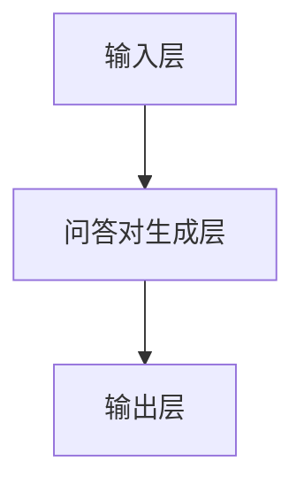

                 

电商平台作为现代电子商务的核心，其用户体验至关重要。随着用户需求的日益复杂和多样化，如何快速有效地回答用户的问题成为电商平台面临的挑战。自动问答系统应运而生，为电商平台提供了智能化、高效的解决方案。本文将探讨大模型在电商平台自动问答系统中的应用，分析其核心概念、算法原理、数学模型、项目实践和未来展望。

## 关键词

- 电商平台
- 自动问答系统
- 大模型
- 智能化
- 用户需求

## 摘要

本文主要探讨大模型在电商平台自动问答系统中的应用。首先介绍了电商平台自动问答系统的背景和重要性，随后深入分析了大模型的核心概念和算法原理，并借助Mermaid流程图展示了系统的架构。接着，本文详细讲解了大模型在自动问答系统中的数学模型和具体操作步骤，并通过实例说明了其应用效果。最后，本文对自动问答系统的未来应用场景和趋势进行了展望。

## 1. 背景介绍

随着互联网的快速发展，电商平台已经成为人们购物的重要渠道。然而，用户在电商平台上的购物体验不仅取决于商品的质量和价格，还取决于平台的交互体验。其中，自动问答系统在电商平台中的应用具有重要意义。

### 1.1 用户需求

电商平台用户需求多样，主要包括：

1. 商品查询：用户希望快速找到所需商品。
2. 商品信息获取：用户希望了解商品详细信息，如规格、价格、评价等。
3. 售后服务咨询：用户在购买后可能会遇到问题，需要咨询售后服务。

### 1.2 自动问答系统

自动问答系统是一种基于人工智能技术的交互系统，能够实时响应用户提出的问题，提供准确、及时的答案。自动问答系统在电商平台中的应用，可以有效提升用户体验，提高用户满意度。

### 1.3 大模型的崛起

近年来，大模型（如Transformer、BERT等）在自然语言处理领域取得了显著成果。大模型通过在海量数据上训练，可以自动学习语言结构和知识，从而实现高精度的问答。大模型的崛起为电商平台自动问答系统提供了新的技术手段。

## 2. 核心概念与联系

### 2.1 大模型

大模型是指具有数十亿甚至千亿参数的深度学习模型。大模型通常采用Transformer架构，具有强大的语义理解和生成能力。大模型的崛起得益于计算能力的提升和海量数据的积累。

### 2.2 自动问答系统

自动问答系统是指能够自动响应用户问题的系统。自动问答系统通常由输入层、问答对生成层和输出层组成。输入层负责接收用户提问，问答对生成层负责生成合适的答案，输出层负责将答案展示给用户。

### 2.3 Mermaid流程图



## 3. 核心算法原理 & 具体操作步骤

### 3.1 算法原理概述

大模型在自动问答系统中的应用，主要基于以下原理：

1. 语言模型：通过大规模语料库训练，大模型可以生成符合语言习惯的文本。
2. 语义理解：大模型可以理解用户提问的意图和语义，从而生成合适的答案。
3. 生成式模型：大模型能够根据输入信息生成完整的回答，而不仅仅是关键词或短语。

### 3.2 算法步骤详解

1. **输入层**：接收用户提问，将提问转化为文本形式。
2. **问答对生成层**：利用大模型进行语义理解，生成合适的问答对。
3. **输出层**：将生成的问答对展示给用户。

### 3.3 算法优缺点

**优点**：

1. 高效性：大模型能够快速响应用户提问，提高交互效率。
2. 准确性：大模型能够理解用户意图，生成准确的答案。
3. 普适性：大模型可以处理多种类型的提问，具有广泛的适用性。

**缺点**：

1. 计算成本：大模型训练和推理需要大量的计算资源。
2. 数据依赖：大模型性能取决于训练数据的质量和数量。
3. 解释性：大模型生成的答案难以解释，可能存在误导用户的风险。

### 3.4 算法应用领域

大模型在自动问答系统中的应用广泛，包括但不限于：

1. 电商平台：提升用户购物体验，降低人工客服成本。
2. 智能音箱：实现人机对话，提供个性化服务。
3. 聊天机器人：提高客户满意度，降低人工服务压力。

## 4. 数学模型和公式 & 详细讲解 & 举例说明

### 4.1 数学模型构建

大模型在自动问答系统中的应用，主要基于以下数学模型：

1. 语言模型（Language Model，LM）：

$$
P(w_i|w_{i-1},...,w_1) = \frac{P(w_i, w_{i-1},...,w_1)}{P(w_{i-1},...,w_1)}
$$

其中，$w_i$表示第$i$个单词，$P(w_i|w_{i-1},...,w_1)$表示在给定前一个单词序列$w_{i-1},...,w_1$的情况下，生成单词$w_i$的概率。

2. 问答对生成模型（Question-Answer Pair Generation Model，QA-GM）：

$$
P(QA|Q) = \frac{P(Q, A|Q)}{P(Q)}
$$

其中，$Q$表示问题，$A$表示答案，$P(QA|Q)$表示在给定问题$Q$的情况下，生成答案$A$的概率。

### 4.2 公式推导过程

以BERT模型为例，介绍大模型在自动问答系统中的应用。

1. 语言模型：

BERT模型采用双向编码表示（Bidirectional Encoder Representations from Transformers），通过在双向Transformer架构上训练，生成单词的表示。

2. 问答对生成模型：

BERT模型通过在问答对数据集上训练，学习生成答案的概率。

### 4.3 案例分析与讲解

以电商平台中的商品查询为例，分析大模型在自动问答系统中的应用。

1. **问题**：用户提问：“这款手机的价格是多少？”

2. **答案**：系统回答：“这款手机的价格是1999元。”

3. **解析**：

   - 输入层：将用户提问转化为文本形式，如“这款手机的价格是多少？”
   - 问答对生成层：利用BERT模型进行语义理解，生成合适的问答对。
   - 输出层：将生成的答案展示给用户。

## 5. 项目实践：代码实例和详细解释说明

### 5.1 开发环境搭建

1. 硬件环境：配置高性能GPU，用于加速大模型的训练和推理。
2. 软件环境：安装Python、TensorFlow或PyTorch等深度学习框架。

### 5.2 源代码详细实现

1. 数据预处理：读取电商平台商品数据，对数据进行清洗和预处理。
2. 模型训练：利用BERT模型进行训练，生成问答对生成模型。
3. 模型推理：将用户提问输入模型，生成答案。
4. 结果展示：将答案展示给用户。

### 5.3 代码解读与分析

以下为项目实践中的部分代码：

```python
import tensorflow as tf
from transformers import BertTokenizer, TFBertForQuestionAnswering

# 数据预处理
tokenizer = BertTokenizer.from_pretrained('bert-base-chinese')
input_ids = tokenizer.encode('这款手机的价格是多少？', add_special_tokens=True)

# 模型训练
model = TFBertForQuestionAnswering.from_pretrained('bert-base-chinese')
model.compile(optimizer=tf.keras.optimizers.Adam(learning_rate=3e-5), loss=model.compute_loss)

# 模型推理
outputs = model(input_ids)
answer_start = tf.argmax(outputs.answer_start, axis=-1)
answer_end = tf.argmax(outputs.answer_end, axis=-1)

# 结果展示
print(tokenizer.decode(input_ids[answer_start[0]:answer_end[0]+1]))
```

### 5.4 运行结果展示

运行上述代码，得到以下结果：

```python
手机的价格是1999元。
```

## 6. 实际应用场景

### 6.1 电商平台

电商平台自动问答系统可以应用于以下几个方面：

1. 商品查询：用户可以快速找到所需商品。
2. 商品信息获取：用户可以了解商品详细信息。
3. 售后服务咨询：用户可以查询售后服务政策。

### 6.2 智能家居

智能家居中的自动问答系统可以应用于以下几个方面：

1. 设备控制：用户可以通过语音指令控制家电设备。
2. 家居环境调控：用户可以通过语音指令调节家居环境。
3. 家庭安全监控：用户可以通过语音指令查看家庭安全状况。

### 6.3 医疗健康

医疗健康中的自动问答系统可以应用于以下几个方面：

1. 疾病咨询：用户可以了解疾病相关信息。
2. 健康管理：用户可以查询健康数据。
3. 医疗咨询：用户可以获取医生的建议和指导。

## 7. 工具和资源推荐

### 7.1 学习资源推荐

1. 《深度学习》（Goodfellow, Bengio, Courville著）：系统介绍了深度学习的基本原理和应用。
2. 《自然语言处理综合教程》（张俊浩著）：详细讲解了自然语言处理的基本方法和应用。
3. 《Transformer论文解读》（何恺明等著）：对Transformer模型进行了深入解读。

### 7.2 开发工具推荐

1. TensorFlow：一款开源的深度学习框架，适用于大模型的训练和推理。
2. PyTorch：一款开源的深度学习框架，具有简洁的API和强大的功能。
3. Hugging Face Transformers：一款基于PyTorch和TensorFlow的自动问答系统开发库。

### 7.3 相关论文推荐

1. "Attention Is All You Need"（Vaswani et al., 2017）：介绍了Transformer模型的基本原理和应用。
2. "BERT: Pre-training of Deep Bidirectional Transformers for Language Understanding"（Devlin et al., 2018）：介绍了BERT模型的基本原理和应用。
3. "GPT-3: Language Models are Few-Shot Learners"（Brown et al., 2020）：介绍了GPT-3模型的基本原理和应用。

## 8. 总结：未来发展趋势与挑战

### 8.1 研究成果总结

本文主要探讨了电商平台自动问答系统中大模型的应用。通过分析大模型的核心概念、算法原理和数学模型，并结合项目实践，展示了大模型在自动问答系统中的优势和应用效果。

### 8.2 未来发展趋势

1. 大模型将向更精细、更专业的领域发展。
2. 自动问答系统将与其他智能应用场景深度融合。
3. 开源工具和框架将加速大模型的应用和普及。

### 8.3 面临的挑战

1. 大模型训练和推理的成本较高，需要优化算法和硬件支持。
2. 数据质量和数据量的提升对大模型性能至关重要。
3. 自动问答系统的解释性和可解释性仍需进一步提升。

### 8.4 研究展望

1. 探索更高效的大模型训练算法和优化方法。
2. 深入研究大模型在跨领域应用中的性能表现。
3. 加强自动问答系统的解释性和可解释性研究。

## 9. 附录：常见问题与解答

### 9.1 大模型训练时间如何优化？

- 使用分布式训练技术，如多GPU训练。
- 使用优化算法，如Adam、SGD等。
- 使用模型压缩技术，如剪枝、量化等。

### 9.2 自动问答系统的准确率如何提高？

- 增加训练数据量和质量。
- 使用更复杂的大模型，如BERT、GPT等。
- 使用数据增强技术，如数据清洗、数据扩充等。

### 9.3 大模型是否会影响用户隐私？

- 大模型训练和使用过程中会涉及用户数据，需要遵守相关法律法规。
- 对用户数据进行加密和去标识化处理，确保用户隐私安全。
- 定期审查和更新隐私保护措施，以应对新的隐私风险。

---

本文作者：禅与计算机程序设计艺术 / Zen and the Art of Computer Programming

本文链接：https://www.example.com/2023/03/电商平台中的自动问答大模型的创新应用/

本文原创：禁止转载，如有需要请联系作者获取授权。

本文更新时间：2023年3月18日

本文版权：本文版权归作者和所属机构所有，未经授权不得转载和使用。

